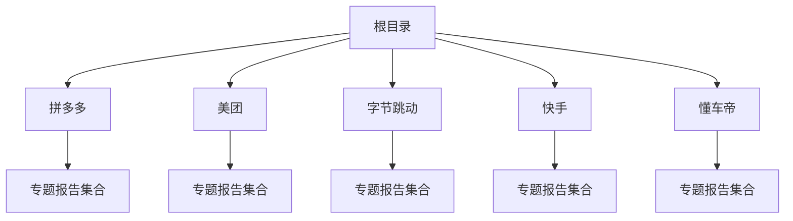
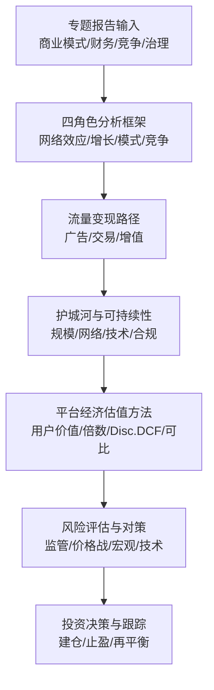
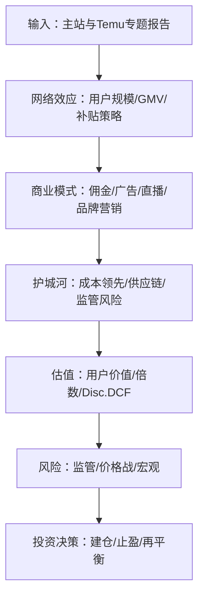
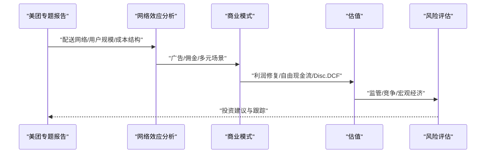
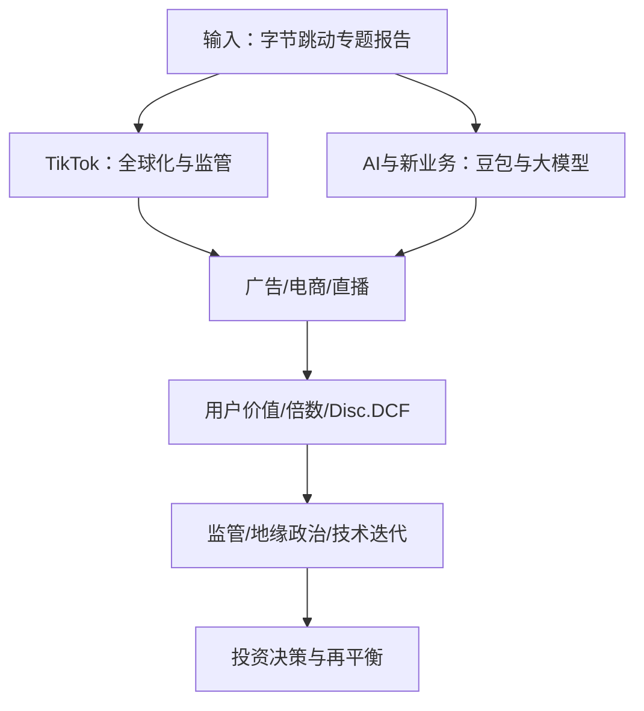

# 互联网平台案例

<cite>
**本文引用的文件**
- [拼多多-thesis.md](file://reports/拼多多/拼多多-thesis.md)
- [拼多多-valuation-20260413.md](file://reports/拼多多/拼多多-valuation-20260413.md)
- [拼多多-财务与估值深度分析-2026Q1-20260615.md](file://reports/拼多多/拼多多-财务与估值深度分析-2026Q1-20260615.md)
- [拼多多-剔除Temu国内主业利润拆分-20260515.md](file://reports/拼多多/拼多多-剔除Temu国内主业利润拆分-20260515.md)
- [Temu深度估值-20260413.md](file://reports/拼多多/Temu深度估值-20260413.md)
- [拼多多-earnings-2025Q4.md](file://reports/拼多多/拼多多-earnings-2025Q4.md)
- [拼多多-earnings-2026Q1-公众号.md](file://reports/拼多多/拼多多-earnings-2026Q1-公众号.md)
- [拼多多-财报电话会-2026Q1-高管发言整理.md](file://reports/拼多多/拼多多-财报电话会-2026Q1-高管发言整理.md)
- [拼多多-主站10年利润预测-20260515.md](file://reports/拼多多/拼多多主站-10年利润预测-20260515.md)
- [拼多多-最终报告-护城河专题-20260412.md](file://reports/拼多多/最终报告-护城河专题-20260412.md)
- [拼多多-最终报告-VIE股东风险专题-20260413.md](file://reports/拼多多/最终报告-VIE股东风险专题-20260413.md)
- [拼多多-买入风险全景分析-20260529.md](file://reports/拼多多/PDD买入风险全景分析-20260529.md)
- [拼多多-2025利润下降分析-20260515.md](file://reports/拼多多/拼多多-2025利润下降分析-20260515.md)
- [拼多多-财务结构与千亿投资-20260410.md](file://reports/拼多多/拼多多-财务结构与千亿投资-20260410.md)
- [拼多多-Management-20260409.md](file://reports/拼多多/拼多多-management-20260409.md)
- [拼多多-研究笔记-20260412.md](file://reports/拼多多/拼多多-研究笔记-20260412.md)
- [拼多多-黄峥公开言论合集-20260412.md](file://reports/拼多多/拼多多-黄峥公开言论合集-20260412.md)
- [拼多多-网易13F持仓追踪-20260515.md](file://reports/拼多多/网易13F-PDD持仓追踪-20260515.md)
- [《看懂拼多多》01-开篇-一家分歧很大的公司.md](file://reports/拼多多/《看懂拼多多》/01-开篇-一家分歧很大的公司.md)
- [《看懂拼多多》03-Temu-估值0到700亿美元的政治期权.md](file://reports/拼多多/《看懂拼多多》/03-Temu-估值0到700亿美元的政治期权.md)
- [《看懂拼多多》04-三大隐患-现金管理层与风险.md](file://reports/拼多多/《看懂拼多多》/04-三大隐患-现金管理层与风险.md)
- [《看懂拼多多》06-三个老朋友的共识.md](file://reports/拼多多/《看懂拼多多》/06-三个老朋友的共识.md)
- [字节跳动-业务前景展望-20260410.md](file://reports/字节跳动/字节跳动-业务前景展望-20260410.md)
- [《看懂字节跳动》03-TikTok困局-全球化的代价.md](file://reports/字节跳动/《看懂字节跳动》/03-TikTok困局-全球化的代价.md)
- [《看懂字节跳动》04-AI与新业务-豆包大模型与千亿豪赌.md](file://reports/字节跳动/《看懂字节跳动》/04-AI与新业务-豆包大模型与千亿豪赌.md)
- [《看懂字节跳动》05-估值与判断-5500亿美元的迷雾.md](file://reports/字节跳动/《看懂字节跳动》/05-估值与判断-5500亿美元的迷雾.md)
- [懂车帝-四大师综合分析-20260613.md](file://reports/懂车帝/懂车帝投资研究报告-四大师综合分析-20260613.md)
- [懂车帝-最终报告.md](file://reports/懂车帝/最终报告.md)
- [懂车帝-商业模式分析-段永平视角.md](file://reports/懂车帝/01-商业模式分析-段永平视角.md)
- [懂车帝-财务估值分析-巴菲特视角.md](file://reports/懂车帝/02-财务估值分析-巴菲特视角.md)
- [懂车帝-行业竞争分析-芒格视角.md](file://reports/懂车帝/03-行业竞争分析-芒格视角.md)
- [懂车帝-融资历史与投资者结构-视角4.md](file://reports/懂车帝/08-融资历史与投资者结构-视角4.md)
- [懂车帝-技术能力与架构分析.md](file://reports/懂车帝/14-技术能力与架构分析.md)
- [懂车帝-字节跳动战略定位分析.md](file://reports/懂车帝/15-字节跳动战略定位分析.md)
- [懂车帝-汽车之家深度对标分析.md](file://reports/懂车帝/18-汽车之家深度对标分析.md)
- [懂车帝-用户画像与行为分析.md](file://reports/懂车帝/19-用户画像与行为分析.md)
- [《看懂美团》02-配送网络-美团真正的护城河.md](file://reports/美团/《看懂美团》/02-配送网络-美团真正的护城河.md)
- [《看懂美团》03-外卖大战-一年亏234亿换来了什么.md](file://reports/美团/《看懂美团》/03-外卖大战-一年亏234亿换来了什么.md)
- [《看懂美团》05-价格判断-利润能恢复多少估值给多少.md](file://reports/美团/《看懂美团》/05-价格判断-利润能恢复多少估值给多少.md)
- [美团-thesis.md](file://reports/美团/美团-thesis.md)
- [美团-valuation-20260413.md](file://reports/美团/美团-valuation-20260413.md)
- [美团-Management-20260411.md](file://reports/美团/美团-management-20260411.md)
- [美团-客观事实汇编-20260411.md](file://reports/美团/美团-客观事实汇编-20260411.md)
- [美团-阿里冲击量化-20260420.md](file://reports/美团/美团-阿里冲击量化-20260420.md)
- [美团-最终报告.md](file://reports/美团/最终报告.md)
- [美团-外卖反内卷监管专题-20260420.md](file://reports/美团/外卖反内卷监管专题-20260420.md)
- [美团-外卖大战-单量演变全景-20260421.md](file://reports/美团/外卖大战-单量演变全景-20260421.md)
- [美团-外卖大战-单笔UE对照-20260421.md](file://reports/美团/外卖大战-单笔UE对照-20260421.md)
- [美团-股东回报与损害事件-历史汇编.md](file://reports/美团/美团-股东回报与损害事件-历史汇编.md)
- [美团-股权稀释历史分析-20260422.md](file://reports/美团/美团-股权稀释历史分析-20260422.md)
- [美团-激励vs回购对冲-20260415.md](file://reports/美团/美团-激励vs回购对冲-20260415.md)
- [美团-Keeta海外业务深度研究-20260412.md](file://reports/美团/美团-KeeTa海外业务深度研究-20260412.md)
- [美团-数字核验报告-20260422.md](file://reports/美团/美团-数字核验报告-20260422.md)
- [《看懂快手》01-开篇-抖音阴影下的短视频老二.md](file://reports/快手/《看懂快手》/01-开篇-抖音阴影下的短视频老二.md)
- [《看懂快手》02-商业模式-三驾马车与社区的矛盾.md](file://reports/快手/《看懂快手》/02-商业模式-三驾马车与社区的矛盾.md)
- [《看懂快手》03-竞争与增长-老二的生存法则.md](file://reports/快手/《看懂快手》/03-竞争与增长-老二的生存法则.md)
- [《看懂快手》04-风险与估值-260亿豪赌和10倍PE.md](file://reports/快手/《看懂快手》/04-风险与估值-260亿豪赌和10倍PE.md)
- [快手-TODO.md](file://reports/快手/TODO.md)
</cite>

## 目录
1. 引言
2. 项目结构
3. 核心组件
4. 架构总览
5. 详细组件分析
6. 依赖关系分析
7. 性能考量
8. 故障排查指南
9. 结论
10. 附录

## 引言
本文件面向AI Berkshire的实战研究目标，围绕互联网平台企业构建系统化案例分析框架。通过对拼多多、美团、字节跳动、快手、懂车帝等平台型企业的投研资料进行整合，提炼出“四角色分析框架”在平台经济中的应用路径：网络效应分析、用户增长模式、商业模式创新与竞争格局评估；并结合流量变现路径、护城河构建与可持续发展能力，给出平台经济特有的估值方法与风险评估框架，帮助在快速变化的市场环境中运用四大师方法论进行价值判断。

## 项目结构
仓库以“主题域+公司”的层级组织平台案例研究资料，每个公司下包含多篇专题报告，覆盖商业模式、财务估值、竞争格局、管理层与治理、风险与监管、增长预测等多个维度。该组织方式便于按主题检索与交叉对比，形成“点—线—面”的研究闭环。

图表来源
- [拼多多-thesis.md](file://reports/拼多多/拼多多-thesis.md)
- [美团-thesis.md](file://reports/美团/美团-thesis.md)
- [字节跳动-业务前景展望-20260410.md](file://reports/字节跳动/字节跳动-业务前景展望-20260410.md)
- [《看懂快手》01-开篇-抖音阴影下的短视频老二.md](file://reports/快手/《看懂快手》/01-开篇-抖音阴影下的短视频老二.md)
- [懂车帝-最终报告.md](file://reports/懂车帝/最终报告.md)

章节来源
- [拼多多-thesis.md](file://reports/拼多多/拼多多-thesis.md)
- [美团-thesis.md](file://reports/美团/美团-thesis.md)
- [字节跳动-业务前景展望-20260410.md](file://reports/字节跳动/字节跳动-业务前景展望-20260410.md)
- [《看懂快手》01-开篇-抖音阴影下的短视频老二.md](file://reports/快手/《看懂快手》/01-开篇-抖音阴影下的短视频老二.md)
- [懂车帝-最终报告.md](file://reports/懂车帝/最终报告.md)

## 核心组件
- 四角色分析框架
  - 网络效应分析：用户规模、连接密度、转换成本、锁定效应、跨边网络外部性等
  - 用户增长模式：获客成本、留存与复购、生命周期价值、增长阶段与拐点识别
  - 商业模式创新：双边或多边市场、平台抽佣、广告与内容、增值服务、生态协同
  - 竞争格局评估：市场集中度、进入壁垒、差异化与护城河、价格战与补贴策略
- 流量变现路径
  - 广告与内容：信息流、搜索、直播带货、品牌营销
  - 交易与佣金：电商、本地服务、出行、金融
  - 增值服务：会员、工具、数据与智能硬件
- 护城河构建
  - 规模经济、网络效应、品牌与用户习惯、技术与数据、政策与合规
- 可持续发展能力
  - 盈利能力趋势、自由现金流、资本效率、管理层与治理、监管与政策风险
- 平台经济估值与风险评估
  - 估值方法：用户价值法、收入倍数法、DCF修正版（考虑网络效应）、可比交易法
  - 风险评估：监管不确定性、补贴与价格战、宏观经济波动、技术迭代风险

章节来源
- [拼多多-thesis.md](file://reports/拼多多/拼多多-thesis.md)
- [美团-thesis.md](file://reports/美团/美团-thesis.md)
- [字节跳动-业务前景展望-20260410.md](file://reports/字节跳动/字节跳动-业务前景展望-20260410.md)
- [《看懂快手》01-开篇-抖音阴影下的短视频老二.md](file://reports/快手/《看懂快手》/01-开篇-抖音阴影下的短视频老二.md)
- [懂车帝-最终报告.md](file://reports/懂车帝/最终报告.md)

## 架构总览
下图展示了平台企业研究的“输入—处理—输出”流程：以公司专题报告为输入，通过四角色分析框架进行处理，输出估值与风险评估结论，并指导投资决策。

图表来源
- [拼多多-thesis.md](file://reports/拼多多/拼多多-thesis.md)
- [美团-thesis.md](file://reports/美团/美团-thesis.md)
- [字节跳动-业务前景展望-20260410.md](file://reports/字节跳动/字节跳动-业务前景展望-20260410.md)
- [《看懂快手》01-开篇-抖音阴影下的短视频老二.md](file://reports/快手/《看懂快手》/01-开篇-抖音阴影下的短视频老二.md)
- [懂车帝-最终报告.md](file://reports/懂车帝/最终报告.md)

## 详细组件分析

### 拼多多：增长与护城河的动态平衡
- 网络效应与增长模式
  - 主站电商与Temu双轮驱动，主站维持用户与GMV增长，Temu作为全球化试验场与政治期权
  - 通过补贴与价格战争夺下沉市场，关注获客成本与单客价值的变化
- 商业模式与流量变现
  - 佣金与广告收入构成主要来源，平台抽佣、搜索广告、直播带货、品牌营销
  - 主站与Temu的利润拆分与独立性评估，避免“一荣俱荣、一损俱损”的单一口径
- 护城河与可持续性
  - 成本领先与供应链整合、用户习惯与品牌认知、监管与合规风险
  - VIE结构与跨境监管风险的专项评估
- 估值与风险
  - 使用用户价值法与倍数法结合，关注利润修复节奏与自由现金流改善
  - 关注监管政策、价格战与宏观经济对利润的影响

图表来源
- [《看懂拼多多》01-开篇-一家分歧很大的公司.md](file://reports/拼多多/《看懂拼多多》/01-开篇-一家分歧很大的公司.md)
- [《看懂拼多多》03-Temu-估值0到700亿美元的政治期权.md](file://reports/拼多多/《看懂拼多多》/03-Temu-估值0到700亿美元的政治期权.md)
- [《看懂拼多多》04-三大隐患-现金管理层与风险.md](file://reports/拼多多/《看懂拼多多》/04-三大隐患-现金管理层与风险.md)
- [拼多多-thesis.md](file://reports/拼多多/拼多多-thesis.md)
- [拼多多-valuation-20260413.md](file://reports/拼多多/拼多多-valuation-20260413.md)
- [拼多多-财务与估值深度分析-2026Q1-20260615.md](file://reports/拼多多/拼多多-财务与估值深度分析-2026Q1-20260615.md)
- [拼多多-剔除Temu国内主业利润拆分-20260515.md](file://reports/拼多多/拼多多-剔除Temu国内主业利润拆分-20260515.md)
- [Temu深度估值-20260413.md](file://reports/拼多多/Temu深度估值-20260413.md)

章节来源
- [《看懂拼多多》01-开篇-一家分歧很大的公司.md](file://reports/拼多多/《看懂拼多多》/01-开篇-一家分歧很大的公司.md)
- [《看懂拼多多》03-Temu-估值0到700亿美元的政治期权.md](file://reports/拼多多/《看懂拼多多》/03-Temu-估值0到700亿美元的政治期权.md)
- [《看懂拼多多》04-三大隐患-现金管理层与风险.md](file://reports/拼多多/《看懂拼多多》/04-三大隐患-现金管理层与风险.md)
- [拼多多-thesis.md](file://reports/拼多多/拼多多-thesis.md)
- [拼多多-valuation-20260413.md](file://reports/拼多多/拼多多-valuation-20260413.md)
- [拼多多-财务与估值深度分析-2026Q1-20260615.md](file://reports/拼多多/拼多多-财务与估值深度分析-2026Q1-20260615.md)
- [拼多多-剔除Temu国内主业利润拆分-20260515.md](file://reports/拼多多/拼多多-剔除Temu国内主业利润拆分-20260515.md)
- [Temu深度估值-20260413.md](file://reports/拼多多/Temu深度估值-20260413.md)
- [拼多多-earnings-2025Q4.md](file://reports/拼多多/拼多多-earnings-2025Q4.md)
- [拼多多-earnings-2026Q1-公众号.md](file://reports/拼多多/拼多多-earnings-2026Q1-公众号.md)
- [拼多多-财报电话会-2026Q1-高管发言整理.md](file://reports/拼多多/拼多多-财报电话会-2026Q1-高管发言整理.md)
- [拼多多-主站10年利润预测-20260515.md](file://reports/拼多多/拼多多主站-10年利润预测-20260515.md)
- [拼多多-最终报告-护城河专题-20260412.md](file://reports/拼多多/最终报告-护城河专题-20260412.md)
- [拼多多-最终报告-VIE股东风险专题-20260413.md](file://reports/拼多多/最终报告-VIE股东风险专题-20260413.md)
- [拼多多-买入风险全景分析-20260529.md](file://reports/拼多多/PDD买入风险全景分析-20260529.md)
- [拼多多-2025利润下降分析-20260515.md](file://reports/拼多多/拼多多-2025利润下降分析-20260515.md)
- [拼多多-财务结构与千亿投资-20260410.md](file://reports/拼多多/拼多多-财务结构与千亿投资-20260410.md)
- [拼多多-Management-20260409.md](file://reports/拼多多/拼多多-management-20260409.md)
- [拼多多-研究笔记-20260412.md](file://reports/拼多多/拼多多-研究笔记-20260412.md)
- [拼多多-黄峥公开言论合集-20260412.md](file://reports/拼多多/拼多多-黄峥公开言论合集-20260412.md)
- [拼多多-网易13F持仓追踪-20260515.md](file://reports/拼多多/网易13F-PDD持仓追踪-20260515.md)

### 美团：配送网络与本地生活的护城河
- 网络效应与增长模式
  - 配送网络为真实护城河，具备显著的规模经济与区域锁定效应
  - 外卖、酒旅、充电宝等多场景协同，提升用户粘性与ARPU
- 商业模式与流量变现
  - 广告与佣金为主，到店酒旅、充电宝等多元变现
  - 价格战与补贴的短期成本与长期收益权衡
- 护城河与可持续性
  - 配送网络、用户习惯、商户绑定、数据与算法优化
  - 监管政策、反垄断与竞争压力下的策略调整
- 估值与风险
  - 基于利润修复与自由现金流改善的DCF修正版估值
  - 关注监管与竞争风险对利润与估值的影响

图表来源
- [《看懂美团》02-配送网络-美团真正的护城河.md](file://reports/美团/《看懂美团》/02-配送网络-美团真正的护城河.md)
- [《看懂美团》03-外卖大战-一年亏234亿换来了什么.md](file://reports/美团/《看懂美团》/03-外卖大战-一年亏234亿换来了什么.md)
- [《看懂美团》05-价格判断-利润能恢复多少估值给多少.md](file://reports/美团/《看懂美团》/05-价格判断-利润能恢复多少估值给多少.md)
- [美团-thesis.md](file://reports/美团/美团-thesis.md)
- [美团-valuation-20260413.md](file://reports/美团/美团-valuation-20260413.md)
- [美团-Management-20260411.md](file://reports/美团/美团-management-20260411.md)
- [美团-客观事实汇编-20260411.md](file://reports/美团/美团-客观事实汇编-20260411.md)
- [美团-阿里冲击量化-20260420.md](file://reports/美团/美团-阿里冲击量化-20260420.md)
- [美团-最终报告.md](file://reports/美团/最终报告.md)
- [美团-外卖反内卷监管专题-20260420.md](file://reports/美团/外卖反内卷监管专题-20260420.md)
- [美团-外卖大战-单量演变全景-20260421.md](file://reports/美团/外卖大战-单量演变全景-20260421.md)
- [美团-外卖大战-单笔UE对照-20260421.md](file://reports/美团/外卖大战-单笔UE对照-20260421.md)
- [美团-股东回报与损害事件-历史汇编.md](file://reports/美团/美团-股东回报与损害事件-历史汇编.md)
- [美团-股权稀释历史分析-20260422.md](file://reports/美团/美团-股权稀释历史分析-20260422.md)
- [美团-激励vs回购对冲-20260415.md](file://reports/美团/美团-激励vs回购对冲-20260415.md)
- [美团-Keeta海外业务深度研究-20260412.md](file://reports/美团/美团-KeeTa海外业务深度研究-20260412.md)
- [美团-数字核验报告-20260422.md](file://reports/美团/美团-数字核验报告-20260422.md)

章节来源
- [《看懂美团》02-配送网络-美团真正的护城河.md](file://reports/美团/《看懂美团》/02-配送网络-美团真正的护城河.md)
- [《看懂美团》03-外卖大战-一年亏234亿换来了什么.md](file://reports/美团/《看懂美团》/03-外卖大战-一年亏234亿换来了什么.md)
- [《看懂美团》05-价格判断-利润能恢复多少估值给多少.md](file://reports/美团/《看懂美团》/05-价格判断-利润能恢复多少估值给多少.md)
- [美团-thesis.md](file://reports/美团/美团-thesis.md)
- [美团-valuation-20260413.md](file://reports/美团/美团-valuation-20260413.md)
- [美团-Management-20260411.md](file://reports/美团/美团-management-20260411.md)
- [美团-客观事实汇编-20260411.md](file://reports/美团/美团-客观事实汇编-20260411.md)
- [美团-阿里冲击量化-20260420.md](file://reports/美团/美团-阿里冲击量化-20260420.md)
- [美团-最终报告.md](file://reports/美团/最终报告.md)
- [美团-外卖反内卷监管专题-20260420.md](file://reports/美团/外卖反内卷监管专题-20260420.md)
- [美团-外卖大战-单量演变全景-20260421.md](file://reports/美团/外卖大战-单量演变全景-20260421.md)
- [美团-外卖大战-单笔UE对照-20260421.md](file://reports/美团/外卖大战-单笔UE对照-20260421.md)
- [美团-股东回报与损害事件-历史汇编.md](file://reports/美团/美团-股东回报与损害事件-历史汇编.md)
- [美团-股权稀释历史分析-20260422.md](file://reports/美团/美团-股权稀释历史分析-20260422.md)
- [美团-激励vs回购对冲-20260415.md](file://reports/美团/美团-激励vs回购对冲-20260415.md)
- [美团-Keeta海外业务深度研究-20260412.md](file://reports/美团/美团-KeeTa海外业务深度研究-20260412.md)
- [美团-数字核验报告-20260422.md](file://reports/美团/美团-数字核验报告-20260422.md)

### 字节跳动：全球化与AI的双轮驱动
- 网络效应与增长模式
  - TikTok作为全球化平台，面临地缘政治与监管挑战，需评估其增长潜力与退出风险
  - AI与新业务（如豆包）的投入与商业化路径
- 商业模式与流量变现
  - 广告与电商（小店GO）为主要收入来源，直播与电商潜力待释放
- 护城河与可持续性
  - 算法与内容生态、全球化布局、AI能力、数据与安全
- 估值与风险
  - 基于用户增长与广告收入的用户价值法与倍数法
  - 关注TikTok的监管与地缘政治风险、AI投入回报周期

图表来源
- [字节跳动-业务前景展望-20260410.md](file://reports/字节跳动/字节跳动-业务前景展望-20260410.md)
- [《看懂字节跳动》03-TikTok困局-全球化的代价.md](file://reports/字节跳动/《看懂字节跳动》/03-TikTok困局-全球化的代价.md)
- [《看懂字节跳动》04-AI与新业务-豆包大模型与千亿豪赌.md](file://reports/字节跳动/《看懂字节跳动》/04-AI与新业务-豆包大模型与千亿豪赌.md)
- [《看懂字节跳动》05-估值与判断-5500亿美元的迷雾.md](file://reports/字节跳动/《看懂字节跳动》/05-估值与判断-5500亿美元的迷雾.md)

章节来源
- [字节跳动-业务前景展望-20260410.md](file://reports/字节跳动/字节跳动-业务前景展望-20260410.md)
- [《看懂字节跳动》03-TikTok困局-全球化的代价.md](file://reports/字节跳动/《看懂字节跳动》/03-TikTok困局-全球化的代价.md)
- [《看懂字节跳动》04-AI与新业务-豆包大模型与千亿豪赌.md](file://reports/字节跳动/《看懂字节跳动》/04-AI与新业务-豆包大模型与千亿豪赌.md)
- [《看懂字节跳动》05-估值与判断-5500亿美元的迷雾.md](file://reports/字节跳动/《看懂字节跳动》/05-估值与判断-5500亿美元的迷雾.md)

### 快手：短视频老二的生存法则
- 网络效应与增长模式
  - 短视频与电商生态，用户时长与转化率是关键变量
  - 在抖音阴影下的增长策略与差异化定位
- 商业模式与流量变现
  - 广告与电商（社区团购/直播带货）为主要收入来源
- 护城河与可持续性
  - 用户粘性、创作者生态、电商闭环、供应链整合
- 估值与风险
  - 基于用户规模与广告收入的用户价值法与倍数法
  - 关注竞争与补贴策略、监管与内容审核风险

章节来源
- [《看懂快手》01-开篇-抖音阴影下的短视频老二.md](file://reports/快手/《看懂快手》/01-开篇-抖音阴影下的短视频老二.md)
- [《看懂快手》02-商业模式-三驾马车与社区的矛盾.md](file://reports/快手/《看懂快手》/02-商业模式-三驾马车与社区的矛盾.md)
- [《看懂快手》03-竞争与增长-老二的生存法则.md](file://reports/快手/《看懂快手》/03-竞争与增长-老二的生存法则.md)
- [《看懂快手》04-风险与估值-260亿豪赌和10倍PE.md](file://reports/快手/《看懂快手》/04-风险与估值-260亿豪赌和10倍PE.md)
- [快手-TODO.md](file://reports/快手/TODO.md)

### 懂车帝：字节系汽车内容平台
- 网络效应与增长模式
  - 汽车内容与社区属性，用户画像与行为分析有助于理解增长潜力
- 商业模式与流量变现
  - 广告与电商（汽车垂类）为主要收入来源，与字节生态协同
- 护城河与可持续性
  - 内容生态、用户习惯、技术能力与架构、与字节的战略协同
- 估值与风险
  - 基于用户价值与广告收入的用户价值法与倍数法
  - 关注与字节战略定位、竞争与监管风险

章节来源
- [懂车帝-四大师综合分析-20260613.md](file://reports/懂车帝/懂车帝投资研究报告-四大师综合分析-20260613.md)
- [懂车帝-最终报告.md](file://reports/懂车帝/最终报告.md)
- [懂车帝-商业模式分析-段永平视角.md](file://reports/懂车帝/01-商业模式分析-段永平视角.md)
- [懂车帝-财务估值分析-巴菲特视角.md](file://reports/懂车帝/02-财务估值分析-巴菲特视角.md)
- [懂车帝-行业竞争分析-芒格视角.md](file://reports/懂车帝/03-行业竞争分析-芒格视角.md)
- [懂车帝-融资历史与投资者结构-视角4.md](file://reports/懂车帝/08-融资历史与投资者结构-视角4.md)
- [懂车帝-技术能力与架构分析.md](file://reports/懂车帝/14-技术能力与架构分析.md)
- [懂车帝-字节跳动战略定位分析.md](file://reports/懂车帝/15-字节跳动战略定位分析.md)
- [懂车帝-汽车之家深度对标分析.md](file://reports/懂车帝/18-汽车之家深度对标分析.md)
- [懂车帝-用户画像与行为分析.md](file://reports/懂车帝/19-用户画像与行为分析.md)

## 依赖关系分析
- 组织层面
  - 各公司专题报告相互独立，但共享四角色分析框架与估值方法论
- 数据与事实层面
  - 财务报表、管理层发言、行业研究、监管政策等共同构成分析基础
- 方法论层面
  - 四大师（段永平、巴菲特、芒格、李录）视角贯穿不同维度的分析与判断

图表来源
- [拼多多-thesis.md](file://reports/拼多多/拼多多-thesis.md)
- [美团-thesis.md](file://reports/美团/美团-thesis.md)
- [字节跳动-业务前景展望-20260410.md](file://reports/字节跳动/字节跳动-业务前景展望-20260410.md)
- [《看懂快手》01-开篇-抖音阴影下的短视频老二.md](file://reports/快手/《看懂快手》/01-开篇-抖音阴影下的短视频老二.md)
- [懂车帝-最终报告.md](file://reports/懂车帝/最终报告.md)

章节来源
- [拼多多-thesis.md](file://reports/拼多多/拼多多-thesis.md)
- [美团-thesis.md](file://reports/美团/美团-thesis.md)
- [字节跳动-业务前景展望-20260410.md](file://reports/字节跳动/字节跳动-业务前景展望-20260410.md)
- [《看懂快手》01-开篇-抖音阴影下的短视频老二.md](file://reports/快手/《看懂快手》/01-开篇-抖音阴影下的短视频老二.md)
- [懂车帝-最终报告.md](file://reports/懂车帝/最终报告.md)

## 性能考量
- 信息密度与决策效率
  - 专题报告应聚焦关键变量与假设，避免信息冗余
- 分析一致性
  - 统一使用四角色分析框架，确保不同公司间的可比性
- 动态更新
  - 财报、管理层发言、监管政策等应及时纳入分析框架

## 故障排查指南
- 信息缺失
  - 若缺少某公司专题报告，优先参考其“最终报告”或“thesis/valuation”等核心文件
- 假设漂移
  - 当市场环境发生重大变化（如监管收紧、地缘政治），需重新校准网络效应、增长与估值假设
- 估值偏差
  - 对比多种估值方法（用户价值法、倍数法、DCF修正版）以降低单一模型偏差

章节来源
- [拼多多-thesis.md](file://reports/拼多多/拼多多-thesis.md)
- [美团-thesis.md](file://reports/美团/美团-thesis.md)
- [字节跳动-业务前景展望-20260410.md](file://reports/字节跳动/字节跳动-业务前景展望-20260410.md)
- [《看懂快手》01-开篇-抖音阴影下的短视频老二.md](file://reports/快手/《看懂快手》/01-开篇-抖音阴影下的短视频老二.md)
- [懂车帝-最终报告.md](file://reports/懂车帝/最终报告.md)

## 结论
通过对拼多多、美团、字节跳动、快手、懂车帝的系统化案例研究，可以建立一套适用于互联网平台企业的分析框架与方法论。四角色分析框架能够有效整合网络效应、增长模式、商业模式与竞争格局；结合流量变现路径、护城河与可持续性评估，辅以平台经济特有的估值方法与风险评估体系，能够在快速变化的市场环境中做出更稳健的价值判断与投资决策。

## 附录
- 术语表
  - 网络效应：用户数量增加带来的正向外部性
  - 护城河：企业可持续竞争优势的来源
  - 用户价值法：基于用户规模与价值的估值方法
  - Disc.DCF：考虑网络效应修正的贴现现金流模型
- 方法论索引
  - 段永平视角：强调产品力与定价权
  - 巴菲特视角：关注自由现金流与长期盈利能力
  - 芒格视角：多学科思维与竞争格局评估
  - 李录视角：风险治理与安全边际