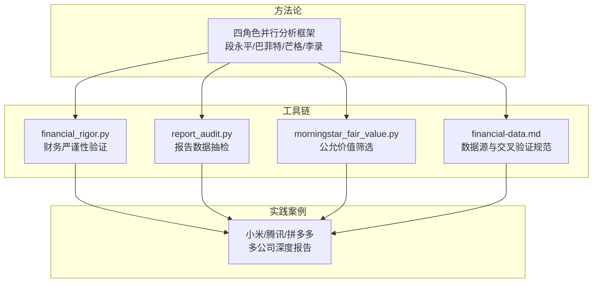
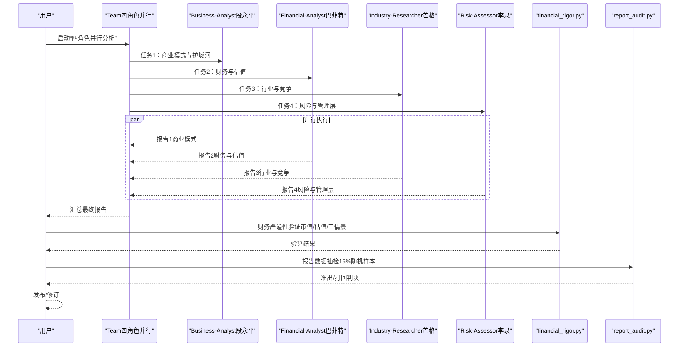
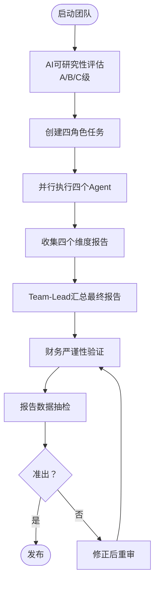
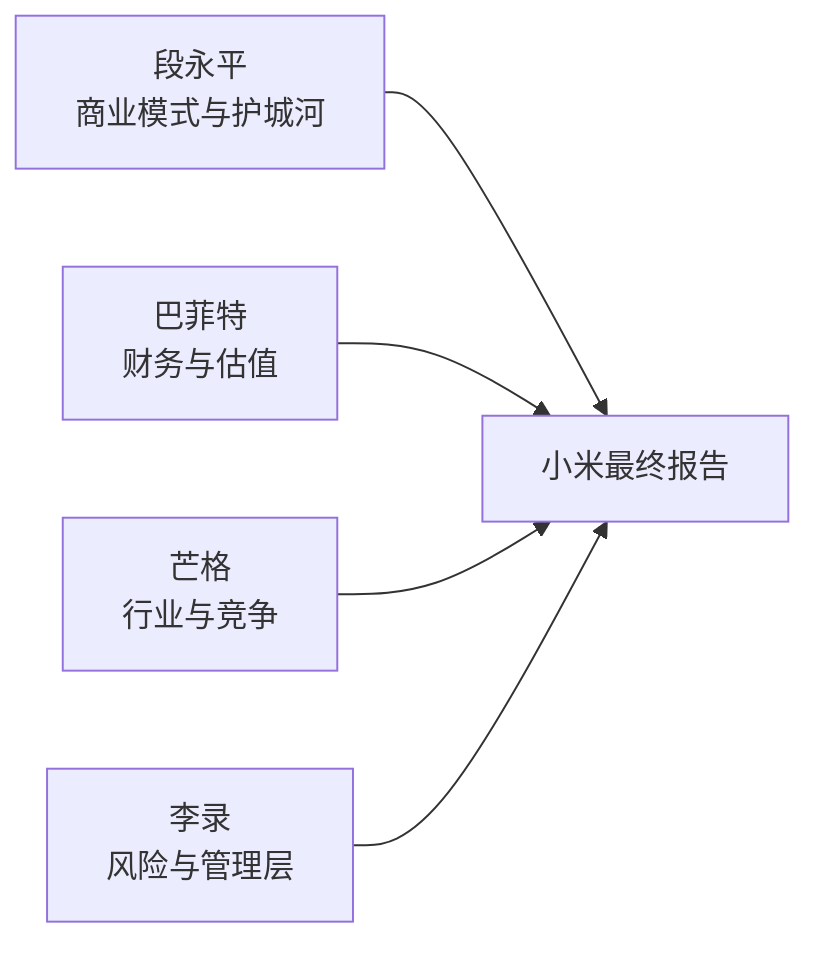
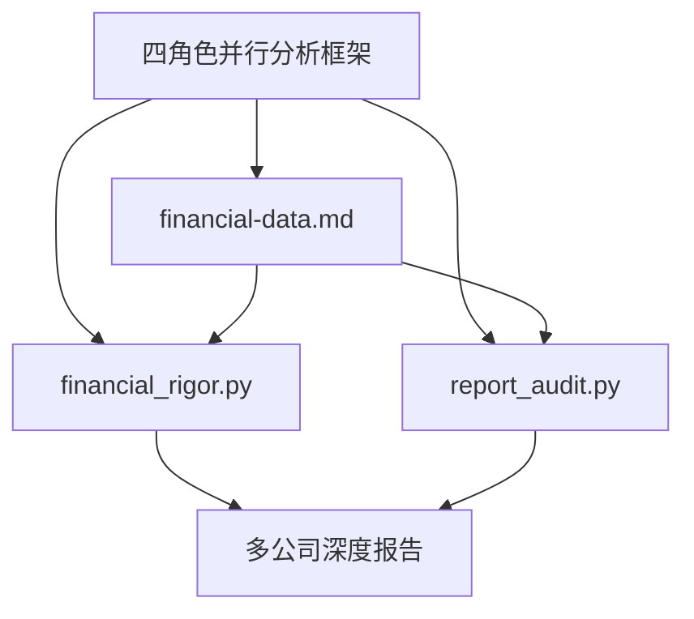

# 分析师方法论应用

<cite>
**本文档引用的文件**
- [skills/investment-team.md](file://skills/investment-team.md)
- [skills/financial-data.md](file://skills/financial-data.md)
- [skills/industry-research.md](file://skills/industry-research.md)
- [tools/financial_rigor.py](file://tools/financial_rigor.py)
- [tools/report_audit.py](file://tools/report_audit.py)
- [tools/morningstar_fair_value.py](file://tools/morningstar_fair_value.py)
- [reports/小米/01-商业模式分析-段永平视角.md](file://reports/小米/01-商业模式分析-段永平视角.md)
- [reports/小米/02-财务估值分析-巴菲特视角.md](file://reports/小米/02-财务估值分析-巴菲特视角.md)
- [reports/小米/03-行业竞争分析-芒格视角.md](file://reports/小米/03-行业竞争分析-芒格视角.md)
- [reports/小米/04-风险管理层评估-李录视角.md](file://reports/小米/04-风险管理层评估-李录视角.md)
- [reports/小米/最终报告.md](file://reports/小米/最终报告.md)
- [reports/腾讯/02-财务估值分析-巴菲特视角.md](file://reports/腾讯/02-财务估值分析-巴菲特视角.md)
- [reports/腾讯/04-风险管理层评估-李录视角.md](file://reports/腾讯/04-风险管理层评估-李录视角.md)
- [reports/拼多多/02-财务估值分析-巴菲特视角.md](file://reports/拼多多/02-财务估值分析-巴菲特视角.md)
- [reports/拼多多/03-行业竞争分析-芒格视角.md](file://reports/拼多多/03-行业竞争分析-芒格视角.md)
- [reports/拼多多/04-风险管理层评估-李录视角.md](file://reports/拼多多/04-风险管理层评估-李录视角.md)
</cite>

## 目录
1. [引言](#引言)
2. [项目结构](#项目结构)
3. [核心组件](#核心组件)
4. [架构总览](#架构总览)
5. [详细组件分析](#详细组件分析)
6. [依赖分析](#依赖分析)
7. [性能考量](#性能考量)
8. [故障排查指南](#故障排查指南)
9. [结论](#结论)
10. [附录](#附录)

## 引言
本文件围绕“AI Berkshire”构建的四角色并行分析框架，系统演示段永平商业模式分析、巴菲特财务质量评估、芒格行业竞争分析、李录风险管理评估在真实案例中的实战应用。通过对小米、腾讯、拼多多等多家公司进行全流程演练，展示从数据收集策略、关键指标计算、逻辑推理过程到最终结论形成的完整方法论落地路径，并讨论在不同市场环境下方法论的适应性与局限性，以及如何根据实际情况调整分析重点与权重分配。

## 项目结构
该项目以“投研技能 + 工具链 + 报告产物”的方式组织，形成“方法论—工具—实践”的闭环：
- 方法论：四角色并行分析框架（段永平/巴菲特/芒格/李录）
- 工具链：财务严谨性验证、数据抽检、公允价值筛选等
- 实践：多行业、多公司深度研究报告

图表来源
- [skills/investment-team.md:1-214](file://skills/investment-team.md#L1-L214)
- [tools/financial_rigor.py:1-452](file://tools/financial_rigor.py#L1-L452)
- [tools/report_audit.py:1-523](file://tools/report_audit.py#L1-L523)
- [tools/morningstar_fair_value.py:1-153](file://tools/morningstar_fair_value.py#L1-L153)
- [skills/financial-data.md:1-104](file://skills/financial-data.md#L1-L104)
- [reports/小米/最终报告.md:1-224](file://reports/小米/最终报告.md#L1-L224)

章节来源
- [skills/investment-team.md:1-214](file://skills/investment-team.md#L1-L214)
- [skills/financial-data.md:1-104](file://skills/financial-data.md#L1-L104)
- [skills/industry-research.md:1-269](file://skills/industry-research.md#L1-L269)
- [tools/financial_rigor.py:1-452](file://tools/financial_rigor.py#L1-L452)
- [tools/report_audit.py:1-523](file://tools/report_audit.py#L1-L523)
- [tools/morningstar_fair_value.py:1-153](file://tools/morningstar_fair_value.py#L1-L153)

## 核心组件
- 四角色并行分析框架：统一的团队化研究流程，确保四个维度的独立视角与交叉验证。
- 财务数据规范与交叉验证：明确数据源、误差阈值与呈现格式，保证关键财务数据的可信度。
- 财务严谨性验证工具：提供市值、估值、三情景估值、贝叶斯定律等校验能力。
- 报告数据抽检工具：从报告中抽取15%随机样本，与可靠信源比对，保障结论可审计。
- 公允价值筛选工具：从Morningstar筛选低估标的，辅助投资决策。
- 多公司实战报告：以小米、腾讯、拼多多为例，展示方法论在不同行业与公司中的应用。

章节来源
- [skills/investment-team.md:1-214](file://skills/investment-team.md#L1-L214)
- [skills/financial-data.md:1-104](file://skills/financial-data.md#L1-L104)
- [tools/financial_rigor.py:1-452](file://tools/financial_rigor.py#L1-L452)
- [tools/report_audit.py:1-523](file://tools/report_audit.py#L1-L523)
- [tools/morningstar_fair_value.py:1-153](file://tools/morningstar_fair_value.py#L1-L153)

## 架构总览
四角色并行分析的执行流程分为“准备—并行—汇总—抽检—发布”五个阶段，贯穿财务严谨性与数据抽检两条质量保障主线。

图表来源
- [skills/investment-team.md:34-214](file://skills/investment-team.md#L34-L214)
- [tools/financial_rigor.py:57-452](file://tools/financial_rigor.py#L57-L452)
- [tools/report_audit.py:405-523](file://tools/report_audit.py#L405-L523)

章节来源
- [skills/investment-team.md:34-214](file://skills/investment-team.md#L34-L214)
- [tools/financial_rigor.py:57-452](file://tools/financial_rigor.py#L57-L452)
- [tools/report_audit.py:405-523](file://tools/report_audit.py#L405-L523)

## 详细组件分析

### 组件A：四角色并行分析框架
- 角色职责与分析框架：段永平（商业模式与护城河）、巴菲特（财务与估值）、芒格（行业与竞争）、李录（风险与管理层）。
- AI研究偏见评估：根据信息丰富度（A/B/C级）调整研究策略，强调“反面检验”与“非共识视角”。
- 任务拆分与并行执行：四个任务分别由四个Agent并行执行，完成后由Team-Lead汇总。
- 质量控制：数据来源标注、关键指标交叉验证、最终报告包含“AI研究局限性声明”。

图表来源
- [skills/investment-team.md:19-214](file://skills/investment-team.md#L19-L214)
- [tools/financial_rigor.py:57-452](file://tools/financial_rigor.py#L57-L452)
- [tools/report_audit.py:405-523](file://tools/report_audit.py#L405-L523)

章节来源
- [skills/investment-team.md:1-214](file://skills/investment-team.md#L1-L214)

### 组件B：财务数据规范与交叉验证
- 数据源优先级：美股/港股/A股分别给出主/副来源与原始一手资料。
- 交叉验证流程：每个关键指标至少来自两个独立来源，误差>1%需标注；误差>5%需查原始财报。
- 常见差异原因：GAAP/Non-GAAP、汇率换算、财年定义、合并口径、数据更新滞后等。
- 特别规则：未上市公司仅一手来源时标注“估计”，季度数据优先使用年度数据。

章节来源
- [skills/financial-data.md:1-104](file://skills/financial-data.md#L1-L104)

### 组件C：财务严谨性验证工具
- 市值验算：股价×总股本与报告市值的偏差校验。
- 估值指标验算：PE/PB/PS/FCF Yield等指标的精确十进制计算。
- 三情景估值：基于乐观/中性/悲观情景的DCF目标价与涨跌幅。
- Benford定律检测：对财务数据首位数字分布进行异常检测。

章节来源
- [tools/financial_rigor.py:57-452](file://tools/financial_rigor.py#L57-L452)

### 组件D：报告数据抽检工具
- 数据点提取：从Markdown报告中识别表格、KV行、加粗数字等结构化财务数据。
- 随机抽样：按15%比例抽取，最少3个、最多30个，按行号排序便于人工核对。
- 准出/打回：以1%容差判断，不通过项需修正并重审。

章节来源
- [tools/report_audit.py:1-523](file://tools/report_audit.py#L1-L523)

### 组件E：实战案例一：小米（四角色并行）
- 段永平视角：商业模式本质、飞轮效应、护城河逐一验证、用户价值、协同效应、段永平“好生意”标准评估。
- 巴菲特视角：营收与利润趋势、盈利能力、现金流、资产负债表、估值与安全边际、分部估值（SOTP）。
- 芒格视角：智能手机/IoT/汽车/互联网服务的行业格局与竞争态势，五种“反过来想”的致命场景。
- 李录视角：管理层能力与诚信、监管与地缘政治风险、业务风险、治理结构与长期确定性。
- 最终报告：四维评分、核心数据速览、投资论点、巴菲特买入前Checklist、最终投资建议与总结。

图表来源
- [reports/小米/01-商业模式分析-段永平视角.md:1-154](file://reports/小米/01-商业模式分析-段永平视角.md#L1-L154)
- [reports/小米/02-财务估值分析-巴菲特视角.md:1-367](file://reports/小米/02-财务估值分析-巴菲特视角.md#L1-L367)
- [reports/小米/03-行业竞争分析-芒格视角.md:1-153](file://reports/小米/03-行业竞争分析-芒格视角.md#L1-L153)
- [reports/小米/04-风险管理层评估-李录视角.md:1-140](file://reports/小米/04-风险管理层评估-李录视角.md#L1-L140)
- [reports/小米/最终报告.md:1-224](file://reports/小米/最终报告.md#L1-L224)

章节来源
- [reports/小米/01-商业模式分析-段永平视角.md:1-154](file://reports/小米/01-商业模式分析-段永平视角.md#L1-L154)
- [reports/小米/02-财务估值分析-巴菲特视角.md:1-367](file://reports/小米/02-财务估值分析-巴菲特视角.md#L1-L367)
- [reports/小米/03-行业竞争分析-芒格视角.md:1-153](file://reports/小米/03-行业竞争分析-芒格视角.md#L1-L153)
- [reports/小米/04-风险管理层评估-李录视角.md:1-140](file://reports/小米/04-风险管理层评估-李录视角.md#L1-L140)
- [reports/小米/最终报告.md:1-224](file://reports/小米/最终报告.md#L1-L224)

### 组件F：实战案例二：腾讯（财务与估值、风险评估）
- 巴菲特视角：营收与利润趋势、盈利能力、现金流、资产负债表、估值与股东回报、三情景估值与安全边际、金融严谨性验证。
- 李录视角：管理层能力与诚信、监管与地缘政治风险、竞争风险（字节跳动）、业务风险、治理结构、长期确定性评估。

章节来源
- [reports/腾讯/02-财务估值分析-巴菲特视角.md:1-414](file://reports/腾讯/02-财务估值分析-巴菲特视角.md#L1-L414)
- [reports/腾讯/04-风险管理层评估-李录视角.md:1-436](file://reports/腾讯/04-风险管理层评估-李录视角.md#L1-L436)

### 组件G：实战案例三：拼多多（财务与估值、行业竞争、风险评估）
- 巴菲特视角：损益表趋势、盈利能力、现金流、资产负债表、分部数据、估值与安全边际、三情景估值。
- 芒格视角：电商行业规模与增长、竞争格局、核心竞争者威胁、行业趋势、产业链价值分配、逆向思维的风险情景。
- 李录视角：管理层文化与诚信、监管风险矩阵、竞争风险、业务风险（Temu为主）、宏观风险、治理结构、长期确定性评估。

章节来源
- [reports/拼多多/02-财务估值分析-巴菲特视角.md:1-480](file://reports/拼多多/02-财务估值分析-巴菲特视角.md#L1-L480)
- [reports/拼多多/03-行业竞争分析-芒格视角.md:1-174](file://reports/拼多多/03-行业竞争分析-芒格视角.md#L1-L174)
- [reports/拼多多/04-风险管理层评估-李录视角.md:1-184](file://reports/拼多多/04-风险管理层评估-李录视角.md#L1-L184)

### 组件H：行业研究方法论（可选应用）
- 逻辑链构建与验证、产业链全景扫描、全球上市公司扫描、各环节头部公司四大师分析、行业级风险评估、文明趋势判断、投资组合配置建议。
- 行业研究的反偏见措施：对信息稀缺的小公司不因其篇幅短而降低推荐度，标注“信息充分度”。

章节来源
- [skills/industry-research.md:1-269](file://skills/industry-research.md#L1-L269)

## 依赖分析
- 方法论依赖工具链：四角色并行分析框架依赖财务严谨性验证与报告抽检工具，确保结论可审计。
- 工具链依赖数据规范：财务严谨性验证与报告抽检均依赖“财务数据获取与交叉验证规范”，保证输入数据质量。
- 实战报告依赖方法论与工具链：多公司深度报告是方法论与工具链的产物，形成闭环。

图表来源
- [skills/investment-team.md:1-214](file://skills/investment-team.md#L1-L214)
- [tools/financial_rigor.py:1-452](file://tools/financial_rigor.py#L1-L452)
- [tools/report_audit.py:1-523](file://tools/report_audit.py#L1-L523)
- [skills/financial-data.md:1-104](file://skills/financial-data.md#L1-L104)

章节来源
- [skills/investment-team.md:1-214](file://skills/investment-team.md#L1-L214)
- [tools/financial_rigor.py:1-452](file://tools/financial_rigor.py#L1-L452)
- [tools/report_audit.py:1-523](file://tools/report_audit.py#L1-L523)
- [skills/financial-data.md:1-104](file://skills/financial-data.md#L1-L104)

## 性能考量
- 并行执行效率：四角色并行启动，缩短整体分析周期，需注意Agent间通信与进度反馈。
- 数据验证成本：财务严谨性验证与报告抽检均为自动化流程，建议在关键节点触发，避免重复计算。
- 工具精度：使用精确十进制与贝叶斯定律检测，确保财务指标与结论的稳健性。
- 信息丰富度与偏见：A级信息可侧重“反面检验”，C级信息需强调“第一性原理”，避免AI偏见导致的过度自信。

## 故障排查指南
- 财务严谨性验证失败
  - 市值验算偏差>5%：检查股价、总股本与报告市值单位一致性。
  - 估值指标验算异常：确认EPS/BVPS/FCF等输入值是否为最新。
  - 三情景估值目标价与当前股价差距过大：重新校准增长与PE假设。
- 报告抽检不通过
  - 抽检项偏差>1%：核对主/副来源数据，确认是否存在GAAP/Non-GAAP差异或汇率影响。
  - 两来源结果不一致：标注差异原因并人工复核。
- 方法论执行问题
  - Agent未按时完成：检查并行调用参数与任务描述，确保每个Agent的prompt模板完整。
  - 信息丰富度评级与分析策略不匹配：根据A/B/C级调整研究深度与权重。

章节来源
- [tools/financial_rigor.py:57-452](file://tools/financial_rigor.py#L57-L452)
- [tools/report_audit.py:243-523](file://tools/report_audit.py#L243-L523)
- [skills/investment-team.md:19-214](file://skills/investment-team.md#L19-L214)

## 结论
四角色并行分析框架在小米、腾讯、拼多多等多行业、多公司案例中得到系统验证，形成“方法论—工具—实践”的闭环。通过财务严谨性验证与报告抽检，确保结论可审计、可复现；通过信息丰富度评估与反偏见意识，提升分析质量与适用性。在不同市场环境下，应根据信息可得性与行业特性调整分析重点与权重分配，以实现更稳健的投资决策。

## 附录
- 公允价值筛选工具：从Morningstar筛选低估标的，辅助投资组合构建与再平衡。
- 方法论与工具链的持续优化：建议结合新数据源与监管变化，动态调整数据源优先级与交叉验证阈值。

章节来源
- [tools/morningstar_fair_value.py:1-153](file://tools/morningstar_fair_value.py#L1-L153)
- [skills/financial-data.md:1-104](file://skills/financial-data.md#L1-L104)