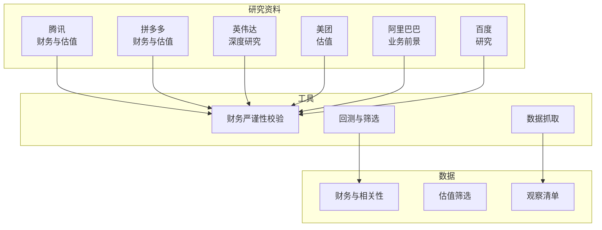
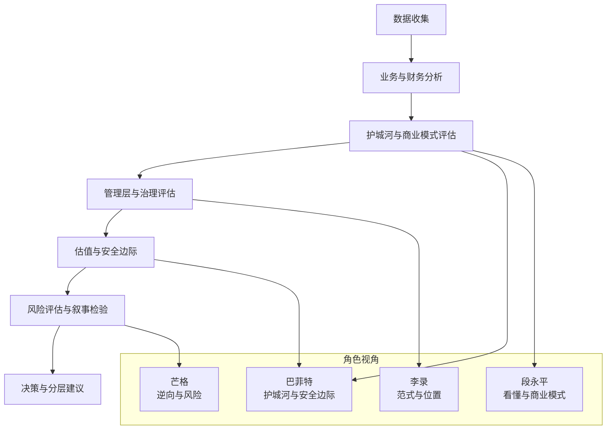
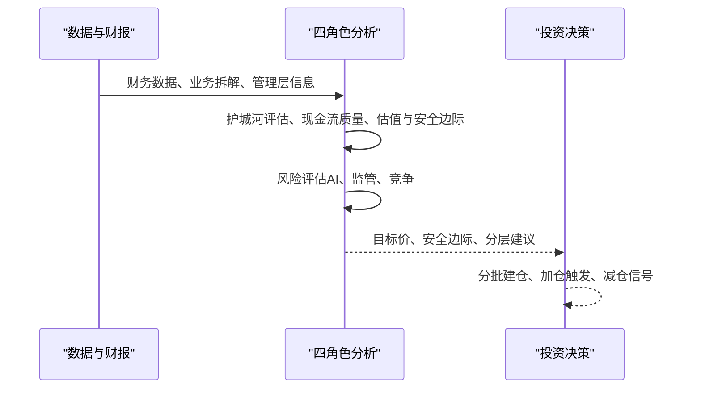
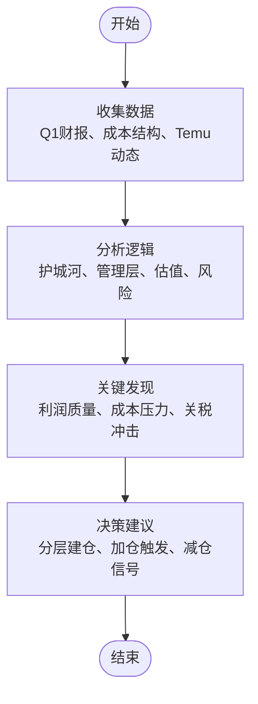
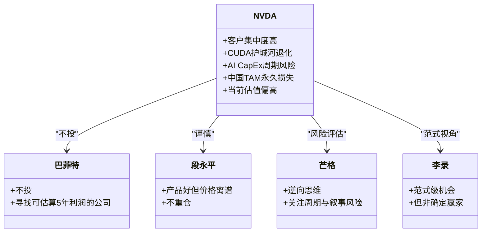
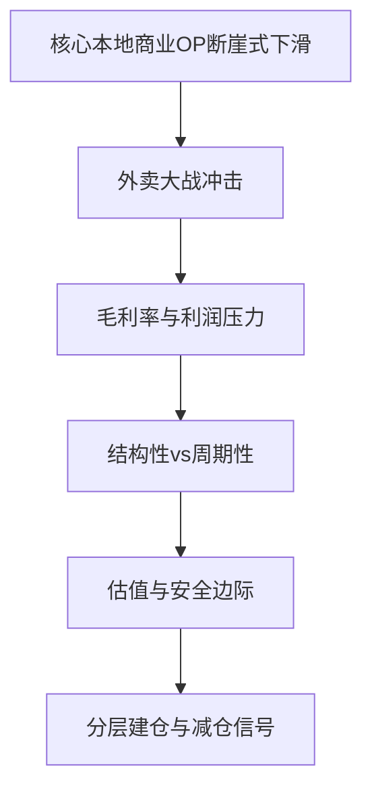
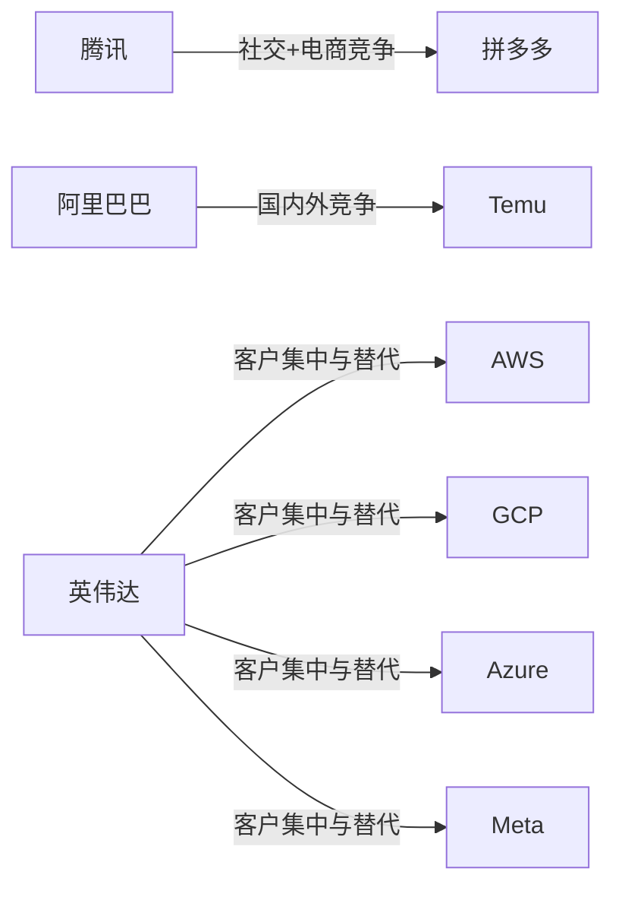

# 实战案例分析

<cite>
**本文引用的文件**
- [腾讯-earnings-2026Q1.md](file://reports/腾讯/腾讯-earnings-2026Q1.md)
- [腾讯-valuation-20260413.md](file://reports/腾讯/腾讯-valuation-20260413.md)
- [拼多多-earnings-2026Q1.md](file://reports/拼多多/拼多多-earnings-2026Q1.md)
- [拼多多-valuation-20260413.md](file://reports/拼多多/拼多多-valuation-20260413.md)
- [英伟达-research-20260413.md](file://reports/英伟达/英伟达-research-20260413.md)
- [英伟达-valuation-20260413.md](file://reports/英伟达/英伟达-valuation-20260413.md)
- [美团-valuation-20260413.md](file://reports/美团/美团-valuation-20260413.md)
- [阿里巴巴-业务前景展望-20260410.md](file://reports/阿里巴巴/阿里巴巴-业务前景展望-20260410.md)
- [百度-research-20260428.md](file://reports/百度-deepseek分析/百度-research-20260428.md)
</cite>

## 目录
1. [引言](#引言)
2. [项目结构](#项目结构)
3. [核心组件](#核心组件)
4. [架构总览](#架构总览)
5. [详细组件分析](#详细组件分析)
6. [依赖分析](#依赖分析)
7. [性能考量](#性能考量)
8. [故障排查指南](#故障排查指南)
9. [结论](#结论)
10. [附录](#附录)

## 引言
本文件面向AI Berkshire的实战案例研究，围绕“四角色分析框架”（巴菲特护城河与安全边际、芒格逆向思维与风险评估、段永平商业模式洞察、李录文明范式视角）对典型企业进行深度剖析。通过对腾讯、拼多多、英伟达、美团、阿里巴巴、百度等公司的投资研究过程进行系统化梳理，展示从数据收集、分析逻辑、关键发现到最终结论的完整流程，并提供可复用的方法论与检查清单，帮助读者在实践中提升分析能力与决策质量。

## 项目结构
本项目以“报告+工具”的形式组织，核心研究资料集中在reports目录，涵盖多份深度研究报告与财务估值分析；工具模块位于tools目录，提供财务严谨性校验、回测、筛选等辅助能力；数据资源位于data目录，包含相关财务与相关性数据。整体结构清晰，便于按主题检索与复用。

图表来源
- [腾讯-valuation-20260413.md:1-748](file://reports/腾讯/腾讯-valuation-20260413.md#L1-L748)
- [拼多多-valuation-20260413.md:1-774](file://reports/拼多多/拼多多-valuation-20260413.md#L1-L774)
- [英伟达-research-20260413.md:1-365](file://reports/英伟达/英伟达-research-20260413.md#L1-L365)
- [美团-valuation-20260413.md:1-189](file://reports/美团/美团-valuation-20260413.md#L1-L189)
- [阿里巴巴-业务前景展望-20260410.md:1-46](file://reports/阿里巴巴/阿里巴巴-业务前景展望-20260410.md#L1-L46)
- [百度-research-20260428.md](file://reports/百度-deepseek分析/百度-research-20260428.md)

章节来源
- [腾讯-valuation-20260413.md:1-748](file://reports/腾讯/腾讯-valuation-20260413.md#L1-L748)
- [拼多多-valuation-20260413.md:1-774](file://reports/拼多多/拼多多-valuation-20260413.md#L1-L774)
- [英伟达-research-20260413.md:1-365](file://reports/英伟达/英伟达-research-20260413.md#L1-L365)
- [美团-valuation-20260413.md:1-189](file://reports/美团/美团-valuation-20260413.md#L1-L189)
- [阿里巴巴-业务前景展望-20260410.md:1-46](file://reports/阿里巴巴/阿里巴巴-业务前景展望-20260410.md#L1-L46)
- [百度-research-20260428.md](file://reports/百度-deepseek分析/百度-research-20260428.md)

## 核心组件
- 四角色分析框架
  - 巴菲特：护城河与安全边际，强调“以合理价格买优秀公司”
  - 芒格：逆向思维与风险评估，关注周期性、叙事风险与系统性风险
  - 段永平：商业模式洞察与“看懂”标准，强调可理解性与长期回报
  - 李录：文明范式视角，判断范式持续性与公司位置
- 分析流程
  - 数据收集：财务报表、监管与行业数据、管理层公开信息
  - 分析逻辑：业务质量、护城河、管理层、估值与安全边际、风险评估
  - 关键发现：利润质量、成本结构、竞争格局、地缘政治与政策影响
  - 最终结论：买入/持有/卖出建议与分层仓位策略
- 关键指标与方法
  - 财务指标：收入、利润、现金流、毛利率、ROE、EV/EBITDA、PE、PS、P/FCF
  - 估值方法：SOTP、DCF、PS、EV/GMV、EV/OP
  - 风险评估：客户集中度、地缘政治、政策变化、AI叙事风险、CapEx周期

章节来源
- [腾讯-valuation-20260413.md:1-748](file://reports/腾讯/腾讯-valuation-20260413.md#L1-L748)
- [英伟达-research-20260413.md:1-365](file://reports/英伟达/英伟达-research-20260413.md#L1-L365)
- [拼多多-valuation-20260413.md:1-774](file://reports/拼多多/拼多多-valuation-20260413.md#L1-L774)
- [美团-valuation-20260413.md:1-189](file://reports/美团/美团-valuation-20260413.md#L1-L189)

## 架构总览
下图展示了四角色分析框架在不同公司研究中的应用路径与交互关系，体现从数据到结论的闭环流程。

图表来源
- [腾讯-valuation-20260413.md:1-748](file://reports/腾讯/腾讯-valuation-20260413.md#L1-L748)
- [英伟达-research-20260413.md:1-365](file://reports/英伟达/英伟达-research-20260413.md#L1-L365)
- [拼多多-valuation-20260413.md:1-774](file://reports/拼多多/拼多多-valuation-20260413.md#L1-L774)
- [美团-valuation-20260413.md:1-189](file://reports/美团/美团-valuation-20260413.md#L1-L189)

## 详细组件分析

### 腾讯：以合理价格买优秀公司
- 数据与事实
  - 2026Q1利润超预期，自由现金流增长，广告收入加速，AI赋能广告与云业务
  - 回购缩减、AI投入翻倍，管理层将股东回报与技术赌注做权衡
- 分析逻辑
  - 巴菲特视角：微信护城河稳固，现金流质量优异，当前PE合理偏低，具备安全边际
  - 段永平视角：看懂社交+游戏+广告+支付的飞轮，管理层诚信度高
  - 李录视角：管理层顶级，长期持有逻辑成立
  - 芒格视角：AI应用层落后但微信生态有独特优势，SOTP已折价处理
- 关键发现
  - 广告ROI提升、视频号生态加速、游戏海外高增长
  - 回购节奏减弱对股价托底作用下降
- 结论与建议
  - 当前490港元对应911港元目标价提供46%安全边际，建议分批建仓
  - 加仓触发：元宝MAU突破1亿、广告增速>15%、视频号单月营收>100亿、海外游戏维持>25%

图表来源
- [腾讯-earnings-2026Q1.md:1-119](file://reports/腾讯/腾讯-earnings-2026Q1.md#L1-L119)
- [腾讯-valuation-20260413.md:1-748](file://reports/腾讯/腾讯-valuation-20260413.md#L1-L748)

章节来源
- [腾讯-earnings-2026Q1.md:1-119](file://reports/腾讯/腾讯-earnings-2026Q1.md#L1-L119)
- [腾讯-valuation-20260413.md:1-748](file://reports/腾讯/腾讯-valuation-20260413.md#L1-L748)

### 拼多多：千亿投入的ROI验证
- 数据与事实
  - 2026Q1利润承压，营销费用从+43%降至+1%，Temu经济模型改善
  - 千亿扶持计划带来短期利润压力，管理层强调“利润下降趋势不可避免”
- 分析逻辑
  - 巴菲特视角：PE处于历史低位，PS与P/FCF具吸引力，零有息负债
  - 段永平视角：千亿投资ROI是黑箱，需验证供应链与Temu商业化进展
  - 李录视角：短期利润牺牲换取供应链与生态健康，需长期验证
  - 芒格视角：Temu美国DAU暴跌58%，关税与竞争风险显著
- 关键发现
  - 国内主站利润-12%，Q1最低点体现补贴集中；Q2-Q4恢复
  - Temu接近盈亏平衡或微亏，美国DAU大幅回落
- 结论与建议
  - 当前$100.87已接近基准估值$94.8，建议等待$70-85区间分批建仓
  - 关键验证：2026Q1利润同比转正、国内主站在线营销收入回升、Temu交易服务稳定

图表来源
- [拼多多-earnings-2026Q1.md:1-347](file://reports/拼多多/拼多多-earnings-2026Q1.md#L1-L347)
- [拼多多-valuation-20260413.md:1-774](file://reports/拼多多/拼多多-valuation-20260413.md#L1-L774)

章节来源
- [拼多多-earnings-2026Q1.md:1-347](file://reports/拼多多/拼多多-earnings-2026Q1.md#L1-L347)
- [拼多多-valuation-20260413.md:1-774](file://reports/拼多多/拼多多-valuation-20260413.md#L1-L774)

### 英伟达：高估值下的三大黑箱
- 数据与事实
  - 2025财年营收130.5亿美元，毛利率65.1%，自由现金流62.1亿美元
  - 客户集中度高（单一客户22%），训练端与推理端份额面临侵蚀
- 分析逻辑
  - 巴菲特视角：当前PE与EV/Sales接近2000年思科泡沫水平，不适合买入
  - 段永平视角：产品好但价格离谱，不重仓
  - 芒格视角：AI CapEx周期、客户自研替代、CUDA护城河退化、中国TAM永久损失
  - 李录视角：范式级机会，但NVDA未必是确定赢家
- 关键发现
  - CUDA护城河从“4层”退化为“2层”，ROCm迁移成本显著下降
  - 客户自研芯片（AWS Trainium2、Google Ironwood、Microsoft Maia）加速落地
  - AI CapEx周期连续+50%以上历史上从未持续超过3年
- 结论与建议
  - 不适合作为6选1重仓，建议仓位<10%，持有期3-5年
  - 买入价：<$120（当前$186偏高），止损$120以下重新评估

图表来源
- [英伟达-research-20260413.md:1-365](file://reports/英伟达/英伟达-research-20260413.md#L1-L365)
- [英伟达-valuation-20260413.md:1-198](file://reports/英伟达/英伟达-valuation-20260413.md#L1-L198)

章节来源
- [英伟达-research-20260413.md:1-365](file://reports/英伟达/英伟达-research-20260413.md#L1-L365)
- [英伟达-valuation-20260413.md:1-198](file://reports/英伟达/英伟达-valuation-20260413.md#L1-L198)

### 美团：外卖大战的结构性与周期性
- 数据与事实
  - 2025年核心本地商业OP由+524亿转为-69亿，毛利率从38.4%降至30.4%
  - 外卖大战（京东、抖音、拼多多）对核心业务直接冲击
- 分析逻辑
  - 巴菲特视角：PE 12-15x（战后恢复期合理倍数），但OP率永久下修概率30%
  - 段永平视角：核心问题是“大战是周期性还是结构性？”
  - 芒格视角：港股估值体系长期压制、AI/无人配送资本开支吞噬FCF
  - 李录视角：短期不确定性高，长期需看大战何时结束
- 关键发现
  - 外卖大战不是“一次性”而是“新常态”，OP率可能长期卡在15%以下
  - 到店业务被抖音短视频种草+团购闭环降维打击
- 结论与建议
  - 合理价值区间68-187 HKD，当前85.75 HKD隐含悲观假设
  - 买入价90-100 HKD，重仓价70-80 HKD，卖出价170 HKD以上

图表来源
- [美团-valuation-20260413.md:1-189](file://reports/美团/美团-valuation-20260413.md#L1-L189)

章节来源
- [美团-valuation-20260413.md:1-189](file://reports/美团/美团-valuation-20260413.md#L1-L189)

### 阿里巴巴：从电商帝国到AI云驱动
- 数据与事实
  - 阿里云智能AI云份额35.8%，外部收入超1000亿美元目标
  - 淘天GMV份额从51%降至~30%，抖音电商追赶
- 分析逻辑
  - 巴菲特视角：云+AI外部收入超1000亿美元，核心利润引擎
  - 段永平视角：看懂“AI云驱动的科技集团”转型
  - 芒格视角：抖音电商何时追平淘天、字节火山引擎威胁
  - 李录视角：范式级AI浪潮，阿里云份额领先
- 关键发现
  - 阿里云智能20-22%年均增速，淘天占比从45%降至~35%
  - 国际数字商业面临Temu/SHEIN白热化竞争
- 结论与建议
  - 从“电商帝国”向“AI云驱动的科技集团”转型，关注云+AI外部收入增长

章节来源
- [阿里巴巴-业务前景展望-20260410.md:1-46](file://reports/阿里巴巴/阿里巴巴-业务前景展望-20260410.md#L1-L46)

### 百度：大模型时代的追赶与风险
- 数据与事实
  - 百度在大模型领域积极布局，但与头部玩家相比仍存在差距
  - 需关注政策、技术路线与商业化进展
- 分析逻辑
  - 巴菲特视角：关注护城河与现金流质量
  - 段永平视角：商业模式可理解性与长期回报
  - 芒格视角：技术突破与叙事风险的瞬时重评
  - 李录视角：范式级机会中的位置与可持续性
- 关键发现
  - 大模型应用层竞争激烈，技术效率提升与市场预期波动并存
- 结论与建议
  - 关注技术进展与商业化节奏，结合安全边际与风险评估制定策略

章节来源
- [百度-research-20260428.md](file://reports/百度-deepseek分析/百度-research-20260428.md)

## 依赖分析
- 公司间依赖
  - 腾讯与拼多多：社交+电商生态竞争，视频号与抖音生态博弈
  - 阿里巴巴与拼多多：淘天与Temu在国内外市场的竞争
  - 英伟达与客户：AWS/Azure/GCP/Meta的GPU需求与自研芯片替代
- 外部依赖
  - 地缘政治：美国对华技术限制、关税政策、审计风险
  - 行业周期：AI CapEx周期、电商补贴战、宏观经济环境
- 估值与安全边际
  - 不同公司安全边际差异显著，需结合四角色框架进行综合评估

图表来源
- [腾讯-valuation-20260413.md:1-748](file://reports/腾讯/腾讯-valuation-20260413.md#L1-L748)
- [拼多多-valuation-20260413.md:1-774](file://reports/拼多多/拼多多-valuation-20260413.md#L1-L774)
- [英伟达-research-20260413.md:1-365](file://reports/英伟达/英伟达-research-20260413.md#L1-L365)

章节来源
- [腾讯-valuation-20260413.md:1-748](file://reports/腾讯/腾讯-valuation-20260413.md#L1-L748)
- [拼多多-valuation-20260413.md:1-774](file://reports/拼多多/拼多多-valuation-20260413.md#L1-L774)
- [英伟达-research-20260413.md:1-365](file://reports/英伟达/英伟达-research-20260413.md#L1-L365)

## 性能考量
- 数据质量与溯源
  - 优先使用SEC、港交所披露易、公司IR等一手资料，交叉验证股价与财务数据
- 分析效率
  - 使用SOTP、PS、EV/OP等方法快速收敛估值区间，结合敏感性分析评估不确定性
- 决策时效
  - 关注季度财报与管理层电话会，及时捕捉关键信号（如回购节奏、Temu DAU、广告ROI）

## 故障排查指南
- 常见误区
  - 用毛利代替净利润进行PE估值（腾讯SOTP修正案例）
  - 忽视地缘政治与政策变化对估值的影响（英伟达中国TAM损失、拼多多关税冲击）
  - 过度依赖短期利润而非长期护城河（英伟达AI CapEx周期）
- 排查清单
  - 财务数据一致性与来源验证
  - 业务拆解与利润质量评估（OCF/NI、成本结构、毛利率趋势）
  - 客户集中度与替代风险
  - 地缘政治与监管风险
  - 估值方法适用性与安全边际

章节来源
- [腾讯-valuation-20260413.md:322-356](file://reports/腾讯/腾讯-valuation-20260413.md#L322-L356)
- [英伟达-research-20260413.md:149-165](file://reports/英伟达/英伟达-research-20260413.md#L149-L165)
- [拼多多-earnings-2026Q1.md:136-163](file://reports/拼多多/拼多多-earnings-2026Q1.md#L136-L163)

## 结论
通过四角色分析框架，本文件对腾讯、拼多多、英伟达、美团、阿里巴巴、百度等公司进行了系统化研究，展示了从数据收集、分析逻辑、关键发现到最终结论的完整流程。实践表明，面对高不确定性与复杂变量，坚持“看懂”“护城河”“安全边际”“风险评估”的原则，有助于在波动市场中做出更稳健的投资决策。建议读者结合自身风险偏好与投资周期，按分层策略执行，并持续跟踪关键信号与验证指标。

## 附录
- 关键指标速查
  - 财务：收入、利润、现金流、毛利率、ROE、EV/EBITDA、PE、PS、P/FCF
  - 估值：SOTP、DCF、PS、EV/GMV、EV/OP
  - 风险：客户集中度、地缘政治、政策变化、AI叙事风险、CapEx周期
- 方法论要点
  - 以“可理解”为第一标准（段永平）
  - 关注护城河与安全边际（巴菲特）
  - 逆向思维与系统性风险（芒格）
  - 范式级机会与公司位置（李录）