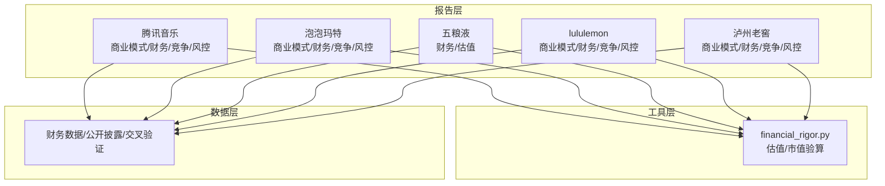
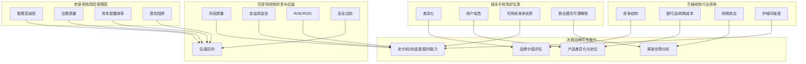
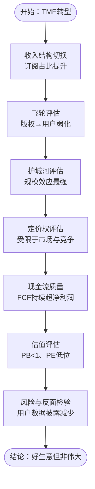
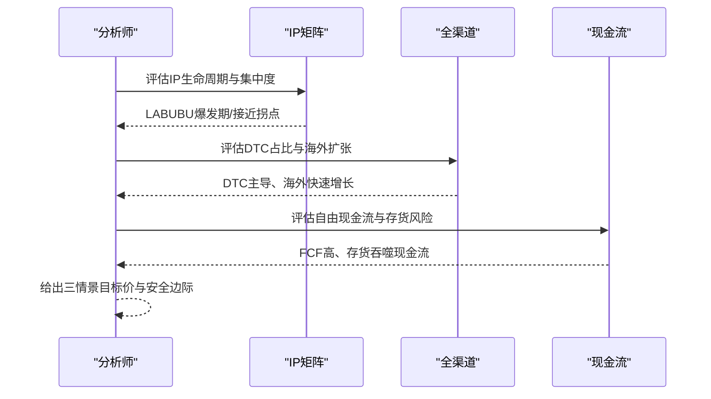
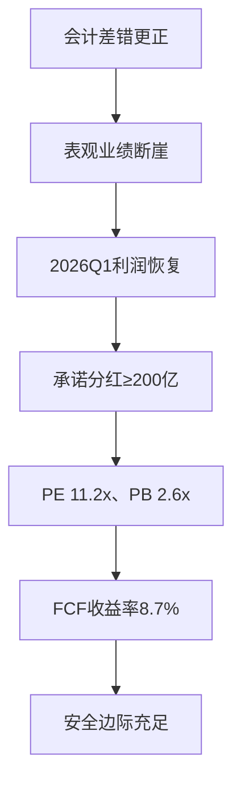
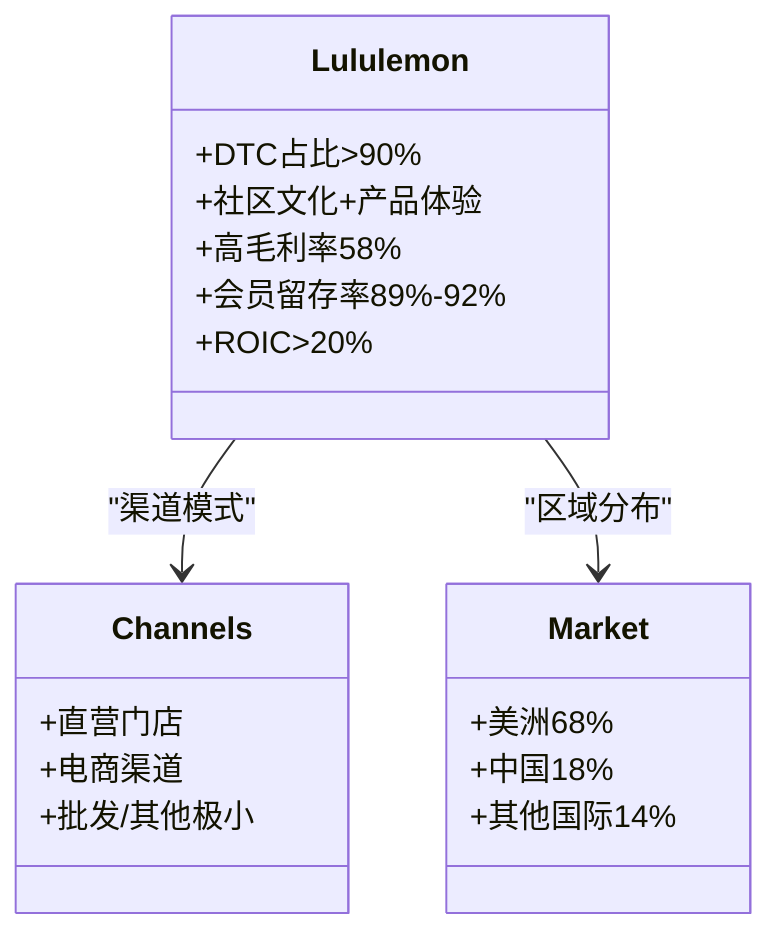
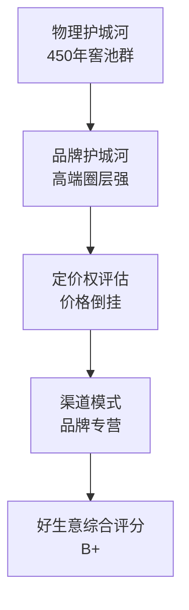
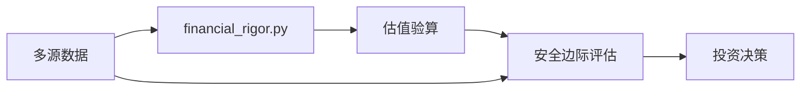

# 消费品牌案例

<cite>
**本文引用的文件**
- [腾讯音乐-商业模式分析-段永平视角.md](file://reports/腾讯音乐/01-商业模式分析-段永平视角.md)
- [腾讯音乐-财务估值分析-巴菲特视角.md](file://reports/腾讯音乐/02-财务估值分析-巴菲特视角.md)
- [泡泡玛特-商业模式分析-段永平视角.md](file://reports/泡泡玛特/01-商业模式分析-段永平视角.md)
- [泡泡玛特-财务估值分析-巴菲特视角.md](file://reports/泡泡玛特/02-财务估值分析-巴菲特视角.md)
- [五粮液-财务估值分析-巴菲特视角.md](file://reports/五粮液/02-财务估值分析-巴菲特视角.md)
- [lululemon-商业模式分析-段永平视角.md](file://reports/lululemon/01-商业模式分析-段永平视角.md)
- [lululemon-财务估值分析-巴菲特视角.md](file://reports/lululemon/02-财务估值分析-巴菲特视角.md)
- [泸州老窖-商业模式分析-段永平视角.md](file://reports/泸州老窖/01-商业模式分析-段永平视角.md)
</cite>

## 目录
1. [引言](#引言)
2. [项目结构](#项目结构)
3. [核心组件](#核心组件)
4. [架构总览](#架构总览)
5. [详细组件分析](#详细组件分析)
6. [依赖分析](#依赖分析)
7. [性能考量](#性能考量)
8. [故障排查指南](#故障排查指南)
9. [结论](#结论)
10. [附录](#附录)

## 引言
本文件面向AI Berkshire投研团队，围绕消费品牌企业构建一套实战案例分析框架，结合四角色分析范式（段永平视角的“好生意”、巴菲特视角的“财务与估值”、芒格视角的“行业竞争”、李录视角的“风险管理层”），系统梳理腾讯音乐、泡泡玛特、五粮液、泸州老窖、lululemon等品牌的商业模式、护城河、定价权、客户忠诚度与盈利能力，并给出消费品牌特有的估值方法与安全边际评估流程，帮助在真实市场中做出更稳健的投资决策。

## 项目结构
本项目以“报告-工具-数据”三层组织消费品牌案例研究：
- 报告层：各品牌“四角色”研究报告，覆盖商业模式、财务与估值、行业竞争、风险管理层评估
- 工具层：财务严谨性校验与估值模型工具，用于交叉验证与三情景估值
- 数据层：财务数据、公开披露、市场数据与交叉验证记录

图表来源
- [腾讯音乐-商业模式分析-段永平视角.md:1-367](file://reports/腾讯音乐/01-商业模式分析-段永平视角.md#L1-L367)
- [腾讯音乐-财务估值分析-巴菲特视角.md:1-408](file://reports/腾讯音乐/02-财务估值分析-巴菲特视角.md#L1-L408)
- [泡泡玛特-商业模式分析-段永平视角.md:1-522](file://reports/泡泡玛特/01-商业模式分析-段永平视角.md#L1-L522)
- [泡泡玛特-财务估值分析-巴菲特视角.md:1-372](file://reports/泡泡玛特/02-财务估值分析-巴菲特视角.md#L1-L372)
- [五粮液-财务估值分析-巴菲特视角.md:1-332](file://reports/五粮液/02-财务估值分析-巴菲特视角.md#L1-L332)
- [lululemon-商业模式分析-段永平视角.md:1-100](file://reports/lululemon/01-商业模式分析-段永平视角.md#L1-L100)
- [lululemon-财务估值分析-巴菲特视角.md:1-158](file://reports/lululemon/02-财务估值分析-巴菲特视角.md#L1-L158)
- [泸州老窖-商业模式分析-段永平视角.md:1-349](file://reports/泸州老窖/01-商业模式分析-段永平视角.md#L1-L349)

章节来源
- [腾讯音乐-商业模式分析-段永平视角.md:1-367](file://reports/腾讯音乐/01-商业模式分析-段永平视角.md#L1-L367)
- [腾讯音乐-财务估值分析-巴菲特视角.md:1-408](file://reports/腾讯音乐/02-财务估值分析-巴菲特视角.md#L1-L408)
- [泡泡玛特-商业模式分析-段永平视角.md:1-522](file://reports/泡泡玛特/01-商业模式分析-段永平视角.md#L1-L522)
- [泡泡玛特-财务估值分析-巴菲特视角.md:1-372](file://reports/泡泡玛特/02-财务估值分析-巴菲特视角.md#L1-L372)
- [五粮液-财务估值分析-巴菲特视角.md:1-332](file://reports/五粮液/02-财务估值分析-巴菲特视角.md#L1-L332)
- [lululemon-商业模式分析-段永平视角.md:1-100](file://reports/lululemon/01-商业模式分析-段永平视角.md#L1-L100)
- [lululemon-财务估值分析-巴菲特视角.md:1-158](file://reports/lululemon/02-财务估值分析-巴菲特视角.md#L1-L158)
- [泸州老窖-商业模式分析-段永平视角.md:1-349](file://reports/泸州老窖/01-商业模式分析-段永平视角.md#L1-L349)

## 核心组件
- 四角色分析框架
  - 段永平视角：判断“好生意”，关注差异化、用户粘性、可持续竞争优势与商业模式可理解性
  - 巴菲特视角：财务与估值，关注利润质量、自由现金流、ROE/ROIC、安全边际与估值区间
  - 芒格视角：行业竞争，关注竞争结构、替代品、转换成本、网络效应与护城河强度
  - 李录视角：风险管理层，关注管理层诚信、治理质量、资本配置效率与潜在陷阱
- 消费品牌特有能力评估
  - 品牌价值评估：品牌认知度、忠诚度、溢价能力、防御力
  - 渠道优势分析：DTC占比、渠道结构、数字化能力、终端掌控力
  - 产品差异化与市场定位：产品矩阵、生命周期、品类创新、价格体系
  - 定价权、客户忠诚度与盈利能力：毛利率、净利率、ROE/ROIC、FCF/净利润、客户终身价值
- 消费品牌估值方法
  - 品牌溢价法：品牌资产价值、特许权价值、文化资产价值
  - 渠道价值法：DTC占比、渠道效率、预收款/合同负债、渠道网络价值
  - 现金流质量评估：FCF/净利润、FCF收益率、自由现金流倍数、再投资需求
  - 安全边际评估：PE/PB/PS/FCF Yield与历史中枢对比、三情景估值、概率加权目标价

章节来源
- [腾讯音乐-商业模式分析-段永平视角.md:102-183](file://reports/腾讯音乐/01-商业模式分析-段永平视角.md#L102-L183)
- [腾讯音乐-财务估值分析-巴菲特视角.md:170-331](file://reports/腾讯音乐/02-财务估值分析-巴菲特视角.md#L170-L331)
- [泡泡玛特-商业模式分析-段永平视角.md:219-307](file://reports/泡泡玛特/01-商业模式分析-段永平视角.md#L219-L307)
- [泡泡玛特-财务估值分析-巴菲特视角.md:131-278](file://reports/泡泡玛特/02-财务估值分析-巴菲特视角.md#L131-L278)
- [五粮液-财务估值分析-巴菲特视角.md:177-277](file://reports/五粮液/02-财务估值分析-巴菲特视角.md#L177-L277)
- [lululemon-商业模式分析-段永平视角.md:59-95](file://reports/lululemon/01-商业模式分析-段永平视角.md#L59-L95)
- [lululemon-财务估值分析-巴菲特视角.md:84-158](file://reports/lululemon/02-财务估值分析-巴菲特视角.md#L84-L158)
- [泸州老窖-商业模式分析-段永平视角.md:255-304](file://reports/泸州老窖/01-商业模式分析-段永平视角.md#L255-L304)

## 架构总览
下图展示了五家消费品牌在四角色分析框架下的关键维度与交互关系，帮助建立统一的分析模板与评估流程。

图表来源
- [腾讯音乐-商业模式分析-段永平视角.md:102-183](file://reports/腾讯音乐/01-商业模式分析-段永平视角.md#L102-L183)
- [腾讯音乐-财务估值分析-巴菲特视角.md:170-331](file://reports/腾讯音乐/02-财务估值分析-巴菲特视角.md#L170-L331)
- [泡泡玛特-商业模式分析-段永平视角.md:219-307](file://reports/泡泡玛特/01-商业模式分析-段永平视角.md#L219-L307)
- [泡泡玛特-财务估值分析-巴菲特视角.md:131-278](file://reports/泡泡玛特/02-财务估值分析-巴菲特视角.md#L131-L278)
- [五粮液-财务估值分析-巴菲特视角.md:177-277](file://reports/五粮液/02-财务估值分析-巴菲特视角.md#L177-L277)
- [lululemon-商业模式分析-段永平视角.md:59-95](file://reports/lululemon/01-商业模式分析-段永平视角.md#L59-L95)
- [lululemon-财务估值分析-巴菲特视角.md:84-158](file://reports/lululemon/02-财务估值分析-巴菲特视角.md#L84-L158)
- [泸州老窖-商业模式分析-段永平视角.md:255-304](file://reports/泸州老窖/01-商业模式分析-段永平视角.md#L255-L304)

## 详细组件分析

### 腾讯音乐（TME）：从直播打赏到音乐订阅的转型与护城河评估
- 商业模式与飞轮
  - 收入结构从社交娱乐（直播打赏）向在线音乐（订阅+广告）切换，订阅占比从2019年的~30%提升至2025年的~81%
  - 飞轮从“版权驱动”转向“惯性+生态驱动”，版权→用户环节弱化，算法推荐、社交关系、SVIP权益成为新动力
- 护城河评估
  - 品牌：QQ音乐有品牌认知度，但非“不可替代”的品牌
  - 转换成本：算法推荐与社交关系较强，但用户“懒得多换”
  - 网络效应：社交娱乐萎缩，核心在线音乐无强网络效应
  - 规模效应：版权采购与技术/渠道规模优势最强，但被“免费+算法”模式侵蚀
  - 技术壁垒：领先但非决定性，字节系算法整体更强
- 定价权与可持续性
  - 有一定定价权但受限于市场与竞争，SVIP提价遇阻，汽水音乐免费冲击显著
  - 可持续性：需要持续投入维护，不符合段永平“十年不操心”的标准
- 财务与估值（巴菲特视角）
  - 毛利率从30%提升到44%，经营杠杆显著释放；FCF持续超过净利润，资本开支极低
  - PB 0.57x、FCF Yield 10%、PE 8.65x（GAAP），处于历史低位；安全边际充足
- 风险与反面检验
  - 停止披露用户数据、社交娱乐持续萎缩、喜马拉雅整合风险、增速放缓

图表来源
- [腾讯音乐-商业模式分析-段永平视角.md:14-183](file://reports/腾讯音乐/01-商业模式分析-段永平视角.md#L14-L183)
- [腾讯音乐-财务估值分析-巴菲特视角.md:95-331](file://reports/腾讯音乐/02-财务估值分析-巴菲特视角.md#L95-L331)

章节来源
- [腾讯音乐-商业模式分析-段永平视角.md:14-367](file://reports/腾讯音乐/01-商业模式分析-段永平视角.md#L14-L367)
- [腾讯音乐-财务估值分析-巴菲特视角.md:12-408](file://reports/腾讯音乐/02-财务估值分析-巴菲特视角.md#L12-L408)

### 泡泡玛特（9992.HK）：IP运营平台的“好生意”与IP生命周期管理
- 商业模式本质
  - 以自有IP为核心资产、以情绪价值为产品内核、以全球化全渠道为变现通道的“IP运营平台公司”
  - 收入结构：LABUBU占38.1%，自有IP占比90%+，海外收入占比43.8%
- 护城河与“好生意”评估
  - 品牌/定价权：强但建立在IP热度之上；转换成本弱；网络效应弱；规模效应强；设计/技术壁垒中等
  - “好生意”评分：差异化强、定价权强、可持续性中等、10年后仍在但规模不确定
- 财务与估值（巴菲特视角）
  - 2023-2025：营收CAGR+143%、净利率从17%升至34%、ROE从7%升至约55%、零负债+138亿现金
  - PE 13x、PEG 0.65、PS 4.5x，当前处于历史低位；三情景目标价概率加权约372港元，上行空间约163%
- 风险与反面论证
  - LABUBU集中度风险、Beanie Babies泡沫教训、IP生命周期管理不确定性、AI对设计的潜在冲击

图表来源
- [泡泡玛特-商业模式分析-段永平视角.md:94-307](file://reports/泡泡玛特/01-商业模式分析-段永平视角.md#L94-L307)
- [泡泡玛特-财务估值分析-巴菲特视角.md:131-278](file://reports/泡泡玛特/02-财务估值分析-巴菲特视角.md#L131-L278)

章节来源
- [泡泡玛特-商业模式分析-段永平视角.md:1-522](file://reports/泡泡玛特/01-商业模式分析-段永平视角.md#L1-L522)
- [泡泡玛特-财务估值分析-巴菲特视角.md:1-372](file://reports/泡泡玛特/02-财务估值分析-巴菲特视角.md#L1-L372)

### 五粮液（000858.SZ）：会计差错更正后的财务叙事重构与安全边际
- 财务与叙事断裂
  - 2025年报因会计差错更正追溯调减营收303亿、净利润169亿，表观业绩“断崖式”下跌
  - 2026Q1年化利润恢复至322亿，承诺每年分红不低于200亿，当前PE仅11.2倍，股息率超5.5%
- 盈利能力与现金流
  - 毛利率77%、净利率37%、ROE 23.4%、ROIC 22.5%；自由现金流收益率约8.7%
  - 资本开支/净利润总和仅约6%，轻资产模式，预收模式强
- 估值与安全边际
  - PE 11.2x（2024 EPS口径），处于历史极低区域；三情景目标价概率加权约177元，上行空间约92%
  - 账面现金占市值35.6%，股息率提供“下有保底”支撑
- 风险与反面检验
  - 会计差错更正事件对管理层诚信的长期考验、白酒行业“失去的十年”风险、管理层治理水平

图表来源
- [五粮液-财务估值分析-巴菲特视角.md:15-277](file://reports/五粮液/02-财务估值分析-巴菲特视角.md#L15-L277)

章节来源
- [五粮液-财务估值分析-巴菲特视角.md:1-332](file://reports/五粮液/02-财务估值分析-巴菲特视角.md#L1-L332)

### lululemon（LULU）：高端运动生活方式品牌与渠道模式
- 商业模式与渠道
  - 以技术面料为载体、以社区文化为壁垒的高端运动生活方式品牌
  - DTC占比超90%（门店+电商），高坪效、高毛利率（FY2025 58.4%），中国成为第二大市场（18%）
- 复购与会员粘性
  - 北美会员2800万，高端客户留存率89%-92%，会员体系提供提前购买、免费改裤脚、合作品牌权益
- 财务与估值（巴菲特视角）
  - 收入增速从42%逐年放缓至4.5%，FY2025净利率14.2%（受关税与折扣影响）
  - ROIC持续在20%-30%以上，当前PE 8.98x，处于历史极低区域
  - 三情景目标价：乐观170%-185%、中性65%-75%、悲观-8%至-16%
- 风险与隐忧
  - 北美增长见顶、CEO离任带来的权力真空、竞争加剧（Alo/Vuori）

图表来源
- [lululemon-商业模式分析-段永平视角.md:13-95](file://reports/lululemon/01-商业模式分析-段永平视角.md#L13-L95)
- [lululemon-财务估值分析-巴菲特视角.md:84-158](file://reports/lululemon/02-财务估值分析-巴菲特视角.md#L84-L158)

章节来源
- [lululemon-商业模式分析-段永平视角.md:1-100](file://reports/lululemon/01-商业模式分析-段永平视角.md#L1-L100)
- [lululemon-财务估值分析-巴菲特视角.md:1-158](file://reports/lululemon/02-财务估值分析-巴菲特视角.md#L1-L158)

### 泸州老窖（000568）：物理护城河与品牌护城河的不对称
- 商业模式与产品矩阵
  - 用不可复制的老窖池资源酿造浓香型白酒，通过品牌溢价卖给中高端消费者
  - 2024年中高档酒占比88.4%，国窖1573稳居200亿阵营，产品结构持续高端化
- 品牌护城河与定价权
  - 品牌力：在高端圈层强，但大众面不足，社交货币属性弱于茅台
  - 定价权：2025年价格倒挂严重，不具备真实提价能力
- 老窖池稀缺资产与渠道模式
  - 物理护城河：450年窖池群，微生物生态系统不可复制
  - 渠道模式：品牌专营，直销占比极低，行业下行期经销商承压
- “好生意”综合评估
  - 差异化中等、用户粘性中等、护城河不对称（物理强、品牌弱）、定价权弱、商业模式简单、资本再投入需求低、存货不贬值
  - 综合评分：B+，不错但不伟大

图表来源
- [泸州老窖-商业模式分析-段永平视角.md:160-304](file://reports/泸州老窖/01-商业模式分析-段永平视角.md#L160-L304)

章节来源
- [泸州老窖-商业模式分析-段永平视角.md:1-349](file://reports/泸州老窖/01-商业模式分析-段永平视角.md#L1-L349)

## 依赖分析
- 统一工具链
  - 使用financial_rigor.py进行市值验算、估值指标验算与三情景估值，确保计算精度与可审计性
- 数据交叉验证
  - 多源数据交叉验证（年报、季报、第三方统计、新闻报道）以降低信息偏差
- 报告间耦合
  - 段永平视角的“好生意”结论直接影响巴菲特视角的估值与安全边际判断
  - 芒格视角的竞争分析与李录视角的风险管理共同决定投资决策的“确定性”与“风险收益比”

图表来源
- [腾讯音乐-财务估值分析-巴菲特视角.md:170-254](file://reports/腾讯音乐/02-财务估值分析-巴菲特视角.md#L170-L254)
- [泡泡玛特-财务估值分析-巴菲特视角.md:228-278](file://reports/泡泡玛特/02-财务估值分析-巴菲特视角.md#L228-L278)
- [五粮液-财务估值分析-巴菲特视角.md:224-277](file://reports/五粮液/02-财务估值分析-巴菲特视角.md#L224-L277)
- [lululemon-财务估值分析-巴菲特视角.md:84-158](file://reports/lululemon/02-财务估值分析-巴菲特视角.md#L84-L158)

章节来源
- [腾讯音乐-财务估值分析-巴菲特视角.md:170-331](file://reports/腾讯音乐/02-财务估值分析-巴菲特视角.md#L170-L331)
- [泡泡玛特-财务估值分析-巴菲特视角.md:131-278](file://reports/泡泡玛特/02-财务估值分析-巴菲特视角.md#L131-L278)
- [五粮液-财务估值分析-巴菲特视角.md:177-277](file://reports/五粮液/02-财务估值分析-巴菲特视角.md#L177-L277)
- [lululemon-财务估值分析-巴菲特视角.md:84-158](file://reports/lululemon/02-财务估值分析-巴菲特视角.md#L84-L158)

## 性能考量
- 估值计算效率
  - 使用financial_rigor.py进行自动化验算，避免手工计算误差，提高重复性工作的效率
- 数据一致性
  - 多源交叉验证与偏差容忍度控制（如市值验算偏差≤2%）保障结论可信度
- 分析流程优化
  - 四角色并行推进：段永平视角先行，巴菲特视角随后，最后由芒格与李录补足竞争与风险维度，缩短决策周期

## 故障排查指南
- 估值异常
  - 现象：PE异常偏低或偏高、PB偏离净资产、FCF Yield异常
  - 排查：检查数据源、确认会计口径（如TME一次性收益、五粮液会计差错更正）、核对financial_rigor.py验算
- 财务质量可疑
  - 现象：存货快速上升吞噬现金流、自由现金流/净利润比率下降
  - 排查：关注泡泡玛特存货、五粮液分红与现金流匹配度、lululemon关税与折扣影响
- 市场共识与现实脱节
  - 现象：股价大幅回调、三季报后暴跌
  - 排查：关注TME用户数据披露减少、泡泡玛特LABUBU集中度风险、lululemon管理层换届与竞争加剧

章节来源
- [腾讯音乐-财务估值分析-巴菲特视角.md:334-391](file://reports/腾讯音乐/02-财务估值分析-巴菲特视角.md#L334-L391)
- [泡泡玛特-财务估值分析-巴菲特视角.md:323-346](file://reports/泡泡玛特/02-财务估值分析-巴菲特视角.md#L323-L346)
- [五粮液-财务估值分析-巴菲特视角.md:278-332](file://reports/五粮液/02-财务估值分析-巴菲特视角.md#L278-L332)
- [lululemon-财务估值分析-巴菲特视角.md:134-158](file://reports/lululemon/02-财务估值分析-巴菲特视角.md#L134-L158)

## 结论
通过对五家消费品牌在四角色分析框架下的系统梳理，可以提炼出如下实践要点：
- 段永平视角是“好生意”的总开关：差异化、用户粘性、可持续竞争优势与商业模式可理解性缺一不可
- 巴菲特视角是“合理价格”的关键：利润质量、自由现金流、ROE/ROIC、安全边际与估值区间决定买卖时点
- 芒格视角与李录视角分别从竞争与治理角度提供“确定性”与“风险收益比”的补充
- 消费品牌特有的估值方法（品牌溢价、渠道价值、现金流质量）与安全边际评估，有助于在波动市场中保持纪律性

## 附录
- 术语表
  - 好生意：差异化、有利润、可持续竞争优势
  - FCF Yield：自由现金流收益率，衡量现金流回报
  - ROIC：投入资本回报率，衡量资本效率
  - 安全边际：以低于内在价值的价格买入，降低下行风险
- 方法论建议
  - 建立标准化分析模板，统一四角色维度与评分权重
  - 强化数据交叉验证与工具化验算，减少主观偏差
  - 将“护城河强度”与“定价权”作为投资决策的核心锚点