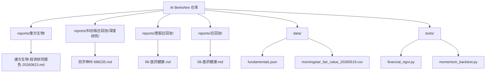
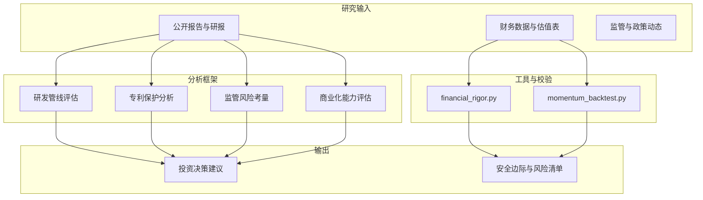
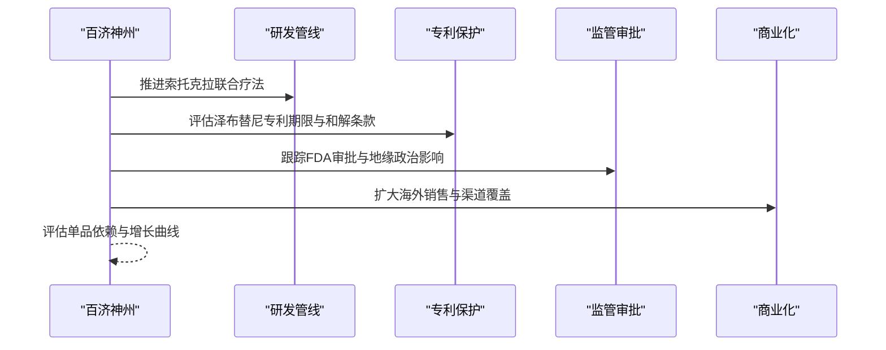
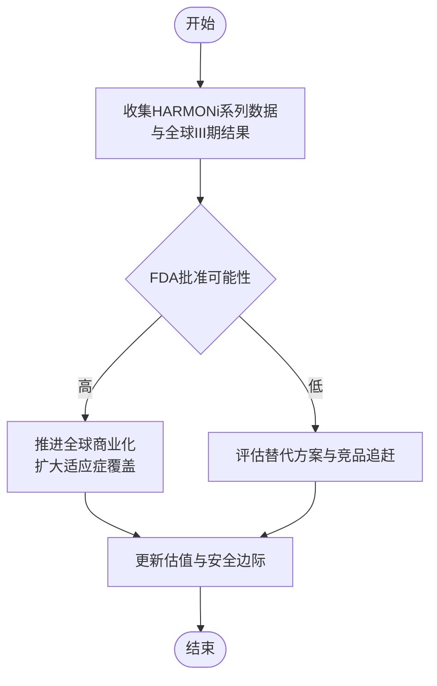
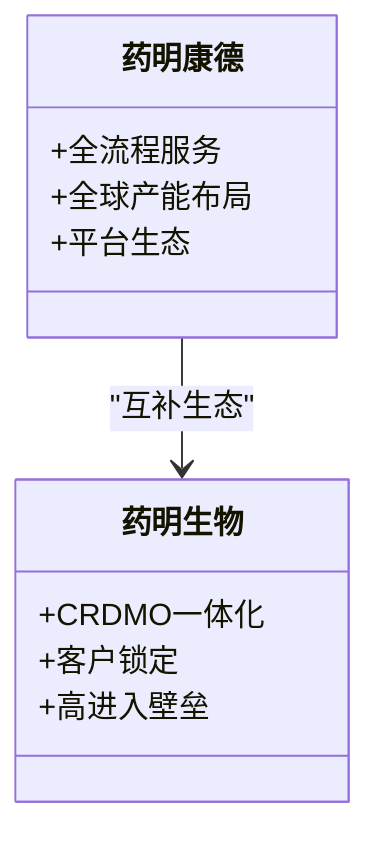
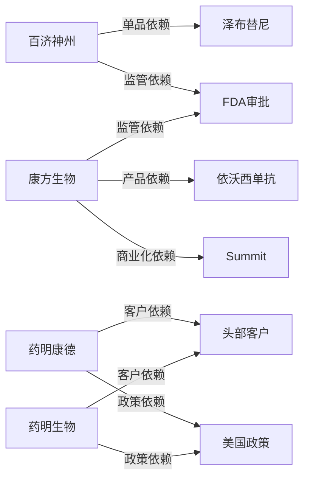

# 生物医药案例

<cite>
**本文引用的文件**
- [百济神州-688235.md](file://reports/科创板召回池/深度研究/百济神州-688235.md)
- [康方生物-投资研究报告-20260623.md](file://reports/康方生物/康方生物-投资研究报告-20260623.md)
- [06-医药健康.md](file://reports/港股召回池/06-医药健康.md)
- [06-医药健康.md](file://reports/召回池/06-医药健康.md)
</cite>

## 目录
1. [引言](#引言)
2. [项目结构](#项目结构)
3. [核心组件](#核心组件)
4. [架构概览](#架构概览)
5. [详细组件分析](#详细组件分析)
6. [依赖分析](#依赖分析)
7. [性能考虑](#性能考虑)
8. [故障排查指南](#故障排查指南)
9. [结论](#结论)
10. [附录](#附录)

## 引言
本文件面向AI Berkshire的生物医药投资研究，围绕恒瑞医药、药明康德、药明生物、百济神州、康方生物等企业，系统梳理“四角色分析框架”在该行业的应用：研发管线评估、专利保护分析、监管风险考量、商业化能力评估。通过对上述公司公开研究与报告的归纳，提炼创新药企的投资逻辑与风险点，给出可操作的研究流程与分析工具。

## 项目结构
本仓库的生物医药研究以“报告+数据+工具”的方式组织，核心内容分布在以下路径：
- reports/康方生物/：康方生物深度研究报告
- reports/科创板召回池/深度研究/：百济神州A股研究报告
- reports/港股召回池/、reports/召回池/：医药健康板块横向比较与公司研究
- data/：财务与估值相关数据
- tools/：财务严谨性校验与回测工具

图表来源
- [康方生物-投资研究报告-20260623.md](file://reports/康方生物/康方生物-投资研究报告-20260623.md)
- [百济神州-688235.md](file://reports/科创板召回池/深度研究/百济神州-688235.md)
- [06-医药健康.md](file://reports/港股召回池/06-医药健康.md)
- [06-医药健康.md](file://reports/召回池/06-医药健康.md)

章节来源
- [康方生物-投资研究报告-20260623.md:1-461](file://reports/康方生物/康方生物-投资研究报告-20260623.md#L1-L461)
- [百济神州-688235.md:1-253](file://reports/科创板召回池/深度研究/百济神州-688235.md#L1-L253)
- [06-医药健康.md:1-572](file://reports/港股召回池/06-医药健康.md#L1-L572)
- [06-医药健康.md:1-572](file://reports/召回池/06-医药健康.md#L1-L572)

## 核心组件
- 研发管线评估：聚焦候选药物的临床进展、适应症覆盖、全球竞争格局与差异化价值
- 专利保护分析：评估化合物/适应症专利期限、地域覆盖、仿制药跟进窗口与和解条款
- 监管风险考量：关注FDA/EMA/NMPA审批节奏、关键PDUFA日期、地缘政治影响
- 商业化能力：衡量销售团队规模、渠道覆盖、医保准入、定价权与全球商业化布局

章节来源
- [康方生物-投资研究报告-20260623.md:100-155](file://reports/康方生物/康方生物-投资研究报告-20260623.md#L100-L155)
- [百济神州-688235.md:176-217](file://reports/科创板召回池/深度研究/百济神州-688235.md#L176-L217)
- [06-医药健康.md:44-372](file://reports/港股召回池/06-医药健康.md#L44-L372)

## 架构概览
下图展示了AI Berkshire在生物医药领域的研究架构：以“四角色分析框架”为主线，结合财务与估值工具，形成从“数据采集—分析—决策—验证”的闭环。

图表来源
- [康方生物-投资研究报告-20260623.md:36-37](file://reports/康方生物/康方生物-投资研究报告-20260623.md#L36-L37)
- [06-医药健康.md:44-47](file://reports/港股召回池/06-医药健康.md#L44-L47)

## 详细组件分析

### 百济神州：从Biotech到Global Biopharma
- 研发管线评估：以泽布替尼为核心，覆盖CLL/SLL/MCL等B细胞瘤，全球市场份额持续提升；索托克拉作为第二增长极候选，联合疗法应对固定时长方案竞争
- 专利保护分析：泽布替尼化合物专利至2034年，美国市场仿制药禁售至2037年，形成明确保护窗口
- 监管风险考量：地缘政治风险（美国《生物安全法案》）、美国市场依赖度高、FDA审批节奏与政策不确定性
- 商业化能力：全球商业化网络完善，海外收入占比超60%，销售团队与渠道布局成熟

图表来源
- [百济神州-688235.md:134-172](file://reports/科创板召回池/深度研究/百济神州-688235.md#L134-L172)
- [百济神州-688235.md:182-197](file://reports/科创板召回池/深度研究/百济神州-688235.md#L182-L197)
- [百济神州-688235.md:204-217](file://reports/科创板召回池/深度研究/百济神州-688235.md#L204-L217)

章节来源
- [百济神州-688235.md:8-92](file://reports/科创板召回池/深度研究/百济神州-688235.md#L8-L92)
- [百济神州-688235.md:95-130](file://reports/科创板召回池/深度研究/百济神州-688235.md#L95-L130)
- [百济神州-688235.md:132-172](file://reports/科创板召回池/深度研究/百济神州-688235.md#L132-L172)
- [百济神州-688235.md:176-217](file://reports/科创板召回池/深度研究/百济神州-688235.md#L176-L217)
- [百济神州-688235.md:220-250](file://reports/科创板召回池/深度研究/百济神州-688235.md#L220-L250)

### 康方生物：双特异性抗体平台的商业化路径
- 研发管线评估：卡度尼利（PD-1/CTLA-4双抗）与依沃西单抗（PD-1/VEGF双抗）构成核心产品矩阵，HARMONi系列头对头击败K药的III期数据形成强壁垒
- 专利保护分析：Tetrabody平台多项核心专利获国家金奖，50+完全自主知识产权药物；需关注专利到期与第三方异议
- 监管风险考量：FDA PDUFA日期（2026.11.14）为关键二元事件；全球数据外推性存在不确定性；BIOSECURE法案对出海构成潜在风险
- 商业化能力：国内商业化团队快速扩张，海外依赖Summit商业化能力；需验证全球III期数据一致性与FDA批准落地

图表来源
- [康方生物-投资研究报告-20260623.md:336-359](file://reports/康方生物/康方生物-投资研究报告-20260623.md#L336-L359)
- [康方生物-投资研究报告-20260623.md:156-199](file://reports/康方生物/康方生物-投资研究报告-20260623.md#L156-L199)

章节来源
- [康方生物-投资研究报告-20260623.md:40-155](file://reports/康方生物/康方生物-投资研究报告-20260623.md#L40-L155)
- [康方生物-投资研究报告-20260623.md:156-258](file://reports/康方生物/康方生物-投资研究报告-20260623.md#L156-L258)
- [康方生物-投资研究报告-20260623.md:322-402](file://reports/康方生物/康方生物-投资研究报告-20260623.md#L322-L402)

### 药明康德/药明生物：CXO外包生态的护城河
- 研发管线评估：药明康德覆盖从靶点到商业化的全流程，药明生物聚焦CRDMO一体化模式，二者共同构成中国CRO/CDMO的双子星
- 专利保护分析：CXO模式以技术平台与项目经验形成高进入壁垒，专利保护相对间接，主要依靠客户锁定与流程标准化
- 监管风险考量：美国生物安全法案对出海构成不确定性；地缘政治风险影响海外产能与订单稳定性
- 商业化能力：药明康德以平台生态与全球产能布局增强抗风险能力；药明生物以CRDMO模式锁定客户生命周期

图表来源
- [06-医药健康.md:60-111](file://reports/港股召回池/06-医药健康.md#L60-L111)
- [06-医药健康.md:6-57](file://reports/港股召回池/06-医药健康.md#L6-L57)

章节来源
- [06-医药健康.md:6-111](file://reports/港股召回池/06-医药健康.md#L6-L111)
- [06-医药健康.md:44-47](file://reports/港股召回池/06-医药健康.md#L44-L47)

### 信达生物、翰森制药、石药集团、中国生物制药：创新药企的多维画像
- 信达生物：BD出海潜力巨大（与武田等220亿美元合作），管线价值高但盈利兑现仍早
- 翰森制药：财务质量最优（高毛利率、低杠杆、高自由现金流），但缺乏全球级大单品
- 石药集团：转型阵痛期（营收与净利润连续下滑），AI平台合作带来新希望
- 中国生物制药：创新占比达50%，商业化网络深厚，但利润率与全球竞争力仍待验证

章节来源
- [06-医药健康.md:168-217](file://reports/港股召回池/06-医药健康.md#L168-L217)
- [06-医药健康.md:220-271](file://reports/港股召回池/06-医药健康.md#L220-L271)
- [06-医药健康.md:274-327](file://reports/港股召回池/06-医药健康.md#L274-L327)
- [06-医药健康.md:330-383](file://reports/港股召回池/06-医药健康.md#L330-L383)

## 依赖分析
- 百济神州：高度依赖泽布替尼单一产品，索托克拉为第二增长极候选；地缘政治与监管审批是主要外部依赖
- 康方生物：依沃西单抗为估值核心，FDA批准与全球III期数据外推性决定成败；Summit商业化能力存在不确定性
- 药明康德/药明生物：客户粘性与全球产能布局是关键依赖；美国政策与地缘政治风险构成系统性依赖

图表来源
- [百济神州-688235.md:178-188](file://reports/科创板召回池/深度研究/百济神州-688235.md#L178-L188)
- [康方生物-投资研究报告-20260623.md:156-199](file://reports/康方生物/康方生物-投资研究报告-20260623.md#L156-L199)
- [06-医药健康.md:60-111](file://reports/港股召回池/06-医药健康.md#L60-L111)

章节来源
- [百济神州-688235.md:176-217](file://reports/科创板召回池/深度研究/百济神州-688235.md#L176-L217)
- [康方生物-投资研究报告-20260623.md:156-199](file://reports/康方生物/康方生物-投资研究报告-20260623.md#L156-L199)
- [06-医药健康.md:60-111](file://reports/港股召回池/06-医药健康.md#L60-L111)

## 性能考虑
- 研发管线评估的时效性：以最新临床数据与适应症获批为准绳，避免过时信息误导
- 专利保护分析的地域性：需关注不同司法辖区的专利期限与执法差异
- 监管风险考量的动态性：密切关注关键PDUFA日期、政策动向与地缘政治变化
- 商业化能力评估的可比性：以销售团队规模、渠道覆盖、医保准入与全球布局进行横向对比

## 故障排查指南
- 信息来源交叉验证：通过年报/中报、券商研报、临床试验数据库、SEC文件等多源交叉验证关键数据
- 估值工具校验：使用financial_rigor.py对关键估值指标进行精确验算，避免主观偏差
- 风险清单滚动更新：定期复盘FDA审批、全球III期数据、竞品追赶与地缘政治等关键变量

章节来源
- [康方生物-投资研究报告-20260623.md:26-37](file://reports/康方生物/康方生物-投资研究报告-20260623.md#L26-L37)
- [康方生物-投资研究报告-20260623.md:336-359](file://reports/康方生物/康方生物-投资研究报告-20260623.md#L336-L359)

## 结论
- 百济神州：全球化路径已验证，但单品依赖与地缘政治风险仍需持续跟踪
- 康方生物：双抗平台具备强技术/数据壁垒，但FDA审批与全球商业化是最大不确定性
- 药明康德/药明生物：CXO生态护城河深厚，但美国政策与地缘政治风险构成系统性挑战
- 信达生物、翰森制药、石药集团、中国生物制药：各有侧重，需结合财务质量与转型进展进行动态评估

## 附录
- 估值方法建议
  - 研发成功率折现：对处于不同开发阶段的候选药物赋予不同成功概率，折现至当前价值
  - 专利价值评估：基于专利期限、地域覆盖与仿制药跟进窗口，估算专利期内的增量现金流
  - 监管审批风险定价：对关键审批节点（如PDUFA）设置二元概率场景，调整贴现率或风险调整因子
  - 长期价值潜力：以“产品矩阵+商业化能力+专利保护+监管合规”四维评估，结合DCF与相对估值法进行综合判断

章节来源
- [百济神州-688235.md:132-172](file://reports/科创板召回池/深度研究/百济神州-688235.md#L132-L172)
- [康方生物-投资研究报告-20260623.md:322-402](file://reports/康方生物/康方生物-投资研究报告-20260623.md#L322-L402)
- [06-医药健康.md:60-111](file://reports/港股召回池/06-医药健康.md#L60-L111)