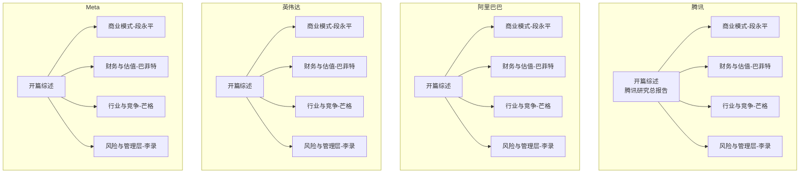
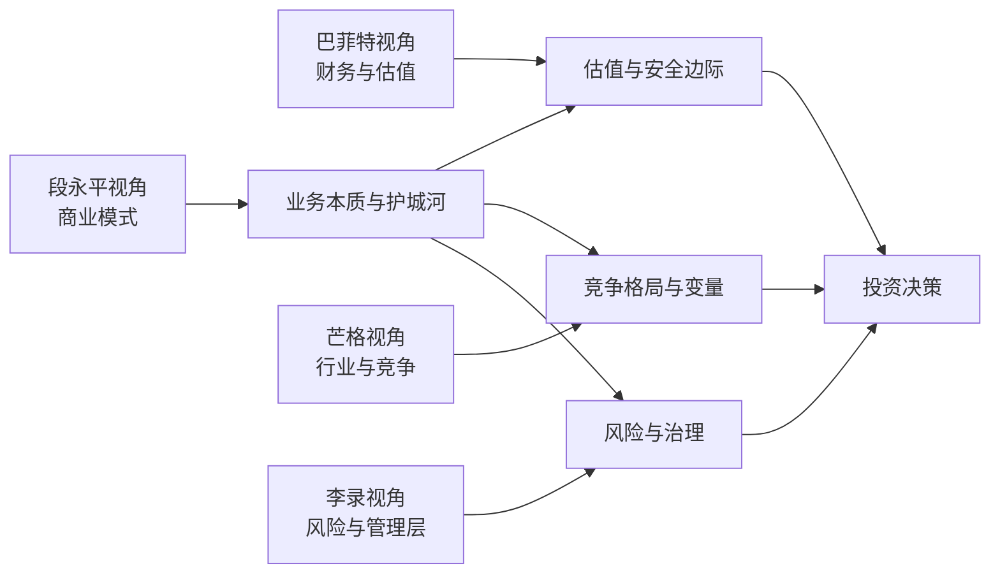
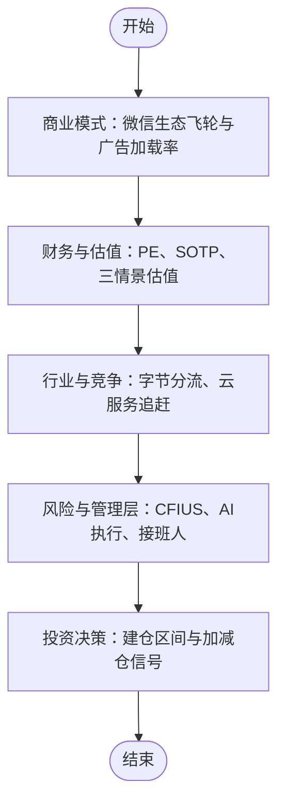
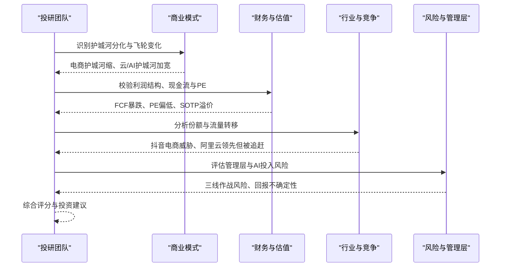
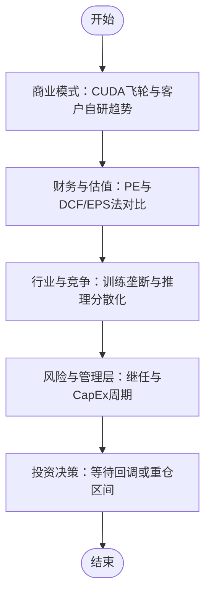
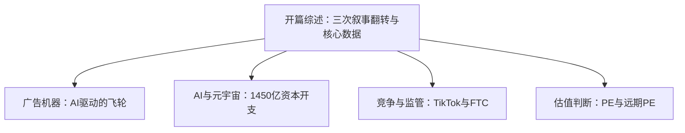
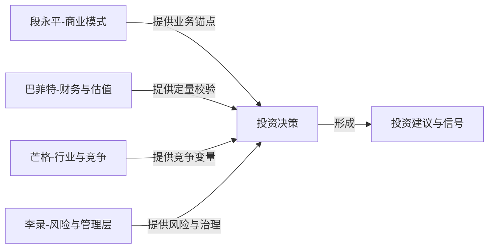

# 科技巨头案例

<cite>
**本文引用的文件**
- [腾讯-研究总报告-20260620.md](file://reports/腾讯/腾讯-research-20260620.md)
- [腾讯-商业模式分析-段永平视角.md](file://reports/腾讯/01-商业模式分析-段永平视角.md)
- [腾讯-财务估值分析-巴菲特视角.md](file://reports/腾讯/02-财务估值分析-巴菲特视角.md)
- [腾讯-行业竞争分析-芒格视角.md](file://reports/腾讯/03-行业竞争分析-芒格视角.md)
- [阿里巴巴-最终报告-投研团队-20260513.md](file://reports/阿里巴巴/最终报告-投研团队-20260513.md)
- [英伟达-最终报告-安全边际-20260420.md](file://reports/英伟达/最终报告-安全边际-20260420.md)
- [Meta-开篇-社交广告帝国的关键数据.md](file://reports/Meta/《看懂Meta》/01-开篇-社交广告帝国的关键数据.md)
</cite>

## 目录
1. [引言](#引言)
2. [项目结构](#项目结构)
3. [核心组件](#核心组件)
4. [架构总览](#架构总览)
5. [详细组件分析](#详细组件分析)
6. [依赖分析](#依赖分析)
7. [性能考量](#性能考量)
8. [故障排查指南](#故障排查指南)
9. [结论](#结论)
10. [附录](#附录)

## 引言
本文件面向AI Berkshire的实战研究目标，围绕“科技巨头企业”的投资研究过程，系统梳理并呈现四角色分析框架在大型科技公司中的应用：段永平的“商业模式”、巴菲特的“财务与估值”、芒格的“行业与竞争”、李录的“风险与管理层”。通过对腾讯、阿里巴巴、英伟达、Meta四家代表性公司进行案例剖析，提炼数据收集方法、关键指标计算流程、竞争优势识别路径与投资决策依据，并讨论AI时代转型的挑战与机遇，以及四大师方法论在科技股估值中的适用性与局限。

## 项目结构
本仓库以“报告”为核心产物，围绕不同公司形成系列研究文档，每个公司通常包含：
- 一段式“开篇”综述（奠定叙事与数据基础）
- 多角色分析子报告（商业模式、财务与估值、行业与竞争、风险与管理层）
- 综合“最终报告”或“研究总报告”，汇总评分、结论与投资建议

**图表来源**
- [腾讯-研究总报告-20260620.md](file://reports/腾讯/腾讯-research-20260620.md)
- [腾讯-商业模式分析-段永平视角.md](file://reports/腾讯/01-商业模式分析-段永平视角.md)
- [腾讯-财务估值分析-巴菲特视角.md](file://reports/腾讯/02-财务估值分析-巴菲特视角.md)
- [腾讯-行业竞争分析-芒格视角.md](file://reports/腾讯/03-行业竞争分析-芒格视角.md)
- [阿里巴巴-最终报告-投研团队-20260513.md](file://reports/阿里巴巴/最终报告-投研团队-20260513.md)
- [英伟达-最终报告-安全边际-20260420.md](file://reports/英伟达/最终报告-安全边际-20260420.md)
- [Meta-开篇-社交广告帝国的关键数据.md](file://reports/Meta/《看懂Meta》/01-开篇-社交广告帝国的关键数据.md)

**章节来源**
- [腾讯-研究总报告-20260620.md:1-286](file://reports/腾讯/腾讯-research-20260620.md#L1-L286)
- [阿里巴巴-最终报告-投研团队-20260513.md:1-185](file://reports/阿里巴巴/最终报告-投研团队-20260513.md#L1-L185)
- [英伟达-最终报告-安全边际-20260420.md:1-197](file://reports/英伟达/最终报告-安全边际-20260420.md#L1-L197)
- [Meta-开篇-社交广告帝国的关键数据.md:1-152](file://reports/Meta/《看懂Meta》/01-开篇-社交广告帝国的关键数据.md#L1-L152)

## 核心组件
本节聚焦四角色分析框架在科技巨头研究中的具体应用与协同：

- 段永平视角（商业模式）：强调“好生意”的三大标准（差异化、定价权、可持续性），并以微信生态飞轮、广告与游戏的利润结构、投资组合的“收获期”等为主线，构建对护城河与增长路径的深度理解。
- 巴菲特视角（财务与估值）：以“价格=付出，价值=得到”为原则，系统校验营收与利润趋势、盈利能力（毛利率、ROE、ROA）、现金流质量（OCF/FCF/FCF Yield）、资产负债表稳健性与股东回报，给出PE、PB、P/FCF、PS等指标的横向比较与历史区间定位，并进行三情景估值与安全边际评估。
- 芒格视角（行业与竞争）：以“反过来想，总是反过来想”为方法论，审视各业务板块的市场份额、增长弹性与结构性威胁（如字节对微信时长与广告预算的分流、阿里云AI云份额与火山引擎追赶、英伟达推理份额被侵蚀等），并提出“做多/做空”的关键变量与信号。
- 李录视角（风险与管理层）：关注管理层能力与诚信、组织治理、地缘政治与监管风险、客户集中度、AI CapEx周期、继任风险等，给出风险矩阵与管理层评估，作为投资决策的“安全垫”与“尾部风险”识别。

**章节来源**
- [腾讯-商业模式分析-段永平视角.md:1-408](file://reports/腾讯/01-商业模式分析-段永平视角.md#L1-L408)
- [腾讯-财务估值分析-巴菲特视角.md:1-414](file://reports/腾讯/02-财务估值分析-巴菲特视角.md#L1-L414)
- [腾讯-行业竞争分析-芒格视角.md:1-403](file://reports/腾讯/03-行业竞争分析-芒格视角.md#L1-L403)
- [阿里巴巴-最终报告-投研团队-20260513.md:1-185](file://reports/阿里巴巴/最终报告-投研团队-20260513.md#L1-L185)
- [英伟达-最终报告-安全边际-20260420.md:1-197](file://reports/英伟达/最终报告-安全边际-20260420.md#L1-L197)

## 架构总览
四角色分析框架在不同公司中的落地方式如下：

该架构强调：以“商业模式”为锚定，结合“财务与估值”进行定量校验，辅以“行业与竞争”与“风险与管理层”的定性审视，最终形成可执行的投资决策。

**图表来源**
- [腾讯-研究总报告-20260620.md:15-24](file://reports/腾讯/腾讯-research-20260620.md#L15-L24)
- [阿里巴巴-最终报告-投研团队-20260513.md:13-23](file://reports/阿里巴巴/最终报告-投研团队-20260513.md#L13-L23)
- [英伟达-最终报告-安全边际-20260420.md:17-27](file://reports/英伟达/最终报告-安全边际-20260420.md#L17-L27)

## 详细组件分析

### 腾讯：四角色综合案例
- 商业模式（段永平）：微信14亿MAU的社交关系链是“超级流量变现平台”，游戏、广告、支付、内容构成飞轮。广告加载率仍有巨大提升空间，视频号商业化以“防御为主、进攻为辅”，投资组合进入“收获期”。
- 财务与估值（巴菲特）：2025年营收7518亿，Non-IFRS净利润2596亿，毛利率从48%升至56%，自由现金流1826亿，PE约14.5x，SOTP估值780港元（当前440港元折价44%），三情景目标价中等安全边际。
- 行业与竞争（芒格）：社交通讯护城河稳固，但字节以算法分发与超级时长黑洞重新定义注意力分配；广告加载率提升空间大但受“克制”文化约束；云服务份额仅8%，AI云追赶中；游戏出海成为确定性增长。
- 风险与管理层（李录）：国内监管风险已过峰，但美国CFIUS审查与AI执行风险被低估；马化腾AI布局曾保守，投资组合1万亿+受政策制约，接班人规划不明确。

**图表来源**
- [腾讯-研究总报告-20260620.md:171-248](file://reports/腾讯/腾讯-research-20260620.md#L171-L248)
- [腾讯-商业模式分析-段永平视角.md:67-113](file://reports/腾讯/01-商业模式分析-段永平视角.md#L67-L113)
- [腾讯-财务估值分析-巴菲特视角.md:145-306](file://reports/腾讯/02-财务估值分析-巴菲特视角.md#L145-L306)
- [腾讯-行业竞争分析-芒格视角.md:112-139](file://reports/腾讯/03-行业竞争分析-芒格视角.md#L112-L139)

**章节来源**
- [腾讯-研究总报告-20260620.md:9-248](file://reports/腾讯/腾讯-research-20260620.md#L9-L248)
- [腾讯-商业模式分析-段永平视角.md:29-113](file://reports/腾讯/01-商业模式分析-段永平视角.md#L29-L113)
- [腾讯-财务估值分析-巴菲特视角.md:145-306](file://reports/腾讯/02-财务估值分析-巴菲特视角.md#L145-L306)
- [腾讯-行业竞争分析-芒格视角.md:112-139](file://reports/腾讯/03-行业竞争分析-芒格视角.md#L112-L139)

### 阿里巴巴：转型期的战略与风险
- 商业模式与护城河（段永平）：从电商帝国向“AI云+消费”双引擎转型，淘天飞轮从“自我加速”变为“靠外力维持”，电商护城河在缩，阿里云护城河在加宽。
- 财务与估值（巴菲特）：GAAP利润暴涨77%但Non-GAAP几乎零增长，自由现金流暴跌53%，净现金3890亿，PE 17.2x低于历史均值47%，SOTP高于市值，但市场担忧“帝国折价”。
- 行业与竞争（芒格）：电商份额四年丢14个百分点，抖音+快手侵蚀购物入口，阿里云AI云份额35.8%领先，但火山引擎追赶；淘宝闪购份额追平美团但EBITA下降。
- 风险与管理层（李录）：吴泳铭+蔡崇信方向正确但同时打三场战争，3800亿AI投入回报不确定，管理层公开反思战略误判。

**图表来源**
- [阿里巴巴-最终报告-投研团队-20260513.md:58-91](file://reports/阿里巴巴/最终报告-投研团队-20260513.md#L58-L91)

**章节来源**
- [阿里巴巴-最终报告-投研团队-20260513.md:7-174](file://reports/阿里巴巴/最终报告-投研团队-20260513.md#L7-L174)

### 英伟达：高增长下的安全边际评估
- 商业模式与护城河（段永平）：CUDA飞轮仍在但被绕过（Triton/TorchTPU），四大超级客户全部自研芯片，忠诚度下降；定价权双重信号（毛利率下行趋势确立）。
- 财务与估值（巴菲特）：ROE 124%、净利率56%、FCF 96.7B，PE 40.8x明显偏贵，DCF概率加权估值$90（高估55%），EPS增长法概率加权$263（仅+32%，年化5.7%）。
- 行业与竞争（芒格）：训练市场仍近垄断（>90%），推理份额快速流失（2028年可能降至20-30%），Google TPU外售与Broadcom威胁放大。
- 风险与管理层（李录）：黄仁勋无继任计划、客户集中度（4家占61%且全在自研）、AI CapEx周期风险、循环交易质疑。

**图表来源**
- [英伟达-最终报告-安全边际-20260420.md:50-83](file://reports/英伟达/最终报告-安全边际-20260420.md#L50-L83)

**章节来源**
- [英伟达-最终报告-安全边际-20260420.md:11-182](file://reports/英伟达/最终报告-安全边际-20260420.md#L11-L182)

### Meta：AI叙事切换与估值分歧
- 开篇综述（Meta）：2022年90美元到2026年597美元的三次叙事翻转，广告主业（月活39.8亿、净利润600亿美元+）、AI豪赌（资本开支1250-1450亿美元）、Reality Labs累计亏损836亿美元。三件事分别看都有人分析，但很少有人把它们放在一起权衡。
- 四角色视角（Meta系列）：广告机器（AI驱动的量价齐升）、AI与元宇宙（1450亿资本开支+Llama开源+Reality Labs）、竞争与监管（TikTok威胁+FTC反垄断+隐私风险）、估值判断（当前PE与远期PE对比）。

**图表来源**
- [Meta-开篇-社交广告帝国的关键数据.md:16-114](file://reports/Meta/《看懂Meta》/01-开篇-社交广告帝国的关键数据.md#L16-L114)

**章节来源**
- [Meta-开篇-社交广告帝国的关键数据.md:8-131](file://reports/Meta/《看懂Meta》/01-开篇-社交广告帝国的关键数据.md#L8-L131)

## 依赖分析
四角色分析框架在不同公司中的依赖关系如下：

- 腾讯：商业模式为“社交关系链+游戏+支付”飞轮，财务与估值显示PE偏低、SOTP折价，行业与竞争强调字节分流与云服务追赶，风险与管理层关注CFIUS与AI执行风险。
- 阿里巴巴：商业模式护城河分化，财务与估值反映GAAP与Non-GAAP差异、FCF暴跌，行业与竞争突出抖音电商威胁与阿里云领先但被追赶，风险与管理层评估三线作战与回报不确定性。
- 英伟达：商业模式CUDA飞轮被绕过，财务与估值PE偏高、DCF高估，行业与竞争训练与推理市场分化，风险与管理层关注客户集中度与继任风险。
- Meta：开篇综述奠定广告机器与AI叙事分歧，后续系列分别从四角色视角深化分析。

**图表来源**
- [腾讯-研究总报告-20260620.md:15-24](file://reports/腾讯/腾讯-research-20260620.md#L15-L24)
- [阿里巴巴-最终报告-投研团队-20260513.md:13-23](file://reports/阿里巴巴/最终报告-投研团队-20260513.md#L13-L23)
- [英伟达-最终报告-安全边际-20260420.md:17-27](file://reports/英伟达/最终报告-安全边际-20260420.md#L17-L27)
- [Meta-开篇-社交广告帝国的关键数据.md:104-114](file://reports/Meta/《看懂Meta》/01-开篇-社交广告帝国的关键数据.md#L104-L114)

**章节来源**
- [腾讯-研究总报告-20260620.md:15-248](file://reports/腾讯/腾讯-research-20260620.md#L15-L248)
- [阿里巴巴-最终报告-投研团队-20260513.md:13-131](file://reports/阿里巴巴/最终报告-投研团队-20260513.md#L13-L131)
- [英伟达-最终报告-安全边际-20260420.md:17-126](file://reports/英伟达/最终报告-安全边际-20260420.md#L17-L126)
- [Meta-开篇-社交广告帝国的关键数据.md:104-114](file://reports/Meta/《看懂Meta》/01-开篇-社交广告帝国的关键数据.md#L104-L114)

## 性能考量
- 数据质量与一致性：四角色报告普遍提供详尽的数据来源与交叉验证（如腾讯年报、媒体披露、第三方数据库），建议在复核时优先采用官方披露与权威第三方数据。
- 估值模型敏感性：英伟达报告明确指出DCF与EPS法的差异源于终端PE假设的敏感性，提示在进行估值时应关注不同模型的假设前提与风险边界。
- 安全边际与时间维度：腾讯报告强调“合理价格买优秀公司”，Meta系列强调“叙事切换的速度远快于基本面变化”，提示在短期波动与长期趋势之间把握安全边际与持有期限。

[本节为通用指导，无需特定文件来源]

## 故障排查指南
- 信息丰富度与共识偏见：英伟达报告指出“信息丰富度A级的陷阱”与“反偏见检查”，提示在A级信息充裕时更需警惕共识偏见，应独立判断CapEx周期拐点与TPU外售速度。
- 估值模型假设：英伟达报告强调“终端PE假设”对DCF与EPS法结论的影响，建议在进行敏感性分析时，对关键假设（如PE、增长率、终值）进行区间测试。
- 风险信号与减仓条件：英伟达报告列出“减仓/回避信号”（如云厂商CapEx增速转负、Meta正式采购TPU、毛利率跌破阈值、黄仁勋健康问题等），可作为动态跟踪指标。

**章节来源**
- [英伟达-最终报告-安全边际-20260420.md:186-192](file://reports/英伟达/最终报告-安全边际-20260420.md#L186-L192)

## 结论
四角色分析框架在科技巨头研究中体现出强大的系统性与互补性：段永平的“商业模式”提供“好生意”的定性锚点，巴菲特的“财务与估值”提供定量校验与安全边际评估，芒格的“行业与竞争”揭示结构性威胁与增长变量，李录的“风险与管理层”识别治理与地缘政治风险。对腾讯、阿里巴巴、英伟达、Meta的案例分析显示，AI时代既是机遇也是挑战，四角色框架有助于在信息洪流中保持冷静、聚焦关键变量并形成可执行的投资决策。

[本节为总结性内容，无需特定文件来源]

## 附录
- 数据收集方法要点
  - 官方披露：年报、季报、IR电话会、监管公告
  - 第三方数据库：Wind、Bloomberg、GuruFocus、MacroTrends、QuestMobile、IDC
  - 媒体与专业报告：CNBC、财联社、每经、36氪、华尔街见闻等
- 关键指标计算流程（示例）
  - 盈利能力：毛利率、经营利润率、净利率、ROE、ROA
  - 现金流：OCF、FCF、FCF/净利润、FCF Yield、自由现金流复合增速
  - 估值：PE、PB、P/FCF、PS、SOTP分部估值、三情景估值
  - 竞争指标：市场份额、DAU/MAU、广告加载率、电商GMV、云服务份额
- 竞争优势识别路径
  - 社交网络效应、转换成本、品牌、规模效应、技术壁垒
  - 产业链位置（内容创作→平台分发→用户消费→广告变现）
- 投资决策依据
  - 巴菲特买入前Checklist：理解生意、持久竞争优势、管理层、合理价格、安全边际、自由现金流、ROE、负债率、10年后还在、不可接受的风险
  - 四角色评分与综合判断：维度评分、定性判断、分层操作建议、关键催化剂与减仓信号

[本节为方法论与流程汇总，无需特定文件来源]