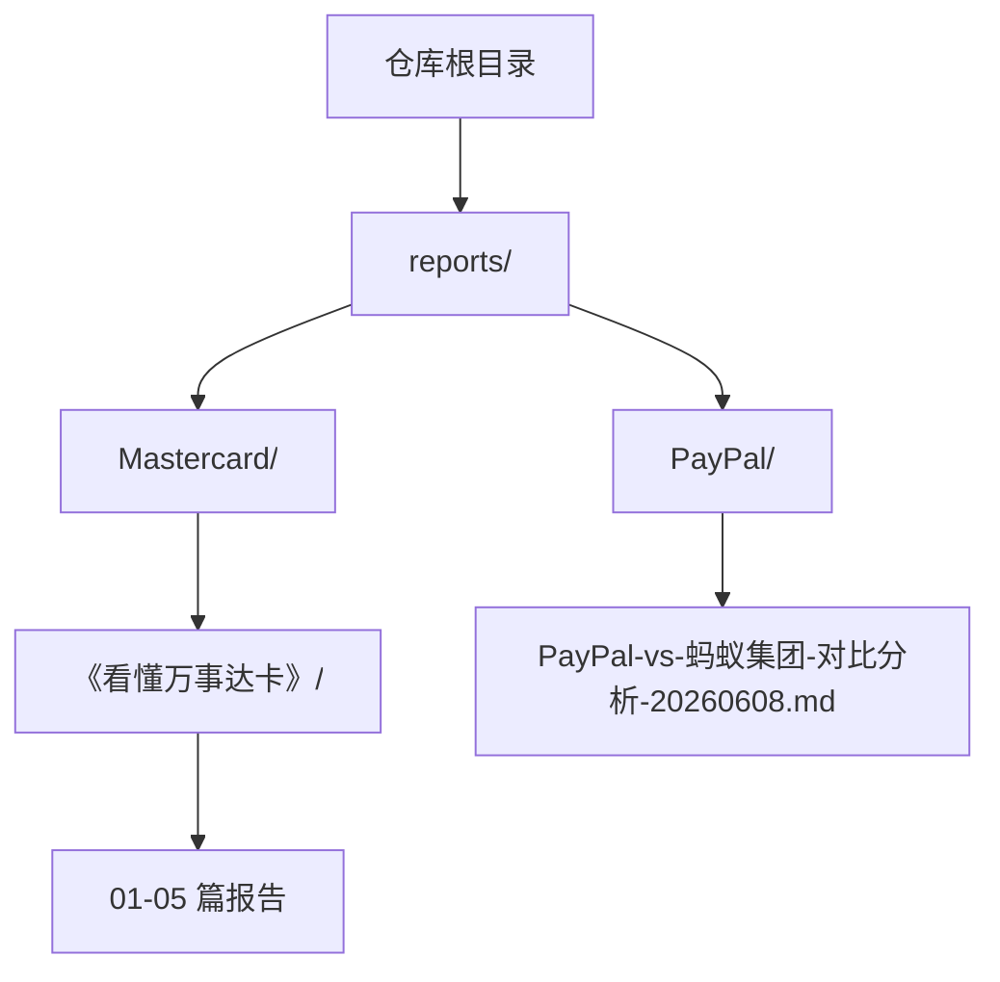
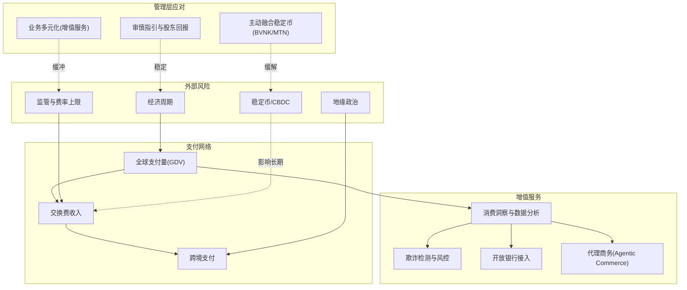
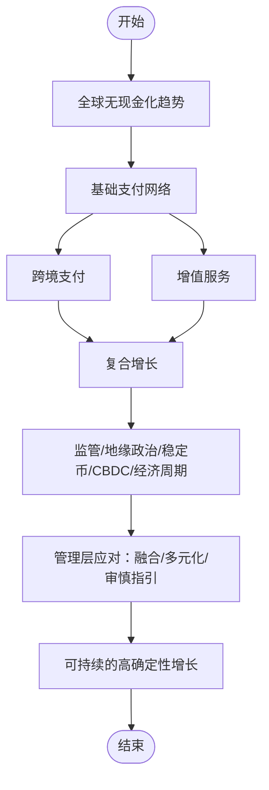
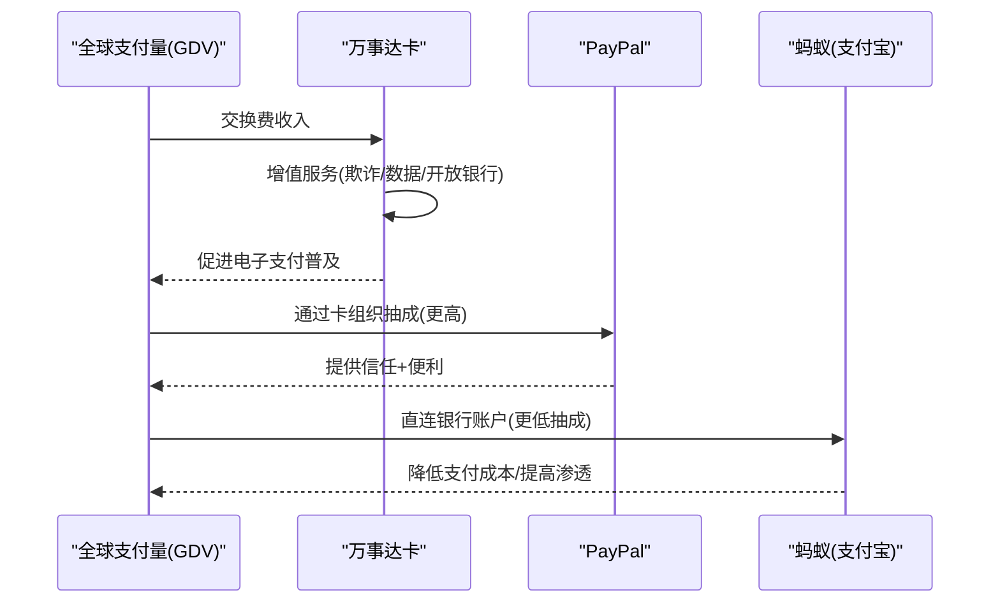
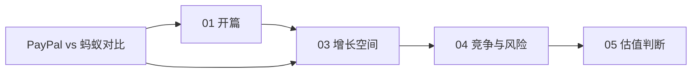

# 金融服务案例

<cite>
**本文引用的文件**
- [《看懂万事达卡》01-开篇-全球支付网络的收费站](file://reports/Mastercard/《看懂万事达卡》/01-开篇-全球支付网络的收费站.md)
- [《看懂万事达卡》03-增长空间-三条曲线与天花板](file://reports/Mastercard/《看懂万事达卡》/03-增长空间-三条曲线与天花板.md)
- [《看懂万事达卡》04-竞争与风险-双寡头的压力测试](file://reports/Mastercard/《看懂万事达卡》/04-竞争与风险-双寡头的压力测试.md)
- [《看懂万事达卡》05-估值判断-为确定性付多少溢价（终章）](file://reports/Mastercard/《看懂万事达卡》/05-估值判断-为确定性付多少溢价（终章）.md)
- [PayPal vs 蚂蚁集团：两大支付巨头的异同](file://reports/PayPal/PayPal-vs-蚂蚁集团-对比分析-20260608.md)
</cite>

## 目录
1. [引言](#引言)
2. [项目结构](#项目结构)
3. [核心组件](#核心组件)
4. [架构总览](#架构总览)
5. [详细组件分析](#详细组件分析)
6. [依赖分析](#依赖分析)
7. [性能考虑](#性能考虑)
8. [故障排查指南](#故障排查指南)
9. [结论](#结论)
10. [附录](#附录)

## 引言
本文件面向AI Berkshire的金融服务实战案例，围绕四角色分析框架（资产质量、风险管理能力、商业模式创新、盈利能力）对金融服务业进行系统拆解，并结合Repository中已有的“万事达卡”系列报告与“PayPal vs 蚂蚁集团”对比分析，提炼适用于金融股的估值方法与周期评估思路。由于仓库中暂未包含“蚂蚁集团”“蚂蚁数科”“招商银行”“中国平安”的系列报告，本文将以“万事达卡”作为金融服务业的典型样本进行深度剖析，并以“PayPal vs 蚂蚁集团”对比作为支付生态下的补充参照，帮助读者建立可迁移的分析范式。

## 项目结构
本仓库以“研究报告”为核心产出，按公司/主题分类存放。金融服务相关的内容主要集中在：
- Mastercard（万事达卡）系列报告：包含商业模式、增长空间、风险与估值的完整分析
- PayPal vs 蚂蚁集团：支付生态下的对比分析，揭示两类支付基础设施的差异与相似之处

图表来源
- [《看懂万事达卡》01-开篇-全球支付网络的收费站](file://reports/Mastercard/《看懂万事达卡》/01-开篇-全球支付网络的收费站.md)
- [PayPal vs 蚂蚁集团：两大支付巨头的异同](file://reports/PayPal/PayPal-vs-蚂蚁集团-对比分析-20260608.md)

章节来源
- [《看懂万事达卡》01-开篇-全球支付网络的收费站](file://reports/Mastercard/《看懂万事达卡》/01-开篇-全球支付网络的收费站.md)
- [PayPal vs 蚂蚁集团：两大支付巨头的异同](file://reports/PayPal/PayPal-vs-蚂蚁集团-对比分析-20260608.md)

## 核心组件
- 商业模式与资产质量评估
  - 万事达卡：全球支付网络的“收费站”，轻资产、零坏账、高利润率、高ROIC
  - PayPal vs 蚂蚁集团：支付基础设施的两种路径（卡组织增值层 vs 银行体系替代层）
- 风险管理能力
  - 监管压力、地缘政治、稳定币/CBDC、交换费上限、经济周期
- 商业模式创新
  - 从“收过路费”到“增值服务”（欺诈检测、数据分析、开放银行、代理商务）
- 盈利能力与估值
  - 收入增长、自由现金流、前瞻PE、历史PE、ROIC与WACC比较

章节来源
- [《看懂万事达卡》01-开篇-全球支付网络的收费站](file://reports/Mastercard/《看懂万事达卡》/01-开篇-全球支付网络的收费站.md)
- [《看懂万事达卡》03-增长空间-三条曲线与天花板](file://reports/Mastercard/《看懂万事达卡》/03-增长空间-三条曲线与天花板.md)
- [《看懂万事达卡》04-竞争与风险-双寡头的压力测试](file://reports/Mastercard/《看懂万事达卡》/04-竞争与风险-双寡头的压力测试.md)
- [《看懂万事达卡》05-估值判断-为确定性付多少溢价（终章）](file://reports/Mastercard/《看懂万事达卡》/05-估值判断-为确定性付多少溢价（终章）.md)
- [PayPal vs 蚂蚁集团：两大支付巨头的异同](file://reports/PayPal/PayPal-vs-蚂蚁集团-对比分析-20260608.md)

## 架构总览
下图展示了万事达卡从“支付网络”到“增值服务”的价值流，以及外部风险与管理层应对之间的互动关系。

图表来源
- [《看懂万事达卡》03-增长空间-三条曲线与天花板](file://reports/Mastercard/《看懂万事达卡》/03-增长空间-三条曲线与天花板.md)
- [《看懂万事达卡》04-竞争与风险-双寡头的压力测试](file://reports/Mastercard/《看懂万事达卡》/04-竞争与风险-双寡头的压力测试.md)

## 详细组件分析

### 万事达卡：全球支付网络的“收费站”
- 轻资产、零坏账、高利润率与高ROIC
  - 净利率、运营利润率、ROIC显著领先，自由现金流转化率高
- 三条增长曲线
  - 基础支付：全球无现金化趋势
  - 跨境支付：旅游、电商、B2B
  - 增值服务：数据资产变现（欺诈检测、消费洞察、开放银行、代理商务）
- 风险与管理层应对
  - 稳定币/CBDC：主动融合，构建稳定币支付栈与多代币网络
  - 监管：通过增值服务多元化对冲交换费下行
  - 地缘政治：200+国家分散化降低单一风险
  - 宏观经济：无信用风险，衰退时仅“瘦”不“死”

图表来源
- [《看懂万事达卡》03-增长空间-三条曲线与天花板](file://reports/Mastercard/《看懂万事达卡》/03-增长空间-三条曲线与天花板.md)
- [《看懂万事达卡》04-竞争与风险-双寡头的压力测试](file://reports/Mastercard/《看懂万事达卡》/04-竞争与风险-双寡头的压力测试.md)

章节来源
- [《看懂万事达卡》01-开篇-全球支付网络的收费站](file://reports/Mastercard/《看懂万事达卡》/01-开篇-全球支付网络的收费站.md)
- [《看懂万事达卡》03-增长空间-三条曲线与天花板](file://reports/Mastercard/《看懂万事达卡》/03-增长空间-三条曲线与天花板.md)
- [《看懂万事达卡》04-竞争与风险-双寡头的压力测试](file://reports/Mastercard/《看懂万事达卡》/04-竞争与风险-双寡头的压力测试.md)
- [《看懂万事达卡》05-估值判断-为确定性付多少溢价（终章）](file://reports/Mastercard/《看懂万事达卡》/05-估值判断-为确定性付多少溢价（终章）.md)

### PayPal vs 蚂蚁集团：支付生态的两种路径
- 相同点
  - 起源于第三方支付，解决信任问题；从支付延伸到金融与生活服务；均经历监管压力与估值压缩
- 核心差异
  - PayPal：卡组织生态的“增值层”，抽成率高但需分给卡组织；全球化市场，核心在美国/欧洲
  - 蚂蚁：银行体系的“替代层”，直连银行账户，抽成率低但受监管严格；中国为主，国际化刚起步
- 收入漏斗对比
  - PayPal抽成率更高，但需让渡给卡组织与发卡行；蚂蚁抽成率低，但净利润转化率也更低
- 本质差异
  - PayPal的天花板是卡组织的抽成空间；蚂蚁的天花板是监管允许的业务范围

图表来源
- [PayPal vs 蚂蚁集团：两大支付巨头的异同](file://reports/PayPal/PayPal-vs-蚂蚁集团-对比分析-20260608.md)

章节来源
- [PayPal vs 蚂蚁集团：两大支付巨头的异同](file://reports/PayPal/PayPal-vs-蚂蚁集团-对比分析-20260608.md)

### 金融服务业的四角色分析框架应用
- 资产质量评估
  - 以万事达卡为例：零坏账、轻资产、高ROIC、高自由现金流；以PayPal为例：依赖卡组织抽成，需关注费率与监管
- 风险管理能力
  - 监管与地缘政治：通过业务多元化与地理分散降低单一风险
  - 技术变革：主动拥抱稳定币/CBDC，保持“信任中介”价值
- 商业模式创新
  - 从“收过路费”到“数据资产变现”，构建第二增长极
- 盈利能力与估值
  - 前瞻PE与历史PE对比、自由现金流收益率、ROIC与WACC比较、增长情景下的回报模拟

章节来源
- [《看懂万事达卡》03-增长空间-三条曲线与天花板](file://reports/Mastercard/《看懂万事达卡》/03-增长空间-三条曲线与天花板.md)
- [《看懂万事达卡》04-竞争与风险-双寡头的压力测试](file://reports/Mastercard/《看懂万事达卡》/04-竞争与风险-双寡头的压力测试.md)
- [《看懂万事达卡》05-估值判断-为确定性付多少溢价（终章）](file://reports/Mastercard/《看懂万事达卡》/05-估值判断-为确定性付多少溢价（终章）.md)
- [PayPal vs 蚂蚁集团：两大支付巨头的异同](file://reports/PayPal/PayPal-vs-蚂蚁集团-对比分析-20260608.md)

## 依赖分析
- 内部依赖
  - 万事达卡系列报告形成完整闭环：开篇定义商业模式→增长空间→竞争与风险→估值判断
- 外部依赖
  - 监管政策、地缘政治、技术趋势（稳定币/CBDC）、宏观经济周期
- 互补性
  - PayPal vs 蚂蚁的对比为理解支付基础设施的两种路径提供了参照，有助于识别不同市场环境下的商业模式差异

图表来源
- [《看懂万事达卡》01-开篇-全球支付网络的收费站](file://reports/Mastercard/《看懂万事达卡》/01-开篇-全球支付网络的收费站.md)
- [《看懂万事达卡》03-增长空间-三条曲线与天花板](file://reports/Mastercard/《看懂万事达卡》/03-增长空间-三条曲线与天花板.md)
- [《看懂万事达卡》04-竞争与风险-双寡头的压力测试](file://reports/Mastercard/《看懂万事达卡》/04-竞争与风险-双寡头的压力测试.md)
- [《看懂万事达卡》05-估值判断-为确定性付多少溢价（终章）](file://reports/Mastercard/《看懂万事达卡》/05-估值判断-为确定性付多少溢价（终章）.md)
- [PayPal vs 蚂蚁集团：两大支付巨头的异同](file://reports/PayPal/PayPal-vs-蚂蚁集团-对比分析-20260608.md)

章节来源
- [《看懂万事达卡》01-开篇-全球支付网络的收费站](file://reports/Mastercard/《看懂万事达卡》/01-开篇-全球支付网络的收费站.md)
- [《看懂万事达卡》03-增长空间-三条曲线与天花板](file://reports/Mastercard/《看懂万事达卡》/03-增长空间-三条曲线与天花板.md)
- [《看懂万事达卡》04-竞争与风险-双寡头的压力测试](file://reports/Mastercard/《看懂万事达卡》/04-竞争与风险-双寡头的压力测试.md)
- [《看懂万事达卡》05-估值判断-为确定性付多少溢价（终章）](file://reports/Mastercard/《看懂万事达卡》/05-估值判断-为确定性付多少溢价（终章）.md)
- [PayPal vs 蚂蚁集团：两大支付巨头的异同](file://reports/PayPal/PayPal-vs-蚂蚁集团-对比分析-20260608.md)

## 性能考虑
- 盈利质量与自由现金流
  - 高ROIC与高自由现金流转化率表明资产使用效率高，抗周期能力强
- 增长确定性与估值敏感性
  - 在高位PE（如31倍前瞻PE）下，增长不及预期将导致估值下修与股价承压
- 风险缓释策略
  - 增值服务占比提升、地理与业务多元、管理层审慎指引，有助于降低单一风险暴露

## 故障排查指南
- 常见误区
  - 将万事达卡视为“信用卡公司”，忽视其“收费站”本质
  - 忽视稳定币/CBDC的长期影响，仅关注短期分流
  - 低估监管对交换费的长期影响
- 排查步骤
  - 明确商业模式与资产属性（零坏账、轻资产、高ROIC）
  - 评估三条增长曲线的确定性与天花板
  - 识别并量化关键风险（监管、地缘政治、技术变革、经济周期）
  - 以情景法评估不同增长情景下的回报与估值压力

章节来源
- [《看懂万事达卡》01-开篇-全球支付网络的收费站](file://reports/Mastercard/《看懂万事达卡》/01-开篇-全球支付网络的收费站.md)
- [《看懂万事达卡》04-竞争与风险-双寡头的压力测试](file://reports/Mastercard/《看懂万事达卡》/04-竞争与风险-双寡头的压力测试.md)
- [《看懂万事达卡》05-估值判断-为确定性付多少溢价（终章）](file://reports/Mastercard/《看懂万事达卡》/05-估值判断-为确定性付多少溢价（终章）.md)

## 结论
- 万事达卡代表了金融服务业中“轻资产、高确定性、强网络效应”的典型样本，其商业模式与增长路径具备高度可迁移性
- PayPal与蚂蚁的对比揭示了支付基础设施的两种范式：卡组织增值层与银行体系替代层，二者在抽成结构、监管约束与增长天花板上存在根本差异
- 四角色分析框架（资产质量、风险管理、商业模式创新、盈利能力）为评估金融股提供了系统工具，配合情景法与风险缓释策略，可在不同经济周期中做出更稳健的配置决策

## 附录
- 金融股估值要点
  - ROIC与WACC比较：衡量资本使用效率
  - 前瞻PE与历史PE对比：评估市场预期与估值合理性
  - 自由现金流收益率：衡量盈利质量与股东回报能力
  - 拨备覆盖率与监管风险：在银行业适用，可类比至支付网络的合规与风控成本
- 经济周期评估
  - 宏观经济下行：关注无信用风险企业的“瘦而不死”特性
  - 利率与监管周期：评估交换费与合规成本的变动弹性