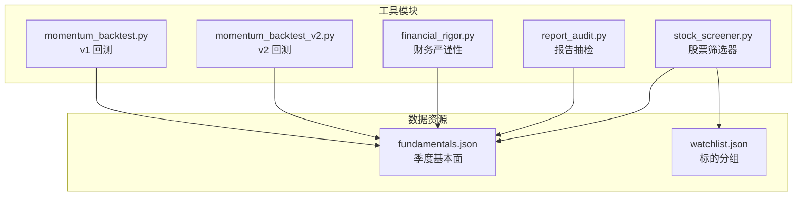
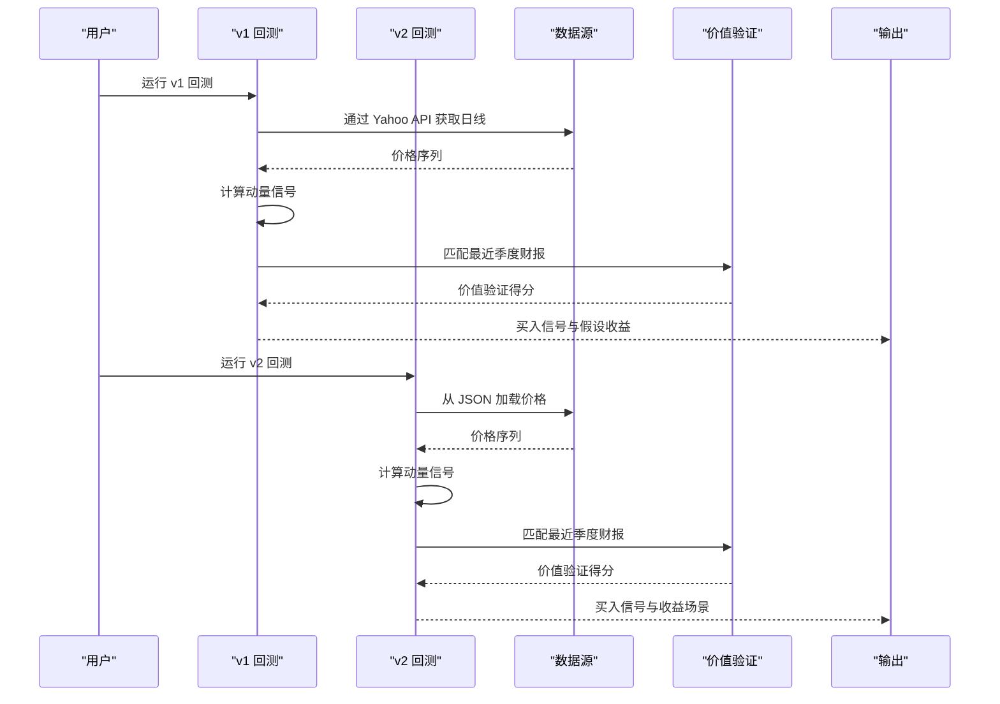
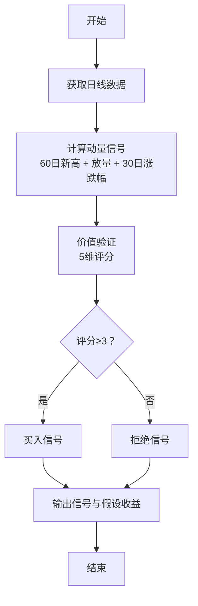
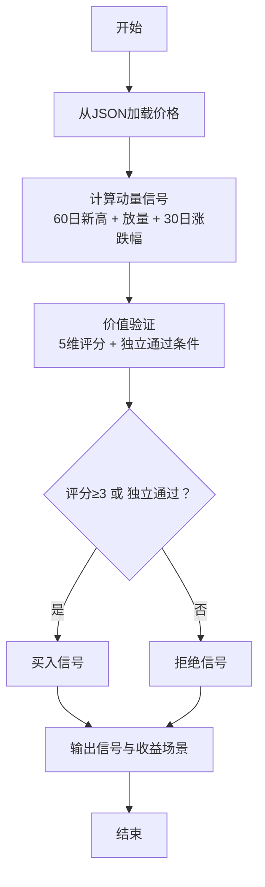
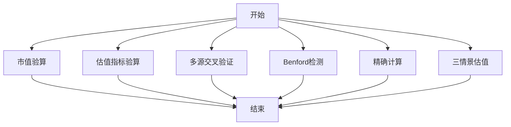
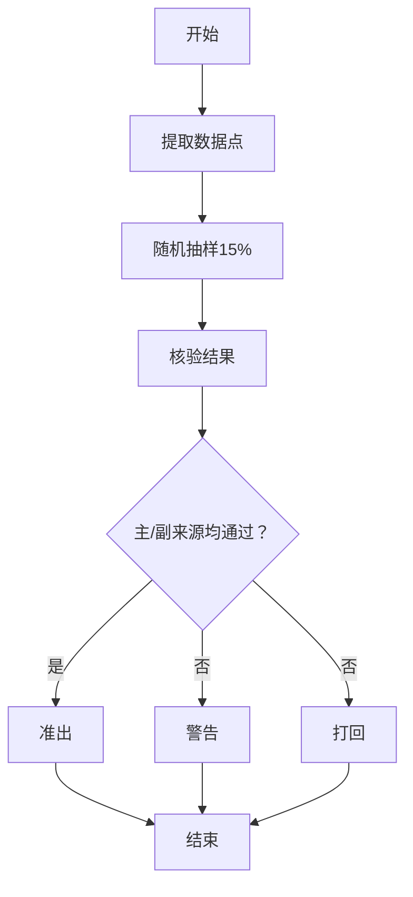
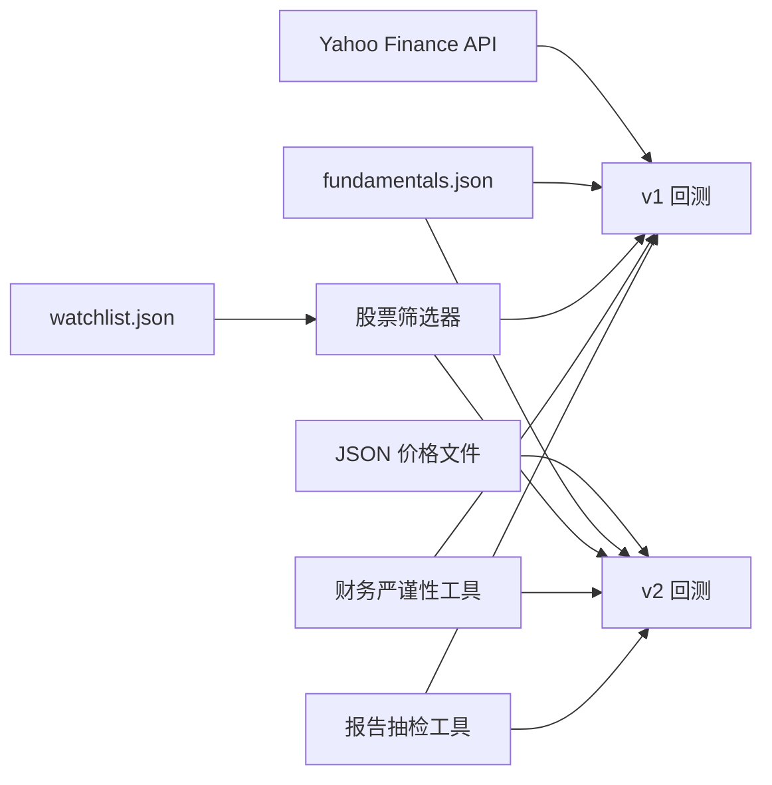

# 动量回测工具

<cite>
**本文引用的文件**
- [momentum_backtest.py](file://tools/momentum_backtest.py)
- [momentum_backtest_v2.py](file://tools/momentum_backtest_v2.py)
- [financial_rigor.py](file://tools/financial_rigor.py)
- [report_audit.py](file://tools/report_audit.py)
- [stock_screener.py](file://tools/stock_screener.py)
- [fundamentals.json](file://data/fundamentals.json)
- [watchlist.json](file://data/watchlist.json)
</cite>

## 目录
1. [简介](#简介)
2. [项目结构](#项目结构)
3. [核心组件](#核心组件)
4. [架构总览](#架构总览)
5. [详细组件分析](#详细组件分析)
6. [依赖关系分析](#依赖关系分析)
7. [性能考量](#性能考量)
8. [故障排查指南](#故障排查指南)
9. [结论](#结论)
10. [附录](#附录)

## 简介
本文件面向“动量回测工具”的综合技术文档，围绕动量策略的理论基础、回测框架设计、参数优化方法、风险指标体系、交易成本建模、绩效归因分析、版本迭代对比以及回测结果可视化等方面展开。项目仓库提供了两代动量回测工具（v1 与 v2），并配套财务严谨性校验与报告抽检工具，形成从数据采集、策略执行到结果验证的闭环。

## 项目结构
- 工具模块
  - 动量回测 v1：基于 Yahoo Finance API 获取日线数据，内置关键季度基本面数据，输出动量+价值信号与假设收益。
  - 动量回测 v2：从 JSON 文件加载价格数据，支持 NVDA 手工分析与 AMD/MU 实盘回测，强调“动量+价值”组合在 AI 芯片浪潮中的有效性。
  - 财务严谨性工具：提供市值、估值、多源交叉验证、Benford 定律检测、精确计算与三情景估值等能力。
  - 报告抽检工具：从研究报告中抽取财务数据点，进行抽检与准出/打回判决。
  - 股票筛选器：支持从 Yahoo Finance 获取日线数据、管理 watchlist、执行动量+价值扫描。
- 数据资源
  - fundamentals.json：按标的组织的季度基本面数据（营收同比、毛利率、EPS 超预期等）。
  - watchlist.json：标的分组清单（AI 芯片、AI 应用、AI 基础设施等）。

**图表来源**
- [momentum_backtest.py:1-361](file://tools/momentum_backtest.py#L1-L361)
- [momentum_backtest_v2.py:1-398](file://tools/momentum_backtest_v2.py#L1-L398)
- [financial_rigor.py:1-452](file://tools/financial_rigor.py#L1-L452)
- [report_audit.py:1-523](file://tools/report_audit.py#L1-L523)
- [stock_screener.py:1-400](file://tools/stock_screener.py#L1-L400)
- [fundamentals.json:1-36](file://data/fundamentals.json#L1-L36)
- [watchlist.json:1-38](file://data/watchlist.json#L1-L38)

**章节来源**
- [momentum_backtest.py:1-361](file://tools/momentum_backtest.py#L1-L361)
- [momentum_backtest_v2.py:1-398](file://tools/momentum_backtest_v2.py#L1-L398)
- [financial_rigor.py:1-452](file://tools/financial_rigor.py#L1-L452)
- [report_audit.py:1-523](file://tools/report_audit.py#L1-L523)
- [stock_screener.py:1-400](file://tools/stock_screener.py#L1-L400)
- [fundamentals.json:1-36](file://data/fundamentals.json#L1-L36)
- [watchlist.json:1-38](file://data/watchlist.json#L1-L38)

## 核心组件
- 动量发现引擎
  - v1：基于 60 日新高与 5 日/20 日成交量比阈值，计算 30 日涨跌幅，输出动量信号。
  - v2：与 v1 类似，但放宽放量阈值，统一输出格式便于后续价值验证。
- 价值验证引擎
  - v1：5 维验证（营收加速、毛利率扩张、EPS 超预期、营收高增长、毛利率健康），得分 ≥ 3 视为买入信号。
  - v2：同维度，但对 NVDA 与 MU 的周期特性提出独立通过条件（如毛利率连续改善、EPS 超预期 >30%）。
- 回测主逻辑
  - v1：按月去重，匹配最近季度财报，输出买入信号与假设收益。
  - v2：支持 NVDA 手工分析与 AMD/MU 实盘回测，输出收益场景比较。
- 数据与配置
  - fundamentals.json：季度基本面数据，覆盖 NVDA/AMD/MU。
  - watchlist.json：标的分组，便于批量扫描与回测。

**章节来源**
- [momentum_backtest.py:112-145](file://tools/momentum_backtest.py#L112-L145)
- [momentum_backtest.py:164-200](file://tools/momentum_backtest.py#L164-L200)
- [momentum_backtest.py:207-324](file://tools/momentum_backtest.py#L207-L324)
- [momentum_backtest_v2.py:92-112](file://tools/momentum_backtest_v2.py#L92-L112)
- [momentum_backtest_v2.py:130-159](file://tools/momentum_backtest_v2.py#L130-L159)
- [momentum_backtest_v2.py:166-245](file://tools/momentum_backtest_v2.py#L166-L245)
- [fundamentals.json:1-36](file://data/fundamentals.json#L1-L36)
- [watchlist.json:1-38](file://data/watchlist.json#L1-L38)

## 架构总览
回测系统由“数据获取/加载 → 动量发现 → 价值验证 → 回测汇总”四个阶段组成，v2 在 v1 基础上增强了对关键节点的手工分析与周期性标的的独立通过条件，并引入 JSON 价格数据加载机制。

**图表来源**
- [momentum_backtest.py:19-47](file://tools/momentum_backtest.py#L19-L47)
- [momentum_backtest.py:112-145](file://tools/momentum_backtest.py#L112-L145)
- [momentum_backtest.py:164-200](file://tools/momentum_backtest.py#L164-L200)
- [momentum_backtest.py:207-324](file://tools/momentum_backtest.py#L207-L324)
- [momentum_backtest_v2.py:71-85](file://tools/momentum_backtest_v2.py#L71-L85)
- [momentum_backtest_v2.py:92-112](file://tools/momentum_backtest_v2.py#L92-L112)
- [momentum_backtest_v2.py:130-159](file://tools/momentum_backtest_v2.py#L130-L159)
- [momentum_backtest_v2.py:166-245](file://tools/momentum_backtest_v2.py#L166-L245)

## 详细组件分析

### v1 动量回测组件
- 数据获取
  - 通过 Yahoo Finance Chart API 获取日线数据，包含时间戳、开盘/最高/最低/收盘价与成交量。
- 动量发现
  - 60 日新高 + 放量确认（5 日均量 > 20 日均量的 1.8 倍），计算 30 日涨跌幅。
- 价值验证
  - 5 维验证：营收同比增速改善、毛利率扩张、EPS 超预期、营收高增长、毛利率健康。
  - 得分 ≥ 3 为买入信号，同月仅保留首个信号。
- 回测汇总
  - 输出关键时间窗口内的信号明细与假设收益（从首次买入到回测末日）。

**图表来源**
- [momentum_backtest.py:19-47](file://tools/momentum_backtest.py#L19-L47)
- [momentum_backtest.py:112-145](file://tools/momentum_backtest.py#L112-L145)
- [momentum_backtest.py:164-200](file://tools/momentum_backtest.py#L164-L200)
- [momentum_backtest.py:207-324](file://tools/momentum_backtest.py#L207-L324)

**章节来源**
- [momentum_backtest.py:19-47](file://tools/momentum_backtest.py#L19-L47)
- [momentum_backtest.py:112-145](file://tools/momentum_backtest.py#L112-L145)
- [momentum_backtest.py:164-200](file://tools/momentum_backtest.py#L164-L200)
- [momentum_backtest.py:207-324](file://tools/momentum_backtest.py#L207-L324)

### v2 动量回测组件
- 数据加载
  - 从 JSON 文件加载价格序列，包含日期、收盘价、最高价与成交量。
- 动量发现
  - 60 日新高 + 放量确认（5 日均量 > 20 日均量的 1.5 倍），计算 30 日涨跌幅。
- 价值验证
  - 5 维验证：营收同比增速改善、毛利率扩张、EPS 超预期、营收高增长、毛利率健康。
  - 对 NVDA 与 MU 提出独立通过条件：毛利率连续改善 + 毛利率 >45% 或 EPS 超预期 >30%。
- 回测汇总
  - 输出买入/拒绝信号明细与收益场景比较（不同买入时点到固定卖出时点）。

**图表来源**
- [momentum_backtest_v2.py:71-85](file://tools/momentum_backtest_v2.py#L71-L85)
- [momentum_backtest_v2.py:92-112](file://tools/momentum_backtest_v2.py#L92-L112)
- [momentum_backtest_v2.py:130-159](file://tools/momentum_backtest_v2.py#L130-L159)
- [momentum_backtest_v2.py:166-245](file://tools/momentum_backtest_v2.py#L166-L245)

**章节来源**
- [momentum_backtest_v2.py:71-85](file://tools/momentum_backtest_v2.py#L71-L85)
- [momentum_backtest_v2.py:92-112](file://tools/momentum_backtest_v2.py#L92-L112)
- [momentum_backtest_v2.py:130-159](file://tools/momentum_backtest_v2.py#L130-L159)
- [momentum_backtest_v2.py:166-245](file://tools/momentum_backtest_v2.py#L166-L245)

### 财务严谨性工具
- 市值验算：股价 × 总股本 vs 报告市值，偏差阈值控制。
- 估值指标验算：PE、PB、ROE、P/FCF、股息率、PS 等，使用十进制精确计算。
- 多源交叉验证：对同一字段在多个来源间进行一致性检验。
- Benford 定律检测：快速筛查财务数据首位数字分布异常。
- 精确计算器：支持科学计数法的安全表达式求值。
- 三情景估值：乐观/中性/悲观情景下的目标价与涨跌幅。

**图表来源**
- [financial_rigor.py:61-91](file://tools/financial_rigor.py#L61-L91)
- [financial_rigor.py:98-160](file://tools/financial_rigor.py#L98-L160)
- [financial_rigor.py:167-204](file://tools/financial_rigor.py#L167-L204)
- [financial_rigor.py:214-281](file://tools/financial_rigor.py#L214-L281)
- [financial_rigor.py:288-313](file://tools/financial_rigor.py#L288-L313)
- [financial_rigor.py:320-361](file://tools/financial_rigor.py#L320-L361)

**章节来源**
- [financial_rigor.py:61-91](file://tools/financial_rigor.py#L61-L91)
- [financial_rigor.py:98-160](file://tools/financial_rigor.py#L98-L160)
- [financial_rigor.py:167-204](file://tools/financial_rigor.py#L167-L204)
- [financial_rigor.py:214-281](file://tools/financial_rigor.py#L214-L281)
- [financial_rigor.py:288-313](file://tools/financial_rigor.py#L288-L313)
- [financial_rigor.py:320-361](file://tools/financial_rigor.py#L320-L361)

### 报告抽检工具
- 数据点提取：从 Markdown 报告中抽取表格与 KV 行中的财务数据点，过滤噪声与无效标签。
- 随机抽样：按比例抽取 15% 的数据点，最少 3 个，最多 30 个。
- 准出/打回判决：对每个数据点进行主/副来源比对，输出通过/警告/不通过统计与原因。

**图表来源**
- [report_audit.py:155-226](file://tools/report_audit.py#L155-L226)
- [report_audit.py:229-236](file://tools/report_audit.py#L229-L236)
- [report_audit.py:253-398](file://tools/report_audit.py#L253-L398)

**章节来源**
- [report_audit.py:155-226](file://tools/report_audit.py#L155-L226)
- [report_audit.py:229-236](file://tools/report_audit.py#L229-L236)
- [report_audit.py:253-398](file://tools/report_audit.py#L253-L398)

### 股票筛选器（辅助）
- 从 Yahoo Finance 获取日线数据，支持批量扫描与 watchlist 管理。
- 与动量+价值验证结合，形成“扫描 → 信号 → 价值验证 → 回测”的完整链路。

**章节来源**
- [stock_screener.py:48-78](file://tools/stock_screener.py#L48-L78)
- [stock_screener.py:325-366](file://tools/stock_screener.py#L325-L366)

## 依赖关系分析
- v1 依赖 Yahoo Finance API 获取日线数据，内置基本面数据。
- v2 依赖 JSON 价格文件，内置基本面数据，并新增独立通过条件。
- 财务严谨性工具与报告抽检工具可独立运行，亦可嵌入回测流程进行数据质量控制。
- 股票筛选器可与回测工具配合，形成“扫描 → 回测 → 验证”的闭环。

**图表来源**
- [momentum_backtest.py:19-47](file://tools/momentum_backtest.py#L19-L47)
- [momentum_backtest_v2.py:71-85](file://tools/momentum_backtest_v2.py#L71-L85)
- [fundamentals.json:1-36](file://data/fundamentals.json#L1-L36)
- [watchlist.json:1-38](file://data/watchlist.json#L1-L38)
- [stock_screener.py:48-78](file://tools/stock_screener.py#L48-L78)
- [financial_rigor.py:61-91](file://tools/financial_rigor.py#L61-L91)
- [report_audit.py:155-226](file://tools/report_audit.py#L155-L226)

**章节来源**
- [momentum_backtest.py:19-47](file://tools/momentum_backtest.py#L19-L47)
- [momentum_backtest_v2.py:71-85](file://tools/momentum_backtest_v2.py#L71-L85)
- [fundamentals.json:1-36](file://data/fundamentals.json#L1-L36)
- [watchlist.json:1-38](file://data/watchlist.json#L1-L38)
- [stock_screener.py:48-78](file://tools/stock_screener.py#L48-L78)
- [financial_rigor.py:61-91](file://tools/financial_rigor.py#L61-L91)
- [report_audit.py:155-226](file://tools/report_audit.py#L155-L226)

## 性能考量
- v1 使用 Yahoo Finance API，受网络与接口限制，可能出现超时或数据缺失。
- v2 通过 JSON 文件加载价格，避免外部依赖，提高稳定性与可重复性。
- 价值验证采用简单阈值与评分，计算复杂度低，适合大规模扫描。
- 财务严谨性工具使用十进制精确计算，避免浮点误差累积，适合高精度财务分析。

[本节为通用指导，无需特定文件引用]

## 故障排查指南
- v1 无法获取价格数据
  - 检查网络连接与 Yahoo Finance API 可用性；必要时切换到 v2 的 JSON 数据方式。
- v2 价格文件缺失
  - 确认 /tmp/AMD_prices.json 与 /tmp/MU_prices.json 是否存在；若不存在，使用 v1 或外部数据源生成。
- 价值验证得分偏低
  - 检查基本面数据是否为信号日期之前的最近季度；对 NVDA/MU 可考虑启用独立通过条件。
- 报告抽检不通过
  - 核对主/副来源数据一致性；关注口径差异（GAAP/Non-GAAP、汇率等）。

**章节来源**
- [momentum_backtest.py:213-218](file://tools/momentum_backtest.py#L213-L218)
- [momentum_backtest_v2.py:350-364](file://tools/momentum_backtest_v2.py#L350-L364)
- [report_audit.py:253-398](file://tools/report_audit.py#L253-L398)

## 结论
本项目提供了从数据获取、动量发现、价值验证到回测汇总的完整工具链，v2 在 v1 基础上提升了稳定性与对关键节点的把握能力，并针对周期性标的提出了独立通过条件。财务严谨性与报告抽检工具进一步保障了数据质量与结论可信度。未来可在参数优化（网格搜索/遗传算法/贝叶斯优化）、交易成本建模（佣金、滑点、冲击成本）、风险指标体系（夏普比率、最大回撤、VaR、索提诺比率）与可视化方面继续扩展。

[本节为总结性内容，无需特定文件引用]

## 附录

### 版本迭代对比（v1 → v2）
- 数据来源
  - v1：Yahoo Finance API；v2：JSON 文件加载。
- 动量阈值
  - v1：放量阈值更高（1.8 倍）；v2：适度放宽（1.5 倍）。
- 价值验证
  - v1：5 维评分；v2：引入独立通过条件（毛利率连续改善、EPS 超预期 >30%）。
- 手工分析
  - v2：新增 NVDA 手工分析，展示关键节点与收益场景比较。
- 输出形式
  - v1：首次买入到回测末日的假设收益；v2：多时点收益场景对比。

**章节来源**
- [momentum_backtest.py:124-127](file://tools/momentum_backtest.py#L124-L127)
- [momentum_backtest_v2.py:100-101](file://tools/momentum_backtest_v2.py#L100-L101)
- [momentum_backtest_v2.py:130-159](file://tools/momentum_backtest_v2.py#L130-L159)
- [momentum_backtest_v2.py:252-334](file://tools/momentum_backtest_v2.py#L252-L334)

### 参数优化方法（概念性说明）
- 网格搜索
  - 在参数空间中穷举组合，评估每组的回测指标（如夏普比率），选择最优组合。
- 遗传算法
  - 通过选择、交叉、变异等操作迭代优化参数，适合高维非线性搜索空间。
- 贝叶斯优化
  - 基于高斯过程建模目标函数，自适应地平衡探索与利用，收敛更快。

[本节为概念性内容，无需特定文件引用]

### 风险指标计算体系（概念性说明）
- 夏普比率
  - (平均收益 − 无风险利率) / 收益标准差。
- 最大回撤
  - 从峰值到随后谷底的累计最大跌幅。
- VaR（风险价值）
  - 在给定置信水平下的最大潜在损失。
- 索提诺比率
  - (平均收益 − 无风险利率) / 下行标准差。

[本节为概念性内容，无需特定文件引用]

### 交易成本建模（概念性说明）
- 佣金费率
  - 按成交金额或固定费用收取，影响策略净收益。
- 滑点估计
  - 市场冲击导致的买卖价差，可通过历史价差或成交量加权价差估算。
- 冲击成本
  - 大额订单对市场价格的影响，可用价格回归或市场微观结构模型估计。

[本节为概念性内容，无需特定文件引用]

### 绩效归因分析（概念性说明）
- 超额收益分解
  - 将策略收益分解为择时、选股、行业配置等贡献。
- 因子暴露度
  - 计算策略对市值、动量、质量等因子的暴露程度。
- 风格漂移检测
  - 通过滚动窗口暴露度变化监测风格偏离。

[本节为概念性内容，无需特定文件引用]

### 回测结果可视化（概念性说明）
- 收益曲线
  - 累积收益随时间的变化，展示策略表现。
- 回撤分析
  - 回撤幅度与持续时间，评估下行风险。
- 策略对比
  - 多策略在同一时间段内的收益与风险对比。

[本节为概念性内容，无需特定文件引用]