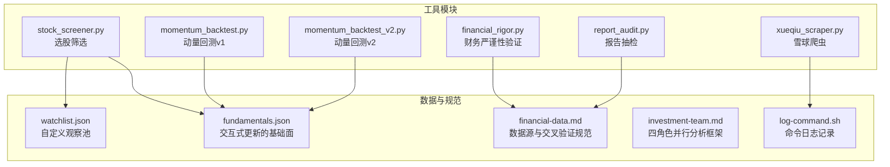
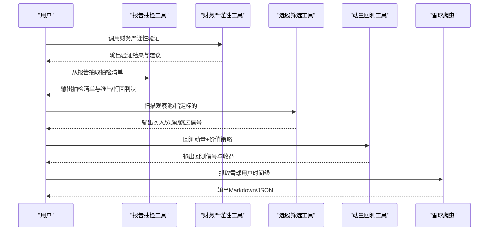
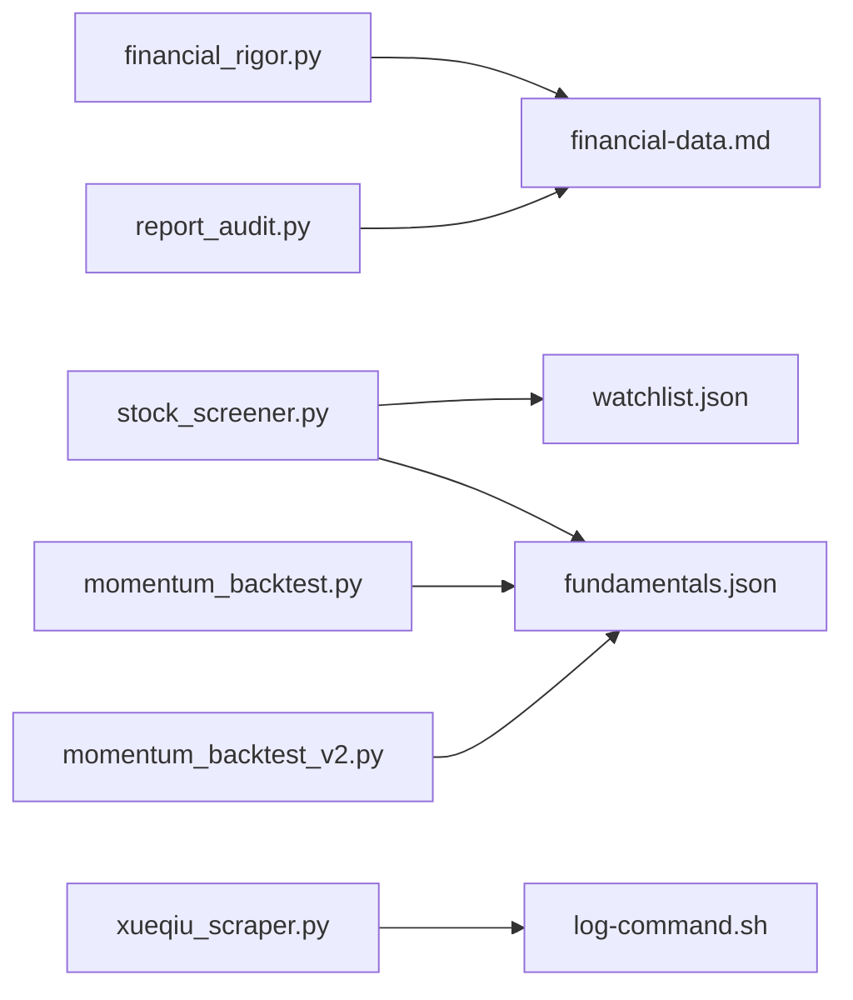

# 工具系统详解

<cite>
**本文引用的文件**
- [financial_rigor.py](file://tools/financial_rigor.py)
- [report_audit.py](file://tools/report_audit.py)
- [stock_screener.py](file://tools/stock_screener.py)
- [momentum_backtest.py](file://tools/momentum_backtest.py)
- [momentum_backtest_v2.py](file://tools/momentum_backtest_v2.py)
- [xueqiu_scraper.py](file://tools/xueqiu_scraper.py)
- [watchlist.json](file://data/watchlist.json)
- [fundamentals.json](file://data/fundamentals.json)
- [log-command.sh](file://tools/log-command.sh)
- [financial-data.md](file://skills/financial-data.md)
- [investment-team.md](file://skills/investment-team.md)
</cite>

## 目录
1. [简介](#简介)
2. [项目结构](#项目结构)
3. [核心组件](#核心组件)
4. [架构总览](#架构总览)
5. [详细组件分析](#详细组件分析)
6. [依赖关系分析](#依赖关系分析)
7. [性能考量](#性能考量)
8. [故障排查指南](#故障排查指南)
9. [结论](#结论)
10. [附录](#附录)

## 简介
本文件系统性梳理AI Berkshire工具体系，围绕五大工具模块展开：财务严谨性验证、报告质量控制、选股筛选、动量回测与数据抓取。文档深入解释精确十进制计算的必要性、报告抽检机制的设计思路、多因子选股模型的构建逻辑、动量策略的验证方法以及第三方数据源的集成方式，并提供参数说明、返回值格式、错误处理机制与性能优化建议，帮助技术与非技术读者高效掌握工具使用与实现原理。

## 项目结构
工具系统位于tools目录，配套数据文件位于data目录，技能规范位于skills目录，日志脚本位于tools目录。整体采用“命令行工具 + 配套数据/规范”的轻量架构，便于在研究流程中自动化与可审计。

图表来源
- [financial_rigor.py:1-452](file://tools/financial_rigor.py#L1-L452)
- [report_audit.py:1-523](file://tools/report_audit.py#L1-L523)
- [stock_screener.py:1-402](file://tools/stock_screener.py#L1-L402)
- [momentum_backtest.py:1-361](file://tools/momentum_backtest.py#L1-L361)
- [momentum_backtest_v2.py:1-398](file://tools/momentum_backtest_v2.py#L1-L398)
- [xueqiu_scraper.py:1-434](file://tools/xueqiu_scraper.py#L1-L434)
- [watchlist.json:1-38](file://data/watchlist.json#L1-L38)
- [fundamentals.json:1-36](file://data/fundamentals.json#L1-L36)
- [financial-data.md:1-104](file://skills/financial-data.md#L1-L104)
- [investment-team.md:1-214](file://skills/investment-team.md#L1-L214)
- [log-command.sh:1-40](file://tools/log-command.sh#L1-L40)

章节来源
- [financial_rigor.py:1-452](file://tools/financial_rigor.py#L1-L452)
- [report_audit.py:1-523](file://tools/report_audit.py#L1-L523)
- [stock_screener.py:1-402](file://tools/stock_screener.py#L1-L402)
- [momentum_backtest.py:1-361](file://tools/momentum_backtest.py#L1-L361)
- [momentum_backtest_v2.py:1-398](file://tools/momentum_backtest_v2.py#L1-L398)
- [xueqiu_scraper.py:1-434](file://tools/xueqiu_scraper.py#L1-L434)
- [watchlist.json:1-38](file://data/watchlist.json#L1-L38)
- [fundamentals.json:1-36](file://data/fundamentals.json#L1-L36)
- [financial-data.md:1-104](file://skills/financial-data.md#L1-L104)
- [investment-team.md:1-214](file://skills/investment-team.md#L1-L214)
- [log-command.sh:1-40](file://tools/log-command.sh#L1-L40)

## 核心组件
- 财务严谨性验证工具：提供市值验算、估值指标验算、多源交叉验证、Benford定律快速筛查、精确计算器与三情景估值，确保财务数据与计算的可审计性与一致性。
- 报告质量控制工具：从Markdown报告中抽取15%随机抽检数据点，与可靠信源比对，输出准出/打回判决，形成闭环的质量控制流程。
- 选股筛选工具：结合60日新高+放量确认的动量信号与6维价值验证（营收加速、毛利率扩张、盈利惊喜、营收高增长、毛利率健康、连续改善），并引入信号分级与独立通过条件，形成稳健的买入信号判定。
- 动量回测工具：对AI芯片三巨头（NVDA/AMD/MU）进行历史回测，验证框架在AI浪潮早期的捕捉能力，支持v1（API回测）与v2（JSON回测+NVDA手工分析）两种模式。
- 数据抓取工具：基于Playwright的雪球爬虫，支持登录态复用、双通道fetch、断点续爬、反限流与纯转发过滤，实现对指定用户时间线的高质量抓取与输出。

章节来源
- [financial_rigor.py:58-452](file://tools/financial_rigor.py#L58-L452)
- [report_audit.py:35-523](file://tools/report_audit.py#L35-L523)
- [stock_screener.py:118-402](file://tools/stock_screener.py#L118-L402)
- [momentum_backtest.py:1-361](file://tools/momentum_backtest.py#L1-L361)
- [momentum_backtest_v2.py:1-398](file://tools/momentum_backtest_v2.py#L1-L398)
- [xueqiu_scraper.py:1-434](file://tools/xueqiu_scraper.py#L1-L434)

## 架构总览
工具系统采用“模块化命令行工具 + 数据/规范文件”的架构，强调可审计、可重复与可扩展。财务严谨性验证与报告抽检贯穿研究流程，选股筛选与动量回测用于信号发现与验证，数据抓取用于外部信息整合。

图表来源
- [report_audit.py:405-523](file://tools/report_audit.py#L405-L523)
- [financial_rigor.py:367-452](file://tools/financial_rigor.py#L367-L452)
- [stock_screener.py:332-402](file://tools/stock_screener.py#L332-L402)
- [momentum_backtest.py:331-361](file://tools/momentum_backtest.py#L331-L361)
- [xueqiu_scraper.py:377-434](file://tools/xueqiu_scraper.py#L377-L434)

## 详细组件分析

### 财务严谨性验证工具
- 精确十进制计算的必要性：使用Decimal避免浮点误差，确保财务计算可审计、可复现。上下文精度与舍入策略统一，保证跨模块一致性。
- 核心功能
  - 市值验算：股价×总股本与报告市值对比，偏差阈值（>5%警示、>1%可接受）辅助判断数据质量。
  - 估值指标验算：PE/PB/PS/FCF/P/FCF_yield等指标自动计算，支持EPS、BVPS、FCF_per_share、Dividend、Revenue_per_share等输入。
  - 多源交叉验证：对同一字段在多个来源取值，以中位数为参考，设定容差阈值（默认2%），输出共识值与一致性判断。
  - Benford定律检测：对财务数据首位数字分布进行统计检验，辅助识别潜在的人为调整迹象。
  - 精确计算器：安全表达式求值，支持科学计数法与四则运算，输出人类可读格式与精确值。
  - 三情景估值：基于当前价格、EPS与股本，设定乐观/中性/悲观情景，计算未来目标价与涨跌幅，强调可审计性。
- 参数与返回
  - verify-market-cap：price, shares, reported, currency → 布尔（通过/不通过）
  - verify-valuation：price, eps, bvps, fcf_per_share, dividend, revenue_per_share → dict（指标映射）
  - cross-validate：field, values(JSON), unit, tolerance → dict（consensus, all_consistent）
  - benford：values(list) → dict（mad, chi2, conformity, is_conforming）
  - calc：expr → float（结果）
  - three-scenario：price, eps, shares_billion, growth(3), pe(3), years, currency → 无返回（打印表格）
- 错误处理与性能
  - Decimal转换与InvalidOperation捕获，避免异常传播。
  - Benford样本量阈值（<50）提示可靠性不足。
  - 表达式安全校验，防止任意代码注入。
- 使用建议
  - 估值与市值验算必须配合工具调用，禁止手工估算。
  - 多源交叉验证优先采用年报/交易所数据，副源用于差异分析。

章节来源
- [financial_rigor.py:24-452](file://tools/financial_rigor.py#L24-L452)
- [financial-data.md:1-104](file://skills/financial-data.md#L1-L104)

### 报告质量控制工具
- 设计思路：从研究报告中抽取15%随机样本，与可靠信源比对，形成“抽检清单→核验→准出/打回”的闭环，确保关键数据的准确性与一致性。
- 数据点提取
  - 支持Markdown表格、KV行与加粗数字行三种结构，过滤噪声标签与无效数值。
  - 抽样比例默认0.15，最少3个、最多30个，支持固定随机种子复现。
- 核验与判决
  - 容差阈值1%，超过即视为不通过；一个来源通过、另一个不通过视为警告。
  - 输出通过/警告/不通过计数、失败项明细与摘要，支持JSON输出与非零退出码便于CI。
- 参数与返回
  - extract：report, ratio, seed, dry-run → 控制台打印与JSON模板（可选）
  - verdict：results(JSON), report, output-json → dict（verdict, pass/warn/fail计数等）
- 错误处理与性能
  - 文件不存在、JSON解析失败等异常处理。
  - 通过非零退出码与彩色终端输出增强可读性。
- 使用建议
  - 优先使用skills/financial-data.md中的数据源与误差计算方法。
  - 对于汇率/会计口径差异，应在报告中说明并标注来源。

章节来源
- [report_audit.py:35-523](file://tools/report_audit.py#L35-L523)
- [financial-data.md:1-104](file://skills/financial-data.md#L1-L104)

### 选股筛选工具
- 动量发现（第一层）
  - 60日新高或近期突破，且近5日均量 > 20日均量×1.5，计算30日涨幅，形成初步动量信号。
- 价值验证（第二层）
  - 6维评分：营收加速、毛利率扩张、盈利惊喜（EPS超预期>10%）、营收高增长（>15%）、毛利率健康（>40%）、连续改善（毛利率连续2季改善）。
  - 独立通过条件：毛利率连续改善+>45%；或EPS超预期>30%（周期股）。
- 信号分级
  - ≥5/6 或（≥4/6 且独立通过）：买入8%
  - ≥4/6 或（≥3/6 且独立通过）：买入5%
  - ≥3/6：买入3%
  - 独立通过：买入3%
  - 否则：继续观察
- 参数与返回
  - scan_ticker：ticker → dict（grade, reason, advice, momentum, value）
  - grade_signal：momentum, value → (grade, reason, advice)
  - 默认观察池来自watchlist.json，支持交互式更新fundamentals.json。
- 错误处理与性能
  - 价格数据缺失时跳过，避免阻塞。
  - 输出紧凑格式，便于批量扫描。
- 使用建议
  - 结合报告抽检与财务严谨性验证，确保信号具备数据基础。
  - 对周期股（如MU）关注EPS超预期阈值调整。

章节来源
- [stock_screener.py:118-402](file://tools/stock_screener.py#L118-L402)
- [watchlist.json:1-38](file://data/watchlist.json#L1-L38)
- [fundamentals.json:1-36](file://data/fundamentals.json#L1-L36)

### 动量回测工具
- v1（momentum_backtest.py）
  - 通过Yahoo Finance API获取日线数据，对NVDA/AMD/MU进行回测。
  - 动量：60日新高+放量（近5日均量 > 20日均量×1.8）。
  - 价值：营收同比增速改善、毛利率扩张、EPS超预期>10%、营收高增长>15%、毛利率>40%，≥3/5为买入信号。
  - 输出关键信号与假设收益（从首次买入到回测末期）。
- v2（momentum_backtest_v2.py）
  - NVDA：手工录入关键节点（Yahoo API受限），验证框架在AI早期的捕捉能力。
  - AMD/MU：从JSON加载真实日线，扫描动量信号并进行价值验证。
  - 输出买入/拒绝信号与收益比较，突出“毛利率拐点+EPS超预期”对NVDA的重要性。
- 参数与返回
  - fetch_price_data：ticker, start_date, end_date → list（日线）
  - compute_momentum_signals：prices → list（信号）
  - verify_value：ticker, fund_data, prev_fund_data → dict（score, details）
  - backtest_ticker/backtest：ticker → dict（buy_signals, first_buy）
- 错误处理与性能
  - API超时/失败降级与提示。
  - 同月信号去重，避免重复交易。
- 使用建议
  - 将回测结果与实际财报节点对照，验证框架的前瞻性与稳健性。
  - 对周期股适当放宽阈值，关注EPS超预期与毛利率连续改善。

章节来源
- [momentum_backtest.py:1-361](file://tools/momentum_backtest.py#L1-L361)
- [momentum_backtest_v2.py:1-398](file://tools/momentum_backtest_v2.py#L1-L398)

### 数据抓取工具（雪球爬虫）
- 特性
  - Playwright登录态复用：首次headful登录，state持久化；失败回退context.request。
  - 双通道fetch：优先页面JS fetch，失败回退API请求。
  - 断点续爬：每10页保存进度，连续5次超时自动退出保进度。
  - 反限流：2-4s随机抖动，每50页长休30s。
  - 纯转发过滤：仅收录被采集用户本人原发言。
- 参数与返回
  - --user-id, --keywords, --output, --raw-json, --state-path, --dump-all, --from-cache
  - 返回：原始JSON与Markdown输出，支持从缓存过滤生成。
- 错误处理与性能
  - 登录态过期自动回退交互登录。
  - 进度文件与全量缓存分离，便于离线多主题分析。
- 使用建议
  - 首次运行建议设置环境变量XQ_PHONE/XQ_PASSWORD，减少交互。
  - 使用--dump-all生成全量缓存，后续可多次按关键词过滤。

章节来源
- [xueqiu_scraper.py:1-434](file://tools/xueqiu_scraper.py#L1-L434)
- [log-command.sh:1-40](file://tools/log-command.sh#L1-L40)

## 依赖关系分析
- 模块内聚与耦合
  - financial_rigor.py与report_audit.py均依赖skills/financial-data.md的交叉验证规范，确保数据质量标准一致。
  - stock_screener.py依赖data/watchlist.json与data/fundamentals.json，形成“观察池+交互式基础面”的数据闭环。
  - momentum_backtest.py与momentum_backtest_v2.py共享价值验证逻辑，v2通过JSON数据与手工节点增强可解释性。
  - xueqiu_scraper.py依赖Playwright异步API，log-command.sh提供命令日志记录。
- 外部依赖
  - financial_rigor.py与report_audit.py为纯Python标准库实现，零外部依赖。
  - stock_screener.py使用subprocess调用curl获取Yahoo Finance数据。
  - xueqiu_scraper.py依赖Playwright（chromium）与网络请求。
- 潜在循环依赖
  - 工具间无直接循环导入，通过数据文件与规范文件间接耦合，保持清晰边界。

图表来源
- [financial_rigor.py:1-452](file://tools/financial_rigor.py#L1-L452)
- [report_audit.py:1-523](file://tools/report_audit.py#L1-L523)
- [stock_screener.py:1-402](file://tools/stock_screener.py#L1-L402)
- [momentum_backtest.py:1-361](file://tools/momentum_backtest.py#L1-L361)
- [momentum_backtest_v2.py:1-398](file://tools/momentum_backtest_v2.py#L1-L398)
- [xueqiu_scraper.py:1-434](file://tools/xueqiu_scraper.py#L1-L434)
- [watchlist.json:1-38](file://data/watchlist.json#L1-L38)
- [fundamentals.json:1-36](file://data/fundamentals.json#L1-L36)
- [financial-data.md:1-104](file://skills/financial-data.md#L1-L104)
- [log-command.sh:1-40](file://tools/log-command.sh#L1-L40)

章节来源
- [financial_rigor.py:1-452](file://tools/financial_rigor.py#L1-L452)
- [report_audit.py:1-523](file://tools/report_audit.py#L1-L523)
- [stock_screener.py:1-402](file://tools/stock_screener.py#L1-L402)
- [momentum_backtest.py:1-361](file://tools/momentum_backtest.py#L1-L361)
- [momentum_backtest_v2.py:1-398](file://tools/momentum_backtest_v2.py#L1-L398)
- [xueqiu_scraper.py:1-434](file://tools/xueqiu_scraper.py#L1-L434)
- [watchlist.json:1-38](file://data/watchlist.json#L1-L38)
- [fundamentals.json:1-36](file://data/fundamentals.json#L1-L36)
- [financial-data.md:1-104](file://skills/financial-data.md#L1-L104)
- [log-command.sh:1-40](file://tools/log-command.sh#L1-L40)

## 性能考量
- 精确十进制计算
  - Decimal上下文精度28位，ROUND_HALF_EVEN舍入，避免累积误差；适合财务与估值计算。
- 数据抓取
  - Playwright异步并发与随机延迟降低被限流风险；断点续爬避免长时间重跑。
- 选股扫描
  - 价格数据截断长度（>60日）与均量计算避免无效信号；输出紧凑格式便于批量处理。
- 回测
  - 同月信号去重减少重复交易；v2通过JSON数据与手工节点提高可解释性与稳定性。
- 建议
  - 对大规模扫描，建议分批执行并缓存中间结果。
  - 在网络不稳定环境下，优先使用断点续爬与全量缓存策略。

[本节为通用指导，无需特定文件引用]

## 故障排查指南
- 财务严谨性工具
  - Decimal转换失败：检查输入类型，确保数值字符串化后可转换为Decimal。
  - Benford样本量不足：增加样本或标注“可靠性不足”。
  - 表达式非法：仅允许数字与四则运算、括号与科学计数法。
- 报告抽检工具
  - 文件不存在：确认报告路径正确。
  - JSON解析失败：检查results格式与编码。
  - 容差阈值过高：建议按规范调整至1%。
- 选股筛选工具
  - 价格数据为空：检查网络与API可用性；必要时使用备用数据源。
  - 基础面缺失：使用--update补充quarterly数据。
- 回测工具
  - Yahoo API受限：使用v2的JSON数据或手工节点；或切换到替代数据源。
  - 信号重复：确认同月去重逻辑生效。
- 雪球爬虫
  - 登录失败：检查环境变量或交互登录流程；确认state文件未过期。
  - 连续超时：启用断点续爬与长休策略；检查网络与代理。
- 日志记录
  - 命令日志未记录：确认log-command.sh权限与hook配置；检查日志目录可写。

章节来源
- [financial_rigor.py:288-314](file://tools/financial_rigor.py#L288-L314)
- [report_audit.py:501-518](file://tools/report_audit.py#L501-L518)
- [stock_screener.py:283-325](file://tools/stock_screener.py#L283-L325)
- [momentum_backtest.py:45-47](file://tools/momentum_backtest.py#L45-L47)
- [momentum_backtest_v2.py:347-364](file://tools/momentum_backtest_v2.py#L347-L364)
- [xueqiu_scraper.py:111-151](file://tools/xueqiu_scraper.py#L111-L151)
- [log-command.sh:1-40](file://tools/log-command.sh#L1-L40)

## 结论
AI Berkshire工具系统通过“财务严谨性验证 + 报告抽检 + 选股筛选 + 动量回测 + 数据抓取”的闭环，实现了研究过程的可审计、可重复与可扩展。精确十进制计算确保财务数据的准确性；报告抽检机制保障关键数据的一致性；多因子选股模型结合动量与价值，辅以信号分级与独立通过条件，提升信号质量；动量回测验证框架在AI浪潮早期的捕捉能力；第三方数据抓取工具提供高质量外部信息整合。建议在实际使用中严格遵循规范，结合工具输出进行二次验证，持续优化阈值与流程。

[本节为总结性内容，无需特定文件引用]

## 附录
- 四角色并行分析框架（investment-team.md）
  - 团队角色：team-lead、business-analyst、financial-analyst、industry-researcher、risk-assessor。
  - 执行流程：团队框架展示→AI研究偏见评估→创建团队→四个任务→并行Agent→接收报告→汇总→保存→数据抽检→清理团队。
  - 关键要求：财务数据必须来自两个独立来源，交叉验证误差>1%须标记；最终报告需包含信息丰富度评级与AI研究局限性声明。
- 命令行工具使用示例
  - 财务严谨性验证：参见tools/financial_rigor.py的CLI帮助与示例。
  - 报告抽检：参见tools/report_audit.py的CLI帮助与示例。
  - 选股筛选：参见tools/stock_screener.py的CLI帮助与示例。
  - 动量回测：参见tools/momentum_backtest.py与tools/momentum_backtest_v2.py的CLI帮助与示例。
  - 雪球爬虫：参见tools/xueqiu_scraper.py的CLI帮助与示例。

章节来源
- [investment-team.md:1-214](file://skills/investment-team.md#L1-L214)
- [financial_rigor.py:367-452](file://tools/financial_rigor.py#L367-L452)
- [report_audit.py:405-523](file://tools/report_audit.py#L405-L523)
- [stock_screener.py:332-402](file://tools/stock_screener.py#L332-L402)
- [momentum_backtest.py:331-361](file://tools/momentum_backtest.py#L331-L361)
- [momentum_backtest_v2.py:341-398](file://tools/momentum_backtest_v2.py#L341-L398)
- [xueqiu_scraper.py:352-434](file://tools/xueqiu_scraper.py#L352-L434)