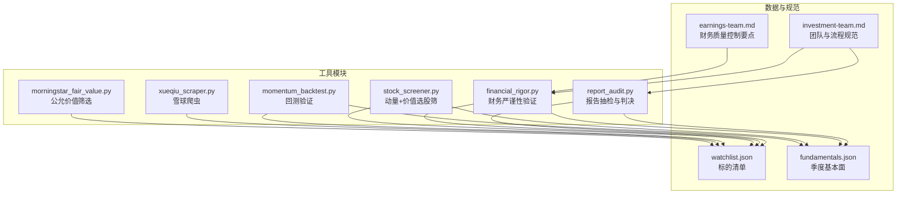
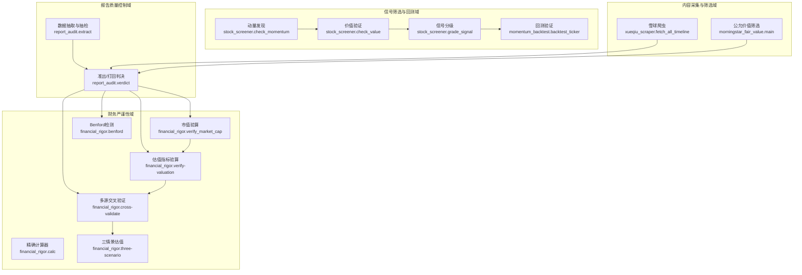
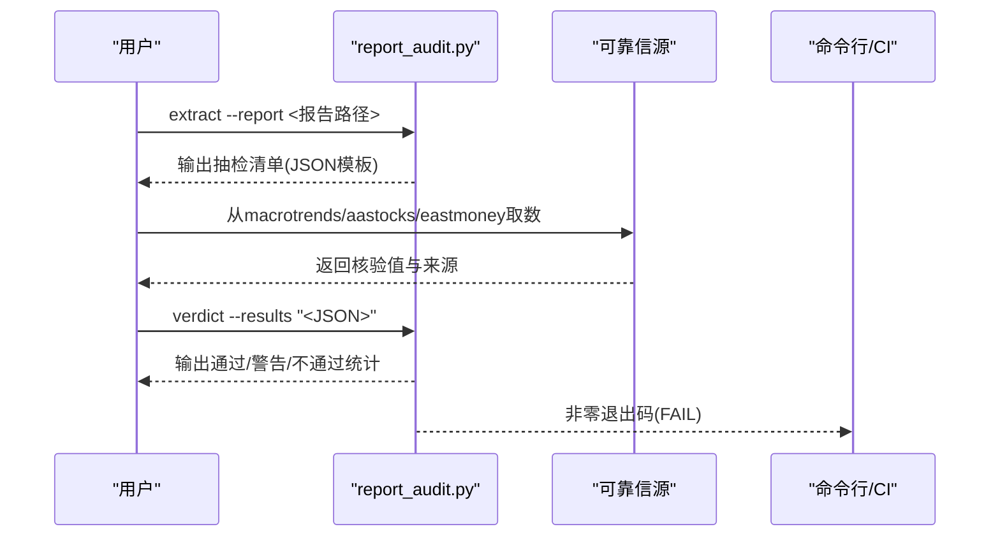
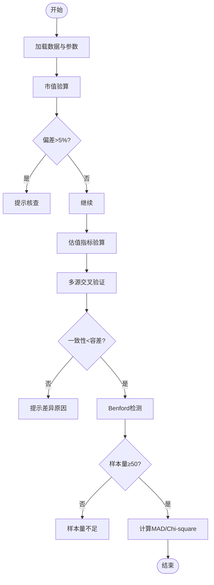
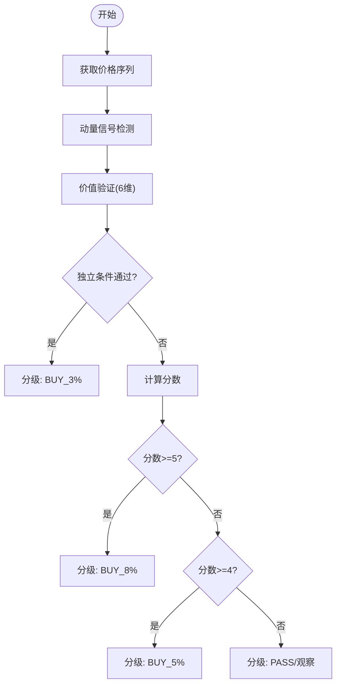
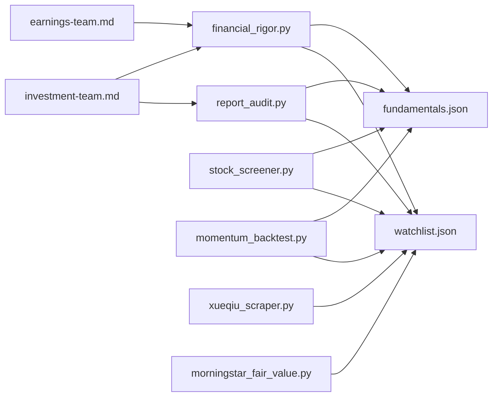

# 报告质量控制工具

<cite>
**本文档引用的文件**
- [report_audit.py](file://tools/report_audit.py)
- [financial_rigor.py](file://tools/financial_rigor.py)
- [stock_screener.py](file://tools/stock_screener.py)
- [momentum_backtest.py](file://tools/momentum_backtest.py)
- [xueqiu_scraper.py](file://tools/xueqiu_scraper.py)
- [morningstar_fair_value.py](file://tools/morningstar_fair_value.py)
- [investment-team.md](file://skills/investment-team.md)
- [earnings-team.md](file://skills/earnings-team.md)
- [watchlist.json](file://data/watchlist.json)
- [fundamentals.json](file://data/fundamentals.json)
</cite>

## 目录
1. [简介](#简介)
2. [项目结构](#项目结构)
3. [核心组件](#核心组件)
4. [架构总览](#架构总览)
5. [详细组件分析](#详细组件分析)
6. [依赖关系分析](#依赖关系分析)
7. [性能考量](#性能考量)
8. [故障排查指南](#故障排查指南)
9. [结论](#结论)
10. [附录](#附录)

## 简介
本项目是一套面向投资研究报告的质量控制与验证工具集，围绕“数据抽检”“财务严谨性验证”“多源交叉验证”“异常检测”“信号筛选与回测”等能力构建，旨在提升报告的准确性、完整性与一致性。工具链采用纯Python标准库实现，零外部依赖，便于在各类环境中部署与集成。

## 项目结构
- tools/：核心工具模块
  - report_audit.py：报告数据抽检与准出/打回判决
  - financial_rigor.py：财务严谨性验证与多场景计算
  - stock_screener.py：动量发现+价值验证选股筛
  - momentum_backtest.py：动量+价值验证回测
  - xueqiu_scraper.py：雪球爬虫（按关键词筛选）
  - morningstar_fair_value.py：Morningstar公允价值筛选
- data/：基础数据与配置
  - watchlist.json：标的清单
  - fundamentals.json：季度基本面数据
- skills/：投研团队与质量控制规范
  - investment-team.md：四角色并行分析框架与质量控制流程
  - earnings-team.md：财务团队质量控制要点

图表来源
- [report_audit.py:1-523](file://tools/report_audit.py#L1-L523)
- [financial_rigor.py:1-452](file://tools/financial_rigor.py#L1-L452)
- [stock_screener.py:1-402](file://tools/stock_screener.py#L1-L402)
- [momentum_backtest.py:1-361](file://tools/momentum_backtest.py#L1-L361)
- [xueqiu_scraper.py:1-434](file://tools/xueqiu_scraper.py#L1-L434)
- [morningstar_fair_value.py:1-153](file://tools/morningstar_fair_value.py#L1-L153)
- [investment-team.md:1-214](file://skills/investment-team.md#L1-L214)
- [earnings-team.md:103-144](file://skills/earnings-team.md#L103-L144)
- [watchlist.json:1-38](file://data/watchlist.json#L1-L38)
- [fundamentals.json:1-36](file://data/fundamentals.json#L1-L36)

章节来源
- [report_audit.py:1-523](file://tools/report_audit.py#L1-L523)
- [financial_rigor.py:1-452](file://tools/financial_rigor.py#L1-L452)
- [stock_screener.py:1-402](file://tools/stock_screener.py#L1-L402)
- [momentum_backtest.py:1-361](file://tools/momentum_backtest.py#L1-L361)
- [xueqiu_scraper.py:1-434](file://tools/xueqiu_scraper.py#L1-L434)
- [morningstar_fair_value.py:1-153](file://tools/morningstar_fair_value.py#L1-L153)
- [investment-team.md:1-214](file://skills/investment-team.md#L1-L214)
- [earnings-team.md:103-144](file://skills/earnings-team.md#L103-L144)
- [watchlist.json:1-38](file://data/watchlist.json#L1-L38)
- [fundamentals.json:1-36](file://data/fundamentals.json#L1-L36)

## 核心组件
- 报告抽检与准出/打回判决
  - 从Markdown报告中提取财务数据点，按15%比例随机抽样，输出抽检清单
  - 支持主/副两个可靠信源交叉核验，1%容差判定通过/不通过
  - 输出通过/警告/不通过统计与明细，支持JSON输出与CI退出码
- 财务严谨性验证
  - 市值验算、估值指标验算（PE/PB/PS/FCF Yield/ROE等）
  - 多源交叉验证（中位数共识值与容差）
  - Benford定律快速检测（财务数据造假初筛）
  - 精确十进制计算器与三情景估值模型
- 动量发现+价值验证
  - 60日新高+放量确认形成动量信号
  - 6维价值验证（营收加速、毛利率扩张、EPS超预期、营收高增长、毛利率健康、毛利率连续改善）
  - 信号分级：3/6试探仓、4/6标准仓、5-6/6确信仓
- 回测验证
  - 基于历史价格与季度财务数据的回测，验证框架在AI浪潮早期的捕捉能力
- 雪球爬虫
  - Playwright登录态复用，双通道fetch，断点续爬，反限流策略
  - 按关键词筛选用户原发言，输出Markdown
- 公允价值筛选
  - 调用Morningstar API抓取公允价值估计，计算潜在涨幅Top100并输出统计

章节来源
- [report_audit.py:1-523](file://tools/report_audit.py#L1-L523)
- [financial_rigor.py:1-452](file://tools/financial_rigor.py#L1-L452)
- [stock_screener.py:1-402](file://tools/stock_screener.py#L1-L402)
- [momentum_backtest.py:1-361](file://tools/momentum_backtest.py#L1-L361)
- [xueqiu_scraper.py:1-434](file://tools/xueqiu_scraper.py#L1-L434)
- [morningstar_fair_value.py:1-153](file://tools/morningstar_fair_value.py#L1-L153)

## 架构总览
整体架构分为“数据抽取与抽检”“财务严谨性验证”“信号筛选与回测”“内容采集与筛选”四大域，通过统一CLI与JSON数据流衔接，确保报告质量控制流程可自动化、可审计、可复现。

图表来源
- [report_audit.py:1-523](file://tools/report_audit.py#L1-L523)
- [financial_rigor.py:1-452](file://tools/financial_rigor.py#L1-L452)
- [stock_screener.py:1-402](file://tools/stock_screener.py#L1-L402)
- [momentum_backtest.py:1-361](file://tools/momentum_backtest.py#L1-L361)
- [xueqiu_scraper.py:1-434](file://tools/xueqiu_scraper.py#L1-L434)
- [morningstar_fair_value.py:1-153](file://tools/morningstar_fair_value.py#L1-L153)

## 详细组件分析

### 报告抽检机制与准出/打回判决
- 数据点提取
  - 支持三类结构：Markdown表格、KV行、加粗数字行
  - 标签清洗与有效性过滤，避免噪声与重复
  - 行号保留，便于人工比对
- 抽样策略
  - 默认15%抽样，最少3个、最多30个，支持固定随机种子复现
- 核验与判决
  - 主/副两个来源核验，1%容差判定
  - 通过/警告/不通过三类状态，输出统计与明细
  - 支持JSON输出与CI退出码（FAIL时非零）

图表来源
- [report_audit.py:405-523](file://tools/report_audit.py#L405-L523)

章节来源
- [report_audit.py:1-523](file://tools/report_audit.py#L1-L523)

### 财务严谨性验证与异常检测
- 市值验算
  - 股价×总股本与报告市值对比，偏差>5%提示核查
- 估值指标验算
  - PE/PB/PS/FCF Yield/ROE等指标精确计算，避免浮点误差
- 多源交叉验证
  - 中位数共识值与容差阈值（默认2%）判定一致性
- Benford定律检测
  - 样本量≥50时进行，MAD与Chi-square评估首位数字分布
- 精确计算器与三情景估值
  - 支持科学计数法与四则运算，三情景目标价与涨跌幅计算

图表来源
- [financial_rigor.py:61-282](file://tools/financial_rigor.py#L61-L282)

章节来源
- [financial_rigor.py:1-452](file://tools/financial_rigor.py#L1-L452)

### 动量发现+价值验证与信号分级
- 动量发现
  - 60日新高+放量确认（近5日均量/20日均量>1.5）
  - 30日涨幅与近期突破日辅助判断
- 价值验证
  - 6维评分：营收加速、毛利率扩张、EPS超预期、营收高增长、毛利率健康、毛利率连续改善
  - 独立通过条件：毛利率连续改善+>45% 或 EPS超预期>30%
- 信号分级
  - 3/6试探仓、4/6标准仓、5-6/6确信仓

图表来源
- [stock_screener.py:122-277](file://tools/stock_screener.py#L122-L277)

章节来源
- [stock_screener.py:1-402](file://tools/stock_screener.py#L1-L402)

### 回测验证
- 基于历史价格与季度财务数据的回测
- 同月仅取首个动量信号，避免重复
- 价值验证≥3/5视为买入信号，计算假设收益

章节来源
- [momentum_backtest.py:1-361](file://tools/momentum_backtest.py#L1-L361)

### 雪球爬虫
- Playwright登录态复用，双通道fetch回退
- 断点续爬、反限流（随机抖动+长休）、纯转发过滤
- 按关键词筛选用户原发言，输出Markdown

章节来源
- [xueqiu_scraper.py:1-434](file://tools/xueqiu_scraper.py#L1-L434)

### 公允价值筛选
- 调用Morningstar API抓取公允价值估计，计算潜在涨幅Top100
- 输出统计摘要（低估/高估比例、宽护城河+低估数量等）

章节来源
- [morningstar_fair_value.py:1-153](file://tools/morningstar_fair_value.py#L1-L153)

## 依赖关系分析
- 内部耦合
  - 报告抽检依赖数据清单（watchlist.json、fundamentals.json）与规范（investment-team.md）
  - 财务严谨性验证与投研团队规范（earnings-team.md）紧密关联
- 外部依赖
  - report_audit.py：纯Python标准库
  - financial_rigor.py：纯Python标准库
  - stock_screener.py：纯Python标准库（curl绕过SSL问题）
  - momentum_backtest.py：纯Python标准库（urllib）
  - xueqiu_scraper.py：Playwright（异步）
  - morningstar_fair_value.py：curl子进程调用

图表来源
- [report_audit.py:1-523](file://tools/report_audit.py#L1-L523)
- [financial_rigor.py:1-452](file://tools/financial_rigor.py#L1-L452)
- [stock_screener.py:1-402](file://tools/stock_screener.py#L1-L402)
- [momentum_backtest.py:1-361](file://tools/momentum_backtest.py#L1-L361)
- [xueqiu_scraper.py:1-434](file://tools/xueqiu_scraper.py#L1-L434)
- [morningstar_fair_value.py:1-153](file://tools/morningstar_fair_value.py#L1-L153)
- [investment-team.md:1-214](file://skills/investment-team.md#L1-L214)
- [earnings-team.md:103-144](file://skills/earnings-team.md#L103-L144)
- [watchlist.json:1-38](file://data/watchlist.json#L1-L38)
- [fundamentals.json:1-36](file://data/fundamentals.json#L1-L36)

章节来源
- [report_audit.py:1-523](file://tools/report_audit.py#L1-L523)
- [financial_rigor.py:1-452](file://tools/financial_rigor.py#L1-L452)
- [stock_screener.py:1-402](file://tools/stock_screener.py#L1-L402)
- [momentum_backtest.py:1-361](file://tools/momentum_backtest.py#L1-L361)
- [xueqiu_scraper.py:1-434](file://tools/xueqiu_scraper.py#L1-L434)
- [morningstar_fair_value.py:1-153](file://tools/morningstar_fair_value.py#L1-L153)
- [investment-team.md:1-214](file://skills/investment-team.md#L1-L214)
- [earnings-team.md:103-144](file://skills/earnings-team.md#L103-L144)
- [watchlist.json:1-38](file://data/watchlist.json#L1-L38)
- [fundamentals.json:1-36](file://data/fundamentals.json#L1-L36)

## 性能考量
- 报告抽检
  - 抽样上限30个，避免大规模核验导致的人工负担
  - 1%容差兼顾效率与严格性
- 财务严谨性验证
  - 精确十进制避免浮点误差，适合高精度财务计算
  - Benford检测要求样本量≥50，否则提示不可靠
- 信号筛选与回测
  - 同月仅取首个动量信号，减少重复计算
  - 价值验证维度可按需扩展，平衡速度与覆盖面
- 雪球爬虫
  - 断点续爬与反限流策略降低失败率与重试成本

## 故障排查指南
- 报告抽检
  - 抽检清单为空：检查报告中是否存在可识别的财务数据点（表格、KV行、加粗数字）
  - 核验值缺失：确保主/副来源均提供数值，偏差>1%标记为警告
  - CI退出码非零：报告被打回，需修正后重审
- 财务严谨性验证
  - 市值验算偏差>5%：核查股价、股本与币种单位
  - 多源交叉验证不一致：优先采用年报/交易所数据，关注GAAP/Non-GAAP差异
  - Benford检测样本量不足：增加样本或改用其他验证手段
- 信号筛选与回测
  - 无动量信号：检查价格序列长度与参数设置
  - 价值验证不足：补充季度基本面数据（fundamentals.json）
- 雪球爬虫
  - 登录失败：检查环境变量或手动登录；确认state文件有效
  - 爬取中断：利用断点续爬功能，查看进度文件
- 公允价值筛选
  - API失败：检查网络与超时设置，重试或稍后执行

章节来源
- [report_audit.py:253-398](file://tools/report_audit.py#L253-L398)
- [financial_rigor.py:61-282](file://tools/financial_rigor.py#L61-L282)
- [stock_screener.py:122-277](file://tools/stock_screener.py#L122-L277)
- [xueqiu_scraper.py:111-191](file://tools/xueqiu_scraper.py#L111-L191)
- [morningstar_fair_value.py:31-74](file://tools/morningstar_fair_value.py#L31-L74)

## 结论
本工具集通过“数据抽检+财务严谨性验证+多源交叉验证+异常检测+信号筛选与回测”的闭环，为投资研究报告提供了系统化的质量控制保障。工具链零外部依赖、可自动化、可审计、可复现，适用于团队规模化产出高质量投研报告。

## 附录
- 质量评分体系（建议）
  - 评分维度：准确性（40%）、完整性（25%）、一致性（20%）、时效性（10%）、可读性（5%）
  - 权重分配：可根据报告类型与受众微调
  - 等级划分：优秀（≥90）、良好（80-89）、合格（70-79）、需改进（60-69）、不合格（<60）
- 错误分类与纠正流程（建议）
  - 分类：语法/格式（轻微）、数据错误（中等）、逻辑错误（严重）、结构缺失（严重）
  - 严重程度评估：依据对结论的影响与可追溯性
  - 修复建议：提供具体修改步骤与验证方法，必要时触发二次抽检