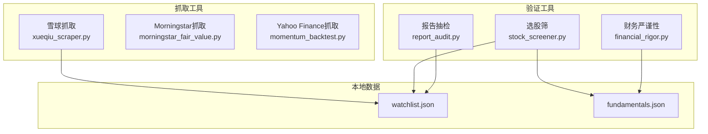
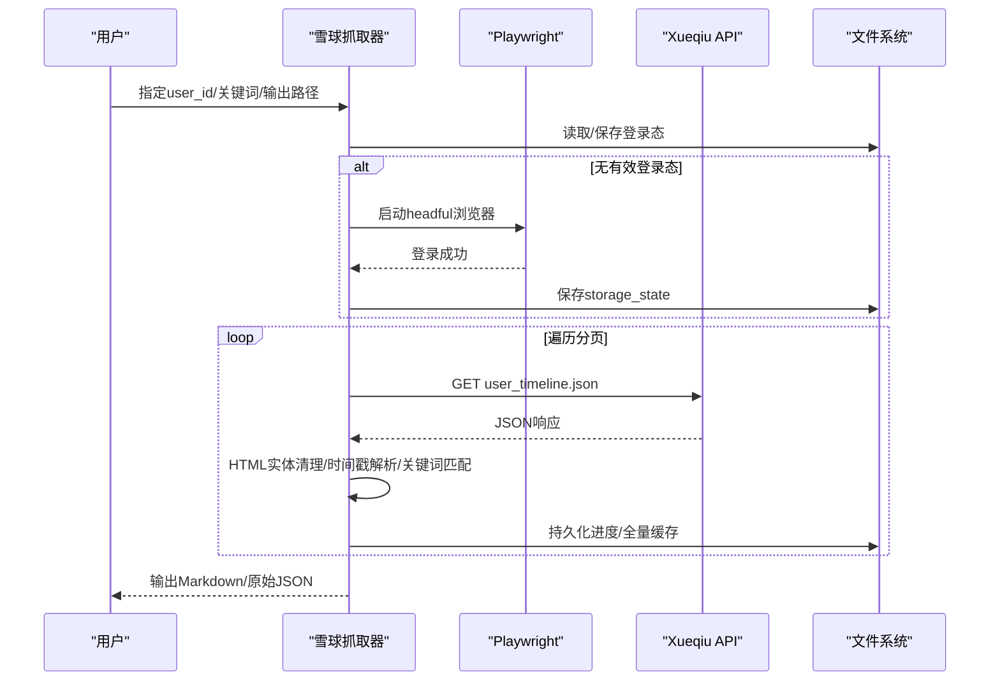
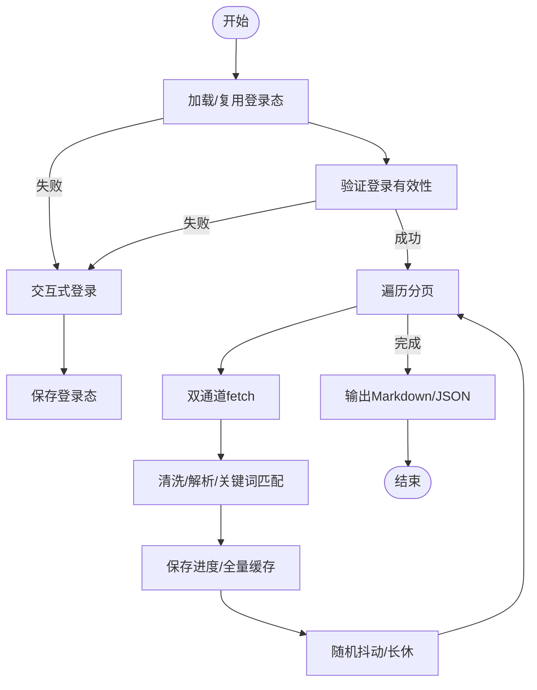
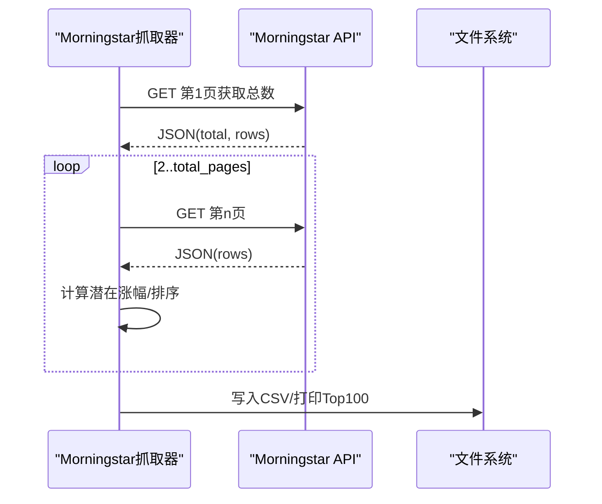
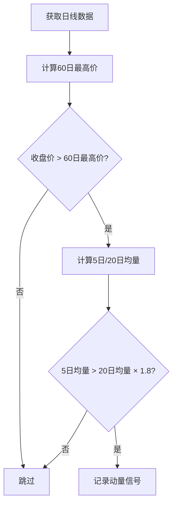
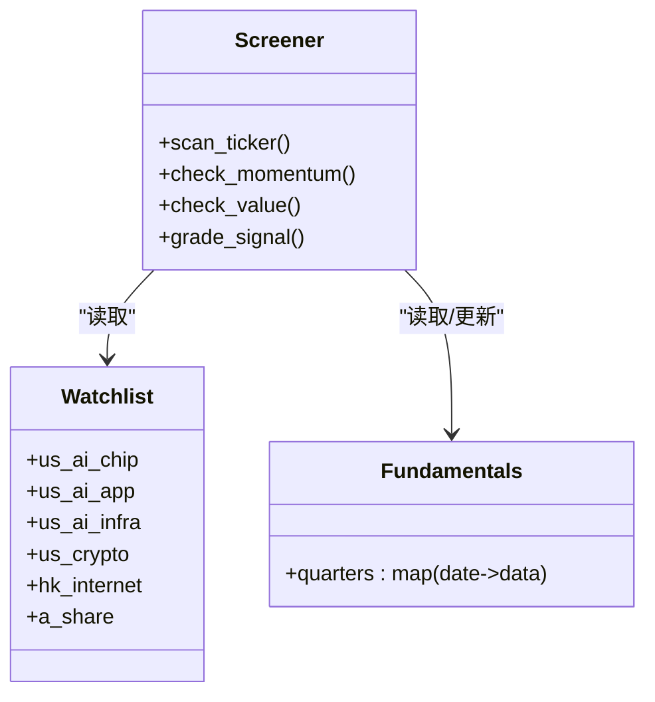
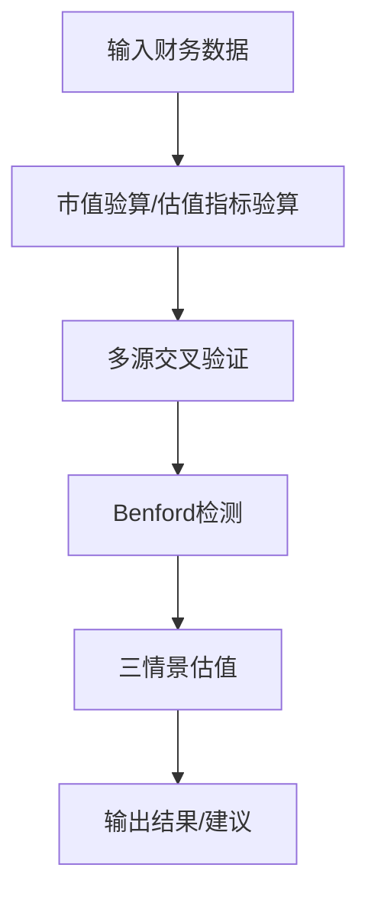
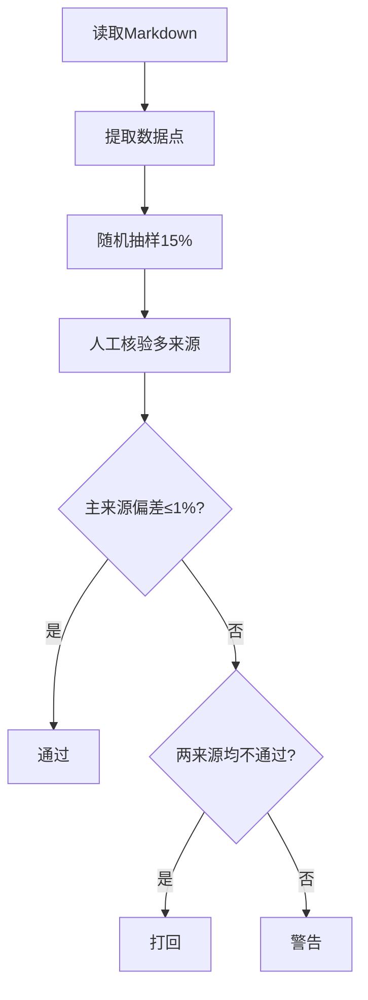
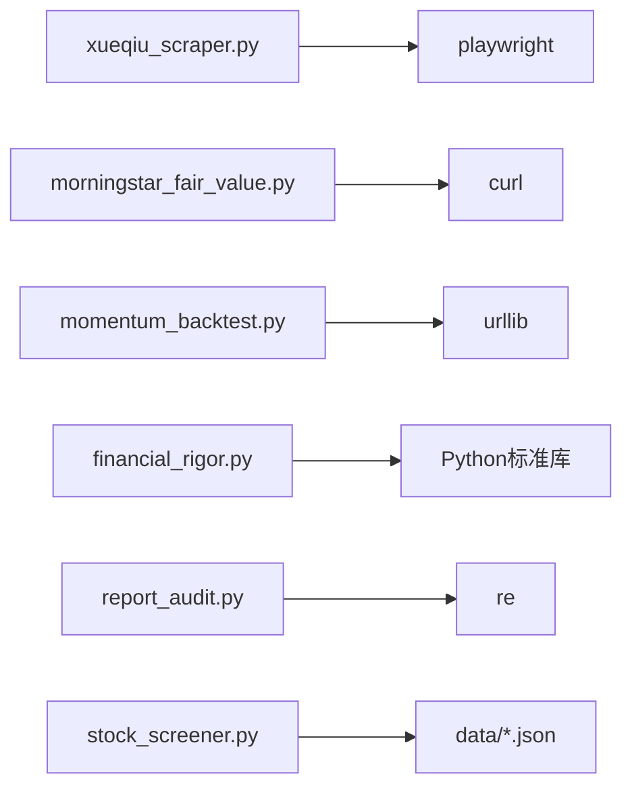

# 数据抓取工具

<cite>
**本文档引用的文件**
- [xueqiu_scraper.py](file://tools/xueqiu_scraper.py)
- [morningstar_fair_value.py](file://tools/morningstar_fair_value.py)
- [stock_screener.py](file://tools/stock_screener.py)
- [financial_rigor.py](file://tools/financial_rigor.py)
- [report_audit.py](file://tools/report_audit.py)
- [momentum_backtest.py](file://tools/momentum_backtest.py)
- [watchlist.json](file://data/watchlist.json)
- [fundamentals.json](file://data/fundamentals.json)
</cite>

## 目录
1. [简介](#简介)
2. [项目结构](#项目结构)
3. [核心组件](#核心组件)
4. [架构概览](#架构概览)
5. [详细组件分析](#详细组件分析)
6. [依赖分析](#依赖分析)
7. [性能考虑](#性能考虑)
8. [故障排查指南](#故障排查指南)
9. [结论](#结论)
10. [附录](#附录)

## 简介
本项目是一套面向投资研究的数据抓取与验证工具集，围绕雪球（Xueqiu）社交媒体内容抓取、第三方数据源（Morningstar、Yahoo Finance）抓取、以及数据质量保障（财务严谨性、报告抽检）展开。重点覆盖：
- 雪球用户时间线抓取与关键词筛选，支持断点续爬、登录态持久化与反反爬策略
- 第三方API抓取（Morningstar公允价值筛选、Yahoo Finance日线数据）
- 数据清洗与预处理（HTML实体清理、时间戳解析、缺失值与异常值处理）
- 错误处理与重试机制（超时重试、连续失败保护、降级策略）
- 数据质量保证（财务严谨性校验、Benford定律检测、报告抽检）
- 本地缓存与进度管理（全量缓存、进度文件、配置文件）

## 项目结构
- tools/：核心抓取与验证工具
  - xueqiu_scraper.py：雪球用户时间线抓取与关键词筛选
  - morningstar_fair_value.py：Morningstar公允价值筛选与Top100输出
  - stock_screener.py：动量发现 + 价值验证选股筛（基于本地数据）
  - financial_rigor.py：财务数据严谨性验证（市值、估值、多源交叉、Benford、三情景估值）
  - report_audit.py：研究报告数据抽检与准出/打回判决
  - momentum_backtest.py：动量回测（历史数据获取与信号计算）
- data/：本地缓存与配置
  - watchlist.json：默认关注清单
  - fundamentals.json：本地基本面数据缓存

图表来源
- [xueqiu_scraper.py:1-434](file://tools/xueqiu_scraper.py#L1-L434)
- [morningstar_fair_value.py:1-153](file://tools/morningstar_fair_value.py#L1-L153)
- [stock_screener.py:1-402](file://tools/stock_screener.py#L1-L402)
- [financial_rigor.py:1-452](file://tools/financial_rigor.py#L1-L452)
- [report_audit.py:1-523](file://tools/report_audit.py#L1-L523)
- [momentum_backtest.py:1-200](file://tools/momentum_backtest.py#L1-L200)
- [watchlist.json:1-38](file://data/watchlist.json#L1-L38)
- [fundamentals.json:1-36](file://data/fundamentals.json#L1-L36)

章节来源
- [xueqiu_scraper.py:1-434](file://tools/xueqiu_scraper.py#L1-L434)
- [morningstar_fair_value.py:1-153](file://tools/morningstar_fair_value.py#L1-L153)
- [stock_screener.py:1-402](file://tools/stock_screener.py#L1-L402)
- [financial_rigor.py:1-452](file://tools/financial_rigor.py#L1-L452)
- [report_audit.py:1-523](file://tools/report_audit.py#L1-L523)
- [momentum_backtest.py:1-200](file://tools/momentum_backtest.py#L1-L200)
- [watchlist.json:1-38](file://data/watchlist.json#L1-L38)
- [fundamentals.json:1-36](file://data/fundamentals.json#L1-L36)

## 核心组件
- 雪球抓取器：基于Playwright的异步抓取，支持登录态复用、双通道fetch（页面JS fetch + APIRequestContext）、断点续爬、随机抖动与长休、连续超时保护
- Morningstar抓取器：基于curl的REST API调用，分页抓取，计算潜在涨幅并输出Top100
- Yahoo Finance抓取器：基于urllib的Chart API调用，获取历史日线数据
- 选股筛：基于本地watchlist与fundamentals数据，执行动量与价值双重筛选
- 财务严谨性：市值/估值/多源交叉/Benford/三情景估值
- 报告抽检：从Markdown中抽取财务数据点，随机抽样15%，进行准出/打回判决

章节来源
- [xueqiu_scraper.py:18-434](file://tools/xueqiu_scraper.py#L18-L434)
- [morningstar_fair_value.py:14-153](file://tools/morningstar_fair_value.py#L14-L153)
- [momentum_backtest.py:19-48](file://tools/momentum_backtest.py#L19-L48)
- [stock_screener.py:31-402](file://tools/stock_screener.py#L31-L402)
- [financial_rigor.py:61-452](file://tools/financial_rigor.py#L61-L452)
- [report_audit.py:155-523](file://tools/report_audit.py#L155-L523)

## 架构概览
整体架构由“抓取-清洗-验证-输出”四个阶段组成，工具间通过本地文件（JSON）耦合，避免外部依赖，确保可移植性与稳定性。

图表来源
- [xueqiu_scraper.py:103-191](file://tools/xueqiu_scraper.py#L103-L191)
- [xueqiu_scraper.py:194-321](file://tools/xueqiu_scraper.py#L194-L321)

## 详细组件分析

### 雪球抓取器（xueqiu_scraper.py）
- 登录态管理
  - 首次运行可通过环境变量或交互式登录，登录态持久化至本地文件，后续直接复用
  - 复用失败时自动回退到交互式登录流程
- 双通道fetch
  - 优先使用页面内JS fetch，失败回退到APIRequestContext，提升兼容性
- 反反爬策略
  - 随机抖动（2-4秒）、每50页长休30秒、连续5次超时自动保存进度并退出
  - 使用真实UA、locale、viewport，并移除webdriver特征
- 断点续爬
  - 进度文件记录下一页与已收集条目，重启后自动从断点继续
- 数据清洗与过滤
  - 清理HTML实体与多余字符，仅收录用户原创内容（非转发）
  - 关键词匹配采用大小写不敏感的子串匹配
- 输出
  - 原始JSON与Markdown格式报告，便于后续离线分析

图表来源
- [xueqiu_scraper.py:103-191](file://tools/xueqiu_scraper.py#L103-L191)
- [xueqiu_scraper.py:194-321](file://tools/xueqiu_scraper.py#L194-L321)

章节来源
- [xueqiu_scraper.py:103-191](file://tools/xueqiu_scraper.py#L103-L191)
- [xueqiu_scraper.py:194-321](file://tools/xueqiu_scraper.py#L194-L321)

### Morningstar抓取器（morningstar_fair_value.py）
- API调用
  - 使用curl访问Morningstar筛选器API，分页抓取，首页获取总数
- 数据处理
  - 提取Ticker、收盘价、公允价值、星级、护城河等字段
  - 计算潜在涨幅（公允价值-收盘价）/收盘价 × 100
- 输出
  - 控制台打印Top100，CSV文件保存完整数据与统计摘要

图表来源
- [morningstar_fair_value.py:31-153](file://tools/morningstar_fair_value.py#L31-L153)

章节来源
- [morningstar_fair_value.py:31-153](file://tools/morningstar_fair_value.py#L31-L153)

### Yahoo Finance抓取器（momentum_backtest.py）
- 历史数据获取
  - 通过Chart API获取日线数据（open/high/low/close/volume）
  - 异常捕获与超时控制（15秒）
- 动量信号计算
  - 60日新高 + 放量（近5日均量 > 20日均量 × 1.8）
  - 30日涨幅与成交量比率

图表来源
- [momentum_backtest.py:112-145](file://tools/momentum_backtest.py#L112-L145)

章节来源
- [momentum_backtest.py:19-48](file://tools/momentum_backtest.py#L19-L48)
- [momentum_backtest.py:112-145](file://tools/momentum_backtest.py#L112-L145)

### 选股筛（stock_screener.py）
- 默认watchlist与本地fundamentals缓存
  - watchlist.json定义分组与标的
  - fundamentals.json存储季度财务数据（营收YoY、毛利率、EPS超预期）
- 动量发现
  - 60日新高 + 放量确认
- 价值验证（6维评分）
  - 营收加速、毛利率扩张、盈利惊喜、营收高增长、毛利率健康、毛利率连续改善
- 信号分级
  - 3/6=试探仓3% | 4/6=标准仓5% | 5-6/6=确信仓8%
  - 独立通过条件（毛利率连续改善+>45%、EPS超预期>30%）

图表来源
- [stock_screener.py:35-42](file://tools/stock_screener.py#L35-L42)
- [stock_screener.py:84-96](file://tools/stock_screener.py#L84-L96)
- [stock_screener.py:283-325](file://tools/stock_screener.py#L283-L325)

章节来源
- [stock_screener.py:35-42](file://tools/stock_screener.py#L35-L42)
- [stock_screener.py:84-96](file://tools/stock_screener.py#L84-L96)
- [stock_screener.py:283-325](file://tools/stock_screener.py#L283-L325)

### 财务严谨性（financial_rigor.py）
- 市值验算：股价×总股本 vs 报告市值，偏差>5%提示核查
- 估值指标验算：PE/PB/P/FCF/PS等，使用十进制避免浮点误差
- 多源交叉验证：中位数参考，容差阈值（默认2%）
- Benford定律检测：MAD/Chi-square判断首位数字分布是否符合
- 三情景估值：乐观/中性/悲观情景下的目标价与涨跌幅

图表来源
- [financial_rigor.py:61-160](file://tools/financial_rigor.py#L61-L160)
- [financial_rigor.py:167-204](file://tools/financial_rigor.py#L167-L204)
- [financial_rigor.py:214-281](file://tools/financial_rigor.py#L214-L281)
- [financial_rigor.py:320-361](file://tools/financial_rigor.py#L320-L361)

章节来源
- [financial_rigor.py:61-160](file://tools/financial_rigor.py#L61-L160)
- [financial_rigor.py:167-204](file://tools/financial_rigor.py#L167-L204)
- [financial_rigor.py:214-281](file://tools/financial_rigor.py#L214-L281)
- [financial_rigor.py:320-361](file://tools/financial_rigor.py#L320-L361)

### 报告抽检（report_audit.py）
- 数据点提取
  - 解析Markdown表格与KV行，过滤无效标签与噪声
  - 支持中文逗号、百分比、倍数、美元绝对值等格式
- 随机抽样
  - 默认15%抽样，最少3个，最多30个，可固定随机种子复现
- 准出/打回判决
  - 主来源偏差≤1%通过；两来源不一致（>1%）警告；两者均不通过则打回
  - 输出详细失败项与原文行号

图表来源
- [report_audit.py:155-226](file://tools/report_audit.py#L155-L226)
- [report_audit.py:229-236](file://tools/report_audit.py#L229-L236)
- [report_audit.py:253-398](file://tools/report_audit.py#L253-L398)

章节来源
- [report_audit.py:155-226](file://tools/report_audit.py#L155-L226)
- [report_audit.py:229-236](file://tools/report_audit.py#L229-L236)
- [report_audit.py:253-398](file://tools/report_audit.py#L253-L398)

## 依赖分析
- 内部依赖
  - stock_screener.py依赖data/watchlist.json与data/fundamentals.json
  - xueqiu_scraper.py依赖Playwright（异步）与本地state文件
  - financial_rigor.py与report_audit.py均为纯Python标准库实现
- 外部依赖
  - xueqiu_scraper.py：playwright（异步浏览器）
  - morningstar_fair_value.py：curl（命令行）
  - momentum_backtest.py：urllib（标准库）
  - report_audit.py：正则表达式（标准库）

图表来源
- [xueqiu_scraper.py:39-39](file://tools/xueqiu_scraper.py#L39-L39)
- [morningstar_fair_value.py:33-37](file://tools/morningstar_fair_value.py#L33-L37)
- [momentum_backtest.py:12-13](file://tools/momentum_backtest.py#L12-L13)
- [report_audit.py:24-31](file://tools/report_audit.py#L24-L31)
- [stock_screener.py:31-33](file://tools/stock_screener.py#L31-L33)

章节来源
- [xueqiu_scraper.py:39-39](file://tools/xueqiu_scraper.py#L39-L39)
- [morningstar_fair_value.py:33-37](file://tools/morningstar_fair_value.py#L33-L37)
- [momentum_backtest.py:12-13](file://tools/momentum_backtest.py#L12-L13)
- [report_audit.py:24-31](file://tools/report_audit.py#L24-L31)
- [stock_screener.py:31-33](file://tools/stock_screener.py#L31-L33)

## 性能考虑
- 异步与并发
  - xueqiu_scraper.py使用asyncio与Playwright异步抓取，减少I/O阻塞
  - 未实现多线程并发抓取，避免对目标站点造成过大压力
- 资源控制
  - 随机抖动与长休降低请求频率，连续超时保护避免无效重试
  - 分页抓取与断点续爬减少重复工作
- 缓存策略
  - 登录态缓存、进度文件、全量缓存（dump_all）降低重复抓取成本
  - fundamentals.json与watchlist.json本地缓存，减少网络依赖

[本节为一般性指导，无需特定文件来源]

## 故障排查指南
- 雪球抓取
  - 登录态失效：删除/state文件，重新交互式登录
  - 连续超时：检查网络与代理，适当增加超时或减少并发
  - 关键词无命中：确认关键词大小写不敏感匹配逻辑
- Morningstar抓取
  - API失败：检查网络与User-Agent，必要时添加重试
  - 数据为空：确认filters参数与语言/货币设置
- Yahoo Finance抓取
  - 超时：增大timeout或减少时间跨度
  - 数据不足：确认时间范围与数据完整性
- 财务严谨性
  - 偏差>5%：核查单位、汇率、股本变动
  - Benford异常：可能存在数据调整迹象，需进一步调查
- 报告抽检
  - 抽样偏差：检查多来源口径一致性（GAAP/Non-GAAP、汇率）

章节来源
- [xueqiu_scraper.py:103-191](file://tools/xueqiu_scraper.py#L103-L191)
- [xueqiu_scraper.py:271-310](file://tools/xueqiu_scraper.py#L271-L310)
- [morningstar_fair_value.py:61-74](file://tools/morningstar_fair_value.py#L61-L74)
- [momentum_backtest.py:28-47](file://tools/momentum_backtest.py#L28-L47)
- [financial_rigor.py:80-91](file://tools/financial_rigor.py#L80-L91)
- [report_audit.py:315-398](file://tools/report_audit.py#L315-L398)

## 结论
本工具集以最小外部依赖为核心，结合本地缓存与严格的质量控制，实现了从社交媒体与第三方API的多源数据抓取、清洗与验证闭环。通过断点续爬、反反爬策略与财务严谨性工具，能够在保证合规与质量的前提下高效产出研究数据。

[本节为总结性内容，无需特定文件来源]

## 附录
- 使用建议
  - 雪球抓取：建议先手动登录一次以生成state文件，再批量运行
  - Morningstar：定期抓取并保存CSV，作为后续分析基线
  - 选股筛：维护好fundamentals.json，及时更新季度数据
  - 财务严谨性：对关键指标进行多源交叉验证与Benford检测
  - 报告抽检：建立固定的抽检流程与信源清单

[本节为一般性建议，无需特定文件来源]