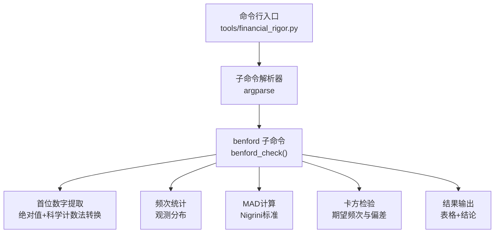
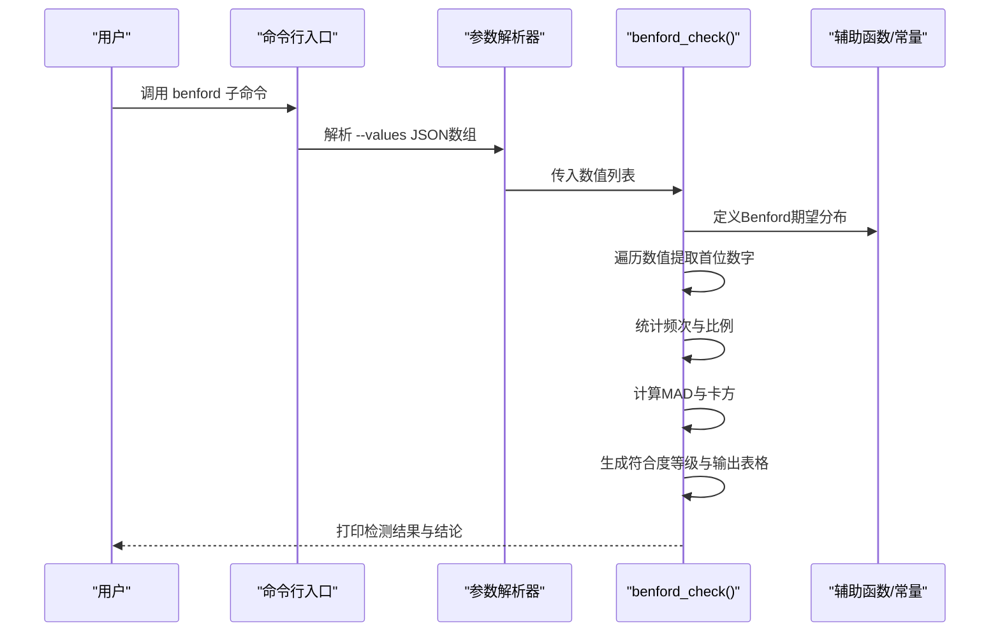
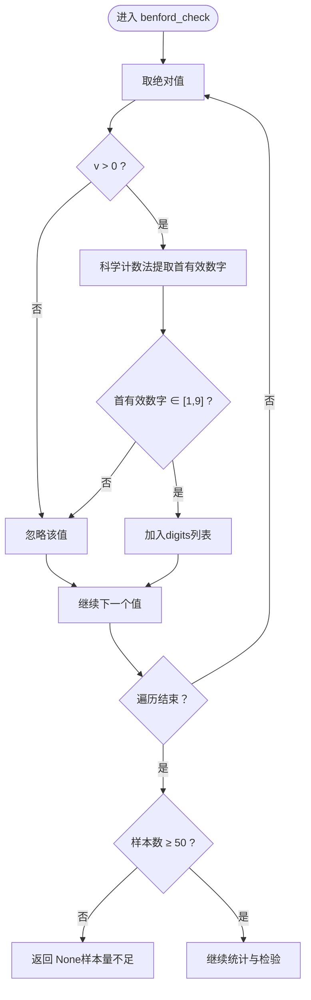
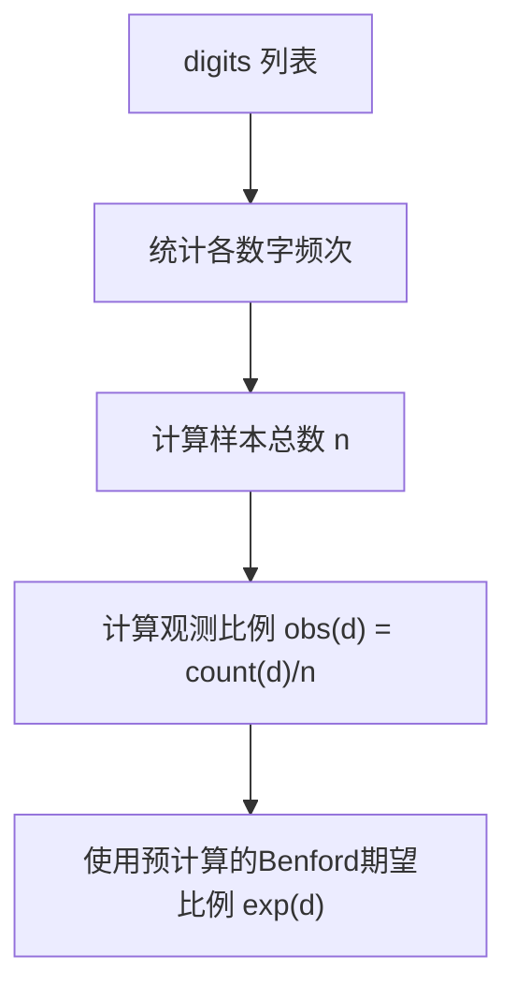
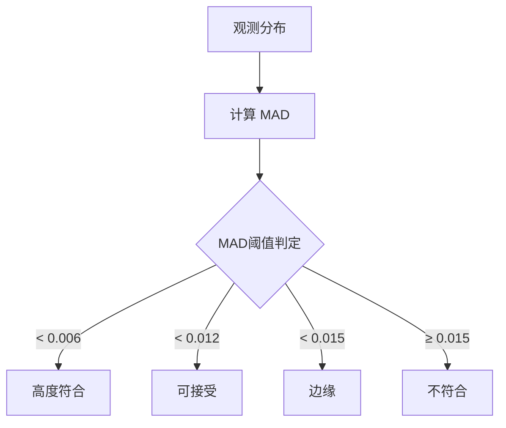
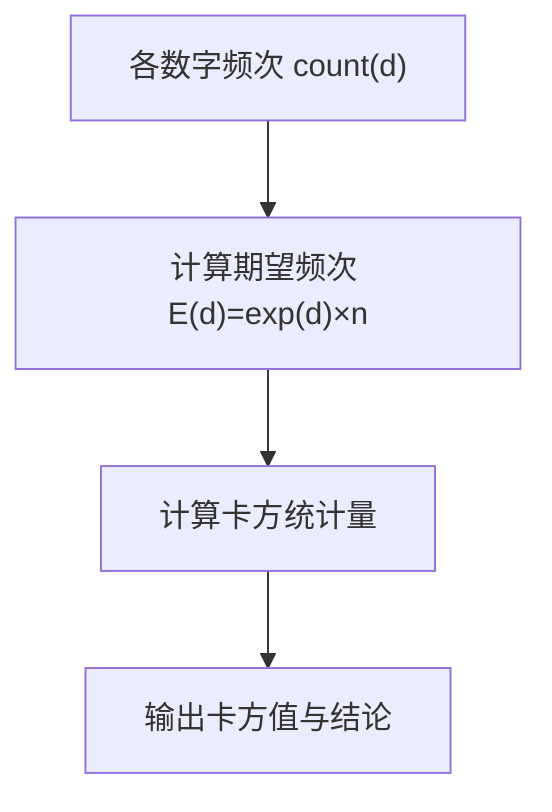
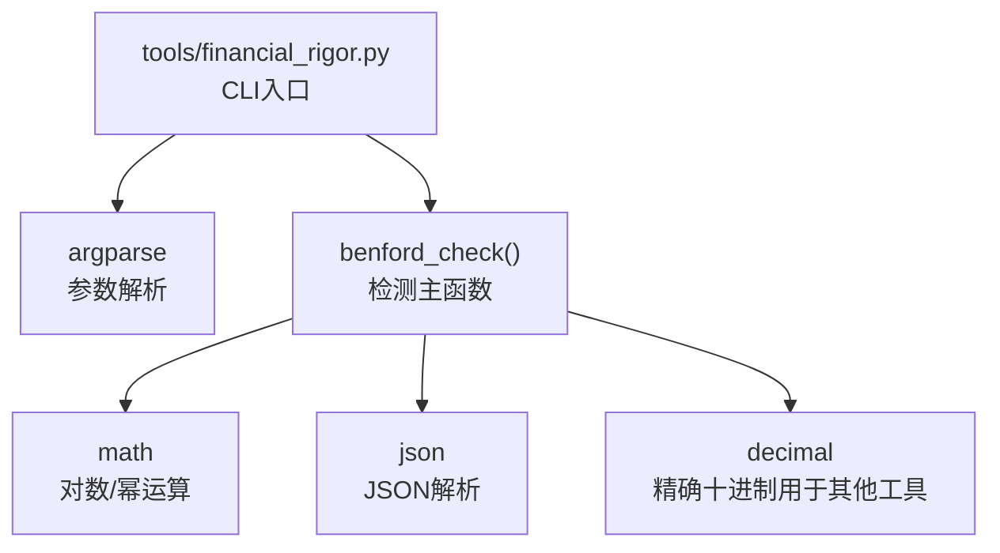

# Benford定律检测功能

<cite>
**本文档引用的文件**
- [financial_rigor.py](file://tools/financial_rigor.py)
- [README.md](file://README.md)
</cite>

## 目录
1. [简介](#简介)
2. [项目结构](#项目结构)
3. [核心组件](#核心组件)
4. [架构概览](#架构概览)
5. [详细组件分析](#详细组件分析)
6. [依赖关系分析](#依赖关系分析)
7. [性能考量](#性能考量)
8. [故障排查指南](#故障排查指南)
9. [结论](#结论)
10. [附录](#附录)

## 简介
本文件面向“Benford定律检测功能”的技术文档，围绕财务数据首位数字分布统计的实现原理展开，包括绝对值处理、科学计数法转换与首位数字提取算法；MAD（平均绝对偏差）指标的计算方法与Nigrini标准的三个判断等级（高度符合、可接受、边缘）及临界值设定；卡方检验（Chi-square）统计检验的应用，包括期望频次计算、偏差平方和统计与显著性水平判断；财务造假识别的理论基础与局限性说明；样本量要求与可靠性判断（50个数据点的最低要求与统计显著性评估）；并提供实际检测案例，展示正常财务数据与异常数据的检测结果对比与分析结论。

## 项目结构
该功能位于工具层，作为金融严谨性工具的一部分，提供命令行接口与可复现的检测流程。核心实现集中在工具脚本中，CLI解析器负责接收参数并调用相应函数。

图表来源
- [financial_rigor.py:367-452](file://tools/financial_rigor.py#L367-L452)
- [financial_rigor.py:214-281](file://tools/financial_rigor.py#L214-L281)

章节来源
- [financial_rigor.py:10-16](file://tools/financial_rigor.py#L10-L16)
- [financial_rigor.py:367-452](file://tools/financial_rigor.py#L367-L452)

## 核心组件
- 首位数字提取与预处理：对输入数值取绝对值，使用科学计数法提取首有效数字，过滤非正数与无效数字。
- 观察分布统计：统计1-9各位数字的出现频次与比例。
- MAD（平均绝对偏差）指标：衡量观测分布与Benford期望分布的平均绝对偏差，并据此划分符合度等级。
- 卡方检验：基于期望频次与观测频次计算卡方统计量，用于辅助判断数据分布偏离程度。
- 结果输出：打印样本量、MAD、卡方值、符合度等级、各位数字的观测与期望对比表，以及最终结论。

章节来源
- [financial_rigor.py:214-281](file://tools/financial_rigor.py#L214-L281)

## 架构概览
Benford检测功能在CLI入口处被调用，内部通过一系列纯函数完成数据预处理、统计计算与结果输出。该实现不依赖外部库，仅使用Python标准库，确保可移植性与可复现性。

图表来源
- [financial_rigor.py:405-437](file://tools/financial_rigor.py#L405-L437)
- [financial_rigor.py:214-281](file://tools/financial_rigor.py#L214-L281)

## 详细组件分析

### 首位数字提取与预处理
- 绝对值处理：对输入数值取绝对值，确保负数不影响首位数字提取。
- 科学计数法转换：利用对数运算将数值转换为科学计数法形式，提取首有效数字（1-9）。
- 过滤条件：仅保留大于0且首有效数字在1-9范围内的数值，其余忽略。
- 样本量阈值：当有效样本数小于50时，直接返回None并提示样本量不足，避免统计不可靠。

图表来源
- [financial_rigor.py:220-233](file://tools/financial_rigor.py#L220-L233)

章节来源
- [financial_rigor.py:220-233](file://tools/financial_rigor.py#L220-L233)

### 观察分布统计
- 频次统计：对提取的各位数字进行计数，得到1-9的出现次数。
- 比例计算：将各数字的计数除以样本总数，得到观测分布比例。
- 期望分布：预先计算并缓存1-9的Benford期望比例，作为参考分布。

图表来源
- [financial_rigor.py:235-239](file://tools/financial_rigor.py#L235-L239)
- [financial_rigor.py:211](file://tools/financial_rigor.py#L211)

章节来源
- [financial_rigor.py:235-239](file://tools/financial_rigor.py#L235-L239)
- [financial_rigor.py:211](file://tools/financial_rigor.py#L211)

### MAD（平均绝对偏差）指标与判断等级
- 计算公式：MAD = (1/9) × Σ|obs(d) − exp(d)|，对d从1到9求和。
- Nigrini标准等级划分：
  - 高度符合：< 0.006
  - 可接受：0.006 ≤ 且 < 0.012
  - 边缘：0.012 ≤ 且 < 0.015
  - 不符合：≥ 0.015
- 结合MAD阈值与卡方统计量，输出最终结论与提示。

图表来源
- [financial_rigor.py:241-256](file://tools/financial_rigor.py#L241-L256)

章节来源
- [financial_rigor.py:241-256](file://tools/financial_rigor.py#L241-L256)

### 卡方检验（Chi-square）
- 期望频次：E(d) = exp(d) × n
- 偏差平方和统计：Σ[(count(d) − E(d))² / E(d)]，对d从1到9求和。
- 显著性水平：结合MAD与卡方值综合判断，卡方值越大表示偏离越严重。

图表来源
- [financial_rigor.py:244-245](file://tools/financial_rigor.py#L244-L245)

章节来源
- [financial_rigor.py:244-245](file://tools/financial_rigor.py#L244-L245)

### 结果输出与结论
- 打印样本量、MAD、卡方值与符合度等级。
- 输出各位数字的观测比例、期望比例与偏差对比表。
- 给出最终结论：符合/异常，并提示“不符合不等于造假，但值得进一步调查”。

章节来源
- [financial_rigor.py:257-281](file://tools/financial_rigor.py#L257-L281)

## 依赖关系分析
- 内部依赖：CLI入口与参数解析器负责接收输入；benford_check为核心逻辑；辅助常量与函数提供期望分布与格式化输出。
- 外部依赖：仅使用Python标准库（math、argparse、json、decimal），无第三方依赖，便于部署与复现。

图表来源
- [financial_rigor.py:18-22](file://tools/financial_rigor.py#L18-L22)
- [financial_rigor.py:405-437](file://tools/financial_rigor.py#L405-L437)

章节来源
- [financial_rigor.py:18-22](file://tools/financial_rigor.py#L18-L22)
- [financial_rigor.py:405-437](file://tools/financial_rigor.py#L405-L437)

## 性能考量
- 时间复杂度：遍历输入列表O(n)，统计频次O(n)，计算MAD与卡方O(1)（固定9个数字），总体O(n)。
- 空间复杂度：存储digits列表O(n)，频次与比例O(1)（固定9个数字），总体O(n)。
- 样本量阈值：当样本数小于50时直接返回None，避免统计不可靠；建议在数据规模充足时使用，以提高检测稳健性。

章节来源
- [financial_rigor.py:230-233](file://tools/financial_rigor.py#L230-L233)

## 故障排查指南
- 输入格式错误：确保传入的JSON数组格式正确，元素为数值类型。
- 样本量不足：当有效样本数小于50时，检测结果为None并提示“样本量不足”。建议增加数据点或合并多个时间段的数据。
- 非正数与无效数据：负数、零与非数值会被忽略，不会参与统计。请检查数据清洗步骤。
- 结果解读：不符合Benford定律并不等同于财务造假，可能由数据生成机制、报告口径或行业特性导致。应结合其他财务指标与审计证据进行综合判断。

章节来源
- [financial_rigor.py:230-233](file://tools/financial_rigor.py#L230-L233)
- [financial_rigor.py:277-279](file://tools/financial_rigor.py#L277-L279)

## 结论
Benford定律检测功能通过科学计数法提取首位数字、统计观测分布、计算MAD与卡方统计量，提供了一种快速筛查财务数据异常的手段。其核心优势在于实现简洁、无需外部依赖、可复现性强；局限性在于对样本量有要求（≥50）、对异常的解释需结合其他证据。实践中建议将其纳入多维度财务验证流程，作为初步筛查与进一步调查的依据。

## 附录

### 实际检测案例（示例说明）
以下为两类示例场景的描述性说明，用于帮助理解检测结果的含义与解读思路（不包含具体代码片段）：
- 正常财务数据：样本量充足（≥50），MAD较小（<0.006），卡方值适中，各位数字观测比例与Benford期望接近，结论为“高度符合”，表明数据分布与自然生成的财务数据一致。
- 异常财务数据：样本量不足或MAD较大（≥0.015），卡方值显著升高，部分数字偏差超过阈值（例如绝对偏差>0.03），结论为“不符合”，提示可能存在人为调整或数据异常，需进一步调查。

章节来源
- [financial_rigor.py:248-256](file://tools/financial_rigor.py#L248-L256)
- [financial_rigor.py:266-271](file://tools/financial_rigor.py#L266-L271)
- [financial_rigor.py:274-279](file://tools/financial_rigor.py#L274-L279)