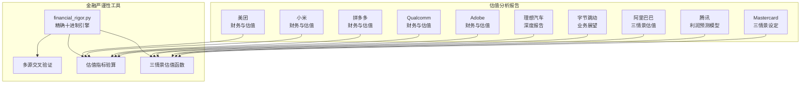
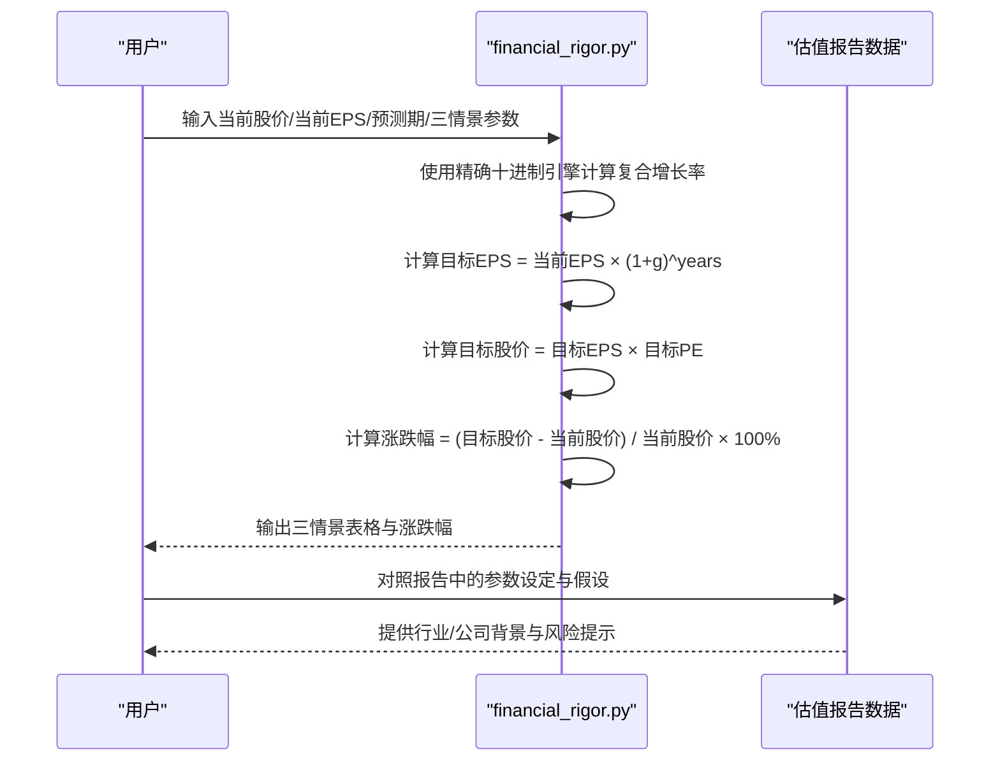
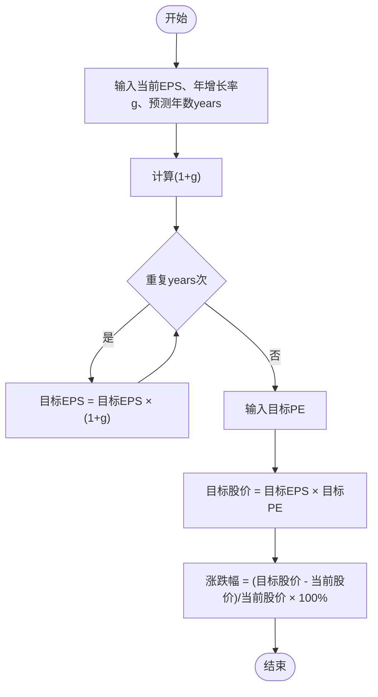
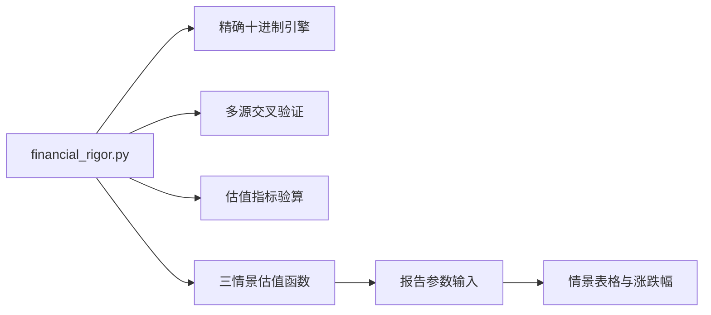

# 三情景估值模型

<cite>
**本文档引用的文件**
- [financial_rigor.py](file://tools/financial_rigor.py)
- [Mastercard-估值判断.md](file://reports/Mastercard/《看懂万事达卡》/05-估值判断-为确定性付多少溢价（终章）.md)
- [Marvell-风险与估值.md](file://reports/Marvell/《看懂迈威尔》/04-风险与估值-58倍PE在赌什么.md)
- [Adobe-财务估值分析.md](file://reports/Adobe/02-财务估值分析-巴菲特视角.md)
- [Qualcomm-财务估值分析.md](file://reports/Qualcomm/02-财务估值分析-巴菲特视角.md)
- [腾讯-利润预测模型.md](file://reports/腾讯/腾讯-利润预测模型-20260519.md)
- [阿里巴巴-财务估值分析.md](file://reports/阿里巴巴/02-财务估值分析-巴菲特视角.md)
- [腾讯-财务估值分析.md](file://reports/腾讯/02-财务估值分析-巴菲特视角.md)
- [拼多多-财务估值分析.md](file://reports/拼多多/02-财务估值分析-巴菲特视角.md)
- [小米-财务估值分析.md](file://reports/小米/02-财务估值分析-巴菲特视角.md)
- [美团-财务估值分析.md](file://reports/美团/02-财务估值分析-巴菲特视角.md)
- [字节跳动-业务前景展望.md](file://reports/字节跳动/字节跳动-业务前景展望-20260410.md)
- [理想汽车-深度研究报告.md](file://reports/理想汽车/理想汽车-投研团队深度研究报告-20260519.md)
- [拼多多-利润下降分析.md](file://reports/拼多多/拼多多-2025利润下降分析-20260515.md)
</cite>

## 目录
1. [引言](#引言)
2. [项目结构](#项目结构)
3. [核心组件](#核心组件)
4. [架构总览](#架构总览)
5. [详细组件分析](#详细组件分析)
6. [依赖关系分析](#依赖关系分析)
7. [性能考量](#性能考量)
8. [故障排查指南](#故障排查指南)
9. [结论](#结论)
10. [附录](#附录)

## 引言
本技术文档围绕“三情景估值模型”展开，系统阐述复合增长率计算原理、目标EPS预测方法、目标PE与目标股价关系、情景分析构建逻辑、结果可视化输出与实际应用案例。文档以仓库中的估值分析报告与金融严谨性工具为基础，结合精确十进制计算与多源交叉验证，形成一套可审计、可复现、可扩展的估值工作流。

## 项目结构
本仓库包含两类与三情景估值密切相关的资料：
- 估值分析报告：涵盖多家公司（如Mastercard、Adobe、Qualcomm、腾讯、阿里巴巴、拼多多、小米、美团、字节跳动、理想汽车等）的财务与估值分析，提供情景设定、参数输入与结果解读范例。
- 金融严谨性工具：提供精确十进制计算、多源交叉验证、估值指标验算等功能，确保计算过程无浮点误差、结果可审计复现。

**图表来源**
- [financial_rigor.py:316-361](file://tools/financial_rigor.py#L316-L361)
- [Mastercard-估值判断.md:47-90](file://reports/Mastercard/《看懂万事达卡》/05-估值判断-为确定性付多少溢价（终章）.md#L47-L90)
- [Adobe-财务估值分析.md:61-84](file://reports/Adobe/02-财务估值分析-巴菲特视角.md#L61-L84)
- [Qualcomm-财务估值分析.md:53-77](file://reports/Qualcomm/02-财务估值分析-巴菲特视角.md#L53-L77)
- [腾讯-利润预测模型.md:114-174](file://reports/腾讯/腾讯-利润预测模型-20260519.md#L114-L174)
- [阿里巴巴-财务估值分析.md:286-315](file://reports/阿里巴巴/02-财务估值分析-巴菲特视角.md#L286-L315)
- [拼多多-财务估值分析.md:304-392](file://reports/拼多多/02-财务估值分析-巴菲特视角.md#L304-L392)
- [小米-财务估值分析.md:195-244](file://reports/小米/02-财务估值分析-巴菲特视角.md#L195-L244)
- [美团-财务估值分析.md:271-295](file://reports/美团/02-财务估值分析-巴菲特视角.md#L271-L295)
- [字节跳动-业务前景展望.md:8-21](file://reports/字节跳动/字节跳动-业务前景展望-20260410.md#L8-L21)
- [理想汽车-深度研究报告.md:1-182](file://reports/理想汽车/理想汽车-投研团队深度研究报告-20260519.md#L1-L182)

**章节来源**
- [financial_rigor.py:1-452](file://tools/financial_rigor.py#L1-L452)
- [Mastercard-估值判断.md:47-90](file://reports/Mastercard/《看懂万事达卡》/05-估值判断-为确定性付多少溢价（终章）.md#L47-L90)

## 核心组件
- 精确十进制引擎：提供无浮点误差的数值运算，确保复合增长率、目标EPS、目标PE与目标股价计算的准确性。
- 三情景估值函数：封装乐观、中性、悲观三种情景的输入参数与计算流程，输出目标EPS、目标股价与涨跌幅。
- 多源交叉验证：对关键财务数据进行交叉验证，识别异常与潜在造假迹象。
- 估值指标验算：自动计算PE、PB、PS、P/FCF、ROE、股息率等指标，辅助安全边际评估。

**章节来源**
- [financial_rigor.py:21-38](file://tools/financial_rigor.py#L21-L38)
- [financial_rigor.py:316-361](file://tools/financial_rigor.py#L316-L361)
- [financial_rigor.py:167-204](file://tools/financial_rigor.py#L167-L204)
- [financial_rigor.py:98-160](file://tools/financial_rigor.py#L98-L160)

## 架构总览
三情景估值模型的实现遵循“输入参数—精确计算—结果输出”的闭环流程。工具层提供精确十进制引擎与交叉验证能力，应用层基于多份报告中的参数设定与假设，生成情景表格与涨跌幅分析。

**图表来源**
- [financial_rigor.py:316-361](file://tools/financial_rigor.py#L316-L361)
- [Mastercard-估值判断.md:47-90](file://reports/Mastercard/《看懂万事达卡》/05-估值判断-为确定性付多少溢价（终章）.md#L47-L90)
- [阿里巴巴-财务估值分析.md:286-315](file://reports/阿里巴巴/02-财务估值分析-巴菲特视角.md#L286-L315)

## 详细组件分析

### 复合增长率与年复利计算
- 年复利公式：未来值 = 现值 × (1 + 增长率)^年数。在三情景估值中，目标EPS通过当前EPS乘以(1+g)^years得出。
- 多步精确计算：使用精确十进制引擎逐次相乘，避免浮点误差累积，保证CAGR与复合结果的可审计性。
- 结果累积：目标EPS与目标PE相乘得到目标股价，再与当前股价对比计算涨跌幅。

**图表来源**
- [financial_rigor.py:346-357](file://tools/financial_rigor.py#L346-L357)

**章节来源**
- [financial_rigor.py:316-361](file://tools/financial_rigor.py#L316-L361)
- [Mastercard-估值判断.md:47-90](file://reports/Mastercard/《看懂万事达卡》/05-估值判断-为确定性付多少溢价（终章）.md#L47-L90)

### 目标EPS预测方法
- 基于历史CAGR或管理层指引设定年增长率，结合多源交叉验证确保增长率参数的合理性。
- 乐观/中性/悲观情景分别对应不同的CAGR假设，例如Mastercard报告中的18%/15%/10%。
- 通过精确十进制引擎迭代计算，确保预测期内的复合增长稳定可靠。

**章节来源**
- [Mastercard-估值判断.md:47-90](file://reports/Mastercard/《看懂万事达卡》/05-估值判断-为确定性付多少溢价（终章）.md#L47-L90)
- [腾讯-利润预测模型.md:114-174](file://reports/腾讯/腾讯-利润预测模型-20260519.md#L114-L174)

### 目标PE与目标股价关系
- 市盈率法：目标股价 = 目标EPS × 目标PE。PE的选择需结合行业对比、公司成长性与风险调整。
- 报告示例：Mastercard在乐观情景下PE为28-35倍，悲观情景下为22-25倍；阿里巴巴在乐观情景下PE为20x，悲观情景下为10x。
- 安全边际评估：通过DCF、SOTP或反向DCF验证当前股价与内在价值的偏离度。

**章节来源**
- [Mastercard-估值判断.md:47-90](file://reports/Mastercard/《看懂万事达卡》/05-估值判断-为确定性付多少溢价（终章）.md#L47-L90)
- [阿里巴巴-财务估值分析.md:286-315](file://reports/阿里巴巴/02-财务估值分析-巴菲特视角.md#L286-L315)
- [Marvell-风险与估值.md:132-145](file://reports/Marvell/《看懂迈威尔》/04-风险与估值-58倍PE在赌什么.md#L132-L145)

### 情景分析构建逻辑
- 乐观情景：假设公司处于高增长、高盈利扩张阶段，PE可能维持或扩张，适用于高增长或市场情绪回暖情境。
- 中性情景：基于历史趋势或管理层指引，假设稳健增长与合理估值，适用于常态发展情境。
- 悲观情景：假设增长放缓、PE下修或外部冲击，适用于周期性下行或政策风险情境。
- 参数差异合理性：需结合行业生命周期、公司护城河、管理层能力与宏观环境进行审慎判断。

**章节来源**
- [Mastercard-估值判断.md:47-90](file://reports/Mastercard/《看懂万事达卡》/05-估值判断-为确定性付多少溢价（终章）.md#L47-L90)
- [腾讯-利润预测模型.md:114-174](file://reports/腾讯/腾讯-利润预测模型-20260519.md#L114-L174)
- [阿里巴巴-财务估值分析.md:286-315](file://reports/阿里巴巴/02-财务估值分析-巴菲特视角.md#L286-L315)

### 结果可视化输出
- 表格格式：包含情景名称、年增速、目标PE、目标EPS、目标股价与涨跌幅，便于横向对比与趋势分析。
- 涨跌幅计算：基于目标股价与当前股价的差额百分比，直观反映不同情景下的潜在回报。
- 报告对照：结合具体公司报告中的参数设定与假设，提供可追溯的决策依据。

**章节来源**
- [financial_rigor.py:333-361](file://tools/financial_rigor.py#L333-L361)
- [Mastercard-估值判断.md:47-90](file://reports/Mastercard/《看懂万事达卡》/05-估值判断-为确定性付多少溢价（终章）.md#L47-L90)
- [阿里巴巴-财务估值分析.md:286-315](file://reports/阿里巴巴/02-财务估值分析-巴菲特视角.md#L286-L315)

### 实际应用案例
- Mastercard：以15%/10%/18%的CAGR与相应PE区间，展示不同持有期（3年/5年）下的目标价与年化回报。
- 腾讯：基于分业务建模与三情景预测，提供3年/5年/10年利润预测与EPS CAGR。
- 阿里巴巴：以三情景估值展示不同概率加权下的目标价与安全边际。
- 拼多多：通过反向DCF与三情景DCF，评估不同增长与利润情景下的合理价值。
- 小米：以DCF与SOTP方法评估安全边际，结合净现金提供下行保护。
- 美团：以SOTP分部估值与三情景计算，评估正常化与竞争情景下的内在价值。
- 字节跳动：提供未来3-5年业务发展速度与TikTok禁令情景分析。
- 理想汽车：在“增程红利消退、纯电转型未验证、盈利能力断崖式下滑”的背景下，评估净现金安全垫与风险。

**章节来源**
- [Mastercard-估值判断.md:47-90](file://reports/Mastercard/《看懂万事达卡》/05-估值判断-为确定性付多少溢价（终章）.md#L47-L90)
- [腾讯-利润预测模型.md:114-174](file://reports/腾讯/腾讯-利润预测模型-20260519.md#L114-L174)
- [阿里巴巴-财务估值分析.md:286-315](file://reports/阿里巴巴/02-财务估值分析-巴菲特视角.md#L286-L315)
- [拼多多-财务估值分析.md:304-392](file://reports/拼多多/02-财务估值分析-巴菲特视角.md#L304-L392)
- [小米-财务估值分析.md:195-244](file://reports/小米/02-财务估值分析-巴菲特视角.md#L195-L244)
- [美团-财务估值分析.md:271-295](file://reports/美团/02-财务估值分析-巴菲特视角.md#L271-L295)
- [字节跳动-业务前景展望.md:8-21](file://reports/字节跳动/字节跳动-业务前景展望-20260410.md#L8-L21)
- [理想汽车-深度研究报告.md:1-182](file://reports/理想汽车/理想汽车-投研团队深度研究报告-20260519.md#L1-L182)

## 依赖关系分析
三情景估值模型的实现依赖于精确十进制引擎与多源交叉验证，确保计算与输入数据的可靠性。应用层通过报告中的参数设定与假设，将工具层的计算结果转化为可解释的估值结论。

**图表来源**
- [financial_rigor.py:21-38](file://tools/financial_rigor.py#L21-L38)
- [financial_rigor.py:167-204](file://tools/financial_rigor.py#L167-L204)
- [financial_rigor.py:98-160](file://tools/financial_rigor.py#L98-L160)
- [financial_rigor.py:316-361](file://tools/financial_rigor.py#L316-L361)

**章节来源**
- [financial_rigor.py:1-452](file://tools/financial_rigor.py#L1-L452)

## 性能考量
- 精确十进制计算：避免浮点误差累积，适合长期预测与高精度场景。
- 多源交叉验证：通过中位数与容差阈值识别异常，降低数据噪声对估值的影响。
- 指标验算：批量计算估值指标，减少人工误差，提升一致性与可复现性。

[本节为通用指导，无需列出具体文件来源]

## 故障排查指南
- 偏差过大：若市值验算偏差超过5%，需检查股价、股本与报告市值单位一致性。
- 指标异常：若PE、PB等指标出现异常，需核对EPS、BVPS、FCF等输入数据。
- 数据不一致：多源交叉验证中若偏差超过容差阈值，需优先采用年报/交易所数据，并进一步核查来源差异原因。
- 三情景参数不合理：需结合行业生命周期、公司护城河与管理层指引，审慎调整CAGR与PE假设。

**章节来源**
- [financial_rigor.py:61-91](file://tools/financial_rigor.py#L61-L91)
- [financial_rigor.py:167-204](file://tools/financial_rigor.py#L167-L204)
- [financial_rigor.py:98-160](file://tools/financial_rigor.py#L98-L160)

## 结论
三情景估值模型通过精确十进制计算与多源交叉验证，实现了复合增长率、目标EPS与目标股价的可审计复现。结合多家公司的实际报告，模型能够提供清晰的参数设定、情景对比与涨跌幅分析，为投资决策提供稳健的量化支持。在应用过程中，需重点关注参数合理性、行业背景与风险因素，确保情景设定与现实环境相符。

[本节为总结性内容，无需列出具体文件来源]

## 附录
- 术语说明：CAGR（复合年均增长率）、PE（市盈率）、EPS（每股收益）、DCF（现金流折现）、SOTP（分部估值法）。
- 工具使用：通过CLI调用financial_rigor.py的子命令，完成市值验算、估值指标验算、多源交叉验证与三情景估值。

**章节来源**
- [financial_rigor.py:367-452](file://tools/financial_rigor.py#L367-L452)