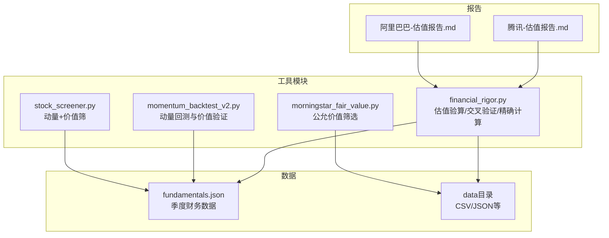
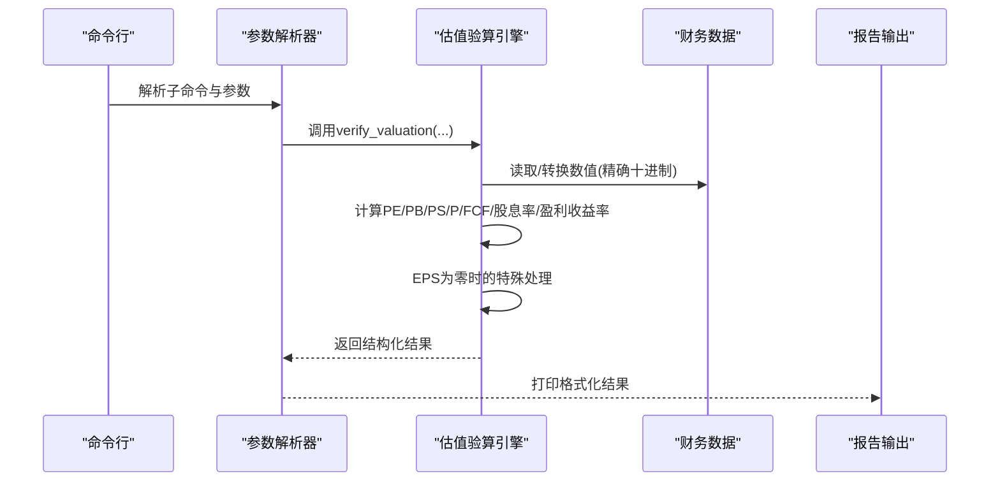
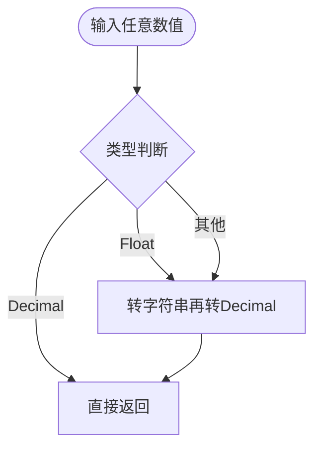
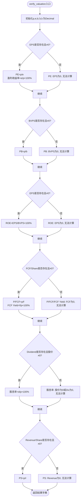
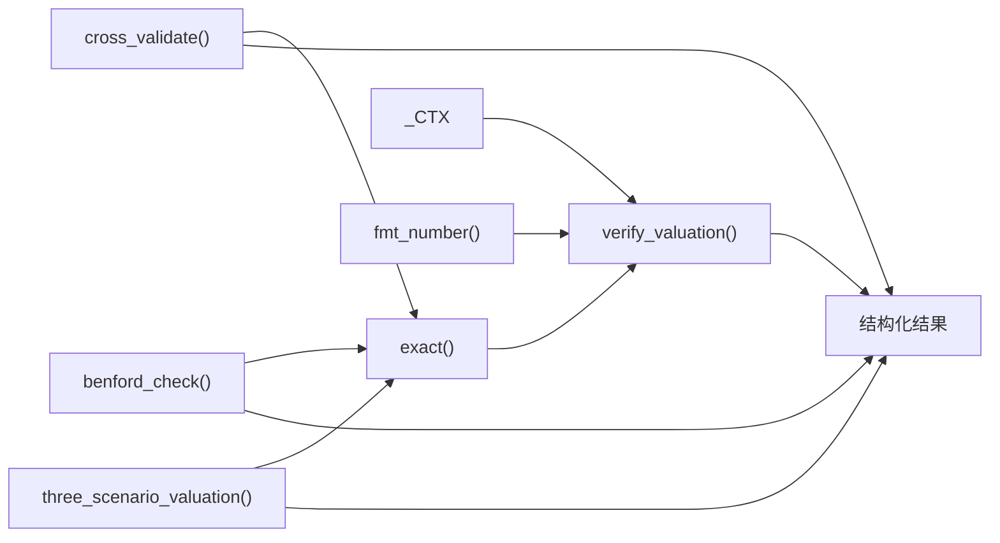

# 估值指标验算功能

<cite>
**本文档引用的文件**
- [financial_rigor.py](file://tools/financial_rigor.py)
- [fundamentals.json](file://data/fundamentals.json)
- [腾讯-财务估值分析-巴菲特视角.md](file://reports/腾讯/02-财务估值分析-巴菲特视角.md)
- [阿里巴巴-财务估值分析-巴菲特视角.md](file://reports/阿里巴巴/02-财务估值分析-巴菲特视角.md)
- [morningstar_fair_value.py](file://tools/morningstar_fair_value.py)
- [momentum_backtest_v2.py](file://tools/momentum_backtest_v2.py)
- [stock_screener.py](file://tools/stock_screener.py)
</cite>

## 目录
1. [简介](#简介)
2. [项目结构](#项目结构)
3. [核心组件](#核心组件)
4. [架构概览](#架构概览)
5. [详细组件分析](#详细组件分析)
6. [依赖关系分析](#依赖关系分析)
7. [性能考虑](#性能考虑)
8. [故障排查指南](#故障排查指南)
9. [结论](#结论)
10. [附录](#附录)

## 简介
本文件系统性阐述“估值指标验算功能”的设计与实现，围绕PE、PB、PS、P/FCF、股息率等关键估值比率的计算公式与实现逻辑进行深入解析；重点说明EPS为零时的特殊处理机制（PE计算的条件判断、无穷大值的处理与用户友好提示）；详解ROE复合计算的实现原理（EPS与BVPS的关系、利润率的间接计算与复合增长率的应用）；解释盈利收益率与自由现金流收益率的计算方法（分子分母的选择与百分比转换）；强调精确十进制运算在估值计算中的重要性，避免浮点数误差对投资决策的影响；最后提供多种财务指标组合使用的实际案例与最佳实践建议。

## 项目结构
估值指标验算功能位于工具模块中，配合财务数据与报告文档形成完整的投资研究闭环。核心文件与职责如下：
- tools/financial_rigor.py：估值指标验算、多源交叉验证、Benford定律检测、精确计算器、三情景估值模型等核心功能
- data/fundamentals.json：季度财务数据（如营收同比、毛利率、EPS超预期等），用于动量与价值验证
- reports/腾讯/02-财务估值分析-巴菲特视角.md：估值指标验算的实证示例与结果展示
- reports/阿里巴巴/02-财务估值分析-巴菲特视角.md：估值指标验算的实证示例与结果展示
- tools/morningstar_fair_value.py：基于Morningstar的公允价值筛选，辅助估值判断
- tools/momentum_backtest_v2.py：动量信号与价值验证结合的回测框架
- tools/stock_screener.py：动量发现+价值验证的选股筛

图表来源
- [financial_rigor.py:1-452](file://tools/financial_rigor.py#L1-L452)
- [fundamentals.json:1-36](file://data/fundamentals.json#L1-L36)
- [腾讯-财务估值分析-巴菲特视角.md:1-200](file://reports/腾讯/02-财务估值分析-巴菲特视角.md#L1-L200)
- [阿里巴巴-财务估值分析-巴菲特视角.md:1-200](file://reports/阿里巴巴/02-财务估值分析-巴菲特视角.md#L1-L200)
- [morningstar_fair_value.py:1-153](file://tools/morningstar_fair_value.py#L1-L153)
- [momentum_backtest_v2.py:1-232](file://tools/momentum_backtest_v2.py#L1-L232)
- [stock_screener.py:1-33](file://tools/stock_screener.py#L1-L33)

章节来源
- [financial_rigor.py:1-452](file://tools/financial_rigor.py#L1-L452)
- [fundamentals.json:1-36](file://data/fundamentals.json#L1-L36)

## 核心组件
- 精确十进制引擎：使用Python标准库Decimal与Context，确保计算精度，避免浮点误差
- 估值指标验算函数：统一计算PE、PB、PS、P/FCF、股息率、盈利收益率，并在EPS为零时给出明确提示
- 多源交叉验证：比较同一指标在不同来源的数据，识别异常与一致性
- Benford定律检测：快速筛查财务数据造假风险
- 精确计算器：支持表达式安全求值，避免eval直接执行带来的安全风险
- 三情景估值模型：基于复合增长率的未来EPS推导与目标股价计算

章节来源
- [financial_rigor.py:28-160](file://tools/financial_rigor.py#L28-L160)
- [financial_rigor.py:167-204](file://tools/financial_rigor.py#L167-L204)
- [financial_rigor.py:214-281](file://tools/financial_rigor.py#L214-L281)
- [financial_rigor.py:288-313](file://tools/financial_rigor.py#L288-L313)
- [financial_rigor.py:320-361](file://tools/financial_rigor.py#L320-L361)

## 架构概览
估值指标验算功能采用“命令行工具 + 数据驱动 + 报告集成”的架构：
- 命令行入口：解析参数，调用对应功能模块
- 数据输入：支持直接传参或从JSON文件读取季度财务数据
- 计算引擎：统一使用精确十进制，保证结果可审计复现
- 输出展示：格式化打印与结构化返回，便于后续报告集成

图表来源
- [financial_rigor.py:367-447](file://tools/financial_rigor.py#L367-L447)
- [financial_rigor.py:98-160](file://tools/financial_rigor.py#L98-L160)

## 详细组件分析

### 1. 精确十进制引擎与数值转换
- 使用Decimal与Context定义全局精度与舍入策略，避免浮点数漂移
- 提供exact()函数统一将输入转换为Decimal，消除float陷阱
- fmt_number()提供人类可读的大数格式化（亿/万亿/B/T）

图表来源
- [financial_rigor.py:31-37](file://tools/financial_rigor.py#L31-L37)
- [financial_rigor.py:40-54](file://tools/financial_rigor.py#L40-L54)

章节来源
- [financial_rigor.py:28-54](file://tools/financial_rigor.py#L28-L54)

### 2. 估值指标验算函数（verify_valuation）
- 输入：股价price与可选的EPS、BVPS、FCF/Share、Dividend、Revenue/Share
- 计算流程：
  - PE：当EPS≠0时计算PE=p/e，同时计算盈利收益率=e/p×100%
  - PB：当BVPS≠0时计算PB=p/b
  - ROE：当EPS≠0且BVPS≠0时计算ROE=EPS/BVPS×100%
  - P/FCF：当FCF/Share≠0时计算P/FCF=p/f，FCF Yield=f/p×100%
  - PS：当Revenue/Share≠0时计算PS=p/r
  - 股息率：当股价≠0时计算Dividend Yield=d/p×100%
- 特殊处理：
  - EPS为0时，PE不计算并提示“EPS为0，无法计算”
  - BVPS为0时，PB不计算
  - FCF/Share为0时，P/FCF与FCF Yield不计算
  - Revenue/Share为0时，PS不计算
  - 股价为0时，股息率不计算

图表来源
- [financial_rigor.py:98-160](file://tools/financial_rigor.py#L98-L160)

章节来源
- [financial_rigor.py:98-160](file://tools/financial_rigor.py#L98-L160)

### 3. EPS为零时的特殊处理机制
- 条件判断：仅当EPS≠0时才计算PE与盈利收益率
- 无穷大值处理：PE在EPS=0时不计算，避免出现无穷大或无效结果
- 用户友好提示：明确输出“EPS为0，无法计算”，并在后续指标（如PB、ROE）中避免依赖EPS为0的情况
- 实践建议：当EPS为0时，优先参考PB、PS、P/FCF、EV/EBITDA等替代指标，或结合现金流与资产质量进行综合判断

章节来源
- [financial_rigor.py:120-122](file://tools/financial_rigor.py#L120-L122)
- [腾讯-财务估值分析-巴菲特视角.md:147-169](file://reports/腾讯/02-财务估值分析-巴菲特视角.md#L147-L169)
- [阿里巴巴-财务估值分析-巴菲特视角.md:166-181](file://reports/阿里巴巴/02-财务估值分析-巴菲特视角.md#L166-L181)

### 4. ROE复合计算与EPS/BVPS关系
- ROE计算：ROE=EPS/BVPS×100%，前提是EPS与BVPS均≠0
- 复合增长率应用：三情景估值模型中，未来EPS通过复合增长率推导，即Future EPS = Current EPS × (1+g)^years
- 利润率间接计算：可通过ROE与资产周转率、权益乘数的杜邦分解间接推导利润率变化趋势
- 实践要点：当EPS为0或BVPS为0时，ROE不适用；应结合现金流、资产质量与业务结构进行综合评估

章节来源
- [financial_rigor.py:129-132](file://tools/financial_rigor.py#L129-L132)
- [financial_rigor.py:349-352](file://tools/financial_rigor.py#L349-L352)
- [腾讯-财务估值分析-巴菲特视角.md:67-73](file://reports/腾讯/02-财务估值分析-巴菲特视角.md#L67-L73)

### 5. 盈利收益率与自由现金流收益率
- 盈利收益率：盈利收益率=EPS/股价×100%，用于衡量股价相对于每股收益的回报
- 自由现金流收益率：FCF Yield=FCF/Share/股价×100%，用于衡量股价相对于自由现金流的回报
- 分子分母选择：盈利收益率使用EPS作为分子，自由现金流收益率使用FCF/Share作为分子
- 百分比转换：计算结果乘以100并保留两位小数，便于直观比较

章节来源
- [financial_rigor.py:118-119](file://tools/financial_rigor.py#L118-L119)
- [financial_rigor.py:137-140](file://tools/financial_rigor.py#L137-L140)
- [腾讯-财务估值分析-巴菲特视角.md:167-168](file://reports/腾讯/02-财务估值分析-巴菲特视角.md#L167-L168)

### 6. 精确十进制运算的重要性
- 避免浮点误差：在高频交易与大额资金场景下，微小的舍入误差可能导致累计偏差
- 可审计复现：所有中间结果与最终结果均为精确十进制，便于复核与追溯
- 一致性输出：fmt_number()提供统一的人类可读格式，减少歧义

章节来源
- [financial_rigor.py:28-54](file://tools/financial_rigor.py#L28-L54)

### 7. 多源交叉验证与Benford定律检测
- 多源交叉验证：对同一指标在多个来源进行比较，设置容差阈值，识别异常与一致性
- Benford定律检测：通过首数字分布与期望分布的偏差（MAD/Chi-square）判断数据真实性

章节来源
- [financial_rigor.py:167-204](file://tools/financial_rigor.py#L167-L204)
- [financial_rigor.py:214-281](file://tools/financial_rigor.py#L214-L281)

### 8. 三情景估值模型
- 输入：当前股价、当前EPS、总股本（亿）、三情景年增速与目标PE
- 计算：Future EPS = Current EPS × (1+g)^years，Target Price = Future EPS × Target PE
- 输出：三种情景下的目标EPS、目标股价与涨跌幅，便于风险评估与决策

章节来源
- [financial_rigor.py:320-361](file://tools/financial_rigor.py#L320-L361)

## 依赖关系分析
- 估值验算函数依赖精确十进制引擎与格式化工具
- 多源交叉验证依赖统一的Decimal转换与中位数计算
- Benford检测依赖数学库与统计指标
- 三情景估值模型依赖复合增长率计算
- 报告集成依赖格式化输出与Markdown表格

图表来源
- [financial_rigor.py:31-54](file://tools/financial_rigor.py#L31-L54)
- [financial_rigor.py:98-160](file://tools/financial_rigor.py#L98-L160)
- [financial_rigor.py:167-204](file://tools/financial_rigor.py#L167-L204)
- [financial_rigor.py:214-281](file://tools/financial_rigor.py#L214-L281)
- [financial_rigor.py:320-361](file://tools/financial_rigor.py#L320-L361)

章节来源
- [financial_rigor.py:31-361](file://tools/financial_rigor.py#L31-L361)

## 性能考虑
- 精确十进制运算的性能开销：相比浮点运算略高，但在投资研究中可接受
- 大数格式化：fmt_number()在处理极大数值时避免重复计算，提升可读性
- 多源数据处理：cross_validate()使用中位数作为参考，降低极端值影响
- Benford检测：样本量小于阈值时提前返回，避免无效计算

## 故障排查指南
- EPS为0导致PE无法计算：检查财务数据来源与报告口径，必要时使用替代指标（PB、PS、P/FCF）
- 股价为0导致股息率无法计算：确认股价数据有效性与货币单位
- BVPS为0导致PB与ROE无法计算：检查资产负债表数据与会计准则变更
- FCF/Share为0导致P/FCF与FCF Yield无法计算：关注资本支出与现金流质量
- 多源数据偏差较大：检查数据来源可靠性与单位一致性，适当提高容差阈值

章节来源
- [financial_rigor.py:120-122](file://tools/financial_rigor.py#L120-L122)
- [financial_rigor.py:146-149](file://tools/financial_rigor.py#L146-L149)
- [financial_rigor.py:124-128](file://tools/financial_rigor.py#L124-L128)
- [financial_rigor.py:136-142](file://tools/financial_rigor.py#L136-L142)
- [financial_rigor.py:188-192](file://tools/financial_rigor.py#L188-L192)

## 结论
估值指标验算功能通过精确十进制运算与严谨的数据处理流程，为投资研究提供可靠、可审计的估值计算能力。针对EPS为零等特殊情况，系统提供明确的条件判断与用户友好提示；ROE复合计算与三情景估值模型则帮助投资者在不确定性环境中做出更稳健的决策。结合多源交叉验证与Benford检测，可进一步提升数据质量与决策质量。

## 附录

### A. 实际案例与最佳实践
- 腾讯案例：使用精确十进制验算PE、PB、PS、P/FCF、股息率与盈利收益率，结果与报告一致，体现系统可复现性
- 阿里巴巴案例：结合GAAP与Non-GAAP口径，展示PE与PS的差异，强调不同口径下的估值解读
- 公允价值筛选：基于Morningstar的公允价值估计，辅助识别潜在低估标的
- 动量与价值结合：通过动量回测与价值验证的组合，提升信号质量与成功率

章节来源
- [腾讯-财务估值分析-巴菲特视角.md:147-169](file://reports/腾讯/02-财务估值分析-巴菲特视角.md#L147-L169)
- [阿里巴巴-财务估值分析-巴菲特视角.md:166-181](file://reports/阿里巴巴/02-财务估值分析-巴菲特视角.md#L166-L181)
- [morningstar_fair_value.py:77-149](file://tools/morningstar_fair_value.py#L77-L149)
- [momentum_backtest_v2.py:166-232](file://tools/momentum_backtest_v2.py#L166-L232)
- [stock_screener.py:1-33](file://tools/stock_screener.py#L1-L33)

### B. 常用指标计算公式速查
- PE = 股价 / EPS
- PB = 股价 / 每股净资产
- PS = 股价 / 每股营收
- P/FCF = 股价 / 自由现金流/Share
- 股息率 = 每股股息 / 股价 × 100%
- 盈利收益率 = EPS / 股价 × 100%
- ROE = EPS / 每股净资产 × 100%

章节来源
- [financial_rigor.py:114-156](file://tools/financial_rigor.py#L114-L156)
- [financial_rigor.py:129-132](file://tools/financial_rigor.py#L129-L132)