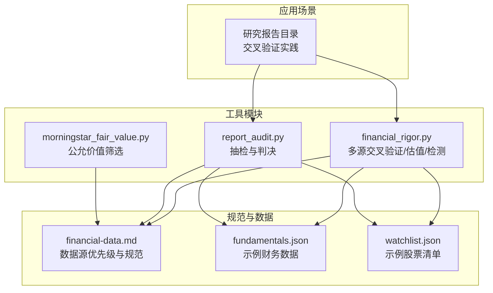
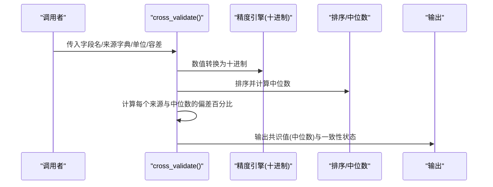
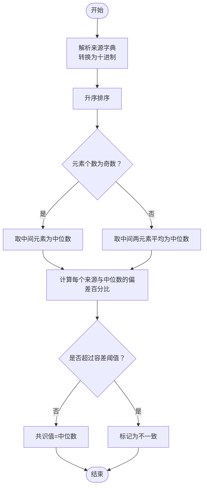
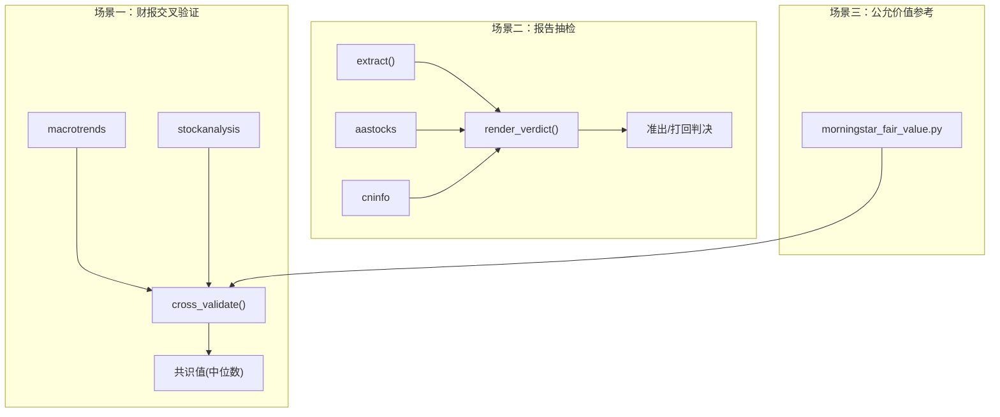
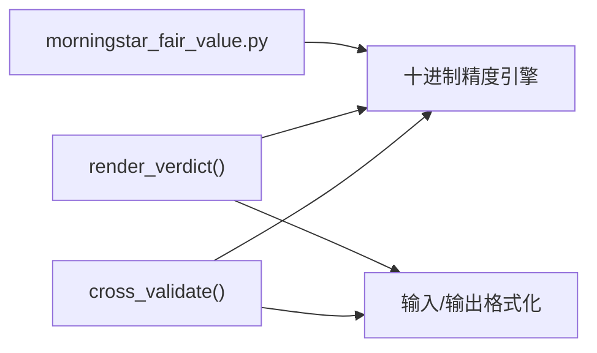

# 多源交叉验证功能

<cite>
**本文引用的文件**
- [financial_rigor.py](file://tools/financial_rigor.py)
- [report_audit.py](file://tools/report_audit.py)
- [financial-data.md](file://skills/financial-data.md)
- [fundamentals.json](file://data/fundamentals.json)
- [watchlist.json](file://data/watchlist.json)
- [morningstar_fair_value.py](file://tools/morningstar_fair_value.py)
</cite>

## 目录
1. [简介](#简介)
2. [项目结构](#项目结构)
3. [核心组件](#核心组件)
4. [架构概览](#架构概览)
5. [详细组件分析](#详细组件分析)
6. [依赖关系分析](#依赖关系分析)
7. [性能考虑](#性能考虑)
8. [故障排查指南](#故障排查指南)
9. [结论](#结论)
10. [附录](#附录)

## 简介
本技术文档围绕“多源交叉验证”功能展开，系统阐述中位数共识值的计算原理、容差阈值设定机制、数据一致性判断逻辑、权重中位数共识值的实现思路、数据源优先级建议以及典型应用场景。该功能旨在通过多个独立数据源对同一财务指标进行交叉验证，识别异常值与口径差异，输出稳健的共识值与可追溯的判定结果。

## 项目结构
多源交叉验证功能主要由以下模块构成：
- 工具模块：提供命令行接口与核心算法实现
  - tools/financial_rigor.py：多源交叉验证、估值指标验算、Benford检测、精确计算等
  - tools/report_audit.py：研究报告数据抽检与准出/打回判决
  - tools/morningstar_fair_value.py：从Morningstar抓取公允价值估计，辅助交叉验证
- 规范与参考数据
  - skills/financial-data.md：数据源优先级与交叉验证规范
  - data/fundamentals.json、data/watchlist.json：示例数据结构
- 文档与示例
  - 多个研究报告目录：展示交叉验证在实际投研中的应用场景

图表来源
- [financial_rigor.py:166-204](file://tools/financial_rigor.py#L166-L204)
- [report_audit.py:253-398](file://tools/report_audit.py#L253-L398)
- [financial-data.md:7-31](file://skills/financial-data.md#L7-L31)
- [fundamentals.json:1-36](file://data/fundamentals.json#L1-L36)
- [watchlist.json:1-38](file://data/watchlist.json#L1-L38)

章节来源
- [financial_rigor.py:166-204](file://tools/financial_rigor.py#L166-L204)
- [report_audit.py:253-398](file://tools/report_audit.py#L253-L398)
- [financial-data.md:7-31](file://skills/financial-data.md#L7-L31)

## 核心组件
- 多源交叉验证函数：基于中位数共识值，结合容差阈值进行一致性判断，并输出共识值与状态标记
- 报告抽检与判决：对抽检数据点进行双源或多源比对，输出准出/打回结论
- 数据源优先级与规范：明确不同市场的主/副来源，指导数据采集与交叉验证策略
- 公允价值筛选：为交叉验证提供第三方机构估值参考

章节来源
- [financial_rigor.py:166-204](file://tools/financial_rigor.py#L166-L204)
- [report_audit.py:253-398](file://tools/report_audit.py#L253-L398)
- [financial-data.md:7-31](file://skills/financial-data.md#L7-L31)
- [morningstar_fair_value.py:1-152](file://tools/morningstar_fair_value.py#L1-L152)

## 架构概览
多源交叉验证的整体流程如下：
- 输入：字段名、来源字典（来源→数值）、单位、容差百分比
- 处理：数值精度保持（十进制）、排序、中位数计算、偏差计算、状态标记
- 输出：共识值（中位数）、一致性标志、逐源偏差详情

图表来源
- [financial_rigor.py:166-204](file://tools/financial_rigor.py#L166-L204)

## 详细组件分析

### 中位数共识值计算原理
- 数值精度保持：使用十进制上下文避免浮点误差累积，确保计算可重复、可审计
- 排序与中位数：
  - 对所有数值进行升序排序
  - 若数量为奇数：取中间位置；若为偶数：取中间两数平均
- 偏差计算：以中位数为参考，计算每个来源与中位数的百分比偏差
- 状态标记：以容差阈值为界，超过阈值标记为不一致，否则一致
- 共识值：输出中位数作为共识值

图表来源
- [financial_rigor.py:173-204](file://tools/financial_rigor.py#L173-L204)

章节来源
- [financial_rigor.py:166-204](file://tools/financial_rigor.py#L166-L204)

### 容差百分比设定机制
- 默认阈值：2.0%（CLI参数默认值）
- 配置方式：命令行参数传入，支持覆盖
- 选择依据：兼顾稳健性与实用性，既不过于严格导致误判，也不过于宽松掩盖异常
- 异常值识别：当任一来源偏差超过阈值即标记为不一致，提示进一步核实

章节来源
- [financial_rigor.py:166-204](file://tools/financial_rigor.py#L166-L204)
- [financial_rigor.py:398-403](file://tools/financial_rigor.py#L398-L403)

### 数据一致性判断逻辑
- 偏差公式：绝对偏差 = |来源值 - 中位数| / 中位数 × 100%
- 状态标记：≤ 阈值为一致（✅），> 阈值为不一致（❌）
- 结果汇总：统计所有来源的一致性，输出总体结论与逐源详情
- 建议提示：当存在不一致时，建议优先采用公司年报/交易所数据

章节来源
- [financial_rigor.py:186-204](file://tools/financial_rigor.py#L186-L204)

### 权重中位数共识值的实现思路
- 当前实现：共识值为中位数，未引入显式的权重分配
- 可扩展方案（建议）：
  - 权重来源：基于数据源权威性、时效性、一致性稳定性
  - 算法：对排序后的数值序列按权重累计，找到累计权重达到50%的位置对应的值
  - 注意：需保证权重归一化与边界处理（奇偶长度列表的中位数与加权中位数差异）

章节来源
- [financial_rigor.py:177-204](file://tools/financial_rigor.py#L177-L204)

### 数据源优先级建议
- 美股：macrotrends（主）+ stockanalysis（副）+ SEC EDGAR（原始一手）
- 港股：aastocks（主）+ macrotrends ADR（副）+ HKEX披露易（原始一手）
- A股：东方财富（主）+ 巨潮资讯（副）
- 建议：优先采用年报/季报原始文件，其次为权威第三方数据源，最后为市场报价

章节来源
- [financial-data.md:7-31](file://skills/financial-data.md#L7-L31)

### 实际应用场景
- 财报关键指标交叉验证：收入、净利润、毛利率、经营现金流等
- 研究报告抽检：对抽取的数据点进行双源或多源比对，输出准出/打回
- 公允价值参考：利用Morningstar筛选器获取第三方估值，辅助交叉验证

图表来源
- [financial_rigor.py:166-204](file://tools/financial_rigor.py#L166-L204)
- [report_audit.py:253-398](file://tools/report_audit.py#L253-L398)
- [morningstar_fair_value.py:1-152](file://tools/morningstar_fair_value.py#L1-L152)

## 依赖关系分析
- 模块内聚性：交叉验证函数独立封装，便于复用与测试
- 外部依赖：仅使用Python标准库，降低部署复杂度
- 数据耦合：与规范文件（financial-data.md）耦合，确保数据源选择与口径一致

图表来源
- [financial_rigor.py:166-204](file://tools/financial_rigor.py#L166-L204)
- [report_audit.py:253-398](file://tools/report_audit.py#L253-L398)

章节来源
- [financial_rigor.py:166-204](file://tools/financial_rigor.py#L166-L204)
- [report_audit.py:253-398](file://tools/report_audit.py#L253-L398)

## 性能考虑
- 时间复杂度：排序 O(n log n)，偏差计算 O(n)，整体 O(n log n)
- 空间复杂度：O(n)
- 优化建议：
  - 对大量来源时，可考虑分批处理或并行化来源数据获取
  - 使用更高效的中位数算法（如快速选择）可将排序优化至 O(n)，但需权衡实现复杂度

## 故障排查指南
- 容差阈值设置不当
  - 现象：频繁出现不一致或过度宽松
  - 处理：根据数据波动性调整阈值，或针对不同指标设置差异化阈值
- 数据源不一致
  - 现象：GAAP/Non-GAAP、汇率、财年定义差异导致偏差
  - 处理：统一会计口径与换算基准，优先采用原始财报
- 数值精度问题
  - 现象：浮点误差导致微小差异
  - 处理：使用十进制精度引擎，避免浮点运算

章节来源
- [financial_rigor.py:166-204](file://tools/financial_rigor.py#L166-L204)
- [financial-data.md:73-82](file://skills/financial-data.md#L73-L82)

## 结论
多源交叉验证通过中位数共识值与容差阈值实现了稳健的数据一致性判断，结合明确的数据源优先级与规范，能够有效识别异常值与口径差异。当前实现简洁可靠，具备良好的可扩展性，可在后续引入权重中位数等高级算法以进一步提升鲁棒性。

## 附录
- 示例数据结构参考
  - fundamentals.json：季度财务指标示例
  - watchlist.json：股票分组示例
- 相关工具
  - financial_rigor.py：命令行工具，支持交叉验证、估值验算、Benford检测、精确计算
  - report_audit.py：研究报告抽检与判决工具
  - morningstar_fair_value.py：第三方公允价值筛选工具

章节来源
- [fundamentals.json:1-36](file://data/fundamentals.json#L1-L36)
- [watchlist.json:1-38](file://data/watchlist.json#L1-L38)
- [financial_rigor.py:367-452](file://tools/financial_rigor.py#L367-L452)
- [report_audit.py:405-523](file://tools/report_audit.py#L405-L523)
- [morningstar_fair_value.py:1-152](file://tools/morningstar_fair_value.py#L1-L152)