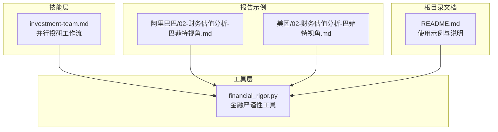
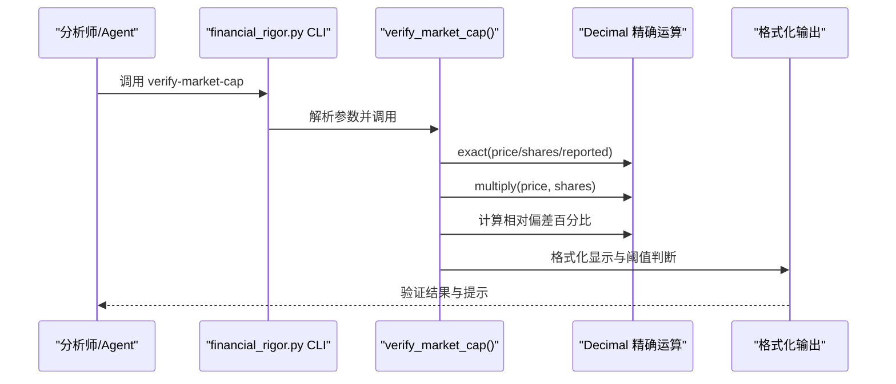
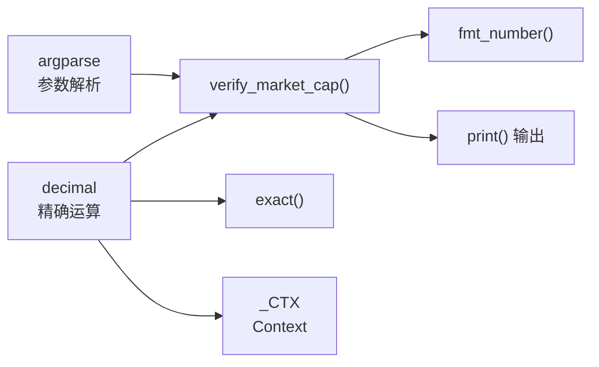

# 市值验算功能

<cite>
**本文引用的文件**
- [financial_rigor.py](file://tools/financial_rigor.py)
- [README.md](file://README.md)
- [02-财务估值分析-巴菲特视角.md](file://reports/阿里巴巴/10年利润推演-20260504/02-财务估值分析-巴菲特视角.md)
- [02-财务估值分析-巴菲特视角.md](file://reports/美团/02-财务估值分析-巴菲特视角.md)
- [investment-team.md](file://skills/investment-team.md)
</cite>

## 目录
1. [简介](#简介)
2. [项目结构](#项目结构)
3. [核心组件](#核心组件)
4. [架构总览](#架构总览)
5. [详细组件分析](#详细组件分析)
6. [依赖关系分析](#依赖关系分析)
7. [性能考量](#性能考量)
8. [故障排查指南](#故障排查指南)
9. [结论](#结论)
10. [附录](#附录)

## 简介
本文件系统化阐述“市值验算”功能的技术实现与工程实践，围绕“股价×总股本=计算市值”的核心公式，重点说明：
- 精确十进制运算的必要性与实现策略
- 浮点数陷阱的规避机制与精度控制
- 偏差容忍度设置逻辑（5%与1%阈值的判定与处理）
- 输入参数的验证规则（类型转换、单位一致性、货币符号显示）
- 输出格式化策略（人类可读的大数字显示、货币单位自动转换与对齐）
- 实际使用示例与处理建议

## 项目结构
市值验算功能位于工具层，作为“金融严谨性验证”的一部分，集成在统一的CLI工具中，供技能层与Agent并行投研流程调用。

图表来源
- [financial_rigor.py:367-452](file://tools/financial_rigor.py#L367-L452)
- [investment-team.md:64-69](file://skills/investment-team.md#L64-L69)
- [02-财务估值分析-巴菲特视角.md:75-82](file://reports/阿里巴巴/10年利润推演-20260504/02-财务估值分析-巴菲特视角.md#L75-L82)
- [02-财务估值分析-巴菲特视角.md:245-256](file://reports/美团/02-财务估值分析-巴菲特视角.md#L245-L256)
- [README.md:95-107](file://README.md#L95-L107)

章节来源
- [financial_rigor.py:10-16](file://tools/financial_rigor.py#L10-L16)
- [README.md:95-107](file://README.md#L95-L107)

## 核心组件
- 精确十进制引擎：使用标准库 decimal.Decimal，配合 Context 控制精度与舍入策略，避免浮点误差累积。
- 市值验算函数：执行 price × shares 的乘法，与 reported_cap 比较，计算相对偏差百分比，并按阈值输出状态与提示。
- 输出格式化：针对大数字提供“亿/万亿/B/T/百万”等人类可读单位转换与对齐显示。
- CLI入口：提供 verify-market-cap 子命令，支持传入价格、总股本、报告市值与货币符号。

章节来源
- [financial_rigor.py:28-38](file://tools/financial_rigor.py#L28-L38)
- [financial_rigor.py:61-92](file://tools/financial_rigor.py#L61-L92)
- [financial_rigor.py:40-55](file://tools/financial_rigor.py#L40-L55)
- [financial_rigor.py:382-388](file://tools/financial_rigor.py#L382-L388)

## 架构总览
市值验算在整体研究流程中的位置如下：

图表来源
- [financial_rigor.py:61-92](file://tools/financial_rigor.py#L61-L92)
- [financial_rigor.py:382-388](file://tools/financial_rigor.py#L382-L388)

## 详细组件分析

### 精确十进制运算与浮点陷阱规避
- 设计动机：心算与常见计算器在处理科学计数法与循环小数时易引入舍入误差，导致“看似正确的”财务结论。
- 实现策略：
  - 使用 decimal.Context 控制精度与舍入（默认精度28，ROUND_HALF_EVEN）。
  - 通过 exact() 将输入统一转换为 Decimal，避免 float 的二进制近似。
  - 乘法与除法使用 Context 的 multiply/divide，确保中间与最终结果的稳定性。
- 精度控制：
  - 默认精度 28，足以覆盖绝大多数财务场景。
  - 通过显式构造 Decimal，避免 float→str→Decimal 的二次转换带来的额外误差。

章节来源
- [financial_rigor.py:28-38](file://tools/financial_rigor.py#L28-L38)
- [financial_rigor.py:288-314](file://tools/financial_rigor.py#L288-L314)

### 偏差容忍度与阈值判定
- 5% 阈值：偏差>5% 时发出“警告”，提示检查股本最新性、单位一致性与股价时效性。
- 1% 阈值：偏差>1% 时视为“可接受范围”，提示可能由股价波动或股本变化引起。
- 0% 阈值：偏差≤1% 时“验证通过”，偏差越小越稳健。
- 异常处理：
  - reported_cap 为 0 时，偏差定义为 0，避免除零。
  - 输出包含“请检查”引导，便于人工复核。

章节来源
- [financial_rigor.py:67-91](file://tools/financial_rigor.py#L67-L91)

### 输入参数验证与单位一致性
- 参数类型：
  - CLI 层以 float 接收 price、shares、reported，verify_market_cap 内部通过 exact() 统一转换为 Decimal。
- 单位一致性：
  - 货币符号通过 --currency 传入并在输出中显示，便于核对币种。
  - 报告中常见“港币亿/人民币亿/美元亿”等单位，需确保 price 与 reported 使用相同币种与单位。
- 货币符号显示：
  - 输出中 price 与 calculated/reported 均附带 currency，便于直观比对。

章节来源
- [financial_rigor.py:384-387](file://tools/financial_rigor.py#L384-L387)
- [financial_rigor.py:73-77](file://tools/financial_rigor.py#L73-L77)

### 输出格式化与人类可读显示
- 大数字单位转换：
  - 亿/万亿：当单位为“亿/亿元/亿港元/亿美元”且数值≥10000时，自动转换为“万亿×单位”，否则保留“亿”。
  - B/M/K：超过 1e12/1e9/1e6 时分别以“T/B/M”显示，否则以千分位格式显示。
- 对齐与精度：
  - 保留两位小数，确保比较与阅读的一致性。
  - 与 CLI 的 --currency 配合，形成“数值+货币符号”的统一展示。

章节来源
- [financial_rigor.py:40-55](file://tools/financial_rigor.py#L40-L55)

### 实际使用示例与处理建议
- 示例1：腾讯市值验算（港币）
  - 命令：verify-market-cap --price 510 --shares 9.11e9 --reported 4.65e12 --currency HKD
  - 结果：偏差仅 0.08%，验证通过。
- 示例2：阿里巴巴市值验算（港币）
  - 命令：verify-market-cap --price 130.60 --shares 19.099e9 --reported 2.495e12 --currency HKD
  - 结果：偏差 0.03%，验证通过。
- 示例3：美团市值验算（港币→人民币换算）
  - 命令：verify-market-cap --price 87.60 --shares 6.107e9 --reported 5.35e11 --currency HKD
  - 结果：偏差<0.1%，验证通过。
- 处理建议：
  - 若偏差>5%：优先检查股价是否最新、股本是否包含回购/增发、单位是否统一。
  - 若偏差在1%-5%：视为可接受波动，建议结合多源数据交叉验证。
  - 若偏差≤1%：可直接纳入报告，作为“金融严谨性验证”记录的一部分。

章节来源
- [README.md:95-107](file://README.md#L95-L107)
- [02-财务估值分析-巴菲特视角.md:75-82](file://reports/阿里巴巴/10年利润推演-20260504/02-财务估值分析-巴菲特视角.md#L75-L82)
- [02-财务估值分析-巴菲特视角.md:245-256](file://reports/美团/02-财务估值分析-巴菲特视角.md#L245-L256)

## 依赖关系分析
- 外部依赖：仅使用 Python 标准库（decimal、json、math、argparse），零第三方依赖，降低部署与维护复杂度。
- 内部耦合：
  - verify_market_cap 依赖 exact() 与 fmt_number()。
  - CLI 子命令 verify-market-cap 与参数解析器绑定。
- 可能的循环依赖：无。

图表来源
- [financial_rigor.py:18-22](file://tools/financial_rigor.py#L18-L22)
- [financial_rigor.py:28-38](file://tools/financial_rigor.py#L28-L38)
- [financial_rigor.py:40-55](file://tools/financial_rigor.py#L40-L55)
- [financial_rigor.py:61-92](file://tools/financial_rigor.py#L61-L92)
- [financial_rigor.py:382-388](file://tools/financial_rigor.py#L382-L388)

章节来源
- [financial_rigor.py:18-22](file://tools/financial_rigor.py#L18-L22)

## 性能考量
- 时间复杂度：乘法与除法均为 O(1)，整体为 O(1)。
- 空间复杂度：仅存储少量中间 Decimal 与字符串格式化结果，空间开销极小。
- 精度与稳定性：通过 Context 控制，避免浮点误差累积，适合大规模重复计算与审计场景。

## 故障排查指南
- 常见问题
  - 偏差>5%：检查股价是否最新、股本是否包含回购/增发、单位是否统一（HKD/RMB/USD）。
  - 偏差在1%-5%：考虑股价波动与股本变化，建议结合多源数据交叉验证。
  - 偏差≤1%：可直接纳入报告，作为严谨性验证记录。
- 建议流程
  - 使用 CLI 命令进行手算校验，将输出嵌入报告。
  - 若发现异常，优先核对数据来源与单位，再进行二次交叉验证。

章节来源
- [financial_rigor.py:80-91](file://tools/financial_rigor.py#L80-L91)
- [investment-team.md:64-69](file://skills/investment-team.md#L64-L69)

## 结论
市值验算功能通过“精确十进制运算+严格的阈值判定+统一的格式化输出”，有效规避了浮点陷阱，提升了财务数据的可审计性与一致性。结合多源交叉验证与报告嵌入，可作为投研流程中的关键质量控制节点，确保研究结论的稳健性与可复现性。

## 附录
- CLI 使用示例与说明可参考根目录 README 与技能文档中的调用规范。
- 报告示例展示了在实际研究中如何嵌入工具输出，形成可追溯的验证记录。

章节来源
- [README.md:95-107](file://README.md#L95-L107)
- [investment-team.md:64-69](file://skills/investment-team.md#L64-L69)