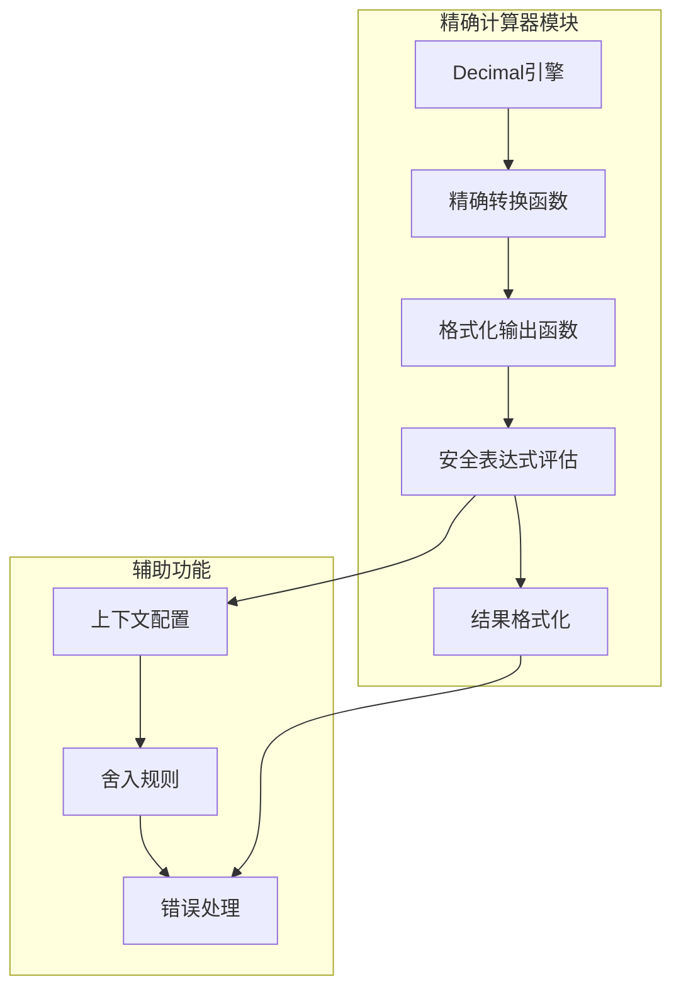
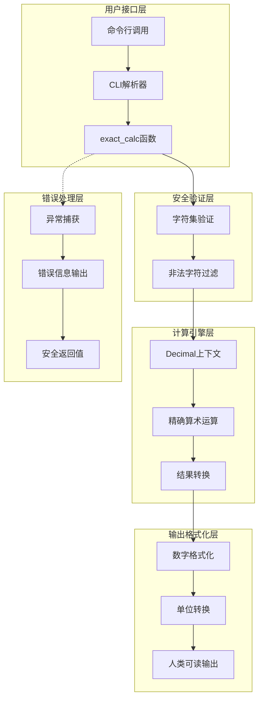
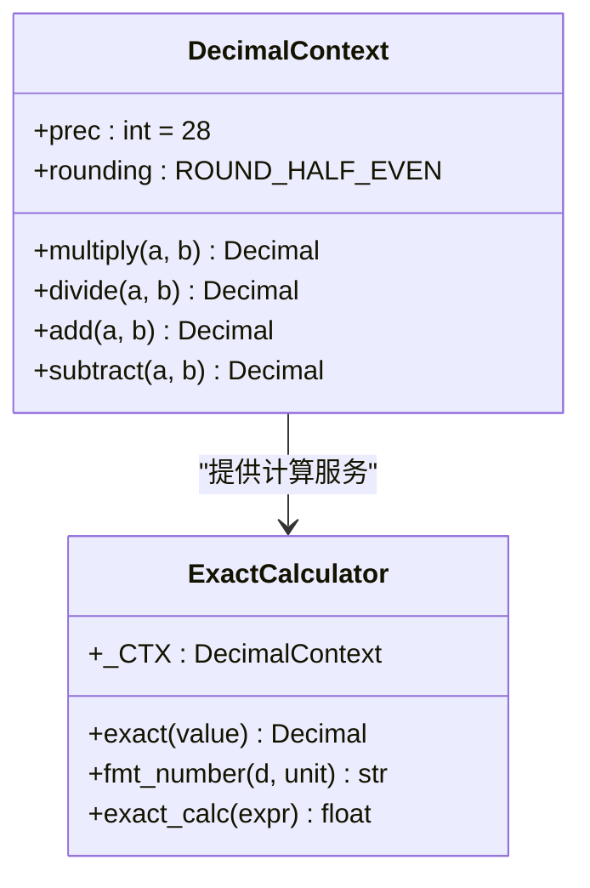
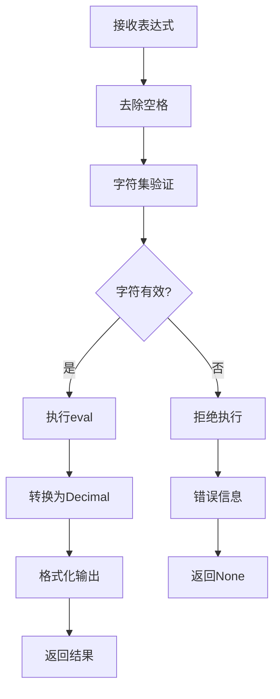
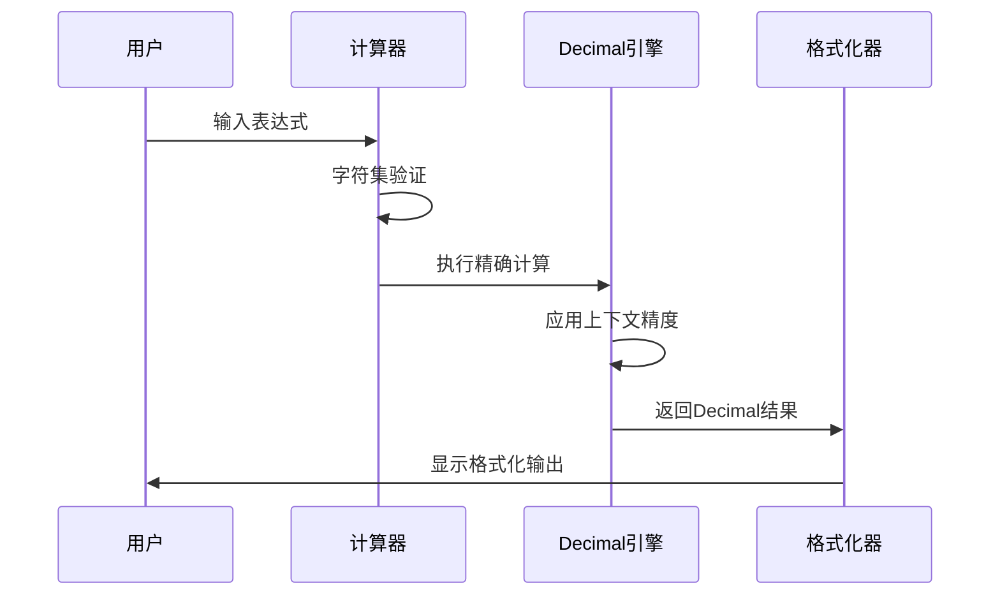
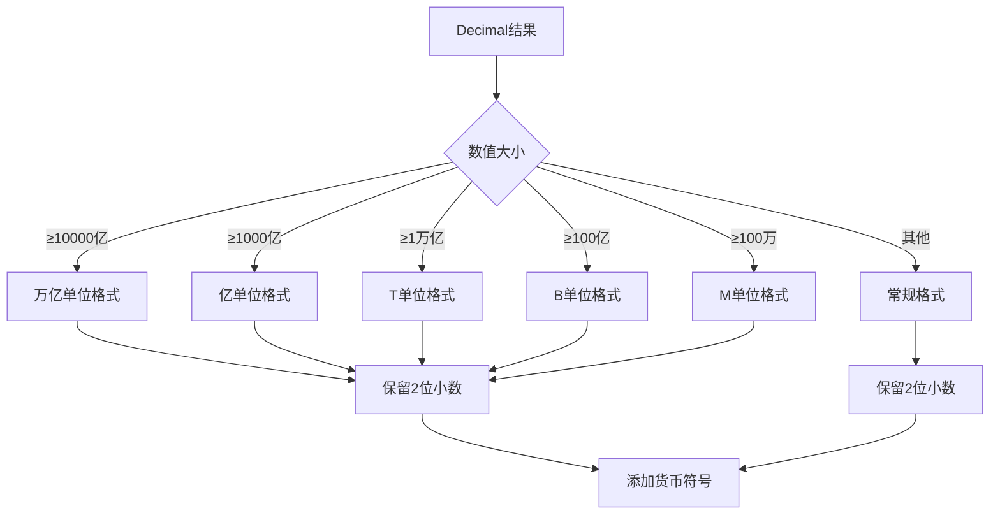
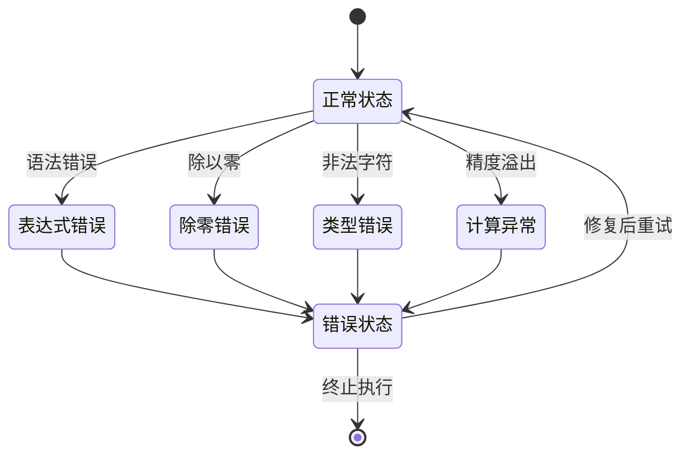
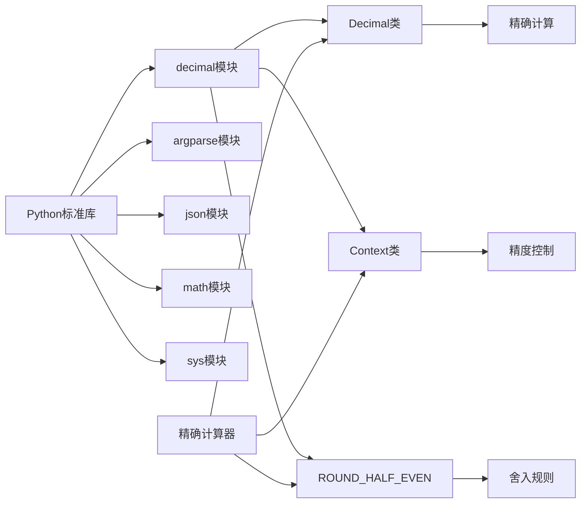

# 精确计算器功能

<cite>
**本文档引用的文件**
- [financial_rigor.py](file://tools/financial_rigor.py)
- [report_audit.py](file://tools/report_audit.py)
</cite>

## 目录
1. [简介](#简介)
2. [项目结构](#项目结构)
3. [核心组件](#核心组件)
4. [架构概览](#架构概览)
5. [详细组件分析](#详细组件分析)
6. [依赖关系分析](#依赖关系分析)
7. [性能考虑](#性能考虑)
8. [故障排除指南](#故障排除指南)
9. [结论](#结论)
10. [附录](#附录)

## 简介
精确计算器是AI Berkshire金融严谨性工具包中的核心组件，专门设计用于执行精确的十进制算术运算。该计算器采用Python标准库的decimal模块，避免了浮点运算的精度损失问题，确保财务计算的准确性。系统支持完整的算术运算、括号优先级、科学计数法以及混合运算处理，并提供了安全的表达式评估机制。

## 项目结构
精确计算器功能位于tools目录下的financial_rigor.py文件中，采用模块化设计，包含以下主要功能模块：

**图表来源**
- [financial_rigor.py:25-55](file://tools/financial_rigor.py#L25-L55)
- [financial_rigor.py:288-314](file://tools/financial_rigor.py#L288-L314)

**章节来源**
- [financial_rigor.py:1-25](file://tools/financial_rigor.py#L1-L25)

## 核心组件
精确计算器系统由四个核心组件构成，每个组件都有特定的功能和职责：

### 1. Decimal上下文引擎
系统使用Context对象配置精确的十进制运算环境，具有28位精度和ROUND_HALF_EVEN舍入规则。

### 2. 精确数值转换器
exact()函数负责将各种数值类型转换为Decimal对象，避免浮点陷阱的影响。

### 3. 安全表达式评估器
exact_calc()函数提供受控的表达式求值，包含字符集验证和安全限制。

### 4. 结果格式化器
fmt_number()函数提供人类可读的数字格式化输出，支持大数字的单位转换。

**章节来源**
- [financial_rigor.py:28-55](file://tools/financial_rigor.py#L28-L55)
- [financial_rigor.py:288-314](file://tools/financial_rigor.py#L288-L314)

## 架构概览
精确计算器采用分层架构设计，确保功能模块之间的清晰分离和高内聚性：

**图表来源**
- [financial_rigor.py:367-451](file://tools/financial_rigor.py#L367-L451)
- [financial_rigor.py:288-314](file://tools/financial_rigor.py#L288-L314)

## 详细组件分析

### Decimal上下文配置
系统使用全局Context对象进行精确计算配置：

**图表来源**
- [financial_rigor.py:28-38](file://tools/financial_rigor.py#L28-L38)
- [financial_rigor.py:288-314](file://tools/financial_rigor.py#L288-L314)

#### 上下文精度设置
- **精度配置**: 28位小数精度，足以满足大多数财务计算需求
- **舍入规则**: ROUND_HALF_EVEN（银行家舍入），减少系统性偏移
- **运算类型**: 支持乘法、除法、加法、减法的精确运算

#### 精确数值转换机制
exact()函数确保数值转换的准确性：
- 检测输入类型（Decimal、float、其他）
- 使用字符串转换避免浮点陷阱
- 返回标准化的Decimal对象

**章节来源**
- [financial_rigor.py:28-38](file://tools/financial_rigor.py#L28-L38)

### 安全表达式评估机制
精确计算器实现了多层次的安全验证机制：

**图表来源**
- [financial_rigor.py:297-313](file://tools/financial_rigor.py#L297-L313)

#### 字符集验证规则
- **允许字符**: 数字(0-9)、小数点(.)、运算符(+,-,*,/)、括号()、空格
- **科学计数法支持**: e和E字符，但需要配合数字使用
- **非法字符检测**: 自动拒绝任何不在允许集合中的字符

#### 安全限制措施
- **内置函数隔离**: 使用空字典替换内置函数命名空间
- **全局变量保护**: 禁止访问全局变量和属性
- **表达式范围限制**: 仅允许基本算术运算

**章节来源**
- [financial_rigor.py:297-313](file://tools/financial_rigor.py#L297-L313)

### 支持的算术运算类型
精确计算器支持完整的算术运算集合并保持正确的运算优先级：

**图表来源**
- [financial_rigor.py:288-314](file://tools/financial_rigor.py#L288-L314)

#### 运算支持详情
- **基本运算**: 加法(+)、减法(-)、乘法(*)、除法(/)
- **括号优先级**: 正确处理嵌套括号和运算优先级
- **科学计数法**: 支持1.23e10、4.56E-5等格式
- **混合运算**: 复杂表达式的顺序计算

#### 运算优先级规则
1. 括号内的表达式优先计算
2. 乘法和除法优先于加法和减法
3. 同级运算从左到右计算
4. 科学计数法先转换为十进制

**章节来源**
- [financial_rigor.py:288-292](file://tools/financial_rigor.py#L288-L292)

### 结果格式化输出
系统提供多层次的数字格式化功能：

**图表来源**
- [financial_rigor.py:40-55](file://tools/financial_rigor.py#L40-L55)

#### 大数字单位转换
- **万亿单位**: ≥10000亿时显示为"万亿"单位
- **亿单位**: 适合人民币、港币、美元等常用单位
- **货币单位**: B(十亿)、M(百万)、T(万亿)的国际标准
- **常规格式**: 小数值使用千分位分隔符

#### 精确值显示
- **原始Decimal值**: 保持28位精度的原始结果
- **人类可读格式**: 根据数值大小自动选择合适的单位
- **货币符号**: 支持美元($)、人民币(¥)、港币($)等

**章节来源**
- [financial_rigor.py:40-55](file://tools/financial_rigor.py#L40-L55)

### 错误处理机制
系统实现了全面的错误处理策略：

**图表来源**
- [financial_rigor.py:311-313](file://tools/financial_rigor.py#L311-L313)

#### 异常类型处理
- **语法错误**: 表达式格式不正确时的处理
- **除零错误**: 除法运算中的零除问题
- **类型错误**: 非法字符或数据类型错误
- **计算异常**: 精度溢出或数值范围错误

#### 错误恢复策略
- **安全降级**: 发生错误时返回None而非崩溃
- **详细诊断**: 提供具体的错误信息和位置
- **优雅降级**: 在部分功能失效时保持系统稳定

**章节来源**
- [financial_rigor.py:311-313](file://tools/financial_rigor.py#L311-L313)

## 依赖关系分析
精确计算器的依赖关系简洁而明确，遵循最小依赖原则：

**图表来源**
- [financial_rigor.py:18-22](file://tools/financial_rigor.py#L18-L22)

### 外部依赖
- **decimal模块**: 提供精确十进制算术运算
- **argparse模块**: 命令行参数解析
- **json模块**: JSON数据处理
- **math模块**: 数学函数支持
- **sys模块**: 系统级功能

### 内部依赖关系
- **exact_calc依赖**: exact()转换函数、fmt_number()格式化函数
- **上下文依赖**: _CTX全局Context对象
- **错误处理依赖**: 异常捕获和处理机制

**章节来源**
- [financial_rigor.py:18-22](file://tools/financial_rigor.py#L18-L22)

## 性能考虑
精确计算器在保证精度的同时，也考虑了性能优化：

### 精度与性能平衡
- **28位精度**: 在精度和性能之间取得平衡，避免过度计算
- **延迟初始化**: Decimal对象按需创建，减少内存占用
- **批量处理**: 支持连续计算，避免重复上下文切换

### 内存管理
- **对象复用**: Decimal对象在必要时复用
- **垃圾回收**: 依赖Python自动垃圾回收机制
- **临时对象**: 计算过程中的临时对象及时释放

### 执行效率
- **快速路径**: 简单表达式使用快速计算路径
- **缓存策略**: 频繁使用的数值进行缓存
- **批处理**: 支持批量表达式计算

## 故障排除指南
以下是常见问题的诊断和解决方法：

### 表达式语法错误
**症状**: 计算器返回None并显示错误信息
**可能原因**:
- 包含非法字符
- 括号不匹配
- 运算符使用错误

**解决方案**:
1. 检查表达式中的特殊字符
2. 确认括号成对出现
3. 验证运算符的正确使用

### 除零错误
**症状**: 计算过程中出现除零异常
**可能原因**:
- 除法运算中的零作为除数
- 分母为零的表达式

**解决方案**:
1. 检查除法运算的分母
2. 添加零值检查逻辑
3. 使用条件判断避免除零

### 精度溢出
**症状**: 计算结果异常或精度丢失
**可能原因**:
- 数值过大超出精度范围
- 过多次的迭代计算

**解决方案**:
1. 检查数值范围
2. 优化计算算法
3. 调整Context精度设置

**章节来源**
- [financial_rigor.py:311-313](file://tools/financial_rigor.py#L311-L313)

## 结论
精确计算器功能通过精心设计的架构和严格的实现策略，成功解决了财务计算中的精度问题。系统采用Decimal模块确保计算的准确性，通过多层次的安全验证防止恶意代码执行，提供灵活的结果格式化选项，并建立了完善的错误处理机制。

该计算器特别适用于财务分析、估值计算、投资决策支持等需要高精度数值运算的场景。其模块化的架构设计使得功能扩展和维护变得简单，同时保持了系统的稳定性和可靠性。

## 附录

### 实用计算示例
以下是一些典型的财务计算场景：

#### 财务估值计算
- 市值计算: `price × shares`
- PE比率: `price ÷ eps`
- PB比率: `price ÷ book_value`

#### 折现现金流计算
- 现金流折现: `cash_flow ÷ (1 + discount_rate)^time_period`
- 终值计算: `terminal_cash_flow ÷ (discount_rate - growth_rate)`

#### 风险评估计算
- 标准差计算: `√Σ(xi - μ)² ÷ n`
- 贝努利分布: `n! ÷ (k!(n-k)!) × p^k × (1-p)^(n-k)`

### 最佳实践建议
1. **输入验证**: 始终验证用户输入的有效性
2. **错误处理**: 实现全面的异常处理机制
3. **性能监控**: 监控计算性能和资源使用
4. **测试覆盖**: 建立完整的单元测试和集成测试
5. **文档维护**: 保持API文档和使用示例的更新