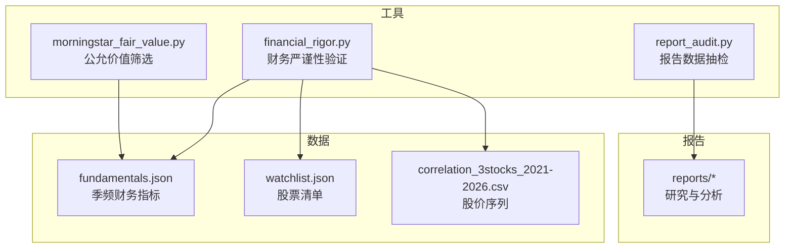
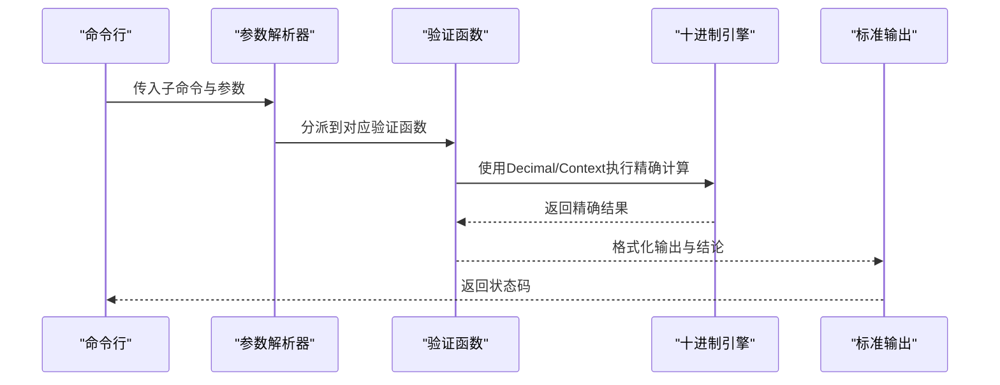
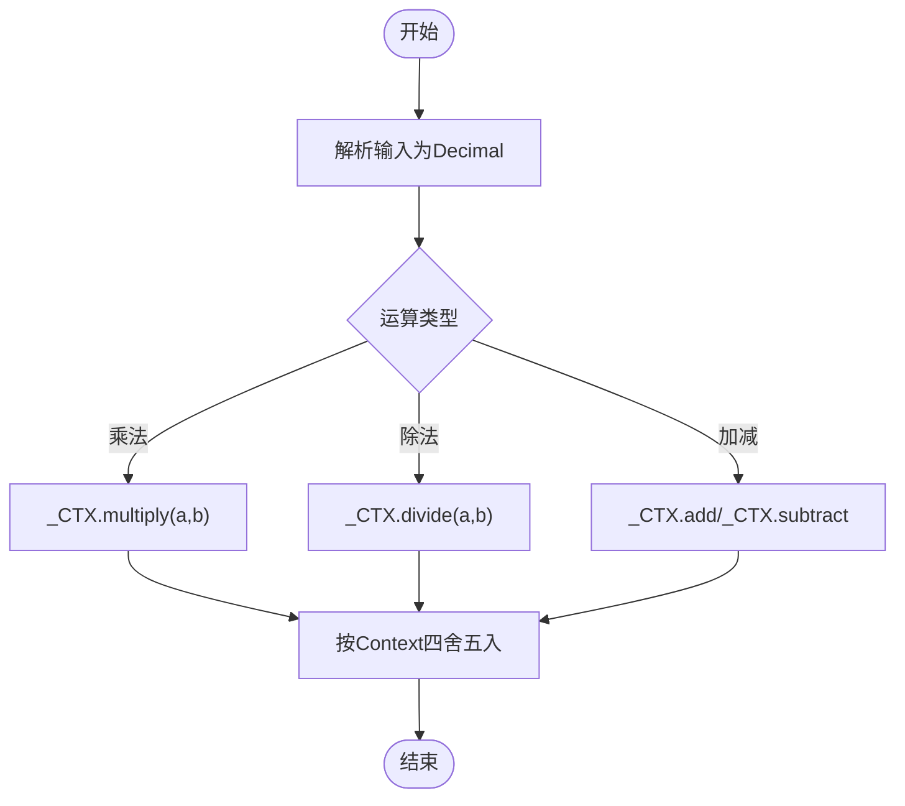
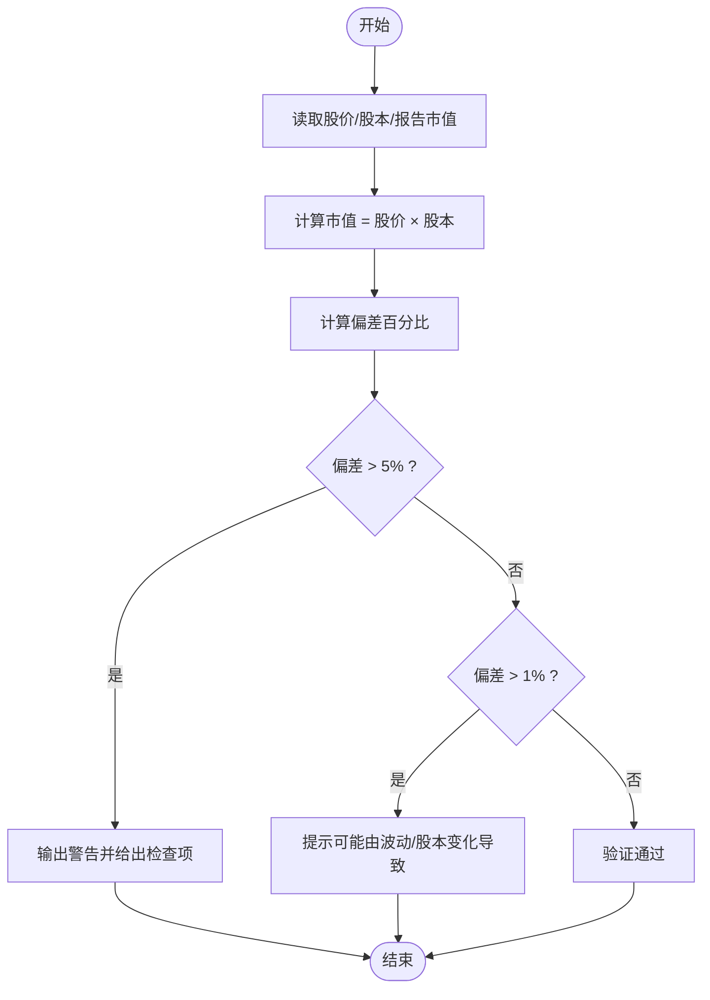
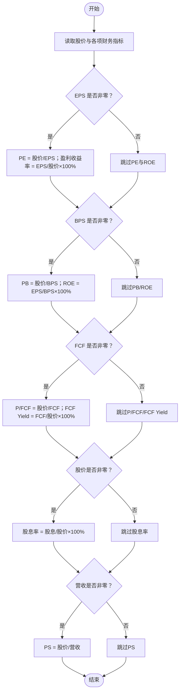
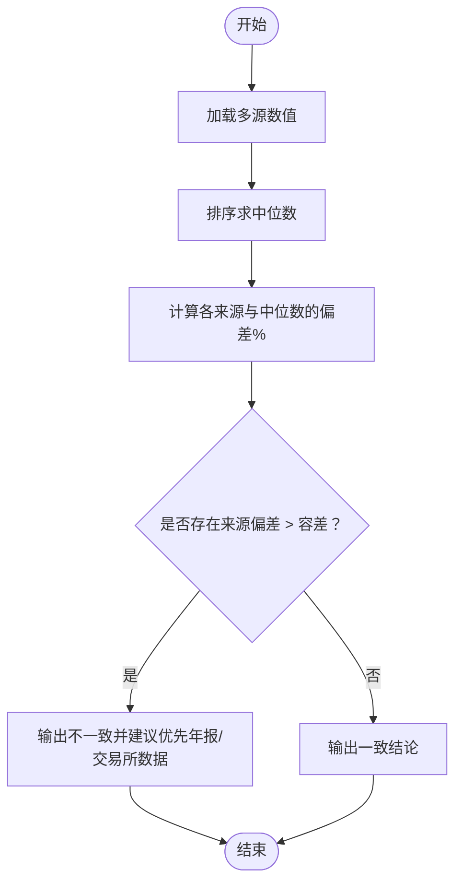
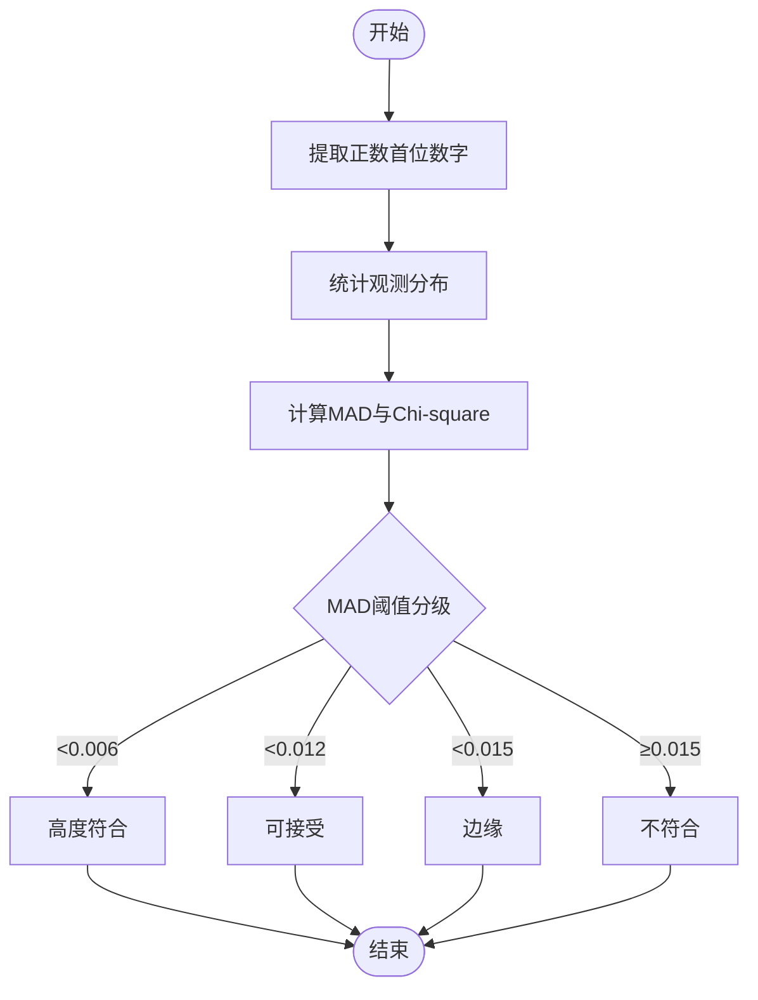
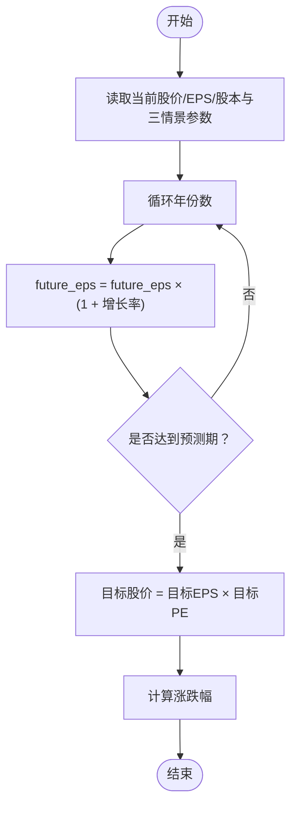
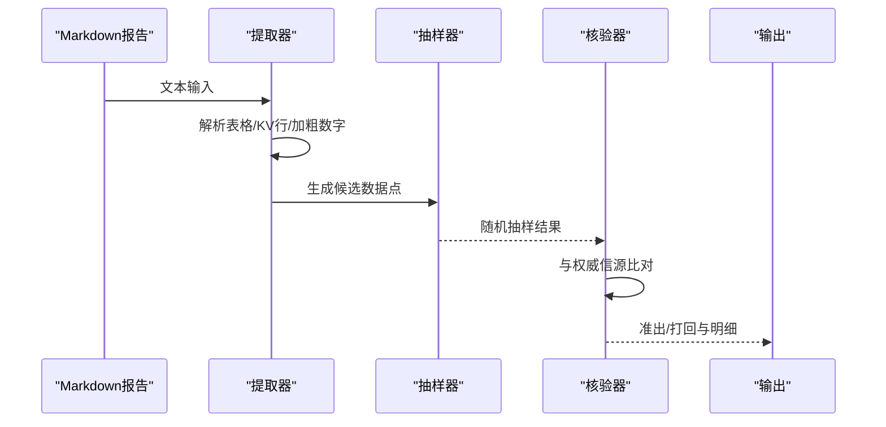
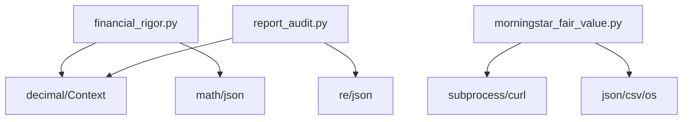

# 财务严谨性验证工具

<cite>
**本文档引用的文件**
- [financial_rigor.py](file://tools/financial_rigor.py)
- [report_audit.py](file://tools/report_audit.py)
- [morningstar_fair_value.py](file://tools/morningstar_fair_value.py)
- [fundamentals.json](file://data/fundamentals.json)
- [watchlist.json](file://data/watchlist.json)
- [correlation_3stocks_2021-2026.csv](file://data/correlation_3stocks_2021-2026.csv)
</cite>

## 目录
1. [简介](#简介)
2. [项目结构](#项目结构)
3. [核心组件](#核心组件)
4. [架构概览](#架构概览)
5. [详细组件分析](#详细组件分析)
6. [依赖关系分析](#依赖关系分析)
7. [性能考量](#性能考量)
8. [故障排查指南](#故障排查指南)
9. [结论](#结论)
10. [附录](#附录)

## 简介
本工具集面向AI伯克夏研究场景，提供“财务严谨性验证”的端到端能力，覆盖以下关键领域：
- 精确十进制计算引擎：消除浮点陷阱，确保财务计算可审计复现
- 市值验算：股价×总股本与报告市值的偏差校验
- 估值指标验算：PE、PB、PS、FCF等比率的自动计算与EPS为零的特殊处理
- 多源交叉验证：基于中位数共识值与容差阈值的数据一致性判断
- Benford定律检测：首数字分布统计、MAD指标与财务造假识别
- 三情景估值模型：乐观/中性/悲观三种假设下的目标价格与复合增长率应用
- 报告数据抽检：从研究报告中抽取样本并与权威信源比对，输出准出/打回判决

## 项目结构
该仓库围绕“财务严谨性验证”主题构建了多个工具与数据文件：
- tools目录：核心验证工具（financial_rigor.py、report_audit.py、morningstar_fair_value.py）
- data目录：基础财务数据与清单（fundamentals.json、watchlist.json、correlation_3stocks_2021-2026.csv）
- reports目录：研究与分析报告（用于抽检与交叉验证）

图表来源
- [financial_rigor.py:1-452](file://tools/financial_rigor.py#L1-L452)
- [report_audit.py:1-523](file://tools/report_audit.py#L1-L523)
- [morningstar_fair_value.py:1-153](file://tools/morningstar_fair_value.py#L1-L153)
- [fundamentals.json:1-36](file://data/fundamentals.json#L1-L36)
- [watchlist.json:1-38](file://data/watchlist.json#L1-L38)
- [correlation_3stocks_2021-2026.csv:1-263](file://data/correlation_3stocks_2021-2026.csv#L1-L263)

章节来源
- [financial_rigor.py:1-16](file://tools/financial_rigor.py#L1-L16)
- [report_audit.py:1-22](file://tools/report_audit.py#L1-L22)
- [morningstar_fair_value.py:1-25](file://tools/morningstar_fair_value.py#L1-L25)

## 核心组件
- 精确十进制引擎：统一使用Decimal与Context，避免浮点误差累积
- 市值验算模块：股价×总股本与报告市值的偏差阈值判断
- 估值指标验算：PE、PB、PS、FCF、股息率等比率的自动计算
- 多源交叉验证：中位数共识值与容差百分比的判定
- Benford定律检测：MAD与Chi-square指标，首数字分布一致性检验
- 三情景估值：复合增长率驱动的目标价格与涨跌幅计算
- 报告数据抽检：从Markdown中抽取财务数据点，随机抽样并比对权威信源

章节来源
- [financial_rigor.py:28-55](file://tools/financial_rigor.py#L28-L55)
- [financial_rigor.py:61-91](file://tools/financial_rigor.py#L61-L91)
- [financial_rigor.py:98-160](file://tools/financial_rigor.py#L98-L160)
- [financial_rigor.py:167-204](file://tools/financial_rigor.py#L167-L204)
- [financial_rigor.py:214-281](file://tools/financial_rigor.py#L214-L281)
- [financial_rigor.py:320-361](file://tools/financial_rigor.py#L320-L361)
- [report_audit.py:39-226](file://tools/report_audit.py#L39-L226)
- [report_audit.py:253-398](file://tools/report_audit.py#L253-L398)

## 架构概览
工具采用命令行子命令模式，每个功能模块独立封装，通过参数解析器统一调度。数据流自上而下：输入参数→解析→调用具体函数→格式化输出→返回状态码。

图表来源
- [financial_rigor.py:367-447](file://tools/financial_rigor.py#L367-L447)
- [financial_rigor.py:31-38](file://tools/financial_rigor.py#L31-L38)
- [financial_rigor.py:28-28](file://tools/financial_rigor.py#L28-L28)

## 详细组件分析

### 精确十进制计算引擎
- 设计要点
  - 使用Decimal与Context(prec=28, rounding=ROUND_HALF_EVEN)，确保高精度与四舍五入策略一致
  - exact()函数统一将输入转换为Decimal，避免浮点陷阱
  - fmt_number()支持亿/万亿/B/T等人类可读格式
- 复杂度与性能
  - 精度提升带来计算成本增加，但在财务场景中可忽略
  - 适合批量计算与审计复现，避免浮点误差累积
- 错误处理
  - 对无效输入进行显式转换与异常捕获，保证稳健性

图表来源
- [financial_rigor.py:28-38](file://tools/financial_rigor.py#L28-L38)
- [financial_rigor.py:40-55](file://tools/financial_rigor.py#L40-L55)

章节来源
- [financial_rigor.py:28-55](file://tools/financial_rigor.py#L28-L55)

### 市值验算模块
- 计算逻辑
  - 市值 = 股价 × 总股本
  - 偏差 = |计算市值 − 报告市值| / |报告市值| × 100%
- 偏差阈值
  - >5%：警告，提示检查股本/单位/股价
  - >1%：提示可能由股价波动/股本变化导致
  - ≤1%：验证通过
- 异常处理
  - 报告市值为0时，偏差定义为0

图表来源
- [financial_rigor.py:61-91](file://tools/financial_rigor.py#L61-L91)

章节来源
- [financial_rigor.py:61-91](file://tools/financial_rigor.py#L61-L91)

### 估值指标验算模块
- 支持指标
  - PE = 股价 / EPS；当EPS=0时跳过PE计算
  - PB = 股价 / BPS；若EPS≠0，可同时计算ROE = EPS / BPS × 100%
  - P/FCF = 股价 / FCF；FCF Yield = FCF / 股价 × 100%
  - 股息率 = 每股股息 / 股价 × 100%
  - PS = 股价 / 每股营收
- 特殊处理
  - EPS为0时PE与ROE不计算，避免除零
  - 所有计算使用精确十进制，输出不含浮点误差

图表来源
- [financial_rigor.py:98-160](file://tools/financial_rigor.py#L98-L160)

章节来源
- [financial_rigor.py:98-160](file://tools/financial_rigor.py#L98-L160)

### 多源交叉验证模块
- 方法
  - 以中位数为共识值，计算各来源与中位数的偏差百分比
  - 容差阈值默认2%，可通过参数调整
- 输出
  - 显示各来源数值与偏差
  - 给出“一致/不一致”的结论与建议（优先采用年报/交易所数据）

图表来源
- [financial_rigor.py:167-204](file://tools/financial_rigor.py#L167-L204)

章节来源
- [financial_rigor.py:167-204](file://tools/financial_rigor.py#L167-L204)

### Benford定律检测模块
- 算法
  - 提取正数的首位数字，统计观测分布
  - 计算MAD（Nigrini均值绝对偏差）与Chi-square
  - 依据MAD阈值给出“高度符合/可接受/边缘/不符合”等级
- 判定
  - 样本量<50时提示可靠性不足
  - MAD < 0.015通常认为符合Benford定律，否则可能存在人为调整迹象

图表来源
- [financial_rigor.py:214-281](file://tools/financial_rigor.py#L214-L281)

章节来源
- [financial_rigor.py:214-281](file://tools/financial_rigor.py#L214-L281)

### 三情景估值模型
- 假设
  - 乐观/中性/悲观三种年增长率与目标PE
  - 复合增长率：未来EPS = 当前EPS × (1 + 增长率)^年数
- 计算
  - 目标EPS与目标股价 = 目标EPS × 目标PE
  - 涨跌幅 = (目标股价 − 当前股价) / 当前股价 × 100%
- 输出
  - 三情景下的目标EPS、目标股价与涨跌幅，便于安全边际评估

图表来源
- [financial_rigor.py:320-361](file://tools/financial_rigor.py#L320-L361)

章节来源
- [financial_rigor.py:320-361](file://tools/financial_rigor.py#L320-L361)

### 报告数据抽检模块
- 数据提取
  - 从Markdown中解析表格与KV行，抽取财务数据点
  - 过滤噪声标签与无效数值，保留有意义字段
- 抽样策略
  - 默认15%抽样，最少3个，最多30个，支持固定随机种子
- 判决规则
  - 容差1%，两来源比对时任一来源偏差>1%即为不通过
  - 输出准出/打回与失败明细，便于CI/脚本判断

图表来源
- [report_audit.py:155-226](file://tools/report_audit.py#L155-L226)
- [report_audit.py:229-237](file://tools/report_audit.py#L229-L237)
- [report_audit.py:253-398](file://tools/report_audit.py#L253-L398)

章节来源
- [report_audit.py:155-226](file://tools/report_audit.py#L155-L226)
- [report_audit.py:229-237](file://tools/report_audit.py#L229-L237)
- [report_audit.py:253-398](file://tools/report_audit.py#L253-L398)

## 依赖关系分析
- 内部依赖
  - financial_rigor.py内部模块间松耦合，通过exact/Context统一精度控制
  - report_audit.py与外部数据源（macrotrends、stockanalysis、aastocks、eastmoney）交互，但工具本身不直接依赖这些站点
- 外部依赖
  - tools目录工具均使用Python标准库，零第三方依赖
  - 数据文件（JSON/CSV）作为输入，不引入运行时依赖

图表来源
- [financial_rigor.py:18-22](file://tools/financial_rigor.py#L18-L22)
- [report_audit.py:24-31](file://tools/report_audit.py#L24-L31)
- [morningstar_fair_value.py:7-12](file://tools/morningstar_fair_value.py#L7-L12)

章节来源
- [financial_rigor.py:18-22](file://tools/financial_rigor.py#L18-L22)
- [report_audit.py:24-31](file://tools/report_audit.py#L24-L31)
- [morningstar_fair_value.py:7-12](file://tools/morningstar_fair_value.py#L7-L12)

## 性能考量
- 精度与速度
  - Decimal高精度带来一定计算开销，但财务场景可接受
  - 对于大规模数据批处理，建议分批执行并缓存中间结果
- I/O与网络
  - report_audit.py依赖外部站点抓取，建议增加超时与重试机制
  - morningstar_fair_value.py分页抓取，注意API限速与稳定性

## 故障排查指南
- 市值验算
  - 若偏差>5%，检查股本是否最新（回购/增发）、单位是否一致、股价是否最新
- 估值指标
  - EPS为0时PE/ROE不计算属正常；若EPS≠0但出现异常，检查输入单位与精度
- 多源交叉验证
  - 容差阈值可调；若多数来源偏差>2%，优先采用年报/交易所数据
- Benford检测
  - 样本量<50时结论不可靠；MAD接近0.015附近需结合业务背景判断
- 三情景估值
  - 复合增长率与目标PE需谨慎设定；关注隐含假设与外部环境变化
- 报告抽检
  - 若出现大量不通过，检查标签清洗规则与信源选择；必要时降低容差或扩大样本

章节来源
- [financial_rigor.py:80-91](file://tools/financial_rigor.py#L80-L91)
- [financial_rigor.py:120-122](file://tools/financial_rigor.py#L120-L122)
- [financial_rigor.py:195-200](file://tools/financial_rigor.py#L195-L200)
- [financial_rigor.py:231-233](file://tools/financial_rigor.py#L231-L233)
- [report_audit.py:366-387](file://tools/report_audit.py#L366-L387)

## 结论
本工具集以“零外部依赖、高精度、可审计复现”为核心设计原则，覆盖财务严谨性验证的关键环节。通过精确十进制引擎与多维度校验手段，有效降低浮点误差与数据漂移带来的风险，为AI伯克夏的投资研究提供坚实的数据质量保障。

## 附录
- 使用示例（命令行）
  - 市值验算：python3 tools/financial_rigor.py verify-market-cap --price 510 --shares 9.11e9 --reported 4.65e12 --currency HKD
  - 估值指标：python3 tools/financial_rigor.py verify-valuation --price 510 --eps 23.5 --bvps 120 --fcf-per-share 18 --dividend 2.4
  - 多源交叉验证：python3 tools/financial_rigor.py cross-validate --field revenue --values '{"年报": 7518, "Yahoo": 7500, "StockAnalysis": 7520}' --unit 亿
  - Benford检测：python3 tools/financial_rigor.py benford --values '[1234, 2345, 3456, ...]'
  - 精确计算：python3 tools/financial_rigor.py calc --expr '510 * 9.11e9'
  - 三情景估值：python3 tools/financial_rigor.py three-scenario --price 510 --eps 23.5 --shares 9.11 --growth 0.15 0.08 0.0 --pe 25 20 15 --years 3