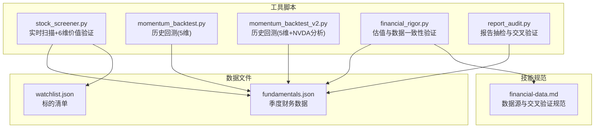
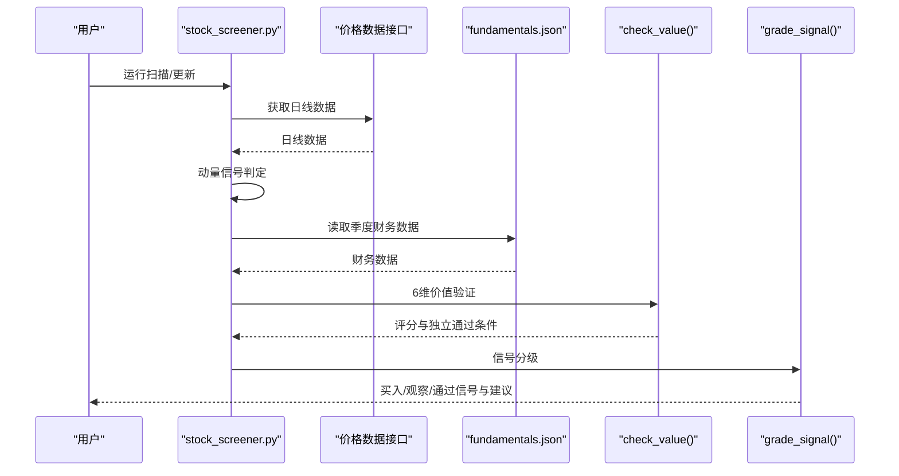
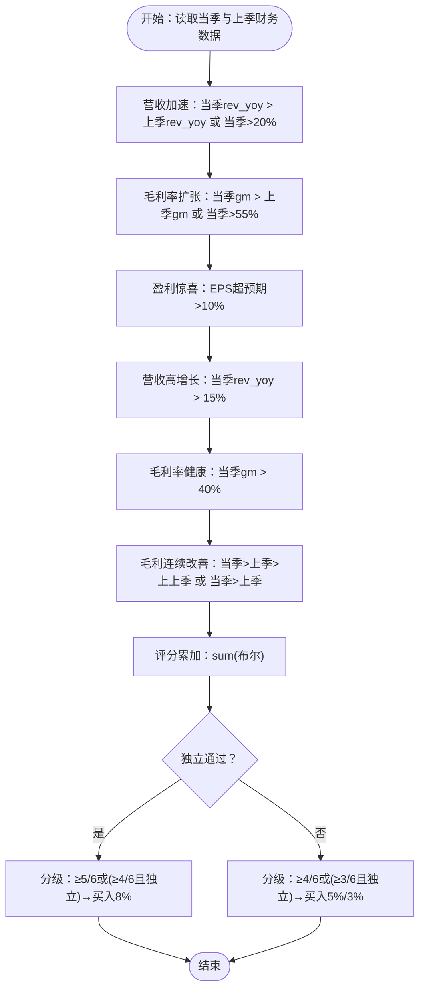
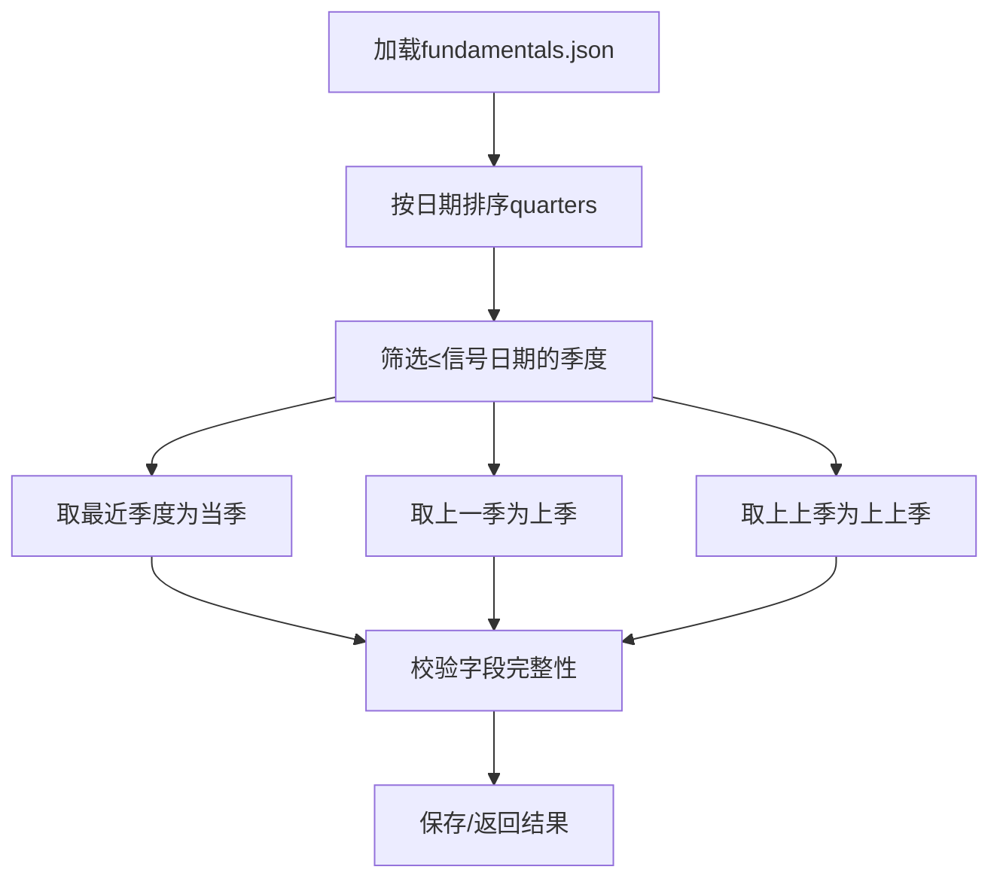
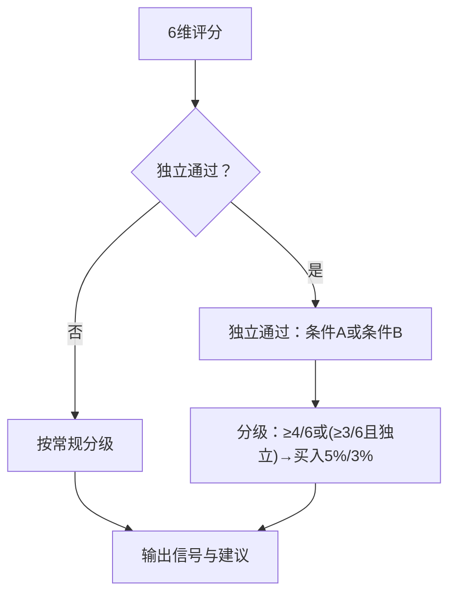
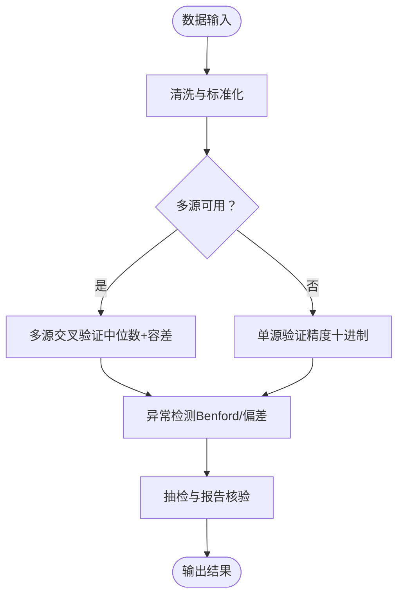
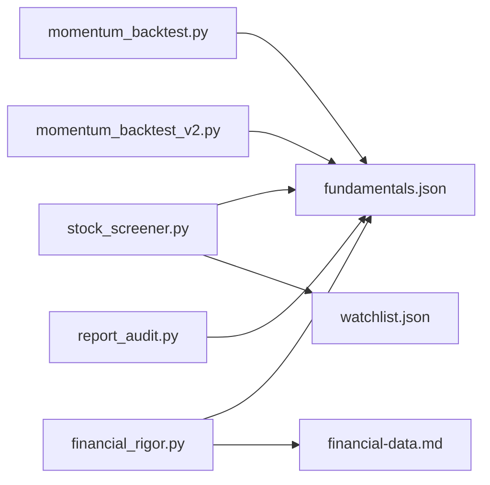

# 价值验证模块

<cite>
**本文档引用的文件**
- [stock_screener.py](file://tools/stock_screener.py)
- [momentum_backtest.py](file://tools/momentum_backtest.py)
- [momentum_backtest_v2.py](file://tools/momentum_backtest_v2.py)
- [financial_rigor.py](file://tools/financial_rigor.py)
- [report_audit.py](file://tools/report_audit.py)
- [financial-data.md](file://skills/financial-data.md)
- [fundamentals.json](file://data/fundamentals.json)
- [watchlist.json](file://data/watchlist.json)
</cite>

## 目录
1. [简介](#简介)
2. [项目结构](#项目结构)
3. [核心组件](#核心组件)
4. [架构概览](#架构概览)
5. [详细组件分析](#详细组件分析)
6. [依赖关系分析](#依赖关系分析)
7. [性能考虑](#性能考虑)
8. [故障排查指南](#故障排查指南)
9. [结论](#结论)
10. [附录](#附录)

## 简介
本文件系统化阐述“价值验证模块”的技术实现，围绕6维价值评分体系展开，涵盖：
- 6维评分标准与阈值设定
- 财务数据获取与处理流程（存储格式、排序与时间窗口匹配）
- 独立通过条件设计理念（毛利率连续改善与EPS超预期场景）
- 评分计算算法（布尔转换、累加与分级）
- 财务指标阈值与历史比较策略
- 数据验证机制（缺失处理、异常检测与完整性保障）

该模块在“动量发现”之后提供第二层筛选，结合基本面数据与回测经验，提升信号质量与稳健性。

## 项目结构
价值验证模块主要由以下文件构成：
- 工具脚本：用于扫描、回测与验证
  - tools/stock_screener.py：实时扫描与价值验证
  - tools/momentum_backtest.py：历史回测（5维）
  - tools/momentum_backtest_v2.py：历史回测（5维，含NVDA手动分析）
  - tools/financial_rigor.py：估值与数据一致性验证
  - tools/report_audit.py：报告数据抽检与交叉验证
- 数据文件：基础财务数据与标的清单
  - data/fundamentals.json：季度财务数据（rev_yoy/gm/eps_beat）
  - data/watchlist.json：标的清单
- 技能规范：财务数据获取与交叉验证
  - skills/financial-data.md：数据源优先级与交叉验证规范

图表来源
- [stock_screener.py:1-402](file://tools/stock_screener.py#L1-L402)
- [momentum_backtest.py:1-361](file://tools/momentum_backtest.py#L1-L361)
- [momentum_backtest_v2.py:1-398](file://tools/momentum_backtest_v2.py#L1-L398)
- [financial_rigor.py:1-451](file://tools/financial_rigor.py#L1-L451)
- [report_audit.py:1-479](file://tools/report_audit.py#L1-L479)
- [fundamentals.json:1-36](file://data/fundamentals.json#L1-L36)
- [watchlist.json:1-38](file://data/watchlist.json#L1-L38)
- [financial-data.md:1-92](file://skills/financial-data.md#L1-L92)

章节来源
- [stock_screener.py:1-402](file://tools/stock_screener.py#L1-L402)
- [momentum_backtest.py:1-361](file://tools/momentum_backtest.py#L1-L361)
- [momentum_backtest_v2.py:1-398](file://tools/momentum_backtest_v2.py#L1-L398)
- [financial_rigor.py:1-451](file://tools/financial_rigor.py#L1-L451)
- [report_audit.py:1-479](file://tools/report_audit.py#L1-L479)
- [fundamentals.json:1-36](file://data/fundamentals.json#L1-L36)
- [watchlist.json:1-38](file://data/watchlist.json#L1-L38)
- [financial-data.md:1-92](file://skills/financial-data.md#L1-L92)

## 核心组件
- 6维价值评分体系（实时扫描版本）
  - 营收加速：同比增速改善（与上季度对比）
  - 毛利率扩张：当季或环比改善，或绝对值>55%
  - 盈利惊喜：EPS超预期>10%
  - 营收高增长：营收同比>15%
  - 毛利率健康：毛利率>40%
  - 毛利连续改善：连续2季改善（解决NVDA 2023-01漏判）
- 独立通过条件
  - 条件A：毛利率连续改善且当季>45%（NVDA 2023-01场景）
  - 条件B：EPS超预期>30%（MU底部场景）
- 评分与分级
  - 6维评分，满分为6；≥5或（≥4且独立通过）为买入信号
  - 3/6试探仓、4/6标准仓、≥5/6确信仓
- 数据来源与处理
  - fundamentals.json：季度财务数据（rev_yoy/gm/eps_beat）
  - watchlist.json：标的清单
  - 交互式更新与保存

章节来源
- [stock_screener.py:167-249](file://tools/stock_screener.py#L167-L249)
- [stock_screener.py:256-277](file://tools/stock_screener.py#L256-L277)
- [stock_screener.py:98-116](file://tools/stock_screener.py#L98-L116)
- [fundamentals.json:1-36](file://data/fundamentals.json#L1-L36)
- [watchlist.json:1-38](file://data/watchlist.json#L1-L38)

## 架构概览
价值验证模块在“动量发现”之后运行，基于已有的价格信号与基本面数据进行评分与分级，支持实时扫描与历史回测两种模式。

图表来源
- [stock_screener.py:283-325](file://tools/stock_screener.py#L283-L325)
- [stock_screener.py:167-249](file://tools/stock_screener.py#L167-L249)
- [stock_screener.py:256-277](file://tools/stock_screener.py#L256-L277)
- [fundamentals.json:1-36](file://data/fundamentals.json#L1-L36)

## 详细组件分析

### 6维价值评分体系
- 营收加速（rev_yoy改善）
  - 有上季度数据：当季rev_yoy > 上季度rev_yoy
  - 无上季度数据：当季rev_yoy > 20%
- 毛利率扩张（gm改善或>55%）
  - 有上季度数据：当季gm > 上季度gm 或 当季gm > 55%
  - 无上季度数据：当季gm > 45%
- 盈利惊喜（EPS超预期>10%）
- 营收高增长（rev_yoy > 15%）
- 毛利率健康（gm > 40%）
- 毛利连续改善（解决NVDA 2023-01漏判）
  - 连续2季改善：当季gm > 上季gm > 上上季gm
  - 1季改善：当季gm > 上季gm
  - 无改善：False

评分计算与独立通过条件
- 评分：对6项检查逐项布尔化后累加
- 独立通过条件：
  - 条件A：毛利连续改善且当季>45%
  - 条件B：EPS超预期>30%（周期股信号）
- 信号分级：
  - ≥5/6或（≥4/6且独立通过）：买入8%
  - ≥4/6或（≥3/6且独立通过）：买入5%
  - ≥3/6：买入3%
  - 独立通过：买入3%
  - 其他：观察或不通过

图表来源
- [stock_screener.py:195-222](file://tools/stock_screener.py#L195-L222)
- [stock_screener.py:226-249](file://tools/stock_screener.py#L226-L249)
- [stock_screener.py:256-277](file://tools/stock_screener.py#L256-L277)

章节来源
- [stock_screener.py:167-249](file://tools/stock_screener.py#L167-L249)
- [stock_screener.py:256-277](file://tools/stock_screener.py#L256-L277)

### 财务数据获取与处理流程
- 数据存储格式
  - fundamentals.json：按股票分组，每组包含quarters字典，键为财报发布日期字符串（YYYY-MM-DD），值为包含label、rev_yoy、gm、eps_beat的字典
- 季度数据排序与时间窗口匹配
  - 读取quarters后按日期排序，选择≤信号日期的最近季度作为当季，上一季度作为上季，上上一季度作为上上季
- 数据完整性与交互式更新
  - 支持交互式更新：输入财报发布日、标签、rev_yoy、gm、eps_beat，自动保存到JSON文件
- 历史回测数据
  - momentum_backtest.py/momentum_backtest_v2.py内置了历史季度数据（用于回测验证）

图表来源
- [stock_screener.py:84-116](file://tools/stock_screener.py#L84-L116)
- [stock_screener.py:167-187](file://tools/stock_screener.py#L167-L187)
- [momentum_backtest.py:55-105](file://tools/momentum_backtest.py#L55-L105)
- [momentum_backtest_v2.py:21-64](file://tools/momentum_backtest_v2.py#L21-L64)

章节来源
- [stock_screener.py:84-116](file://tools/stock_screener.py#L84-L116)
- [stock_screener.py:167-187](file://tools/stock_screener.py#L167-L187)
- [momentum_backtest.py:55-105](file://tools/momentum_backtest.py#L55-L105)
- [momentum_backtest_v2.py:21-64](file://tools/momentum_backtest_v2.py#L21-L64)
- [fundamentals.json:1-36](file://data/fundamentals.json#L1-L36)

### 独立通过条件设计与特殊场景
- 设计理念
  - 解决单一维度不足导致的误判：如NVDA 2023-01营收仍下滑但毛利率拐点明确；或MU底部营收大幅下滑但EPS超预期显著
- 场景一：毛利率连续改善（NVDA 2023-01）
  - 当季gm > 上季gm > 上上季gm，且当季>45%
- 场景二：EPS超预期（MU底部）
  - 当季eps_beat > 30%，视为周期股信号
- 实施位置
  - 在6维评分基础上，额外设置独立通过标志与原因说明，满足独立条件即可在较低评分下获得买入信号

图表来源
- [stock_screener.py:226-249](file://tools/stock_screener.py#L226-L249)

章节来源
- [stock_screener.py:226-249](file://tools/stock_screener.py#L226-L249)

### 评分计算算法与分级
- 布尔值转换
  - 每个维度根据阈值生成布尔值（True/False）
- 分数累加
  - 对布尔值求和得到总分
- 评分等级划分
  - ≥5/6或（≥4/6且独立通过）：买入8%
  - ≥4/6或（≥3/6且独立通过）：买入5%
  - ≥3/6：买入3%
  - 独立通过：买入3%
  - 其他：观察或不通过

章节来源
- [stock_screener.py:224-249](file://tools/stock_screener.py#L224-L249)
- [stock_screener.py:256-277](file://tools/stock_screener.py#L256-L277)

### 财务指标阈值设定与历史比较
- 阈值设定
  - 营收加速：有上季对比或无上季时的绝对阈值
  - 毛利率扩张：环比改善或绝对阈值
  - 盈利惊喜：EPS超预期>10%
  - 营收高增长：rev_yoy > 15%
  - 毛利率健康：gm > 40%
  - 毛利连续改善：连续2季改善或1季改善
- 历史比较策略
  - 使用上季与上上季数据进行环比比较
  - 无上季数据时采用绝对阈值
- 行业基准参考
  - 毛利率健康>40%为芯片行业常见标准（来自模块注释）

章节来源
- [stock_screener.py:195-222](file://tools/stock_screener.py#L195-L222)

### 数据验证机制
- 缺失数据处理
  - 无基本面数据时返回空值或提示补充
  - 无上季数据时采用绝对阈值
- 异常值检测
  - 估值与数据一致性验证：使用精确十进制计算，偏差>5%标记警告
  - 多源交叉验证：以中位数为参考，容差默认2%，超过则提示差异原因
  - Benford定律检测：用于财务数据造假快速筛查
- 数据完整性保证
  - 报告抽检：从Markdown文本中抽取KV数据点，进行抽样核验
  - 财务数据规范：明确数据源优先级、误差阈值与呈现格式

图表来源
- [financial_rigor.py:167-204](file://tools/financial_rigor.py#L167-L204)
- [financial_rigor.py:214-255](file://tools/financial_rigor.py#L214-L255)
- [report_audit.py:155-190](file://tools/report_audit.py#L155-L190)
- [financial-data.md:34-92](file://skills/financial-data.md#L34-L92)

章节来源
- [financial_rigor.py:167-204](file://tools/financial_rigor.py#L167-L204)
- [financial_rigor.py:214-255](file://tools/financial_rigor.py#L214-L255)
- [report_audit.py:155-190](file://tools/report_audit.py#L155-L190)
- [financial-data.md:34-92](file://skills/financial-data.md#L34-L92)

## 依赖关系分析
- 组件耦合
  - stock_screener.py依赖fundamentals.json与watchlist.json
  - 回测脚本内置历史数据，减少外部依赖
  - 数据验证工具与财务规范相互配合
- 外部依赖
  - Yahoo Finance API（价格数据）
  - 第三方财务数据源（估值与交叉验证）
- 潜在循环依赖
  - 无直接循环，模块职责清晰

图表来源
- [stock_screener.py:31-33](file://tools/stock_screener.py#L31-L33)
- [momentum_backtest.py:55-105](file://tools/momentum_backtest.py#L55-L105)
- [momentum_backtest_v2.py:21-64](file://tools/momentum_backtest_v2.py#L21-L64)
- [financial_rigor.py:167-204](file://tools/financial_rigor.py#L167-L204)
- [report_audit.py:155-190](file://tools/report_audit.py#L155-L190)
- [financial-data.md:1-92](file://skills/financial-data.md#L1-L92)

章节来源
- [stock_screener.py:31-33](file://tools/stock_screener.py#L31-L33)
- [momentum_backtest.py:55-105](file://tools/momentum_backtest.py#L55-L105)
- [momentum_backtest_v2.py:21-64](file://tools/momentum_backtest_v2.py#L21-L64)
- [financial_rigor.py:167-204](file://tools/financial_rigor.py#L167-L204)
- [report_audit.py:155-190](file://tools/report_audit.py#L155-L190)
- [financial-data.md:1-92](file://skills/financial-data.md#L1-L92)

## 性能考虑
- 数据规模
  - fundamentals.json为轻量JSON，读写开销极小
  - 回测脚本内置数据，避免频繁网络请求
- 计算复杂度
  - 评分过程为O(1)，对每个标的仅进行常数次布尔判断与累加
- I/O优化
  - 交互式更新一次性写入文件，减少磁盘碎片
- 网络稳定性
  - 价格数据依赖第三方API，建议缓存与降级策略（当前脚本未实现）

## 故障排查指南
- 无动量信号
  - 检查价格数据获取是否成功
  - 确认60日新高与放量条件是否满足
- 无基本面数据
  - 使用交互式更新添加季度财务数据
  - 确认日期格式与字段齐全
- 评分偏低但应买入
  - 检查是否满足独立通过条件（毛利率连续改善或EPS超预期>30%）
- 数据不一致
  - 使用financial_rigor.py进行估值与数据一致性验证
  - 使用report_audit.py进行报告抽检与交叉验证
- Benford检测异常
  - 检查样本量是否足够（至少50条）
  - 排查是否存在人为操控迹象

章节来源
- [stock_screener.py:98-116](file://tools/stock_screener.py#L98-L116)
- [stock_screener.py:226-249](file://tools/stock_screener.py#L226-L249)
- [financial_rigor.py:167-204](file://tools/financial_rigor.py#L167-L204)
- [report_audit.py:155-190](file://tools/report_audit.py#L155-L190)
- [financial_rigor.py:214-255](file://tools/financial_rigor.py#L214-L255)

## 结论
价值验证模块通过6维评分体系与独立通过条件，在动量信号的基础上引入基本面约束，有效提升了信号质量与稳健性。其设计兼顾回测验证与实战应用，具备良好的可维护性与扩展性。建议在实际使用中：
- 保持基本面数据的及时更新与准确性
- 结合独立通过条件灵活应对特殊场景
- 强化数据验证与异常检测，确保报告质量

## 附录
- 关键阈值速览
  - 营收加速：有上季对比或当季>20%
  - 毛利率扩张：当季>上季或当季>55%
  - 盈利惊喜：EPS超预期>10%
  - 营收高增长：rev_yoy > 15%
  - 毛利率健康：gm > 40%
  - 毛利连续改善：当季>上季>上上季或当季>上季
  - 独立通过：毛利率连续改善且当季>45%；或EPS超预期>30%