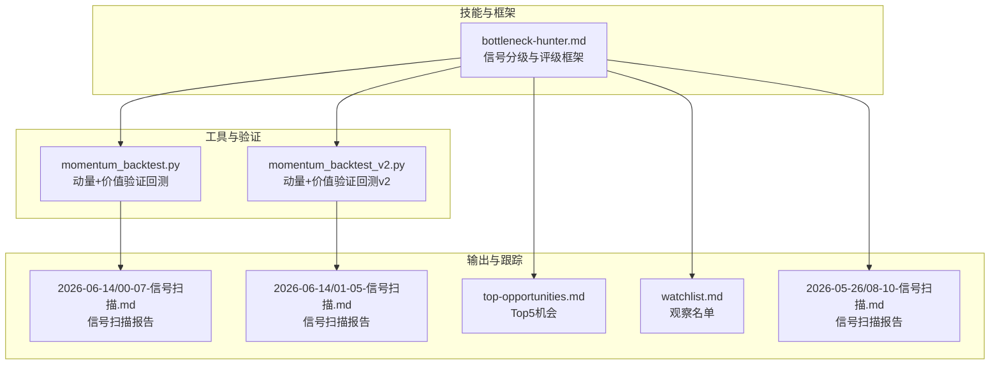
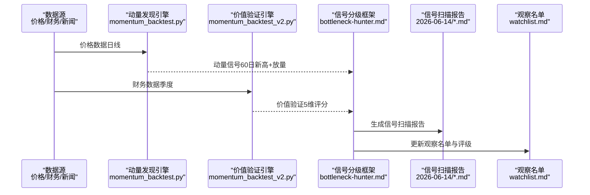
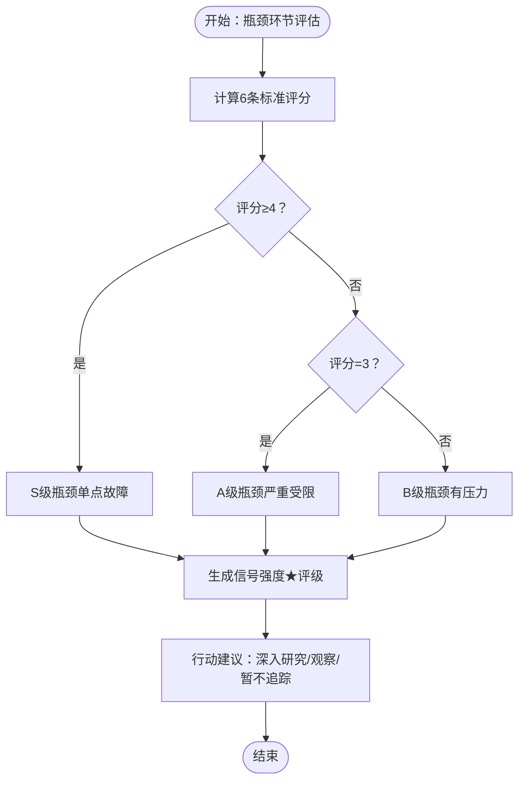
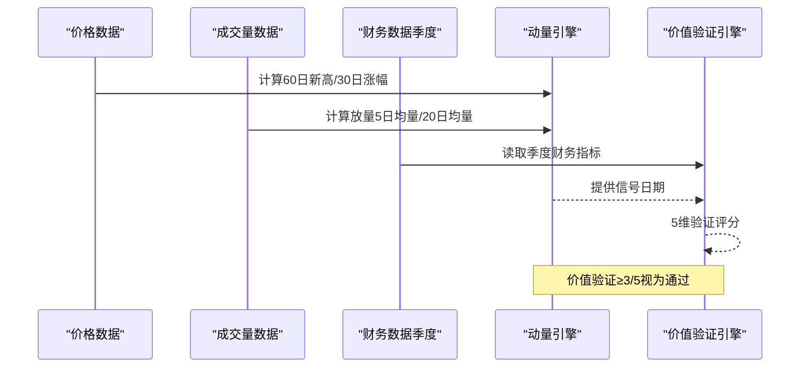
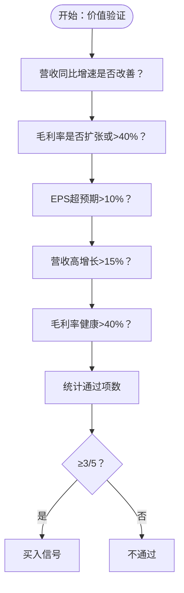
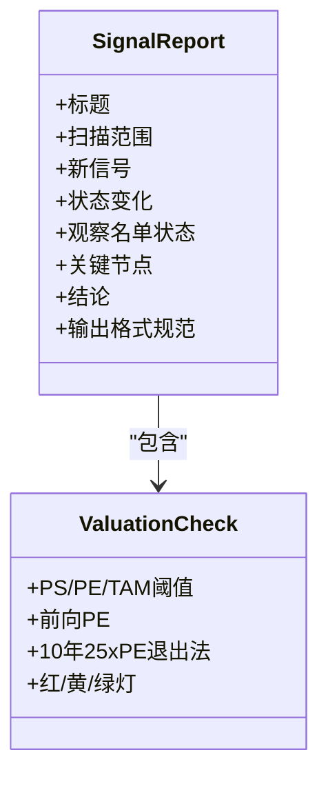
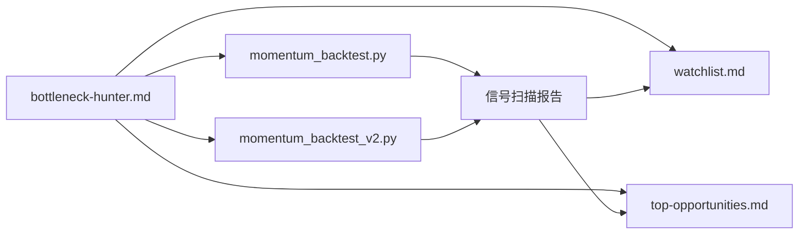

# 信号分级系统

<cite>
**本文档引用的文件**
- [bottleneck-hunter.md](file://skills/bottleneck-hunter.md)
- [momentum_backtest.py](file://tools/momentum_backtest.py)
- [momentum_backtest_v2.py](file://tools/momentum_backtest_v2.py)
- [2026-06-14-00-07-信号扫描.md](file://reports/bottleneck-map/2026-06-14/00-07-信号扫描.md)
- [2026-06-14-01-05-信号扫描.md](file://reports/bottleneck-map/2026-06-14/01-05-信号扫描.md)
- [top-opportunities.md](file://reports/bottleneck-map/top-opportunities.md)
- [watchlist.md](file://reports/bottleneck-map/watchlist.md)
- [2026-05-26-08-10-信号扫描.md](file://reports/bottleneck-map/2026-05-26/08-10-信号扫描.md)
</cite>

## 目录
1. [引言](#引言)
2. [项目结构](#项目结构)
3. [核心组件](#核心组件)
4. [架构概览](#架构概览)
5. [详细组件分析](#详细组件分析)
6. [依赖关系分析](#依赖关系分析)
7. [性能考量](#性能考量)
8. [故障排查指南](#故障排查指南)
9. [结论](#结论)
10. [附录](#附录)

## 引言
本文件系统化梳理“信号分级系统”的技术实现，围绕供应链瓶颈猎手的信号生成、评估与输出机制展开，重点解释以下内容：
- 信号等级划分与判定标准（含独立条件通过机制）
- 价值验证与动量信号的结合逻辑
- 信号强度评级与输出格式规范
- 错误处理与异常情况应对

本系统以“瓶颈”为核心抓手，通过多信源交叉验证、财务与估值检查、时间窗口与催化剂跟踪，形成可执行的信号分级与行动建议。

## 项目结构
本仓库中与信号分级系统直接相关的核心文件分布如下：
- 技能文档：定义信号分级的总体框架、瓶颈判定标准、估值检查与信号强度评级
- 工具脚本：提供动量发现与价值验证的回测框架，作为信号分级的验证手段
- 报告文件：按日生成的信号扫描报告，体现信号强度、评级与行动建议
- 观察名单：持续维护的标的评级与状态变化，体现信号分级的动态演进

**图表来源**
- [bottleneck-hunter.md:1-475](file://skills/bottleneck-hunter.md#L1-L475)
- [momentum_backtest.py:1-361](file://tools/momentum_backtest.py#L1-L361)
- [momentum_backtest_v2.py:1-398](file://tools/momentum_backtest_v2.py#L1-L398)
- [2026-06-14-00-07-信号扫描.md:1-161](file://reports/bottleneck-map/2026-06-14/00-07-信号扫描.md#L1-L161)
- [2026-06-14-01-05-信号扫描.md:1-195](file://reports/bottleneck-map/2026-06-14/01-05-信号扫描.md#L1-L195)
- [top-opportunities.md:1-61](file://reports/bottleneck-map/top-opportunities.md#L1-L61)
- [watchlist.md:1-7657](file://reports/bottleneck-map/watchlist.md#L1-L7657)
- [2026-05-26-08-10-信号扫描.md:1-140](file://reports/bottleneck-map/2026-05-26/08-10-信号扫描.md#L1-L140)

**章节来源**
- [bottleneck-hunter.md:1-475](file://skills/bottleneck-hunter.md#L1-L475)
- [momentum_backtest.py:1-361](file://tools/momentum_backtest.py#L1-L361)
- [momentum_backtest_v2.py:1-398](file://tools/momentum_backtest_v2.py#L1-L398)
- [2026-06-14-00-07-信号扫描.md:1-161](file://reports/bottleneck-map/2026-06-14/00-07-信号扫描.md#L1-L161)
- [2026-06-14-01-05-信号扫描.md:1-195](file://reports/bottleneck-map/2026-06-14/01-05-信号扫描.md#L1-L195)
- [top-opportunities.md:1-61](file://reports/bottleneck-map/top-opportunities.md#L1-L61)
- [watchlist.md:1-7657](file://reports/bottleneck-map/watchlist.md#L1-L7657)
- [2026-05-26-08-10-信号扫描.md:1-140](file://reports/bottleneck-map/2026-05-26/08-10-信号扫描.md#L1-L140)

## 核心组件
- 信号分级框架：定义瓶颈环节的6条判定标准、瓶颈评级（S/A/B）、信号强度（★1-5）与行动建议
- 价值验证引擎：基于季度财务数据的5维验证（营收加速、毛利率扩张、EPS超预期、营收高增长、毛利率健康）
- 动量发现引擎：基于60日新高、放量确认与30日涨幅的动量信号
- 估值检查与安全边际：通过PS、PE、TAM阈值、前向PE等指标进行估值红/黄/绿灯判断
- 输出与跟踪：按日生成信号扫描报告、Top5机会与观察名单，记录状态变化与关键节点

**章节来源**
- [bottleneck-hunter.md:114-153](file://skills/bottleneck-hunter.md#L114-L153)
- [momentum_backtest.py:164-201](file://tools/momentum_backtest.py#L164-L201)
- [momentum_backtest_v2.py:130-159](file://tools/momentum_backtest_v2.py#L130-L159)
- [2026-06-14-00-07-信号扫描.md:40-76](file://reports/bottleneck-map/2026-06-14/00-07-信号扫描.md#L40-L76)
- [2026-06-14-01-05-信号扫描.md:52-78](file://reports/bottleneck-map/2026-06-14/01-05-信号扫描.md#L52-L78)

## 架构概览
信号分级系统由“数据采集与验证”“信号生成与评估”“输出与跟踪”三个层次组成，形成闭环：

**图表来源**
- [momentum_backtest.py:112-146](file://tools/momentum_backtest.py#L112-L146)
- [momentum_backtest_v2.py:92-113](file://tools/momentum_backtest_v2.py#L92-L113)
- [bottleneck-hunter.md:114-153](file://skills/bottleneck-hunter.md#L114-L153)
- [2026-06-14-00-07-信号扫描.md:1-161](file://reports/bottleneck-map/2026-06-14/00-07-信号扫描.md#L1-L161)
- [watchlist.md:1-7657](file://reports/bottleneck-map/watchlist.md#L1-L7657)

## 详细组件分析

### 信号等级划分与判定标准
- 瓶颈判定6条标准（供给集中度、扩产周期、替代难度、产能利用率、需求增速、客户验证周期），评分≥4为S级，3为A级，1-2为B级
- 信号强度（★1-5）由“交叉验证状态+估值判断+催化剂窗口+纯正度”共同决定
- 行动建议：执行深入研究/加入观察/暂不追踪

**图表来源**
- [bottleneck-hunter.md:114-132](file://skills/bottleneck-hunter.md#L114-L132)

**章节来源**
- [bottleneck-hunter.md:114-132](file://skills/bottleneck-hunter.md#L114-L132)

### 价值验证与动量信号结合
- 价值验证（5维）：营收加速、毛利率扩张、EPS超预期、营收高增长、毛利率健康
- 动量信号：60日新高+放量确认+30日涨幅
- 组合逻辑：动量触发后，以价值验证作为买入门槛（≥3/5）

**图表来源**
- [momentum_backtest.py:112-146](file://tools/momentum_backtest.py#L112-L146)
- [momentum_backtest.py:164-201](file://tools/momentum_backtest.py#L164-L201)
- [momentum_backtest_v2.py:92-113](file://tools/momentum_backtest_v2.py#L92-L113)
- [momentum_backtest_v2.py:130-159](file://tools/momentum_backtest_v2.py#L130-L159)

**章节来源**
- [momentum_backtest.py:112-146](file://tools/momentum_backtest.py#L112-L146)
- [momentum_backtest.py:164-201](file://tools/momentum_backtest.py#L164-L201)
- [momentum_backtest_v2.py:92-113](file://tools/momentum_backtest_v2.py#L92-L113)
- [momentum_backtest_v2.py:130-159](file://tools/momentum_backtest_v2.py#L130-L159)

### 独立条件通过机制
- 毛利率连续改善：若前次财务数据存在，则比较当前与前次毛利率；若无前次数据，则要求当前毛利率>40%（芯片行业标准）
- EPS超预期：当前EPS超预期>10%为强信号；对周期股（如MU）建议增加“EPS超预期幅度>30%”作为特殊条件

**图表来源**
- [momentum_backtest.py:164-201](file://tools/momentum_backtest.py#L164-L201)
- [momentum_backtest_v2.py:130-159](file://tools/momentum_backtest_v2.py#L130-L159)

**章节来源**
- [momentum_backtest.py:164-201](file://tools/momentum_backtest.py#L164-L201)
- [momentum_backtest_v2.py:130-159](file://tools/momentum_backtest_v2.py#L130-L159)

### 信号强度评级与输出格式
- 信号强度（★1-5）：多重交叉验证+估值绿灯→★★★★★；大部分验证+估值绿/黄→★★★★；逻辑成立但部分待验证+估值黄→★★★；早期信号或估值红灯→★★；纯概念→★
- 输出格式：标题、扫描范围、新信号、状态变化、观察名单状态、关键节点、结论；报告文件名包含“明确标的代码”或“信号扫描”
- 估值检查：PS、PE、TAM阈值、前向PE、10年25xPE退出法等；红灯/黄灯/绿灯标注

**图表来源**
- [2026-06-14-00-07-信号扫描.md:1-161](file://reports/bottleneck-map/2026-06-14/00-07-信号扫描.md#L1-L161)
- [2026-06-14-01-05-信号扫描.md:52-78](file://reports/bottleneck-map/2026-06-14/01-05-信号扫描.md#L52-L78)

**章节来源**
- [2026-06-14-00-07-信号扫描.md:1-161](file://reports/bottleneck-map/2026-06-14/00-07-信号扫描.md#L1-L161)
- [2026-06-14-01-05-信号扫描.md:52-78](file://reports/bottleneck-map/2026-06-14/01-05-信号扫描.md#L52-L78)

### 观察名单与动态更新
- 持续维护：按日更新状态变化（降级/升级/移除/新增），记录关键节点（如DOE Option 1b截止、WF6停产生效、拆股记录日等）
- 评级与状态：★★★★★/★★★★/★★★/★★/★，并标注“估值透支”“等待财报”“停火状态不稳定”等说明
- Top5机会：综合瓶颈强度、估值安全边际、近期催化剂、纯正度等维度排序

**章节来源**
- [watchlist.md:1-7657](file://reports/bottleneck-map/watchlist.md#L1-L7657)
- [top-opportunities.md:1-61](file://reports/bottleneck-map/top-opportunities.md#L1-L61)

## 依赖关系分析
- 技能框架（bottleneck-hunter.md）为信号分级提供统一标准与流程
- 动量与价值验证工具（momentum_backtest.py/v2）为信号生成提供回测与验证能力
- 报告与观察名单（signals scans、watchlist、top-opportunities）体现系统输出与跟踪
- 数据来源：价格（Yahoo Finance/JSON）、财务（季度数据）、新闻与第三方研究（TrendForce、Digitimes、TipRanks等）

**图表来源**
- [bottleneck-hunter.md:1-475](file://skills/bottleneck-hunter.md#L1-L475)
- [momentum_backtest.py:1-361](file://tools/momentum_backtest.py#L1-L361)
- [momentum_backtest_v2.py:1-398](file://tools/momentum_backtest_v2.py#L1-L398)
- [watchlist.md:1-7657](file://reports/bottleneck-map/watchlist.md#L1-L7657)
- [top-opportunities.md:1-61](file://reports/bottleneck-map/top-opportunities.md#L1-L61)

**章节来源**
- [bottleneck-hunter.md:1-475](file://skills/bottleneck-hunter.md#L1-L475)
- [momentum_backtest.py:1-361](file://tools/momentum_backtest.py#L1-L361)
- [momentum_backtest_v2.py:1-398](file://tools/momentum_backtest_v2.py#L1-L398)
- [watchlist.md:1-7657](file://reports/bottleneck-map/watchlist.md#L1-L7657)
- [top-opportunities.md:1-61](file://reports/bottleneck-map/top-opportunities.md#L1-L61)

## 性能考量
- 数据获取：价格数据通过API/JSON加载，建议设置超时与重试；财务数据采用本地JSON/手动录入，确保稳定性
- 计算复杂度：动量信号扫描为O(N×窗口)，价值验证为O(1)，整体线性可扩展
- 报告生成：按日批量生成，避免重复计算；观察名单采用增量更新，减少IO压力

## 故障排查指南
- 数据获取失败
  - 价格数据：检查URL可达性与User-Agent；设置超时与重试；必要时切换数据源
  - 财务数据：确认季度日期与数据键值匹配；缺失时标记“数据不足”，不臆测填充
- 评分计算异常
  - 毛利率/营收同比/EPS超预期为空：按框架默认阈值处理；对周期股增加特殊条件
  - 估值检查：PS/PE/TAM阈值不满足时，标注“估值透支/偏高/绿灯”，并给出安全边际检验
- 系统错误
  - 日志记录：捕获异常并输出上下文（标的、日期、字段）
  - 回滚与重试：对关键步骤（如报告生成）提供重试与幂等保证
  - 人工复核：对异常信号（如单日暴涨、估值红灯）进行交叉验证与人工复核

**章节来源**
- [momentum_backtest.py:207-218](file://tools/momentum_backtest.py#L207-L218)
- [momentum_backtest_v2.py:71-85](file://tools/momentum_backtest_v2.py#L71-L85)
- [2026-06-14-00-07-信号扫描.md:40-76](file://reports/bottleneck-map/2026-06-14/00-07-信号扫描.md#L40-L76)

## 结论
信号分级系统以“瓶颈”为核心，融合动量与价值验证，通过严格的估值检查与多信源交叉验证，形成可执行的信号强度与行动建议。系统具备清晰的输出格式与持续跟踪机制，适合在高频扫描与深度研究之间建立桥梁，既避免“概念陷阱”，又不放过早期拐点信号。

## 附录
- 信号强度评级对照
  - ★★★★★：多重交叉验证+估值绿灯
  - ★★★★：大部分验证+估值绿/黄
  - ★★★：逻辑成立但部分待验证+估值黄
  - ★★：早期信号或估值红灯
  - ★：纯概念
- 估值检查要点
  - 市值>TAM 20%、PS>30x且增速不足、市值>5年乐观预测10倍等触发“估值透支”
  - 10年25xPE退出法用于安全边际检验

**章节来源**
- [bottleneck-hunter.md:175-202](file://skills/bottleneck-hunter.md#L175-L202)
- [2026-06-14-00-07-信号扫描.md:40-76](file://reports/bottleneck-map/2026-06-14/00-07-信号扫描.md#L40-L76)
- [2026-06-14-01-05-信号扫描.md:52-78](file://reports/bottleneck-map/2026-06-14/01-05-信号扫描.md#L52-L78)