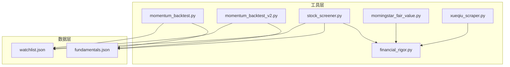
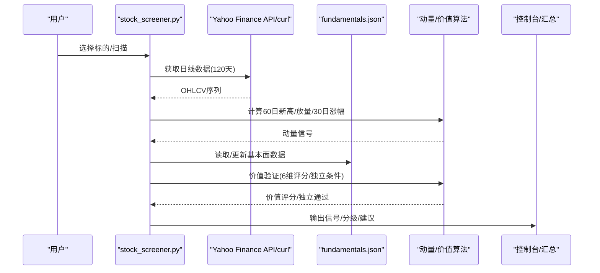
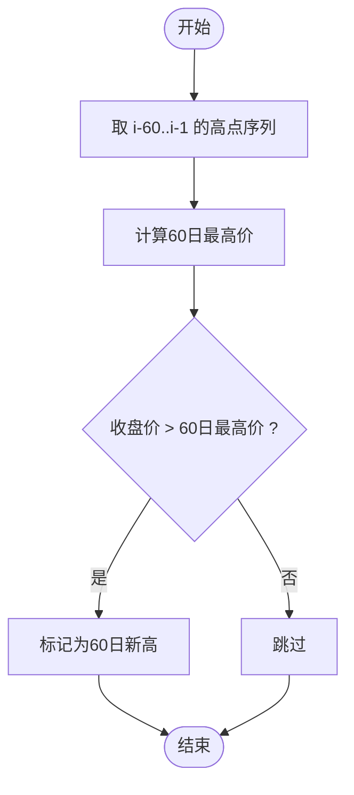
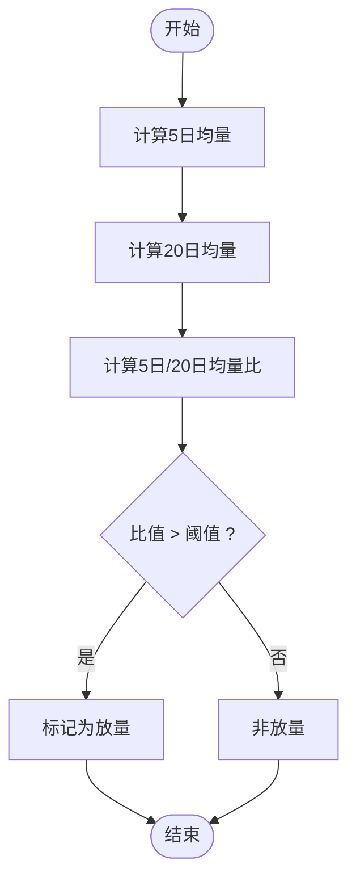
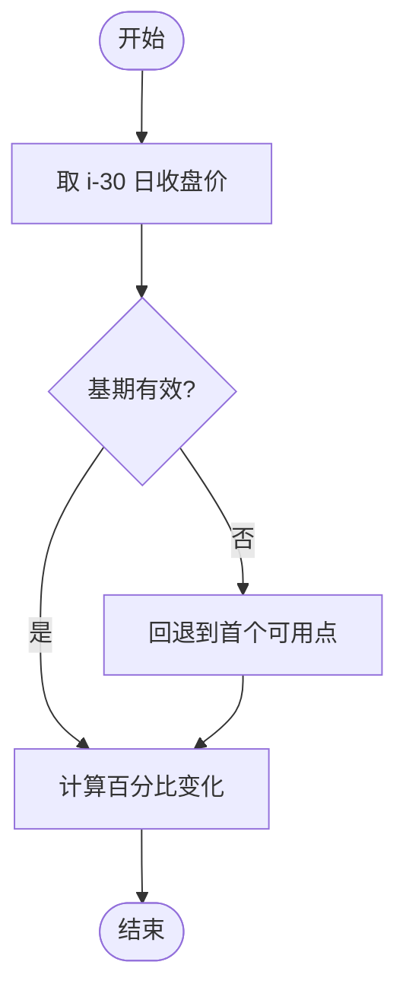
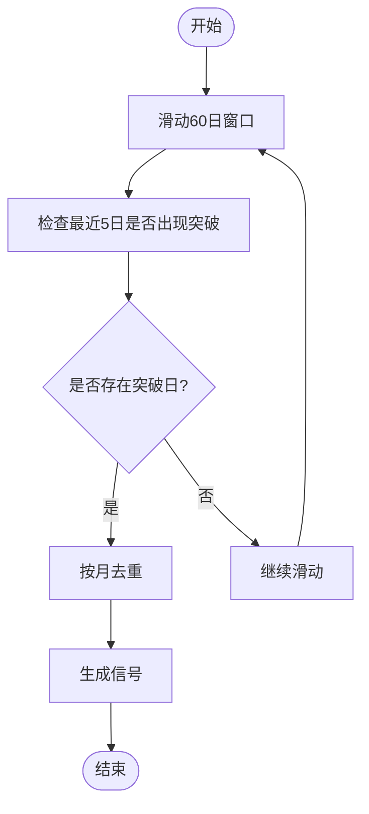
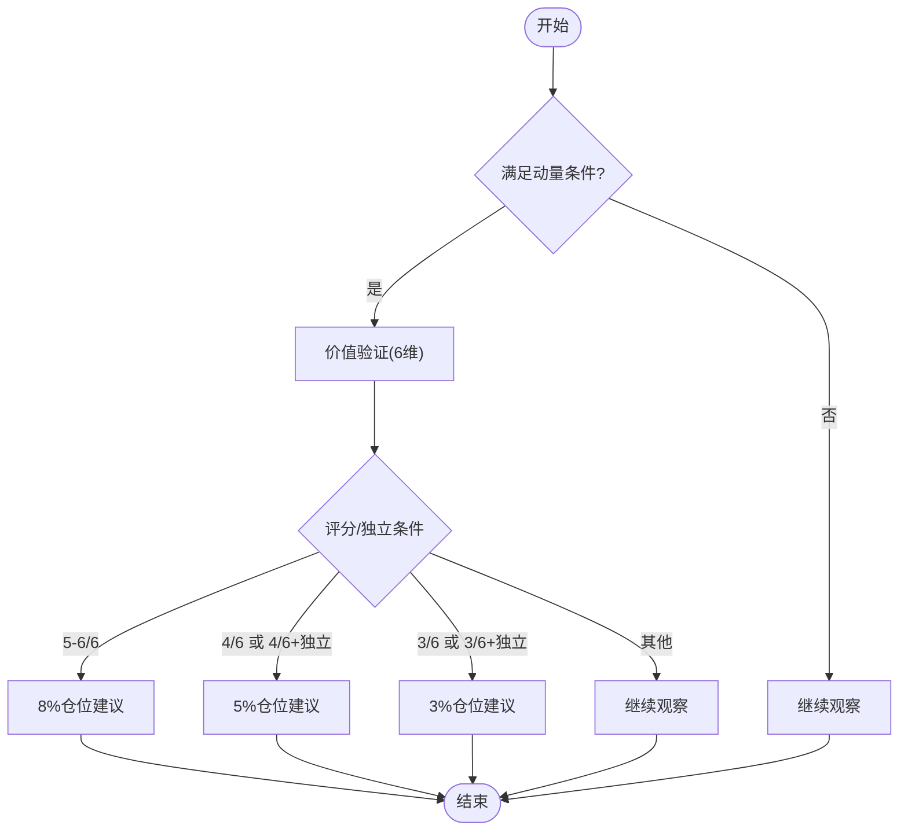
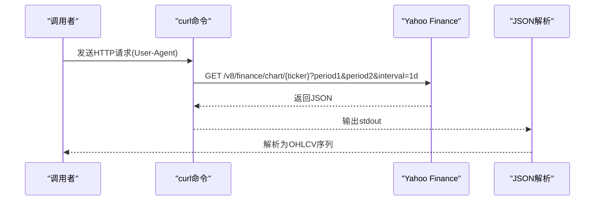
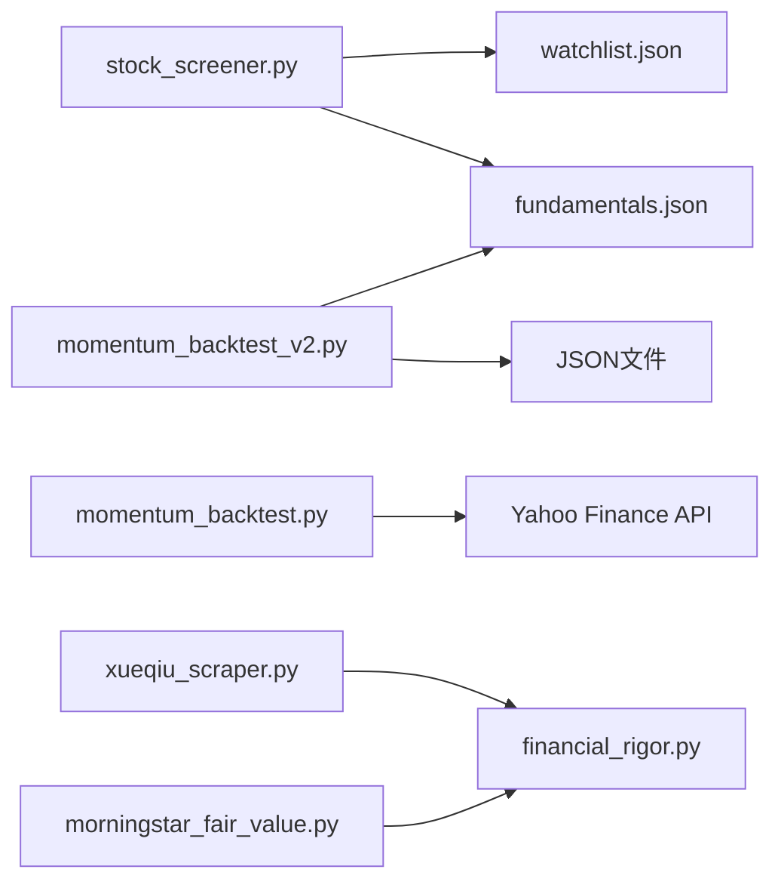

# 动量发现模块

<cite>
**本文引用的文件**
- [momentum_backtest.py](file://tools/momentum_backtest.py)
- [momentum_backtest_v2.py](file://tools/momentum_backtest_v2.py)
- [stock_screener.py](file://tools/stock_screener.py)
- [financial_rigor.py](file://tools/financial_rigor.py)
- [morningstar_fair_value.py](file://tools/morningstar_fair_value.py)
- [xueqiu_scraper.py](file://tools/xueqiu_scraper.py)
- [watchlist.json](file://data/watchlist.json)
- [fundamentals.json](file://data/fundamentals.json)
</cite>

## 目录
1. [简介](#简介)
2. [项目结构](#项目结构)
3. [核心组件](#核心组件)
4. [架构总览](#架构总览)
5. [详细组件分析](#详细组件分析)
6. [依赖关系分析](#依赖关系分析)
7. [性能考量](#性能考量)
8. [故障排查指南](#故障排查指南)
9. [结论](#结论)
10. [附录](#附录)

## 简介
本技术文档围绕“动量发现模块”展开，系统梳理并解释以下关键能力：
- 60日新高检测算法：最高价计算逻辑、时间窗口选择与突破判定标准
- 成交量放量确认机制：短期均量与长期均量的计算方法、放量阈值设定与成交量比率分析
- 30日涨幅计算方法：起始点选择、价格序列处理与百分比变化公式
- 近期突破检测算法：突破日识别、时间窗口滑动与突破信号聚合
- 动量信号触发条件：多因子组合逻辑、信号过滤规则与异常处理机制
- 价格数据获取流程：Yahoo Finance API调用、curl绕过SSL问题的实现与数据解析格式

上述能力在三个核心脚本中得到体现：回测脚本（v1/v2）、实时选股筛（stock_screener.py）以及配套的金融严谨性工具与外部数据抓取工具。

## 项目结构
动量发现模块位于 tools 目录下，配合 data 目录中的 watchlist.json 与 fundamentals.json，形成“数据输入 + 算法实现 + 输出汇总”的闭环。

图表来源
- [momentum_backtest.py:1-361](file://tools/momentum_backtest.py#L1-L361)
- [momentum_backtest_v2.py:1-398](file://tools/momentum_backtest_v2.py#L1-L398)
- [stock_screener.py:1-402](file://tools/stock_screener.py#L1-L402)
- [financial_rigor.py:1-452](file://tools/financial_rigor.py#L1-L452)
- [morningstar_fair_value.py:1-153](file://tools/morningstar_fair_value.py#L1-L153)
- [xueqiu_scraper.py:1-434](file://tools/xueqiu_scraper.py#L1-L434)
- [watchlist.json:1-38](file://data/watchlist.json#L1-L38)
- [fundamentals.json:1-36](file://data/fundamentals.json#L1-L36)

章节来源
- [momentum_backtest.py:1-361](file://tools/momentum_backtest.py#L1-L361)
- [momentum_backtest_v2.py:1-398](file://tools/momentum_backtest_v2.py#L1-L398)
- [stock_screener.py:1-402](file://tools/stock_screener.py#L1-L402)
- [watchlist.json:1-38](file://data/watchlist.json#L1-L38)
- [fundamentals.json:1-36](file://data/fundamentals.json#L1-L36)

## 核心组件
- 价格数据获取与解析
  - Yahoo Finance Chart API（urllib/requests）与 curl 方案（subprocess）
  - 数据解析：时间戳转日期、OHLCV 字段提取与清洗
- 动量信号计算
  - 60日新高检测、成交量放量确认、30日涨幅计算
  - 近期突破检测与信号聚合（按月去重）
- 价值验证与信号分级
  - 多维度评分（营收加速、毛利率扩张、EPS超预期、营收高增长、毛利率健康、独立条件）
  - 信号分级与仓位建议
- 数据与流程支撑
  - watchlist.json 与 fundamentals.json 的组织与读写
  - 金融严谨性工具（精确十进制、多源交叉验证、Benford检测）

章节来源
- [momentum_backtest.py:19-47](file://tools/momentum_backtest.py#L19-L47)
- [momentum_backtest_v2.py:71-85](file://tools/momentum_backtest_v2.py#L71-L85)
- [stock_screener.py:48-78](file://tools/stock_screener.py#L48-L78)
- [stock_screener.py:122-161](file://tools/stock_screener.py#L122-L161)
- [stock_screener.py:167-250](file://tools/stock_screener.py#L167-L250)
- [stock_screener.py:256-277](file://tools/stock_screener.py#L256-L277)
- [watchlist.json:1-38](file://data/watchlist.json#L1-L38)
- [fundamentals.json:1-36](file://data/fundamentals.json#L1-L36)

## 架构总览
动量发现模块的总体流程如下：

图表来源
- [stock_screener.py:283-326](file://tools/stock_screener.py#L283-L326)
- [stock_screener.py:122-161](file://tools/stock_screener.py#L122-L161)
- [stock_screener.py:167-250](file://tools/stock_screener.py#L167-L250)
- [fundamentals.json:1-36](file://data/fundamentals.json#L1-L36)

## 详细组件分析

### 60日新高检测算法
- 窗口选择：以当日收盘价与过去60个交易日的最高价比较，形成“60日新高”判定
- 计算逻辑：遍历 i-60 到 i-1 的高点序列，取最大值并与当日收盘价比较
- 判定标准：收盘价 > 60日最高价即触发
- 时间复杂度：O(60) 每日，整体 O(N) 遍历 OHLCV 序列

图表来源
- [momentum_backtest.py:120-122](file://tools/momentum_backtest.py#L120-L122)
- [momentum_backtest_v2.py:97-98](file://tools/momentum_backtest_v2.py#L97-L98)
- [stock_screener.py:130-132](file://tools/stock_screener.py#L130-L132)

章节来源
- [momentum_backtest.py:120-122](file://tools/momentum_backtest.py#L120-L122)
- [momentum_backtest_v2.py:97-98](file://tools/momentum_backtest_v2.py#L97-L98)
- [stock_screener.py:130-132](file://tools/stock_screener.py#L130-L132)

### 成交量放量确认机制
- 短期均量（5日）：i-4 到 i 的成交量均值
- 长期均量（20日）：i-19 到 i 的成交量均值
- 放量阈值：5日均量 > 20日均量 × 1.5（v2）或 × 1.8（v1）
- 成交量比率：5日均量 / 20日均量，用于信号描述与过滤

图表来源
- [momentum_backtest.py:124-127](file://tools/momentum_backtest.py#L124-L127)
- [momentum_backtest_v2.py:99-101](file://tools/momentum_backtest_v2.py#L99-L101)
- [stock_screener.py:134-138](file://tools/stock_screener.py#L134-L138)

章节来源
- [momentum_backtest.py:124-127](file://tools/momentum_backtest.py#L124-L127)
- [momentum_backtest_v2.py:99-101](file://tools/momentum_backtest_v2.py#L99-L101)
- [stock_screener.py:134-138](file://tools/stock_screener.py#L134-L138)

### 30日涨幅计算方法
- 起始点选择：取 i-30 日的收盘价作为基期
- 价格序列处理：确保序列长度足够（>30），否则回退到首个可用点
- 百分比变化：(当日收盘价 - 30日前收盘价) / 30日前收盘价 × 100%

图表来源
- [momentum_backtest.py:129-131](file://tools/momentum_backtest.py#L129-L131)
- [momentum_backtest_v2.py:102-103](file://tools/momentum_backtest_v2.py#L102-L103)
- [stock_screener.py:140-142](file://tools/stock_screener.py#L140-L142)

章节来源
- [momentum_backtest.py:129-131](file://tools/momentum_backtest.py#L129-L131)
- [momentum_backtest_v2.py:102-103](file://tools/momentum_backtest_v2.py#L102-L103)
- [stock_screener.py:140-142](file://tools/stock_screener.py#L140-L142)

### 近期突破检测算法
- 突破日识别：在最近5个交易日中，若某日收盘价大于该日60日窗口内的最高价，则视为“近期突破日”
- 时间窗口滑动：以固定长度窗口（60日）在OHLCV序列上滑动
- 突破信号聚合：按月去重，同一自然月仅保留首个信号，避免重复

图表来源
- [momentum_backtest.py:144-145](file://tools/momentum_backtest.py#L144-L145)
- [momentum_backtest_v2.py:105-111](file://tools/momentum_backtest_v2.py#L105-L111)
- [stock_screener.py:144-149](file://tools/stock_screener.py#L144-L149)

章节来源
- [momentum_backtest.py:144-145](file://tools/momentum_backtest.py#L144-L145)
- [momentum_backtest_v2.py:105-111](file://tools/momentum_backtest_v2.py#L105-L111)
- [stock_screener.py:144-149](file://tools/stock_screener.py#L144-L149)

### 动量信号触发条件与信号分级
- 触发条件（v1）：60日新高 且 放量
- 触发条件（v2）：60日新高 或 近期突破日 且 放量
- 价值验证（6维评分）：
  - 营收加速（同比增速改善）
  - 毛利率扩张（>45%或环比改善）
  - EPS超预期 > 10%
  - 营收高增长 > 15%
  - 毛利率健康 > 40%
  - 独立通过条件：毛利率连续2季改善或EPS超预期>30%（周期股）
- 信号分级：
  - 5-6/6：确信仓（8%）
  - 4/6 或 4/6+独立通过：标准仓（5%）
  - 3/6 或 3/6+独立通过：试探仓（3%）
  - 其他：继续观察

图表来源
- [momentum_backtest.py:133-134](file://tools/momentum_backtest.py#L133-L134)
- [momentum_backtest_v2.py:105-106](file://tools/momentum_backtest_v2.py#L105-L106)
- [stock_screener.py:167-250](file://tools/stock_screener.py#L167-L250)
- [stock_screener.py:256-277](file://tools/stock_screener.py#L256-L277)

章节来源
- [momentum_backtest.py:133-134](file://tools/momentum_backtest.py#L133-L134)
- [momentum_backtest_v2.py:105-106](file://tools/momentum_backtest_v2.py#L105-L106)
- [stock_screener.py:167-250](file://tools/stock_screener.py#L167-L250)
- [stock_screener.py:256-277](file://tools/stock_screener.py#L256-L277)

### 价格数据获取流程
- Yahoo Finance Chart API
  - v1：urllib.Request + timeout + JSON解析
  - v2：curl subprocess + JSON解析
- curl绕过SSL问题
  - 使用 curl 命令行工具，设置 User-Agent 请求头，避免Python SSL兼容性问题
- 数据解析格式
  - 时间戳转日期字符串
  - 提取 close/high/volume 等字段，过滤缺失值

图表来源
- [momentum_backtest.py:19-47](file://tools/momentum_backtest.py#L19-L47)
- [momentum_backtest_v2.py:71-85](file://tools/momentum_backtest_v2.py#L71-L85)
- [stock_screener.py:48-78](file://tools/stock_screener.py#L48-L78)

章节来源
- [momentum_backtest.py:19-47](file://tools/momentum_backtest.py#L19-L47)
- [momentum_backtest_v2.py:71-85](file://tools/momentum_backtest_v2.py#L71-L85)
- [stock_screener.py:48-78](file://tools/stock_screener.py#L48-L78)

## 依赖关系分析
- 内部依赖
  - stock_screener.py 依赖 fundamentals.json 与 watchlist.json
  - momentum_backtest.py/v2.py 依赖 Yahoo Finance API 或 JSON文件（v2）
- 外部依赖
  - Python 标准库（datetime、json、subprocess、collections）
  - curl 命令（用于绕过Python SSL问题）
  - requests/urllib（v1版本）
- 数据依赖
  - fundamentals.json：季度财务数据（rev_yoy/gm/eps_beat）
  - watchlist.json：标的池

图表来源
- [stock_screener.py:31-42](file://tools/stock_screener.py#L31-L42)
- [momentum_backtest.py:19-47](file://tools/momentum_backtest.py#L19-L47)
- [momentum_backtest_v2.py:71-85](file://tools/momentum_backtest_v2.py#L71-L85)
- [morningstar_fair_value.py:31-37](file://tools/morningstar_fair_value.py#L31-L37)
- [xueqiu_scraper.py:103-108](file://tools/xueqiu_scraper.py#L103-L108)

章节来源
- [stock_screener.py:31-42](file://tools/stock_screener.py#L31-L42)
- [momentum_backtest.py:19-47](file://tools/momentum_backtest.py#L19-L47)
- [momentum_backtest_v2.py:71-85](file://tools/momentum_backtest_v2.py#L71-L85)
- [morningstar_fair_value.py:31-37](file://tools/morningstar_fair_value.py#L31-L37)
- [xueqiu_scraper.py:103-108](file://tools/xueqiu_scraper.py#L103-L108)

## 性能考量
- 时间复杂度
  - 动量信号扫描：O(N) × O(60) ≈ O(N)，N为交易日数量
  - 价值验证：O(1) 每信号，按月去重后信号数远小于N
- I/O与网络
  - Yahoo Finance API：单次请求耗时受网络与超时限制影响
  - curl 方案：避免Python SSL问题，稳定性更好
- 内存占用
  - OHLCV序列一次性加载，内存与N线性相关
  - 信号聚合阶段仅保留关键字段，降低内存压力

## 故障排查指南
- Yahoo Finance API不可用
  - 现象：返回空或异常
  - 处理：切换到 curl 方案；检查网络与User-Agent；必要时使用JSON文件回测
- SSL证书问题
  - 现象：Python urllib抛出SSL错误
  - 处理：改用 curl 命令行工具；确保系统安装curl
- 数据缺失
  - 现象：close/volume/high为空
  - 处理：过滤无效行；检查API返回结构；必要时人工补全
- 价值验证无数据
  - 现象：fundamentals.json中无对应季度数据
  - 处理：使用 --update 更新基本面数据；确保日期格式正确

章节来源
- [momentum_backtest.py:45-47](file://tools/momentum_backtest.py#L45-L47)
- [stock_screener.py:285-289](file://tools/stock_screener.py#L285-L289)
- [stock_screener.py:98-116](file://tools/stock_screener.py#L98-L116)

## 结论
动量发现模块通过“60日新高 + 成交量放量 + 30日涨幅”的多因子组合，结合“近期突破检测”与“价值验证”，实现了对AI芯片等高波动板块的早期捕捉。v2版本在保持算法稳健的同时，引入了更灵活的触发条件与独立通过条件，提升了对周期性公司（如美光科技）的敏感度。配合金融严谨性工具与外部数据抓取工具，模块具备可复现、可验证、可扩展的工程化能力。

## 附录
- 基础设施与工具
  - 金融严谨性工具：精确十进制、多源交叉验证、Benford检测
  - Morningstar公允价值筛选：潜在涨幅Top100
  - 雪球爬虫：用户时间线遍历与断点续爬
- 数据文件
  - watchlist.json：标的池
  - fundamentals.json：季度财务数据

章节来源
- [financial_rigor.py:1-452](file://tools/financial_rigor.py#L1-L452)
- [morningstar_fair_value.py:1-153](file://tools/morningstar_fair_value.py#L1-L153)
- [xueqiu_scraper.py:1-434](file://tools/xueqiu_scraper.py#L1-L434)
- [watchlist.json:1-38](file://data/watchlist.json#L1-L38)
- [fundamentals.json:1-36](file://data/fundamentals.json#L1-L36)