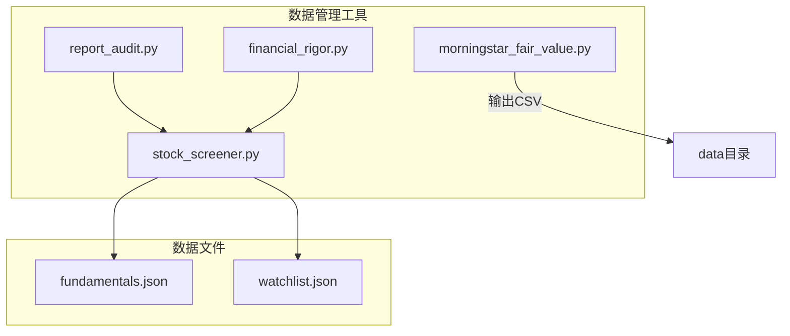
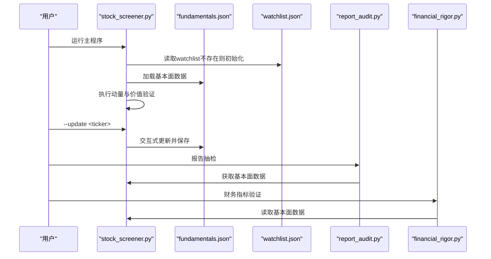
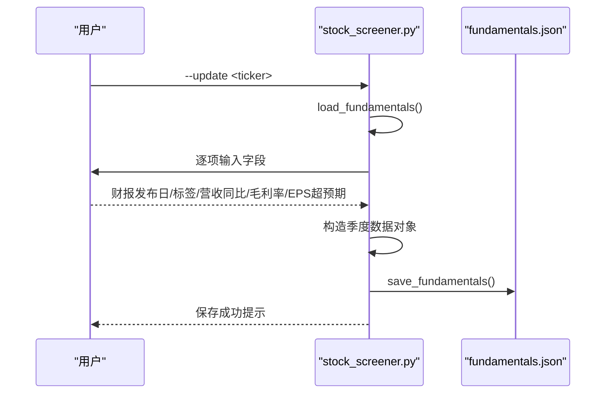
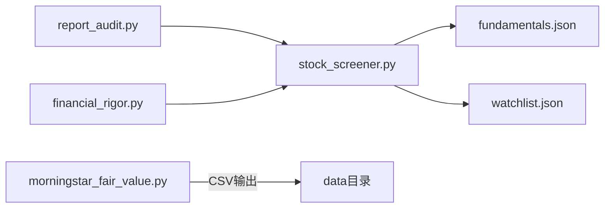

# 数据管理系统

<cite>
**本文档引用的文件**
- [stock_screener.py](file://tools/stock_screener.py)
- [fundamentals.json](file://data/fundamentals.json)
- [watchlist.json](file://data/watchlist.json)
- [financial_rigor.py](file://tools/financial_rigor.py)
- [report_audit.py](file://tools/report_audit.py)
- [morningstar_fair_value.py](file://tools/morningstar_fair_value.py)
</cite>

## 目录
1. [简介](#简介)
2. [项目结构](#项目结构)
3. [核心组件](#核心组件)
4. [架构概览](#架构概览)
5. [详细组件分析](#详细组件分析)
6. [依赖分析](#依赖分析)
7. [性能考量](#性能考量)
8. [故障排查指南](#故障排查指南)
9. [结论](#结论)
10. [附录](#附录)

## 简介
本文件面向“数据管理系统”的技术文档，围绕基本面数据存储结构、文件管理机制、交互式更新流程、数据验证与完整性检查、默认watchlist配置、备份与恢复机制以及数据迁移与版本管理进行系统化说明。目标是帮助使用者与维护者理解数据文件格式、读写流程、验证策略与最佳实践，确保数据一致性与可追溯性。

## 项目结构
数据管理相关的核心文件位于 tools 与 data 目录：
- tools/stock_screener.py：负责动量发现与价值验证的主程序，包含基本面数据的加载、保存与交互式更新，以及默认watchlist初始化。
- data/fundamentals.json：存储个股季度基本面数据的JSON文件。
- data/watchlist.json：存储分组化的观察标的列表，默认watchlist由程序自动创建。
- tools/financial_rigor.py：提供财务数据精确性验证工具（市场容量、估值指标、多源交叉验证、Benford检验）。
- tools/report_audit.py：研究报告数据抽检与判定工具，支持抽样、比对与准出/打回判决。
- tools/morningstar_fair_value.py：从Morningstar筛选器抓取公允价值估计并输出Top100，作为外部数据源补充。

图表来源
- [stock_screener.py:31-42](file://tools/stock_screener.py#L31-L42)
- [stock_screener.py:84-116](file://tools/stock_screener.py#L84-L116)
- [stock_screener.py:341-347](file://tools/stock_screener.py#L341-L347)
- [morningstar_fair_value.py:120-135](file://tools/morningstar_fair_value.py#L120-L135)

章节来源
- [stock_screener.py:1-402](file://tools/stock_screener.py#L1-L402)
- [fundamentals.json:1-36](file://data/fundamentals.json#L1-L36)
- [watchlist.json:1-38](file://data/watchlist.json#L1-L38)

## 核心组件
- 基本面数据管理模块：提供加载、保存与交互式更新功能，支撑动量与价值验证流程。
- 默认watchlist初始化：首次运行时自动生成watchlist.json，便于批量扫描。
- 数据验证与一致性：通过财务精确计算、多源交叉验证与抽检判决保障数据质量。
- 外部数据源集成：Morningstar公允价值筛选作为补充数据源，辅助识别潜在机会。

章节来源
- [stock_screener.py:84-116](file://tools/stock_screener.py#L84-L116)
- [stock_screener.py:341-347](file://tools/stock_screener.py#L341-L347)
- [financial_rigor.py:167-204](file://tools/financial_rigor.py#L167-L204)
- [report_audit.py:261-398](file://tools/report_audit.py#L261-L398)
- [morningstar_fair_value.py:47-153](file://tools/morningstar_fair_value.py#L47-L153)

## 架构概览
系统采用“文件为中心”的轻量架构：核心逻辑集中在 stock_screener.py，通过JSON文件承载数据；外部工具提供数据增强与验证能力。

图表来源
- [stock_screener.py:332-398](file://tools/stock_screener.py#L332-L398)
- [stock_screener.py:98-116](file://tools/stock_screener.py#L98-L116)
- [report_audit.py:405-522](file://tools/report_audit.py#L405-L522)
- [financial_rigor.py:167-204](file://tools/financial_rigor.py#L167-L204)

## 详细组件分析

### JSON数据存储结构与字段定义
- fundamentals.json
  - 结构：以股票代码为根键，包含 quarters 字典，键为财报发布日期（YYYY-MM-DD），值为该季度的指标对象。
  - 指标字段：
    - label：季度标签（如“FY23Q4(Jan23)”、“Q1 2024”等）
    - rev_yoy：营收同比增长率（百分比）
    - gm：毛利率（百分比）
    - eps_beat：EPS超预期幅度（百分比）
  - 嵌套层级：顶层为股票代码 → quarters → 日期 → 指标对象
  - 示例参考：[fundamentals.json:2-35](file://data/fundamentals.json#L2-L35)

- watchlist.json
  - 结构：分组化的标的数组，键为分组名（如 us_ai_chip、us_ai_app 等），值为该组的股票代码列表。
  - 代码格式：
    - 美股：大写字母与数字（如 “NVDA”，“AMD”）
    - 港股：带“.HK”后缀（如 “0700.HK”，“9888.HK”）
  - 默认分组：us_ai_chip、us_ai_app、us_ai_infra、us_crypto、hk_internet、a_share（预留）
  - 示例参考：[watchlist.json:2-37](file://data/watchlist.json#L2-L37)

章节来源
- [fundamentals.json:1-36](file://data/fundamentals.json#L1-L36)
- [watchlist.json:1-38](file://data/watchlist.json#L1-L38)
- [stock_screener.py:35-42](file://tools/stock_screener.py#L35-L42)

### 数据文件管理机制
- fundamentals.json
  - 创建与读取：load_fundamentals() 在文件存在时读取，否则返回空字典。
  - 更新与保存：save_fundamentals() 将内存数据写回文件，确保目录存在。
  - 参考路径：[stock_screener.py:84-96](file://tools/stock_screener.py#L84-L96)

- watchlist.json
  - 初始化：首次运行若文件不存在，则以 DEFAULT_WATCHLIST 写入。
  - 扫描范围：若未传参，从watchlist.json读取所有分组并合并为扫描列表。
  - 参考路径：[stock_screener.py:341-357](file://tools/stock_screener.py#L341-L357)

章节来源
- [stock_screener.py:84-96](file://tools/stock_screener.py#L84-L96)
- [stock_screener.py:341-357](file://tools/stock_screener.py#L341-L357)

### 交互式数据更新流程
- update_fundamental_interactive(ticker)
  - 输入：用户逐项输入财报发布日、季度标签、营收同比、毛利率、EPS超预期。
  - 处理：若股票键不存在则新建；将新季度数据写入 quarters 字典。
  - 持久化：调用 save_fundamentals() 写回文件。
  - 参考路径：[stock_screener.py:98-116](file://tools/stock_screener.py#L98-L116)

图表来源
- [stock_screener.py:98-116](file://tools/stock_screener.py#L98-L116)
- [stock_screener.py:84-96](file://tools/stock_screener.py#L84-L96)

章节来源
- [stock_screener.py:98-116](file://tools/stock_screener.py#L98-L116)

### 数据验证与完整性检查
- 财务精确计算（financial_rigor.py）
  - 市值验算：基于股价×总股本与报告市值的偏差阈值判断。
  - 估值指标：PS、P/FCF、股息率等指标的精确十进制计算。
  - 多源交叉验证：对同一字段在多个来源间比较，给出共识值与偏差。
  - Benford检验：快速筛查财务数据异常。
  - 参考路径：[financial_rigor.py:67-91](file://tools/financial_rigor.py#L67-L91)，[financial_rigor.py:167-204](file://tools/financial_rigor.py#L167-L204)，[financial_rigor.py:214-255](file://tools/financial_rigor.py#L214-L255)

- 报告抽检与判决（report_audit.py）
  - 抽样抽取：从报告文本中提取数据点并随机抽样。
  - 比对与判定：支持主/副来源比对，按阈值输出通过/警告/不通过。
  - 参考路径：[report_audit.py:405-522](file://tools/report_audit.py#L405-L522)，[report_audit.py:261-398](file://tools/report_audit.py#L261-L398)

- 基本面数据完整性（stock_screener.py）
  - 文件存在性：读取前检查文件是否存在，不存在返回空字典。
  - 数据格式校验：quarters键存在性与字段完整性由调用侧逻辑保证。
  - 异常处理：价格数据获取失败时返回None，避免阻断主流程。
  - 参考路径：[stock_screener.py:84-96](file://tools/stock_screener.py#L84-L96)，[stock_screener.py:285-290](file://tools/stock_screener.py#L285-L290)

章节来源
- [financial_rigor.py:67-91](file://tools/financial_rigor.py#L67-L91)
- [financial_rigor.py:167-204](file://tools/financial_rigor.py#L167-L204)
- [financial_rigor.py:214-255](file://tools/financial_rigor.py#L214-L255)
- [report_audit.py:405-522](file://tools/report_audit.py#L405-L522)
- [report_audit.py:261-398](file://tools/report_audit.py#L261-L398)
- [stock_screener.py:84-96](file://tools/stock_screener.py#L84-L96)
- [stock_screener.py:285-290](file://tools/stock_screener.py#L285-L290)

### 默认watchlist配置
- 预定义分组与标的
  - us_ai_chip：NVDA、AMD、MU、AVGO、MRVL、TSM
  - us_ai_app：GOOG、META、MSFT、AMZN、CRM、NOW、PLTR
  - us_ai_infra：ETN、PWR、VRT、CRWV
  - us_crypto：COIN、HOOD、MSTR、CRCL
  - hk_internet：0700.HK、9888.HK、1024.HK、9992.HK
  - a_share：预留为空，后续扩展A股数据源
- 数据源兼容性
  - 美股与港股代码格式不同，需在watchlist中区分。
  - A股预留字段，后续接入不同数据源。
- 初始化逻辑：首次运行若watchlist.json不存在，自动写入默认配置。
- 参考路径：[stock_screener.py:35-42](file://tools/stock_screener.py#L35-L42)，[stock_screener.py:341-347](file://tools/stock_screener.py#L341-L347)

章节来源
- [stock_screener.py:35-42](file://tools/stock_screener.py#L35-L42)
- [stock_screener.py:341-347](file://tools/stock_screener.py#L341-L347)

### 备份与恢复机制
- 文件写入保护
  - 目录创建：保存前确保数据目录存在，避免IO异常。
  - 参考路径：[stock_screener.py:93-95](file://tools/stock_screener.py#L93-L95)
- 错误回滚与一致性
  - 当前实现未提供原子写入与自动回滚；建议在生产环境增加：
    - 写入前备份原文件
    - 使用临时文件写入后原子替换
    - 异常捕获与回滚
  - 本节为通用建议，非现有实现内容。
- 数据一致性保证
  - 通过严格的字段校验与阈值控制（如财务验证工具）提升一致性。
  - 参考路径：[financial_rigor.py:67-91](file://tools/financial_rigor.py#L67-L91)，[report_audit.py:315-350](file://tools/report_audit.py#L315-L350)

章节来源
- [stock_screener.py:93-95](file://tools/stock_screener.py#L93-L95)
- [financial_rigor.py:67-91](file://tools/financial_rigor.py#L67-L91)
- [report_audit.py:315-350](file://tools/report_audit.py#L315-L350)

### 数据迁移与版本管理
- 当前版本
  - fundamentals.json 采用“日期键+指标对象”的扁平嵌套结构，字段稳定。
  - watchlist.json 采用“分组→代码列表”的结构，便于扩展。
- 迁移建议
  - 字段新增：在指标对象中添加新字段，旧版本读取时忽略未知字段。
  - 结构变更：若改变quarters键或顶层结构，需提供迁移脚本：
    - 读取旧格式
    - 转换为新格式
    - 写回新文件
    - 删除旧文件
  - 版本标识：可在文件头部加入版本号字段，便于自动识别与迁移。
- 参考路径：[fundamentals.json:1-36](file://data/fundamentals.json#L1-L36)，[watchlist.json:1-38](file://data/watchlist.json#L1-L38)

章节来源
- [fundamentals.json:1-36](file://data/fundamentals.json#L1-L36)
- [watchlist.json:1-38](file://data/watchlist.json#L1-L38)

## 依赖分析
- 组件耦合
  - stock_screener.py 依赖 data 目录下的 JSON 文件，耦合度低，便于独立维护。
  - financial_rigor.py 与 report_audit.py 作为独立工具，可与主流程解耦协作。
  - morningstar_fair_value.py 作为外部数据源补充，不影响核心数据文件。
- 外部依赖
  - curl：用于获取价格数据与Morningstar筛选器数据。
  - Python 标准库：json、decimal、argparse、subprocess、os、sys、datetime 等。

图表来源
- [stock_screener.py:31-33](file://tools/stock_screener.py#L31-L33)
- [report_audit.py:405-522](file://tools/report_audit.py#L405-L522)
- [financial_rigor.py:18-22](file://tools/financial_rigor.py#L18-L22)
- [morningstar_fair_value.py:33-37](file://tools/morningstar_fair_value.py#L33-L37)

章节来源
- [stock_screener.py:31-33](file://tools/stock_screener.py#L31-L33)
- [report_audit.py:405-522](file://tools/report_audit.py#L405-L522)
- [financial_rigor.py:18-22](file://tools/financial_rigor.py#L18-L22)
- [morningstar_fair_value.py:33-37](file://tools/morningstar_fair_value.py#L33-L37)

## 性能考量
- IO性能
  - JSON读写为本地文件操作，性能主要受磁盘吞吐影响。
  - 建议：批量扫描时尽量减少重复读取，缓存已加载数据。
- 网络请求
  - Yahoo Finance 与 Morningstar API 请求受网络与服务端限速影响。
  - 建议：合理设置超时与重试，避免长时间阻塞。
- 计算复杂度
  - 基本面评分与动量检测为线性扫描，复杂度 O(n)。
  - 多源交叉验证与Benford检验在数据量较大时需注意时间成本。

## 故障排查指南
- 文件不存在
  - 现象：首次运行未生成 watchlist.json 或 fundamentals.json。
  - 处理：确认 DATA_DIR 路径可写，程序会在必要时自动创建。
  - 参考路径：[stock_screener.py:341-347](file://tools/stock_screener.py#L341-L347)，[stock_screener.py:84-96](file://tools/stock_screener.py#L84-L96)

- 价格数据获取失败
  - 现象：无法获取日线数据导致动量信号缺失。
  - 处理：检查网络连接与curl可用性，适当延长超时。
  - 参考路径：[stock_screener.py:48-78](file://tools/stock_screener.py#L48-L78)

- 数据格式异常
  - 现象：字段缺失或类型不匹配导致评分异常。
  - 处理：使用财务验证工具与抽检工具进行交叉核验。
  - 参考路径：[financial_rigor.py:167-204](file://tools/financial_rigor.py#L167-L204)，[report_audit.py:261-398](file://tools/report_audit.py#L261-L398)

- 交互式更新失败
  - 现象：输入非数值导致保存失败。
  - 处理：确保输入为有效数字，或在前端增加输入校验。
  - 参考路径：[stock_screener.py:98-116](file://tools/stock_screener.py#L98-L116)

章节来源
- [stock_screener.py:341-347](file://tools/stock_screener.py#L341-L347)
- [stock_screener.py:84-96](file://tools/stock_screener.py#L84-L96)
- [stock_screener.py:48-78](file://tools/stock_screener.py#L48-L78)
- [stock_screener.py:98-116](file://tools/stock_screener.py#L98-L116)
- [financial_rigor.py:167-204](file://tools/financial_rigor.py#L167-L204)
- [report_audit.py:261-398](file://tools/report_audit.py#L261-L398)

## 结论
本数据管理系统以轻量的JSON文件为核心，结合命令行工具实现了从数据采集、存储、验证到输出的闭环。通过默认watchlist与交互式更新，系统具备良好的可扩展性与可维护性。建议在生产环境中引入原子写入、备份与回滚机制，并制定字段与结构迁移策略，以进一步提升数据一致性与长期稳定性。

## 附录
- 常用命令
  - 运行主程序：python3 tools/stock_screener.py
  - 扫描指定标的：python3 tools/stock_screener.py NVDA TSLA GOOG
  - 交互式更新：python3 tools/stock_screener.py --update MU
  - 财务验证：python3 tools/financial_rigor.py verify-market-cap --price 510 --shares 9.11e9 --reported 4.65e12 --currency HKD
  - 报告抽检：python3 tools/report_audit.py extract --report reports/腾讯/腾讯-research-20260408.md
  - Morningstar筛选：python3 tools/morningstar_fair_value.py