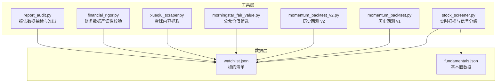
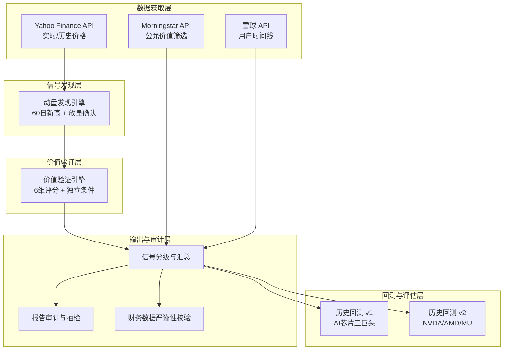
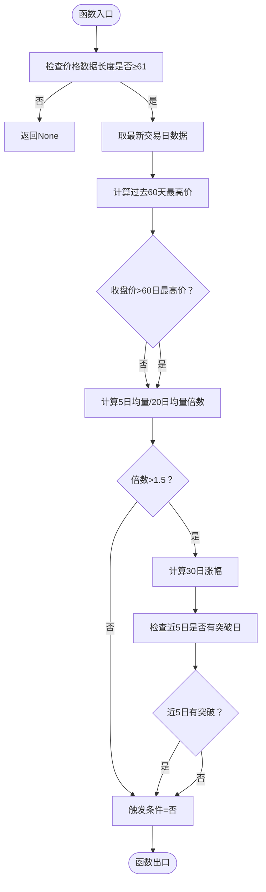
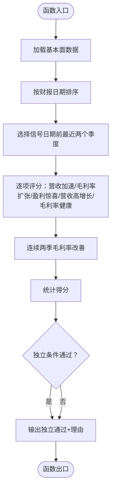
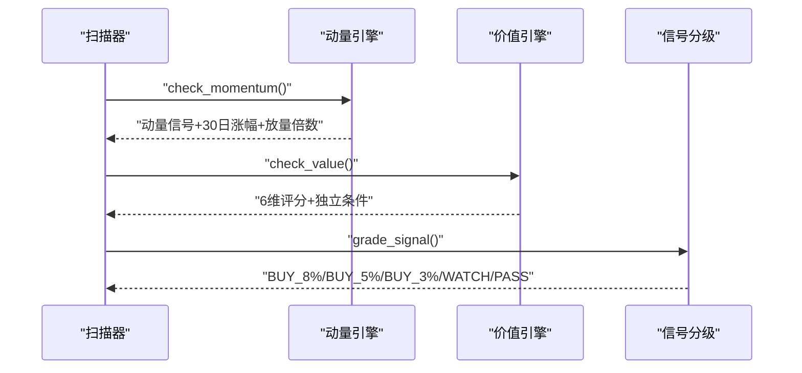
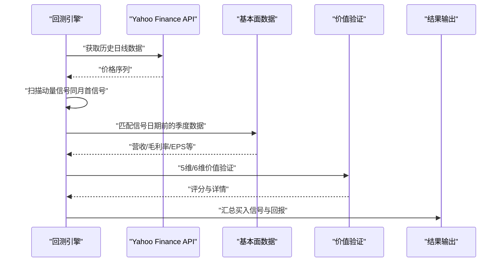
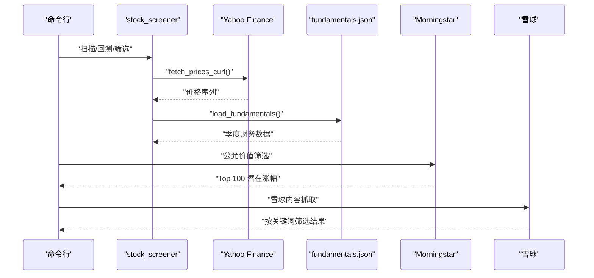
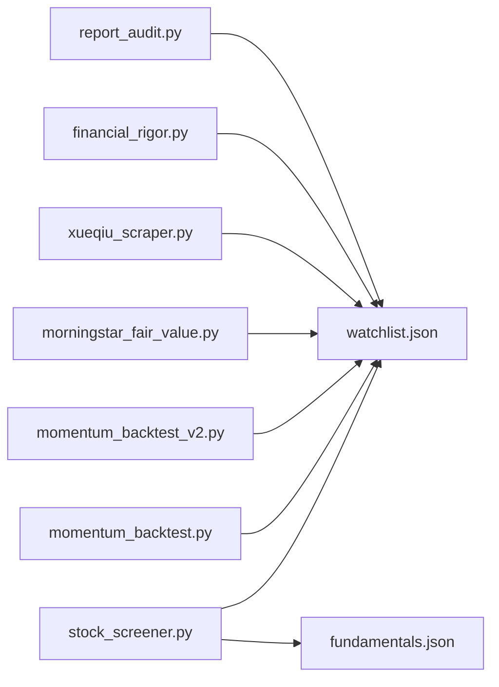

# 选股筛选工具

<cite>
**本文档引用的文件**
- [stock_screener.py](file://tools/stock_screener.py)
- [momentum_backtest.py](file://tools/momentum_backtest.py)
- [momentum_backtest_v2.py](file://tools/momentum_backtest_v2.py)
- [morningstar_fair_value.py](file://tools/morningstar_fair_value.py)
- [xueqiu_scraper.py](file://tools/xueqiu_scraper.py)
- [financial_rigor.py](file://tools/financial_rigor.py)
- [report_audit.py](file://tools/report_audit.py)
- [watchlist.json](file://data/watchlist.json)
- [fundamentals.json](file://data/fundamentals.json)
</cite>

## 目录
1. [简介](#简介)
2. [项目结构](#项目结构)
3. [核心组件](#核心组件)
4. [架构概览](#架构概览)
5. [详细组件分析](#详细组件分析)
6. [依赖关系分析](#依赖关系分析)
7. [性能考虑](#性能考虑)
8. [故障排查指南](#故障排查指南)
9. [结论](#结论)
10. [附录](#附录)

## 简介
本项目提供一套完整的“动量发现 + 价值验证”选股筛选工具链，覆盖实时扫描、历史回测、价值评分、公允价值筛选、数据严谨性校验与报告审计等环节。工具以模块化设计实现，支持多因子综合评分、信号分级、回测验证与风险控制，并提供灵活的筛选条件配置与实时数据获取流程。

## 项目结构
项目采用“工具 + 数据”的组织方式，核心工具位于 tools/ 目录，基础数据位于 data/ 目录，报告与研究资料位于 reports/ 目录，辅助技能脚本位于 skills/ 目录。

图表来源
- [stock_screener.py:1-402](file://tools/stock_screener.py#L1-L402)
- [momentum_backtest.py:1-361](file://tools/momentum_backtest.py#L1-L361)
- [momentum_backtest_v2.py:1-398](file://tools/momentum_backtest_v2.py#L1-L398)
- [morningstar_fair_value.py:1-153](file://tools/morningstar_fair_value.py#L1-L153)
- [xueqiu_scraper.py:1-434](file://tools/xueqiu_scraper.py#L1-L434)
- [financial_rigor.py:1-452](file://tools/financial_rigor.py#L1-L452)
- [report_audit.py:1-523](file://tools/report_audit.py#L1-L523)
- [watchlist.json:1-38](file://data/watchlist.json#L1-L38)
- [fundamentals.json:1-36](file://data/fundamentals.json#L1-L36)

章节来源
- [stock_screener.py:1-402](file://tools/stock_screener.py#L1-L402)
- [watchlist.json:1-38](file://data/watchlist.json#L1-L38)
- [fundamentals.json:1-36](file://data/fundamentals.json#L1-L36)

## 核心组件
- 实时扫描与信号分级：基于60日新高、放量确认与价值评分的两层筛选，输出买入/观察/通过等信号等级与仓位建议。
- 历史回测：对AI芯片三巨头（NVDA/AMD/MU）进行历史回测，验证动量+价值组合在AI浪潮早期的捕捉能力。
- 公允价值筛选：调用Morningstar筛选器API，计算潜在涨幅并输出Top 100。
- 雪球内容抓取：基于Playwright的登录态复用与断点续爬，按关键词筛选用户原发内容。
- 财务数据严谨性校验：提供市值、估值、多源交叉验证、Benford定律检测与三情景估值等工具。
- 报告审计：从研究报告中抽取15%财务数据点进行抽检，输出准出/打回判决。

章节来源
- [stock_screener.py:1-402](file://tools/stock_screener.py#L1-L402)
- [momentum_backtest.py:1-361](file://tools/momentum_backtest.py#L1-L361)
- [momentum_backtest_v2.py:1-398](file://tools/momentum_backtest_v2.py#L1-L398)
- [morningstar_fair_value.py:1-153](file://tools/morningstar_fair_value.py#L1-L153)
- [xueqiu_scraper.py:1-434](file://tools/xueqiu_scraper.py#L1-L434)
- [financial_rigor.py:1-452](file://tools/financial_rigor.py#L1-L452)
- [report_audit.py:1-523](file://tools/report_audit.py#L1-L523)

## 架构概览
整体架构分为“数据获取层”、“信号发现层”、“价值验证层”、“回测与评估层”、“输出与审计层”。数据获取层负责实时/历史价格与基本面数据；信号发现层实现动量识别与成交量分析；价值验证层进行财务质量与估值水平评估；回测与评估层验证策略有效性；输出与审计层提供可视化结果与严谨性保障。

图表来源
- [stock_screener.py:1-402](file://tools/stock_screener.py#L1-L402)
- [momentum_backtest.py:1-361](file://tools/momentum_backtest.py#L1-L361)
- [momentum_backtest_v2.py:1-398](file://tools/momentum_backtest_v2.py#L1-L398)
- [morningstar_fair_value.py:1-153](file://tools/morningstar_fair_value.py#L1-L153)
- [xueqiu_scraper.py:1-434](file://tools/xueqiu_scraper.py#L1-L434)
- [report_audit.py:1-523](file://tools/report_audit.py#L1-L523)
- [financial_rigor.py:1-452](file://tools/financial_rigor.py#L1-L452)

## 详细组件分析

### 动量信号发现算法
- 价格趋势识别：以60日最高价为基准，判断当日收盘价是否突破60日高点，避免短期噪音。
- 成交量分析：比较近5日均量与20日均量的倍数，设定阈值（如1.5x）确认放量突破。
- 30日涨幅：用于衡量短期动能，辅助判断突破的有效性。
- 近期突破日：允许在近5日内出现突破日，提高捕捉效率。

图表来源
- [stock_screener.py:122-161](file://tools/stock_screener.py#L122-L161)

章节来源
- [stock_screener.py:122-161](file://tools/stock_screener.py#L122-L161)

### 价值验证评分系统
- 6维评分维度：
  - 营收加速：同比增速改善或高于阈值（如>20%）。
  - 毛利率扩张：当季毛利率较上季提升或高于阈值（如>50%）。
  - 盈利惊喜：EPS超预期>10%。
  - 营收高增长：营收同比>15%。
  - 毛利率健康：毛利率>40%。
  - 毛利连续改善：连续两季毛利率提升。
- 独立通过条件：
  - 毛利率连续改善且当前毛利率>45%。
  - EPS超预期>30%（周期股信号）。

图表来源
- [stock_screener.py:167-250](file://tools/stock_screener.py#L167-L250)

章节来源
- [stock_screener.py:167-250](file://tools/stock_screener.py#L167-L250)

### 信号分级系统
- 买入信号生成：
  - 6维评分≥5，或评分≥4且满足独立条件。
  - 仓位建议：8%。
- 标准仓：
  - 6维评分≥4，或评分≥3且满足独立条件。
  - 仓位建议：5%。
- 试探仓：
  - 6维评分≥3。
  - 仓位建议：3%。
- 观察与通过：
  - 动量触发但无基本面数据：观察。
  - 动量有但基本面不足：继续观察。

图表来源
- [stock_screener.py:256-277](file://tools/stock_screener.py#L256-L277)
- [stock_screener.py:283-326](file://tools/stock_screener.py#L283-L326)

章节来源
- [stock_screener.py:256-277](file://tools/stock_screener.py#L256-L277)
- [stock_screener.py:283-326](file://tools/stock_screener.py#L283-L326)

### 多因子选股模型构建逻辑
- 因子选择原则：
  - 动量因子：60日新高+放量确认+30日涨幅。
  - 价值因子：营收加速、毛利率扩张、EPS超预期、营收高增长、毛利率健康、连续两季改善。
- 权重分配方法：
  - 采用简单计数法（6维评分），不引入显式权重，通过阈值与独立条件平衡。
- 综合评分计算：
  - 6维评分总分，结合独立条件进行修正，形成最终信号等级。

章节来源
- [stock_screener.py:122-161](file://tools/stock_screener.py#L122-L161)
- [stock_screener.py:167-250](file://tools/stock_screener.py#L167-L250)
- [stock_screener.py:256-277](file://tools/stock_screener.py#L256-L277)

### 回测验证机制
- 历史数据回放：
  - v1：对NVDA/AMD/MU使用Yahoo Finance API获取日线数据，扫描动量信号并进行价值验证。
  - v2：NVDA使用已知价格节点，AMD/MU从JSON文件加载真实日线数据。
- 策略表现评估：
  - 同月仅保留首个动量信号，避免重复。
  - 价值验证≥3/5视为买入信号，计算首次买入信号到末日的总回报。
- 风险指标计算：
  - 通过“同月只取首个信号”降低过度交易风险；通过“价值验证阈值”降低假突破风险。

图表来源
- [momentum_backtest.py:207-325](file://tools/momentum_backtest.py#L207-L325)
- [momentum_backtest_v2.py:166-246](file://tools/momentum_backtest_v2.py#L166-L246)

章节来源
- [momentum_backtest.py:207-325](file://tools/momentum_backtest.py#L207-L325)
- [momentum_backtest_v2.py:166-246](file://tools/momentum_backtest_v2.py#L166-L246)

### 筛选条件配置
- 行业限制：通过watchlist.json按板块分组维护标的清单。
- 市值门槛：可通过外部工具（如市值验算）配合筛选。
- 流动性要求：以成交量倍数（如1.5x）作为放量确认标准。
- 财务指标阈值：营收同比、毛利率、EPS超预期等阈值在价值验证中体现。

章节来源
- [watchlist.json:1-38](file://data/watchlist.json#L1-L38)
- [stock_screener.py:134-142](file://tools/stock_screener.py#L134-L142)
- [stock_screener.py:195-222](file://tools/stock_screener.py#L195-L222)

### 实时数据获取与处理流程
- 价格数据获取：
  - 使用curl访问Yahoo Finance Chart API，获取日线价格与成交量。
  - 超时控制与异常处理，确保稳定性。
- 基本面数据管理：
  - fundamentals.json存储季度财务数据，支持交互式更新。
- 公允价值筛选：
  - Morningstar筛选器API，按公允价值估计排序，计算潜在涨幅。
- 雪球内容抓取：
  - Playwright登录态复用，双通道fetch回退，断点续爬与反限流策略。

图表来源
- [stock_screener.py:48-78](file://tools/stock_screener.py#L48-L78)
- [stock_screener.py:84-116](file://tools/stock_screener.py#L84-L116)
- [morningstar_fair_value.py:31-38](file://tools/morningstar_fair_value.py#L31-L38)
- [xueqiu_scraper.py:62-101](file://tools/xueqiu_scraper.py#L62-L101)

章节来源
- [stock_screener.py:48-78](file://tools/stock_screener.py#L48-L78)
- [stock_screener.py:84-116](file://tools/stock_screener.py#L84-L116)
- [morningstar_fair_value.py:31-38](file://tools/morningstar_fair_value.py#L31-L38)
- [xueqiu_scraper.py:62-101](file://tools/xueqiu_scraper.py#L62-L101)

## 依赖关系分析
- 工具间耦合：
  - stock_screener.py依赖data目录下的watchlist.json与fundamentals.json。
  - 回测工具依赖Yahoo Finance API与手工录入/JSON文件中的历史数据。
  - financial_rigor.py与report_audit.py为独立工具，服务于数据质量保障。
- 外部依赖：
  - Yahoo Finance API、Morningstar筛选器API、雪球API。
  - Python标准库（无第三方依赖）。

图表来源
- [stock_screener.py:31-33](file://tools/stock_screener.py#L31-L33)
- [momentum_backtest.py:19-48](file://tools/momentum_backtest.py#L19-L48)
- [momentum_backtest_v2.py:71-86](file://tools/momentum_backtest_v2.py#L71-L86)
- [morningstar_fair_value.py:28-28](file://tools/morningstar_fair_value.py#L28-L28)
- [xueqiu_scraper.py:31-39](file://tools/xueqiu_scraper.py#L31-L39)
- [financial_rigor.py:18-22](file://tools/financial_rigor.py#L18-L22)
- [report_audit.py:24-31](file://tools/report_audit.py#L24-L31)

章节来源
- [stock_screener.py:31-33](file://tools/stock_screener.py#L31-L33)
- [momentum_backtest.py:19-48](file://tools/momentum_backtest.py#L19-L48)
- [momentum_backtest_v2.py:71-86](file://tools/momentum_backtest_v2.py#L71-L86)
- [morningstar_fair_value.py:28-28](file://tools/morningstar_fair_value.py#L28-L28)
- [xueqiu_scraper.py:31-39](file://tools/xueqiu_scraper.py#L31-L39)
- [financial_rigor.py:18-22](file://tools/financial_rigor.py#L18-L22)
- [report_audit.py:24-31](file://tools/report_audit.py#L24-L31)

## 性能考虑
- 数据获取：
  - Yahoo Finance API请求设置超时与重试，避免阻塞。
  - Morningstar API分页抓取，带延时减少限流风险。
- 计算复杂度：
  - 动量与价值验证均为线性扫描，时间复杂度O(n)，适合大规模标的扫描。
- 存储与I/O：
  - JSON文件读写，交互式更新基本面数据，便于增量维护。
- 并发与稳定性：
  - 回测阶段按月去重信号，避免重复计算。
  - 雪球抓取采用断点续爬与随机抖动，提升稳定性。

## 故障排查指南
- 价格数据获取失败：
  - 检查网络与API可用性，确认超时设置与返回格式。
  - 参考路径：[stock_screener.py:48-78](file://tools/stock_screener.py#L48-L78)、[momentum_backtest.py:19-48](file://tools/momentum_backtest.py#L19-L48)。
- 基本面数据缺失：
  - 使用交互式更新功能补充quarterly数据。
  - 参考路径：[stock_screener.py:98-116](file://tools/stock_screener.py#L98-L116)。
- 回测结果异常：
  - 检查同月去重逻辑与信号匹配日期，确认价值验证阈值。
  - 参考路径：[momentum_backtest.py:230-275](file://tools/momentum_backtest.py#L230-L275)、[momentum_backtest_v2.py:176-206](file://tools/momentum_backtest_v2.py#L176-L206)。
- 报告抽检不通过：
  - 核对多源数据一致性与单位转换，关注口径差异。
  - 参考路径：[report_audit.py:253-399](file://tools/report_audit.py#L253-L399)。

章节来源
- [stock_screener.py:48-78](file://tools/stock_screener.py#L48-L78)
- [stock_screener.py:98-116](file://tools/stock_screener.py#L98-L116)
- [momentum_backtest.py:230-275](file://tools/momentum_backtest.py#L230-L275)
- [momentum_backtest_v2.py:176-206](file://tools/momentum_backtest_v2.py#L176-L206)
- [report_audit.py:253-399](file://tools/report_audit.py#L253-L399)

## 结论
本工具链通过“动量发现 + 价值验证”的双层筛选，结合历史回测与信号分级，实现了对AI芯片三巨头的有效捕捉与稳健回测验证。配合公允价值筛选、财务数据严谨性校验与报告审计，形成从数据获取、信号生成到质量保障的完整闭环。建议在实际应用中持续优化阈值与独立条件，结合多数据源交叉验证，进一步提升策略稳定性与可解释性。

## 附录
- 使用示例与参数说明可参考各工具文件头部注释与CLI帮助。
- 建议定期更新watchlist.json与fundamentals.json，保持数据时效性。