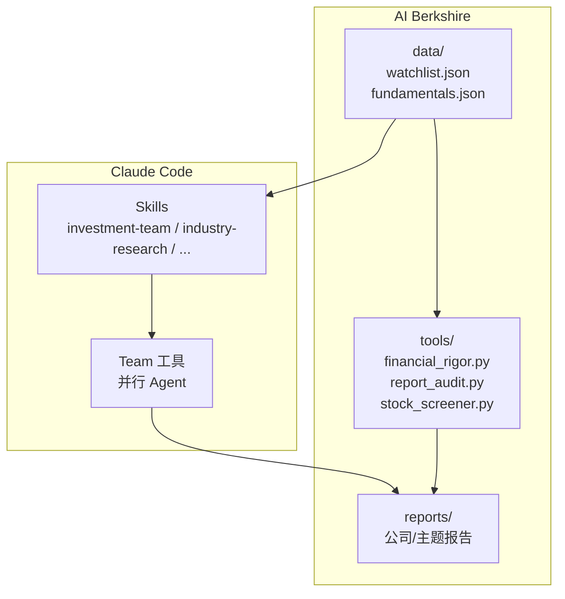
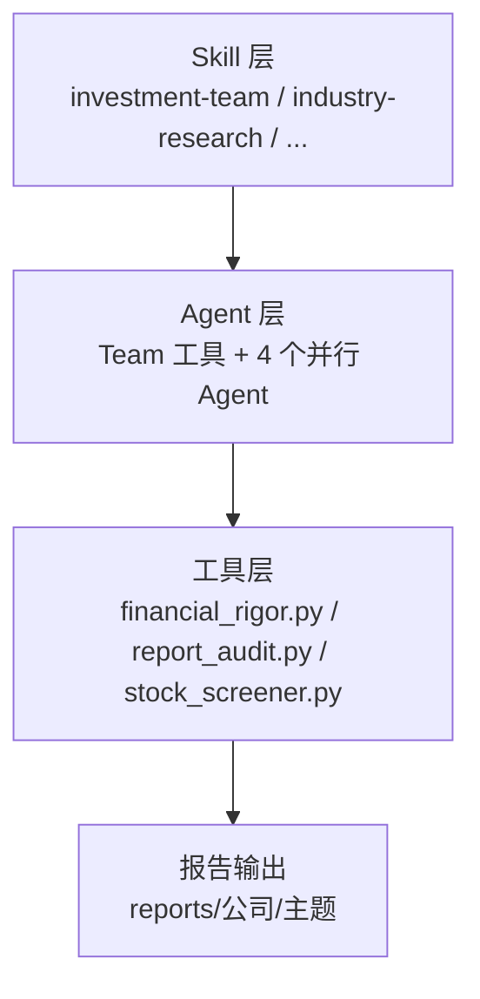
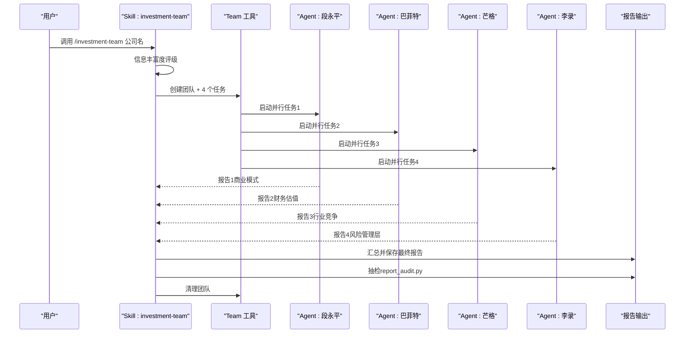
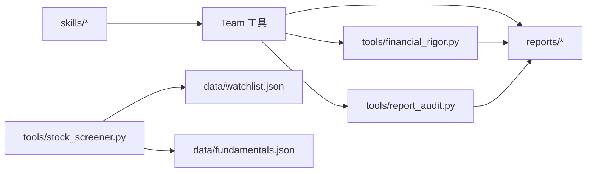

# 快速开始

<cite>
**本文引用的文件**
- [README.md](file://README.md)
- [CLAUDE.md](file://CLAUDE.md)
- [skills/investment-team.md](file://skills/investment-team.md)
- [skills/financial-data.md](file://skills/financial-data.md)
- [tools/financial_rigor.py](file://tools/financial_rigor.py)
- [tools/report_audit.py](file://tools/report_audit.py)
- [tools/stock_screener.py](file://tools/stock_screener.py)
- [data/watchlist.json](file://data/watchlist.json)
- [data/fundamentals.json](file://data/fundamentals.json)
</cite>

## 目录
1. [简介](#简介)
2. [项目结构](#项目结构)
3. [核心组件](#核心组件)
4. [架构总览](#架构总览)
5. [详细组件分析](#详细组件分析)
6. [依赖关系分析](#依赖关系分析)
7. [性能与实践建议](#性能与实践建议)
8. [故障排查指南](#故障排查指南)
9. [结论](#结论)
10. [附录：常用命令与示例](#附录常用命令与示例)

## 简介
本指南面向首次接触 AI Berkshire 的用户，目标是在 30 分钟内完成环境准备、Claude Code 平台设置、项目文件结构理解，并产出第一份投资研究报告。文档覆盖：
- 环境与平台要求
- Skills 部署与使用
- 报告命名与目录规范
- 常用命令与工具
- 第一个投资研究案例：四角色并行分析（段永平/巴菲特/芒格/李录）

## 项目结构
AI Berkshire 以“Skills + 工具 + 数据 + 报告”四层组织：
- skills/：16 个 Claude Code Skill 的定义文件，按场景划分（深度研究、财报分析、行业筛选、组合管理、思维工具）
- tools/：金融严谨性工具与辅助脚本（精确计算、抽检、动量筛等）
- data/：基础数据（自选股 Watchlist、季度基本面等）
- reports/：按公司/主题建立的报告目录，遵循统一命名与结构

图表来源
- [README.md:154-166](file://README.md#L154-L166)
- [CLAUDE.md:8-38](file://CLAUDE.md#L8-L38)

章节来源
- [README.md:154-166](file://README.md#L154-L166)
- [CLAUDE.md:8-38](file://CLAUDE.md#L8-L38)

## 核心组件
- Skills：将“做什么”抽象为 16 个明确入口，覆盖深度研究、财报分析、行业筛选、组合管理、思维工具等
- Team 工具：在单个 Skill 内部并行启动 4 个 Agent，分别代表段永平（商业模式）、巴菲特（财务估值）、芒格（行业竞争）、李录（风险管理层），最后由 Team Lead 综合
- 工具层：金融严谨性工具（精确十进制、市值/估值验算、三情景估值、Benford 检测、抽检）、动量筛等
- 数据层：Watchlist、季度基本面等，支撑筛选与研究

章节来源
- [README.md:169-212](file://README.md#L169-L212)
- [skills/investment-team.md:1-214](file://skills/investment-team.md#L1-L214)

## 架构总览
AI Berkshire 的三层设计哲学：
- Skill 层：明确入口与职责
- Agent 层：4 个并行 Agent 互相挑战，Team Lead 综合
- 工具层：精确计算、交叉验证、抽检，保证数据严谨性与可复现

图表来源
- [README.md:162-166](file://README.md#L162-L166)
- [skills/investment-team.md:34-142](file://skills/investment-team.md#L34-L142)

章节来源
- [README.md:162-166](file://README.md#L162-L166)
- [skills/investment-team.md:34-142](file://skills/investment-team.md#L34-L142)

## 详细组件分析

### 1) 环境与平台设置
- 安装 Claude Code：全局安装 @anthropic-ai/claude-code
- 部署 Skills：将 skills/ 下的 .md 文件复制到 Claude Code 的 commands 目录
- 克隆仓库：本地 ~/ai-berkshire/，便于调用 tools/ 与读取 data/

章节来源
- [README.md:214-232](file://README.md#L214-L232)
- [CLAUDE.md:106-112](file://CLAUDE.md#L106-L112)

### 2) 报告目录与命名规范
- 报告按公司名建立目录，公司相关报告放入对应文件夹
- 命名规范与输出位置：investment-team 输出在公司目录下，earnings-review 输出在公司目录，portfolio-review 输出在根目录
- 报告语言与风格：中文、直接犀利、数据注明来源、关键数据交叉验证

章节来源
- [CLAUDE.md:17-56](file://CLAUDE.md#L17-L56)
- [CLAUDE.md:78-86](file://CLAUDE.md#L78-L86)

### 3) 四角色并行分析（investment-team）
- 团队角色：Team Lead（你）、Business Analyst（段永平）、Financial Analyst（巴菲特）、Industry Researcher（芒格）、Risk Assessor（李录）
- 执行流程：信息丰富度评级 → 创建团队 → 并行任务 → 接收报告 → 汇总 → 保存 → 抽检 → 清理
- 数据严谨性：要求使用 tools/financial_rigor.py 进行市值/估值验算、三情景估值、交叉验证等

图表来源
- [skills/investment-team.md:34-214](file://skills/investment-team.md#L34-L214)
- [tools/report_audit.py:10-22](file://tools/report_audit.py#L10-L22)

章节来源
- [skills/investment-team.md:34-214](file://skills/investment-team.md#L34-L214)

### 4) 金融严谨性工具（financial_rigor.py）
- 市值验算：股价 × 总股本 vs 报告市值，偏差>5%需检查
- 估值验算：PE/PB/ROE/FCF Yield 等指标精确计算
- 三情景估值：乐观/中性/悲观目标价与涨跌幅
- Benford 检测：财务数据首位数字分布异常提示
- 精确计算器：任意财务表达式精确计算

章节来源
- [tools/financial_rigor.py:57-452](file://tools/financial_rigor.py#L57-L452)

### 5) 报告抽检（report_audit.py）
- 从报告中抽取 15% 数据点，与可靠信源交叉验证
- 容差 1%，不通过则打回并列出具体行号与原文片段
- 支持固定随机种子复现抽样

章节来源
- [tools/report_audit.py:10-523](file://tools/report_audit.py#L10-L523)

### 6) 动量筛（stock_screener.py）
- 第一层：60 日新高 + 放量确认
- 第二层：6 维价值验证（营收加速、毛利率扩张、盈利惊喜、营收高增长、毛利率健康、连续改善）
- 信号分级：3/6=试探仓 3%、4/6=标准仓 5%、≥5/6=确信仓 8%
- 支持独立通过条件（如毛利率连续改善、EPS 超预期>30%）

章节来源
- [tools/stock_screener.py:1-402](file://tools/stock_screener.py#L1-L402)

### 7) 数据与 Watchlist
- watchlist.json：按主题分组的自选股清单（如 US AI 芯片、应用、基建、加密、港股互联网、A 股）
- fundamentals.json：季度基本面数据（营收同比、毛利率、EPS 超预期）

章节来源
- [data/watchlist.json:1-38](file://data/watchlist.json#L1-L38)
- [data/fundamentals.json:1-36](file://data/fundamentals.json#L1-L36)

## 依赖关系分析
- Skills 依赖 Team 工具实现并行 Agent
- 报告生成依赖 tools/financial_rigor.py 与 tools/report_audit.py
- 动量筛依赖 data/watchlist.json 与 data/fundamentals.json
- 报告命名与目录结构受 CLAUDE.md 约束

图表来源
- [skills/investment-team.md:64-69](file://skills/investment-team.md#L64-L69)
- [tools/stock_screener.py:31-42](file://tools/stock_screener.py#L31-L42)
- [CLAUDE.md:17-56](file://CLAUDE.md#L17-L56)

章节来源
- [skills/investment-team.md:64-69](file://skills/investment-team.md#L64-L69)
- [tools/stock_screener.py:31-42](file://tools/stock_screener.py#L31-L42)
- [CLAUDE.md:17-56](file://CLAUDE.md#L17-L56)

## 性能与实践建议
- 并行 Agent：investment-team 启动 4 个 Agent 并行研究，需耐心等待（几分钟）；实时展示进度
- 数据准确性：关键数据必须来自两个独立来源，误差>1%标注差异；使用 tools/financial_rigor.py 验算
- 报告抽检：建议在发布前执行 report_audit.py，确保数据可复现
- 动量筛：结合 stock_screener.py 与 fundamentals.json，快速筛选潜在标的

[本节为通用建议，不直接分析具体文件]

## 故障排查指南
- 市值/估值验算偏差过大：检查股价、总股本、货币单位是否一致；必要时使用 tools/financial_rigor.py verify-market-cap / verify-valuation
- 报告抽检不通过：根据 report_audit.py 输出的行号与原文，核对来源与口径差异（GAAP/Non-GAAP、汇率、财年定义等）
- 动量筛无买入信号：确认 watchlist.json 与 fundamentals.json 是否正确；使用 --update 补充基本面数据
- 数据源差异：遵循 financial-data.md 的来源优先级与差异原因说明，必要时以原始财报为准

章节来源
- [tools/financial_rigor.py:57-92](file://tools/financial_rigor.py#L57-L92)
- [tools/report_audit.py:243-398](file://tools/report_audit.py#L243-L398)
- [tools/stock_screener.py:332-402](file://tools/stock_screener.py#L332-L402)
- [skills/financial-data.md:34-104](file://skills/financial-data.md#L34-L104)

## 结论
通过本快速开始指南，你已掌握：
- 环境与平台设置
- Skills 部署与调用
- 报告命名与目录规范
- 四角色并行分析流程
- 金融严谨性与抽检流程
- 常用工具与数据来源

现在即可开始第一个投资研究案例，产出第一份高质量研究报告。

[本节为总结，不直接分析具体文件]

## 附录：常用命令与示例

- 安装 Claude Code
  - npm install -g @anthropic-ai/claude-code

- 部署 Skills
  - git clone https://github.com/xbtlin/ai-berkshire.git
  - cp ai-berkshire/skills/*.md ~/.claude/commands/

- 调用 Skills（示例）
  - /investment-team 腾讯
  - /investment-research 美团
  - /earnings-review 腾讯 2025Q4
  - /industry-research AI算力
  - /portfolio-review 腾讯30%, 美团20%, 茅台20%, 现金30%

- 金融严谨性工具（示例）
  - python3 tools/financial_rigor.py verify-market-cap --price 510 --shares 9.11e9 --reported 4.65e12 --currency HKD
  - python3 tools/financial_rigor.py verify-valuation --price 510 --eps 23.5 --bvps 120
  - python3 tools/financial_rigor.py three-scenario --price 510 --eps 23.5 --shares 9.11 --growth 0.15 0.08 0.0 --pe 25 20 15

- 报告抽检（示例）
  - python3 tools/report_audit.py extract --report reports/腾讯/腾讯-research-20260408.md
  - python3 tools/report_audit.py verdict --results '[{"id":1,"label":"营业收入","reported_value":7518,"unit":"亿","fetched_value":7518,"fetched_source":"macrotrends"}]'

- 动量筛（示例）
  - python3 tools/stock_screener.py
  - python3 tools/stock_screener.py NVDA TSLA GOOG
  - python3 tools/stock_screener.py --update MU

章节来源
- [README.md:214-263](file://README.md#L214-L263)
- [tools/financial_rigor.py:367-452](file://tools/financial_rigor.py#L367-L452)
- [tools/report_audit.py:405-523](file://tools/report_audit.py#L405-L523)
- [tools/stock_screener.py:332-402](file://tools/stock_screener.py#L332-L402)