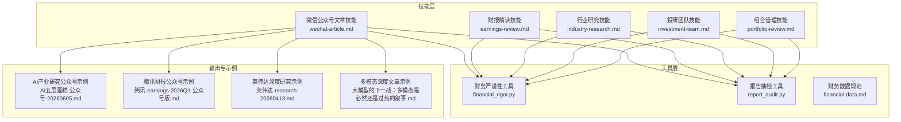
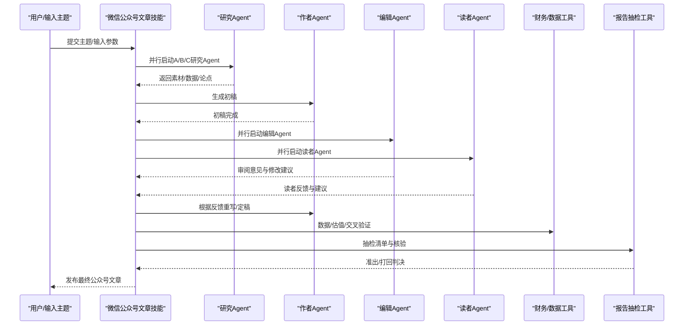
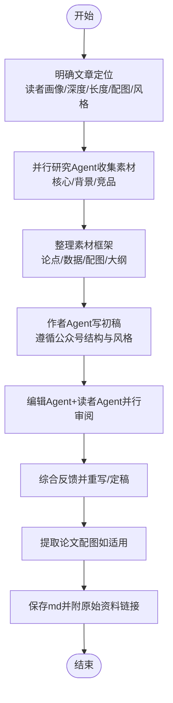
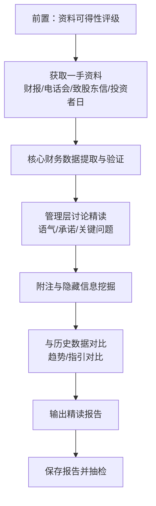
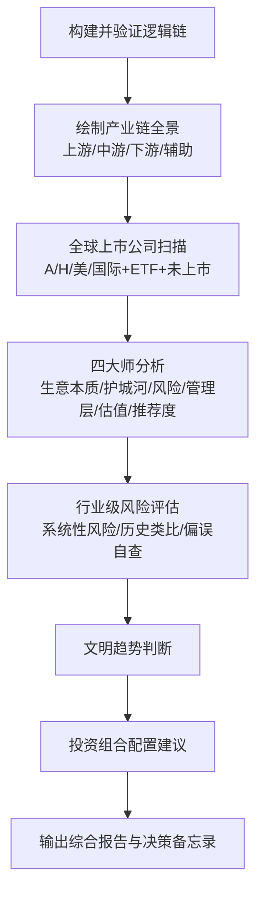
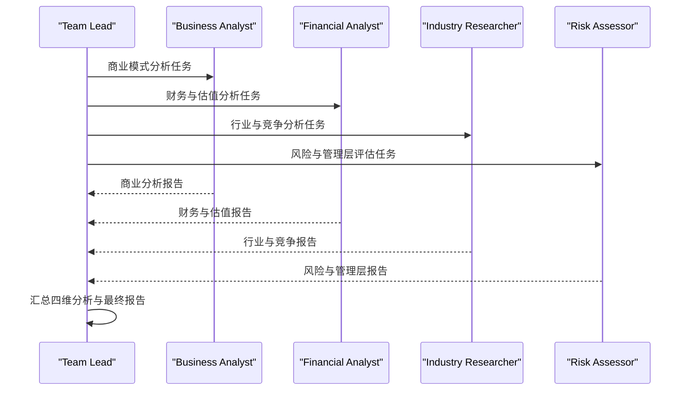
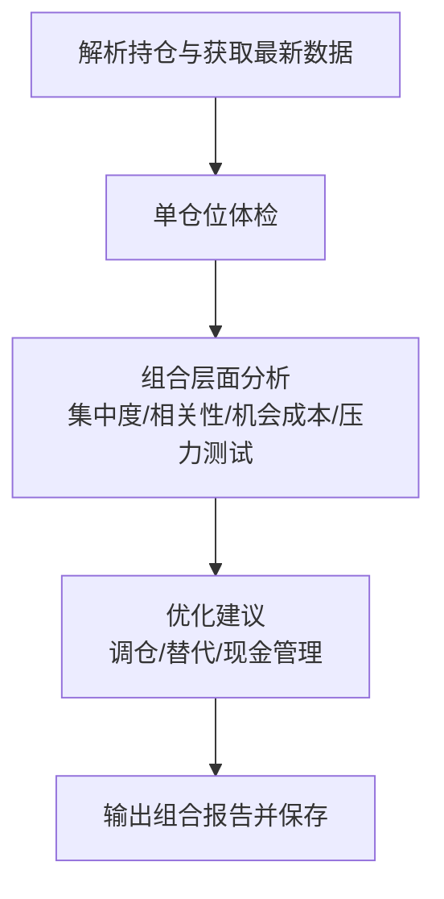
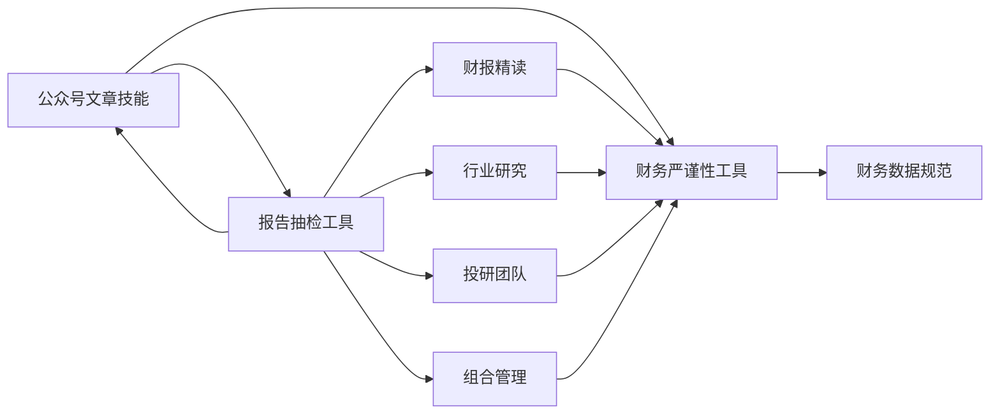

# 公众号文章生成技能

<cite>
**本文档引用的文件**
- [wechat-article.md](file://skills/wechat-article.md)
- [earnings-review.md](file://skills/earnings-review.md)
- [industry-research.md](file://skills/industry-research.md)
- [investment-team.md](file://skills/investment-team.md)
- [portfolio-review.md](file://skills/portfolio-review.md)
- [financial-data.md](file://skills/financial-data.md)
- [financial_rigor.py](file://tools/financial_rigor.py)
- [report_audit.py](file://tools/report_audit.py)
- [AI五层蛋糕-公众号-20260605.md](file://reports/AI产业研究/AI五层蛋糕-公众号-20260605.md)
- [腾讯-earnings-2026Q1-公众号版.md](file://reports/腾讯/腾讯-earnings-2026Q1-公众号版.md)
- [英伟达-research-20260413.md](file://reports/英伟达/英伟达-research-20260413.md)
- [大模型的下一战：多模态是必然还是过热的叙事.md](file://docs/大模型的下一战：多模态是必然还是过热的叙事.md)
</cite>

## 目录
1. [简介](#简介)
2. [项目结构](#项目结构)
3. [核心组件](#核心组件)
4. [架构总览](#架构总览)
5. [详细组件分析](#详细组件分析)
6. [依赖关系分析](#依赖关系分析)
7. [性能与可扩展性](#性能与可扩展性)
8. [故障排查指南](#故障排查指南)
9. [结论](#结论)
10. [附录](#附录)

## 简介
本技能旨在为AI Berkshire的微信公众号输出高质量的投资观点文章，围绕“主题选择—内容结构—语言风格—传播效果”四个维度，提供可复制的工作流与质量保障机制。技能以“作者-编辑-读者”三方协作为核心，结合“研究—初稿—审阅—定稿”的闭环流程，确保文章既有深度、又具备可读性与传播力，并通过工具链实现数据严谨性与发布前准出流程。

## 项目结构
- 技能层（Skills）：定义任务流程与质量标准，如公众号文章生成、财报精读、行业研究、投研团队、组合管理等。
- 工具层（Tools）：提供数据校验与抽检工具，保证研究结论的可审计性与可信度。
- 报告与示例（Reports/Docs）：沉淀输出成果与参考范式，便于复用与迭代。

图表来源
- [wechat-article.md:1-232](file://skills/wechat-article.md#L1-L232)
- [earnings-review.md:1-219](file://skills/earnings-review.md#L1-L219)
- [industry-research.md:1-269](file://skills/industry-research.md#L1-L269)
- [investment-team.md:1-214](file://skills/investment-team.md#L1-L214)
- [portfolio-review.md:1-191](file://skills/portfolio-review.md#L1-L191)
- [financial_rigor.py:1-452](file://tools/financial_rigor.py#L1-L452)
- [report_audit.py:1-523](file://tools/report_audit.py#L1-L523)
- [AI五层蛋糕-公众号-20260605.md:1-114](file://reports/AI产业研究/AI五层蛋糕-公众号-20260605.md#L1-L114)
- [腾讯-earnings-2026Q1-公众号版.md:1-140](file://reports/腾讯/腾讯-earnings-2026Q1-公众号版.md#L1-L140)
- [英伟达-research-20260413.md:1-200](file://reports/英伟达/英伟达-research-20260413.md#L1-L200)
- [大模型的下一战：多模态是必然还是过热的叙事.md:1-118](file://docs/大模型的下一战：多模态是必然还是过热的叙事.md#L1-L118)

章节来源
- [wechat-article.md:1-232](file://skills/wechat-article.md#L1-L232)
- [earnings-review.md:1-219](file://skills/earnings-review.md#L1-L219)
- [industry-research.md:1-269](file://skills/industry-research.md#L1-L269)
- [investment-team.md:1-214](file://skills/investment-team.md#L1-L214)
- [portfolio-review.md:1-191](file://skills/portfolio-review.md#L1-L191)

## 核心组件
- 作者Agent：负责根据研究素材撰写初稿，遵循公众号排版与语言风格要求。
- 编辑Agent：从标题吸引力、开头钩子、结构连贯性、公式/技术表达、节奏与配图、结尾传播力等维度进行精修。
- 读者Agent：以目标读者视角评估“是否愿意继续读下去”“是否能看懂”“是否转发”，并提出可操作的修改建议。
- 研究Agent：并行收集主题所需素材，涵盖核心内容、行业背景、竞品对比等。
- 数据与合规工具：财务严谨性校验、报告抽检、财务数据规范，确保结论可审计、可复现。

章节来源
- [wechat-article.md:63-113](file://skills/wechat-article.md#L63-L113)
- [wechat-article.md:115-164](file://skills/wechat-article.md#L115-L164)
- [wechat-article.md:200-232](file://skills/wechat-article.md#L200-L232)

## 架构总览
公众号文章生成技能采用“研究—初稿—审阅—定稿—发布”的流水线式架构，强调“外部视角强制引入”和“准出流程”。

图表来源
- [wechat-article.md:20-60](file://skills/wechat-article.md#L20-L60)
- [wechat-article.md:63-113](file://skills/wechat-article.md#L63-L113)
- [wechat-article.md:115-164](file://skills/wechat-article.md#L115-L164)
- [wechat-article.md:167-208](file://skills/wechat-article.md#L167-L208)
- [financial_rigor.py:1-452](file://tools/financial_rigor.py#L1-L452)
- [report_audit.py:1-523](file://tools/report_audit.py#L1-L523)

## 详细组件分析

### 组件A：微信公众号文章生成（作者-编辑-读者协作）
- 目标：产出可直接发布的公众号文章，兼顾深度、可读性与传播力。
- 关键流程：
  - 明确文章定位（读者画像、深度、长度、配图需求、写作风格）。
  - 并行研究Agent收集素材，整理核心论点、关键数据、配图清单与大纲。
  - 作者Agent按公众号风格与结构要求撰写初稿。
  - 编辑Agent与读者Agent并行审阅，聚焦标题、开头、结构、公式/技术表达、节奏、配图与结尾传播力。
  - 定稿阶段综合反馈，必要时提取论文配图，最终保存为md并附原始资料链接。
- 质量红线：不虚构数据、不用AI腔调、不过度承诺、公式必须配大白话翻译、LaTeX格式、论文类必须实际插入高清图、表格注释精确、类比贯穿始终、结尾必须有传播力。

图表来源
- [wechat-article.md:20-60](file://skills/wechat-article.md#L20-L60)
- [wechat-article.md:63-113](file://skills/wechat-article.md#L63-L113)
- [wechat-article.md:115-164](file://skills/wechat-article.md#L115-L164)
- [wechat-article.md:167-208](file://skills/wechat-article.md#L167-L208)

章节来源
- [wechat-article.md:1-232](file://skills/wechat-article.md#L1-L232)

### 组件B：财报精读（一手资料优先）
- 目标：直接解读原始财报与电话会纪要，避免二手信息的筛选偏差与滞后。
- 关键流程：
  - 一手资料可得性评级（A/B/C），决定分析深度与附注权重。
  - 获取财报原文、业绩电话会纪要/录音、管理层致股东信、投资者日材料。
  - 核心财务数据提取与验证（收入/利润表、现金流表、资产负债表健康度）。
  - 管理层讨论精读（语气分析、承诺追踪、关键问题识别）。
  - 附注与隐藏信息挖掘（关联交易、股权激励、或有负债、会计政策变更、客户/供应商集中度等）。
  - 与历史数据对比（趋势分析、与管理层指引对比）。
  - 输出精读报告，保存并执行数据抽检（准出/打回）。
- 数据严谨性：使用财务严谨性工具进行市值验算、估值指标验算、多源交叉验证、三情景估值等。

图表来源
- [earnings-review.md:22-219](file://skills/earnings-review.md#L22-L219)
- [financial_rigor.py:58-161](file://tools/financial_rigor.py#L58-L161)
- [report_audit.py:155-227](file://tools/report_audit.py#L155-L227)

章节来源
- [earnings-review.md:1-219](file://skills/earnings-review.md#L1-L219)
- [financial-data.md:1-104](file://skills/financial-data.md#L1-L104)
- [financial_rigor.py:1-452](file://tools/financial_rigor.py#L1-L452)
- [report_audit.py:1-523](file://tools/report_audit.py#L1-L523)

### 组件C：行业投资研究（产业链全景+四大师分析）
- 目标：从投资主题出发，验证逻辑链、绘制产业链全景、扫描全球上市公司、执行四大师分析、输出配置建议。
- 关键流程：
  - 构建并验证投资逻辑链，寻找“已发生的验证事件”。
  - 绘制产业链结构，识别每个环节的“生意特征”与“卡脖子环节”。
  - 全球上市公司扫描（A/H美/国际+ETF+未上市公司），按投资确定性分层。
  - 对Tier 1/2公司执行四大师分析（生意本质、护城河、风险、管理层、估值快照、推荐度）。
  - 行业级风险评估（系统性风险清单、历史类比、偏误自查）。
  - 文明趋势判断（李录框架）。
  - 投资组合配置建议（核心/卫星/期权仓位、买入/卖出信号、主题仓位上限）。
  - 输出综合决策备忘录与最终报告。
- 反偏见措施：对每个环节主动搜索“冷门但可能优质”的标的，标注信息充分度，避免AI分析篇幅短就忽略。

图表来源
- [industry-research.md:16-269](file://skills/industry-research.md#L16-L269)

章节来源
- [industry-research.md:1-269](file://skills/industry-research.md#L1-L269)

### 组件D：投研团队（四角色并行分析）
- 目标：以团队化方式并行执行商业模式、财务与估值、行业与竞争、风险与管理层四项分析，汇总四大师综合判断。
- 关键流程：
  - 展示团队框架与信息丰富度评级（A/B/C），决定研究策略。
  - 创建团队与四项任务，明确每个维度的分析框架与数据要求。
  - 并行启动四个Agent，要求使用两个独立来源交叉验证关键数据，完成后由team-lead汇总。
  - 汇总最终报告，包含一句话结论、四维评分总表、核心数据速览、各维度摘要、投资论点、巴菲特买入前Checklist、最终投资建议、总结段落。
  - 保存报告并执行数据抽检（准出/打回）。
- 重要原则：四个Agent必须并行启动；数据准确性要求严格；结论要明确；反偏见意识与信息稀缺时的诚实原则。

图表来源
- [investment-team.md:5-214](file://skills/investment-team.md#L5-L214)

章节来源
- [investment-team.md:1-214](file://skills/investment-team.md#L1-L214)

### 组件E：组合管理（从“研究公司”到“管理组合”）
- 目标：将单个公司研究转化为组合层面的决策，关注仓位、资金来源、相关性与机会成本。
- 关键流程：
  - 解析持仓，标准化为表格格式；读取/更新组合文件。
  - 并行获取最新数据（股价/估值指标、关键财务变化、重大事件、分析师一致预期），校验估值数据，标注信息丰富度。
  - 单仓位体检（PE、买入逻辑是否变化、论文健康度、仓位建议）。
  - 组合层面分析（集中度、相关性、机会成本、压力测试）。
  - 优化建议（调仓建议、寻找替代标的、现金管理）。
  - 输出组合报告并保存“portfolio-latest.md”。
- 关键原则：每一分钱都有机会成本；集中不是风险，无知才是；现金是一种仓位；组合层面 > 个股层面；定期审视，但不要过度交易。

图表来源
- [portfolio-review.md:24-191](file://skills/portfolio-review.md#L24-L191)

章节来源
- [portfolio-review.md:1-191](file://skills/portfolio-review.md#L1-L191)

## 依赖关系分析
- 技能与工具的耦合：
  - 微信公众号文章技能依赖财务严谨性工具与报告抽检工具，确保数据与结论可审计。
  - 财报精读、行业研究、投研团队、组合管理均依赖财务数据规范与财务严谨性工具。
  - 报告抽检工具从研究报告中抽取数据点，与可靠信源比对，输出准出/打回判决。
- 外部依赖与集成点：
  - 财务数据来源（macrotrends、stockanalysis、aastocks、cninfo等）。
  - 原始财报（SEC EDGAR、HKEX披露易、公司IR页面）。
  - PDF配图提取（pdftoppm + PIL）。

图表来源
- [wechat-article.md:190-208](file://skills/wechat-article.md#L190-L208)
- [earnings-review.md:78-92](file://skills/earnings-review.md#L78-L92)
- [industry-research.md:112-158](file://skills/industry-research.md#L112-L158)
- [investment-team.md:64-69](file://skills/investment-team.md#L64-L69)
- [portfolio-review.md:45-46](file://skills/portfolio-review.md#L45-L46)
- [financial_rigor.py:1-452](file://tools/financial_rigor.py#L1-L452)
- [report_audit.py:1-523](file://tools/report_audit.py#L1-L523)
- [financial-data.md:1-104](file://skills/financial-data.md#L1-L104)

章节来源
- [wechat-article.md:190-208](file://skills/wechat-article.md#L190-L208)
- [earnings-review.md:78-92](file://skills/earnings-review.md#L78-L92)
- [industry-research.md:112-158](file://skills/industry-research.md#L112-L158)
- [investment-team.md:64-69](file://skills/investment-team.md#L64-L69)
- [portfolio-review.md:45-46](file://skills/portfolio-review.md#L45-L46)

## 性能与可扩展性
- 并行化与批处理：
  - 研究Agent与投研团队的四个分析维度均采用并行启动，缩短总时长。
  - 报告抽检采用随机抽样（默认15%），兼顾效率与覆盖面。
- 数据校验与一致性：
  - 财务严谨性工具使用精确十进制运算，避免浮点误差；多源交叉验证与三情景估值增强结论稳健性。
- 可扩展点：
  - 研究Agent可扩展为更多主题域（如宏观经济、政策影响、地缘政治等）。
  - 报告抽检可按主题或报告体量调整抽样比例。
  - 配图提取流程可扩展为批量处理与缓存策略。

[本节为通用性能讨论，不直接分析特定文件]

## 故障排查指南
- 常见问题与处理：
  - 数据不一致：使用财务严谨性工具进行交叉验证与估值验算，若误差>5%需回溯原始财报。
  - 报告抽检不通过：根据抽检清单逐项核对，修正后重审；两来源不一致需标注口径差异。
  - 公众号文章传播力不足：编辑与读者反馈中“开头弱/技术段劝退/结尾无力/节奏拖沓/概念跳跃”是高频问题，需按处理方式重写。
  - 配图质量问题：论文类文章必须从PDF提取高清原图，确保每张≥500KB并按规范命名与插入。
- 工具使用要点：
  - 财务严谨性工具：支持市值验算、估值指标验算、多源交叉验证、Benford定律检测、精确计算器、三情景估值。
  - 报告抽检工具：从报告中抽取数据点并随机抽样，输出准出/打回判决；支持固定随机种子复现样本。

章节来源
- [financial_rigor.py:58-282](file://tools/financial_rigor.py#L58-L282)
- [report_audit.py:155-398](file://tools/report_audit.py#L155-L398)
- [wechat-article.md:171-189](file://skills/wechat-article.md#L171-L189)
- [wechat-article.md:190-199](file://skills/wechat-article.md#L190-L199)

## 结论
公众号文章生成技能通过“作者-编辑-读者”三方协作与严格的准出流程，实现了高质量、可复现、可审计的投资观点输出。配合财务严谨性与报告抽检工具，确保数据与结论的可信度；结合财报精读、行业研究、投研团队与组合管理技能，形成从主题选择到发布传播的完整闭环。建议在实践中持续优化研究Agent的主题覆盖与配图提取流程，以提升规模化与传播效果。

[本节为总结性内容，不直接分析特定文件]

## 附录

### A. 不同主题的写作模板与规范
- 技术主题（论文解读/技术进展）：
  - 强钩子开头（数据/反直觉结论）
  - 背景：为什么这件事重要？解决什么问题？
  - 核心内容：技术深度体现，每个技术点配“大白话翻译”
  - 实证/案例：用数据和案例说话
  - 行业影响/展望：对行业意味着什么
  - 结尾：一句有传播力的判断
  - 配图：论文类必须从PDF提取原图，非论文类可搜索并插入
  - 公式：LaTeX格式，每个公式后配“大白话翻译”
- 投资主题（公司/行业）：
  - 采用“倒金字塔结构”，将“最重要的3个变化”放在最前面
  - 表格精简，要点式表达
  - 每500字插入阶段性小结
  - 严禁密集加粗、排比结构、套话
  - 文末明确“所以呢？”对持有者/观望者的操作指引

章节来源
- [wechat-article.md:86-107](file://skills/wechat-article.md#L86-L107)
- [wechat-article.md:301-338](file://skills/wechat-article.md#L301-L338)

### B. 目标受众分析与语言风格
- 目标读者画像：有点技术背景但非该领域专家
- 写作风格：对话式（像写给聪明的朋友）、类比贴切、段落不超过4行、不使用emoji
- 传播效果优化：标题要吸引点击但不做标题党；结尾要有传播力，适合被截图转发

章节来源
- [wechat-article.md:26-33](file://skills/wechat-article.md#L26-L33)
- [wechat-article.md:75-82](file://skills/wechat-article.md#L75-L82)
- [wechat-article.md:315-324](file://skills/wechat-article.md#L315-L324)

### C. 内容深度把控与合规性审查
- 内容深度：技术主题有公式但要解释清楚；投资主题有数据与逻辑链支撑
- 合规性：不虚构数据、不使用AI腔调、不过度承诺、公式必须配大白话翻译、LaTeX格式、论文类必须实际插入高清图、表格注释精确、类比贯穿始终、结尾必须有传播力
- 准出流程：数据抽检通过方可发布；打回需修正后重审

章节来源
- [wechat-article.md:221-232](file://skills/wechat-article.md#L221-L232)
- [report_audit.py:253-398](file://tools/report_audit.py#L253-L398)

### D. 文章发布流程与读者互动管理
- 发布流程：定稿→数据抽检→准出→发布
- 读者互动：公众号文章末尾提供明确的操作指引与“所以呢？”结论，便于读者转发与二次传播
- 内容质量评估：编辑与读者反馈的高频问题（开头弱/技术段劝退/节奏拖沓/结尾无力/概念跳跃）作为评估与改进重点

章节来源
- [wechat-article.md:167-208](file://skills/wechat-article.md#L167-L208)
- [wechat-article.md:171-189](file://skills/wechat-article.md#L171-L189)

### E. 示例参考
- AI产业研究公众号文章示例：展示五层蛋糕框架、分层投资机会与确定性判断
- 腾讯财报公众号示例：突出“剔除AI产品利润”的核心变化、广告业务加速与回购退潮
- 英伟达深度研究示例：四大师交叉审视、反面证据与循环交易风险
- 多模态深度文章示例：多维度辨析多模态与纯文本语言模型的优先级

章节来源
- [AI五层蛋糕-公众号-20260605.md:1-114](file://reports/AI产业研究/AI五层蛋糕-公众号-20260605.md#L1-L114)
- [腾讯-earnings-2026Q1-公众号版.md:1-140](file://reports/腾讯/腾讯-earnings-2026Q1-公众号版.md#L1-L140)
- [英伟达-research-20260413.md:1-200](file://reports/英伟达/英伟达-research-20260413.md#L1-L200)
- [大模型的下一战：多模态是必然还是过热的叙事.md:1-118](file://docs/大模型的下一战：多模态是必然还是过热的叙事.md#L1-L118)