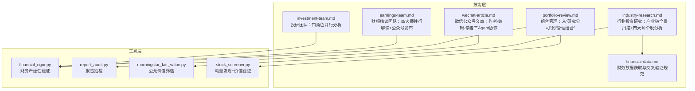
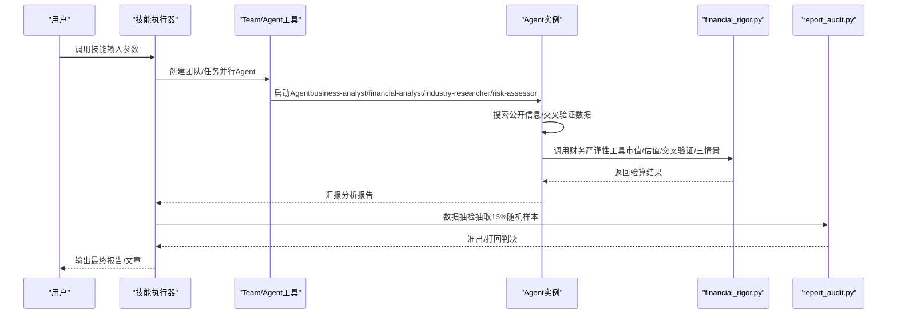
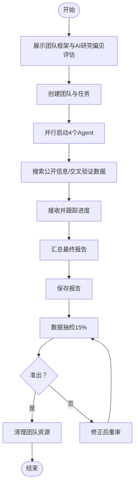
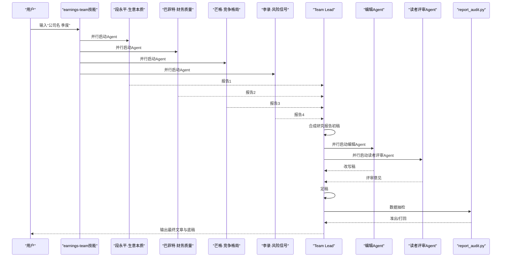
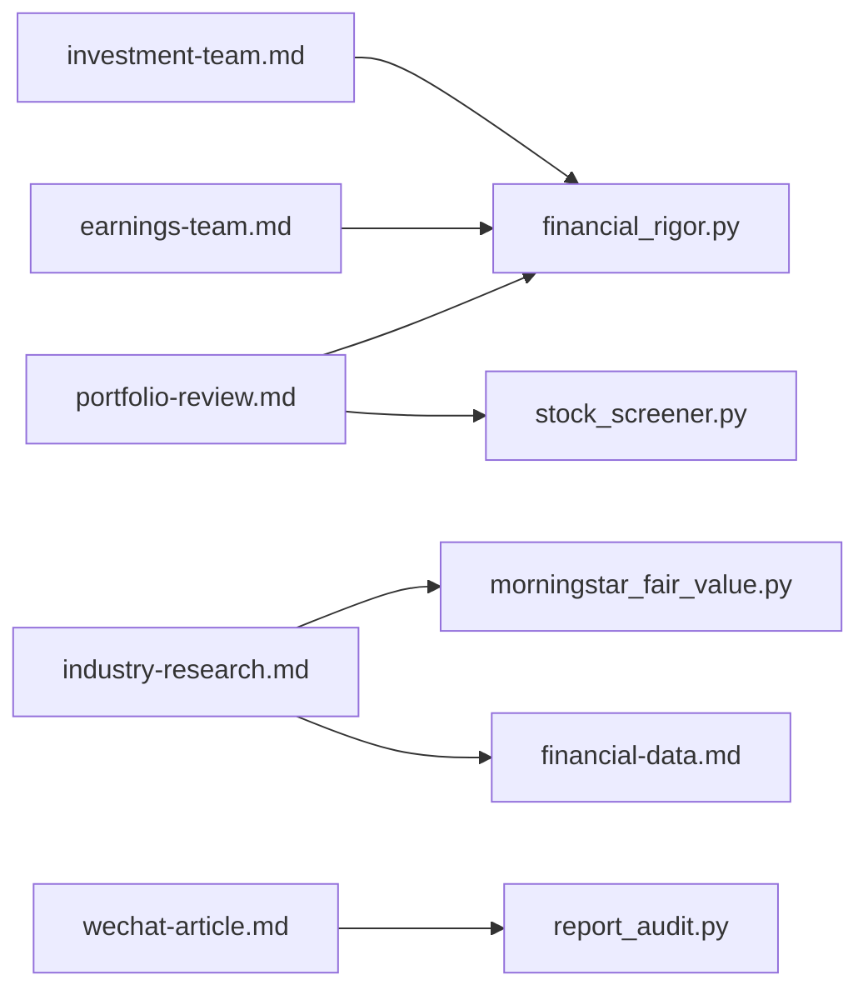

# 技能系统详解

<cite>
**本文档引用的文件**
- [investment-team.md](file://skills/investment-team.md)
- [earnings-team.md](file://skills/earnings-team.md)
- [financial-data.md](file://skills/financial-data.md)
- [industry-research.md](file://skills/industry-research.md)
- [portfolio-review.md](file://skills/portfolio-review.md)
- [wechat-article.md](file://skills/wechat-article.md)
- [financial_rigor.py](file://tools/financial_rigor.py)
- [report_audit.py](file://tools/report_audit.py)
- [morningstar_fair_value.py](file://tools/morningstar_fair_value.py)
- [stock_screener.py](file://tools/stock_screener.py)
</cite>

## 目录
1. [简介](#简介)
2. [项目结构](#项目结构)
3. [核心组件](#核心组件)
4. [架构总览](#架构总览)
5. [详细组件分析](#详细组件分析)
6. [依赖关系分析](#依赖关系分析)
7. [性能考量](#性能考量)
8. [故障排查指南](#故障排查指南)
9. [结论](#结论)
10. [附录](#附录)

## 简介
本文件面向AI Berkshire的技能系统，系统性阐述六大核心技能：投研团队（四角色并行分析）、财报精读团队（四大师并行解读+公众号发布）、财务数据获取与交叉验证规范、行业投资研究（产业链全景扫描+四大师个股分析）、组合管理（从“研究公司”到“管理组合”）、微信公众号文章（作者-编辑-读者三Agent协作）。文档覆盖每个技能的功能特性、执行流程、参数配置、数据输入要求、处理逻辑、输出格式与质量控制机制，并提供实际代码示例路径、常见使用场景与最佳实践指导，帮助技术与非技术读者高效理解与落地。

## 项目结构
技能系统围绕“技能文件 + 工具脚本”的组织方式展开：
- 技能文件位于 skills/ 目录，定义了每个技能的调用方式、流程、参数与输出规范。
- 工具脚本位于 tools/ 目录，提供财务严谨性验证、报告抽检、动量筛选、公允价值筛选等支撑能力。

**图表来源**
- [investment-team.md:1-214](file://skills/investment-team.md#L1-L214)
- [earnings-team.md:1-457](file://skills/earnings-team.md#L1-L457)
- [financial-data.md:1-104](file://skills/financial-data.md#L1-L104)
- [industry-research.md:1-269](file://skills/industry-research.md#L1-L269)
- [portfolio-review.md:1-191](file://skills/portfolio-review.md#L1-L191)
- [wechat-article.md:1-232](file://skills/wechat-article.md#L1-L232)
- [financial_rigor.py:1-452](file://tools/financial_rigor.py#L1-L452)
- [report_audit.py:1-523](file://tools/report_audit.py#L1-L523)
- [morningstar_fair_value.py:1-153](file://tools/morningstar_fair_value.py#L1-L153)
- [stock_screener.py:1-402](file://tools/stock_screener.py#L1-L402)

**章节来源**
- [investment-team.md:1-214](file://skills/investment-team.md#L1-L214)
- [earnings-team.md:1-457](file://skills/earnings-team.md#L1-L457)
- [financial-data.md:1-104](file://skills/financial-data.md#L1-L104)
- [industry-research.md:1-269](file://skills/industry-research.md#L1-L269)
- [portfolio-review.md:1-191](file://skills/portfolio-review.md#L1-L191)
- [wechat-article.md:1-232](file://skills/wechat-article.md#L1-L232)

## 核心组件
- 投研团队（四角色并行分析）：以“四大师”框架（段永平、巴菲特、芒格、李录）并行研究公司，输出四维评分与最终建议。
- 财报精读团队（四大师并行解读+公众号发布）：四Agent并行解读财报，编辑改写为公众号文章，读者评审把关质量。
- 财务数据获取与交叉验证规范：统一财务数据来源、交叉验证与误差处理，确保报告数据质量。
- 行业投资研究：从底层趋势到受益标的的逻辑链验证，绘制产业链全景，扫描全球上市公司并执行四大师分析。
- 组合管理：基于组合层面的集中度、相关性、机会成本与压力测试，输出调仓建议与组合报告。
- 微信公众号文章：作者-编辑-读者三Agent协作，产出可直接发布的高质量文章。

**章节来源**
- [investment-team.md:1-214](file://skills/investment-team.md#L1-L214)
- [earnings-team.md:1-457](file://skills/earnings-team.md#L1-L457)
- [financial-data.md:1-104](file://skills/financial-data.md#L1-L104)
- [industry-research.md:1-269](file://skills/industry-research.md#L1-L269)
- [portfolio-review.md:1-191](file://skills/portfolio-review.md#L1-L191)
- [wechat-article.md:1-232](file://skills/wechat-article.md#L1-L232)

## 架构总览
技能系统采用“技能定义 + 工具验证 + 质量控制”的分层架构：
- 技能定义层：skills/*.md 明确输入、流程、输出与质量要求。
- 工具验证层：tools/* 提供财务严谨性、报告抽检、动量筛选、公允价值筛选等自动化校验。
- 质量控制层：抽检与四大师视角贯穿始终，确保结论可审计、可复现。

**图表来源**
- [investment-team.md:34-214](file://skills/investment-team.md#L34-L214)
- [earnings-team.md:20-457](file://skills/earnings-team.md#L20-L457)
- [financial_rigor.py:1-452](file://tools/financial_rigor.py#L1-L452)
- [report_audit.py:1-523](file://tools/report_audit.py#L1-L523)

## 详细组件分析

### 投研团队：四角色并行分析
- 调用方式：输入公司名，技能自动创建团队并并行启动四个Agent（business-analyst、financial-analyst、industry-researcher、risk-assessor）。
- 执行流程：
  - 展示团队框架与AI研究偏见评估（信息丰富度评级A/B/C）。
  - 创建团队与任务，每个任务包含明确subject、description与activeForm。
  - 并行启动Agent，每个Agent使用WebSearch搜索公开信息，关键数据交叉验证。
  - 实时跟踪进度，接收报告并汇总最终报告，包含四维评分、核心数据速览、投资论点、巴菲特买入前Checklist、最终建议与总结。
  - 保存报告至指定路径，执行数据抽检（report_audit.py），准出后清理团队资源。
- 参数配置与输入要求：
  - 输入：公司名（支持英文/中文）。
  - 输出：最终报告（Markdown），包含四维评分、核心数据速览、投资论点、Checklist、建议与总结。
- 处理逻辑与质量控制：
  - 数据准确性：要求每个关键数据来自两个独立来源，误差>1%需标记；使用financial_rigor.py进行交叉验证与三情景估值。
  - 反偏见意识：在信息丰富度评级基础上，team-lead在汇总时评估是否与市场共识趋同，标注“信息丰富度评级”和“AI研究局限性声明”。
  - 准出流程：抽检15%随机样本，核验通过后准出，否则打回修正。

**图表来源**
- [investment-team.md:5-214](file://skills/investment-team.md#L5-L214)

**章节来源**
- [investment-team.md:1-214](file://skills/investment-team.md#L1-L214)
- [financial-data.md:1-104](file://skills/financial-data.md#L1-L104)
- [financial_rigor.py:1-452](file://tools/financial_rigor.py#L1-L452)
- [report_audit.py:1-523](file://tools/report_audit.py#L1-L523)

### 财报精读团队：四大师并行解读 + 公众号发布
- 调用方式：输入“公司名 季度”，如“腾讯 2025Q4”、“PDD 2025年报”、“美团 最新”。
- 执行流程：
  - 阶段一·研究：四Agent并行解读（段永平看生意本质、巴菲特审财务质量、芒格读竞争变化、李录猎风险信号），资料可得性评级A/B/C。
  - 阶段二·合成：Team Lead综合四个视角，产出研究报告初稿。
  - 阶段三·发布：编辑Agent改写为公众号文章，读者评审Agent提出修改意见，Team Lead定稿。
- 输出文件：
  - 最终公众号文章（定稿）
  - 研究报告底稿（自用）
  - 各视角拆分报告（段永平/巴菲特/芒格/李录）
  - 读者评审报告
- 质量控制：
  - 严格数据来源与交叉验证，使用financial_rigor.py工具验算。
  - 抽检流程：extract抽取15%样本，verdict核验后准出。

**图表来源**
- [earnings-team.md:1-457](file://skills/earnings-team.md#L1-L457)
- [report_audit.py:1-523](file://tools/report_audit.py#L1-L523)

**章节来源**
- [earnings-team.md:1-457](file://skills/earnings-team.md#L1-L457)
- [financial_rigor.py:1-452](file://tools/financial_rigor.py#L1-L452)
- [report_audit.py:1-523](file://tools/report_audit.py#L1-L523)

### 财务数据获取与交叉验证规范
- 数据源优先级（美股/港股/A股）与获取方式详见技能文件。
- 执行规范：
  - 每个关键财务指标（收入、净利润、毛利率、经营现金流、资产负债率等）分别从来源1和来源2取数。
  - 误差计算与标记：≤1%一致，1%-5%标记“数据存在差异”，>5%标记“数据存在重大差异”并回原始财报核实。
  - 呈现格式：每个关键数据标注来源、误差与说明。
- 特别规则：
  - 未上市公司只有一手数据时，标注“估计”不交叉验证。
  - 原始财报优先：若两个来源均与原始财报不符，以原始财报为准并注明来源错误。

**章节来源**
- [financial-data.md:1-104](file://skills/financial-data.md#L1-L104)

### 行业投资研究：产业链全景扫描 + 四大师个股分析
- 研究目标：验证投资逻辑链、绘制产业链全景、扫描全球上市公司、对头部公司执行四大师分析、输出行业级投资组合配置建议。
- 执行流程：
  - 构建与验证逻辑链（底层趋势→受益标的）。
  - 绘制产业链结构与“生意特征”（商业模式、毛利率区间、竞争格局、壁垒类型、周期性）。
  - 全球上市公司扫描（A/H/NASDAQ/NYSE/国际），按Tier分层（核心/卫星/期权/ETF替代）。
  - 对Tier 1/2公司执行四大师分析（段永平“生意本质”、巴菲特“护城河”、芒格“风险”、李录“管理层”）。
  - 行业级风险评估（系统性风险清单、历史类比、偏误自查）。
  - 文明趋势判断（李录框架）。
  - 投资组合配置建议（核心/卫星/期权仓位与买卖信号、主题仓位上限）。
- 质量控制：标注每家公司的“信息充分度”（A/B/C级），避免AI偏见导致的推荐偏差。

**章节来源**
- [industry-research.md:1-269](file://skills/industry-research.md#L1-L269)
- [financial-data.md:1-104](file://skills/financial-data.md#L1-L104)

### 组合管理：从“研究公司”到“管理组合”
- 输入格式：持仓清单（比例或数量/均价）、或“我的持仓”（读取最新组合文件）。
- 执行流程：
  - 解析持仓并标准化格式，检查/读取已有组合文件。
  - 并行获取最新股价、估值指标、关键财务变化、近期重大事件、分析师一致预期。
  - 单仓位体检（PE、买入逻辑是否变化、论文健康度、仓位建议）。
  - 组合层面分析：集中度、相关性、机会成本（预期年化回报）、压力测试。
  - 优化建议：加仓/减仓/清仓/新建仓/不动，寻找替代标的，现金管理。
  - 输出组合报告与保存最新组合文件（包含审视日期、结论、调仓记录、下次审视提醒）。
- 关键原则：每一块钱都有机会成本；集中不是风险，无知才是；现金是一种仓位；组合层面>个股层面；定期审视，但不要过度交易。

**章节来源**
- [portfolio-review.md:1-191](file://skills/portfolio-review.md#L1-L191)
- [financial_rigor.py:1-452](file://tools/financial_rigor.py#L1-L452)

### 微信公众号文章：作者-编辑-读者三Agent协作
- 设计理念：深度（作者）、可读性（编辑）、真的能看懂（读者）。
- 执行流程：
  - 研究与素材收集：明确目标读者、文章深度、长度、是否需要下载原始资料、写作风格。
  - 并行启动研究Agent（核心内容研究、行业背景与应用、竞品/对比研究）。
  - 作者Agent写初稿，编辑Agent精修结构与表达，读者Agent从目标受众视角审读。
  - 定稿：综合反馈，执行修改，提取配图（论文解读类从PDF提取高清原图），产出最终文件。
- 写作红线：不虚构数据、不用AI腔调、不过度承诺、公式必须配大白话、公式必须用LaTeX、配图必须实际插入、表格括号注释要精确、类比要一以贯之、结尾必须有传播力。

**章节来源**
- [wechat-article.md:1-232](file://skills/wechat-article.md#L1-L232)

## 依赖关系分析
- 技能与工具的耦合关系：
  - 投研团队与财报精读团队广泛使用 financial_rigor.py 进行财务严谨性验证（市值验算、估值验算、交叉验证、三情景估值）。
  - 行业研究遵循 financial-data.md 的数据源与交叉验证规范。
  - 组合管理使用 financial_rigor.py 的估值与三情景模型，结合 stock_screener.py 的动量与价值验证。
  - 微信公众号文章使用 report_audit.py 进行数据抽检，确保最终文章质量。
- 外部依赖与集成点：
  - Morningstar公允价值筛选工具用于生成潜在涨幅Top 100，辅助行业研究与组合配置建议。
  - Yahoo Finance API（通过curl）用于股票价格数据抓取，支撑动量发现与组合管理。

**图表来源**
- [investment-team.md:1-214](file://skills/investment-team.md#L1-L214)
- [earnings-team.md:1-457](file://skills/earnings-team.md#L1-L457)
- [financial-data.md:1-104](file://skills/financial-data.md#L1-L104)
- [industry-research.md:1-269](file://skills/industry-research.md#L1-L269)
- [portfolio-review.md:1-191](file://skills/portfolio-review.md#L1-L191)
- [wechat-article.md:1-232](file://skills/wechat-article.md#L1-L232)
- [financial_rigor.py:1-452](file://tools/financial_rigor.py#L1-L452)
- [report_audit.py:1-523](file://tools/report_audit.py#L1-L523)
- [morningstar_fair_value.py:1-153](file://tools/morningstar_fair_value.py#L1-L153)
- [stock_screener.py:1-402](file://tools/stock_screener.py#L1-L402)

**章节来源**
- [financial_rigor.py:1-452](file://tools/financial_rigor.py#L1-L452)
- [report_audit.py:1-523](file://tools/report_audit.py#L1-L523)
- [morningstar_fair_value.py:1-153](file://tools/morningstar_fair_value.py#L1-L153)
- [stock_screener.py:1-402](file://tools/stock_screener.py#L1-L402)

## 性能考量
- 并行执行：投研团队与财报精读团队在同一条消息中并行启动多个Agent，显著缩短研究周期，需注意并发资源与网络请求限制。
- 数据抓取与验证：financial_rigor.py 使用精确十进制计算，避免浮点误差；report_audit.py 抽检15%样本，兼顾效率与质量。
- 动量筛选：stock_screener.py 通过60日新高与放量确认快速筛选，减少无效扫描成本。
- 公允价值筛选：morningstar_fair_value.py 分页抓取并排序，Top 100输出，便于快速决策。

[本节为一般性指导，不直接分析具体文件]

## 故障排查指南
- 财务数据交叉验证不一致：
  - 检查来源是否为同一会计口径（GAAP/Non-GAAP）、汇率换算时间点、财年定义、合并口径、数据更新滞后。
  - 若误差>5%，回原始财报（10-K/年报PDF）核实，以原始财报为准并注明来源错误。
- 报告抽检打回：
  - 根据report_audit.py输出的抽检清单，逐项从可靠信源取数，填入fetched_value与fetched_source，必要时提供fetched_value2与fetched_source2。
  - 注意两来源结果不一致（>1%）属于警告，需人工复核。
- 组合管理建议偏离：
  - 检查集中度、相关性、机会成本与压力测试的假设是否合理；重新评估预期回报与确定性。
- 公众号文章质量不佳：
  - 编辑与读者反馈高频问题包括：开头太弱、技术段劝退、节奏拖沓、结尾无力、概念跳跃；按反馈重写，优先读者体验。

**章节来源**
- [financial-data.md:1-104](file://skills/financial-data.md#L1-L104)
- [report_audit.py:1-523](file://tools/report_audit.py#L1-L523)
- [wechat-article.md:1-232](file://skills/wechat-article.md#L1-L232)
- [portfolio-review.md:1-191](file://skills/portfolio-review.md#L1-L191)

## 结论
AI Berkshire的技能系统通过“四角色并行分析”“四大师并行解读”“财务数据交叉验证”“行业产业链扫描”“组合管理”“公众号文章协作”六大技能，构建了从单公司到行业、从个股到组合、从研究到发布的完整闭环。配合financial_rigor.py、report_audit.py、stock_screener.py、morningstar_fair_value.py等工具，形成可审计、可复现、可量化的质量控制体系。建议在实际使用中坚持数据来源透明、交叉验证严格、结论明确可执行，并持续优化Agent提示词与流程，以提升整体效率与质量。

[本节为总结性内容，不直接分析具体文件]

## 附录
- 常见使用场景与最佳实践：
  - 投研团队：首次研究一家公司时优先使用，确保四维评分与Checklist覆盖全面。
  - 财报精读团队：重要公司关键财报（季度/年报）时使用，产出可直接发布的公众号文章。
  - 行业研究：新主题/新技术/新政策出现时，先用industry-research.md验证逻辑链，再扫描头部公司。
  - 组合管理：每季度审视一次，结合stock_screener.py与morningstar_fair_value.py进行动量与公允价值辅助决策。
  - 公众号文章：技术/投资主题均可使用wechat-article.md，强调“真的能看懂”。

[本节为一般性指导，不直接分析具体文件]