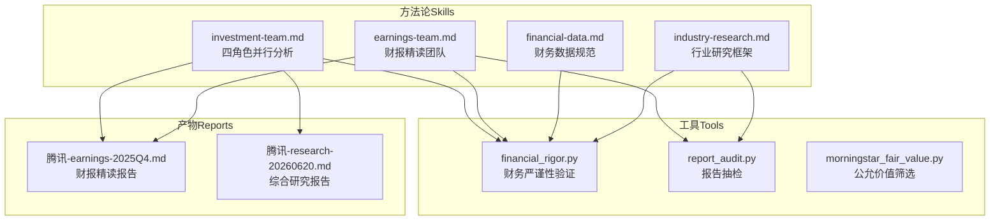
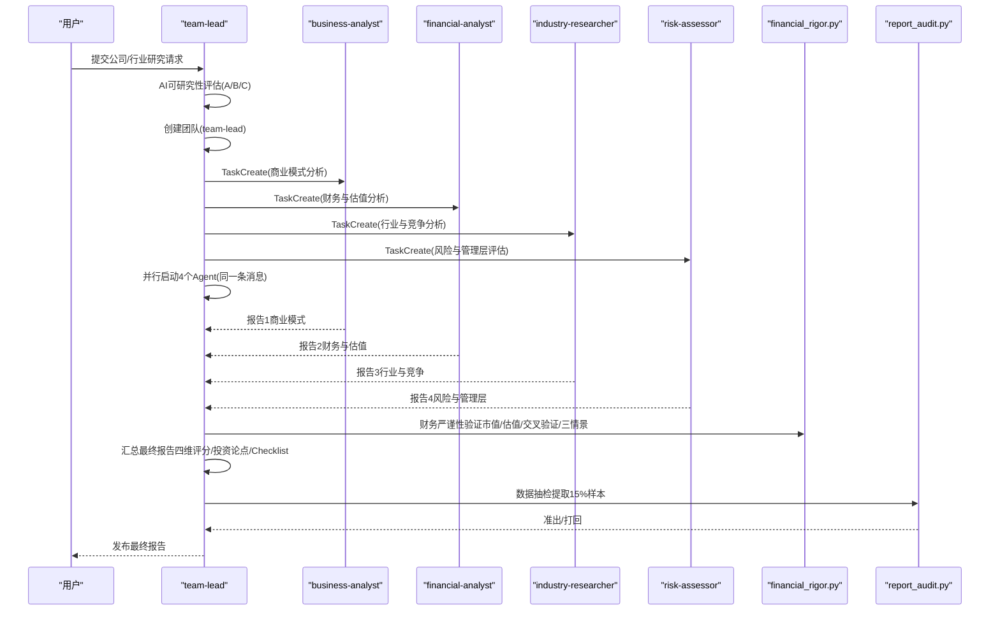
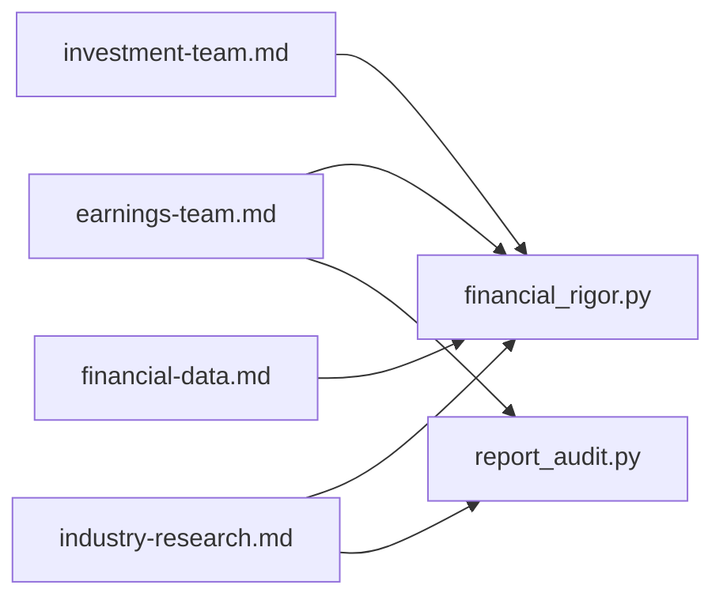

# 投资研究团队技能

<cite>
**本文档引用的文件**
- [investment-team.md](file://skills/investment-team.md)
- [earnings-team.md](file://skills/earnings-team.md)
- [financial-data.md](file://skills/financial-data.md)
- [industry-research.md](file://skills/industry-research.md)
- [financial_rigor.py](file://tools/financial_rigor.py)
- [report_audit.py](file://tools/report_audit.py)
- [morningstar_fair_value.py](file://tools/morningstar_fair_value.py)
- [腾讯-earnings-2025Q4.md](file://reports/腾讯/腾讯-earnings-2025Q4.md)
- [腾讯-research-20260620.md](file://reports/腾讯/腾讯-research-20260620.md)
</cite>

## 目录
1. [简介](#简介)
2. [项目结构](#项目结构)
3. [核心组件](#核心组件)
4. [架构总览](#架构总览)
5. [详细组件分析](#详细组件分析)
6. [依赖分析](#依赖分析)
7. [性能考虑](#性能考虑)
8. [故障排查指南](#故障排查指南)
9. [结论](#结论)
10. [附录](#附录)

## 简介
本文件面向AI Berkshire的投资研究团队，系统化阐述“四角色并行分析框架”的实现原理与工程实践，涵盖团队创建、任务分配、并行Agent执行、质量控制与最终报告汇总的全流程。文档同时详解四大角色职责与分析方法：team-lead（统筹协调）、business-analyst（商业模式与护城河）、financial-analyst（财务与估值）、industry-researcher（行业与竞争）、risk-assessor（风险与管理层）。并配套AI可研究性评估机制、数据验证与抽检流程、最佳实践与使用示例，帮助读者快速上手并高质量交付投资研究报告。

## 项目结构
仓库围绕“技能（Skills）+工具（Tools）+报告（Reports）”组织，形成“方法论 + 工具链 + 产物沉淀”的闭环：
- skills：定义分析流程与方法论（四角色并行分析、财报精读、行业研究、财务数据规范、数据抽检）
- tools：提供严谨性校验与抽检工具（财务严谨性、报告抽检、Morningstar筛选）
- reports：沉淀高质量研究报告与分析底稿，便于复盘与二次利用

图表来源
- [investment-team.md:1-214](file://skills/investment-team.md#L1-L214)
- [earnings-team.md:1-457](file://skills/earnings-team.md#L1-L457)
- [financial-data.md:1-104](file://skills/financial-data.md#L1-L104)
- [industry-research.md:1-269](file://skills/industry-research.md#L1-L269)
- [financial_rigor.py:1-452](file://tools/financial_rigor.py#L1-L452)
- [report_audit.py:1-523](file://tools/report_audit.py#L1-L523)
- [morningstar_fair_value.py:1-153](file://tools/morningstar_fair_value.py#L1-L153)
- [腾讯-earnings-2025Q4.md:1-200](file://reports/腾讯/腾讯-earnings-2025Q4.md#L1-L200)
- [腾讯-research-20260620.md:1-200](file://reports/腾讯/腾讯-research-20260620.md#L1-L200)

章节来源
- [investment-team.md:1-214](file://skills/investment-team.md#L1-L214)
- [earnings-team.md:1-457](file://skills/earnings-team.md#L1-L457)
- [financial-data.md:1-104](file://skills/financial-data.md#L1-L104)
- [industry-research.md:1-269](file://skills/industry-research.md#L1-L269)

## 核心组件
- 四角色并行分析框架：team-lead统筹、business-analyst商业模式、financial-analyst财务与估值、industry-researcher行业与竞争、risk-assessor风险与管理层
- AI可研究性评估：A/B/C三级信息丰富度，指导研究策略与报告取舍
- 财报精读团队：四大师并行解读+编辑润色+读者评审+发布
- 行业研究框架：逻辑链验证、产业链全景、全球扫描、四大师分析、系统性风险与文明趋势判断
- 财务数据规范：多源交叉验证、误差阈值、呈现格式
- 质量控制：财务严谨性工具、报告抽检、准出/打回流程
- 产物沉淀：标准化报告模板与底稿，便于复用与迭代

章节来源
- [investment-team.md:1-214](file://skills/investment-team.md#L1-L214)
- [earnings-team.md:1-457](file://skills/earnings-team.md#L1-L457)
- [financial-data.md:1-104](file://skills/financial-data.md#L1-L104)
- [industry-research.md:1-269](file://skills/industry-research.md#L1-L269)

## 架构总览
四角色并行分析的系统架构由“流程编排 + 并行执行 + 质量控制 + 产物沉淀”构成，强调“并行、交叉验证、反偏见、可审计”。

图表来源
- [investment-team.md:34-214](file://skills/investment-team.md#L34-L214)
- [financial_rigor.py:61-160](file://tools/financial_rigor.py#L61-L160)
- [report_audit.py:405-523](file://tools/report_audit.py#L405-L523)

## 详细组件分析

### 四角色职责与分析方法
- team-lead（统筹协调）
  - 职责：制定分析框架、分配任务、跟踪进度、汇总研判、输出最终报告
  - 方法：四大师综合框架，结合AI可研究性评估，平衡共识与矛盾，强调反面检验与非共识视角
- business-analyst（商业模式与护城河）
  - 职责：定义核心生意、拆解收入结构、验证护城河、评估用户价值与协同效应
  - 方法：段永平“好生意”标准（差异化、定价权、可持续竞争优势）
- financial-analyst（财务与估值）
  - 职责：趋势分析、盈利能力、现金流、资产负债、估值与安全边际
  - 方法：巴菲特视角，使用工具进行市值/估值验算、交叉验证、三情景估值
- industry-researcher（行业与竞争）
  - 职责：行业规模与增长、竞争格局、核心对手威胁、产业链分析
  - 方法：芒格视角，关注竞争变化与风险信号
- risk-assessor（风险与管理层）
  - 职责：管理层质量、监管风险、业务风险、治理结构、长期确定性
  - 方法：李录视角，强调永久性资本损失风险与管理层可信度

章节来源
- [investment-team.md:11-17](file://skills/investment-team.md#L11-L17)
- [investment-team.md:104-128](file://skills/investment-team.md#L104-L128)

### AI可研究性评估机制
- 评估目的：指导研究策略，避免在资料充裕时输出“正确的废话”，在资料稀缺时聚焦本质问题
- 评估维度：信息丰富度（A/B/C级）
  - A级：资料充裕，重点反面检验与非共识视角
  - B级：资料适中，标注置信度与数据充分度
  - C级：资料稀缺，第一性原理模式，不追求完整性
- 关键提醒：资料多≠确定性高，资料少≠确定性低；真实确定性来自商业模式本身

章节来源
- [investment-team.md:19-32](file://skills/investment-team.md#L19-L32)

### 团队创建与任务分配策略
- 团队创建：TeamCreate，agent_type为team-lead，team_name为“{公司名}-research”
- 任务创建：TaskCreate，创建4个任务，分别对应四大角色
  - 任务1：商业模式分析（段永平视角）
  - 任务2：财务与估值分析（巴菲特视角）
  - 任务3：行业与竞争分析（芒格视角）
  - 任务4：风险与管理层评估（李录视角）
- 并行启动：Task工具在同一消息中并行启动4个Agent，每个Agent配置subagent_type=general-purpose、run_in_background=true

章节来源
- [investment-team.md:34-103](file://skills/investment-team.md#L34-L103)

### 并行Agent执行机制
- 消息通信：Agent通过SendMessage汇报，非文件协作
- 数据来源：每个Agent使用WebSearch搜索最新公开信息，关键数据来自两个独立来源，误差>1%需标记
- 输出要求：报告详尽，使用Markdown表格，每个维度明确结论与评分，附数据来源
- 进度跟踪：实时展示Agent完成状态与核心要点，等待全部报告到齐

章节来源
- [investment-team.md:104-138](file://skills/investment-team.md#L104-L138)
- [financial-data.md:3-61](file://skills/financial-data.md#L3-L61)

### 财务严谨性验证与数据交叉验证
- 工具：financial_rigor.py
  - 市值验算：股价×总股本 vs 报告市值，偏差>5%需核查
  - 估值验算：PE/PB/PS/FCF Yield等指标验算
  - 交叉验证：多源数据一致性检验，容差阈值2%
  - 三情景估值：乐观/中性/悲观情景下的目标价与涨跌幅
- 使用场景：在任务2的财务与估值分析中强制调用，将工具输出嵌入报告作为验证记录

章节来源
- [investment-team.md:64-69](file://skills/investment-team.md#L64-L69)
- [financial_rigor.py:61-160](file://tools/financial_rigor.py#L61-L160)
- [financial_rigor.py:167-204](file://tools/financial_rigor.py#L167-L204)
- [financial_rigor.py:320-361](file://tools/financial_rigor.py#L320-L361)

### 报告抽检与准出流程
- 工具：report_audit.py
  - 提取：从报告中抽取15%随机样本（最少3个，最多30个）
  - 核验：从可靠信源取数，比较相对偏差（容差1%）
  - 判决：全部通过→准出；存在不通过→打回并说明原因
- 适用范围：四角色综合报告与财报精读报告

章节来源
- [investment-team.md:183-198](file://skills/investment-team.md#L183-L198)
- [report_audit.py:405-523](file://tools/report_audit.py#L405-L523)

### 财报精读团队（四大师并行解读 + 公众号发布）
- 设计理念：四个不同视角的深度研究 + 编辑润色 + 读者评审把关质量
- 阶段一·研究：四大师并行精读财报（段永平看生意本质、巴菲特审财务质量、芒格读竞争变化、李录猎风险信号）
- 阶段二·合成：Team Lead综合四个视角，产出研究报告初稿
- 阶段三·发布：编辑Agent改写为公众号文章 + 读者评审Agent提出修改意见 → Team Lead定稿
- 输出文件：最终公众号文章、研究底稿、各大师子报告与读者评审报告

章节来源
- [earnings-team.md:1-457](file://skills/earnings-team.md#L1-L457)

### 行业研究框架（逻辑链验证 + 全球扫描 + 四大师分析）
- 逻辑链构建与验证：从底层趋势到受益标的的因果链，逐环节验证与寻找已发生事件
- 产业链全景：上游→中游→下游→辅助，标注每个环节的商业模式、毛利率、竞争格局、壁垒与周期性
- 全球上市公司扫描：A股/港股/美股/国际+ETF+未上市公司，按投资确定性分层
- 四大师分析：段永平（生意本质）、巴菲特（护城河）、芒格（风险）、李录（管理层与估值快照）
- 系统性风险与文明趋势：系统性风险清单、历史类比、偏误自查、文明趋势判断
- 投资组合配置建议：核心/卫星/期权仓位与买卖信号、主题仓位上限

章节来源
- [industry-research.md:1-269](file://skills/industry-research.md#L1-L269)

### 财务数据获取与交叉验证规范
- 数据源优先级：美股（macrotrends+stockanalysis+SEC EDGAR）、港股（aastocks+macrotrends ADR+HKEX）、A股（东方财富+巨潮资讯）
- 执行规范：每个关键数据来自两个独立来源，误差计算与标记（≤1%一致、1%-5%差异、>5%重大差异）
- 呈现格式：标注来源与误差，差异示例说明可能原因（GAAP/Non-GAAP、汇率、财年定义、合并口径、数据滞后）

章节来源
- [financial-data.md:7-104](file://skills/financial-data.md#L7-L104)

### 实际使用示例与最佳实践
- 示例1：腾讯2025年报/Q4财报精读
  - 资料可得性评估：A级（一手资料充分）
  - 核心发现：毛利率系统性提升、AI从“烧钱叙事”转向“可见变现”、海外游戏爆发式增长
  - 管理层语气与承诺追踪：坦诚度评分★★★★☆，承诺兑现率高
- 示例2：腾讯综合研究（四角色）
  - 信息丰富度评级：A级（资料极度充裕）
  - 四维评分：商业模式★★★★½、财务与估值★★★★½、行业竞争★★★★、风险管理★★★
  - 投资论点：看多7条、看空7条，结合Checklist与分层建议
- 最佳实践
  - 并行启动：必须在同一条消息中并行调用4个Agent
  - 数据准确性：关键数据来自两个独立来源，交叉验证误差>1%需标注
  - 结论明确：不回避买入/观望/回避建议与价格区间
  - 反偏见意识：team-lead在汇总时评估资料充裕度与市场共识趋同度
  - 信息稀缺时的诚实原则：标注“数据不足”，不以推测填充框架

章节来源
- [腾讯-earnings-2025Q4.md:1-200](file://reports/腾讯/腾讯-earnings-2025Q4.md#L1-L200)
- [腾讯-research-20260620.md:1-200](file://reports/腾讯/腾讯-research-20260620.md#L1-L200)
- [investment-team.md:204-214](file://skills/investment-team.md#L204-L214)

## 依赖分析
- 方法论依赖工具链：四角色分析与财报精读均依赖financial_rigor.py进行财务严谨性验证；行业研究与报告发布依赖report_audit.py进行抽检
- 数据来源依赖：财务数据规范要求两个独立来源，误差阈值与呈现格式统一
- 产物依赖：报告模板标准化，便于复用与二次审计

图表来源
- [investment-team.md:64-69](file://skills/investment-team.md#L64-L69)
- [earnings-team.md:110-143](file://skills/earnings-team.md#L110-L143)
- [industry-research.md:116-150](file://skills/industry-research.md#L116-L150)
- [financial-data.md:3-61](file://skills/financial-data.md#L3-L61)
- [report_audit.py:405-523](file://tools/report_audit.py#L405-L523)

章节来源
- [investment-team.md:64-69](file://skills/investment-team.md#L64-L69)
- [earnings-team.md:110-143](file://skills/earnings-team.md#L110-L143)
- [industry-research.md:116-150](file://skills/industry-research.md#L116-L150)
- [financial-data.md:3-61](file://skills/financial-data.md#L3-L61)
- [report_audit.py:405-523](file://tools/report_audit.py#L405-L523)

## 性能考虑
- 并行执行：同一消息中并行启动4个Agent，缩短总耗时，实时展示进度
- 数据验证：财务严谨性工具与报告抽检采用精确十进制计算与1%容差，兼顾速度与准确性
- 采样抽检：报告抽检按15%随机抽样，最少3个、最多30个，平衡抽检成本与覆盖率
- 供应链约束：财报精读中强调一手资料可得性评级，避免因资料缺失导致重复返工

## 故障排查指南
- Agent未按时返回报告
  - 检查是否在同一消息中并行启动
  - 确认Agent通过SendMessage汇报，非文件协作
- 数据交叉验证不一致
  - 检查来源是否来自两个独立来源
  - 查看误差标记与差异原因（GAAP/Non-GAAP、汇率、财年定义等）
- 报告抽检不通过
  - 按抽检清单从可靠信源重新取数
  - 核对呈现格式与单位，确保与报告一致
- 财务严谨性工具报错
  - 确认输入参数类型与单位
  - 检查表达式安全性（仅允许数字与基本运算符）

章节来源
- [investment-team.md:204-214](file://skills/investment-team.md#L204-L214)
- [financial_rigor.py:367-452](file://tools/financial_rigor.py#L367-L452)
- [report_audit.py:405-523](file://tools/report_audit.py#L405-L523)

## 结论
四角色并行分析框架通过“方法论 + 工具链 + 质量控制 + 产物沉淀”的闭环，实现了高效、严谨、可审计的投资研究流程。团队在AI可研究性评估基础上，以并行Agent执行四大维度分析，借助财务严谨性工具与报告抽检保障数据质量，最终输出结构化、可复用的研究报告。配合行业研究与财报精读团队，可覆盖从个股到主题的全谱系研究需求。

## 附录
- Morningstar公允价值筛选：抓取FairValueEstimate并计算潜在涨幅，输出Top 100，辅助主题与个股筛选
- 报告模板：四角色综合报告与财报精读报告均有标准化结构，便于快速生成与复用

章节来源
- [morningstar_fair_value.py:47-153](file://tools/morningstar_fair_value.py#L47-L153)
- [腾讯-research-20260620.md:1-200](file://reports/腾讯/腾讯-research-20260620.md#L1-L200)
- [腾讯-earnings-2025Q4.md:1-200](file://reports/腾讯/腾讯-earnings-2025Q4.md#L1-L200)