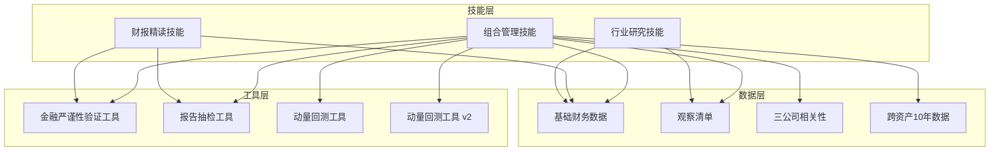
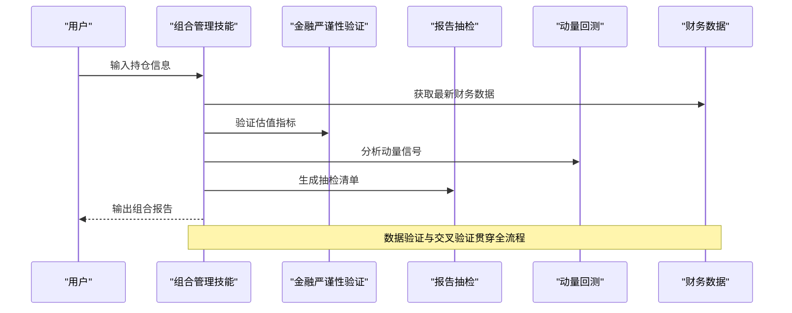
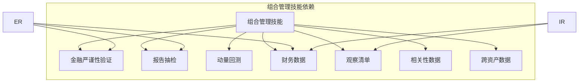

# 组合管理技能

<cite>
**本文档引用的文件**
- [组合管理：从"研究公司"到"管理组合"](file://skills/portfolio-review.md)
- [财报精读：一手资料深度解读](file://skills/earnings-review.md)
- [金融数据获取与交叉验证规范](file://skills/financial-data.md)
- [行业投资研究：产业链全景扫描 + 四大师个股分析框架](file://skills/industry-research.md)
- [报告数据抽检工具](file://tools/report_audit.py)
- [金融严谨性验证工具](file://tools/financial_rigor.py)
- [动量发现 + 价值验证 回测工具](file://tools/momentum_backtest.py)
- [动量发现 + 价值验证 回测工具 v2](file://tools/momentum_backtest_v2.py)
- [基础财务数据](file://data/fundamentals.json)
- [观察清单](file://data/watchlist.json)
- [三公司相关性数据](file://data/correlation_3stocks_2021-2026.csv)
- [跨资产10年数据](file://data/cross_asset_10y_2016-2026.csv)
</cite>

## 目录
1. [简介](#简介)
2. [项目结构](#项目结构)
3. [核心组件](#核心组件)
4. [架构概览](#架构概览)
5. [详细组件分析](#详细组件分析)
6. [依赖关系分析](#依赖关系分析)
7. [性能考量](#性能考量)
8. [故障排查指南](#故障排查指南)
9. [结论](#结论)
10. [附录](#附录)

## 简介
本文件为AI Berkshire的组合管理技能提供系统化技术文档，围绕投资组合定期回顾与管理的完整流程展开，涵盖组合表现分析、资产配置评估、风险监控与再平衡策略。文档同时详细阐述组合收益计算、波动率分析、夏普比率评估与最大回撤计算方法，并包含持仓集中度分析、行业分布监控、个股贡献度评估与绩效归因分析方法，最后提供组合优化建议与风险管理策略。

## 项目结构
AI Berkshire项目采用技能-工具-数据的分层架构：
- 技能层：提供投资研究与组合管理的流程化方法论（如组合审视、财报精读、行业研究）
- 工具层：提供数据验证、回测、抽检等自动化工具
- 数据层：提供财务数据、相关性数据、观察清单等基础数据

**图表来源**
- [组合管理：从"研究公司"到"管理组合"](file://skills/portfolio-review.md)
- [财报精读：一手资料深度解读](file://skills/earnings-review.md)
- [金融数据获取与交叉验证规范](file://skills/financial-data.md)
- [行业投资研究：产业链全景扫描 + 四大师个股分析框架](file://skills/industry-research.md)
- [金融严谨性验证工具](file://tools/financial_rigor.py)
- [报告数据抽检工具](file://tools/report_audit.py)
- [动量发现 + 价值验证 回测工具](file://tools/momentum_backtest.py)
- [动量发现 + 价值验证 回测工具 v2](file://tools/momentum_backtest_v2.py)
- [基础财务数据](file://data/fundamentals.json)
- [观察清单](file://data/watchlist.json)
- [三公司相关性数据](file://data/correlation_3stocks_2021-2026.csv)
- [跨资产10年数据](file://data/cross_asset_10y_2016-2026.csv)

**章节来源**
- [组合管理：从"研究公司"到"管理组合"](file://skills/portfolio-review.md)
- [金融数据获取与交叉验证规范](file://skills/financial-data.md)

## 核心组件
本项目的核心组件包括：
- 组合管理技能：提供完整的组合审视与优化流程，涵盖集中度分析、相关性检查、机会成本分析与压力测试
- 财报精读技能：提供一手资料深度解读流程，强调原始财报的重要性与数据验证
- 行业研究技能：提供产业链全景扫描与四大师分析框架
- 金融严谨性验证工具：提供估值指标验算、多源交叉验证、Benford定律检测等功能
- 报告抽检工具：提供自动化数据抽检与准出流程
- 动量回测工具：提供动量发现与价值验证的回测框架

**章节来源**
- [组合管理：从"研究公司"到"管理组合"](file://skills/portfolio-review.md)
- [财报精读：一手资料深度解读](file://skills/earnings-review.md)
- [行业投资研究：产业链全景扫描 + 四大师个股分析框架](file://skills/industry-research.md)
- [金融严谨性验证工具](file://tools/financial_rigor.py)
- [报告数据抽检工具](file://tools/report_audit.py)
- [动量发现 + 价值验证 回测工具](file://tools/momentum_backtest.py)

## 架构概览
组合管理技能的架构遵循"研究公司→管理组合"的双轨思路，通过技能-工具-数据的协同实现：

**图表来源**
- [组合管理：从"研究公司"到"管理组合"](file://skills/portfolio-review.md)
- [金融严谨性验证工具](file://tools/financial_rigor.py)
- [报告数据抽检工具](file://tools/report_audit.py)
- [动量发现 + 价值验证 回测工具](file://tools/momentum_backtest.py)

## 详细组件分析

### 组合管理技能
组合管理技能提供从单个公司研究到组合层面决策的完整流程：

#### 执行流程
1. **解析持仓**：标准化持仓格式，支持比例与数量两种输入
2. **获取最新数据**：并行获取股价、估值指标、财务变化、重大事件
3. **单仓位体检**：快速健康检查，评估买入逻辑与论文健康度
4. **组合层面分析**：
   - 集中度分析（第一大、前三大的占比范围）
   - 相关性检查（隐性关联与风险共振）
   - 机会成本分析（预期回报排序）
   - 压力测试（极端情景回撤预估）
5. **优化建议**：具体的调仓建议与替代标的寻找
6. **输出报告**：标准化的组合报告结构
7. **保存文件**：持久化组合信息

#### 关键原则
- 每一分钱都有机会成本
- 集中不是风险，无知才是
- 现金是一种仓位
- 组合层面>个股层面
- 定期审视，但不要过度交易

**章节来源**
- [组合管理：从"研究公司"到"管理组合"](file://skills/portfolio-review.md)

### 财报精读技能
财报精读技能强调"读一手资料"的重要性：

#### 执行流程
1. **前置步骤**：资料可得性评级（A/B/C级）
2. **获取一手资料**：原始财报、业绩电话会、管理层致股东信
3. **核心财务数据提取与验证**：收入、利润、现金流、资产负债表
4. **管理层讨论精读**：语气分析、承诺追踪、关键问题识别
5. **附注与隐藏信息挖掘**：关联交易、股权激励、或有负债等
6. **与历史数据对比**：趋势分析与管理层指引对比
7. **输出精读报告**：标准化报告结构
8. **数据抽检**：准出流程

#### 数据验证方法
- 多源交叉验证（至少2个来源）
- 市值校验（股价×总股本 vs 报告市值）
- 估值指标验算（PE、PB、PS、FCF Yield等）

**章节来源**
- [财报精读：一手资料深度解读](file://skills/earnings-review.md)
- [金融数据获取与交叉验证规范](file://skills/financial-data.md)

### 行业研究技能
行业研究技能提供产业链全景扫描与四大师分析框架：

#### 研究目标
- 验证投资逻辑链的每个环节
- 绘制完整产业链全景图
- 扫描全球所有上市公司
- 对每个细分环节的头部公司执行四大师框架分析
- 输出行业级投资组合配置建议

#### 四大师分析框架
1. **生意本质**（段永平）：一句话定义、收入结构、毛利率、现金流特征
2. **护城河**（巴菲特）：品牌/定价权、转换成本、网络效应、规模效应、技术/牌照壁垒
3. **风险**（芒格）：最可能的失败方式、最坏情景价值、聪明人的不买原因
4. **管理层**（段永平+巴菲特）：关键决策记录、持股比例、利益对齐

#### 配置建议
- 核心仓位：占主题仓位50-60%
- 卫星仓位：占主题仓位25-35%
- 期权仓位：占主题仓位5-15%
- ETF替代：可替代以上全部

**章节来源**
- [行业投资研究：产业链全景扫描 + 四大师个股分析框架](file://skills/industry-research.md)

### 金融严谨性验证工具
金融严谨性验证工具提供多种数据验证功能：

#### 核心功能
1. **市值验算**：股价×总股本 vs 报告市值的偏差分析
2. **估值指标验算**：PE、PB、PS、FCF Yield等指标的精确计算
3. **多源交叉验证**：基于中位数的交叉验证与一致性判断
4. **Benford定律检测**：财务数据造假检测
5. **精确计算器**：避免浮点误差的十进制计算
6. **三情景估值**：乐观、中性、悲观情景的目标价计算

#### 精确计算机制
- 使用Decimal避免浮点陷阱
- 支持科学计数法表达式
- 提供可审计的计算过程

**章节来源**
- [金融严谨性验证工具](file://tools/financial_rigor.py)

### 报告抽检工具
报告抽检工具提供自动化数据抽检与准出流程：

#### 工作流程
1. **提取数据点**：从Markdown报告中识别财务数据点
2. **随机抽样**：15%的随机抽样（最少3个，最多30个）
3. **核验判决**：基于1%容差的准出/打回判决

#### 抽检规则
- 100%通过：准出
- 有不通过：打回并说明原因
- 两来源不一致：警告，可能是口径差异

**章节来源**
- [报告数据抽检工具](file://tools/report_audit.py)

### 动量回测工具
动量回测工具提供动量发现与价值验证的回测框架：

#### 核心逻辑
1. **动量发现引擎**：60日新高、放量确认、30日涨幅综合判断
2. **价值验证引擎**：营收加速、毛利率扩张、EPS超预期、营收高增长、毛利率健康
3. **回测主逻辑**：对单个标的进行完整回测，计算假设收益

#### 回测标的
- NVDA、AMD、MU（AI芯片三巨头）
- 时间范围：2022-2025年

**章节来源**
- [动量发现 + 价值验证 回测工具](file://tools/momentum_backtest.py)
- [动量发现 + 价值验证 回测工具 v2](file://tools/momentum_backtest_v2.py)

## 依赖关系分析

**图表来源**
- [组合管理：从"研究公司"到"管理组合"](file://skills/portfolio-review.md)
- [财报精读：一手资料深度解读](file://skills/earnings-review.md)
- [行业投资研究：产业链全景扫描 + 四大师个股分析框架](file://skills/industry-research.md)
- [金融严谨性验证工具](file://tools/financial_rigor.py)
- [报告数据抽检工具](file://tools/report_audit.py)
- [动量发现 + 价值验证 回测工具](file://tools/momentum_backtest.py)

### 数据依赖关系
- 基础财务数据：提供季度财务数据（收入、毛利率、EPS等）
- 观察清单：提供行业与标的的筛选清单
- 相关性数据：提供三公司相关性分析
- 跨资产数据：提供10年跨资产价格数据

**章节来源**
- [基础财务数据](file://data/fundamentals.json)
- [观察清单](file://data/watchlist.json)
- [三公司相关性数据](file://data/correlation_3stocks_2021-2026.csv)
- [跨资产10年数据](file://data/cross_asset_10y_2016-2026.csv)

## 性能考量
- **并行处理**：组合管理技能支持并行获取每个持仓的最新数据
- **精确计算**：金融严谨性验证工具使用Decimal避免浮点误差
- **数据缓存**：组合文件持久化，避免重复计算
- **抽样检验**：报告抽检采用15%抽样，平衡准确性与效率

## 故障排查指南

### 常见问题与解决方案
1. **数据验证失败**
   - 检查多源数据的一致性
   - 确认财务数据的原始来源
   - 使用金融严谨性验证工具重新验算

2. **组合报告不通过**
   - 检查抽检清单中的数据点
   - 确认数据来源的可靠性
   - 修正不一致的数据

3. **动量回测结果异常**
   - 检查价格数据的完整性
   - 验证财务数据的准确性
   - 调整回测参数

**章节来源**
- [报告数据抽检工具](file://tools/report_audit.py)
- [金融严谨性验证工具](file://tools/financial_rigor.py)

## 结论
AI Berkshire的组合管理技能通过系统化的流程与严格的工具验证，为投资组合的定期回顾与管理提供了完整的技术支撑。该体系强调"组合层面>个股层面"的原则，结合多维度的风险监控与优化策略，能够有效提升投资组合的整体表现与风险管理能力。

## 附录

### 组合分析方法论

#### 组合收益计算
- **总回报率**：(期末价值-期初价值)/期初价值
- **年化回报率**：(1+总回报率)^(1/n)-1，其中n为年数
- **复合年增长率**：基于多期数据的几何平均

#### 波动率分析
- **历史波动率**：基于日度或月度收益率的标准差
- **贝塔系数**：衡量相对于市场的系统性风险
- **相关性矩阵**：多资产间的相关性分析

#### 夏普比率评估
- **计算公式**：(Rp-Rf)/σp
- 其中：Rp为投资组合回报率，Rf为无风险利率，σp为投资组合标准差
- **阈值参考**：>1为良好，>2为优秀

#### 最大回撤计算
- **定义**：从峰值到谷底的最大跌幅
- **计算方法**：(谷底-峰值)/峰值
- **时间范围**：通常使用滚动最大回撤分析

#### 持仓集中度分析
- **单一资产限制**：<40%为合理范围
- **前三大资产**：50-80%为目标区间
- **总持仓数量**：5-15只为合理范围
- **现金比例**：10-30%为合理范围

#### 行业分布监控
- **行业集中度**：避免超过50%暴露在同一行业
- **地域分散**：避免超过50%暴露在同一国家/货币
- **主题分散**：避免过度集中在单一主题

#### 个股贡献度评估
- **收益贡献**：(当前收益-基准收益)×权重
- **风险贡献**：基于协方差的边际风险贡献
- **信息比率**：超额收益/跟踪误差

#### 绩效归因分析
- **资产配置效应**：权重偏离带来的收益
- **证券选择效应**：选择能力带来的收益
- **时机选择效应**：择时能力带来的收益
- **交互效应**：权重与选择的交互影响

### 风险管理策略
1. **分散化原则**：地域、行业、主题、时间的多维度分散
2. **止损机制**：设定明确的止损阈值与执行规则
3. **动态再平衡**：定期调整至目标配置
4. **对冲策略**：必要时使用衍生品对冲系统性风险
5. **流动性管理**：保持适当的现金比例应对流动性需求