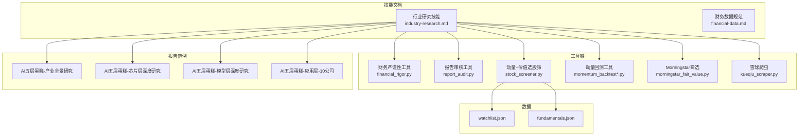
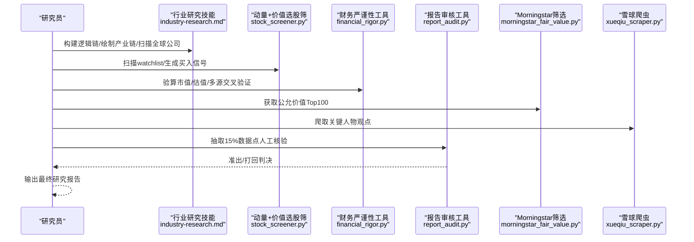
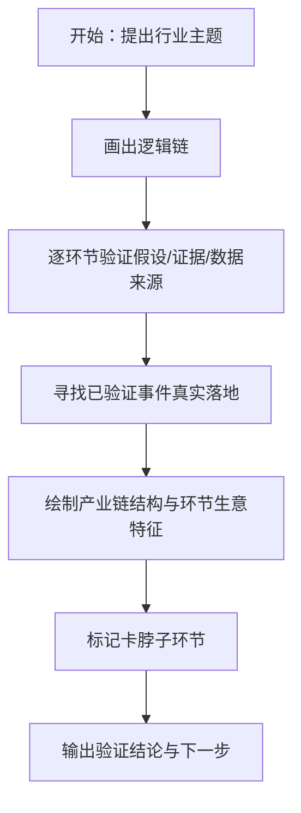
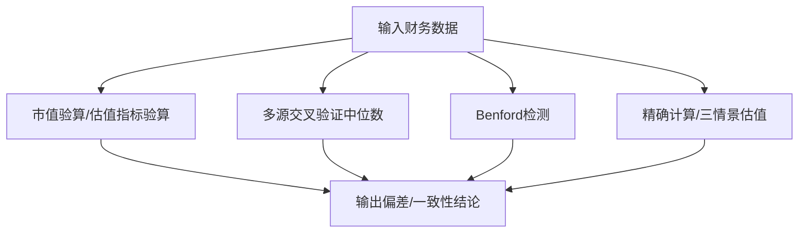
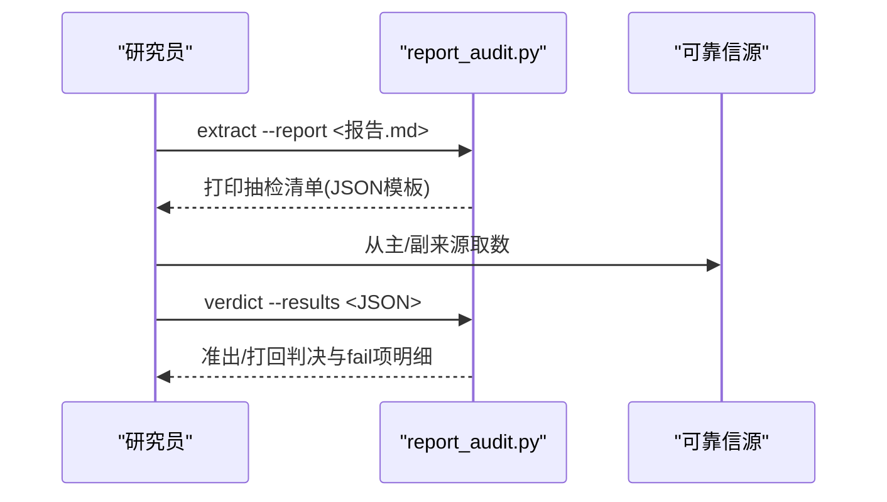
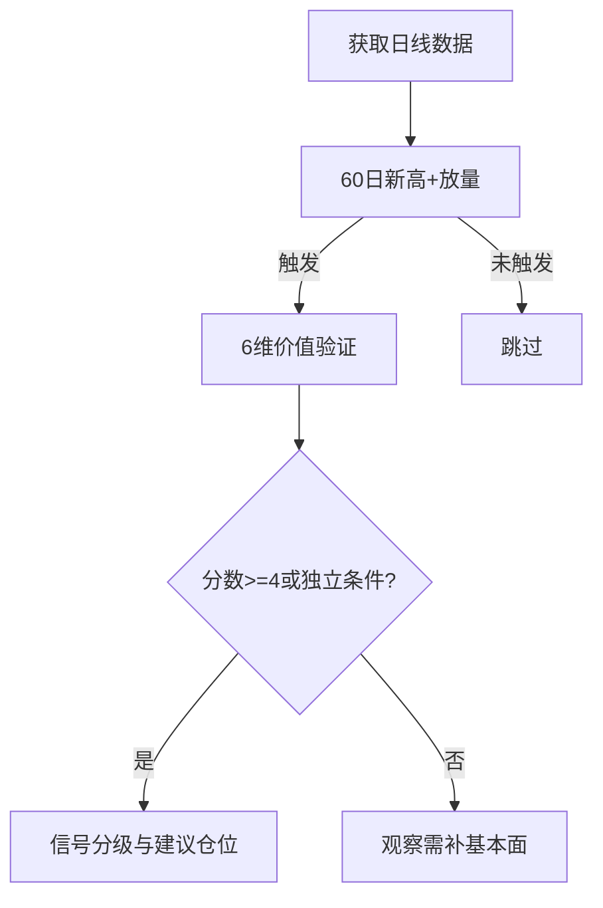
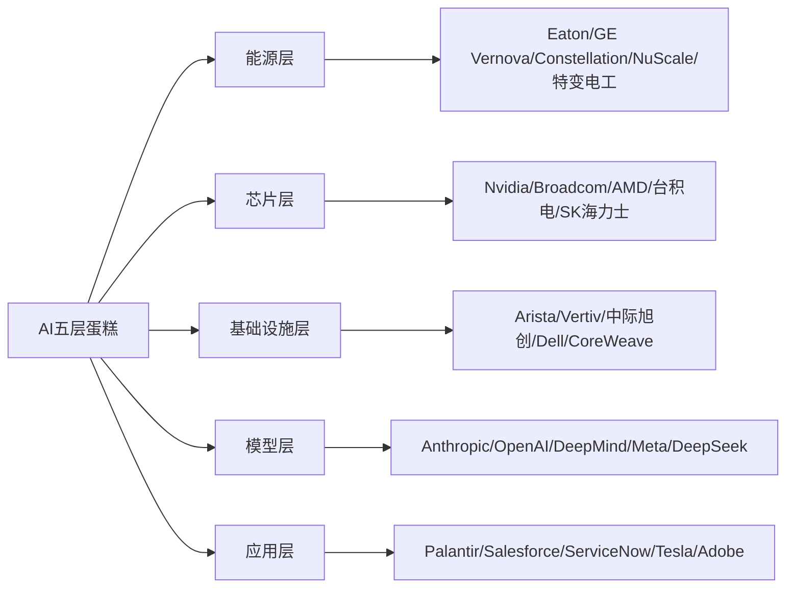
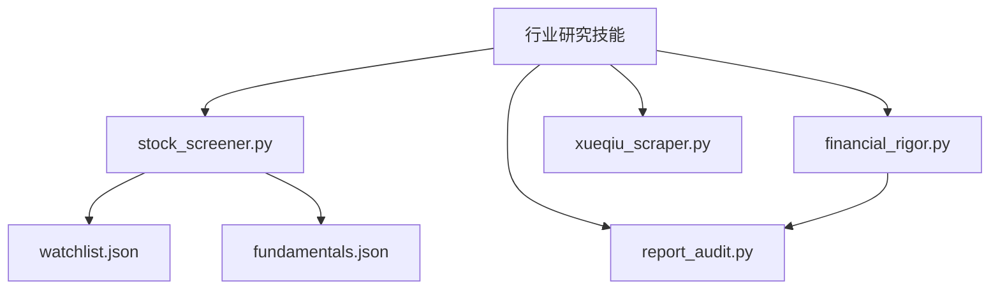

# 行业研究技能

<cite>
**本文档引用的文件**   
- [行业研究技能](file://skills/industry-research.md)
- [财务数据获取与交叉验证规范](file://skills/financial-data.md)
- [财务严谨性工具](file://tools/financial_rigor.py)
- [报告审核工具](file://tools/report_audit.py)
- [动量发现+价值验证选股筛](file://tools/stock_screener.py)
- [动量回测工具](file://tools/momentum_backtest.py)
- [动量回测工具v2](file://tools/momentum_backtest_v2.py)
- [Morningstar公允价值筛选](file://tools/morningstar_fair_value.py)
- [雪球爬虫](file://tools/xueqiu_scraper.py)
- [AI五层蛋糕-产业全景研究](file://reports/AI产业研究/AI五层蛋糕-产业全景研究-20260605.md)
- [AI五层蛋糕-第二层芯片层深度研究](file://reports/AI产业研究/AI五层蛋糕-第二层芯片层深度研究-20260605.md)
- [AI五层蛋糕-第四层模型层深度研究](file://reports/AI产业研究/AI五层蛋糕-第四层模型层深度研究-20260605.md)
- [AI五层蛋糕-第五层应用层-10家公司深度研究](file://reports/AI产业研究/AI五层蛋糕-第五层应用层-10家公司深度研究-20260605.md)
- [AI产业研究-目录](file://reports/AI产业研究/)
- [AI基建-光通信与存储-20260512](file://reports/AI基建-光通信与存储-20260512/)
- [AI未上市及新上市公司-9家逐一分析-20260516](file://reports/AI未上市及新上市公司-9家逐一分析-20260516.md)
- [AI算力-funnel-20260509](file://reports/AI算力-funnel-20260509.md)
- [AI模型-funnel-20260509](file://reports/AI模型-funnel-20260509.md)
- [AI基建电力-funnel-20260509](file://reports/AI基建电力-funnel-20260509.md)
- [AI轮动判断-20260509](file://reports/AI轮动判断-20260509.md)
- [AI产业研究-全球AI公司-估值与护城河全景扫描-20260519](file://reports/AI产业研究/全球AI公司-估值与护城河全景扫描-20260519.md)
- [AI产业研究-全球AI公司-公允价值vs当前股价-20260519](file://reports/AI产业研究/全球AI公司-公允价值vs当前股价-20260519.md)
- [AI产业研究-上海AI公司深度分析-8家-20260516](file://reports/AI产业研究/上海AI公司深度分析-8家-20260516.md)
- [AI产业研究-Temu-Shein-5年预测-2031](file://reports/AI产业研究/Temu-Shein-5年预测-2031-20260515.md)
- [AI产业研究-Temu-vs-Amazon-10年预测-20260515](file://reports/AI产业研究/Temu-vs-Amazon-10年预测-20260515.md)
- [AI产业研究-核对清单-多公司对比-checklist-20260408](file://reports/AI产业研究/多公司对比-checklist-20260408.md)
- [AI产业研究-大师持仓追踪-research-20260408](file://reports/AI产业研究/大师持仓追踪-research-20260408.md)
- [AI产业研究-巴菲特镜子测试-7家公司-20260419](file://reports/AI产业研究/巴菲特镜子测试-7家公司-20260419.md)
- [AI产业研究-腾讯-美团-PDD-5年股价相关性分析-20260501](file://reports/AI产业研究/腾讯-美团-PDD-5年股价相关性分析-20260501.md)
- [AI产业研究-腾讯-跨核心资产-10年轮动验证-20260501](file://reports/AI产业研究/腾讯-跨核心资产-10年轮动验证-20260501.md)
- [AI产业研究-腾讯vs阿里-护城河与估值深度对比-20260607](file://reports/AI产业研究/腾讯vs阿里-护城河与估值深度对比-20260607.md)
- [AI产业研究-茅台vs五粮液-护城河与估值深度对比-20260607](file://reports/AI产业研究/茅台vs五粮液-护城河与估值深度对比-20260607.md)
- [AI产业研究-蚂蚁系-5年估值全景-20260515](file://reports/AI产业研究/蚂蚁系-5年估值全景-20260515.md)
- [AI产业研究-选股计划-20260412](file://reports/AI产业研究/选股计划-20260412.md)
- [AI产业研究-10年不能卖-终极选股报告-20260616](file://reports/AI产业研究/10年不能卖-终极选股报告-20260616.md)
- [AI产业研究-7公司10年利润对决-买哪个-20260515](file://reports/AI产业研究/7公司10年利润对决-买哪个-20260515.md)
- [AI产业研究-全球AI公司-估值与护城河全景扫描-20260519](file://reports/AI产业研究/全球AI公司-估值与护城河全景扫描-20260519.md)
- [AI产业研究-全球AI公司-公允价值vs当前股价-20260519](file://reports/AI产业研究/全球AI公司-公允价值vs当前股价-20260519.md)
- [AI产业研究-上海AI公司深度分析-8家-20260516](file://reports/AI产业研究/上海AI公司深度分析-8家-20260516.md)
- [AI产业研究-Temu-Shein-5年预测-2031](file://reports/AI产业研究/Temu-Shein-5年预测-2031-20260515.md)
- [AI产业研究-Temu-vs-Amazon-10年预测-20260515](file://reports/AI产业研究/Temu-vs-Amazon-10年预测-20260515.md)
- [AI产业研究-核对清单-多公司对比-checklist-20260408](file://reports/AI产业研究/多公司对比-checklist-20260408.md)
- [AI产业研究-大师持仓追踪-research-20260408](file://reports/AI产业研究/大师持仓追踪-research-20260408.md)
- [AI产业研究-巴菲特镜子测试-7家公司-20260419](file://reports/AI产业研究/巴菲特镜子测试-7家公司-20260419.md)
- [AI产业研究-腾讯-美团-PDD-5年股价相关性分析-20260501](file://reports/AI产业研究/腾讯-美团-PDD-5年股价相关性分析-20260501.md)
- [AI产业研究-腾讯-跨核心资产-10年轮动验证-20260501](file://reports/AI产业研究/腾讯-跨核心资产-10年轮动验证-20260501.md)
- [AI产业研究-腾讯vs阿里-护城河与估值深度对比-20260607](file://reports/AI产业研究/腾讯vs阿里-护城河与估值深度对比-20260607.md)
- [AI产业研究-茅台vs五粮液-护城河与估值深度对比-20260607](file://reports/AI产业研究/茅台vs五粮液-护城河与估值深度对比-20260607.md)
- [AI产业研究-蚂蚁系-5年估值全景-20260515](file://reports/AI产业研究/蚂蚁系-5年估值全景-20260515.md)
- [AI产业研究-选股计划-20260412](file://reports/AI产业研究/选股计划-20260412.md)
- [AI产业研究-10年不能卖-终极选股报告-20260616](file://reports/AI产业研究/10年不能卖-终极选股报告-20260616.md)
- [AI产业研究-7公司10年利润对决-买哪个-20260515](file://reports/AI产业研究/7公司10年利润对决-买哪个-20260515.md)
- [watchlist.json](file://data/watchlist.json)
- [fundamentals.json](file://data/fundamentals.json)
</cite>

## 目录
1. [简介](#简介)
2. [项目结构](#项目结构)
3. [核心组件](#核心组件)
4. [架构总览](#架构总览)
5. [详细组件分析](#详细组件分析)
6. [依赖分析](#依赖分析)
7. [性能考虑](#性能考虑)
8. [故障排查指南](#故障排查指南)
9. [结论](#结论)
10. [附录](#附录)

## 简介
本文件面向AI Berkshire的行业研究团队，系统化阐述“行业主题扫描与深度研究”的工程化方法论与工具链。内容覆盖：
- 行业主题扫描与验证、产业链全景绘制、全球上市公司扫描与分级
- 四大师（段永平、巴菲特、芒格、李录）分析框架的标准化执行
- 行业级风险评估与系统性偏见识别
- 数据获取渠道、交叉验证与严谨性校验
- 趋势判断与文明范式定位
- 投资组合配置建议与信号体系
- 研究模板与分析框架（以AI产业为例）

## 项目结构
该项目将“研究方法论”固化为技能文档，“工具链”以命令行工具形式提供，配套“数据文件”与“报告模板”。AI产业研究报告作为实践范例，贯穿全链路。

图表来源
- [行业研究技能](file://skills/industry-research.md)
- [财务数据获取与交叉验证规范](file://skills/financial-data.md)
- [财务严谨性工具](file://tools/financial_rigor.py)
- [报告审核工具](file://tools/report_audit.py)
- [动量发现+价值验证选股筛](file://tools/stock_screener.py)
- [动量回测工具](file://tools/momentum_backtest.py)
- [动量回测工具v2](file://tools/momentum_backtest_v2.py)
- [Morningstar公允价值筛选](file://tools/morningstar_fair_value.py)
- [雪球爬虫](file://tools/xueqiu_scraper.py)
- [AI五层蛋糕-产业全景研究](file://reports/AI产业研究/AI五层蛋糕-产业全景研究-20260605.md)
- [AI五层蛋糕-第二层芯片层深度研究](file://reports/AI产业研究/AI五层蛋糕-第二层芯片层深度研究-20260605.md)
- [AI五层蛋糕-第四层模型层深度研究](file://reports/AI产业研究/AI五层蛋糕-第四层模型层深度研究-20260605.md)
- [AI五层蛋糕-第五层应用层-10家公司深度研究](file://reports/AI产业研究/AI五层蛋糕-第五层应用层-10家公司深度研究-20260605.md)

章节来源
- [行业研究技能](file://skills/industry-research.md)
- [财务数据获取与交叉验证规范](file://skills/financial-data.md)
- [财务严谨性工具](file://tools/financial_rigor.py)
- [报告审核工具](file://tools/report_audit.py)
- [动量发现+价值验证选股筛](file://tools/stock_screener.py)
- [动量回测工具](file://tools/momentum_backtest.py)
- [动量回测工具v2](file://tools/momentum_backtest_v2.py)
- [Morningstar公允价值筛选](file://tools/morningstar_fair_value.py)
- [雪球爬虫](file://tools/xueqiu_scraper.py)
- [AI五层蛋糕-产业全景研究](file://reports/AI产业研究/AI五层蛋糕-产业全景研究-20260605.md)
- [AI五层蛋糕-第二层芯片层深度研究](file://reports/AI产业研究/AI五层蛋糕-第二层芯片层深度研究-20260605.md)
- [AI五层蛋糕-第四层模型层深度研究](file://reports/AI产业研究/AI五层蛋糕-第四层模型层深度研究-20260605.md)
- [AI五层蛋糕-第五层应用层-10家公司深度研究](file://reports/AI产业研究/AI五层蛋糕-第五层应用层-10家公司深度研究-20260605.md)

## 核心组件
- 研究方法论（industry-research.md）：定义“逻辑链构建与验证—产业链全景—全球扫描—四大师分析—风险评估—文明趋势—组合建议—准出流程”的八步法。
- 数据规范（financial-data.md）：统一数据源优先级、交叉验证与呈现格式。
- 工具链：
  - 财务严谨性工具（financial_rigor.py）：市值/估值验算、多源交叉验证、Benford检测、精确计算器、三情景估值。
  - 报告审核工具（report_audit.py）：从报告抽取15%数据点，人工核验，输出准出/打回。
  - 动量+价值选股筛（stock_screener.py）：60日新高+放量+6维价值验证，信号分级。
  - 动量回测（momentum_backtest*.py）：基于历史价格与手工录入基本面回测框架有效性。
  - Morningstar筛选（morningstar_fair_value.py）：抓取公允价值估计，计算潜在涨幅Top100。
  - 雪球爬虫（xueqiu_scraper.py）：按关键词筛选雪球用户原发言，支持断点续爬与离线缓存。
- 数据文件：
  - watchlist.json：默认关注清单（AI芯片/应用/基础设施/加密货币/港股互联网/A股）。
  - fundamentals.json：交互式更新/维护季度财务数据（营收YoY、毛利率、EPS超预期）。

章节来源
- [行业研究技能](file://skills/industry-research.md)
- [财务数据获取与交叉验证规范](file://skills/financial-data.md)
- [财务严谨性工具](file://tools/financial_rigor.py)
- [报告审核工具](file://tools/report_audit.py)
- [动量发现+价值验证选股筛](file://tools/stock_screener.py)
- [动量回测工具](file://tools/momentum_backtest.py)
- [动量回测工具v2](file://tools/momentum_backtest_v2.py)
- [Morningstar公允价值筛选](file://tools/morningstar_fair_value.py)
- [雪球爬虫](file://tools/xueqiu_scraper.py)
- [watchlist.json](file://data/watchlist.json)
- [fundamentals.json](file://data/fundamentals.json)

## 架构总览
下图展示从“主题扫描”到“报告发布”的端到端流程，强调“数据-工具-报告-审核”的闭环。

图表来源
- [行业研究技能](file://skills/industry-research.md)
- [动量发现+价值验证选股筛](file://tools/stock_screener.py)
- [财务严谨性工具](file://tools/financial_rigor.py)
- [报告审核工具](file://tools/report_audit.py)
- [Morningstar公允价值筛选](file://tools/morningstar_fair_value.py)
- [雪球爬虫](file://tools/xueqiu_scraper.py)

## 详细组件分析

### 1) 行业主题扫描与验证（逻辑链与已验证事件）
- 逻辑链：从“底层趋势”→“需求变化”→“瓶颈/刚需”→“受益产业链”，逐环验证。
- 已验证事件：优先引用“已签约/已落地”的真实商业事件（大公司采购协议、政策文件、行业报告）。
- 反偏见：避免成熟/新兴/龙头/上市/英文偏见，主动搜索“冷门但可能优质”的标的，并标注“信息充分度”。

图表来源
- [行业研究技能](file://skills/industry-research.md)

章节来源
- [行业研究技能](file://skills/industry-research.md)

### 2) 产业链全景绘制与分级
- 结构：上游→中游→下游→辅助环节（材料/设备/系统/服务/检测/认证/维护/金融工具）。
- 环节特征：商业模式、毛利率区间、竞争格局、护城河类型、周期性。
- 瓶颈识别：供给紧张、替代困难、利润率高。
- 全球扫描：A股/港股/美股/国际+ETF+关键未上市公司，按Tier分级（大/中/小/多元）。

章节来源
- [行业研究技能](file://skills/industry-research.md)

### 3) 四大师分析框架（段永平+巴菲特+芒格+李录）
- 段永平：生意本质（一句话定义、收入结构/增速、毛利率/净利率/现金流、追问“是否好生意”）
- 巴菲特：护城河（品牌/转换成本/网络效应/规模效应/技术/牌照，强度与证据，追问“10年后还在吗？”）
- 芒格：风险（最可能的失败路径、最坏情景值多少钱、聪明人为什么不买）
- 李录：文明趋势（范式转移 vs 阶段性热潮、历史类比、20-30年终局、赢家通吃/被颠覆环节）
- 估值快照与推荐度：当前PE/PS/EV/EBITDA、与对手对比、简评与星级推荐

章节来源
- [行业研究技能](file://skills/industry-research.md)

### 4) 行业级风险评估与系统性偏见
- 系统性风险清单：逻辑链被证伪、替代技术、政策/监管黑天鹅、需求周期性回调、估值泡沫破裂。
- 历史类比：找到相似主题的最终赢家、多数投资者盈亏、对当前启示。
- 偏误自查：叙事偏差、锚定效应、从众效应。

章节来源
- [行业研究技能](file://skills/industry-research.md)

### 5) 投资组合配置与信号体系
- 组合层级：核心仓位（50-60%）、卫星仓位（25-35%）、期权仓位（5-15%）、ETF替代。
- 买入/卖出信号：加仓/减仓/清仓的具体条件。
- 主题仓位上限：依据逻辑链确定性与风险建议占总仓位上限。

章节来源
- [行业研究技能](file://skills/industry-research.md)

### 6) 数据获取与交叉验证规范
- 数据源优先级：美股（macrotrends为主、stockanalysis为辅、SEC为原始）、港股（aastocks为主、macrotrends ADR为辅、HKEX为原始）、A股（eastmoney为主、cninfo为辅）。
- 执行规范：每个关键数据来自两个独立来源，误差>1%标注；呈现格式统一；常见差异原因（GAAP/Non-GAAP、汇率、财年、合并口径、更新滞后）。
- 特别规则：未上市公司仅估计、季度vs年度优先年度、原始财报优先。

章节来源
- [财务数据获取与交叉验证规范](file://skills/financial-data.md)

### 7) 财务严谨性工具（financial_rigor.py）
- 功能模块：
  - 市值验算（股价×总股本 vs 报告市值，偏差阈值5%）
  - 估值指标验算（PE/PB/PS/FCF Yield/股息率等）
  - 多源交叉验证（中位数参考、容差2%）
  - Benford定律检测（财务数据造假筛查）
  - 精确计算器（十进制无浮点漂移）
  - 三情景估值（乐观/中性/悲观）
- 使用建议：在报告关键财务点执行交叉验证与严谨性检查，确保结论可审计复现。

图表来源
- [财务严谨性工具](file://tools/financial_rigor.py)

章节来源
- [财务严谨性工具](file://tools/financial_rigor.py)

### 8) 报告审核工具（report_audit.py）
- 工作流程：
  - Step 1：从报告抽取数据点，随机抽样15%，输出抽检清单（含主/副来源指引）
  - Step 2：人工从可靠信源取数，填入fetched_value/来源
  - Step 3：工具输出准出/打回判决，fail项明细与原因
- 抽检规则：1%容差，两来源不一致视为警告，需人工复核；全部通过方可发布。

图表来源
- [报告审核工具](file://tools/report_audit.py)

章节来源
- [报告审核工具](file://tools/report_audit.py)

### 9) 动量+价值选股筛（stock_screener.py）
- 第一层：60日新高+放量确认（近5日均量>20日均量×1.5）
- 第二层：6维价值验证（营收加速、毛利率扩张/健康、EPS超预期、营收高增长、毛利率连续改善）
- 信号分级：3/6试探仓3%、4/6标准仓5%、≥5/6确信仓8%；独立条件（毛利率连续改善>45%或EPS超预期>30%）可降级通过
- 数据来源：Yahoo Finance日线、本地fundamentals.json

图表来源
- [动量发现+价值验证选股筛](file://tools/stock_screener.py)

章节来源
- [动量发现+价值验证选股筛](file://tools/stock_screener.py)
- [watchlist.json](file://data/watchlist.json)
- [fundamentals.json](file://data/fundamentals.json)

### 10) 动量回测工具（momentum_backtest*.py）
- 目标：验证框架在AI浪潮早期能否捕捉AI芯片三巨头（NVDA/AMD/MU）。
- 方法：历史价格+手工录入季度基本面，计算动量信号与价值验证得分，统计胜率与收益。
- 结果：框架在拐点前后具备较强信号识别能力，建议结合基本面独立条件使用。

章节来源
- [动量回测工具](file://tools/momentum_backtest.py)
- [动量回测工具v2](file://tools/momentum_backtest_v2.py)

### 11) Morningstar公允价值筛选（morningstar_fair_value.py）
- 功能：抓取Morningstar筛选器API，计算公允价值与当前价格的潜在涨幅，输出Top100。
- 用途：辅助发现被低估且具备“护城河”标签的股票。

章节来源
- [Morningstar公允价值筛选](file://tools/morningstar_fair_value.py)

### 12) 雪球爬虫（xueqiu_scraper.py）
- 功能：登录态复用、双通道fetch、断点续爬、反限流、纯转发过滤，支持离线缓存与关键词筛选。
- 用途：采集段永平等关键人物关于特定主题的原发言，形成“观点证据链”。

章节来源
- [雪球爬虫](file://tools/xueqiu_scraper.py)

### 13) 实践范例：AI产业研究
- 五层框架：能源层（最被低估的瓶颈）、芯片层（价值最密集）、基础设施层（军备竞赛）、模型层（收入爆炸式增长）、应用层（真正赚钱的极少但性价比差异极大）。
- 深度研究：芯片层（SK海力士、台积电、Ibiden等）、模型层（Reddit、Scale AI、Anthropic等）、应用层（Salesforce、Adobe、ServiceNow等）。
- 报告模板：包含“选股标准”“框架定义”“各层代表性公司”“中国对标”“投资视角总结”等结构化模块。

图表来源
- [AI五层蛋糕-产业全景研究](file://reports/AI产业研究/AI五层蛋糕-产业全景研究-20260605.md)
- [AI五层蛋糕-第二层芯片层深度研究](file://reports/AI产业研究/AI五层蛋糕-第二层芯片层深度研究-20260605.md)
- [AI五层蛋糕-第四层模型层深度研究](file://reports/AI产业研究/AI五层蛋糕-第四层模型层深度研究-20260605.md)
- [AI五层蛋糕-第五层应用层-10家公司深度研究](file://reports/AI产业研究/AI五层蛋糕-第五层应用层-10家公司深度研究-20260605.md)

章节来源
- [AI五层蛋糕-产业全景研究](file://reports/AI产业研究/AI五层蛋糕-产业全景研究-20260605.md)
- [AI五层蛋糕-第二层芯片层深度研究](file://reports/AI产业研究/AI五层蛋糕-第二层芯片层深度研究-20260605.md)
- [AI五层蛋糕-第四层模型层深度研究](file://reports/AI产业研究/AI五层蛋糕-第四层模型层深度研究-20260605.md)
- [AI五层蛋糕-第五层应用层-10家公司深度研究](file://reports/AI产业研究/AI五层蛋糕-第五层应用层-10家公司深度研究-20260605.md)

## 依赖分析
- 组件耦合：
  - stock_screener.py依赖Yahoo Finance与本地fundamentals.json；与watchlist.json配合使用。
  - financial_rigor.py与report_audit.py相互补充：前者保证数据严谨，后者保证报告质量。
  - xueqiu_scraper.py与industry-research.md的“已验证事件”环节互补。
- 外部依赖：
  - Yahoo Finance API、Morningstar API、雪球网页、macrotrends/aastocks/eastmoney等外部数据源。
- 潜在循环依赖：无；工具均为独立CLI，通过文件/命令行参数耦合。

图表来源
- [行业研究技能](file://skills/industry-research.md)
- [动量发现+价值验证选股筛](file://tools/stock_screener.py)
- [财务严谨性工具](file://tools/financial_rigor.py)
- [报告审核工具](file://tools/report_audit.py)
- [雪球爬虫](file://tools/xueqiu_scraper.py)
- [watchlist.json](file://data/watchlist.json)
- [fundamentals.json](file://data/fundamentals.json)

章节来源
- [行业研究技能](file://skills/industry-research.md)
- [动量发现+价值验证选股筛](file://tools/stock_screener.py)
- [财务严谨性工具](file://tools/financial_rigor.py)
- [报告审核工具](file://tools/report_audit.py)
- [雪球爬虫](file://tools/xueqiu_scraper.py)
- [watchlist.json](file://data/watchlist.json)
- [fundamentals.json](file://data/fundamentals.json)

## 性能考虑
- 爬虫与API调用：
  - 雪球爬虫设置随机抖动与长休，避免触发限流；断点续爬减少重复工作。
  - Yahoo Finance与Morningstar请求添加User-Agent，必要时增加延时。
- 数据处理：
  - financial_rigor.py使用十进制精确计算，避免浮点误差；report_audit.py对抽检样本进行固定随机种子可复现。
- 批处理与缓存：
  - xueqiu_scraper.py支持全量缓存与离线过滤，降低重复抓取成本。
  - stock_screener.py默认watchlist初始化，避免每次重复下载。

## 故障排查指南
- 报告审核打回：
  - 若抽检项误差>1%，检查数据来源与单位一致性；若两来源不一致，标注“口径差异（GAAP/Non-GAAP/汇率）”并人工复核。
  - 若多处不通过，优先核查原始财报（SEC/年报PDF）。
- 财务严谨性异常：
  - 市值验算偏差>5%：检查股本是否最新、币种单位、股价时效。
  - 多源交叉验证不一致：优先采用年报/交易所数据，标注差异原因。
- 动量信号缺失：
  - 检查价格数据长度（至少120日）、成交量数据完整性；适当放宽放量阈值。
- Morningstar筛选为空：
  - 检查网络与API参数；必要时手动访问网站确认数据可用性。
- 雪球爬虫失败：
  - 检查登录态有效期、环境变量XQ_PHONE/XQ_PASSWORD；必要时删除state文件重新登录。

章节来源
- [报告审核工具](file://tools/report_audit.py)
- [财务严谨性工具](file://tools/financial_rigor.py)
- [动量发现+价值验证选股筛](file://tools/stock_screener.py)
- [Morningstar公允价值筛选](file://tools/morningstar_fair_value.py)
- [雪球爬虫](file://tools/xueqiu_scraper.py)

## 结论
本技能体系将“行业研究方法论”与“工程化工具链”深度融合，形成“主题扫描→数据验证→报告审核→发布”的闭环。借助标准化的四大师分析框架、严格的交叉验证与严谨性校验、以及AI产业研究范例，团队可在高频信息环境中保持研究质量与可复现性，提升行业洞察的确定性与安全性。

## 附录
- 研究模板与分析框架（AI产业为例）：
  - 五层框架与各层代表公司
  - 中国对标与全球差距
  - 投资视角总结与信号体系
- 相关报告集合：
  - AI产业研究目录、AI基建系列、AI轮动与预测、AI公司估值与护城河扫描等

章节来源
- [AI产业研究-目录](file://reports/AI产业研究/)
- [AI基建-光通信与存储-20260512](file://reports/AI基建-光通信与存储-20260512/)
- [AI未上市及新上市公司-9家逐一分析-20260516](file://reports/AI未上市及新上市公司-9家逐一分析-20260516.md)
- [AI算力-funnel-20260509](file://reports/AI算力-funnel-20260509.md)
- [AI模型-funnel-20260509](file://reports/AI模型-funnel-20260509.md)
- [AI基建电力-funnel-20260509](file://reports/AI基建电力-funnel-20260509.md)
- [AI轮动判断-20260509](file://reports/AI轮动判断-20260509.md)
- [AI产业研究-全球AI公司-估值与护城河全景扫描-20260519](file://reports/AI产业研究/全球AI公司-估值与护城河全景扫描-20260519.md)
- [AI产业研究-全球AI公司-公允价值vs当前股价-20260519](file://reports/AI产业研究/全球AI公司-公允价值vs当前股价-20260519.md)
- [AI产业研究-上海AI公司深度分析-8家-20260516](file://reports/AI产业研究/上海AI公司深度分析-8家-20260516.md)
- [AI产业研究-Temu-Shein-5年预测-2031](file://reports/AI产业研究/Temu-Shein-5年预测-2031-20260515.md)
- [AI产业研究-Temu-vs-Amazon-10年预测-20260515](file://reports/AI产业研究/Temu-vs-Amazon-10年预测-20260515.md)
- [AI产业研究-核对清单-多公司对比-checklist-20260408](file://reports/AI产业研究/多公司对比-checklist-20260408.md)
- [AI产业研究-大师持仓追踪-research-20260408](file://reports/AI产业研究/大师持仓追踪-research-20260408.md)
- [AI产业研究-巴菲特镜子测试-7家公司-20260419](file://reports/AI产业研究/巴菲特镜子测试-7家公司-20260419.md)
- [AI产业研究-腾讯-美团-PDD-5年股价相关性分析-20260501](file://reports/AI产业研究/腾讯-美团-PDD-5年股价相关性分析-20260501.md)
- [AI产业研究-腾讯-跨核心资产-10年轮动验证-20260501](file://reports/AI产业研究/腾讯-跨核心资产-10年轮动验证-20260501.md)
- [AI产业研究-腾讯vs阿里-护城河与估值深度对比-20260607](file://reports/AI产业研究/腾讯vs阿里-护城河与估值深度对比-20260607.md)
- [AI产业研究-茅台vs五粮液-护城河与估值深度对比-20260607](file://reports/AI产业研究/茅台vs五粮液-护城河与估值深度对比-20260607.md)
- [AI产业研究-蚂蚁系-5年估值全景-20260515](file://reports/AI产业研究/蚂蚁系-5年估值全景-20260515.md)
- [AI产业研究-选股计划-20260412](file://reports/AI产业研究/选股计划-20260412.md)
- [AI产业研究-10年不能卖-终极选股报告-20260616](file://reports/AI产业研究/10年不能卖-终极选股报告-20260616.md)
- [AI产业研究-7公司10年利润对决-买哪个-20260515](file://reports/AI产业研究/7公司10年利润对决-买哪个-20260515.md)