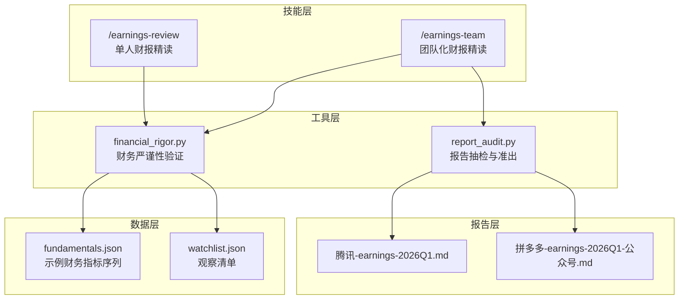
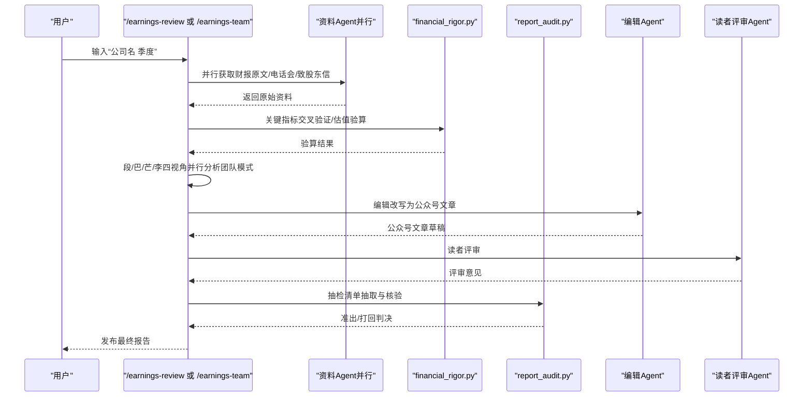
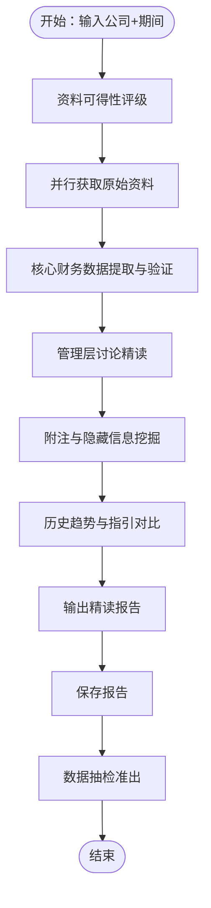
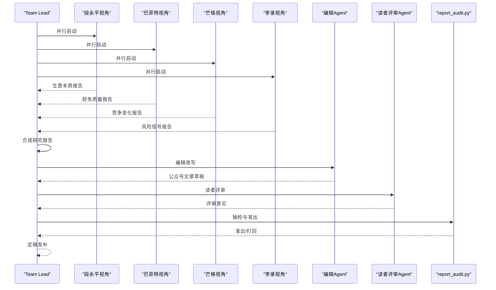
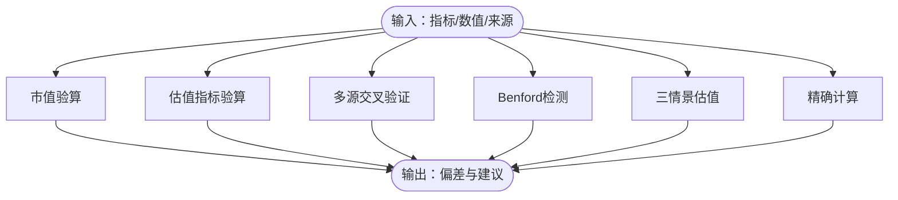
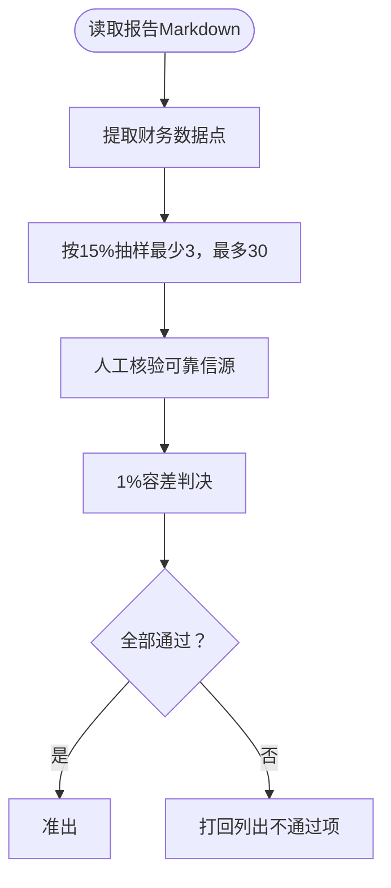
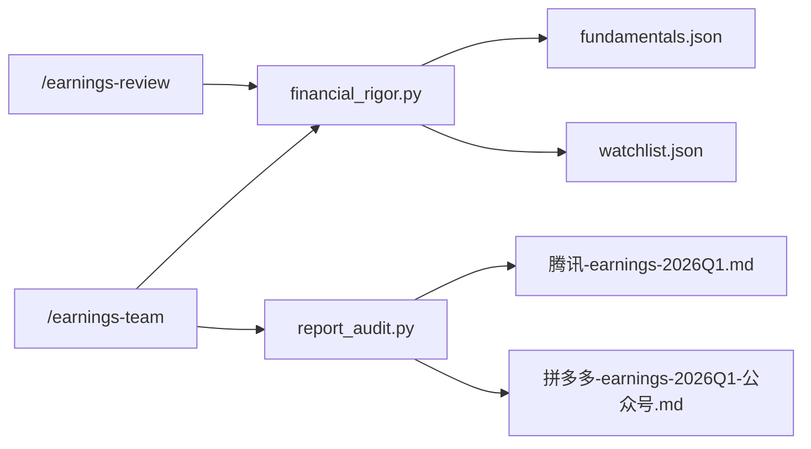

# 财报精读技能

<cite>
**本文引用的文件**
- [earnings-review.md](file://skills/earnings-review.md)
- [earnings-team.md](file://skills/earnings-team.md)
- [financial-data.md](file://skills/financial-data.md)
- [financial_rigor.py](file://tools/financial_rigor.py)
- [report_audit.py](file://tools/report_audit.py)
- [fundamentals.json](file://data/fundamentals.json)
- [watchlist.json](file://data/watchlist.json)
- [腾讯-earnings-2026Q1.md](file://reports/腾讯/腾讯-earnings-2026Q1.md)
- [拼多多-earnings-2026Q1-公众号.md](file://reports/拼多多/拼多多-earnings-2026Q1-公众号.md)
</cite>

## 目录
1. [简介](#简介)
2. [项目结构](#项目结构)
3. [核心组件](#核心组件)
4. [架构总览](#架构总览)
5. [详细组件分析](#详细组件分析)
6. [依赖关系分析](#依赖关系分析)
7. [性能考量](#性能考量)
8. [故障排查指南](#故障排查指南)
9. [结论](#结论)
10. [附录](#附录)

## 简介
本技能面向AI Berkshire的“财报精读”能力，围绕季度/年报财报的系统化分析流程，提供从原始资料获取、关键指标提取与交叉验证、趋势与同比/环比分析、异常数据识别，到财报质量评估、财务比率分析、现金流分析与盈利质量判断的完整闭环。技能同时内置“团队化精读”流程，结合段永平（生意本质）、巴菲特（财务质量）、芒格（竞争变化）、李录（风险信号）四大视角，辅以编辑与读者评审，最终输出可直接发布的公众号文章，并通过数据抽检保障质量。

## 项目结构
- 技能层：提供两类财报精读技能
  - 单人精读：/earnings-review
  - 团队精读：/earnings-team（四大师并行 + 编辑 + 读者评审）
- 工具层：财务严谨性与报告抽检工具
  - tools/financial_rigor.py：市值/估值/多源交叉验证/贝叶斯定律检测/三情景估值/精确计算
  - tools/report_audit.py：报告抽检清单抽取与准出/打回判决
- 数据层：示例数据与观察清单
  - data/fundamentals.json：示例财务指标序列（如收入同比、毛利率、EPS超预期幅度）
  - data/watchlist.json：行业/主题观察清单（如AI芯片、AI应用、港股互联网等）
- 报告层：示例财报精读报告
  - reports/腾讯/腾讯-earnings-2026Q1.md
  - reports/拼多多/拼多多-earnings-2026Q1-公众号.md

图表来源
- [earnings-review.md:1-219](file://skills/earnings-review.md#L1-L219)
- [earnings-team.md:1-457](file://skills/earnings-team.md#L1-L457)
- [financial_rigor.py:1-452](file://tools/financial_rigor.py#L1-L452)
- [report_audit.py:1-523](file://tools/report_audit.py#L1-L523)
- [fundamentals.json:1-36](file://data/fundamentals.json#L1-L36)
- [watchlist.json:1-38](file://data/watchlist.json#L1-L38)
- [腾讯-earnings-2026Q1.md:1-119](file://reports/腾讯/腾讯-earnings-2026Q1.md#L1-L119)
- [拼多多-earnings-2026Q1-公众号.md:1-167](file://reports/拼多多/拼多多-earnings-2026Q1-公众号.md#L1-L167)

章节来源
- [earnings-review.md:1-219](file://skills/earnings-review.md#L1-L219)
- [earnings-team.md:1-457](file://skills/earnings-team.md#L1-L457)
- [financial_rigor.py:1-452](file://tools/financial_rigor.py#L1-L452)
- [report_audit.py:1-523](file://tools/report_audit.py#L1-L523)
- [fundamentals.json:1-36](file://data/fundamentals.json#L1-L36)
- [watchlist.json:1-38](file://data/watchlist.json#L1-L38)
- [腾讯-earnings-2026Q1.md:1-119](file://reports/腾讯/腾讯-earnings-2026Q1.md#L1-L119)
- [拼多多-earnings-2026Q1-公众号.md:1-167](file://reports/拼多多/拼多多-earnings-2026Q1-公众号.md#L1-L167)

## 核心组件
- 技能：/earnings-review（单人精读）
  - 要求输入格式：公司名 季度（如“腾讯 2025Q4”、“PDD 2025年报”、“美团 最新”）
  - 关键流程：资料可得性评级 → 获取一手资料 → 核心财务数据提取与验证 → 管理层讨论精读 → 附注与隐藏信息挖掘 → 历史趋势与指引对比 → 输出精读报告 → 保存报告 → 数据抽检（准出）
- 技能：/earnings-team（团队化精读）
  - 四大师并行：段永平（生意本质）、巴菲特（财务质量）、芒格（竞争变化）、李录（风险信号）
  - 流程：资料获取与评级 → 四个Agent并行 → Team Lead合成 → 编辑改写 → 读者评审 → 定稿 → 报告抽检
- 工具：financial_rigor.py
  - 市值验算、估值指标验算、多源交叉验证、Benford定律检测、三情景估值、精确计算
- 工具：report_audit.py
  - 从报告中抽取15%数据点，与可靠信源比对，输出准出/打回判决
- 数据：fundamentals.json、watchlist.json
  - 提供示例财务指标序列与观察清单，辅助趋势分析与主题跟踪

章节来源
- [earnings-review.md:22-219](file://skills/earnings-review.md#L22-L219)
- [earnings-team.md:18-457](file://skills/earnings-team.md#L18-L457)
- [financial_rigor.py:1-452](file://tools/financial_rigor.py#L1-L452)
- [report_audit.py:1-523](file://tools/report_audit.py#L1-L523)
- [fundamentals.json:1-36](file://data/fundamentals.json#L1-L36)
- [watchlist.json:1-38](file://data/watchlist.json#L1-L38)

## 架构总览
整体架构分为“输入与前置”“分析与验证”“合成与发布”“抽检与准出”四个阶段，贯穿单人与团队两种模式。

图表来源
- [earnings-review.md:22-219](file://skills/earnings-review.md#L22-L219)
- [earnings-team.md:20-457](file://skills/earnings-team.md#L20-L457)
- [financial_rigor.py:1-452](file://tools/financial_rigor.py#L1-L452)
- [report_audit.py:1-523](file://tools/report_audit.py#L1-L523)

## 详细组件分析

### 组件A：单人财报精读（/earnings-review）
- 资料可得性评级（A/B/C级）决定后续分析深度与附注权重
- 核心财务数据提取与验证
  - 收入/利润表：收入、分业务/分地区拆解、毛利/毛利率、经营利润/利润率（GAAP/Non-GAAP）、净利润、EPS（基本/稀释）
  - 现金流表：经营现金流 vs 净利润比率、资本开支构成（维护性/扩张性）、自由现金流、回购/分红、现金及等价物期末余额
  - 资产负债表：现金+短期投资 vs 有息负债、净现金/净负债趋势、应收账款/存货周转天数、商誉/无形资产占比
- 管理层讨论精读（MD&A）
  - 语气信号：坦诚/清晰/模糊/转移/归因外部化
  - 承诺追踪：上期承诺 vs 本期兑现
  - 关键问题识别：分析师尖锐问题与回答质量
- 附注与隐藏信息挖掘
  - 关联交易、股权激励稀释、或有负债、会计政策变更、分部信息、客户/供应商集中度
  - 异常信号检测：应收账款/存货增速>收入增速、经营现金流<净利润且差距扩大、资本化支出突然增加、非经常性收益占比上升
- 历史趋势与指引对比
  - 至少4个季度/3年年报的时间序列趋势判断
  - 管理层指引与实际结果对比
- 输出与保存
  - 报告结构：核心数据速览、本期最重要的3个变化、管理层语气与承诺追踪、附注中的隐藏信息、关键问题、与投资论文的关系、结论
  - 结论必须明确：超/符/低预期；对投资论文的影响；下一个催化剂；持有/减仓/加仓建议
- 数据抽检（准出）
  - extract抽取抽检清单，verdict输出准出/打回

图表来源
- [earnings-review.md:22-219](file://skills/earnings-review.md#L22-L219)

章节来源
- [earnings-review.md:22-219](file://skills/earnings-review.md#L22-L219)

### 组件B：团队化财报精读（/earnings-team）
- 四大师并行研究
  - 段永平：生意本质（收入结构、用户价值、护城河、好生意标准、管理层产品直觉）
  - 巴菲特：财务质量（GAAP/Non-GAAP差异、现金流分析、利润质量、资产负债表健康度、估值与安全边际）
  - 芒格：竞争变化（收入增速vs行业、毛利率变化、营销费用率、研发投入、竞争对手对比、管理层竞争讨论、行业趋势、逆向思考）
  - 李录：风险信号（语气信号、承诺追踪、附注隐藏信息、电话会Q&A、永久性资本损失风险）
- 合成与发布
  - Team Lead综合四个视角的共识与矛盾，产出研究报告初稿
  - 编辑Agent改写为公众号文章，遵循真人风格、结构优化、读者价值检测
  - 读者评审Agent以普通投资者视角提出修改意见
  - 定稿后执行报告抽检（准出/打回）

图表来源
- [earnings-team.md:20-457](file://skills/earnings-team.md#L20-L457)
- [report_audit.py:1-523](file://tools/report_audit.py#L1-L523)

章节来源
- [earnings-team.md:20-457](file://skills/earnings-team.md#L20-L457)
- [report_audit.py:1-523](file://tools/report_audit.py#L1-L523)

### 组件C：财务严谨性工具（financial_rigor.py）
- 市值验算：股价×总股本 vs 报告市值，偏差>5%提示核查
- 估值指标验算：PE、PB、ROE、P/FCF、FCF收益率、股息率、PS等
- 多源交叉验证：基于中位数的容差阈值（默认2%），输出共识值
- Benford定律检测：对财务数据首位数字分布进行MAD/卡方检验，辅助异常识别
- 三情景估值：基于乐观/中性/悲观的年增长率与目标PE，计算目标股价与涨跌幅
- 精确计算：使用十进制避免浮点误差

图表来源
- [financial_rigor.py:61-452](file://tools/financial_rigor.py#L61-L452)

章节来源
- [financial_rigor.py:61-452](file://tools/financial_rigor.py#L61-L452)

### 组件D：报告抽检工具（report_audit.py）
- 数据点提取：从Markdown报告中识别财务数据点（表格、KV行、加粗数字），过滤噪声标签
- 抽样策略：按15%比例随机抽取，最少3个、最多30个，支持固定随机种子
- 准出/打回判决：以1%容差比较报告值与核验值，输出通过/警告/不通过明细与总结

图表来源
- [report_audit.py:155-523](file://tools/report_audit.py#L155-L523)

章节来源
- [report_audit.py:155-523](file://tools/report_audit.py#L155-L523)

### 组件E：数据与观察清单（fundamentals.json、watchlist.json）
- fundamentals.json：示例财务指标序列（如收入同比、毛利率、EPS超预期幅度），便于趋势分析与模板化
- watchlist.json：主题/行业观察清单（如AI芯片、AI应用、港股互联网等），辅助筛选与对比

章节来源
- [fundamentals.json:1-36](file://data/fundamentals.json#L1-L36)
- [watchlist.json:1-38](file://data/watchlist.json#L1-L38)

## 依赖关系分析
- 技能与工具的耦合
  - /earnings-review与financial_rigor.py：在核心财务数据提取与验证阶段调用
  - /earnings-team与financial_rigor.py：在财务质量审计阶段调用
  - /earnings-team与report_audit.py：在编辑与读者评审后执行抽检
- 数据依赖
  - fundamentals.json与watchlist.json为示例数据，服务于趋势分析与主题跟踪
- 报告依赖
  - 腾讯与拼多多的示例报告展示了完整的分析流程与输出结构

图表来源
- [earnings-review.md:22-219](file://skills/earnings-review.md#L22-L219)
- [earnings-team.md:20-457](file://skills/earnings-team.md#L20-L457)
- [financial_rigor.py:1-452](file://tools/financial_rigor.py#L1-L452)
- [report_audit.py:1-523](file://tools/report_audit.py#L1-L523)
- [fundamentals.json:1-36](file://data/fundamentals.json#L1-L36)
- [watchlist.json:1-38](file://data/watchlist.json#L1-L38)
- [腾讯-earnings-2026Q1.md:1-119](file://reports/腾讯/腾讯-earnings-2026Q1.md#L1-L119)
- [拼多多-earnings-2026Q1-公众号.md:1-167](file://reports/拼多多/拼多多-earnings-2026Q1-公众号.md#L1-L167)

章节来源
- [earnings-review.md:22-219](file://skills/earnings-review.md#L22-L219)
- [earnings-team.md:20-457](file://skills/earnings-team.md#L20-L457)
- [financial_rigor.py:1-452](file://tools/financial_rigor.py#L1-L452)
- [report_audit.py:1-523](file://tools/report_audit.py#L1-L523)
- [fundamentals.json:1-36](file://data/fundamentals.json#L1-L36)
- [watchlist.json:1-38](file://data/watchlist.json#L1-L38)
- [腾讯-earnings-2026Q1.md:1-119](file://reports/腾讯/腾讯-earnings-2026Q1.md#L1-L119)
- [拼多多-earnings-2026Q1-公众号.md:1-167](file://reports/拼多多/拼多多-earnings-2026Q1-公众号.md#L1-L167)

## 性能考量
- 并行资料获取：通过Task工具并行启动多个Agent，缩短等待时间
- 抽样抽检：仅抽检15%数据点，兼顾质量与效率
- 精确计算：使用十进制避免浮点误差，保证复核一致性
- 容差阈值：交叉验证与抽检均设置合理容差，平衡准确性与实用性

## 故障排查指南
- 资料可得性不足
  - A级：正常执行全部步骤
  - B级：标注“非原始来源”，降低附注分析权重
  - C级：聚焦核心数据变化，跳过附注挖掘，标注“一手资料不足”
- 数据交叉验证不一致
  - 若误差>5%，需回到原始财报核实，不得直接使用
  - 若误差在1%-5%，标注“数据存在差异”，说明可能原因（GAAP/Non-GAAP、汇率、财年定义、合并口径、数据更新滞后）
- 报告抽检不通过
  - 查看不通过项的行号、标签、报告值、核验值与偏差
  - 按照提示修正后重审
- 管理层语气与承诺追踪
  - 若管理层频繁使用“我们相信/长期来看”等模糊表述，视为风险信号
  - 对承诺追踪表进行逐条核对，记录达成/未达成/部分达成

章节来源
- [earnings-review.md:24-31](file://skills/earnings-review.md#L24-L31)
- [financial-data.md:40-51](file://skills/financial-data.md#L40-L51)
- [report_audit.py:253-399](file://tools/report_audit.py#L253-L399)

## 结论
本技能以“读一手资料、看变化、听语气、查附注、给结论”的原则，构建了从原始资料获取到最终报告发布的全流程体系。通过财务严谨性工具与报告抽检机制，确保数据准确性与结论可审计；通过团队化视角与编辑/读者评审，提升报告的专业性与传播效果。结合示例报告与数据模板，使用者可快速落地一套可复制、可扩展的财报精读方法论。

## 附录

### 分析模板与计算公式
- 核心财务数据提取模板（利润表/现金流表/资产负债表）
  - 利润表：收入、分业务/分地区收入拆解、毛利/毛利率、经营利润/利润率（GAAP/Non-GAAP）、净利润、EPS（基本/稀释）
  - 现金流表：经营现金流 vs 净利润比率、资本开支构成（维护性/扩张性）、自由现金流、回购/分红、现金及等价物期末余额
  - 资产负债表：现金+短期投资 vs 有息负债、净现金/净负债趋势、应收账款/存货周转天数、商誉/无形资产占比
- 财务比率分析方法
  - PE、PB、ROE、P/FCF、FCF收益率、股息率、PS
- 现金流分析技巧
  - 经营现金流 vs 净利润比率>100%为佳，<80%需警惕；区分维护性与扩张性资本开支；自由现金流=经营现金流-资本开支
- 盈利质量判断标准
  - 应收账款增速 vs 收入增速、存货增速 vs 收入增速、经营现金流与净利润差距趋势、资本化支出是否突然增加、非经常性收益占比
- 异常数据识别机制
  - 多源交叉验证（容差默认2%）、Benford定律检测（样本量≥50，MAD<0.015为符合）
- 数据验证方法
  - 市值验算（股价×总股本 vs 报告市值，偏差>5%提示核查）
  - 估值指标验算（PE/PB/ROE/P/FCF/FCF收益率/股息率/PS）
  - 三情景估值（基于乐观/中性/悲观的年增长率与目标PE）
- 实际案例与分析要点
  - 腾讯2026Q1：广告成为增长引擎、回购骤降转向AI、AI赋能现有业务与独立产品烧钱的两面性
  - 拼多多2026Q1：利润下降主因非经营性项目（其他收益恶化+投资收益转亏）、国内增长引擎熄火、Temu转型与欧洲增长

章节来源
- [earnings-review.md:43-167](file://skills/earnings-review.md#L43-L167)
- [financial_rigor.py:61-452](file://tools/financial_rigor.py#L61-L452)
- [腾讯-earnings-2026Q1.md:1-119](file://reports/腾讯/腾讯-earnings-2026Q1.md#L1-L119)
- [拼多多-earnings-2026Q1-公众号.md:1-167](file://reports/拼多多/拼多多-earnings-2026Q1-公众号.md#L1-L167)