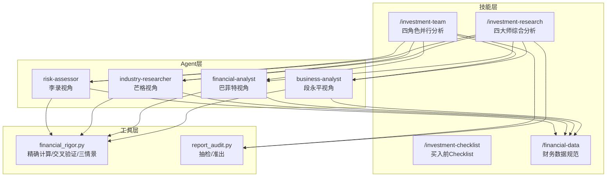
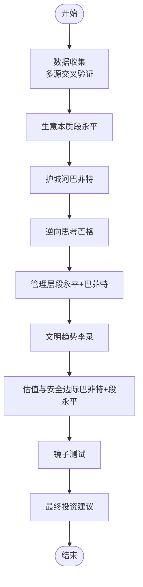
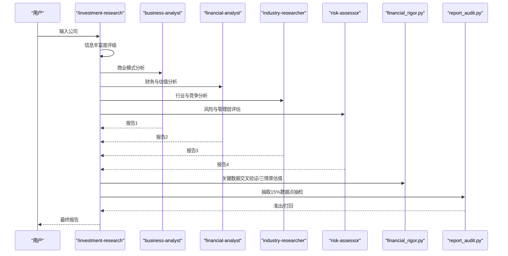
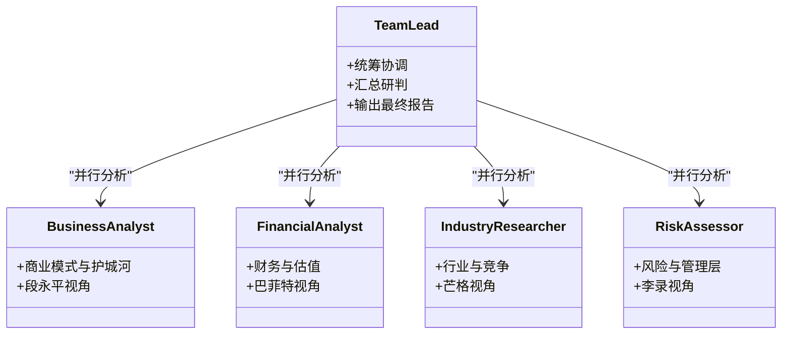
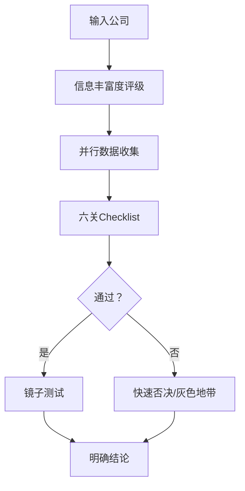
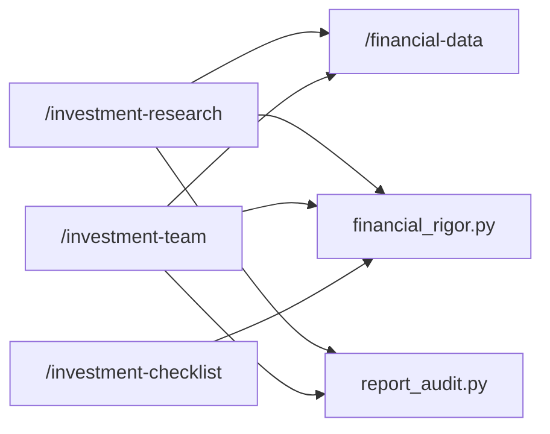

# 四大师方法论综合应用

<cite>
**本文引用的文件**
- [README.md](file://README.md)
- [investment-team.md](file://skills/investment-team.md)
- [investment-research.md](file://skills/investment-research.md)
- [investment-checklist.md](file://skills/investment-checklist.md)
- [financial-data.md](file://skills/financial-data.md)
- [financial_rigor.py](file://tools/financial_rigor.py)
- [report_audit.py](file://tools/report_audit.py)
- [懂车帝投资研究报告-四大师综合分析-20260613.md](file://reports/懂车帝/懂车帝投资研究报告-四大师综合分析-20260613.md)
- [腾讯-research-20260620.md](file://reports/腾讯/腾讯-research-20260620.md)
- [拼多多-最终报告.md](file://reports/拼多多/最终报告.md)
</cite>

## 目录
1. [引言](#引言)
2. [项目结构](#项目结构)
3. [核心组件](#核心组件)
4. [架构总览](#架构总览)
5. [详细组件分析](#详细组件分析)
6. [依赖关系分析](#依赖关系分析)
7. [性能考量](#性能考量)
8. [故障排查指南](#故障排查指南)
9. [结论](#结论)
10. [附录](#附录)

## 引言
本指南围绕“四大师方法论”的综合应用展开，系统整合段永平的商业模式分析、巴菲特的财务质量评估、芒格的行业竞争分析与李录的风险管理评估，形成可执行、可复用、可审计的投资决策框架。该框架通过标准化流程、严格的金融严谨性工具与报告抽检机制，确保分析结论可落地、可验证、可复盘，帮助使用者在实践中灵活运用四大师方法论，构建稳健的综合判断体系。

## 项目结构
- 技能层（Skills）：提供16个可复用的分析入口，涵盖深度研究、财报分析、行业筛选、组合管理、思维工具等。
- Agent层：每个技能内部以4个并行Agent模拟“段永平视角”“巴菲特视角”“芒格视角”“李录视角”，独立搜索、独立判断、互相挑战。
- 工具层：金融严谨性工具（精确十进制计算、市值/估值验算、多源交叉验证、三情景估值、Benford检测）、报告抽检工具，保障数据质量与可审计性。

**图表来源**
- [investment-team.md:11-17](file://skills/investment-team.md#L11-L17)
- [investment-research.md:100-109](file://skills/investment-research.md#L100-L109)
- [financial_rigor.py:10-16](file://tools/financial_rigor.py#L10-L16)
- [report_audit.py:1-22](file://tools/report_audit.py#L1-L22)

**章节来源**
- [README.md:169-212](file://README.md#L169-L212)
- [README.md:154-166](file://README.md#L154-L166)

## 核心组件
- 四大师综合分析框架（/investment-research）：按七个模块顺序执行，强调“信息丰富度评级”“反面检验”“数据交叉验证”“三情景估值”“镜子测试”“最终投资建议”。
- 四角色并行分析框架（/investment-team）：启动4个Agent并行研究，统一输出“四维评分总表”“投资建议”“Checklist”“最终总结”。
- 巴菲特买入前Checklist（/investment-checklist）：六关快速筛选，配套“镜子测试”“快速否决清单”，输出明确结论。
- 财务数据规范（/financial-data）：多源交叉验证、误差标记、原始财报优先、GAAP/Non-GAAP差异说明。
- 金融严谨性工具（tools/financial_rigor.py）：市值验算、估值指标验算、多源交叉验证、Benford检测、精确计算器、三情景估值。
- 报告抽检工具（tools/report_audit.py）：从报告中抽取15%数据点，与可靠信源比对，输出准出/打回判决。

**章节来源**
- [investment-research.md:5-34](file://skills/investment-research.md#L5-L34)
- [investment-team.md:5-33](file://skills/investment-team.md#L5-L33)
- [investment-checklist.md:7-28](file://skills/investment-checklist.md#L7-L28)
- [financial-data.md:3-104](file://skills/financial-data.md#L3-L104)
- [financial_rigor.py:10-452](file://tools/financial_rigor.py#L10-L452)
- [report_audit.py:1-523](file://tools/report_audit.py#L1-L523)

## 架构总览
四大师方法论的综合应用以“技能-代理-工具”三层架构为核心，强调：
- 分析顺序：数据收集 → 生意本质（段永平）→ 护城河（巴菲特）→ 逆向思考（芒格）→ 管理层（段永平+巴菲特）→ 文明趋势（李录）→ 估值与安全边际（巴菲特+段永平）。
- 互补关系：四视角互相挑战，避免单一视角的偏见；通过“信息丰富度评级”“反面检验”“快速否决清单”“镜子测试”降低认知偏差。
- 权重分配：框架未设定固定权重，而是通过“评分+综合判断+投资建议”体现综合权重；不同公司/行业可根据“信息丰富度”调整侧重点。
- 综合判断：以“四维评分总表”“投资论点（Bull vs Bear）”“Checklist”“最终建议”形成闭环。

**图表来源**
- [investment-research.md:7-109](file://skills/investment-research.md#L7-L109)
- [investment-research.md:186-201](file://skills/investment-research.md#L186-L201)

**章节来源**
- [investment-research.md:7-109](file://skills/investment-research.md#L7-L109)
- [investment-research.md:186-201](file://skills/investment-research.md#L186-L201)

## 详细组件分析

### 四大师综合分析框架（/investment-research）
- 前置步骤：信息丰富度评级（A/B/C），并进行“AI研究偏见自觉”，强调“确定性来自生意本质，不来自资料数量”。
- 数据收集：遵循“财务数据至少两个独立来源”“误差>1%标记”“原始财报优先”。
- 分析模块：生意本质、护城河、逆向思考、管理层、文明趋势、估值与安全边际。
- 输出要求：明确结论、数据来源、评分、投资建议、镜子测试、准出流程。

**图表来源**
- [investment-research.md:35-99](file://skills/investment-research.md#L35-L99)
- [financial_rigor.py:167-204](file://tools/financial_rigor.py#L167-L204)
- [report_audit.py:451-516](file://tools/report_audit.py#L451-L516)

**章节来源**
- [investment-research.md:35-99](file://skills/investment-research.md#L35-L99)
- [investment-research.md:226-263](file://skills/investment-research.md#L226-L263)

### 四角色并行分析框架（/investment-team）
- 团队角色：team-lead（统筹）、business-analyst（段永平）、financial-analyst（巴菲特）、industry-researcher（芒格）、risk-assessor（李录）。
- 执行流程：信息丰富度评级 → 创建团队 → 并行任务 → 接收报告 → 汇总 → 保存 → 数据抽检 → 清理团队。
- 输出结构：一句话结论、四维评分总表、核心数据速览、维度摘要、投资论点、Checklist、最终建议、总结。

**图表来源**
- [investment-team.md:11-17](file://skills/investment-team.md#L11-L17)
- [investment-team.md:140-176](file://skills/investment-team.md#L140-L176)

**章节来源**
- [investment-team.md:11-17](file://skills/investment-team.md#L11-L17)
- [investment-team.md:140-176](file://skills/investment-team.md#L140-L176)

### 巴菲特买入前Checklist（/investment-checklist）
- 六关筛选：能力圈、好生意、护城河、管理层、安全边际、决策纪律。
- 镜子测试：5句话说不完整 = 不买。
- 快速否决清单：8条红线一票否决。
- 多公司对比：输出总览对比表。

**图表来源**
- [investment-checklist.md:42-187](file://skills/investment-checklist.md#L42-L187)

**章节来源**
- [investment-checklist.md:42-187](file://skills/investment-checklist.md#L42-L187)

### 财务数据规范与金融严谨性工具
- 多源交叉验证：美股/macrotrends+stockanalysis；港股/aastocks+macrotrends；A股/东方财富+巨潮资讯。
- 误差标记：≤1%一致；1%-5%标注差异；>5%需原始财报核实。
- 金融严谨性工具：市值验算、估值指标验算、多源交叉验证、Benford检测、精确计算器、三情景估值。
- 报告抽检：抽取15%数据点，与可靠信源比对，1%容差内准出。

**章节来源**
- [financial-data.md:3-104](file://skills/financial-data.md#L3-L104)
- [financial_rigor.py:61-91](file://tools/financial_rigor.py#L61-L91)
- [financial_rigor.py:98-160](file://tools/financial_rigor.py#L98-L160)
- [financial_rigor.py:167-204](file://tools/financial_rigor.py#L167-L204)
- [financial_rigor.py:320-361](file://tools/financial_rigor.py#L320-L361)
- [report_audit.py:451-516](file://tools/report_audit.py#L451-L516)

### 综合分析案例
- 懂车帝（未上市公司）：C级信息稀缺，四维评分2.4/5，结论为“财务黑箱+护城河弱+无安全边际”，建议保守型回避、稳健型观望、激进型在PS<4x时试探。
- 腾讯：A级信息充裕，四维评分4/5，结论为“社交垄断+多元变现飞轮+利润率扩张”，当前PE 14.5x，建议逐步建仓。
- 拼多多：A级信息充裕，四维评分3.4/5，结论为“财务指标优秀但商业确定性不足”，建议中等仓位、等待Temu盈利与港股上市。

**章节来源**
- [懂车帝投资研究报告-四大师综合分析-20260613.md:1-173](file://reports/懂车帝/懂车帝投资研究报告-四大师综合分析-20260613.md#L1-L173)
- [腾讯-research-20260620.md:1-200](file://reports/腾讯/腾讯-research-20260620.md#L1-L200)
- [拼多多-最终报告.md:1-200](file://reports/拼多多/最终报告.md#L1-L200)

## 依赖关系分析
- 技能依赖：/investment-research 与 /investment-team 均依赖 /financial-data 与 tools/financial_rigor.py；/investment-checklist 依赖 tools/financial_rigor.py 与 tools/report_audit.py。
- Agent交互：四角色并行Agent通过Task工具启动，通过SendMessage汇报，team-lead汇总。
- 数据依赖：关键财务数据必须来自两个独立来源，误差>1%需标注；原始财报优先。

**图表来源**
- [investment-research.md:35-99](file://skills/investment-research.md#L35-L99)
- [investment-team.md:104-128](file://skills/investment-team.md#L104-L128)
- [investment-checklist.md:72-74](file://skills/investment-checklist.md#L72-L74)
- [report_audit.py:451-516](file://tools/report_audit.py#L451-L516)

**章节来源**
- [investment-research.md:35-99](file://skills/investment-research.md#L35-L99)
- [investment-team.md:104-128](file://skills/investment-team.md#L104-L128)
- [investment-checklist.md:72-74](file://skills/investment-checklist.md#L72-L74)
- [report_audit.py:451-516](file://tools/report_audit.py#L451-L516)

## 性能考量
- 并行Agent提升研究深度与速度，但需注意上下文窗口与并发限制；建议在同一条消息中并行调用4个Task。
- 金融严谨性工具使用精确十进制计算，避免浮点误差；三情景估值与多源交叉验证增加计算开销，建议在关键节点启用。
- 报告抽检15%抽样比例兼顾效率与质量，建议固定随机种子以便复现。

[本节为通用指导，无需特定文件引用]

## 故障排查指南
- 数据不一致：检查多源来源、GAAP/Non-GAAP差异、财年定义、合并口径、汇率换算时间点。
- 市值/估值异常：使用市值验算与估值指标验算工具核对；若偏差>5%，需核查股本、单位、股价。
- 报告抽检不通过：逐项比对原始财报与可靠信源，修正后重审；1%容差内为通过。
- Agent未返回：确认Task工具调用方式、SendMessage通信、团队清理命令。

**章节来源**
- [financial-data.md:73-91](file://skills/financial-data.md#L73-L91)
- [financial_rigor.py:61-91](file://tools/financial_rigor.py#L61-L91)
- [financial_rigor.py:98-160](file://tools/financial_rigor.py#L98-L160)
- [report_audit.py:243-398](file://tools/report_audit.py#L243-L398)

## 结论
四大师方法论的综合应用通过标准化流程、严格的金融严谨性工具与报告抽检机制，将段永平的“对的生意”、巴菲特的“财务质量”、芒格的“逆向思考”与李录的“风险管理”有机融合。使用者可据此建立“信息丰富度评级→四维评分总表→Checklist→最终建议”的闭环，既避免单一视角偏见，又确保结论可验证、可复盘、可落地。

[本节为总结性内容，无需特定文件引用]

## 附录

### 四维评分总表设计思路
- 维度：商业模式与护城河（段永平）、财务与估值（巴菲特）、行业与竞争（芒格）、风险与管理层（李录）。
- 评分：1-5星，结合“核心判断”与“综合评分”形成综合判断。
- 输出：表格+摘要+投资建议+Checklist+最终总结。

**章节来源**
- [investment-team.md:149-156](file://skills/investment-team.md#L149-L156)
- [investment-research.md:202-224](file://skills/investment-research.md#L202-L224)

### 核心判断标准
- 段永平：好生意、护城河、用户价值、业务矩阵与协同效应。
- 巴菲特：ROE、毛利率、自由现金流、资产负债表健康度、估值与安全边际。
- 芒格：行业规模与增长、竞争格局、核心竞争者威胁、行业趋势与风险。
- 李录：管理层文化与诚信、监管与宏观风险、长期确定性与文明趋势。

**章节来源**
- [investment-research.md:100-154](file://skills/investment-research.md#L100-L154)
- [investment-research.md:155-185](file://skills/investment-research.md#L155-L185)

### 投资论点构建方法
- 看多逻辑：商业模式、财务质量、估值、增长、股东回报、外部环境支持。
- 看空逻辑：护城河薄弱、管理层问题、估值偏高、行业下行、监管风险、地缘政治。
- 两套逻辑并行，确保“反面检验”与“非共识视角”。

**章节来源**
- [investment-team.md:161-164](file://skills/investment-team.md#L161-L164)
- [懂车帝投资研究报告-四大师综合分析-20260613.md:79-98](file://reports/懂车帝/懂车帝投资研究报告-四大师综合分析-20260613.md#L79-L98)
- [拼多多-最终报告.md:108-129](file://reports/拼多多/最终报告.md#L108-L129)

### 巴菲特买入前Checklist应用
- 六关：能力圈、好生意、护城河、管理层、安全边际、决策纪律。
- 镜子测试：5句话说不完整 = 不买。
- 快速否决清单：8条红线一票否决。
- 多公司对比：统一标准、横向可比。

**章节来源**
- [investment-checklist.md:42-187](file://skills/investment-checklist.md#L42-L187)

### 最终投资建议制定流程
- 定性判断：生意质量、管理层、估值、时机。
- 分层建议：激进型/稳健型/保守型，附价格区间与加减仓信号。
- 关键催化剂：跟踪Temu盈利、股东回报、港股上市、关税政策等。

**章节来源**
- [investment-team.md:169-172](file://skills/investment-team.md#L169-L172)
- [懂车帝投资研究报告-四大师综合分析-20260613.md:120-151](file://reports/懂车帝/懂车帝投资研究报告-四大师综合分析-20260613.md#L120-L151)
- [拼多多-最终报告.md:151-185](file://reports/拼多多/最终报告.md#L151-L185)

### 常见误区与实战技巧
- 误区：资料多=确定性高；C级公司=不值得研究；Checklist通过=可买入。
- 实战技巧：A级公司做反面检验与非共识视角；C级公司用第一性原理提问；严格多源交叉验证；三情景估值与镜子测试必用；报告抽检15%抽样、1%容差。

**章节来源**
- [investment-research.md:13-34](file://skills/investment-research.md#L13-L34)
- [investment-checklist.md:25-27](file://skills/investment-checklist.md#L25-L27)
- [report_audit.py:243-244](file://tools/report_audit.py#L243-L244)