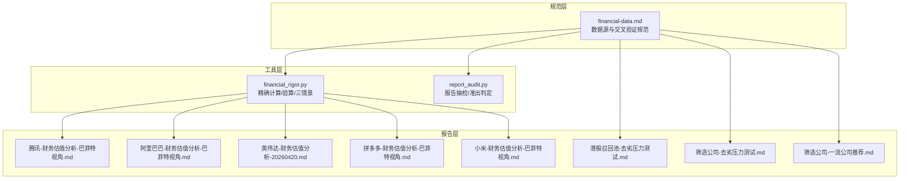
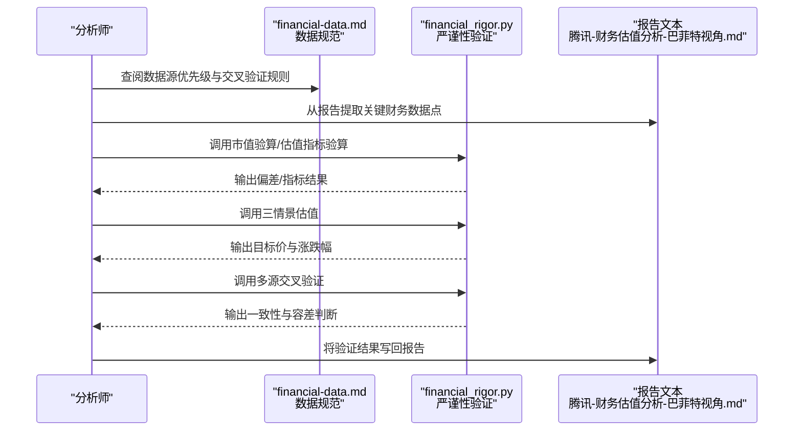
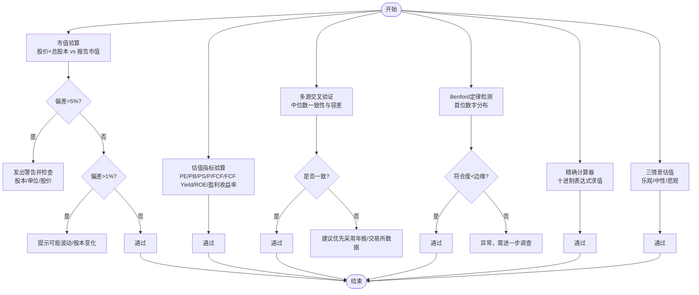
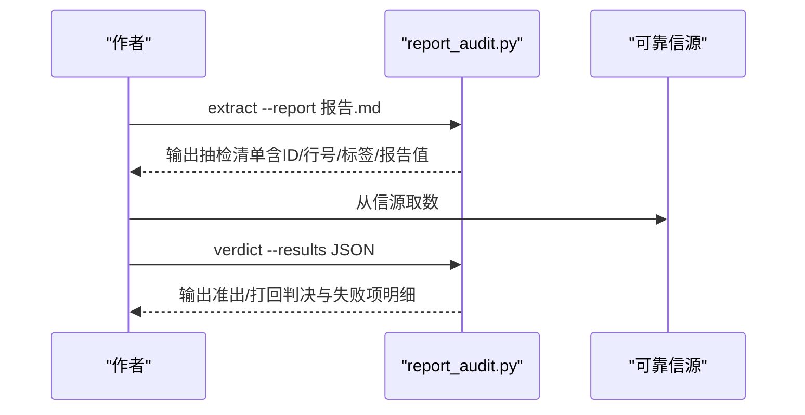
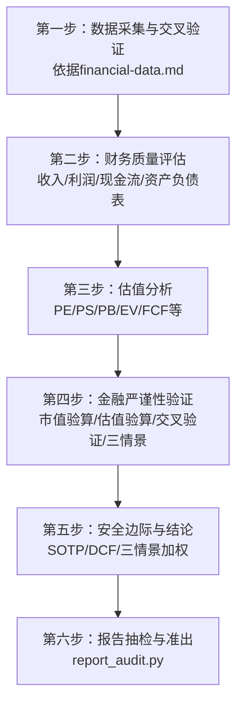
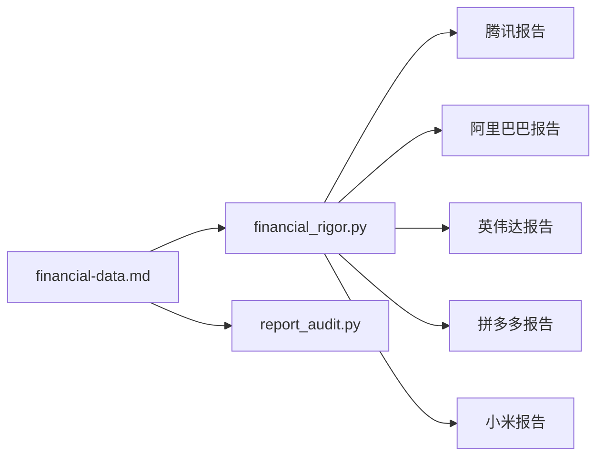

# 巴菲特财务质量评估框架

<cite>
**本文引用的文件**
- [financial_rigor.py](file://tools/financial_rigor.py)
- [report_audit.py](file://tools/report_audit.py)
- [financial-data.md](file://skills/financial-data.md)
- [腾讯-财务估值分析-巴菲特视角.md](file://reports/腾讯/02-财务估值分析-巴菲特视角.md)
- [阿里巴巴-财务估值分析-巴菲特视角.md](file://reports/阿里巴巴/02-财务估值分析-巴菲特视角.md)
- [英伟达-财务估值分析-20260420.md](file://reports/英伟达/英伟达-财务估值分析-20260420.md)
- [拼多多-财务估值分析-巴菲特视角.md](file://reports/拼多多/02-财务估值分析-巴菲特视角.md)
- [小米-财务估值分析-巴菲特视角.md](file://reports/小米/02-财务估值分析-巴菲特视角.md)
- [去劣指标压力测试-20260517.md](file://reports/港股召回池/去劣指标压力测试-20260517.md)
- [烂公司+平庸公司-去劣指标压力测试-20260517.md](file://筛选公司/烂公司+平庸公司-去劣指标压力测试-20260517.md)
- [一流公司-其他推荐-20260517.md](file://筛选公司/一流公司-其他推荐-20260517.md)
</cite>

## 目录
1. [引言](#引言)
2. [项目结构](#项目结构)
3. [核心组件](#核心组件)
4. [架构总览](#架构总览)
5. [详细组件分析](#详细组件分析)
6. [依赖关系分析](#依赖关系分析)
7. [性能考量](#性能考量)
8. [故障排查指南](#故障排查指南)
9. [结论](#结论)
10. [附录](#附录)

## 引言
本指南面向希望掌握“巴菲特式财务质量判断”的使用者，系统讲解如何运用仓库中的工具与报告模板，完成对企业的财务质量评估与估值分析。内容涵盖：
- 财务报表质量评估：收入、利润、现金流、资产负债表健康度
- 盈利能力分析：ROE、ROA、毛利率、经营利润率等
- 现金流分析：经营性现金流、自由现金流、资本开支
- 资产负债表健康度评估：现金储备、负债率、流动性
- 估值分析：PE、PS、PB、EV/EBITDA、P/FCF、FCF Yield等
- 金融严谨性验证：市值验算、估值验算、关键数据交叉验证、三情景估值
- 实操步骤、数据验证方法与实用工具

## 项目结构
仓库围绕“财务质量评估”形成“工具 + 规范 + 报告”的闭环：
- 工具层：提供精确计算、交叉验证、三情景估值、报告抽检等自动化能力
- 规范层：统一财务数据获取、交叉验证与呈现格式
- 报告层：以“巴菲特视角”对多家公司进行深度财务与估值分析

图表来源
- [financial_rigor.py:1-452](file://tools/financial_rigor.py#L1-L452)
- [report_audit.py:1-523](file://tools/report_audit.py#L1-L523)
- [financial-data.md:1-104](file://skills/financial-data.md#L1-L104)
- [腾讯-财务估值分析-巴菲特视角.md:1-414](file://reports/腾讯/02-财务估值分析-巴菲特视角.md#L1-L414)
- [阿里巴巴-财务估值分析-巴菲特视角.md:1-399](file://reports/阿里巴巴/02-财务估值分析-巴菲特视角.md#L1-L399)
- [英伟达-财务估值分析-20260420.md:111-165](file://reports/英伟达/英伟达-财务估值分析-20260420.md#L111-L165)
- [拼多多-财务估值分析-巴菲特视角.md:88-107](file://reports/拼多多/02-财务估值分析-巴菲特视角.md#L88-L107)
- [小米-财务估值分析-巴菲特视角.md:95-121](file://reports/小米/02-财务估值分析-巴菲特视角.md#L95-L121)
- [去劣指标压力测试-20260517.md:195-218](file://reports/港股召回池/去劣指标压力测试-20260517.md#L195-L218)
- [烂公司+平庸公司-去劣指标压力测试-20260517.md:195-218](file://筛选公司/烂公司+平庸公司-去劣指标压力测试-20260517.md#L195-L218)
- [一流公司-其他推荐-20260517.md:43-160](file://筛选公司/一流公司-其他推荐-20260517.md#L43-L160)

章节来源
- [financial_rigor.py:1-452](file://tools/financial_rigor.py#L1-L452)
- [report_audit.py:1-523](file://tools/report_audit.py#L1-L523)
- [financial-data.md:1-104](file://skills/financial-data.md#L1-L104)

## 核心组件
- 金融严谨性验证工具（financial_rigor.py）
  - 市值验算：股价×总股本 vs 报告市值，偏差阈值控制
  - 估值指标验算：PE、PB、PS、P/FCF、FCF Yield、ROE等
  - 多源交叉验证：中位数一致性与容差
  - Benford定律检测：财务数据首位数字分布
  - 精确计算器：十进制无浮点漂移
  - 三情景估值：乐观/中性/悲观场景下的目标价与涨跌幅
- 报告抽检与准出（report_audit.py）
  - 从Markdown报告中抽取财务数据点，随机抽样15%
  - 与可靠信源交叉验证，输出准出/打回判决
- 财务数据获取与交叉验证规范（financial-data.md）
  - 美/港/A股数据源优先级与获取方式
  - 误差计算与标记规则
  - 常见差异原因与特殊规则

章节来源
- [financial_rigor.py:57-452](file://tools/financial_rigor.py#L57-L452)
- [report_audit.py:35-523](file://tools/report_audit.py#L35-L523)
- [financial-data.md:1-104](file://skills/financial-data.md#L1-L104)

## 架构总览
下面以“腾讯”报告为例，展示从数据采集、交叉验证、估值验算到三情景估值的完整流程。

图表来源
- [financial-data.md:34-90](file://skills/financial-data.md#L34-L90)
- [financial_rigor.py:61-160](file://tools/financial_rigor.py#L61-L160)
- [腾讯-财务估值分析-巴菲特视角.md:145-306](file://reports/腾讯/02-财务估值分析-巴菲特视角.md#L145-L306)

章节来源
- [腾讯-财务估值分析-巴菲特视角.md:145-306](file://reports/腾讯/02-财务估值分析-巴菲特视角.md#L145-L306)
- [financial_rigor.py:61-160](file://tools/financial_rigor.py#L61-L160)

## 详细组件分析

### 金融严谨性验证工具（financial_rigor.py）
- 市值验算
  - 输入：股价、总股本、报告市值
  - 输出：计算市值、报告市值、偏差百分比
  - 阈值：>5%警告、>1%提示、≤1%通过
- 估值指标验算
  - 输入：股价、EPS、BVPS、FCF/Share、Dividend、Revenue/Share
  - 输出：PE、PB、PS、P/FCF、FCF Yield、ROE、盈利收益率
- 多源交叉验证
  - 输入：字段名、多个来源的数值、单位、容差
  - 输出：中位数、各来源偏差、一致性结论
- Benford定律检测
  - 输入：一组财务数值
  - 输出：样本量、MAD、Chi-square、符合度、首位数字分布表
- 精确计算器
  - 输入：算术表达式（支持科学计数）
  - 输出：精确结果与格式化展示
- 三情景估值
  - 输入：当前股价、EPS、总股本（亿）、三情景年增速、目标PE、预测期
  - 输出：乐观/中性/悲观目标价与涨跌幅

图表来源
- [financial_rigor.py:61-91](file://tools/financial_rigor.py#L61-L91)
- [financial_rigor.py:98-160](file://tools/financial_rigor.py#L98-L160)
- [financial_rigor.py:167-204](file://tools/financial_rigor.py#L167-L204)
- [financial_rigor.py:214-281](file://tools/financial_rigor.py#L214-L281)
- [financial_rigor.py:288-313](file://tools/financial_rigor.py#L288-L313)
- [financial_rigor.py:320-361](file://tools/financial_rigor.py#L320-L361)

章节来源
- [financial_rigor.py:61-361](file://tools/financial_rigor.py#L61-L361)

### 报告抽检与准出（report_audit.py）
- 数据点提取：从Markdown报告中识别表格与KV行中的财务数据
- 随机抽样：默认15%，最少3个，最多30个
- 核验与判决：与可靠信源交叉验证，输出通过/警告/不通过，并统计失败项与摘要

图表来源
- [report_audit.py:405-523](file://tools/report_audit.py#L405-L523)

章节来源
- [report_audit.py:155-399](file://tools/report_audit.py#L155-L399)

### 财务数据获取与交叉验证规范（financial-data.md）
- 数据源优先级：美股（macrotrends + stockanalysis + 原始10-K/10-Q）、港股（aastocks + macrotrends ADR + 原始披露易）、A股（东方财富 + 巨潮资讯）
- 误差计算与标记：≤1%一致、1%-5%差异标注、>5%重大差异需原始财报核实
- 常见差异原因：GAAP vs Non-GAAP、汇率换算、财年定义、合并口径、数据更新滞后
- 特别规则：未上市公司标注“估计”，季度数据优先年度数据，原始财报优先

章节来源
- [financial-data.md:34-90](file://skills/financial-data.md#L34-L90)

### 巴菲特视角的财务质量评估步骤
以“腾讯”报告为例，展示从数据采集到三情景估值的完整流程与关键判断点。

图表来源
- [腾讯-财务估值分析-巴菲特视角.md:15-306](file://reports/腾讯/02-财务估值分析-巴菲特视角.md#L15-L306)
- [financial-data.md:34-90](file://skills/financial-data.md#L34-L90)
- [financial_rigor.py:61-160](file://tools/financial_rigor.py#L61-L160)
- [report_audit.py:155-399](file://tools/report_audit.py#L155-L399)

章节来源
- [腾讯-财务估值分析-巴菲特视角.md:15-306](file://reports/腾讯/02-财务估值分析-巴菲特视角.md#L15-L306)

## 依赖关系分析
- 工具与报告的耦合
  - financial_rigor.py 的“估值指标验算/三情景”直接被报告调用，确保计算一致性
  - report_audit.py 与 financial-data.md 协作，保证抽检数据点提取与交叉验证的规范性
- 数据源与交叉验证
  - financial-data.md 明确数据源优先级与误差阈值，避免报告中出现“重大差异”
- 实践案例
  - 腾讯报告中使用“市值验算”“估值指标验算”“三情景估值”“关键数据交叉验证”，形成闭环
  - 阿里巴巴报告中使用“市值验算”“估值指标精确验算”“SOTP分部估值”“三情景估值”

图表来源
- [financial-data.md:1-104](file://skills/financial-data.md#L1-L104)
- [financial_rigor.py:1-452](file://tools/financial_rigor.py#L1-L452)
- [report_audit.py:1-523](file://tools/report_audit.py#L1-L523)
- [腾讯-财务估值分析-巴菲特视角.md:145-306](file://reports/腾讯/02-财务估值分析-巴菲特视角.md#L145-L306)
- [阿里巴巴-财务估值分析-巴菲特视角.md:166-284](file://reports/阿里巴巴/02-财务估值分析-巴菲特视角.md#L166-L284)
- [英伟达-财务估值分析-20260420.md:148-165](file://reports/英伟达/英伟达-财务估值分析-20260420.md#L148-L165)
- [拼多多-财务估值分析-巴菲特视角.md:88-107](file://reports/拼多多/02-财务估值分析-巴菲特视角.md#L88-L107)
- [小米-财务估值分析-巴菲特视角.md:95-121](file://reports/小米/02-财务估值分析-巴菲特视角.md#L95-L121)

章节来源
- [腾讯-财务估值分析-巴菲特视角.md:145-306](file://reports/腾讯/02-财务估值分析-巴菲特视角.md#L145-L306)
- [阿里巴巴-财务估值分析-巴菲特视角.md:166-284](file://reports/阿里巴巴/02-财务估值分析-巴菲特视角.md#L166-L284)
- [英伟达-财务估值分析-20260420.md:148-165](file://reports/英伟达/英伟达-财务估值分析-20260420.md#L148-L165)
- [拼多多-财务估值分析-巴菲特视角.md:88-107](file://reports/拼多多/02-财务估值分析-巴菲特视角.md#L88-L107)
- [小米-财务估值分析-巴菲特视角.md:95-121](file://reports/小米/02-财务估值分析-巴菲特视角.md#L95-L121)

## 性能考量
- 精确十进制计算
  - 使用十进制上下文避免浮点误差，适合高频重复计算与审计复现
- 抽样与批量处理
  - 报告抽检默认15%抽样，最少3个、最多30个，兼顾效率与覆盖面
- Benford检测门槛
  - 样本量<50时不建议使用，避免误判

章节来源
- [financial_rigor.py:28-37](file://tools/financial_rigor.py#L28-L37)
- [report_audit.py:229-236](file://tools/report_audit.py#L229-L236)
- [financial_rigor.py:231-233](file://tools/financial_rigor.py#L231-L233)

## 故障排查指南
- 市值验算偏差>5%
  - 检查股本是否最新（回购/增发）、单位是否一致、股价是否最新
- 估值指标验算失败
  - EPS为0时PE无法计算；确认EPS与BVPS是否为同一口径
- 多源交叉验证不一致
  - 优先采用公司年报/交易所数据；关注GAAP/Non-GAAP差异、汇率换算、财年定义
- Benford检测不符合
  - 样本量不足或数据异常，需进一步调查是否存在人为调整
- 报告抽检不通过
  - 严格按1%容差执行；失败项需修正后重审

章节来源
- [financial_rigor.py:80-91](file://tools/financial_rigor.py#L80-L91)
- [financial_rigor.py:120-121](file://tools/financial_rigor.py#L120-L121)
- [financial_rigor.py:189-200](file://tools/financial_rigor.py#L189-L200)
- [financial_rigor.py:231-233](file://tools/financial_rigor.py#L231-L233)
- [report_audit.py:312-350](file://tools/report_audit.py#L312-L350)

## 结论
通过“工具 + 规范 + 报告”的闭环，本框架将巴菲特式的财务质量判断标准化、自动化与可审计化：
- 以“市值验算/估值验算/交叉验证/三情景”为核心的金融严谨性验证，确保数据与估值的可信度
- 以“腾讯/阿里巴巴/英伟达/拼多多/小米”为代表的实战报告，提供可复制的分析步骤与判断逻辑
- 以“报告抽检”保障产出质量，形成“先抽检、后发布”的质量门禁

## 附录

### 巴菲特财务质量评估清单（实践步骤）
- 财务报表质量评估
  - 收入与利润：收入、毛利率、经营利润率、净利润、EPS（基本/稀释）
  - 现金流：经营性现金流、自由现金流、资本开支、回购与分红、现金及等价物
  - 资产负债表：现金+短期投资 vs 有息负债、净现金/净负债、应收账款/存货周转、商誉与无形资产
- 盈利能力分析
  - ROE、ROA、毛利率、经营利润率、Non-GAAP净利润与GAAP差异
- 现金流分析
  - 经营性现金流 vs 净利润比率（>100%为佳，<80%需警惕）
  - 自由现金流 = 经营现金流 - 资本开支
- 资产负债表健康度
  - 现金+短期投资 vs 有息负债、净现金/净负债、流动比率、速动比率
- 估值分析
  - PE、PS、PB、EV/EBITDA、P/FCF、FCF Yield、股息率、盈利收益率
- 金融严谨性验证
  - 市值验算、估值验算、关键数据交叉验证、三情景估值
- 实战报告参考
  - 腾讯、阿里巴巴、英伟达、拼多多、小米等报告中的具体做法与结论

章节来源
- [腾讯-财务估值分析-巴菲特视角.md:15-306](file://reports/腾讯/02-财务估值分析-巴菲特视角.md#L15-L306)
- [阿里巴巴-财务估值分析-巴菲特视角.md:10-206](file://reports/阿里巴巴/02-财务估值分析-巴菲特视角.md#L10-L206)
- [英伟达-财务估值分析-20260420.md:111-165](file://reports/英伟达/英伟达-财务估值分析-20260420.md#L111-L165)
- [拼多多-财务估值分析-巴菲特视角.md:88-107](file://reports/拼多多/02-财务估值分析-巴菲特视角.md#L88-L107)
- [小米-财务估值分析-巴菲特视角.md:95-121](file://reports/小米/02-财务估值分析-巴菲特视角.md#L95-L121)