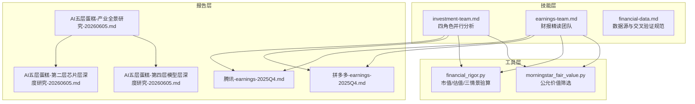
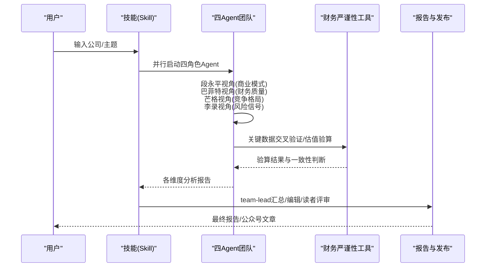
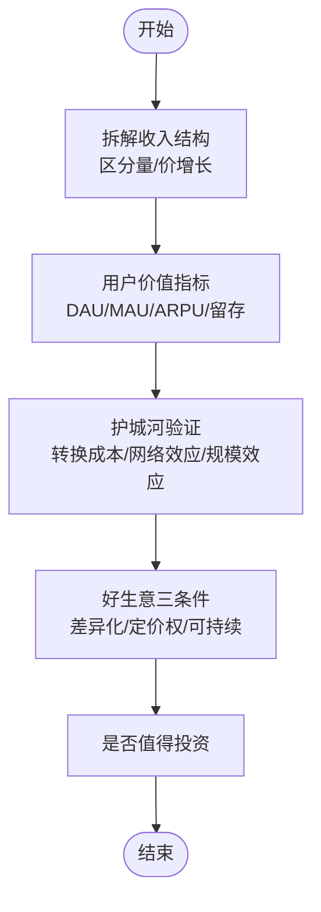
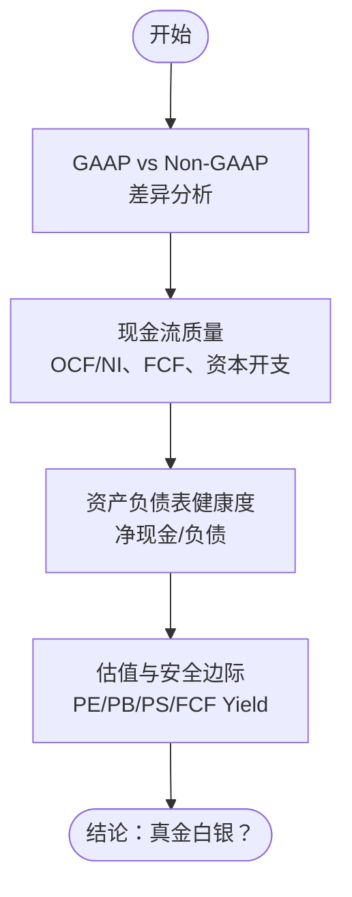
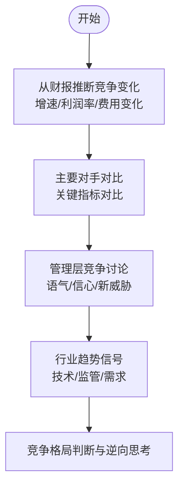
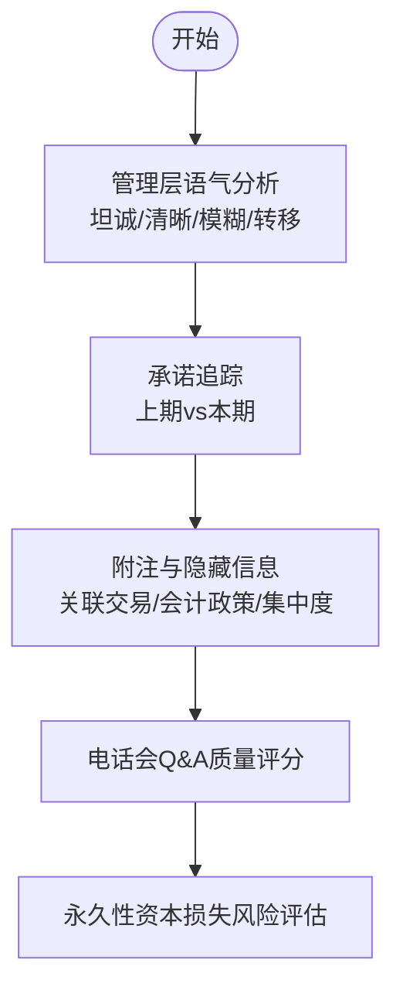
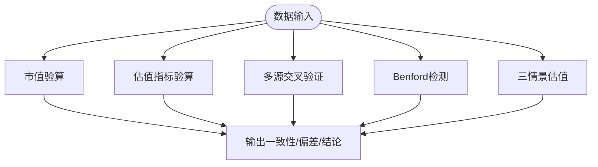
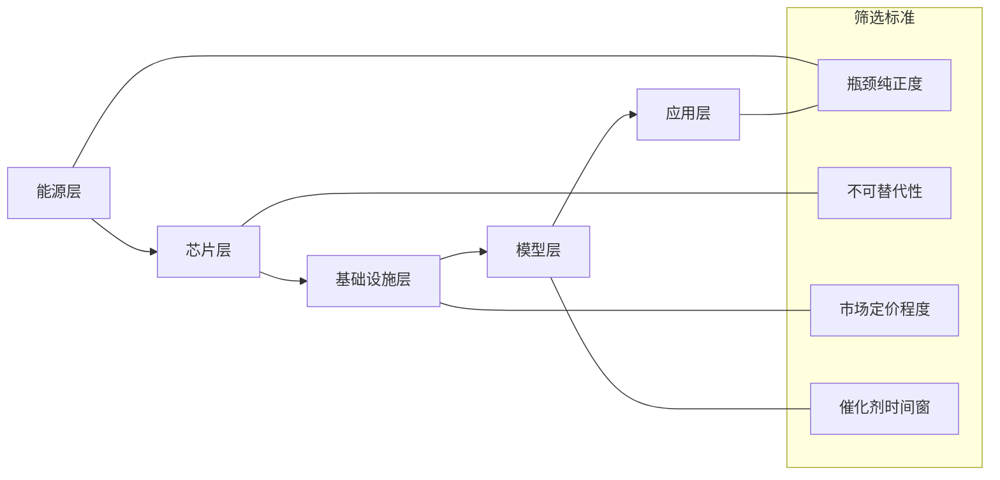
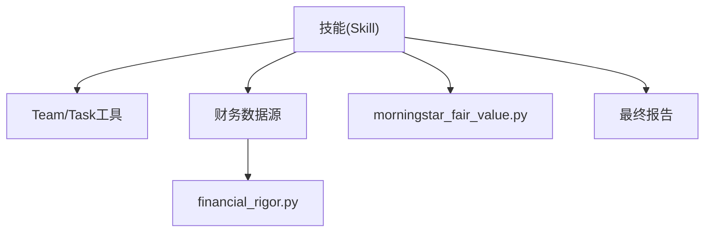

# 投资研究方法论

<cite>
**本文档引用的文件**
- [CLAUDE.md](file://CLAUDE.md)
- [investment-team.md](file://skills/investment-team.md)
- [earnings-team.md](file://skills/earnings-team.md)
- [financial-data.md](file://skills/financial-data.md)
- [financial_rigor.py](file://tools/financial_rigor.py)
- [morningstar_fair_value.py](file://tools/morningstar_fair_value.py)
- [腾讯-earnings-2025Q4.md](file://reports/腾讯/腾讯-earnings-2025Q4.md)
- [拼多多-earnings-2025Q4.md](file://reports/拼多多/拼多多-earnings-2025Q4.md)
- [AI五层蛋糕-产业全景研究-20260605.md](file://reports/AI产业研究/AI五层蛋糕-产业全景研究-20260605.md)
- [AI五层蛋糕-第二层芯片层深度研究-20260605.md](file://reports/AI产业研究/AI五层蛋糕-第二层芯片层深度研究-20260605.md)
- [AI五层蛋糕-第四层模型层深度研究-20260605.md](file://reports/AI产业研究/AI五层蛋糕-第四层模型层深度研究-20260605.md)
- [大模型的下一战：多模态是必然还是过热的叙事.md](file://docs/大模型的下一战：多模态是必然还是过热的叙事.md)
</cite>

## 目录
1. [引言](#引言)
2. [项目结构](#项目结构)
3. [核心组件](#核心组件)
4. [架构总览](#架构总览)
5. [详细组件分析](#详细组件分析)
6. [依赖关系分析](#依赖关系分析)
7. [性能考量](#性能考量)
8. [故障排查指南](#故障排查指南)
9. [结论](#结论)
10. [附录](#附录)

## 引言
本文件面向“AI Berkshire”的价值投资研究方法论，系统化阐述四大师方法论：段永平的商业模式分析、巴菲特的财务质量评估、芒格的行业竞争分析、李录的风险管理评估。结合仓库中的技能、工具与报告，给出可执行的分析框架、流程规范、关键指标与判断标准，并拓展至AI时代的应用场景与创新实践。

## 项目结构
项目采用“技能 + 工具 + 报告 + 资产”的组织方式：
- skills：多Agent并行研究的指令模板（investment-team、earnings-team等）
- tools：财务严谨性与数据筛查工具（financial_rigor.py、morningstar_fair_value.py等）
- reports：按公司/主题归档的完整研究报告与分析
- assets：图表与静态资源

**图示来源**
- [CLAUDE.md:17-56](file://CLAUDE.md#L17-L56)
- [investment-team.md:1-214](file://skills/investment-team.md#L1-L214)
- [earnings-team.md:1-457](file://skills/earnings-team.md#L1-L457)
- [financial_rigor.py:1-452](file://tools/financial_rigor.py#L1-L452)
- [morningstar_fair_value.py:1-153](file://tools/morningstar_fair_value.py#L1-L153)
- [腾讯-earnings-2025Q4.md:1-369](file://reports/腾讯/腾讯-earnings-2025Q4.md#L1-L369)
- [拼多多-earnings-2025Q4.md:1-330](file://reports/拼多多/拼多多-earnings-2025Q4.md#L1-L330)
- [AI五层蛋糕-产业全景研究-20260605.md:1-167](file://reports/AI产业研究/AI五层蛋糕-产业全景研究-20260605.md#L1-L167)
- [AI五层蛋糕-第二层芯片层深度研究-20260605.md:1-527](file://reports/AI产业研究/AI五层蛋糕-第二层芯片层深度研究-20260605.md#L1-L527)
- [AI五层蛋糕-第四层模型层深度研究-20260605.md:1-531](file://reports/AI产业研究/AI五层蛋糕-第四层模型层深度研究-20260605.md#L1-L531)

**章节来源**
- [CLAUDE.md:8-56](file://CLAUDE.md#L8-L56)

## 核心组件
- 四大师并行分析框架：以Team工具创建business-analyst、financial-analyst、industry-researcher、risk-assessor四个Agent，同步输出四个维度的分析结论，由team-lead综合形成最终报告。
- 财报精读团队：四角色并行解读财报，产出研究报告与公众号文章，包含编辑与读者评审环节。
- 财务严谨性工具：提供市值/估值验算、多源交叉验证、Benford检测、精确计算器、三情景估值等，确保数据与结论可审计复现。
- 数据源规范：明确不同市场的权威数据源与交叉验证规则，保证关键数据的准确性与一致性。
- AI产业研究框架：以“五层蛋糕”模型覆盖从能源到应用层的全链条，提供筛选标准与投资视角。

**章节来源**
- [investment-team.md:1-214](file://skills/investment-team.md#L1-L214)
- [earnings-team.md:1-457](file://skills/earnings-team.md#L1-L457)
- [financial_rigor.py:1-452](file://tools/financial_rigor.py#L1-L452)
- [financial-data.md:1-104](file://skills/financial-data.md#L1-L104)
- [AI五层蛋糕-产业全景研究-20260605.md:1-167](file://reports/AI产业研究/AI五层蛋糕-产业全景研究-20260605.md#L1-L167)

## 架构总览
四大师方法论在项目中的落地流程如下：

**图示来源**
- [investment-team.md:34-214](file://skills/investment-team.md#L34-L214)
- [earnings-team.md:20-457](file://skills/earnings-team.md#L20-L457)
- [financial_rigor.py:58-161](file://tools/financial_rigor.py#L58-L161)

## 详细组件分析

### 段永平：商业模式分析（“好生意”标准）
- 核心逻辑：从“生意本质”出发，拆解收入结构、用户价值、护城河与飞轮效应，判断生意是否具备“差异化、定价权、可持续竞争优势”。
- 实践方法：按业务/地区拆分收入，区分“量”与“价”的增长来源；关注运营指标（DAU/MAU、ARPU、留存）；验证客户转换成本、网络效应与规模效应。
- 关键指标：收入结构变化、毛利率趋势、用户价值指标、护城河验证清单。
- 判断标准：是否“生意在变‘重’还是变‘轻’”；若明天公司关门，用户是否会非常痛苦。
- 应用场景：平台/消费/科技/制造等各行业均可适用；AI时代重点关注数据/算法/网络效应的可持续性。

**图示来源**
- [investment-team.md:44-54](file://skills/investment-team.md#L44-L54)
- [earnings-team.md:67-94](file://skills/earnings-team.md#L67-L94)

**章节来源**
- [investment-team.md:44-54](file://skills/investment-team.md#L44-L54)
- [earnings-team.md:67-94](file://skills/earnings-team.md#L67-L94)

### 巴菲特：财务质量评估（“真金白银”）
- 核心逻辑：判断公司赚的是“真钱还是假钱”，关注利润质量、现金流结构与资产负债表健康度。
- 实践方法：GAAP与Non-GAAP差异分析；经营现金流/净利润、自由现金流、资本开支构成；净现金/净负债变化；估值指标（PE/PB/PS/FCF Yield）。
- 关键指标：OCF/NI、FCF、资本开支/收入、净现金、估值倍数。
- 判断标准：利润质量信号灯（🟢/🟡/🔴）；安全边际与内在价值对比。
- 应用场景：周期性/重资产/高杠杆/平台经济等不同商业模式的财务稳健性评估。

**图示来源**
- [earnings-team.md:103-146](file://skills/earnings-team.md#L103-L146)
- [financial_rigor.py:98-161](file://tools/financial_rigor.py#L98-L161)

**章节来源**
- [earnings-team.md:103-146](file://skills/earnings-team.md#L103-L146)
- [financial_rigor.py:98-161](file://tools/financial_rigor.py#L98-L161)

### 芒格：行业竞争分析（“死在哪里不去”）
- 核心逻辑：从财报数据与管理层讨论中推断竞争变化，识别威胁与机会，进行逆向思考。
- 实践方法：收入增速 vs 行业增速、毛利率变化、营销费用率、研发投入；对比主要竞争对手；关注管理层对竞争的描述与语气。
- 关键指标：收入/利润增速、毛利率、营销费用率、研发投入、竞争格局变化。
- 判断标准：竞争是“加强/持平/恶化”；识别“什么会杀死这家公司”。
- 应用场景：成熟/新兴/周期性/技术变革驱动行业的竞争态势评估。

**图示来源**
- [earnings-team.md:155-183](file://skills/earnings-team.md#L155-L183)

**章节来源**
- [earnings-team.md:155-183](file://skills/earnings-team.md#L155-L183)

### 李录：风险管理评估（“避免永久性资本损失”）
- 核心逻辑：识别管理层隐瞒的信息与风险信号，追踪承诺与语气，评估“永久性资本损失”的可能性。
- 实践方法：管理层语气分析（坦诚/清晰/模糊/转移/外部化）；承诺追踪；附注与隐藏信息（关联交易、股权激励、或有负债）；电话会Q&A质量评分。
- 关键指标：管理层可信度评分、承诺兑现率、风险信号清单。
- 判断标准：是否存在“可能导致永久性损失”的信号；管理层是否做出不可逆的错误决策。
- 应用场景：所有公司治理与管理层质量评估，尤其关注新兴市场与复杂结构。

**图示来源**
- [earnings-team.md:192-217](file://skills/earnings-team.md#L192-L217)

**章节来源**
- [earnings-team.md:192-217](file://skills/earnings-team.md#L192-L217)

### 财务严谨性工具：数据与估值的“零误差”通道
- 市值验算：股价×总股本 vs 报告市值，偏差阈值设定与提示。
- 估值指标验算：PE/PB/PS/FCF Yield/股息率等，支持精确十进制计算。
- 多源交叉验证：中位数一致性与容差阈值，标注来源差异与原因。
- Benford检测：首位数字分布检验，辅助识别数据异常。
- 三情景估值：基于当前价格/EPS/股本，设定乐观/中性/悲观情景，输出目标价与涨跌幅。

**图示来源**
- [financial_rigor.py:58-161](file://tools/financial_rigor.py#L58-L161)
- [financial_rigor.py:167-205](file://tools/financial_rigor.py#L167-L205)
- [financial_rigor.py:214-282](file://tools/financial_rigor.py#L214-L282)
- [financial_rigor.py:320-362](file://tools/financial_rigor.py#L320-L362)

**章节来源**
- [financial_rigor.py:58-161](file://tools/financial_rigor.py#L58-L161)
- [financial_rigor.py:167-205](file://tools/financial_rigor.py#L167-L205)
- [financial_rigor.py:214-282](file://tools/financial_rigor.py#L214-L282)
- [financial_rigor.py:320-362](file://tools/financial_rigor.py#L320-L362)

### 数据源规范：跨市场/跨口径的“黄金标准”
- 美股：macrotrends为主，stockanalysis为辅，SEC 10-K/10-Q为原始一手资料。
- 港股：aastocks为主，macrotrends ADR为辅，港交所披露易为原始一手资料。
- A股：东方财富为主，巨潮资讯为辅。
- 交叉验证规则：误差>5%标记“重大差异”，需回溯原始财报；误差1%-5%标注原因（GAAP/Non-GAAP、汇率、财年差异等）。

**章节来源**
- [financial-data.md:7-104](file://skills/financial-data.md#L7-L104)

### AI产业研究：五层蛋糕与“瓶颈”投资框架
- 五层定义：能源层（电力/变压器）、芯片层（GPU/ASIC/HBM/封装）、基础设施层（网络/电力/冷却/服务器）、模型层（大模型/开源/企业应用）、应用层（AI Agent/自动驾驶/机器人/行业解决方案）。
- 选股标准：瓶颈纯正度（卡脖子业务占营收>30%）、不可替代性（唯一/寡头供应商）、市场定价程度（P/E是否已充分反映）、催化剂时间窗（近期验证事件）。
- 应用案例：芯片层（Nvidia、Broadcom、台积电、SK海力士、ASML等）与模型层（Anthropic、OpenAI、Google、Meta、Reddit等）的深度分析。

**图示来源**
- [AI五层蛋糕-产业全景研究-20260605.md:25-35](file://reports/AI产业研究/AI五层蛋糕-产业全景研究-20260605.md#L25-L35)
- [AI五层蛋糕-产业全景研究-20260605.md:8-20](file://reports/AI产业研究/AI五层蛋糕-产业全景研究-20260605.md#L8-L20)

**章节来源**
- [AI五层蛋糕-产业全景研究-20260605.md:1-167](file://reports/AI产业研究/AI五层蛋糕-产业全景研究-20260605.md#L1-L167)
- [AI五层蛋糕-第二层芯片层深度研究-20260605.md:1-527](file://reports/AI产业研究/AI五层蛋糕-第二层芯片层深度研究-20260605.md#L1-L527)
- [AI五层蛋糕-第四层模型层深度研究-20260605.md:1-531](file://reports/AI产业研究/AI五层蛋糕-第四层模型层深度研究-20260605.md#L1-L531)

## 依赖关系分析
- 技能依赖：investment-team与earnings-team依赖Team工具与Task工具实现Agent并行与消息通信。
- 数据依赖：所有关键财务数据必须来自两个独立来源并交叉验证；财务严谨性工具贯穿验证与验算环节。
- 工具依赖：financial_rigor.py提供市值/估值/交叉验证/三情景估值；morningstar_fair_value.py提供公允价值筛选。
- 报告依赖：最终报告需包含四维评分、核心数据速览、投资论点（Bull vs Bear）、巴菲特买入前Checklist、最终建议与总结段落。

**图示来源**
- [investment-team.md:94-214](file://skills/investment-team.md#L94-L214)
- [earnings-team.md:20-457](file://skills/earnings-team.md#L20-L457)
- [financial_rigor.py:1-452](file://tools/financial_rigor.py#L1-L452)
- [morningstar_fair_value.py:1-153](file://tools/morningstar_fair_value.py#L1-L153)

**章节来源**
- [investment-team.md:94-214](file://skills/investment-team.md#L94-L214)
- [earnings-team.md:20-457](file://skills/earnings-team.md#L20-L457)
- [financial_rigor.py:1-452](file://tools/financial_rigor.py#L1-L452)
- [morningstar_fair_value.py:1-153](file://tools/morningstar_fair_value.py#L1-L153)

## 性能考量
- 并行效率：四Agent并行启动与消息通信，缩短研究周期；需确保数据源可用性与工具响应时间。
- 数据质量：交叉验证与一致性阈值控制，避免“噪声”误导结论；对估计数据明确标注“估计”。
- 工具精度：财务严谨性工具采用十进制精确计算，避免浮点误差；三情景估值支持可审计复现。
- 报告质量：编辑与读者评审环节提升可读性与可信度，避免“AI腔调”。

[本节为通用指导，不直接分析具体文件]

## 故障排查指南
- 数据不一致：误差>5%时回溯原始财报（SEC/港交所/巨潮资讯），标注差异原因；必要时使用financial_rigor.py cross-validate进行一致性检验。
- 估值异常：使用financial_rigor.py verify-valuation与verify-market-cap核对PE/PB/PS/FCF Yield/市值，检查币种与单位一致性。
- 财报缺失：earnings-team中资料可得性评级（A/B/C级）决定分析深度；非原始来源需降低附注分析权重。
- 工具调用：确保Python 3.7+与标准库可用；CLI参数正确（price/shares/reported等）。

**章节来源**
- [financial-data.md:34-104](file://skills/financial-data.md#L34-L104)
- [financial_rigor.py:61-92](file://tools/financial_rigor.py#L61-L92)
- [earnings-team.md:33-42](file://skills/earnings-team.md#L33-L42)

## 结论
四大师方法论通过“并行视角+严谨工具+规范流程”构建了可复制、可审计、可复现的投资研究范式。在AI时代，该框架既可用于传统行业，也可扩展至AI五层蛋糕的全链条投资决策。关键在于坚持“客观、客观、客观”的原则，严格区分事实与观点，呈现正反两面，并以数据与工具为依据得出结论。

[本节为总结性内容，不直接分析具体文件]

## 附录

### 方法论应用案例与实操技巧
- 案例一：腾讯2025Q4财报精读
  - 段永平视角：毛利率系统性提升3.3pp，反映定价权与竞争壁垒；海外游戏爆发式增长。
  - 巴菲特视角：OCF/NI=135%，FCF Yield 4.5%，PE 15.6x，安全边际充足。
  - 芒格视角：毛利率56%体现极强定价权；AI从“烧钱叙事”转向“可见变现”。
  - 李录视角：管理层坦诚度★★★★☆，承诺兑现率高，风险信号可控。
  - 实操技巧：使用financial_rigor.py进行市值与估值验算；交叉验证关键数据；在报告中明确标注“估计”与来源。

- 案例二：拼多多2025Q4财报精读
  - 段永平视角：利润下滑不可怕，关键看护城河是否在加宽；百亿补贴供应链是筑墙还是烧钱。
  - 巴菲特视角：OCF/NI≈1.08x，现金流质量优秀；零有息负债+4223亿净现金。
  - 芒格视角：供应链转型是“主动选择”，但1000亿投资3年期，短期利润压力将持续。
  - 李录视角：4223亿净现金提供安全垫，但不分红不回购的资本配置效率存疑。
  - 实操技巧：利用financial_rigor.py进行三情景估值，评估不同增长情景下的目标价与安全边际。

**章节来源**
- [腾讯-earnings-2025Q4.md:1-369](file://reports/腾讯/腾讯-earnings-2025Q4.md#L1-L369)
- [拼多多-earnings-2025Q4.md:1-330](file://reports/拼多多/拼多多-earnings-2025Q4.md#L1-L330)
- [financial_rigor.py:320-362](file://tools/financial_rigor.py#L320-L362)

### 与其他投资框架的比较
- 与传统“主题投资”比较：AI五层蛋糕强调“物理瓶颈”与“不可替代性”，而非仅凭概念炒作。
- 与“成长股”框架比较：更重视“真金白银”的利润质量与安全边际，而非仅看收入增长。
- 与“因子投资”比较：四大师框架提供“定性+定量”的综合视角，工具化保障“定量”部分的严谨性。

**章节来源**
- [AI五层蛋糕-产业全景研究-20260605.md:1-167](file://reports/AI产业研究/AI五层蛋糕-产业全景研究-20260605.md#L1-L167)

### 在AI时代的创新应用
- 多模态的理性评估：参考“大模型的下一战：多模态是必然还是过热的叙事”，在模型层投资中区分“感知扩展的真实价值”与“产品叙事的超前性”，避免资源错配。
- 产业筛选与组合：以“五层蛋糕”为纲，结合Morningstar公允价值筛选，识别低估与高确定性环节，构建跨层投资组合。
- 风险管理：延续李录“避免永久性资本损失”的理念，关注地缘政治、监管变化、技术替代与管理层治理风险。

**章节来源**
- [AI五层蛋糕-第四层模型层深度研究-20260605.md:1-531](file://reports/AI产业研究/AI五层蛋糕-第四层模型层深度研究-20260605.md#L1-L531)
- [大模型的下一战：多模态是必然还是过热的叙事.md:1-118](file://docs/大模型的下一战：多模态是必然还是过热的叙事.md#L1-L118)
- [morningstar_fair_value.py:47-153](file://tools/morningstar_fair_value.py#L47-L153)