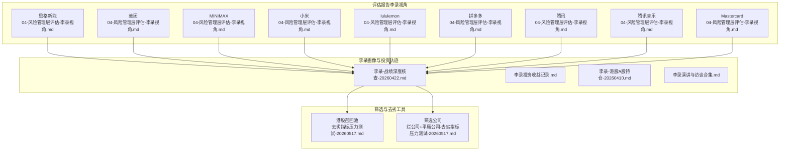
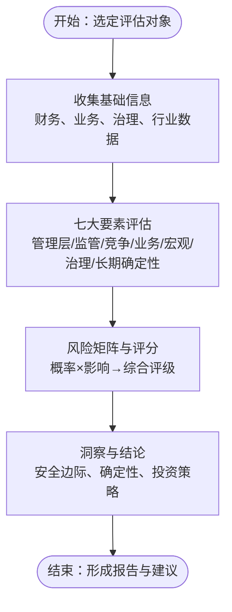
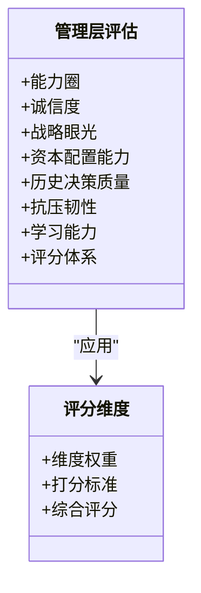
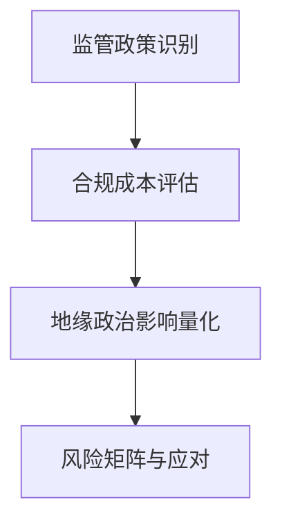
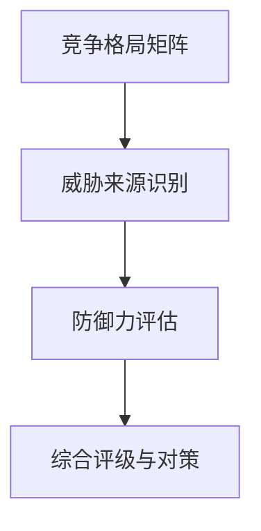
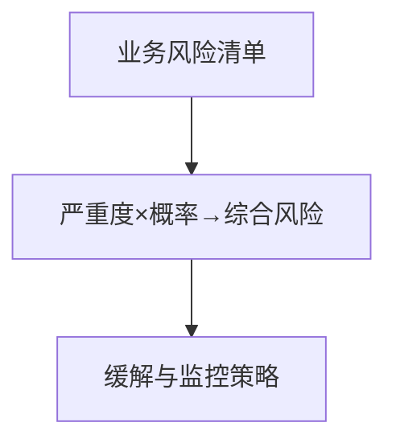
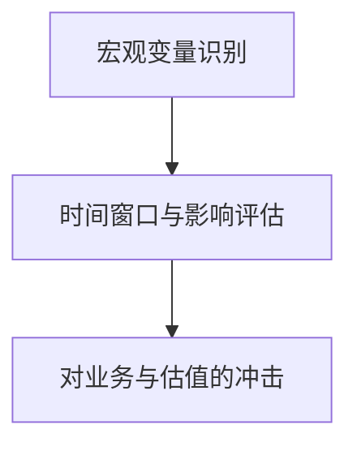
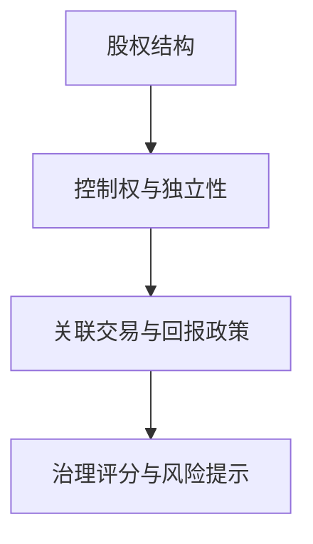
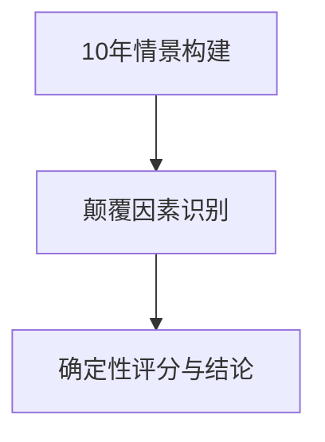
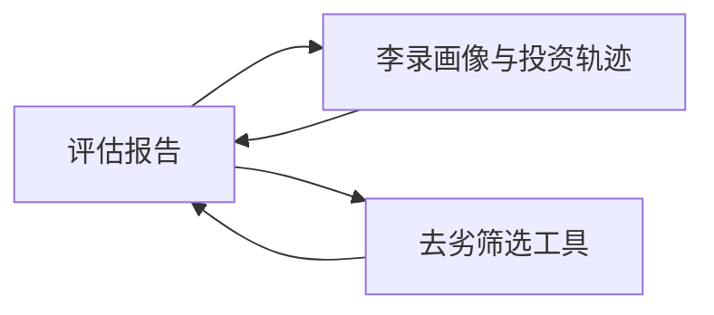

# 李录风险管理评估框架

<cite>
**本文档引用的文件**
- [04-风险管理层评估-李录视角.md](file://reports/思格新能-team-20260409/04-风险管理层评估-李录视角.md)
- [04-风险管理层评估-李录视角.md](file://reports/美团/04-风险管理层评估-李录视角.md)
- [04-风险管理层评估-李录视角.md](file://reports/MINIMAX/04-风险管理层评估-李录视角.md)
- [04-风险管理层评估-李录视角.md](file://reports/小米/04-风险管理层评估-李录视角.md)
- [04-风险管理层评估-李录视角.md](file://reports/lululemon/04-风险管理层评估-李录视角.md)
- [04-风险管理层评估-李录视角.md](file://reports/拼多多/04-风险管理层评估-李录视角.md)
- [04-风险管理层评估-李录视角.md](file://reports/腾讯/04-风险管理层评估-李录视角.md)
- [04-风险管理层评估-李录视角.md](file://reports/腾讯音乐/04-风险管理层评估-李录视角.md)
- [04-风险管理层评估-李录视角.md](file://reports/Mastercard/04-风险管理层评估-李录视角.md)
- [李录-战绩深度核查-20260422.md](file://reports/李录/李录-战绩深度核查-20260422.md)
- [李录投资收益记录.md](file://reports/李录/李录投资收益记录.md)
- [李录-港股A股持仓-20260410.md](file://reports/李录/李录-港股A股持仓-20260410.md)
- [李录演讲与访谈合集.md](file://reports/李录/李录演讲与访谈合集.md)
- [去劣指标压力测试-20260517.md](file://reports/港股召回池/去劣指标压力测试-20260517.md)
- [烂公司+平庸公司-去劣指标压力测试-20260517.md](file://筛选公司/烂公司+平庸公司-去劣指标压力测试-20260517.md)
</cite>

## 目录
1. [引言](#引言)
2. [项目结构](#项目结构)
3. [核心组件](#核心组件)
4. [架构总览](#架构总览)
5. [详细组件分析](#详细组件分析)
6. [依赖分析](#依赖分析)
7. [性能考虑](#性能考虑)
8. [故障排查指南](#故障排查指南)
9. [结论](#结论)
10. [附录](#附录)

## 引言
本指南基于仓库中多份“李录视角”风险评估报告，系统提炼李录式风险管理的理论要点与实践方法，围绕“管理层质量、监管风险、竞争风险、业务风险、宏观风险、治理结构、长期确定性”七大维度，结合具体案例，构建可操作的评估框架与工具箱，帮助使用者在实践中掌握李录式风险识别与管理能力。

## 项目结构
仓库以“报告”和“筛选/工具”两类内容组织，前者是李录视角评估的实证集合，后者是用于去劣筛选与数据支撑的工具。下图展示与本指南相关的核心文件与模块关系：

图表来源
- [04-风险管理层评估-李录视角.md](file://reports/思格新能-team-20260409/04-风险管理层评估-李录视角.md)
- [04-风险管理层评估-李录视角.md](file://reports/美团/04-风险管理层评估-李录视角.md)
- [04-风险管理层评估-李录视角.md](file://reports/MINIMAX/04-风险管理层评估-李录视角.md)
- [04-风险管理层评估-李录视角.md](file://reports/小米/04-风险管理层评估-李录视角.md)
- [04-风险管理层评估-李录视角.md](file://reports/lululemon/04-风险管理层评估-李录视角.md)
- [04-风险管理层评估-李录视角.md](file://reports/拼多多/04-风险管理层评估-李录视角.md)
- [04-风险管理层评估-李录视角.md](file://reports/腾讯/04-风险管理层评估-李录视角.md)
- [04-风险管理层评估-李录视角.md](file://reports/腾讯音乐/04-风险管理层评估-李录视角.md)
- [04-风险管理层评估-李录视角.md](file://reports/Mastercard/04-风险管理层评估-李录视角.md)
- [李录-战绩深度核查-20260422.md](file://reports/李录/李录-战绩深度核查-20260422.md)
- [李录投资收益记录.md](file://reports/李录/李录投资收益记录.md)
- [李录-港股A股持仓-20260410.md](file://reports/李录/李录-港股A股持仓-20260410.md)
- [李录演讲与访谈合集.md](file://reports/李录/李录演讲与访谈合集.md)
- [去劣指标压力测试-20260517.md](file://reports/港股召回池/去劣指标压力测试-20260517.md)
- [烂公司+平庸公司-去劣指标压力测试-20260517.md](file://筛选公司/烂公司+平庸公司-去劣指标压力测试-20260517.md)

章节来源
- [04-风险管理层评估-李录视角.md](file://reports/思格新能-team-20260409/04-风险管理层评估-李录视角.md)
- [04-风险管理层评估-李录视角.md](file://reports/美团/04-风险管理层评估-李录视角.md)
- [04-风险管理层评估-李录视角.md](file://reports/MINIMAX/04-风险管理层评估-李录视角.md)
- [04-风险管理层评估-李录视角.md](file://reports/小米/04-风险管理层评估-李录视角.md)
- [04-风险管理层评估-李录视角.md](file://reports/lululemon/04-风险管理层评估-李录视角.md)
- [04-风险管理层评估-李录视角.md](file://reports/拼多多/04-风险管理层评估-李录视角.md)
- [04-风险管理层评估-李录视角.md](file://reports/腾讯/04-风险管理层评估-李录视角.md)
- [04-风险管理层评估-李录视角.md](file://reports/腾讯音乐/04-风险管理层评估-李录视角.md)
- [04-风险管理层评估-李录视角.md](file://reports/Mastercard/04-风险管理层评估-李录视角.md)
- [李录-战绩深度核查-20260422.md](file://reports/李录/李录-战绩深度核查-20260422.md)
- [李录投资收益记录.md](file://reports/李录/李录投资收益记录.md)
- [李录-港股A股持仓-20260410.md](file://reports/李录/李录-港股A股持仓-20260410.md)
- [李录演讲与访谈合集.md](file://reports/李录/李录演讲与访谈合集.md)
- [去劣指标压力测试-20260517.md](file://reports/港股召回池/去劣指标压力测试-20260517.md)
- [烂公司+平庸公司-去劣指标压力测试-20260517.md](file://筛选公司/烂公司+平庸公司-去劣指标压力测试-20260517.md)

## 核心组件
本框架围绕李录式风险管理的七大要素展开，结合报告中的评估矩阵与评分体系，形成可复用的评估模板与打分维度。核心组件如下：
- 管理层质量评估：能力圈、诚信度、战略眼光、资本配置能力、历史决策质量、抗压韧性、学习能力
- 监管风险分析：国内外监管政策、合规成本、政策不确定性、地缘政治影响
- 竞争风险评估：行业竞争格局、替代威胁、技术迭代、巨头挤压、开源替代
- 业务风险识别：烧钱速度与商业化速度、产品线分散、用户留存、关键人才流失、毛利率压力
- 宏观风险考量：经济周期、行业周期、通胀/利率、地缘摩擦、AI泡沫风险
- 治理结构分析：股权结构、控制权、关联交易、股东回报政策、信息披露透明度
- 长期确定性分析：10年后的商业模式、颠覆性因素、护城河深度、文明趋势

章节来源
- [04-风险管理层评估-李录视角.md](file://reports/美团/04-风险管理层评估-李录视角.md)
- [04-风险管理层评估-李录视角.md](file://reports/MINIMAX/04-风险管理层评估-李录视角.md)
- [04-风险管理层评估-李录视角.md](file://reports/小米/04-风险管理层评估-李录视角.md)
- [04-风险管理层评估-李录视角.md](file://reports/lululemon/04-风险管理层评估-李录视角.md)
- [04-风险管理层评估-李录视角.md](file://reports/拼多多/04-风险管理层评估-李录视角.md)
- [04-风险管理层评估-李录视角.md](file://reports/腾讯/04-风险管理层评估-李录视角.md)
- [04-风险管理层评估-李录视角.md](file://reports/腾讯音乐/04-风险管理层评估-李录视角.md)
- [04-风险管理层评估-李录视角.md](file://reports/Mastercard/04-风险管理层评估-李录视角.md)

## 架构总览
下图展示李录风险管理评估的“输入-处理-输出”流程：以公司为输入，依据七大要素进行多维度打分与风险矩阵评估，最终输出综合评分与投资结论。

图表来源
- [04-风险管理层评估-李录视角.md](file://reports/美团/04-风险管理层评估-李录视角.md)
- [04-风险管理层评估-李录视角.md](file://reports/MINIMAX/04-风险管理层评估-李录视角.md)
- [04-风险管理层评估-李录视角.md](file://reports/小米/04-风险管理层评估-李录视角.md)
- [04-风险管理层评估-李录视角.md](file://reports/拼多多/04-风险管理层评估-李录视角.md)
- [04-风险管理层评估-李录视角.md](file://reports/腾讯/04-风险管理层评估-李录视角.md)
- [04-风险管理层评估-李录视角.md](file://reports/腾讯音乐/04-风险管理层评估-李录视角.md)
- [04-风险管理层评估-李录视角.md](file://reports/Mastercard/04-风险管理层评估-李录视角.md)

## 详细组件分析

### 管理层质量评估
- 能力圈与诚信度：评估管理层是否在能力圈内、过往决策质量、信息披露透明度、股东回报一致性
- 战略眼光与资本配置：是否具备前瞻判断、资源配置效率、对试错成本的控制
- 历史决策质量：关键节点的成败与学习曲线
- 抗压韧性与学习能力：在逆境中的表现与持续学习能力

图表来源
- [04-风险管理层评估-李录视角.md](file://reports/美团/04-风险管理层评估-李录视角.md)
- [04-风险管理层评估-李录视角.md](file://reports/小米/04-风险管理层评估-李录视角.md)
- [04-风险管理层评估-李录视角.md](file://reports/腾讯/04-风险管理层评估-李录视角.md)
- [04-风险管理层评估-李录视角.md](file://reports/腾讯音乐/04-风险管理层评估-李录视角.md)

章节来源
- [04-风险管理层评估-李录视角.md](file://reports/美团/04-风险管理层评估-李录视角.md)
- [04-风险管理层评估-李录视角.md](file://reports/小米/04-风险管理层评估-李录视角.md)
- [04-风险管理层评估-李录视角.md](file://reports/腾讯/04-风险管理层评估-李录视角.md)
- [04-风险管理层评估-李录视角.md](file://reports/腾讯音乐/04-风险管理层评估-李录视角.md)

### 监管风险分析
- 政策不确定性：监管收紧/放松的周期性与不可控性
- 合规成本：数据安全、反垄断、跨境合规带来的成本与约束
- 地缘政治：中美科技竞争、出口管制、VIE结构等对中概股的影响

图表来源
- [04-风险管理层评估-李录视角.md](file://reports/MINIMAX/04-风险管理层评估-李录视角.md)
- [04-风险管理层评估-李录视角.md](file://reports/拼多多/04-风险管理层评估-李录视角.md)
- [04-风险管理层评估-李录视角.md](file://reports/腾讯音乐/04-风险管理层评估-李录视角.md)

章节来源
- [04-风险管理层评估-李录视角.md](file://reports/MINIMAX/04-风险管理层评估-李录视角.md)
- [04-风险管理层评估-李录视角.md](file://reports/拼多多/04-风险管理层评估-李录视角.md)
- [04-风险管理层评估-李录视角.md](file://reports/腾讯音乐/04-风险管理层评估-李录视角.md)

### 竞争风险评估
- 行业竞争格局：头部企业、开源替代、海外竞争、同侪竞争
- 技术迭代与护城河：技术同质化、替代威胁、平台效应
- 市场份额与增长：增长速度、护城河深度、用户粘性

图表来源
- [04-风险管理层评估-李录视角.md](file://reports/MINIMAX/04-风险管理层评估-李录视角.md)
- [04-风险管理层评估-李录视角.md](file://reports/小米/04-风险管理层评估-李录视角.md)
- [04-风险管理层评估-李录视角.md](file://reports/lululemon/04-风险管理层评估-李录视角.md)

章节来源
- [04-风险管理层评估-李录视角.md](file://reports/MINIMAX/04-风险管理层评估-李录视角.md)
- [04-风险管理层评估-李录视角.md](file://reports/小米/04-风险管理层评估-李录视角.md)
- [04-风险管理层评估-李录视角.md](file://reports/lululemon/04-风险管理层评估-李录视角.md)

### 业务风险识别
- 烧钱与商业化：AI公司尤为突出的“烧钱速度>商业化速度”
- 产品线分散：资源过度摊薄、用户留存差、关键人才流失
- 毛利率与成本刚性：上游议价能力、成本结构、周期性压力

图表来源
- [04-风险管理层评估-李录视角.md](file://reports/MINIMAX/04-风险管理层评估-李录视角.md)
- [04-风险管理层评估-李录视角.md](file://reports/腾讯音乐/04-风险管理层评估-李录视角.md)

章节来源
- [04-风险管理层评估-李录视角.md](file://reports/MINIMAX/04-风险管理层评估-李录视角.md)
- [04-风险管理层评估-李录视角.md](file://reports/腾讯音乐/04-风险管理层评估-李录视角.md)

### 宏观风险考量
- 经济与行业周期：经济衰退、消费降级、行业泡沫、AI泡沫风险
- 地缘摩擦与政策：中美关系、技术封锁、汇率波动

图表来源
- [04-风险管理层评估-李录视角.md](file://reports/MINIMAX/04-风险管理层评估-李录视角.md)
- [04-风险管理层评估-李录视角.md](file://reports/拼多多/04-风险管理层评估-李录视角.md)
- [04-风险管理层评估-李录视角.md](file://reports/腾讯/04-风险管理层评估-李录视角.md)

章节来源
- [04-风险管理层评估-李录视角.md](file://reports/MINIMAX/04-风险管理层评估-李录视角.md)
- [04-风险管理层评估-李录视角.md](file://reports/拼多多/04-风险管理层评估-李录视角.md)
- [04-风险管理层评估-李录视角.md](file://reports/腾讯/04-风险管理层评估-李录视角.md)

### 治理结构分析
- 股权与控制权：AB股、超级投票权、创始人持股、战略投资者
- 关联交易与独立性：与母公司的业务与定价关系
- 股东回报：分红、回购、稀释与回报率

图表来源
- [04-风险管理层评估-李录视角.md](file://reports/MINIMAX/04-风险管理层评估-李录视角.md)
- [04-风险管理层评估-李录视角.md](file://reports/腾讯/04-风险管理层评估-李录视角.md)
- [04-风险管理层评估-李录视角.md](file://reports/腾讯音乐/04-风险管理层评估-李录视角.md)

章节来源
- [04-风险管理层评估-李录视角.md](file://reports/MINIMAX/04-风险管理层评估-李录视角.md)
- [04-风险管理层评估-李录视角.md](file://reports/腾讯/04-风险管理层评估-李录视角.md)
- [04-风险管理层评估-李录视角.md](file://reports/腾讯音乐/04-风险管理层评估-李录视角.md)

### 长期确定性分析
- 10年情景：大成/小成/被收购/衰落/倒闭的概率分布
- 颠覆性因素：技术突破、监管剧变、巨头整合、AI AGI
- 文明趋势：运动生活方式、支付数字化、AI代理商业等

图表来源
- [04-风险管理层评估-李录视角.md](file://reports/MINIMAX/04-风险管理层评估-李录视角.md)
- [04-风险管理层评估-李录视角.md](file://reports/lululemon/04-风险管理层评估-李录视角.md)
- [04-风险管理层评估-李录视角.md](file://reports/Mastercard/04-风险管理层评估-李录视角.md)

章节来源
- [04-风险管理层评估-李录视角.md](file://reports/MINIMAX/04-风险管理层评估-李录视角.md)
- [04-风险管理层评估-李录视角.md](file://reports/lululemon/04-风险管理层评估-李录视角.md)
- [04-风险管理层评估-李录视角.md](file://reports/Mastercard/04-风险管理层评估-李录视角.md)

## 依赖分析
- 评估报告之间的相互印证：不同行业的案例（AI、互联网、消费、支付）共同验证框架的适用性
- 李录画像与投资轨迹：通过其持仓、投资收益与演讲，提炼其风险偏好与方法论
- 去劣筛选工具：以财务与现金流指标为“安全网”，在评估前进行“筛掉最差”的过滤

图表来源
- [李录-战绩深度核查-20260422.md](file://reports/李录/李录-战绩深度核查-20260422.md)
- [李录投资收益记录.md](file://reports/李录/李录投资收益记录.md)
- [李录-港股A股持仓-20260410.md](file://reports/李录/李录-港股A股持仓-20260410.md)
- [去劣指标压力测试-20260517.md](file://reports/港股召回池/去劣指标压力测试-20260517.md)
- [烂公司+平庸公司-去劣指标压力测试-20260517.md](file://筛选公司/烂公司+平庸公司-去劣指标压力测试-20260517.md)

章节来源
- [李录-战绩深度核查-20260422.md](file://reports/李录/李录-战绩深度核查-20260422.md)
- [李录投资收益记录.md](file://reports/李录/李录投资收益记录.md)
- [李录-港股A股持仓-20260410.md](file://reports/李录/李录-港股A股持仓-20260410.md)
- [去劣指标压力测试-20260517.md](file://reports/港股召回池/去劣指标压力测试-20260517.md)
- [烂公司+平庸公司-去劣指标压力测试-20260517.md](file://筛选公司/烂公司+平庸公司-去劣指标压力测试-20260517.md)

## 性能考虑
- 评估效率：以“风险矩阵+评分体系”快速定位关键风险，避免在次要变量上过度耗时
- 数据质量：优先使用公开披露、权威来源与可交叉验证的信息，减少噪声
- 方法论一致性：统一维度与权重，便于横向比较与复盘

## 故障排查指南
- 信息不足：当公司披露有限（如新上市公司）时，采用“推断+置信度”标注，避免主观臆断
- 评分偏差：引入“去劣筛选工具”进行前置过滤，剔除财务与现金流异常公司
- 评估漂移：定期回顾与更新风险矩阵，关注政策、技术、竞争格局的动态变化

章节来源
- [04-风险管理层评估-李录视角.md](file://reports/MINIMAX/04-风险管理层评估-李录视角.md)
- [去劣指标压力测试-20260517.md](file://reports/港股召回池/去劣指标压力测试-20260517.md)
- [烂公司+平庸公司-去劣指标压力测试-20260517.md](file://筛选公司/烂公司+平庸公司-去劣指标压力测试-20260517.md)

## 结论
本框架以李录式风险思维为核心，结合多行业实证案例，形成“七大要素+风险矩阵+长期确定性”的系统化评估方法。通过统一的评分体系与工具箱，使用者可在实践中快速识别关键风险、评估管理层质量、判断商业模式确定性，并据此做出稳健的投资决策。

## 附录
- 李录投资轨迹与方法论要点
  - 赛道选择：科技平台、金融机构、中国制造升级
  - 买入时机：危机/恐慌中买入，从不追高
  - 卖出纪律：估值过高时减持
  - 组合管理：中美均衡配置
  - 长期主义：平均持有时间远超同行

章节来源
- [李录-战绩深度核查-20260422.md](file://reports/李录/李录-战绩深度核查-20260422.md)
- [李录投资收益记录.md](file://reports/李录/李录投资收益记录.md)
- [李录-港股A股持仓-20260410.md](file://reports/李录/李录-港股A股持仓-20260410.md)
- [李录演讲与访谈合集.md](file://reports/李录/李录演讲与访谈合集.md)