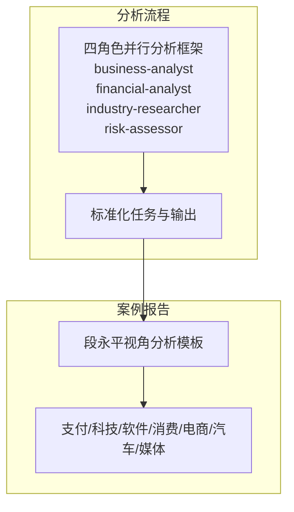
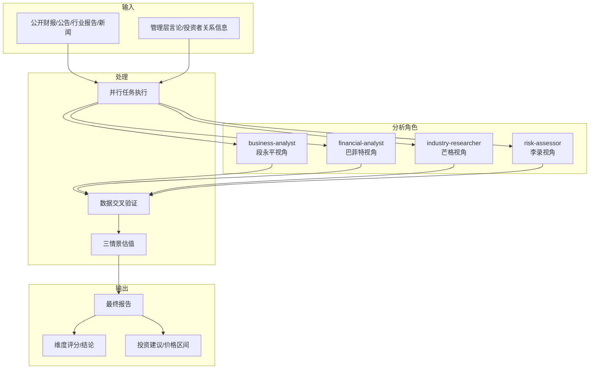
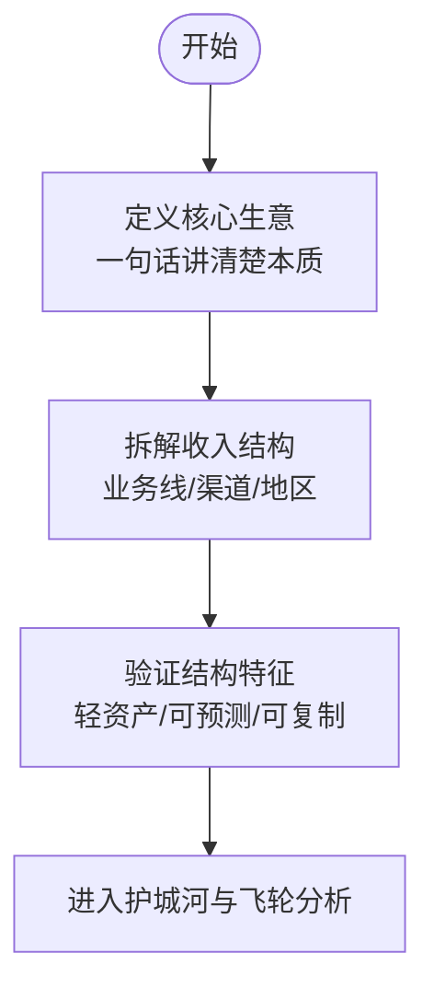
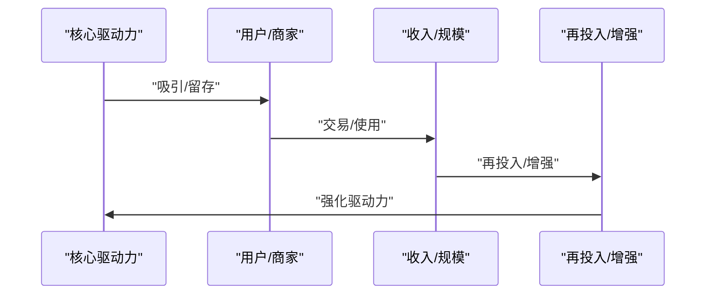
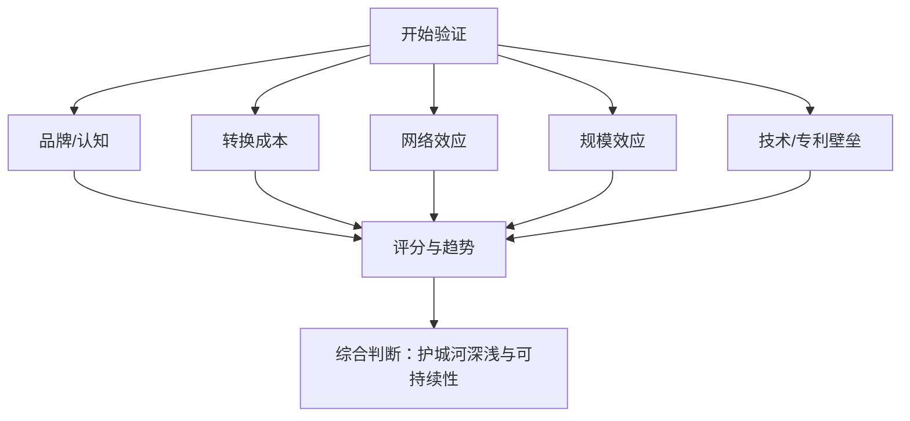
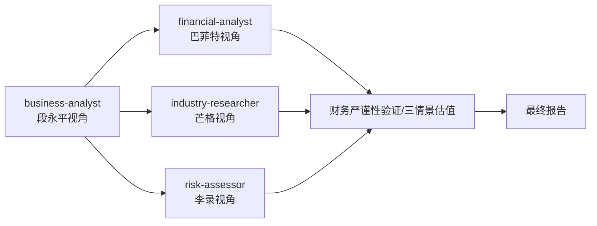

# 段永平商业模式分析框架

<cite>
**本文引用的文件**
- [技能：投研团队：四角色并行分析框架](file://skills/investment-team.md)
- [报告：Mastercard 商业模式分析（段永平视角）](file://reports/Mastercard/01-商业模式分析-段永平视角.md)
- [报告：ADP 商业模式分析（段永平视角）](file://reports/ADP/01-商业模式分析-段永平视角.md)
- [报告：Qualcomm 商业模式分析（段永平视角）](file://reports/Qualcomm/01-商业模式分析-段永平视角.md)
- [报告：诺和诺德（Novo Nordisk）商业模式分析（段永平视角）](file://reports/Novo Nordisk/01-商业模式分析-段永平视角.md)
- [报告：Adobe 商业模式分析（段永平视角）](file://reports/Adobe/01-商业模式分析-段永平视角.md)
- [报告：lululemon 商业模式分析（段永平视角）](file://reports/lululemon/01-商业模式分析-段永平视角.md)
- [报告：懂车帝 商业模式分析（段永平视角）](file://reports/懂车帝/01-商业模式分析-段永平视角.md)
- [报告：拼多多 商业模式分析（段永平视角）](file://reports/拼多多/01-商业模式分析-段永平视角.md)
- [报告：小米 商业模式分析（段永平视角）](file://reports/小米/01-商业模式分析-段永平视角.md)
- [报告：搜狐 商业模式分析（段永平视角）](file://reports/搜狐/01-商业模式分析-段永平视角.md)
- [报告：群核科技 商业模式分析（段永平视角）](file://reports/群核科技-team-20260409/01-商业模式分析-段永平视角.md)
- [报告：腾讯音乐 商业模式分析（段永平视角）](file://reports/腾讯音乐/01-商业模式分析-段永平视角.md)
- [报告：腾讯（投资研究报告）](file://reports/腾讯/腾讯控股-投资研究报告.md)
- [报告：阿里巴巴 商业模式分析（段永平视角）](file://reports/阿里巴巴/01-商业模式分析-段永平视角.md)
- [报告：MINIMAX 商业模式分析（段永平视角）](file://reports/MINIMAX/01-商业模式分析-段永平视角.md)
- [报告：拼多多（护城河专题）](file://reports/拼多多/最终报告-护城河专题-20260412.md)
- [报告：段永平雪球发言-PDD相关](file://reports/拼多多/段永平雪球发言-PDD相关.md)
</cite>

## 目录
1. [引言](#引言)
2. [项目结构](#项目结构)
3. [核心组件](#核心组件)
4. [架构总览](#架构总览)
5. [详细组件分析](#详细组件分析)
6. [依赖分析](#依赖分析)
7. [性能考量](#性能考量)
8. [故障排查指南](#故障排查指南)
9. [结论](#结论)
10. [附录](#附录)

## 引言
本文件系统化整理并输出“段永平商业模式分析框架”的理论与实践文档，面向希望用段永平视角判断企业价值的研究者与投资者。框架以“好生意”为核心标准，围绕商业模式本质、用户价值、护城河验证、平台/产品飞轮、业务矩阵与协同、以及“好生意”综合评估展开，配套分析步骤、判断标准、实用工具与案例研究，帮助读者建立可复制、可验证的分析流程。

## 项目结构
本仓库以“报告+技能”双轨组织：  
- 报告模块：以“段永平视角”对多家公司进行商业模式深度解析，覆盖支付、软件订阅、消费品牌、电商、汽车、游戏、媒体等多行业，形成可复用的分析模板与结论路径。  
- 技能模块：提供“四角色并行分析框架”，将“段永平视角”纳入标准化投研流程，确保分析维度、数据交叉验证与最终报告质量。

图表来源
- [技能：投研团队：四角色并行分析框架:40-93](file://skills/investment-team.md#L40-L93)

章节来源
- [技能：投研团队：四角色并行分析框架:1-214](file://skills/investment-team.md#L1-L214)

## 核心组件
- 段永平“好生意”标准：差异化、定价权、可持续竞争优势。  
- 商业模式七要素：核心生意定义、收入结构拆解、平台/产品飞轮、护城河验证（品牌/转换成本/网络效应/规模效应/技术壁垒）、用户价值创造、业务矩阵与协同、好生意综合评估。  
- 分析工具与流程：四角色并行、任务驱动、数据交叉验证、三情景估值、报告准出抽检。  

章节来源
- [技能：投研团队：四角色并行分析框架:44-53](file://skills/investment-team.md#L44-L53)
- [技能：投研团队：四角色并行分析框架:104-128](file://skills/investment-team.md#L104-L128)

## 架构总览
下图展示“段永平商业模式分析框架”的系统化架构：  
- 输入：公司公开信息（财报、行业报告、新闻、管理层言论）。  
- 处理：四角色并行分析，分别聚焦“商业模式与护城河”、“财务与估值”、“行业与竞争”、“风险与管理层”。  
- 输出：统一的最终报告，包含维度评分、核心数据速览、投资论点、巴菲特买入前Checklist、最终建议与总结。

图表来源
- [技能：投研团队：四角色并行分析框架:94-138](file://skills/investment-team.md#L94-L138)
- [技能：投研团队：四角色并行分析框架:140-182](file://skills/investment-team.md#L140-L182)

章节来源
- [技能：投研团队：四角色并行分析框架:1-214](file://skills/investment-team.md#L1-L214)

## 详细组件分析

### 一、核心生意定义与收入结构拆解
- 核心生意定义：用“一句话”提炼公司本质，剥离表象（如平台、工具、媒体），直指“价值创造与收费机制”。  
- 收入结构拆解：按业务线/渠道/地区拆分，识别“轻资产、高预测性、可复制”的特征。  
- 案例要点：
  - Mastercard：收“过路费”的技术网络公司，轻资产、零坏账、边际成本趋近于零。  
  - ADP：代客户管钱，三层收入（处理费+浮存金利息+增值服务），类保险公司的经济模型。  
  - Adobe：创意生产力工具订阅平台，高转换成本+行业标准地位+订阅现金流。  
  - 懂车帝：依托字节流量生态的汽车线索交易平台，CPS佣金+品牌广告+SaaS工具。  
  - 拼多多：中国制造业产能的流量分配器，主站+多多买菜+Temu的“国内+近场+出海”矩阵。  
  - 小米：以智能手机为入口的“硬件+互联网”平台，叠加智能电动汽车第二曲线。  

图表来源
- [报告：Mastercard 商业模式分析（段永平视角）:8-18](file://reports/Mastercard/01-商业模式分析-段永平视角.md#L8-L18)
- [报告：ADP 商业模式分析（段永平视角）:8-16](file://reports/ADP/01-商业模式分析-段永平视角.md#L8-L16)
- [报告：Adobe 商业模式分析（段永平视角）:8-15](file://reports/Adobe/01-商业模式分析-段永平视角.md#L8-L15)
- [报告：懂车帝 商业模式分析（段永平视角）:9-28](file://reports/懂车帝/01-商业模式分析-段永平视角.md#L9-L28)
- [报告：拼多多 商业模式分析（段永平视角）:6-24](file://reports/拼多多/01-商业模式分析-段永平视角.md#L6-L24)
- [报告：小米 商业模式分析（段永平视角）:7-24](file://reports/小米/01-商业模式分析-段永平视角.md#L7-L24)

章节来源
- [报告：Mastercard 商业模式分析（段永平视角）:8-18](file://reports/Mastercard/01-商业模式分析-段永平视角.md#L8-L18)
- [报告：ADP 商业模式分析（段永平视角）:8-16](file://reports/ADP/01-商业模式分析-段永平视角.md#L8-L16)
- [报告：Adobe 商业模式分析（段永平视角）:8-15](file://reports/Adobe/01-商业模式分析-段永平视角.md#L8-L15)
- [报告：懂车帝 商业模式分析（段永平视角）:9-28](file://reports/懂车帝/01-商业模式分析-段永平视角.md#L9-L28)
- [报告：拼多多 商业模式分析（段永平视角）:6-24](file://reports/拼多多/01-商业模式分析-段永平视角.md#L6-L24)
- [报告：小米 商业模式分析（段永平视角）:7-24](file://reports/小米/01-商业模式分析-段永平视角.md#L7-L24)

### 二、平台/产品飞轮效应
- 飞轮逻辑：以“核心驱动力”为起点，形成“用户增长—留存—收入—再增长”的自我强化循环。  
- 关键差异：不同公司飞轮的驱动力不同（价格、体验、算法、品牌、物流等）。  
- 案例要点：
  - 拼多多国内飞轮：低价白牌商品→价格敏感用户→海量订单→工厂薄利多销→更低价格→更多用户。  
  - 拼多多Temu飞轮：中国供应链极低成本→Temu定价远低于海外竞品→社交裂变+巨额营销获客→规模化后单位物流成本下降→用户复购率提升。  
  - Adobe飞轮：创意工具→专业工作流嵌入→文件格式锁定→云端协作网络→持续订阅。  
  - Mastercard飞轮：更多持卡人→商户更愿意接受→更多商户接入→增值服务爆发→飞轮多维加速。  

图表来源
- [报告：拼多多 商业模式分析（段永平视角）:41-72](file://reports/拼多多/01-商业模式分析-段永平视角.md#L41-L72)
- [报告：Adobe 商业模式分析（段永平视角）:26-35](file://reports/Adobe/01-商业模式分析-段永平视角.md#L26-L35)
- [报告：Mastercard 商业模式分析（段永平视角）:24-42](file://reports/Mastercard/01-商业模式分析-段永平视角.md#L24-L42)

章节来源
- [报告：拼多多 商业模式分析（段永平视角）:41-72](file://reports/拼多多/01-商业模式分析-段永平视角.md#L41-L72)
- [报告：Adobe 商业模式分析（段永平视角）:26-35](file://reports/Adobe/01-商业模式分析-段永平视角.md#L26-L35)
- [报告：Mastercard 商业模式分析（段永平视角）:24-42](file://reports/Mastercard/01-商业模式分析-段永平视角.md#L24-L42)

### 三、护城河验证（品牌/转换成本/网络效应/规模效应/技术壁垒）
- 逐项验证：对每一类护城河进行“是否存在→强度→可持续性→可复制性”的系统评估。  
- 段永平标准：护城河必须是“自己的”“可持续的”“不可复制的”。  
- 案例要点：
  - 拼多多：规模效应为真护城河，品牌与网络效应为伪护城河；“低价心智”不是差异化。  
  - 腾讯音乐：转换成本中等，社交关系嵌入较强，但平台间迁移成本低；品牌不构成独立护城河。  
  - 群核科技：转换成本与数据壁垒中等，网络效应三角较强，但技术门槛可被追赶。  
  - 阿里巴巴：电商中介定价权弱，核心业务护城河在收缩，阿里云+AI相对可持续。  
  - MINIMAX：当前优势大多不可持续，缺乏定价权与自由现金流，不是“好生意”。  
  - 懂车帝：护城河来自字节流量与算法，属“租来的”，缺乏独立定价权与可持续性。  

图表来源
- [报告：拼多多（护城河专题）:49-67](file://reports/拼多多/最终报告-护城河专题-20260412.md#L49-L67)
- [报告：腾讯音乐/群核科技/阿里巴巴/MINIMAX/懂车帝:113-131](file://reports/腾讯音乐/01-商业模式分析-段永平视角.md#L113-L131)
- [报告：群核科技 商业模式分析（段永平视角）:44-79](file://reports/群核科技-team-20260409/01-商业模式分析-段永平视角.md#L44-L79)
- [报告：阿里巴巴 商业模式分析（段永平视角）:237-263](file://reports/阿里巴巴/01-商业模式分析-段永平视角.md#L237-L263)
- [报告：MINIMAX 商业模式分析（段永平视角）:158-190](file://reports/MINIMAX/01-商业模式分析-段永平视角.md#L158-L190)
- [报告：懂车帝 商业模式分析（段永平视角）:101-199](file://reports/懂车帝/01-商业模式分析-段永平视角.md#L101-L199)

章节来源
- [报告：拼多多（护城河专题）:49-67](file://reports/拼多多/最终报告-护城河专题-20260412.md#L49-L67)
- [报告：腾讯音乐/群核科技/阿里巴巴/MINIMAX/懂车帝:113-131](file://reports/腾讯音乐/01-商业模式分析-段永平视角.md#L113-L131)
- [报告：群核科技 商业模式分析（段永平视角）:44-79](file://reports/群核科技-team-20260409/01-商业模式分析-段永平视角.md#L44-L79)
- [报告：阿里巴巴 商业模式分析（段永平视角）:237-263](file://reports/阿里巴巴/01-商业模式分析-段永平视角.md#L237-L263)
- [报告：MINIMAX 商业模式分析（段永平视角）:158-190](file://reports/MINIMAX/01-商业模式分析-段永平视角.md#L158-L190)
- [报告：懂车帝 商业模式分析（段永平视角）:101-199](file://reports/懂车帝/01-商业模式分析-段永平视角.md#L101-L199)

### 四、用户/客户价值创造
- 为C端、B端、生态伙伴创造的独特价值，是否“不可替代”“难以复制”。  
- 案例要点：
  - Adobe：专业工作流深度嵌入+文件格式锁定+云端协作网络，用户粘性强。  
  - lulu：社区文化+产品体验+DTC高占比，形成高复购与高终身价值。  
  - 懂车帝：依托字节流量与算法，为车企/经销商提供线索与SaaS工具，但用户价值依赖生态而非平台自身。  
  - 拼多多：消费者获得极致性价比，工厂商家获得直达消费者与规模化订单，品牌商家获得增量用户与清库存渠道。  

章节来源
- [报告：Adobe 商业模式分析（段永平视角）:16-25](file://reports/Adobe/01-商业模式分析-段永平视角.md#L16-L25)
- [报告：lululemon 商业模式分析（段永平视角）:41-56](file://reports/lululemon/01-商业模式分析-段永平视角.md#L41-L56)
- [报告：懂车帝 商业模式分析（段永平视角）:46-86](file://reports/懂车帝/01-商业模式分析-段永平视角.md#L46-L86)
- [报告：拼多多 商业模式分析（段永平视角）:103-124](file://reports/拼多多/01-商业模式分析-段永平视角.md#L103-L124)

### 五、业务矩阵与协同效应
- 识别主业务与副业务的定位、协同维度（供应链、流量、技术、商家、物流等）。  
- 案例要点：
  - 拼多多：主站→Temu供应链协同最强；Temu→主站协同最弱；多多买菜作为高频入口与主站形成互补。  
  - 小米：手机→IoT→互联网服务→汽车的生态闭环，但飞轮转速不高，协同效应有限。  
  - Mastercard：支付+增值服务+跨境平台（Move）形成多维协同。  

章节来源
- [报告：拼多多 商业模式分析（段永平视角）:127-151](file://reports/拼多多/01-商业模式分析-段永平视角.md#L127-L151)
- [报告：小米 商业模式分析（段永平视角）:41-65](file://reports/小米/01-商业模式分析-段永平视角.md#L41-L65)
- [报告：Mastercard 商业模式分析（段永平视角）:24-42](file://reports/Mastercard/01-商业模式分析-段永平视角.md#L24-L42)

### 六、“好生意”综合评估
- 依据段永平“差异化、定价权、可持续竞争优势”三项标准，结合“简单可理解、管理层与企业文化、利润结构与自由现金流”等维度进行评分。  
- 案例要点：
  - Mastercard：差异化明确（网络效应+增值服务）、定价权强、可持续优势深厚，是“好生意”。  
  - ADP：差异化一般但护城河稳固（转换成本+合规）、定价权温和、可持续性强，是“好生意”。  
  - 懂车帝：差异化来自字节生态，非自身护城河；缺乏定价权；行业结构不友好，非“好生意”。  
  - MINIMAX：无定价权、无护城河、无自由现金流，非“好生意”。  
  - 拼多多：效率驱动而非品牌驱动，缺乏终端定价权，是“好但不伟大”的生意。  

章节来源
- [报告：Mastercard 商业模式分析（段永平视角）:63-78](file://reports/Mastercard/01-商业模式分析-段永平视角.md#L63-L78)
- [报告：ADP 商业模式分析（段永平视角）:47-56](file://reports/ADP/01-商业模式分析-段永平视角.md#L47-L56)
- [报告：懂车帝 商业模式分析（段永平视角）:262-298](file://reports/懂车帝/01-商业模式分析-段永平视角.md#L262-L298)
- [报告：MINIMAX 商业模式分析（段永平视角）:173-190](file://reports/MINIMAX/01-商业模式分析-段永平视角.md#L173-L190)
- [报告：拼多多 商业模式分析（段永平视角）:154-198](file://reports/拼多多/01-商业模式分析-段永平视角.md#L154-L198)

## 依赖分析
- 组件耦合与协作：business-analyst输出的“商业模式与护城河”结论直接影响财务与估值、行业与竞争、风险评估的侧重点与权重。  
- 外部依赖：公开数据来源（财报、行业报告、新闻）的质量与时效性直接影响分析结论的可信度。  
- 工具链依赖：财务严谨性验证、三情景估值、报告抽检等工具确保结论可验证、可追溯。  

图表来源
- [技能：投研团队：四角色并行分析框架:94-138](file://skills/investment-team.md#L94-L138)
- [技能：投研团队：四角色并行分析框架:183-199](file://skills/investment-team.md#L183-L199)

章节来源
- [技能：投研团队：四角色并行分析框架:1-214](file://skills/investment-team.md#L1-L214)

## 性能考量
- 时间效率：四角色并行启动，缩短整体分析周期；实时跟踪进度，及时补充分析缺口。  
- 数据质量：关键数据双源交叉验证，避免单一来源偏差；对异常波动进行趋势与结构化解读。  
- 结论稳健性：通过三情景估值与报告抽检，降低主观偏误与遗漏风险。  

## 故障排查指南
- 常见问题与对策：
  - “护城河评分与结论不一致”：回到“是否存在→强度→可持续性→可复制性”的验证路径，逐项核对证据。  
  - “飞轮逻辑不闭环”：区分“理论飞轮”与“现实闭环”，关注关键约束（价格依赖、算法依赖、外部生态依赖）。  
  - “定价权判断偏差”：区分对上游（商家）与对下游（消费者）的议价能力，避免“流量分配权=定价权”的误区。  
  - “好生意标准误判”：坚持“差异化、定价权、可持续优势”三位一体，警惕“效率驱动”与“生态依赖”。  
- 工具辅助：
  - 使用财务严谨性验证工具交叉校验关键财务指标。  
  - 使用三情景估值工具评估不同假设下的估值区间。  
  - 使用报告抽检工具抽取关键结论进行信源复核。  

章节来源
- [技能：投研团队：四角色并行分析框架:64-69](file://skills/investment-team.md#L64-L69)
- [技能：投研团队：四角色并行分析框架:185-199](file://skills/investment-team.md#L185-L199)

## 结论
段永平商业模式分析框架以“好生意”为纲，通过“核心生意定义—收入结构—飞轮—护城河—用户价值—业务矩阵—综合评估”七步法，辅以四角色并行与工具链验证，形成可复制、可验证、可输出的系统化投研方法。实践中应特别关注“护城河是否独立且可持续”“定价权是否真实存在”“生意是否简单可理解”等关键判断点，并结合公开数据与行业动态进行动态更新与纠偏。

## 附录
- 实用工具清单：
  - 财务严谨性验证：市值验算、估值验算、关键数据交叉验证、三情景估值。  
  - 报告抽检：抽取15%随机样本进行信源复核与结论判定。  
- 案例参考目录：
  - 支付与科技：Mastercard、ADP、Qualcomm、诺和诺德、Adobe。  
  - 消费与品牌：lululemon、搜狐。  
  - 平台与电商：拼多多、懂车帝、小米、腾讯音乐、阿里巴巴、MINIMAX。  

章节来源
- [技能：投研团队：四角色并行分析框架:64-69](file://skills/investment-team.md#L64-L69)
- [技能：投研团队：四角色并行分析框架:185-199](file://skills/investment-team.md#L185-L199)