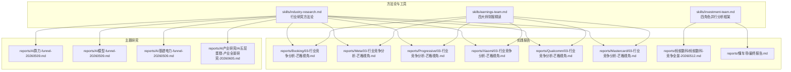
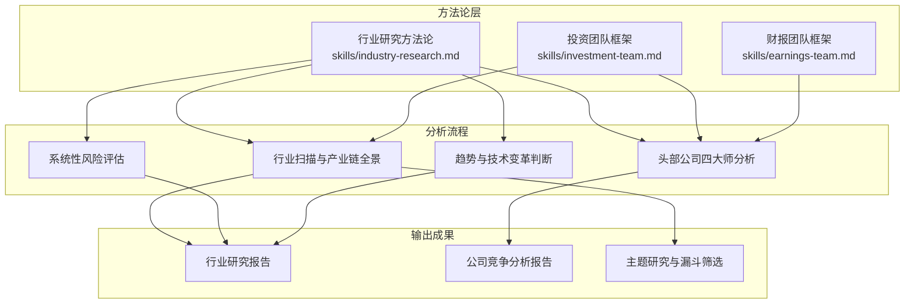
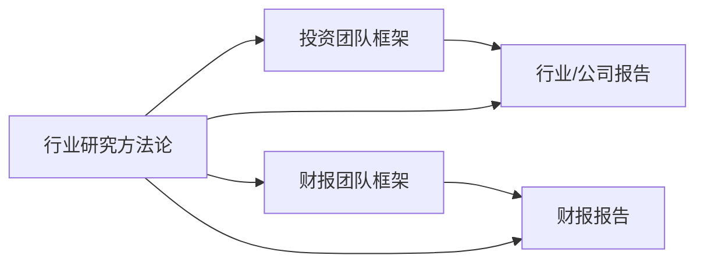

# 芒格行业竞争分析框架

<cite>
**本文档引用的文件**
- [行业研究技能](file://skills/industry-research.md)
- [投资团队技能](file://skills/investment-team.md)
- [财报团队技能](file://skills/earnings-team.md)
- [Booking行业竞争分析-芒格视角](file://reports/Booking/03-行业竞争分析-芒格视角.md)
- [Meta行业竞争分析-芒格视角](file://reports/Meta/03-行业竞争分析-芒格视角.md)
- [Progressive行业竞争分析-芒格视角](file://reports/Progressive/03-行业竞争分析-芒格视角.md)
- [小米行业竞争分析-芒格视角](file://reports/Xiaomi/03-行业竞争分析-芒格视角.md)
- [Qualcomm行业竞争分析-芒格视角](file://reports/Qualcomm/03-行业竞争分析-芒格视角.md)
- [Mastercard行业竞争分析-芒格视角](file://reports/Mastercard/03-行业竞争分析-芒格视角.md)
- [泸州老窖行业竞争分析-芒格视角](file://reports/泸州老窖/泸州老窖-行业竞争格局研究-芒格视角-20260516.md)
- [懂车帝最终报告](file://reports/懂车帝/最终报告.md)
- [蚂蚁数科竞争全景](file://reports/蚂蚁数科/蚂蚁数科-竞争全景-20260512.md)
- [AI算力漏斗研究](file://reports/AI算力-funnel-20260509.md)
- [AI模型漏斗研究](file://reports/AI模型-funnel-20260509.md)
- [AI基建电力漏斗研究](file://reports/AI基建电力-funnel-20260509.md)
- [AI五层蛋糕产业研究](file://reports/AI产业研究/AI五层蛋糕-产业全景研究-20260605.md)
- [AI五层蛋糕-第四层模型层深度研究](file://reports/AI产业研究/AI五层蛋糕-第四层模型层深度研究-20260605.md)
- [AI五层蛋糕-第五层应用层-10家公司深度研究](file://reports/AI产业研究/AI五层蛋糕-第五层应用层-10家公司深度研究-20260605.md)
</cite>

## 目录
1. [引言](#引言)
2. [项目结构](#项目结构)
3. [核心组件](#核心组件)
4. [架构总览](#架构总览)
5. [详细组件分析](#详细组件分析)
6. [依赖关系分析](#依赖关系分析)
7. [性能考量](#性能考量)
8. [故障排查指南](#故障排查指南)
9. [结论](#结论)
10. [附录](#附录)

## 引言
本文件系统化阐述“芒格行业竞争分析框架”，基于仓库中现有的行业研究方法与多篇实践报告，提炼出一套可操作的分析范式。该框架以芒格的逆向思维为核心，围绕行业规模与增长、竞争格局、核心竞争者威胁、细分赛道、行业趋势与技术变革、产业链价值分配、新兴进入者威胁七个维度展开，辅以系统性风险检查清单与“反过来想”的方法论，帮助使用者建立稳定的行业洞察能力与竞争态势判断能力。

## 项目结构
仓库中与行业分析直接相关的内容主要分布在以下位置：
- skills目录：提供行业研究、投资团队、财报团队的标准化方法论与工作流
- reports目录：包含多个行业与公司层面的“芒格视角”竞争分析报告
- data与docs：提供基础数据与背景研究材料

图表来源
- [行业研究技能](file://skills/industry-research.md)
- [投资团队技能](file://skills/investment-team.md)
- [财报团队技能](file://skills/earnings-team.md)
- [Booking行业竞争分析-芒格视角](file://reports/Booking/03-行业竞争分析-芒格视角.md)
- [Meta行业竞争分析-芒格视角](file://reports/Meta/03-行业竞争分析-芒格视角.md)
- [Progressive行业竞争分析-芒格视角](file://reports/Progressive/03-行业竞争分析-芒格视角.md)
- [小米行业竞争分析-芒格视角](file://reports/Xiaomi/03-行业竞争分析-芒格视角.md)
- [Qualcomm行业竞争分析-芒格视角](file://reports/Qualcomm/03-行业竞争分析-芒格视角.md)
- [Mastercard行业竞争分析-芒格视角](file://reports/Mastercard/03-行业竞争分析-芒格视角.md)
- [蚂蚁数科竞争全景](file://reports/蚂蚁数科/蚂蚁数科-竞争全景-20260512.md)
- [懂车帝最终报告](file://reports/懂车帝/最终报告.md)
- [AI算力漏斗研究](file://reports/AI算力-funnel-20260509.md)
- [AI模型漏斗研究](file://reports/AI模型-funnel-20260509.md)
- [AI基建电力漏斗研究](file://reports/AI基建电力-funnel-20260509.md)
- [AI五层蛋糕产业研究](file://reports/AI产业研究/AI五层蛋糕-产业全景研究-20260605.md)

章节来源
- [行业研究技能](file://skills/industry-research.md)
- [投资团队技能](file://skills/investment-team.md)
- [财报团队技能](file://skills/earnings-team.md)

## 核心组件
- 方法论体系：以“段永平的生意本质—巴菲特的财务质量—芒格的竞争格局—李录的风险猎手”四维分析为基础，辅以系统性风险检查清单与“反过来想”的逆向思维。
- 实践范式：通过多篇行业与公司报告，展示如何在不同行业中应用上述方法论，形成可复制的分析流程。
- 工具与流程：提供标准化的任务分解、并行Agent执行、数据交叉验证与报告输出机制。

章节来源
- [行业研究技能](file://skills/industry-research.md)
- [投资团队技能](file://skills/investment-team.md)
- [财报团队技能](file://skills/earnings-team.md)

## 架构总览
下图展示了“芒格行业竞争分析框架”的整体架构：从行业研究方法论出发，到多Agent并行分析，再到具体行业与公司报告的落地应用。

图表来源
- [行业研究技能](file://skills/industry-research.md)
- [投资团队技能](file://skills/investment-team.md)
- [财报团队技能](file://skills/earnings-team.md)

## 详细组件分析

### 方法论：行业研究方法论（段永平—巴菲特—芒格—李录）
- 逻辑链构建与验证：从底层趋势到受益标的，逐环节提出质疑并寻找证据。
- 产业链全景：上游→中游→下游→辅助，标注每个环节的商业模式、毛利率、竞争格局、壁垒与周期性。
- 全球上市公司扫描：覆盖A股/港股/美股/国际，按投资确定性分层（Tier 1-4）。
- 四大师分析：段永平（生意本质）、巴菲特（财务质量）、芒格（竞争格局）、李录（风险）。
- 系统性风险检查清单：替代技术、政策/监管黑天鹅、需求周期性回调、估值泡沫破裂等。
- 文明趋势判断：底层趋势是“范式转移”还是“阶段性热潮”。

章节来源
- [行业研究技能](file://skills/industry-research.md)

### 方法论：投资团队并行分析框架
- 四角色分工：business-analyst（段永平）、financial-analyst（巴菲特）、industry-researcher（芒格）、risk-assessor（李录）。
- 任务分解：商业模式分析、财务与估值分析、行业与竞争分析、风险与管理层评估。
- 数据交叉验证：关键财务数据必须来自两个独立来源，使用工具进行校验。
- 报告输出：四维评分、核心数据速览、投资论点、最终建议与压力测试。

章节来源
- [投资团队技能](file://skills/investment-team.md)

### 方法论：财报团队并行分析框架
- 四大师并行：段永平（生意本质）、巴菲特（财务质量）、芒格（竞争格局）、李录（风险信号）。
- 关键流程：资料获取（A/B/C级评级）、并行Agent执行、合成报告、编辑与读者评审、数据抽检。
- 输出文件：最终公众号文章、研究底稿、各视角报告与读者评审。

章节来源
- [财报团队技能](file://skills/earnings-team.md)

### 实践范式：Booking行业竞争分析（芒格视角）
- 竞争格局：全球双寡头+区域挑战者，Booking与Expedia合计占全球在线旅游交易量50%以上；Airbnb互补竞争；携程亚洲市场；Google作为流量入口/潜在威胁。
- 护城河评估：网络效应、规模经济、品牌认知、转换成本、数据壁垒；脆弱面在于“多归属”现象。
- 逆向思维：Google AI重塑搜索与预订、酒店直订侵蚀、经济衰退、监管风险；概率评估与时间框架。
- 最终判断：好生意但不完美，关键在于能否在AI时代保持不可替代性。

章节来源
- [Booking行业竞争分析-芒格视角](file://reports/Booking/03-行业竞争分析-芒格视角.md)

### 实践范式：Meta行业竞争分析（芒格视角）
- 三巨头格局：Meta首次超越Google成为全球最大的数字广告平台，份额差距在拉大。
- 竞争对比：Meta vs Google（AI对广告效率的差异化提升）、Meta vs TikTok（社交图谱vs内容算法）、Meta vs Snap（不在同一级别）、Meta vs 苹果（隐私政策博弈）。
- 护城河评估：网络效应、规模经济、品牌忠诚度、转换成本、数据优势。
- 综合评分：市场地位、竞争优势持久性、应对能力、行业增长空间。

章节来源
- [Meta行业竞争分析-芒格视角](file://reports/Meta/03-行业竞争分析-芒格视角.md)

### 实践范式：Progressive行业竞争分析（芒格视角）
- 竞争格局：美国车险市场集中度提升，Progressive快速缩小与State Farm差距，GEICO份额被侵蚀。
- 对比分析：Progressive vs GEICO（技术能力、渠道模式、市场份额趋势）、Progressive vs State Farm（互助制优势与劣势）、Progressive vs Allstate（捆绑化趋势）。
- 护城河分析：数据与算法壁垒、规模经济与品牌、双渠道分销网络、承保纪律文化。
- 结构性趋势：费率硬化周期见顶、UBI普及、捆绑化加速、气候变化影响。
- 总结：在高集中化行业中，技术领先者持续吃掉落后者份额，是“搬不走”的护城河。

章节来源
- [Progressive行业竞争分析-芒格视角](file://reports/Progressive/03-行业竞争分析-芒格视角.md)

### 实践范式：小米行业竞争分析（芒格视角）
- 智能手机：红海中的苦战，全球第三但中国市场排名下滑至第四，华为回归冲击持续。
- IoT与智能家居：全球最大消费级IoT平台，10.79亿设备连接数形成网络效应。
- 智能电动汽车：增长最猛但风险最大，比亚迪规模优势是质的差距。
- 互联网服务：高毛利但增长乏力，ARPU提升困难。
- 芒格逆向：智能手机出货量持续下滑、汽车业务大规模亏损反噬、华为全面挤压、跨界分散精力、10年后的智能手机行业形态。

章节来源
- [小米行业竞争分析-芒格视角](file://reports/Xiaomi/03-行业竞争分析-芒格视角.md)

### 实践范式：Qualcomm行业竞争分析（芒格视角）
- 三大战场：旗舰手机芯片（vs MediaTek）、iPhone基带（vs Apple自研）、汽车芯片（vs多方竞争）。
- 护城河评估：5G标准必要专利（极强）、芯片设计能力与Oryon架构（中等偏强）、汽车平台锁定效应（正在建立）、生态系统（中等）。
- 逆向思考：6G专利格局重塑、ARM诉讼反转、中国市场地缘风险、MediaTek在旗舰市场突破。

章节来源
- [Qualcomm行业竞争分析-芒格视角](file://reports/Qualcomm/03-行业竞争分析-芒格视角.md)

### 实践范式：Mastercard行业竞争分析（芒格视角）
- 竞争格局：Visa/Mastercard双寡头、金融科技（PayPal/Stripe/Square）、区域支付网络、稳定币/CBDC威胁。
- 护城河评估：网络效应（最强）、转换成本、监管壁垒、数据资产、品牌信任。
- 稳定币/CBDC：主动拥抱而非抵抗，三层稳定币支付栈，合规优势。
- 芒格总结：护城河“深且多层”，即使某一层被突破，其他层仍然牢固。

章节来源
- [Mastercard行业竞争分析-芒格视角](file://reports/Mastercard/03-行业竞争分析-芒格视角.md)

### 实践范式：泸州老窖行业竞争分析（芒格视角）
- “痛苦指数”衡量：行业好但自身竞争地位在边际恶化，警惕“好行业里的平庸选手”陷阱。
- 关注点：国窖1573价格体系企稳、浓香型赛道萎缩速度可控。

章节来源
- [泸州老窖行业竞争分析-芒格视角](file://reports/泸州老窖/泸州老窖-行业竞争格局研究-芒格视角-20260516.md)

### 实践范式：懂车帝最终报告（四大师视角）
- 子报告索引：商业模式分析（段永平）、财务估值分析（巴菲特）、行业竞争分析（芒格）、风险管理层评估（李录）。
- 芒格视角结论：恶化行业中的相对赢家。

章节来源
- [懂车帝最终报告](file://reports/懂车帝/最终报告.md)

### 实践范式：蚂蚁数科竞争全景
- 核心结论：小赛道的龙头，大赛道的追赶者，两面夹击中的生存者。
- 结构性威胁：华为云从IaaS向PaaS全栈向上侵蚀，大模型厂商从模型层向应用层向下挤压。

章节来源
- [蚂蚁数科竞争全景](file://reports/蚂蚁数科/蚂蚁数科-竞争全景-20260512.md)

### 实践范式：AI主题研究（漏斗筛选与五层蛋糕）
- AI算力子赛道漏斗：全市场扫描，覆盖A股/港股/美股/韩国/台湾，标记关键未上市标的。
- AI模型漏斗：前沿模型租值面临开源模型平权风险，建议分散到拥有“分发护城河”的大厂。
- AI基建电力漏斗：关注算力成本与电力供应约束。
- AI五层蛋糕：从底层芯片到上层应用，系统性梳理产业全景与细分机会。

章节来源
- [AI算力漏斗研究](file://reports/AI算力-funnel-20260509.md)
- [AI模型漏斗研究](file://reports/AI模型-funnel-20260509.md)
- [AI基建电力漏斗研究](file://reports/AI基建电力-funnel-20260509.md)
- [AI五层蛋糕产业研究](file://reports/AI产业研究/AI五层蛋糕-产业全景研究-20260605.md)

## 依赖关系分析
- 方法论依赖：行业研究方法论为所有分析提供统一框架；投资团队与财报团队在此基础上进行细化与落地。
- 实践依赖：各行业与公司报告均遵循方法论中的“四大师”分析流程，形成可复制的分析模板。
- 工具依赖：财务数据交叉验证、估值工具、报告抽检流程确保分析质量与可追溯性。

图表来源
- [行业研究技能](file://skills/industry-research.md)
- [投资团队技能](file://skills/investment-team.md)
- [财报团队技能](file://skills/earnings-team.md)

章节来源
- [行业研究技能](file://skills/industry-research.md)
- [投资团队技能](file://skills/investment-team.md)
- [财报团队技能](file://skills/earnings-team.md)

## 性能考量
- 并行分析效率：通过多Agent并行执行，缩短分析周期，提高产出速度。
- 数据交叉验证：关键财务数据必须来自两个独立来源，降低错误传播风险。
- 报告抽检：准出流程确保报告质量，避免“正确的废话”与市场共识趋同。
- 信息稀缺时的诚实原则：在资料不足时，宁可留白标注“数据不足”，也不用推测填充框架。

## 故障排查指南
- 资料可得性评级（A/B/C）：若仅获取到部分原文或第三方汇总，需降低附注分析权重，并在报告中标注“非原始来源”或“一手资料不足”。
- 数据交叉验证失败：当两源误差超过阈值时，应在报告中明确标注差异来源与修正建议。
- 四大师视角冲突：若段永平认为生意变好，但芒格认为竞争在恶化，应深入分析矛盾点并给出解释与建议。
- 报告抽检被打回：根据抽检清单逐项核查数据来源与计算过程，修正后重审。

章节来源
- [财报团队技能](file://skills/earnings-team.md)
- [投资团队技能](file://skills/investment-team.md)

## 结论
芒格行业竞争分析框架以“逆向思维+系统性风险检查清单+四大师分析”为核心，结合行业研究方法论与多Agent并行分析流程，能够在不同行业与公司层面稳定落地。通过多篇实践报告的验证，该框架能够帮助使用者建立对行业规模与增长、竞争格局、核心竞争者威胁、细分赛道、技术变革与政策影响、产业链价值分配、新兴进入者威胁的系统性认知，并据此做出更稳健的投资决策。

## 附录
- 六个关键维度的系统化应用建议
  - 市场规模与增长潜力：结合历史数据与预测，关注渗透率、增长率与周期性。
  - 主要竞争对手的市场份额与竞争策略：逐个分析主要对手的定位、优势与劣势。
  - 各细分赛道的竞争态势：识别高增长与高集中度的细分领域。
  - 技术变革与政策影响：评估AI、监管、地缘政治对行业与公司的影响。
  - 产业链上下游的价值分配：明确“卡脖子环节”，关注上游资源、中游制造与下游渠道的议价权。
  - 新兴进入者的威胁：评估门槛、替代技术与网络效应的阻隔作用。
- 竞争格局评估工具
  - 市场份额与集中度分析、波特五力模型、SWOT分析、生命周期分析。
- 趋势判断技巧
  - 文明趋势定位：区分“范式转移”与“阶段性热潮”，参考历史类比。
  - 技术扩散曲线：关注技术成熟度、采用率与替代风险。
- 实用案例
  - Booking：AI重塑搜索入口下的护城河重构。
  - Meta：推荐式广告模式在AI时代的增长潜力。
  - Progressive：技术领先与承保纪律在高集中化行业中的护城河价值。
  - Xiaomi：IoT生态的网络效应与汽车业务的风险。
  - Qualcomm：多战场竞争下的专利护城河与芯片设计能力。
  - Mastercard：稳定币/CBDC的威胁与应对策略。