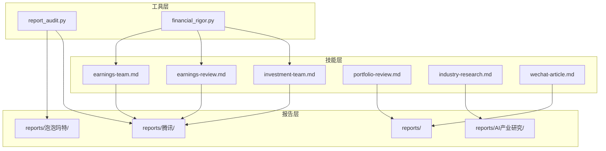
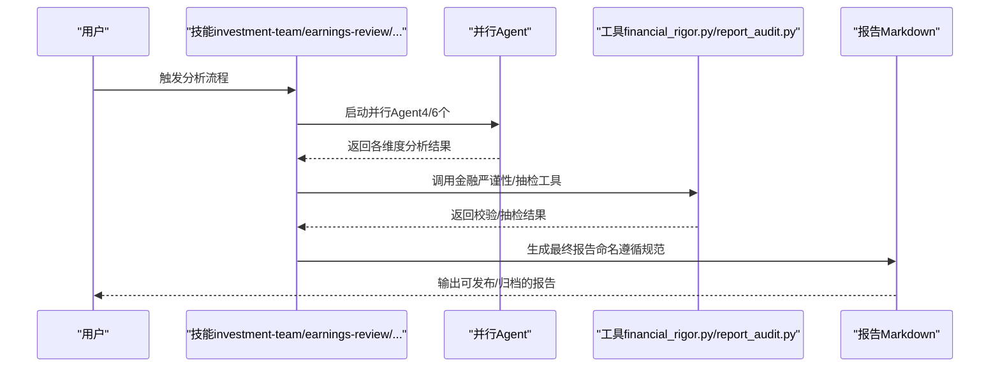
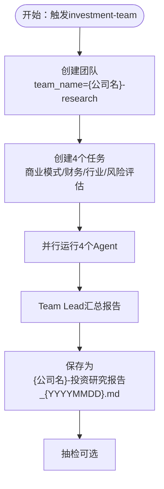
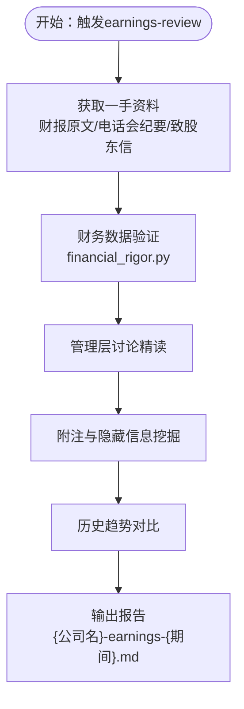
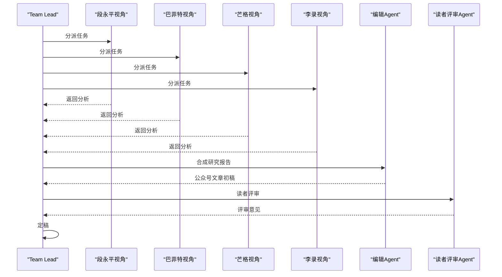
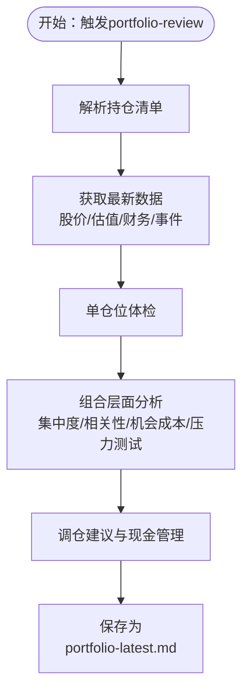
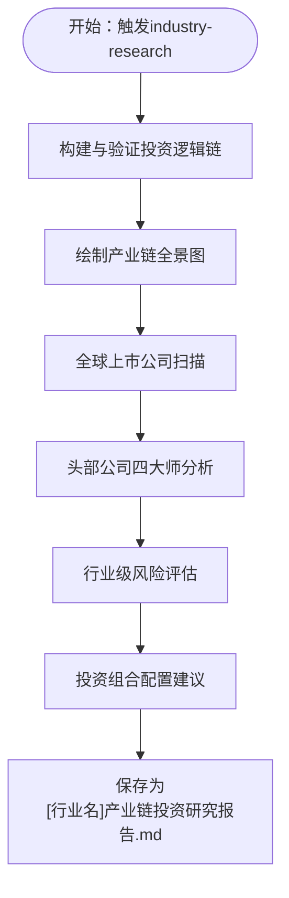
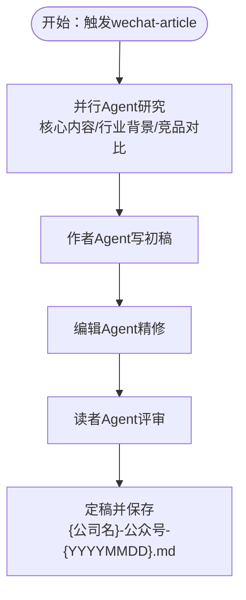
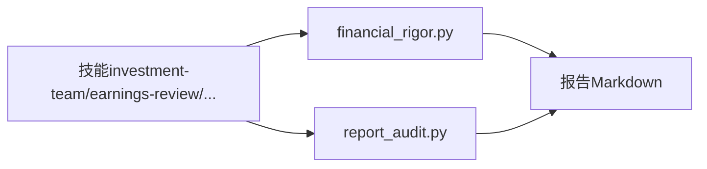

# 命名规范与约定

<cite>
**本文档引用的文件**
- [skills/investment-team.md](file://skills/investment-team.md)
- [skills/earnings-review.md](file://skills/earnings-review.md)
- [skills/earnings-team.md](file://skills/earnings-team.md)
- [skills/portfolio-review.md](file://skills/portfolio-review.md)
- [skills/industry-research.md](file://skills/industry-research.md)
- [skills/wechat-article.md](file://skills/wechat-article.md)
- [tools/report_audit.py](file://tools/report_audit.py)
- [tools/financial_rigor.py](file://tools/financial_rigor.py)
- [reports/腾讯/腾讯-earnings-2025Q4.md](file://reports/腾讯/腾讯-earnings-2025Q4.md)
- [reports/腾讯/腾讯-research-20260620.md](file://reports/腾讯/腾讯-research-20260620.md)
- [reports/腾讯/腾讯-earnings-2026Q1.md](file://reports/腾讯/腾讯-earnings-2026Q1.md)
- [reports/泡泡玛特/泡泡玛特-earnings-2025FY.md](file://reports/泡泡玛特/泡泡玛特-earnings-2025FY.md)
- [reports/泡泡玛特/泡泡玛特-earnings-2025Q4.md](file://reports/泡泡玛特/泡泡玛特-earnings-2025Q4.md)
- [reports/泡泡玛特/泡泡玛特-research-20260408.md](file://reports/泡泡玛特/泡泡玛特-research-20260408.md)
- [reports/泡泡玛特/泡泡玛特-valuation-20260413.md](file://reports/泡泡玛特/泡泡玛特-valuation-20260413.md)
</cite>

## 目录
1. [简介](#简介)
2. [项目结构](#项目结构)
3. [核心组件](#核心组件)
4. [架构总览](#架构总览)
5. [详细组件分析](#详细组件分析)
6. [依赖关系分析](#依赖关系分析)
7. [性能考量](#性能考量)
8. [故障排查指南](#故障排查指南)
9. [结论](#结论)
10. [附录](#附录)

## 简介
本文件系统化梳理 AI Berkshire 项目中的报告命名规范与约定，覆盖以下报告类型：
- 投研团队报告（investment-team）
- 财报精读报告（earnings-review）
- 财报精读团队报告（earnings-team）
- 组合管理报告（portfolio-review）
- 行业研究报告（industry-research）
- 公众号文章（wechat-article）

规范涵盖：
- 报告命名格式与目录结构
- 日期格式（YYYYMMDD）与版本标识
- 特殊标记（如“团队”“公众号”“研究”“估值”等）的含义与使用场景
- 命名检查工具与批量重命名脚本的使用指南

## 项目结构
仓库采用“技能（skills）+工具（tools）+报告（reports）”的分层组织方式：
- skills：定义各类分析流程与报告模板（如投资团队、财报精读、组合管理、行业研究、公众号文章）
- tools：提供数据抽检与金融严谨性验证工具
- reports：存放最终产出的各类报告，按公司/主题/日期组织

**图示来源**
- [skills/investment-team.md:180-182](file://skills/investment-team.md#L180-L182)
- [skills/earnings-review.md:189-192](file://skills/earnings-review.md#L189-L192)
- [skills/earnings-team.md:410-421](file://skills/earnings-team.md#L410-L421)
- [skills/portfolio-review.md:174-181](file://skills/portfolio-review.md#L174-L181)
- [skills/industry-research.md:240-248](file://skills/industry-research.md#L240-L248)
- [skills/wechat-article.md:211-218](file://skills/wechat-article.md#L211-L218)
- [tools/report_audit.py:405-523](file://tools/report_audit.py#L405-L523)
- [tools/financial_rigor.py:367-452](file://tools/financial_rigor.py#L367-L452)

**章节来源**
- [skills/investment-team.md:180-182](file://skills/investment-team.md#L180-L182)
- [skills/earnings-review.md:189-192](file://skills/earnings-review.md#L189-L192)
- [skills/earnings-team.md:410-421](file://skills/earnings-team.md#L410-L421)
- [skills/portfolio-review.md:174-181](file://skills/portfolio-review.md#L174-L181)
- [skills/industry-research.md:240-248](file://skills/industry-research.md#L240-L248)
- [skills/wechat-article.md:211-218](file://skills/wechat-article.md#L211-L218)

## 核心组件
- 投研团队报告（investment-team）
  - 命名：`{公司名}-投资研究报告_{YYYYMMDD}.md`
  - 示例：`腾讯-投资研究报告_20260620.md`
  - 用途：四角色并行分析后的综合报告，包含四维评分、核心数据速览、投资论点与最终建议
- 财报精读报告（earnings-review）
  - 命名：`reports/{公司名}-earnings-{期间}.md`
  - 示例：`reports/腾讯-earnings-2025Q4.md`、`reports/腾讯-earnings-2026Q1.md`
  - 用途：基于一手资料的财报深度解读，包含核心数据速览、管理层语气与承诺追踪、隐藏信息挖掘等
- 财报精读团队报告（earnings-team）
  - 命名：`reports/{公司名}/{公司名}-earnings-{期间}.md`（最终公众号文章）
  - 示例：`reports/腾讯/腾讯-earnings-2025Q4.md`
  - 用途：团队并行研究+编辑润色+读者评审后的公众号发布稿
- 组合管理报告（portfolio-review）
  - 命名：`reports/portfolio-latest.md`
  - 用途：投资组合审视与优化，包含组合概览、单仓位体检、组合分析与调仓建议
- 行业研究报告（industry-research）
  - 命名：`~/[行业名]产业链投资研究报告.md`
  - 用途：行业主题研究，输出行业总评、推荐组合与配置建议
- 公众号文章（wechat-article）
  - 命名：`reports/{公司名}/{公司名}-公众号-{YYYYMMDD}.md` 或 `reports/AI产业研究/公众号-{主题关键词}-{YYYYMMDD}.md`
  - 用途：作者-编辑-读者三Agent协作产出的公众号文章

**章节来源**
- [skills/investment-team.md:180-182](file://skills/investment-team.md#L180-L182)
- [skills/earnings-review.md:189-192](file://skills/earnings-review.md#L189-L192)
- [skills/earnings-team.md:410-421](file://skills/earnings-team.md#L410-L421)
- [skills/portfolio-review.md:174-181](file://skills/portfolio-review.md#L174-L181)
- [skills/industry-research.md:240-248](file://skills/industry-research.md#L240-L248)
- [skills/wechat-article.md:211-218](file://skills/wechat-article.md#L211-L218)

## 架构总览
下图展示了从技能到报告的生成路径与工具交互关系：

**图示来源**
- [skills/investment-team.md:94-103](file://skills/investment-team.md#L94-L103)
- [skills/earnings-review.md:78-93](file://skills/earnings-review.md#L78-L93)
- [skills/earnings-team.md:55-58](file://skills/earnings-team.md#L55-L58)
- [tools/financial_rigor.py:367-452](file://tools/financial_rigor.py#L367-L452)
- [tools/report_audit.py:405-523](file://tools/report_audit.py#L405-L523)

## 详细组件分析

### 投研团队报告（investment-team）
- 目录结构：`reports/{公司名}/`
- 命名规则：`{公司名}-投资研究报告_{YYYYMMDD}.md`
- 特殊标记：无特殊标记，日期为报告生成日期
- 示例：`reports/腾讯/腾讯-投资研究报告_20260620.md`

**图示来源**
- [skills/investment-team.md:34-103](file://skills/investment-team.md#L34-L103)
- [skills/investment-team.md:180-182](file://skills/investment-team.md#L180-L182)

**章节来源**
- [skills/investment-team.md:34-103](file://skills/investment-team.md#L34-L103)
- [skills/investment-team.md:180-182](file://skills/investment-team.md#L180-L182)

### 财报精读报告（earnings-review）
- 目录结构：`reports/{公司名}/`
- 命名规则：`reports/{公司名}-earnings-{期间}.md`
- 期间标识：季度（如 2025Q4）、年度（如 2025年报）、最新（如 最新）
- 示例：`reports/腾讯-earnings-2025Q4.md`、`reports/腾讯-earnings-2026Q1.md`

**图示来源**
- [skills/earnings-review.md:32-42](file://skills/earnings-review.md#L32-L42)
- [skills/earnings-review.md:78-93](file://skills/earnings-review.md#L78-L93)
- [skills/earnings-review.md:168-188](file://skills/earnings-review.md#L168-L188)

**章节来源**
- [skills/earnings-review.md:32-42](file://skills/earnings-review.md#L32-L42)
- [skills/earnings-review.md:78-93](file://skills/earnings-review.md#L78-L93)
- [skills/earnings-review.md:168-188](file://skills/earnings-review.md#L168-L188)

### 财报精读团队报告（earnings-team）
- 目录结构：`reports/{公司名}/`
- 命名规则：最终公众号文章为 `{公司名}-earnings-{期间}.md`，研究底稿为 `{公司名}-earnings-{期间}-研究底稿.md`
- 特殊标记：团队报告包含多个子报告（段永平/巴菲特/芒格/李录），最终发布为公众号文章
- 示例：`reports/腾讯/腾讯-earnings-2025Q4.md`、`reports/腾讯/腾讯-earnings-2025Q4-研究底稿.md`

**图示来源**
- [skills/earnings-team.md:20-54](file://skills/earnings-team.md#L20-L54)
- [skills/earnings-team.md:240-284](file://skills/earnings-team.md#L240-L284)
- [skills/earnings-team.md:410-421](file://skills/earnings-team.md#L410-L421)

**章节来源**
- [skills/earnings-team.md:20-54](file://skills/earnings-team.md#L20-L54)
- [skills/earnings-team.md:240-284](file://skills/earnings-team.md#L240-L284)
- [skills/earnings-team.md:410-421](file://skills/earnings-team.md#L410-L421)

### 组合管理报告（portfolio-review）
- 文件名：`reports/portfolio-latest.md`
- 内容：组合概览、单仓位体检、组合分析、调仓建议与下次审视提醒
- 示例：`reports/portfolio-latest.md`

**图示来源**
- [skills/portfolio-review.md:26-36](file://skills/portfolio-review.md#L26-L36)
- [skills/portfolio-review.md:127-181](file://skills/portfolio-review.md#L127-L181)

**章节来源**
- [skills/portfolio-review.md:26-36](file://skills/portfolio-review.md#L26-L36)
- [skills/portfolio-review.md:127-181](file://skills/portfolio-review.md#L127-L181)

### 行业研究报告（industry-research）
- 目录：`~/[行业名]产业链投资研究报告.md`
- 内容：投资逻辑链、产业链全景、全球公司扫描、各环节头部公司四大师分析、行业级风险评估、配置建议
- 示例：`reports/AI产业研究/AI五层蛋糕-产业全景研究-20260605.md`

**图示来源**
- [skills/industry-research.md:16-38](file://skills/industry-research.md#L16-L38)
- [skills/industry-research.md:41-61](file://skills/industry-research.md#L41-L61)
- [skills/industry-research.md:82-110](file://skills/industry-research.md#L82-L110)
- [skills/industry-research.md:112-159](file://skills/industry-research.md#L112-L159)
- [skills/industry-research.md:161-185](file://skills/industry-research.md#L161-L185)
- [skills/industry-research.md:187-195](file://skills/industry-research.md#L187-L195)
- [skills/industry-research.md:197-220](file://skills/industry-research.md#L197-L220)
- [skills/industry-research.md:240-248](file://skills/industry-research.md#L240-L248)

**章节来源**
- [skills/industry-research.md:16-38](file://skills/industry-research.md#L16-L38)
- [skills/industry-research.md:41-61](file://skills/industry-research.md#L41-L61)
- [skills/industry-research.md:82-110](file://skills/industry-research.md#L82-L110)
- [skills/industry-research.md:112-159](file://skills/industry-research.md#L112-L159)
- [skills/industry-research.md:161-185](file://skills/industry-research.md#L161-L185)
- [skills/industry-research.md:187-195](file://skills/industry-research.md#L187-L195)
- [skills/industry-research.md:197-220](file://skills/industry-research.md#L197-L220)
- [skills/industry-research.md:240-248](file://skills/industry-research.md#L240-L248)

### 公众号文章（wechat-article）
- 目录：`reports/{公司名}/` 或 `reports/AI产业研究/`
- 命名规则：`{公司名}-公众号-{YYYYMMDD}.md` 或 `公众号-{主题关键词}-{YYYYMMDATE}.md`
- 示例：`reports/AI产业研究/公众号-AI五层蛋糕-20260605.md`

**图示来源**
- [skills/wechat-article.md:20-60](file://skills/wechat-article.md#L20-L60)
- [skills/wechat-article.md:63-113](file://skills/wechat-article.md#L63-L113)
- [skills/wechat-article.md:115-165](file://skills/wechat-article.md#L115-L165)
- [skills/wechat-article.md:167-209](file://skills/wechat-article.md#L167-L209)
- [skills/wechat-article.md:211-218](file://skills/wechat-article.md#L211-L218)

**章节来源**
- [skills/wechat-article.md:20-60](file://skills/wechat-article.md#L20-L60)
- [skills/wechat-article.md:63-113](file://skills/wechat-article.md#L63-L113)
- [skills/wechat-article.md:115-165](file://skills/wechat-article.md#L115-L165)
- [skills/wechat-article.md:167-209](file://skills/wechat-article.md#L167-L209)
- [skills/wechat-article.md:211-218](file://skills/wechat-article.md#L211-L218)

## 依赖关系分析
- 报告生成依赖技能层的流程定义与Agent并行执行
- 金融严谨性验证依赖 `financial_rigor.py`，提供市值/估值/交叉验证/三情景估值等功能
- 数据抽检依赖 `report_audit.py`，从报告中抽取15%数据点进行核验

**图示来源**
- [tools/financial_rigor.py:367-452](file://tools/financial_rigor.py#L367-L452)
- [tools/report_audit.py:405-523](file://tools/report_audit.py#L405-L523)

**章节来源**
- [tools/financial_rigor.py:367-452](file://tools/financial_rigor.py#L367-L452)
- [tools/report_audit.py:405-523](file://tools/report_audit.py#L405-L523)

## 性能考量
- 并行Agent执行：缩短总分析时间，需注意资源占用与并发控制
- 数据抽检抽样比例：默认15%，可根据报告体量与质量要求调整
- 工具精度：金融严谨性工具使用十进制精确计算，避免浮点误差

[本节为通用指导，无需引用具体文件]

## 故障排查指南
- 数据抽检不通过
  - 使用 `report_audit.py extract` 提取抽检清单
  - 使用 `report_audit.py verdict` 输入核验结果并输出判决
  - 关注“不通过”项的偏差与原文行号，进行修正后重审
- 估值/市值校验异常
  - 使用 `financial_rigor.py verify-market-cap` 与 `verify-valuation` 进行交叉验证
  - 关注单位一致性与数据来源差异
- 交叉验证不一致
  - 使用 `cross-validate` 比对多源数据，关注容差阈值（默认2%）
- 三情景估值
  - 使用 `three-scenario` 计算乐观/中性/悲观情景目标价与涨跌幅

**章节来源**
- [tools/report_audit.py:405-523](file://tools/report_audit.py#L405-L523)
- [tools/financial_rigor.py:367-452](file://tools/financial_rigor.py#L367-L452)

## 结论
本规范明确了各类报告的命名格式、目录结构与特殊标记，结合金融严谨性与数据抽检工具，确保报告质量与可追溯性。建议在生成报告时严格遵循命名规范，并在关键节点执行抽检与校验，以保障数据准确性与结论可靠性。

[本节为总结性内容，无需引用具体文件]

## 附录

### 命名检查工具与批量重命名脚本使用指南
- 数据抽检工具
  - 提取抽检清单：`python3 tools/report_audit.py extract --report <报告文件路径>`
  - 输出抽检清单JSON，供人工或自动工具从可靠信源取数
  - 核验并输出判决：`python3 tools/report_audit.py verdict --results '<JSON>' --report <报告文件名>`
- 金融严谨性工具
  - 市值验算：`python3 tools/financial_rigor.py verify-market-cap --price ... --shares ... --reported ... --currency ...`
  - 估值指标验算：`python3 tools/financial_rigor.py verify-valuation --price ... --eps ... --bvps ...`
  - 多源交叉验证：`python3 tools/financial_rigor.py cross-validate --field ... --values '...' --unit ...`
  - 三情景估值：`python3 tools/financial_rigor.py three-scenario --price ... --eps ... --shares ... --growth ... --pe ...`
- 批量重命名建议
  - 使用正则匹配 YYYYMMDD 日期格式，确保命名一致性
  - 对于团队报告，统一添加“研究底稿”“公众号”等后缀，便于检索
  - 建议在CI/CD中加入命名规范检查步骤，自动拦截不合规命名

**章节来源**
- [tools/report_audit.py:405-523](file://tools/report_audit.py#L405-L523)
- [tools/financial_rigor.py:367-452](file://tools/financial_rigor.py#L367-L452)