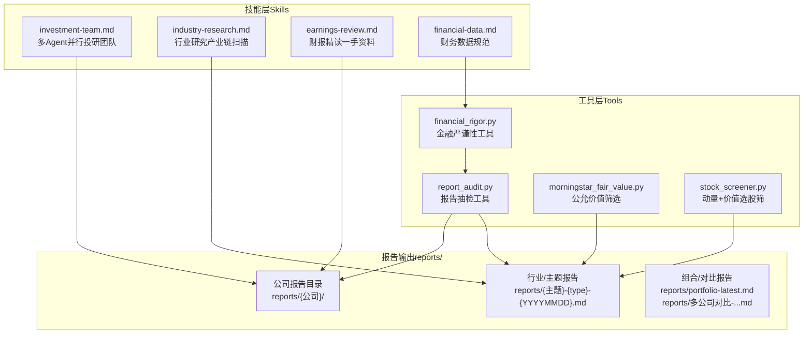
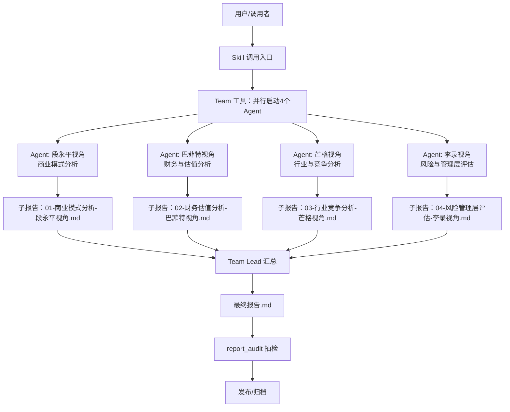
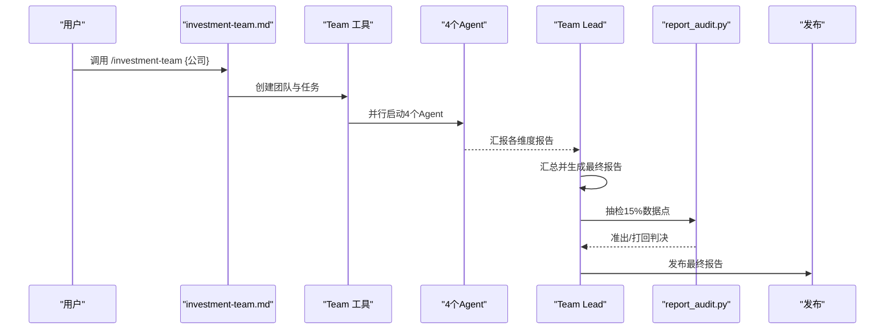
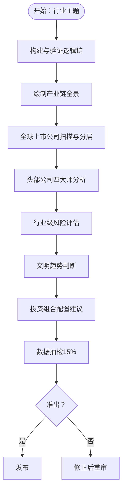
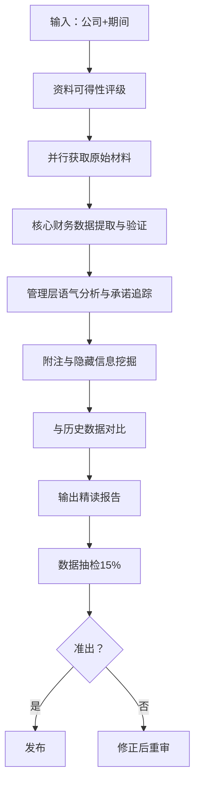
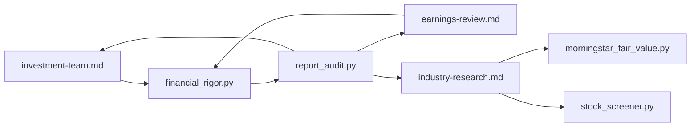

# 报告生成与输出

<cite>
**本文档引用的文件**
- [README.md](file://README.md)
- [CLAUDE.md](file://CLAUDE.md)
- [skills/investment-team.md](file://skills/investment-team.md)
- [skills/industry-research.md](file://skills/industry-research.md)
- [skills/earnings-review.md](file://skills/earnings-review.md)
- [skills/financial-data.md](file://skills/financial-data.md)
- [tools/report_audit.py](file://tools/report_audit.py)
- [tools/financial_rigor.py](file://tools/financial_rigor.py)
- [tools/morningstar_fair_value.py](file://tools/morningstar_fair_value.py)
- [tools/stock_screener.py](file://tools/stock_screener.py)
- [reports/ADP/最终报告.md](file://reports/ADP/最终报告.md)
- [reports/ADP/《看懂ADP》/02-商业模式-一台三层收入的复利机器.md](file://reports/ADP/《看懂ADP》/02-商业模式-一台三层收入的复利机器.md)
</cite>

## 目录
1. [简介](#简介)
2. [项目结构](#项目结构)
3. [核心组件](#核心组件)
4. [架构总览](#架构总览)
5. [详细组件分析](#详细组件分析)
6. [依赖关系分析](#依赖关系分析)
7. [性能考量](#性能考量)
8. [故障排查指南](#故障排查指南)
9. [结论](#结论)
10. [附录](#附录)

## 简介
本文件面向“AI Berkshire报告生成系统”，系统性阐述标准化报告模板的设计理念、报告结构规范、命名约定与质量控制流程。文档覆盖投资研究团队报告的组织结构（商业模式分析、财务估值分析、行业竞争分析、风险管理评估与最终报告）、行业研究报告的格式要求、以及各类专项报告（个股、财报、行业、主题）的输出规范，并配套报告审核流程、版本控制策略、发布标准与质量保证机制。

## 项目结构
- 报告生成系统由“技能层（Skills）”“代理层（Agents）”“工具层（Tools）”三层组成，围绕四大师（巴菲特、芒格、段永平、李录）方法论，实现可复现、可审计、可发布的高质量投研报告。
- 报告输出遵循统一的命名与目录规范，便于版本管理与检索。

图表来源
- [skills/investment-team.md:1-214](file://skills/investment-team.md#L1-L214)
- [skills/industry-research.md:1-269](file://skills/industry-research.md#L1-L269)
- [skills/earnings-review.md:1-219](file://skills/earnings-review.md#L1-L219)
- [skills/financial-data.md:1-104](file://skills/financial-data.md#L1-L104)
- [tools/financial_rigor.py:1-452](file://tools/financial_rigor.py#L1-L452)
- [tools/report_audit.py:1-523](file://tools/report_audit.py#L1-L523)
- [tools/morningstar_fair_value.py:1-153](file://tools/morningstar_fair_value.py#L1-L153)
- [tools/stock_screener.py:1-402](file://tools/stock_screener.py#L1-L402)

章节来源
- [README.md:154-166](file://README.md#L154-L166)
- [CLAUDE.md:17-55](file://CLAUDE.md#L17-L55)

## 核心组件
- 投研团队报告（investment-team）：四角色并行分析（段永平视角、巴菲特视角、芒格视角、李录视角），产出4个子报告与1份最终报告。
- 行业研究报告（industry-research）：从投资逻辑链出发，绘制产业链全景，扫描全球上市公司，执行四大师分析，输出行业级配置建议。
- 财报精读（earnings-review）：直接读取原始财报与电话会纪要，进行核心财务数据提取与验证、管理层语气与承诺追踪、附注与隐藏信息挖掘。
- 财务数据规范（financial-data）：关键数据必须来自两个独立来源，误差>1%须标注；提供数据源优先级与常见差异原因。
- 金融严谨性工具（financial_rigor）：精确十进制计算、市值验算、估值验算、多源交叉验证、三情景估值、Benford检测、精确计算器。
- 报告抽检工具（report_audit）：从报告中抽取15%随机数据点，与可靠信源比对，输出准出/打回判决。
- 公允价值筛选（morningstar_fair_value）：抓取Morningstar筛选器API，计算潜在涨幅Top 100。
- 选股筛（stock_screener）：动量发现+价值验证，6维评分≥3/6给出买入信号，分级建议仓位。

章节来源
- [skills/investment-team.md:1-214](file://skills/investment-team.md#L1-L214)
- [skills/industry-research.md:1-269](file://skills/industry-research.md#L1-L269)
- [skills/earnings-review.md:1-219](file://skills/earnings-review.md#L1-L219)
- [skills/financial-data.md:1-104](file://skills/financial-data.md#L1-L104)
- [tools/financial_rigor.py:1-452](file://tools/financial_rigor.py#L1-L452)
- [tools/report_audit.py:1-523](file://tools/report_audit.py#L1-L523)
- [tools/morningstar_fair_value.py:1-153](file://tools/morningstar_fair_value.py#L1-L153)
- [tools/stock_screener.py:1-402](file://tools/stock_screener.py#L1-L402)

## 架构总览
系统以“技能”为入口，通过“多Agent并行”实现深度与广度的倍增；“工具层”保障数据精度与可审计性；“报告输出”遵循统一命名与目录规范，便于版本控制与发布。

图表来源
- [skills/investment-team.md:34-214](file://skills/investment-team.md#L34-L214)

章节来源
- [README.md:154-166](file://README.md#L154-L166)

## 详细组件分析

### 投资研究团队报告（investment-team）
- 组织结构
  - 团队角色：Team Lead（统筹协调、汇总研判）、Business Analyst（段永平视角）、Financial Analyst（巴菲特视角）、Industry Researcher（芒格视角）、Risk Assessor（李录视角）。
  - AI研究偏见评估：A/B/C级信息丰富度评级，指导研究策略与置信度标注。
  - 四项任务：商业模式分析、财务与估值分析、行业与竞争分析、风险与管理层评估。
  - 并行Agent：在同一消息中并行启动4个Agent，完成后Team Lead汇总并输出最终报告。
- 最终报告结构
  - 一句话结论、四维评分总表、核心数据速览、各维度分析摘要、投资论点（Bull vs Bear）、巴菲特买入前Checklist、最终投资建议、总结段落。
- 质量控制
  - 数据准确性：关键数据来自两个独立来源，误差>1%标注；使用financial_rigor工具进行市值验算、估值验算、交叉验证、三情景估值。
  - 反偏见意识：标注信息丰富度评级与AI研究局限性声明；Tier 3/4公司可简要点评，保留留白原则。
  - 准出流程：report_audit抽取15%随机数据点，与可靠信源比对，输出准出/打回判决。

图表来源
- [skills/investment-team.md:34-214](file://skills/investment-team.md#L34-L214)
- [tools/report_audit.py:405-523](file://tools/report_audit.py#L405-L523)

章节来源
- [skills/investment-team.md:1-214](file://skills/investment-team.md#L1-L214)
- [tools/report_audit.py:1-523](file://tools/report_audit.py#L1-L523)

### 行业研究报告（industry-research）
- 研究目标：验证投资逻辑链、绘制产业链全景、扫描全球上市公司、对头部公司执行四大师分析、输出行业级配置建议。
- 逻辑链构建与验证：逐环节提出质疑并寻找证据，列出“已发生的验证事件”。
- 产业链全景：上游→中游→下游→辅助环节，标注每个环节的“生意特征”（商业模式、毛利率区间、竞争格局、壁垒类型、周期性）。
- 全球上市公司扫描：按环节分类与投资确定性分层（Tier 1-4），输出扫描清单。
- 头部公司四大师分析：生意本质、护城河、风险、管理层、估值快照、推荐度。
- 行业级风险评估：系统性风险清单、历史类比、偏误自查。
- 文明趋势判断：底层趋势是否为“文明级范式转移”。
- 投资组合配置建议：核心/卫星/期权/ETF替代，买入/卖出/清仓信号，主题仓位上限建议。
- 质量控制：数据抽检准出流程，结论明确、标的与仓位具体。

图表来源
- [skills/industry-research.md:16-269](file://skills/industry-research.md#L16-L269)
- [tools/report_audit.py:405-523](file://tools/report_audit.py#L405-L523)

章节来源
- [skills/industry-research.md:1-269](file://skills/industry-research.md#L1-L269)
- [tools/report_audit.py:1-523](file://tools/report_audit.py#L1-L523)

### 财报精读（earnings-review）
- 设计理念：直接解读一手资料（原始财报、电话会纪要、管理层致股东信），关注巴菲特与李录真正会看的内容。
- 执行流程：资料可得性评级（A/B/C）、并行获取原始材料、核心财务数据提取与验证、管理层语气分析与承诺追踪、附注与隐藏信息挖掘、与历史数据对比、输出精读报告。
- 数据验证：使用financial_rigor工具进行交叉验证与市值/估值验算。
- 输出结构：核心数据速览、本期最重要的3个变化、管理层语气与承诺追踪、附注中的隐藏信息、关键问题（电话会Q&A精选）、与投资论文的关系、结论。

图表来源
- [skills/earnings-review.md:22-219](file://skills/earnings-review.md#L22-L219)
- [tools/financial_rigor.py:1-452](file://tools/financial_rigor.py#L1-L452)
- [tools/report_audit.py:405-523](file://tools/report_audit.py#L405-L523)

章节来源
- [skills/earnings-review.md:1-219](file://skills/earnings-review.md#L1-L219)
- [tools/financial_rigor.py:1-452](file://tools/financial_rigor.py#L1-L452)
- [tools/report_audit.py:1-523](file://tools/report_audit.py#L1-L523)

### 财务数据规范（financial-data）
- 关键原则：每个关键数据必须来自两个独立来源，误差>1%须标记；提供美股、港股、A股数据源优先级与URL；差异原因（GAAP/Non-GAAP、汇率、财年、合并口径、数据更新滞后）。
- 数据呈现格式：关键数据标注来源与误差；估计值标注“估计”。

章节来源
- [skills/financial-data.md:1-104](file://skills/financial-data.md#L1-L104)

### 金融严谨性工具（financial_rigor）
- 功能：市值验算、估值验算（PE/PB/ROE/FCF Yield）、多源交叉验证、三情景估值、Benford定律检测、精确计算器。
- 设计原则：使用精确十进制（decimal.Decimal）避免浮点误差；所有计算可审计复现。

章节来源
- [tools/financial_rigor.py:1-452](file://tools/financial_rigor.py#L1-L452)

### 报告抽检工具（report_audit）
- 功能：从报告中提取财务数据点，随机抽样15%（最少3个，最多30个），输出抽检清单与准出/打回判决；支持固定随机种子复现样本。
- 判决标准：两来源偏差≤1%为通过；1%-5%为警告（口径差异）；>5%为不通过（需人工复核）。

章节来源
- [tools/report_audit.py:1-523](file://tools/report_audit.py#L1-L523)

### 公允价值筛选（morningstar_fair_value）
- 功能：抓取Morningstar筛选器API，计算潜在涨幅Top 100，输出统计摘要与CSV文件。

章节来源
- [tools/morningstar_fair_value.py:1-153](file://tools/morningstar_fair_value.py#L1-L153)

### 选股筛（stock_screener）
- 功能：动量发现（60日新高+放量）+价值验证（6维评分≥3/6），信号分级（3/6=试探仓3% | 4/6=标准仓5% | 5-6/6=确信仓8%），支持独立通过条件（毛利率连续改善、EPS超预期>30%）。

章节来源
- [tools/stock_screener.py:1-402](file://tools/stock_screener.py#L1-L402)

## 依赖关系分析
- 技能层依赖工具层：investment-team与earnings-review在关键节点调用financial_rigor进行数据验证；industry-research与stock_screener输出结果可作为报告输入。
- 工具层相互依赖：report_audit依赖技能层输出的报告；financial_rigor为report_audit提供数据点提取与验证能力。
- 报告输出依赖规范：统一命名与目录结构，便于版本控制与发布。

图表来源
- [skills/investment-team.md:64-69](file://skills/investment-team.md#L64-L69)
- [skills/earnings-review.md:78-92](file://skills/earnings-review.md#L78-L92)
- [tools/financial_rigor.py:1-452](file://tools/financial_rigor.py#L1-L452)
- [tools/report_audit.py:1-523](file://tools/report_audit.py#L1-L523)
- [tools/morningstar_fair_value.py:1-153](file://tools/morningstar_fair_value.py#L1-L153)
- [tools/stock_screener.py:1-402](file://tools/stock_screener.py#L1-L402)

章节来源
- [README.md:586-601](file://README.md#L586-L601)

## 性能考量
- 多Agent并行：显著提升研究深度与效率，但需注意并发请求与外部数据源限流。
- 数据验证与抽检：financial_rigor与report_audit均为CPU密集型与IO密集型结合，建议批量化执行与缓存常用数据。
- 报告生成：Markdown渲染与文件写入为轻量操作，主要瓶颈在数据获取与交叉验证。
- 建议：对高频调用的外部API设置合理的重试与退避策略；对report_audit的抽检清单进行分批处理；对Morningstar与Yahoo Finance等接口设置速率限制。

## 故障排查指南
- 市值验算不通过（偏差>5%）
  - 检查股价、总股本、报告市值单位是否一致；确认使用最新数据；必要时以原始财报为准。
- 多源交叉验证存在差异（1%-5%）
  - 标注“数据存在差异”，注明来源与可能原因（GAAP/Non-GAAP、汇率、财年、合并口径、数据更新滞后）。
- 报告抽检不通过（>5%偏差）
  - 修正数据或来源，重新执行抽检；对两来源结果不一致的情况，标注“口径差异”并人工复核。
- 财报精读无法获取原始材料
  - 使用标准数据源拼凑（macrotrends/aastocks/eastmoney等），标注“非原始财报，来自第三方汇总”，并进行交叉验证。
- 选股筛无买入信号
  - 检查基本面数据是否完整；使用--update补充季度数据；关注独立通过条件（毛利率连续改善、EPS超预期>30%）。

章节来源
- [tools/financial_rigor.py:61-91](file://tools/financial_rigor.py#L61-L91)
- [tools/financial_rigor.py:167-204](file://tools/financial_rigor.py#L167-L204)
- [tools/report_audit.py:243-398](file://tools/report_audit.py#L243-L398)
- [skills/earnings-review.md:41-42](file://skills/earnings-review.md#L41-L42)
- [tools/stock_screener.py:226-277](file://tools/stock_screener.py#L226-L277)

## 结论
AI Berkshire报告生成系统通过“技能+Agent+工具”的三层架构，实现了可复现、可审计、可发布的高质量投研报告。标准化报告模板与严格的命名、目录、抽检与发布流程，确保了报告的质量与一致性。四大师方法论贯穿始终，辅以金融严谨性工具与抽检机制，有效降低了AI偏见与数据误差带来的风险。

## 附录

### 报告命名与目录规范
- 投资研究团队报告：公司目录内含4个视角子报告与最终报告。
- 个股研究/财报/主题/行业报告：按Skill类型与日期命名，放置于相应目录。
- 组合/对比报告：放置于根目录，持续更新。

章节来源
- [CLAUDE.md:40-55](file://CLAUDE.md#L40-L55)

### 示例报告参考
- ADP最终报告：展示四维评分、核心投资论点、四个视角核心观点、投资建议与跟踪指标。
- 《看懂ADP》系列：分篇拆解商业模式，强调三层收入结构与护城河。

章节来源
- [reports/ADP/最终报告.md:1-91](file://reports/ADP/最终报告.md#L1-L91)
- [reports/ADP/《看懂ADP》/02-商业模式-一台三层收入的复利机器.md:1-210](file://reports/ADP/《看懂ADP》/02-商业模式-一台三层收入的复利机器.md#L1-L210)