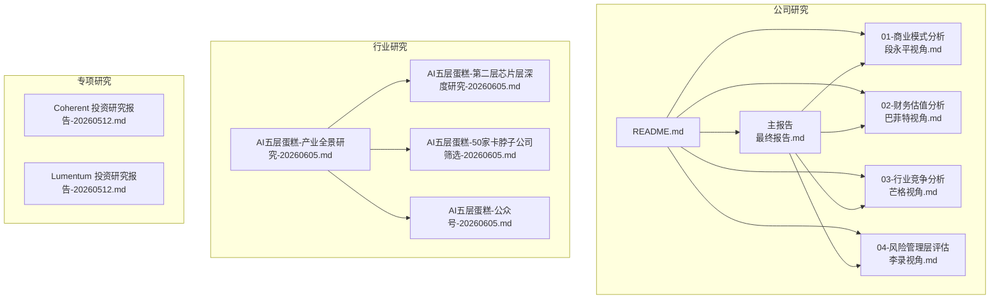
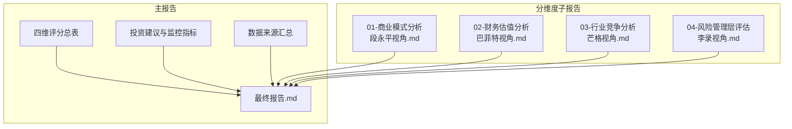
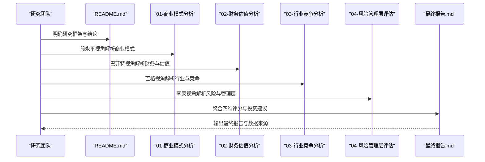
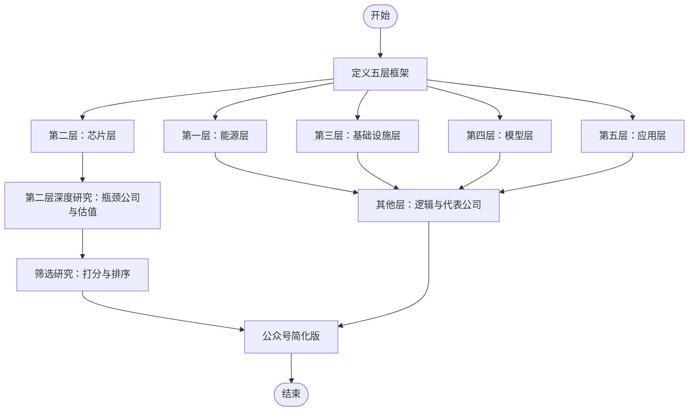
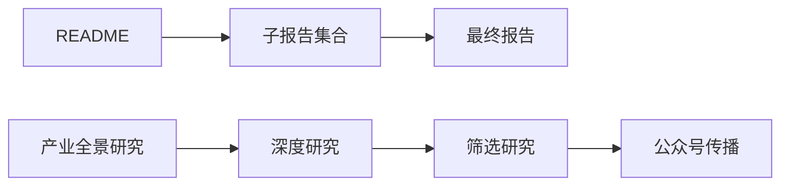
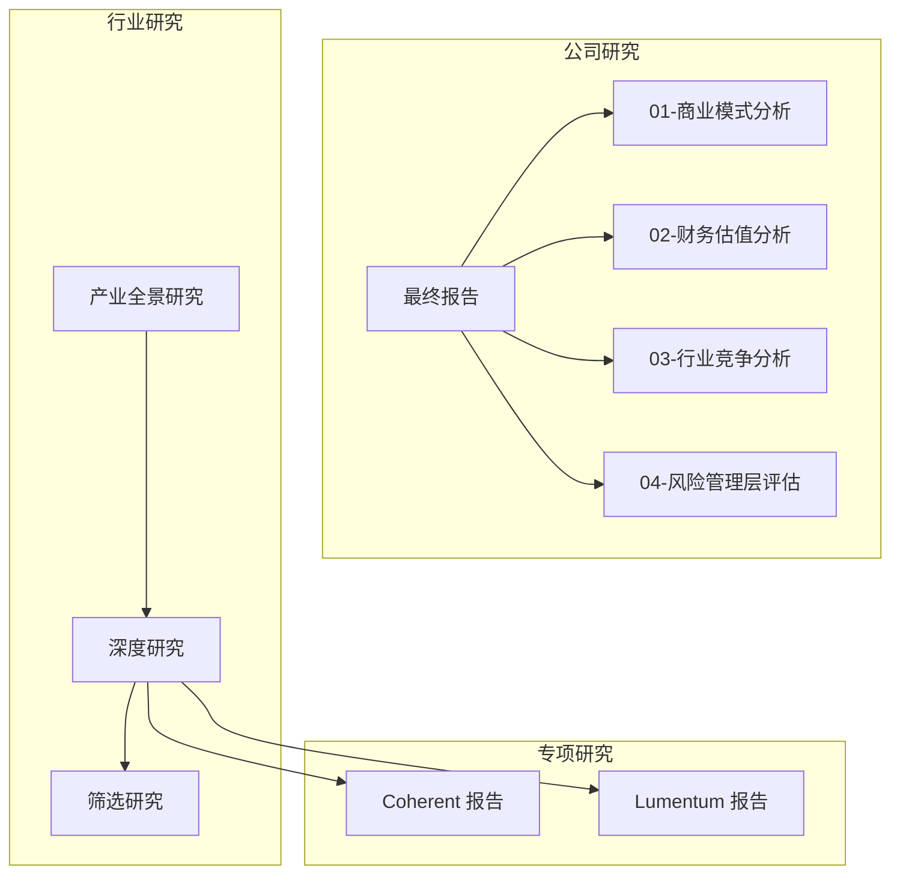

# 报告结构规范

<cite>
**本文档引用的文件**
- [小米/README.md](file://reports/小米/README.md)
- [小米/最终报告.md](file://reports/小米/最终报告.md)
- [小米/01-商业模式分析-段永平视角.md](file://reports/小米/01-商业模式分析-段永平视角.md)
- [小米/02-财务估值分析-巴菲特视角.md](file://reports/小米/02-财务估值分析-巴菲特视角.md)
- [小米/03-行业竞争分析-芒格视角.md](file://reports/小米/03-行业竞争分析-芒格视角.md)
- [小米/04-风险管理层评估-李录视角.md](file://reports/小米/04-风险管理层评估-李录视角.md)
- [Adobe/Adobe-research-20260607.md](file://reports/Adobe/Adobe-research-20260607.md)
- [Adobe/02-财务估值分析-巴菲特视角.md](file://reports/Adobe/02-财务估值分析-巴菲特视角.md)
- [Adobe/《看懂Adobe》/02-商业模式-订阅制印钞机的运转逻辑.md](file://reports/Adobe/《看懂Adobe》/02-商业模式-订阅制印钞机的运转逻辑.md)
- [Adobe/《看懂Adobe》/03-AI冲击-Firefly是救星还是掘墓人.md](file://reports/Adobe/《看懂Adobe》/03-AI冲击-Firefly是救星还是掘墓人.md)
- [Adobe/最终报告.md](file://reports/Adobe/最终报告.md)
- [Mastercard/最终报告.md](file://reports/Mastercard/最终报告.md)
- [Qualcomm/最终报告.md](file://reports/Qualcomm/最终报告.md)
- [AI产业研究/AI五层蛋糕-50家卡脖子公司筛选-20260605.md](file://reports/AI产业研究/AI五层蛋糕-50家卡脖子公司筛选-20260605.md)
- [AI产业研究/AI五层蛋糕-产业全景研究-20260605.md](file://reports/AI产业研究/AI五层蛋糕-产业全景研究-20260605.md)
- [AI产业研究/AI五层蛋糕-公众号-20260605.md](file://reports/AI产业研究/AI五层蛋糕-公众号-20260605.md)
- [AI产业研究/AI五层蛋糕-第二层芯片层深度研究-20260605.md](file://reports/AI产业研究/AI五层蛋糕-第二层芯片层深度研究-20260605.md)
- [AI基建-光通信与存储-20260512/Coherent-COHR-投资研究报告-20260512.md](file://reports/AI基建-光通信与存储-20260512/Coherent-COHR-投资研究报告-20260512.md)
- [AI基建-光通信与存储-20260512/Lumentum-LITE-投资研究报告-20260512.md](file://reports/AI基建-光通信与存储-20260512/Lumentum-LITE-投资研究报告-20260512.md)
</cite>

## 目录
1. [引言](#引言)
2. [项目结构](#项目结构)
3. [核心组件](#核心组件)
4. [架构总览](#架构总览)
5. [详细组件分析](#详细组件分析)
6. [依赖分析](#依赖分析)
7. [性能考量](#性能考量)
8. [故障排查指南](#故障排查指南)
9. [结论](#结论)
10. [附录](#附录)

## 引言
本规范旨在统一AI Berkshire项目的研究报告结构，确保投资研究在“商业模式—财务估值—行业竞争—风险管理层”四位一体框架下形成闭环，同时为公司研究报告、行业研究报告与专项研究提供可复用的模板与检查清单。通过对既有报告的系统化提炼，本规范明确了报告层级关系、内容组织原则与信息呈现方式，帮助研究团队高效产出高质量、可审计、可复核的研究成果。

## 项目结构
AI Berkshire的研究报告遵循“主报告+分维度子报告”的结构化组织方式。以“四大师”（段永平、巴菲特、芒格、李录）分析框架为纲，结合公司研究与行业研究两类主线，辅以专项研究与行业全景研究，形成多层次、多视角的研究体系。

**图表来源**
- [小米/README.md:1-20](file://reports/小米/README.md#L1-L20)
- [小米/最终报告.md:1-224](file://reports/小米/最终报告.md#L1-L224)
- [AI产业研究/AI五层蛋糕-产业全景研究-20260605.md:1-167](file://reports/AI产业研究/AI五层蛋糕-产业全景研究-20260605.md#L1-L167)
- [AI产业研究/AI五层蛋糕-第二层芯片层深度研究-20260605.md:1-527](file://reports/AI产业研究/AI五层蛋糕-第二层芯片层深度研究-20260605.md#L1-L527)
- [AI产业研究/AI五层蛋糕-50家卡脖子公司筛选-20260605.md:1-145](file://reports/AI产业研究/AI五层蛋糕-50家卡脖子公司筛选-20260605.md#L1-L145)
- [AI产业研究/AI五层蛋糕-公众号-20260605.md:1-114](file://reports/AI产业研究/AI五层蛋糕-公众号-20260605.md#L1-L114)
- [AI基建-光通信与存储-20260512/Coherent-COHR-投资研究报告-20260512.md:1-155](file://reports/AI基建-光通信与存储-20260512/Coherent-COHR-投资研究报告-20260512.md#L1-L155)
- [AI基建-光通信与存储-20260512/Lumentum-LITE-投资研究报告-20260512.md:1-141](file://reports/AI基建-光通信与存储-20260512/Lumentum-LITE-投资研究报告-20260512.md#L1-L141)

**章节来源**
- [小米/README.md:1-20](file://reports/小米/README.md#L1-L20)
- [小米/最终报告.md:1-224](file://reports/小米/最终报告.md#L1-L224)
- [AI产业研究/AI五层蛋糕-产业全景研究-20260605.md:1-167](file://reports/AI产业研究/AI五层蛋糕-产业全景研究-20260605.md#L1-L167)

## 核心组件
- 报告层级与职责
  - 主报告（最终报告）：四维综合评分、投资建议、关键监控指标与数据来源汇总，形成闭环结论。
  - 分维度子报告：分别从段永平（商业模式）、巴菲特（财务与估值）、芒格（行业与竞争）、李录（风险与管理层）视角展开，支撑主报告。
  - README：明确研究框架、核心结论与报告索引，便于快速导航。
- 内容组织原则
  - 结论先行：在主报告开头给出“一句话结论”，随后按维度展开论证。
  - 数据交叉验证：关键财务指标与估值指标均提供交叉验证记录或工具验算。
  - 风险与管理层评估：独立维度，强调治理、地缘政治、技术替代等长期风险。
- 信息呈现方式
  - 表格化关键指标与评分，便于横向比较与快速阅读。
  - 使用“四维评分总表”“综合评分”“关键监控指标”等标准化表格。
  - 报告末尾提供“AI研究局限性声明”与“数据来源汇总”。

**章节来源**
- [小米/README.md:11-20](file://reports/小米/README.md#L11-L20)
- [小米/最终报告.md:16-25](file://reports/小米/最终报告.md#L16-L25)
- [小米/最终报告.md:29-62](file://reports/小米/最终报告.md#L29-L62)
- [小米/最终报告.md:125-141](file://reports/小米/最终报告.md#L125-L141)
- [Adobe/Adobe-research-20260607.md:11-28](file://reports/Adobe/Adobe-research-20260607.md#L11-L28)
- [Adobe/Adobe-research-20260607.md:280-290](file://reports/Adobe/Adobe-research-20260607.md#L280-L290)

## 架构总览
下图展示“四维分析”在主报告中的聚合关系与子报告的支撑作用：

**图表来源**
- [小米/最终报告.md:16-25](file://reports/小米/最终报告.md#L16-L25)
- [小米/最终报告.md:125-141](file://reports/小米/最终报告.md#L125-L141)
- [小米/最终报告.md:215-224](file://reports/小米/最终报告.md#L215-L224)
- [小米/01-商业模式分析-段永平视角.md:1-154](file://reports/小米/01-商业模式分析-段永平视角.md#L1-L154)
- [小米/02-财务估值分析-巴菲特视角.md:1-367](file://reports/小米/02-财务估值分析-巴菲特视角.md#L1-L367)
- [小米/03-行业竞争分析-芒格视角.md:1-153](file://reports/小米/03-行业竞争分析-芒格视角.md#L1-L153)
- [小米/04-风险管理层评估-李录视角.md:1-140](file://reports/小米/04-风险管理层评估-李录视角.md#L1-L140)

## 详细组件分析

### 公司研究报告模板（四维分析）
- 结构要求
  - README.md：研究框架、核心结论、报告索引。
  - 01-商业模式分析（段永平视角）：商业模式本质、飞轮与护城河、用户价值、协同效应、段永平“好生意”标准评估。
  - 02-财务估值分析（巴菲特视角）：财务趋势、盈利能力、现金流、资产负债表、估值与安全边际、分部估值（SOTP）、巴菲特式判断。
  - 03-行业竞争分析（芒格视角）：行业格局、竞争态势、反向思维、关键风险场景。
  - 04-风险管理层评估（李录视角）：管理层评估、监管与地缘风险、业务风险、治理结构、风险矩阵与长期确定性。
  - 最终报告.md：四维评分总表、核心数据速览、各维度摘要、投资论点（Bull vs Bear）、巴菲特买入前Checklist、最终投资建议、综合估值区间、总结与AI研究局限性声明、数据来源汇总。
- 示例参考
  - 小米：完整四维闭环，主报告提供“一句话结论”与“综合评分”，子报告分别从四维视角提供支撑。
  - Adobe：主报告提供“综合评分”“投资建议”“关键跟踪指标”，子报告与系列文章提供“商业模式”“财务与估值”“AI冲击”等深度分析。

**图表来源**
- [小米/README.md:11-20](file://reports/小米/README.md#L11-L20)
- [小米/最终报告.md:16-25](file://reports/小米/最终报告.md#L16-L25)
- [小米/最终报告.md:125-141](file://reports/小米/最终报告.md#L125-L141)
- [Adobe/Adobe-research-20260607.md:11-28](file://reports/Adobe/Adobe-research-20260607.md#L11-L28)

**章节来源**
- [小米/README.md:11-20](file://reports/小米/README.md#L11-L20)
- [小米/最终报告.md:16-25](file://reports/小米/最终报告.md#L16-L25)
- [小米/最终报告.md:65-98](file://reports/小米/最终报告.md#L65-L98)
- [小米/最终报告.md:125-141](file://reports/小米/最终报告.md#L125-L141)
- [Adobe/Adobe-research-20260607.md:11-28](file://reports/Adobe/Adobe-research-20260607.md#L11-L28)

### 行业研究报告模板（AI五层蛋糕）
- 结构要求
  - 产业全景研究：定义五层框架、各层核心逻辑、代表性公司、投资优先级排序。
  - 深度研究：聚焦某一层（如芯片层）的瓶颈公司、不可替代性、估值判断与风险提示。
  - 筛选研究：基于“瓶颈纯正度×不可替代性×市场定价程度×催化剂时间窗”的打分体系，输出候选公司清单。
  - 公众号版本：面向传播的简化版，保留五层框架与核心结论。
- 示例参考
  - AI五层蛋糕-产业全景研究：定义五层、各层核心逻辑与代表性公司，给出投资优先级。
  - AI五层蛋糕-第二层芯片层深度研究：覆盖HBM、先进封装、特种气体、光刻设备等关键瓶颈，提供公司级深度分析。
  - AI五层蛋糕-50家卡脖子公司筛选：提供打分表与总分排序，突出“被忽视的定价错误”。
  - AI五层蛋糕-公众号：面向传播的简化版，强调“越底层确定性越高”。

**图表来源**
- [AI产业研究/AI五层蛋糕-产业全景研究-20260605.md:25-33](file://reports/AI产业研究/AI五层蛋糕-产业全景研究-20260605.md#L25-L33)
- [AI产业研究/AI五层蛋糕-第二层芯片层深度研究-20260605.md:9-24](file://reports/AI产业研究/AI五层蛋糕-第二层芯片层深度研究-20260605.md#L9-L24)
- [AI产业研究/AI五层蛋糕-50家卡脖子公司筛选-20260605.md:9-17](file://reports/AI产业研究/AI五层蛋糕-50家卡脖子公司筛选-20260605.md#L9-L17)
- [AI产业研究/AI五层蛋糕-公众号-20260605.md:7-17](file://reports/AI产业研究/AI五层蛋糕-公众号-20260605.md#L7-L17)

**章节来源**
- [AI产业研究/AI五层蛋糕-产业全景研究-20260605.md:25-33](file://reports/AI产业研究/AI五层蛋糕-产业全景研究-20260605.md#L25-L33)
- [AI产业研究/AI五层蛋糕-第二层芯片层深度研究-20260605.md:9-24](file://reports/AI产业研究/AI五层蛋糕-第二层芯片层深度研究-20260605.md#L9-L24)
- [AI产业研究/AI五层蛋糕-50家卡脖子公司筛选-20260605.md:9-17](file://reports/AI产业研究/AI五层蛋糕-50家卡脖子公司筛选-20260605.md#L9-L17)
- [AI产业研究/AI五层蛋糕-公众号-20260605.md:7-17](file://reports/AI产业研究/AI五层蛋糕-公众号-20260605.md#L7-L17)

### 专项研究报告模板（光通信与存储）
- 结构要求
  - 标题规范：公司简称+研究主题+日期（如“Coherent 投资研究报告-20260512.md”）。
  - 四维评分表：商业模式、财务与估值、行业与竞争、风险与管理层。
  - 核心数据速览表：股价、市值、营收、毛利率、Forward PE、GAAP/Non-GAAP差异、自由现金流等。
  - 维度分析：分维度展开论证，提供看多/看空要点与最终建议。
  - AI研究局限性声明与数据来源汇总。
- 示例参考
  - Coherent 投资研究报告-20260512：明确Forward PE已透支增长，建议观望或回调区间介入。
  - Lumentum 投资研究报告-20260512：EML技术垄断与英伟达绑定，但估值极高，建议谨慎少量参与。

**章节来源**
- [AI基建-光通信与存储-20260512/Coherent-COHR-投资研究报告-20260512.md:1-155](file://reports/AI基建-光通信与存储-20260512/Coherent-COHR-投资研究报告-20260512.md#L1-L155)
- [AI基建-光通信与存储-20260512/Lumentum-LITE-投资研究报告-20260512.md:1-141](file://reports/AI基建-光通信与存储-20260512/Lumentum-LITE-投资研究报告-20260512.md#L1-L141)

### 概念性概述
- 报告层级关系
  - README → 子报告 → 主报告（最终报告）
  - 行业研究：产业全景 → 深度研究 → 筛选研究 → 公众号传播
- 内容组织原则
  - 以结论为导向，以数据为依据，以风险为底线
  - 四维分析相互印证，主报告汇总与收敛
- 信息呈现方式
  - 表格化关键指标、评分与建议
  - 投资论点（Bull vs Bear）、Checklist、关键监控指标、综合估值区间

[此图为概念性示意，不对应具体文件映射，故无图表来源]

## 依赖分析
- 组件耦合与内聚
  - 子报告对主报告具有强依赖（四维评分、投资建议、监控指标均来自子报告）
  - 行业研究与专项研究相互补充：行业研究提供宏观框架，专项研究提供微观细节
- 直接与间接依赖
  - 主报告依赖子报告的财务数据、行业数据与风险评估
  - 行业研究依赖专项研究的公司级深度分析
- 外部依赖与集成点
  - 数据来源（财务报表、研报、公开数据）与交叉验证工具
  - AI分析工具（如financial_rigor.py）用于估值验算与交叉验证

**图表来源**
- [小米/最终报告.md:16-25](file://reports/小米/最终报告.md#L16-L25)
- [AI产业研究/AI五层蛋糕-产业全景研究-20260605.md:1-167](file://reports/AI产业研究/AI五层蛋糕-产业全景研究-20260605.md#L1-L167)
- [AI产业研究/AI五层蛋糕-第二层芯片层深度研究-20260605.md:1-527](file://reports/AI产业研究/AI五层蛋糕-第二层芯片层深度研究-20260605.md#L1-L527)
- [AI基建-光通信与存储-20260512/Coherent-COHR-投资研究报告-20260512.md:1-155](file://reports/AI基建-光通信与存储-20260512/Coherent-COHR-投资研究报告-20260512.md#L1-L155)
- [AI基建-光通信与存储-20260512/Lumentum-LITE-投资研究报告-20260512.md:1-141](file://reports/AI基建-光通信与存储-20260512/Lumentum-LITE-投资研究报告-20260512.md#L1-L141)

**章节来源**
- [小米/最终报告.md:16-25](file://reports/小米/最终报告.md#L16-L25)
- [AI产业研究/AI五层蛋糕-产业全景研究-20260605.md:1-167](file://reports/AI产业研究/AI五层蛋糕-产业全景研究-20260605.md#L1-L167)
- [AI产业研究/AI五层蛋糕-第二层芯片层深度研究-20260605.md:1-527](file://reports/AI产业研究/AI五层蛋糕-第二层芯片层深度研究-20260605.md#L1-L527)
- [AI基建-光通信与存储-20260512/Coherent-COHR-投资研究报告-20260512.md:1-155](file://reports/AI基建-光通信与存储-20260512/Coherent-COHR-投资研究报告-20260512.md#L1-L155)
- [AI基建-光通信与存储-20260512/Lumentum-LITE-投资研究报告-20260512.md:1-141](file://reports/AI基建-光通信与存储-20260512/Lumentum-LITE-投资研究报告-20260512.md#L1-L141)

## 性能考量
- 报告撰写效率
  - 使用标准化表格与模板，减少重复劳动
  - 子报告独立产出，主报告统一聚合，提高并行度
- 数据处理与交叉验证
  - 关键指标使用工具验算（如financial_rigor.py），确保准确性
  - 建立交叉验证记录，降低数据误差风险
- 信息密度与可读性
  - 表格化关键指标与评分，便于快速浏览
  - “一句话结论”“综合评分”“关键监控指标”等模块化呈现

[本节为一般性指导，不直接分析具体文件，故无章节来源]

## 故障排查指南
- 常见问题与对策
  - 数据不一致：建立交叉验证记录，确保来源与口径一致
  - 估值偏差：使用工具验算关键指标，避免主观假设主导
  - 结论与证据脱节：四维分析必须相互印证，主报告结论需由子报告支撑
  - 风险遗漏：风险矩阵与管理层评估独立维度，避免被乐观情绪掩盖
- 质量控制流程
  - 子报告完成后进行互审，确保逻辑闭环
  - 主报告完成后进行“AI研究局限性声明”与“数据来源汇总”核对
  - 关键监控指标与投资建议需与财务与估值分析一致

**章节来源**
- [小米/最终报告.md:215-224](file://reports/小米/最终报告.md#L215-L224)
- [Adobe/Adobe-research-20260607.md:292-307](file://reports/Adobe/Adobe-research-20260607.md#L292-L307)

## 结论
本规范以“四维分析”为核心，构建了公司研究、行业研究与专项研究的标准化模板与流程，确保报告在结论、数据、风险与管理层评估四个维度上形成闭环。通过统一的结构、表格与检查清单，研究团队能够高效产出高质量、可审计、可复核的研究成果，服务于投资决策与知识沉淀。

[本节为总结性内容，不直接分析具体文件，故无章节来源]

## 附录

### 报告模板示例（公司研究）
- README.md
  - 研究日期、研究框架、综合评分
  - 核心结论与报告结构索引
- 01-商业模式分析（段永平视角）
  - 商业模式本质、飞轮与护城河、用户价值、协同效应、段永平“好生意”标准评估
- 02-财务估值分析（巴菲特视角）
  - 财务趋势、盈利能力、现金流、资产负债表、估值与安全边际、分部估值（SOTP）、巴菲特式判断
- 03-行业竞争分析（芒格视角）
  - 行业格局、竞争态势、反向思维、关键风险场景
- 04-风险管理层评估（李录视角）
  - 管理层评估、监管与地缘风险、业务风险、治理结构、风险矩阵与长期确定性
- 最终报告.md
  - 四维评分总表、核心数据速览、各维度摘要、投资论点（Bull vs Bear）、Checklist、投资建议、综合估值区间、总结与AI研究局限性声明、数据来源汇总

**章节来源**
- [小米/README.md:1-20](file://reports/小米/README.md#L1-L20)
- [小米/01-商业模式分析-段永平视角.md:1-154](file://reports/小米/01-商业模式分析-段永平视角.md#L1-L154)
- [小米/02-财务估值分析-巴菲特视角.md:1-367](file://reports/小米/02-财务估值分析-巴菲特视角.md#L1-L367)
- [小米/03-行业竞争分析-芒格视角.md:1-153](file://reports/小米/03-行业竞争分析-芒格视角.md#L1-L153)
- [小米/04-风险管理层评估-李录视角.md:1-140](file://reports/小米/04-风险管理层评估-李录视角.md#L1-L140)
- [小米/最终报告.md:1-224](file://reports/小米/最终报告.md#L1-L224)

### 报告模板示例（行业研究）
- AI五层蛋糕-产业全景研究
  - 五层框架定义、各层核心逻辑、代表性公司、投资优先级
- AI五层蛋糕-第二层芯片层深度研究
  - 瓶颈公司与不可替代性、估值判断与风险提示
- AI五层蛋糕-50家卡脖子公司筛选
  - 打分体系与排序、被忽视的定价错误
- AI五层蛋糕-公众号
  - 简化版框架与结论

**章节来源**
- [AI产业研究/AI五层蛋糕-产业全景研究-20260605.md:1-167](file://reports/AI产业研究/AI五层蛋糕-产业全景研究-20260605.md#L1-L167)
- [AI产业研究/AI五层蛋糕-第二层芯片层深度研究-20260605.md:1-527](file://reports/AI产业研究/AI五层蛋糕-第二层芯片层深度研究-20260605.md#L1-L527)
- [AI产业研究/AI五层蛋糕-50家卡脖子公司筛选-20260605.md:1-145](file://reports/AI产业研究/AI五层蛋糕-50家卡脖子公司筛选-20260605.md#L1-L145)
- [AI产业研究/AI五层蛋糕-公众号-20260605.md:1-114](file://reports/AI产业研究/AI五层蛋糕-公众号-20260605.md#L1-L114)

### 报告模板示例（专项研究）
- Coherent 投资研究报告-20260512
  - 四维评分表、核心数据速览表、维度分析、投资论点、AI研究局限性声明
- Lumentum 投资研究报告-20260512
  - 四维评分表、核心数据速览表、维度分析、投资论点、AI研究局限性声明

**章节来源**
- [AI基建-光通信与存储-20260512/Coherent-COHR-投资研究报告-20260512.md:1-155](file://reports/AI基建-光通信与存储-20260512/Coherent-COHR-投资研究报告-20260512.md#L1-L155)
- [AI基建-光通信与存储-20260512/Lumentum-LITE-投资研究报告-20260512.md:1-141](file://reports/AI基建-光通信与存储-20260512/Lumentum-LITE-投资研究报告-20260512.md#L1-L141)

### 结构检查清单
- 公司研究
  - README是否明确研究框架与核心结论
  - 四维子报告是否独立完整、相互印证
  - 主报告是否提供四维评分总表、投资建议与关键监控指标
  - 是否包含“AI研究局限性声明”与“数据来源汇总”
- 行业研究
  - 产业全景研究是否定义五层框架与优先级
  - 深度研究是否覆盖关键瓶颈公司与估值判断
  - 筛选研究是否提供打分体系与排序
  - 公众号版本是否简洁易读
- 专项研究
  - 是否使用统一标题规范
  - 是否提供四维评分表与核心数据速览表
  - 是否包含投资论点与AI研究局限性声明

**章节来源**
- [小米/README.md:11-20](file://reports/小米/README.md#L11-L20)
- [小米/最终报告.md:16-25](file://reports/小米/最终报告.md#L16-L25)
- [小米/最终报告.md:125-141](file://reports/小米/最终报告.md#L125-L141)
- [AI产业研究/AI五层蛋糕-产业全景研究-20260605.md:25-33](file://reports/AI产业研究/AI五层蛋糕-产业全景研究-20260605.md#L25-L33)
- [AI产业研究/AI五层蛋糕-第二层芯片层深度研究-20260605.md:9-24](file://reports/AI产业研究/AI五层蛋糕-第二层芯片层深度研究-20260605.md#L9-L24)
- [AI产业研究/AI五层蛋糕-50家卡脖子公司筛选-20260605.md:9-17](file://reports/AI产业研究/AI五层蛋糕-50家卡脖子公司筛选-20260605.md#L9-L17)
- [AI产业研究/AI五层蛋糕-公众号-20260605.md:7-17](file://reports/AI产业研究/AI五层蛋糕-公众号-20260605.md#L7-L17)
- [AI基建-光通信与存储-20260512/Coherent-COHR-投资研究报告-20260512.md:1-155](file://reports/AI基建-光通信与存储-20260512/Coherent-COHR-投资研究报告-20260512.md#L1-L155)
- [AI基建-光通信与存储-20260512/Lumentum-LITE-投资研究报告-20260512.md:1-141](file://reports/AI基建-光通信与存储-20260512/Lumentum-LITE-投资研究报告-20260512.md#L1-L141)

### 质量标准
- 结论与证据一致性：四维分析必须相互印证，主报告结论需由子报告支撑
- 数据准确性：关键指标提供交叉验证记录或工具验算
- 风险覆盖度：风险矩阵与管理层评估独立维度，涵盖地缘政治、技术替代、治理等
- 可读性与可复用性：表格化关键指标、模块化呈现、统一模板与命名规范

**章节来源**
- [小米/最终报告.md:215-224](file://reports/小米/最终报告.md#L215-L224)
- [Adobe/Adobe-research-20260607.md:292-307](file://reports/Adobe/Adobe-research-20260607.md#L292-L307)