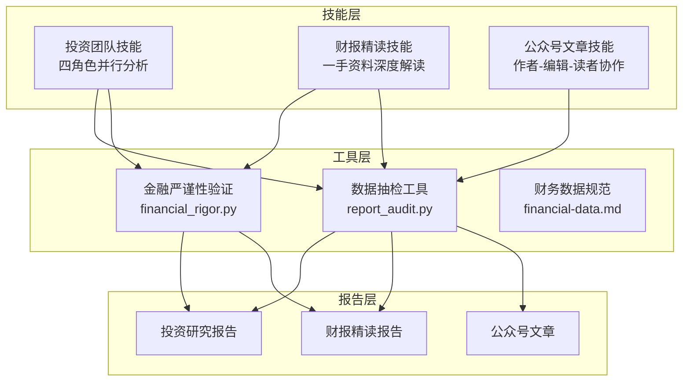
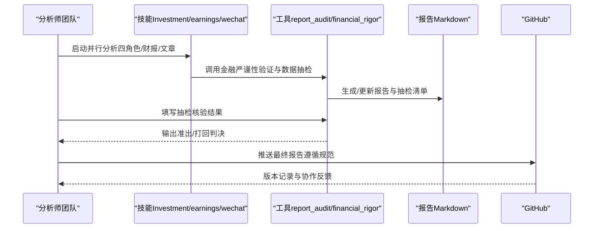
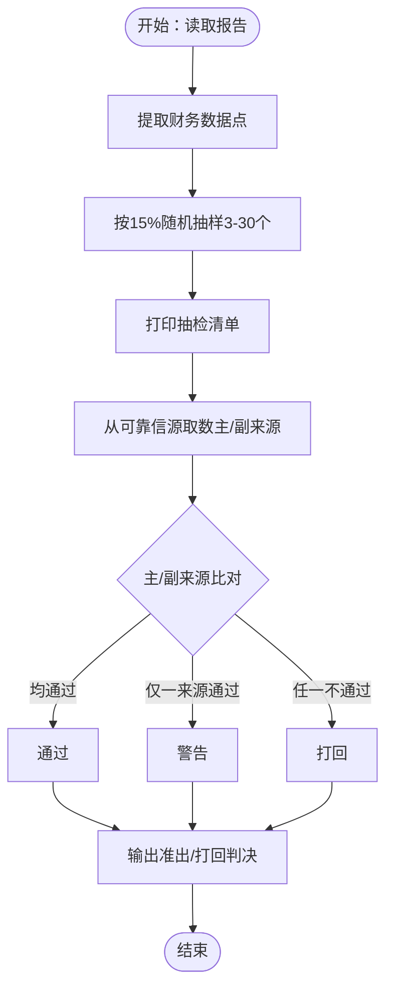
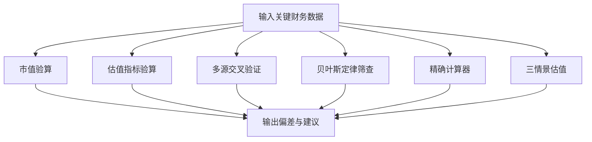
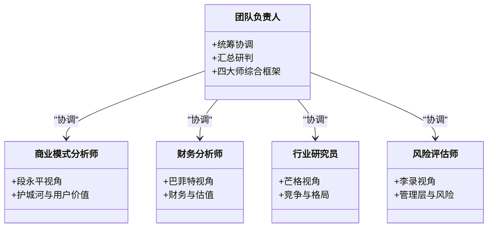
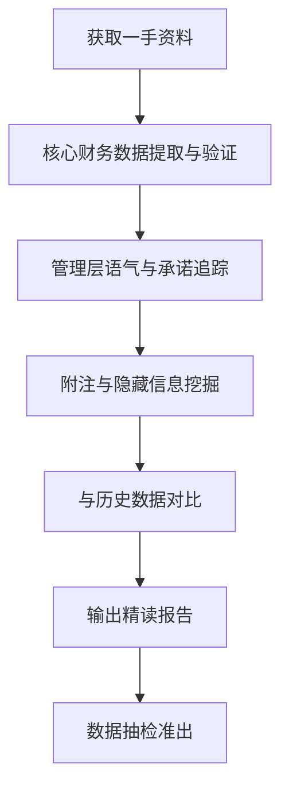
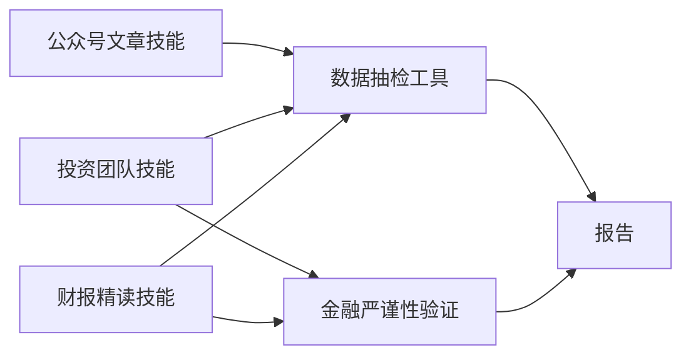

# 质量控制流程

<cite>
**本文档引用的文件**
- [report_audit.py](file://tools/report_audit.py)
- [financial_rigor.py](file://tools/financial_rigor.py)
- [investment-team.md](file://skills/investment-team.md)
- [earnings-review.md](file://skills/earnings-review.md)
- [financial-data.md](file://skills/financial-data.md)
- [wechat-article.md](file://skills/wechat-article.md)
- [.gitignore](file://.gitignore)
- [CLAUDE.md](file://CLAUDE.md)
- [腾讯-earnings-2026Q1.md](file://reports/腾讯/腾讯-earnings-2026Q1.md)
- [腾讯-research-20260620.md](file://reports/腾讯/腾讯-research-20260620.md)
</cite>

## 目录
1. [简介](#简介)
2. [项目结构](#项目结构)
3. [核心组件](#核心组件)
4. [架构总览](#架构总览)
5. [详细组件分析](#详细组件分析)
6. [依赖分析](#依赖分析)
7. [性能考量](#性能考量)
8. [故障排查指南](#故障排查指南)
9. [结论](#结论)
10. [附录](#附录)

## 简介
本文件系统化阐述“AI Berkshire”项目中的质量控制流程，围绕报告审核机制、质量检查标准、错误纠正流程展开，并结合四大师方法论在质量控制中的应用、数据验证执行标准、报告抽检操作、GitHub协作与版本控制策略，形成可操作、可追溯、可复用的质量体系。通过对工具与技能的整合，确保研究与投研报告在数据准确性、逻辑一致性、表达可读性与合规性方面达到高标准。

## 项目结构
项目采用“技能+工具+报告”的分层组织方式：
- 技能（Skills）：定义分析流程与质量标准，如四角色并行分析、财报精读、公众号文章协作等。
- 工具（Tools）：提供自动化质量保障工具，如数据抽检、金融严谨性验证、贝叶斯定律初步筛查等。
- 报告（Reports）：承载最终研究成果，遵循统一的结构与质量控制流程。

**图表来源**
- [investment-team.md:1-214](file://skills/investment-team.md#L1-L214)
- [earnings-review.md:1-219](file://skills/earnings-review.md#L1-L219)
- [wechat-article.md:1-232](file://skills/wechat-article.md#L1-L232)
- [report_audit.py:1-523](file://tools/report_audit.py#L1-L523)
- [financial_rigor.py:1-452](file://tools/financial_rigor.py#L1-L452)
- [financial-data.md:1-104](file://skills/financial-data.md#L1-L104)

**章节来源**
- [investment-team.md:1-214](file://skills/investment-team.md#L1-L214)
- [earnings-review.md:1-219](file://skills/earnings-review.md#L1-L219)
- [wechat-article.md:1-232](file://skills/wechat-article.md#L1-L232)
- [report_audit.py:1-523](file://tools/report_audit.py#L1-L523)
- [financial_rigor.py:1-452](file://tools/financial_rigor.py#L1-L452)
- [financial-data.md:1-104](file://skills/financial-data.md#L1-L104)

## 核心组件
- 数据抽检工具（report_audit.py）：自动从报告中抽取财务数据点，按15%比例随机抽样，输出核验清单与准出/打回判决，容差1%。
- 金融严谨性验证（financial_rigor.py）：提供市值验算、估值指标验算、多源交叉验证、贝叶斯定律初步筛查、精确计算器、三情景估值等能力。
- 四角色并行分析（investment-team.md）：以段永平（商业模式）、巴菲特（财务与估值）、芒格（行业与竞争）、李录（风险与管理层）四大视角构建并行研究团队，统一质量标准。
- 财报精读（earnings-review.md）：强调“读一手资料”，建立资料可得性评级、核心财务数据提取与验证、管理层语气与承诺追踪、附注与隐藏信息挖掘、与历史数据对比等流程。
- 财务数据规范（financial-data.md）：明确数据源优先级、执行规范、误差计算与标记、数据呈现格式、常见差异原因与特别规则。
- 公众号文章协作（wechat-article.md）：作者-编辑-读者三Agent协作，强制引入外部视角，确保深度、可读性与受众可理解性。
- GitHub协作与版本控制（CLAUDE.md/.gitignore）：规范推送流程、提交信息、忽略文件与推送策略。

**章节来源**
- [report_audit.py:1-523](file://tools/report_audit.py#L1-L523)
- [financial_rigor.py:1-452](file://tools/financial_rigor.py#L1-L452)
- [investment-team.md:1-214](file://skills/investment-team.md#L1-L214)
- [earnings-review.md:1-219](file://skills/earnings-review.md#L1-L219)
- [financial-data.md:1-104](file://skills/financial-data.md#L1-L104)
- [wechat-article.md:1-232](file://skills/wechat-article.md#L1-L232)
- [CLAUDE.md:87-112](file://CLAUDE.md#L87-L112)
- [.gitignore:1-8](file://.gitignore#L1-L8)

## 架构总览
质量控制贯穿“分析—验证—抽检—准出/打回—发布—版本控制”的闭环：

**图表来源**
- [investment-team.md:1-214](file://skills/investment-team.md#L1-L214)
- [earnings-review.md:1-219](file://skills/earnings-review.md#L1-L219)
- [wechat-article.md:1-232](file://skills/wechat-article.md#L1-L232)
- [report_audit.py:405-523](file://tools/report_audit.py#L405-L523)
- [financial_rigor.py:367-452](file://tools/financial_rigor.py#L367-L452)
- [CLAUDE.md:87-112](file://CLAUDE.md#L87-L112)

## 详细组件分析

### 数据抽检工具（report_audit.py）
- 数据点提取：支持Markdown表格、KV行、加粗数字行三种结构，过滤噪声标签与无效数值，保留有意义的财务字段。
- 抽样策略：按15%比例随机抽样，最少3个、最多30个，保证可人工核验。
- 核验与判决：主来源与副来源分别比对，1%容差内通过，两来源不一致（>1%）标记警告，任一来源不通过则打回。
- CLI流程：extract（抽取+打印抽检清单）、verdict（输入核验结果并输出判决）。

**图表来源**
- [report_audit.py:155-227](file://tools/report_audit.py#L155-L227)
- [report_audit.py:229-237](file://tools/report_audit.py#L229-L237)
- [report_audit.py:253-399](file://tools/report_audit.py#L253-L399)

**章节来源**
- [report_audit.py:1-523](file://tools/report_audit.py#L1-L523)

### 金融严谨性验证（financial_rigor.py）
- 市值验算：股价×总股本与报告市值对比，偏差>5%提示核查。
- 估值指标验算：PE/PB/PS/FCF Yield等指标精确计算，避免浮点误差。
- 多源交叉验证：以中位数为参考，容差阈值可配置，输出共识值。
- 贝叶斯定律筛查：对财务数据首位数字分布进行初步筛查，辅助识别异常。
- 精确计算器：仅允许数字与基础运算，避免表达式注入风险。
- 三情景估值：基于当前价格、EPS与预测期，计算乐观/中性/悲观目标价与涨跌幅。

**图表来源**
- [financial_rigor.py:61-92](file://tools/financial_rigor.py#L61-L92)
- [financial_rigor.py:98-161](file://tools/financial_rigor.py#L98-L161)
- [financial_rigor.py:167-205](file://tools/financial_rigor.py#L167-L205)
- [financial_rigor.py:214-282](file://tools/financial_rigor.py#L214-L282)
- [financial_rigor.py:288-314](file://tools/financial_rigor.py#L288-L314)
- [financial_rigor.py:320-362](file://tools/financial_rigor.py#L320-L362)

**章节来源**
- [financial_rigor.py:1-452](file://tools/financial_rigor.py#L1-L452)

### 四角色并行分析（investment-team.md）
- 团队结构：团队负责人（统筹协调）、商业模式分析师（段永平视角）、财务分析师（巴菲特视角）、行业研究员（芒格视角）、风险评估师（李录视角）。
- AI研究偏见评估：依据信息丰富度（A/B/C级）调整研究策略，强调反面检验与非共识视角。
- 任务与规范：每个任务明确分析框架、数据来源要求（两独立来源）、输出结构与结论。
- 准出流程：最终报告完成后，执行数据抽检（report_audit），通过后方可发布。

**图表来源**
- [investment-team.md:11-17](file://skills/investment-team.md#L11-L17)
- [investment-team.md:44-93](file://skills/investment-team.md#L44-L93)
- [investment-team.md:183-198](file://skills/investment-team.md#L183-L198)

**章节来源**
- [investment-team.md:1-214](file://skills/investment-team.md#L1-L214)

### 财报精读（earnings-review.md）
- 资料可得性评级：A/B/C三级，影响分析权重与结论可信度。
- 核心财务数据提取与验证：收入/利润表、现金流表、资产负债表健康度，关键指标交叉验证。
- 管理层语气与承诺追踪：信号识别、承诺对比、关键问题提取。
- 附注与隐藏信息：关联交易、股权激励、或有负债、会计政策变更、客户/供应商集中度等。
- 历史数据对比与指引对比：趋势判断与偏差解读。
- 准出流程：报告完成后执行数据抽检。

**图表来源**
- [earnings-review.md:24-31](file://skills/earnings-review.md#L24-L31)
- [earnings-review.md:43-93](file://skills/earnings-review.md#L43-L93)
- [earnings-review.md:94-127](file://skills/earnings-review.md#L94-L127)
- [earnings-review.md:128-168](file://skills/earnings-review.md#L128-L168)
- [earnings-review.md:169-211](file://skills/earnings-review.md#L169-L211)

**章节来源**
- [earnings-review.md:1-219](file://skills/earnings-review.md#L1-L219)

### 财务数据规范（financial-data.md）
- 数据源优先级：美股（macrotrends为主、stockanalysis为辅）、港股（aastocks为主、macrotrends ADR为辅）、A股（东方财富为主、巨潮资讯为辅）。
- 执行规范：每个关键数据至少两独立来源，误差计算与标记分级（≤1%一致、1%-5%差异、>5%重大差异）。
- 数据呈现格式：标注来源、误差与原因说明。
- 常见差异原因：GAAP/Non-GAAP、汇率、财年定义、合并口径、数据更新滞后等。
- 特别规则：未上市公司仅一手数据时标注“估计”、季度数据优先使用年度数据、原始财报优先。

**章节来源**
- [financial-data.md:1-104](file://skills/financial-data.md#L1-L104)

### 公众号文章协作（wechat-article.md）
- 三Agent协作：作者（深度）、编辑（结构与表达）、读者（受众视角）。
- 研究与素材收集：明确读者画像、文章深度、长度、是否需要下载原始资料、写作风格。
- 初稿与审阅：作者Agent产出初稿，编辑Agent与读者Agent并行审阅，综合反馈进行修改。
- 定稿与配图：论文解读类必须从PDF提取高清原图，插入文章；严格遵守公式与表格规范。
- 文件命名与存储：按主题与公司分类存放，便于检索与版本管理。

**章节来源**
- [wechat-article.md:1-232](file://skills/wechat-article.md#L1-L232)

## 依赖分析
- 工具与技能耦合：技能层在关键节点调用工具层，形成“分析—验证—抽检—准出”的闭环。
- 数据依赖：财务数据依赖两独立来源交叉验证，抽检依赖可靠信源（macrotrends/stockanalysis/aastocks/eastmoney/cninfo）。
- 报告依赖：最终报告需通过数据抽检与GitHub推送流程，确保可追溯与合规。

**图表来源**
- [investment-team.md:1-214](file://skills/investment-team.md#L1-L214)
- [earnings-review.md:1-219](file://skills/earnings-review.md#L1-L219)
- [wechat-article.md:1-232](file://skills/wechat-article.md#L1-L232)
- [report_audit.py:1-523](file://tools/report_audit.py#L1-L523)
- [financial_rigor.py:1-452](file://tools/financial_rigor.py#L1-L452)

**章节来源**
- [investment-team.md:1-214](file://skills/investment-team.md#L1-L214)
- [earnings-review.md:1-219](file://skills/earnings-review.md#L1-L219)
- [wechat-article.md:1-232](file://skills/wechat-article.md#L1-L232)
- [report_audit.py:1-523](file://tools/report_audit.py#L1-L523)
- [financial_rigor.py:1-452](file://tools/financial_rigor.py#L1-L452)

## 性能考量
- 抽样规模与效率：15%抽样比例兼顾覆盖率与人工核验成本，最少3个、最多30个避免过大负担。
- 容差设置：1%容差平衡数据一致性与现实差异（汇率、会计口径），两来源不一致时标记警告。
- 精确计算：金融严谨性验证使用十进制避免浮点误差，确保可审计复现。
- 并行协作：四角色并行分析与公众号文章三Agent协作显著缩短产出周期，提升质量稳定性。

[本节为一般性指导，无需特定文件引用]

## 故障排查指南
- 抽检不通过
  - 检查核验值来源与单位是否一致，确认误差是否超过容差。
  - 若两来源结果不一致（>1%），按规范标记“数据存在差异”，注明可能原因（GAAP/Non-GAAP、汇率等）。
  - 对于重大差异（>5%），退回修正并要求提供原始财报佐证。
- 估值指标异常
  - 使用金融严谨性验证工具重新验算，检查输入参数（价格、EPS、BVPS、FCF等）是否正确。
  - 若PE/ROE等指标异常，核查是否使用了最新数据与正确币种。
- 财报精读偏差
  - 对照“资料可得性评级”，若为B/C级，适当降低附注分析权重或标注“一手资料不足”。
  - 关注管理层语气与承诺追踪，识别模糊信号与归因外部化等风险信号。
- 公众号文章质量
  - 编辑与读者反馈集中在“开头弱、技术段劝退、节奏拖沓、结尾无力、概念跳跃”等问题，需针对性修改。
  - 公式必须用LaTeX，配图必须实际插入，避免占位符。

**章节来源**
- [report_audit.py:243-399](file://tools/report_audit.py#L243-L399)
- [financial_rigor.py:61-92](file://tools/financial_rigor.py#L61-L92)
- [financial_rigor.py:167-205](file://tools/financial_rigor.py#L167-L205)
- [earnings-review.md:94-127](file://skills/earnings-review.md#L94-L127)
- [wechat-article.md:173-189](file://skills/wechat-article.md#L173-L189)

## 结论
通过将四大师方法论融入并行分析框架、以金融严谨性验证与数据抽检为核心的工具体系、以及严格的GitHub协作与版本控制策略，AI Berkshire实现了从“分析—验证—抽检—准出—发布—版本管理”的全流程质量控制闭环。该体系既保证了研究与投研报告的数据准确性与逻辑一致性，又通过外部视角与多人协作提升了表达可读性与受众可理解性，具备良好的可复制性与可持续性。

[本节为总结性内容，无需特定文件引用]

## 附录

### 质量控制检查清单
- 数据来源与交叉验证
  - 关键数据是否来自两个独立来源？
  - 误差是否在容差范围内（≤1%一致、1%-5%差异、>5%重大差异）？
  - 是否标注来源与误差说明？
- 财务指标与一致性
  - 市值验算：股价×总股本与报告市值偏差是否合理？
  - 估值指标：PE/PB/PS/FCF Yield等是否精确计算？
  - 多源交叉验证：中位数参考与共识值是否明确？
- 报告结构与表达
  - 是否满足“深度、可读性、受众可理解”三要素？
  - 公式是否用LaTeX、配图是否实际插入？
  - 结论是否明确、可传播、可审计？

**章节来源**
- [financial-data.md:34-62](file://skills/financial-data.md#L34-L62)
- [financial_rigor.py:61-92](file://tools/financial_rigor.py#L61-L92)
- [financial_rigor.py:167-205](file://tools/financial_rigor.py#L167-L205)
- [wechat-article.md:173-189](file://skills/wechat-article.md#L173-L189)

### 常见问题识别
- 数据漂移与口径差异：GAAP/Non-GAAP、汇率、财年定义、合并口径。
- 管理层信号识别：坦诚信号、清晰信号、模糊信号、转移信号、归因外部化。
- 文章质量风险：开头弱、技术段劝退、节奏拖沓、结尾无力、概念跳跃。

**章节来源**
- [financial-data.md:73-82](file://skills/financial-data.md#L73-L82)
- [earnings-review.md:98-118](file://skills/earnings-review.md#L98-L118)
- [wechat-article.md:173-180](file://skills/wechat-article.md#L173-L180)

### 质量改进措施
- 强化数据源管理：优先使用原始财报，两源误差>1%时标注并追踪原因。
- 提升工具使用：在关键节点强制调用金融严谨性验证与数据抽检，确保可审计复现。
- 优化协作流程：三Agent协作与四角色并行分析并行推进，减少返工。
- 规范发布与版本控制：遵循GitHub推送流程与提交信息规范，确保可追溯与可复现。

**章节来源**
- [financial_rigor.py:1-452](file://tools/financial_rigor.py#L1-L452)
- [report_audit.py:1-523](file://tools/report_audit.py#L1-L523)
- [investment-team.md:1-214](file://skills/investment-team.md#L1-L214)
- [CLAUDE.md:87-112](file://CLAUDE.md#L87-L112)

### GitHub协作与版本控制策略
- 推送前先拉取并重放：避免远程新提交导致冲突。
- 提交信息规范：使用中文描述清楚改动内容。
- 文件推送范围：仅推送最终报告，避免中间过程文件污染仓库。
- 忽略文件：日志与系统文件纳入忽略列表，保持仓库整洁。

**章节来源**
- [CLAUDE.md:87-112](file://CLAUDE.md#L87-L112)
- [.gitignore:1-8](file://.gitignore#L1-L8)

### 示例报告与抽检实践
- 投资研究报告：包含四维评分、核心数据速览、维度分析摘要、投资论点与Checklist等，完成后执行数据抽检。
- 财报精读报告：强调“读一手资料”，包含核心数据速览、管理层语气与承诺追踪、附注中的隐藏信息、关键问题与结论等，完成后执行数据抽检。

**章节来源**
- [腾讯-research-20260620.md:1-286](file://reports/腾讯/腾讯-research-20260620.md#L1-L286)
- [腾讯-earnings-2026Q1.md:1-119](file://reports/腾讯/腾讯-earnings-2026Q1.md#L1-L119)
- [report_audit.py:405-523](file://tools/report_audit.py#L405-L523)