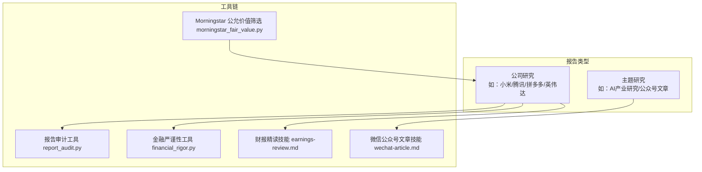
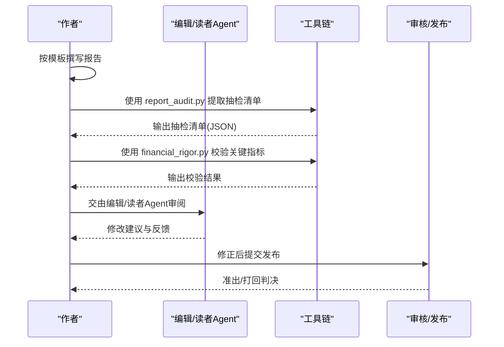
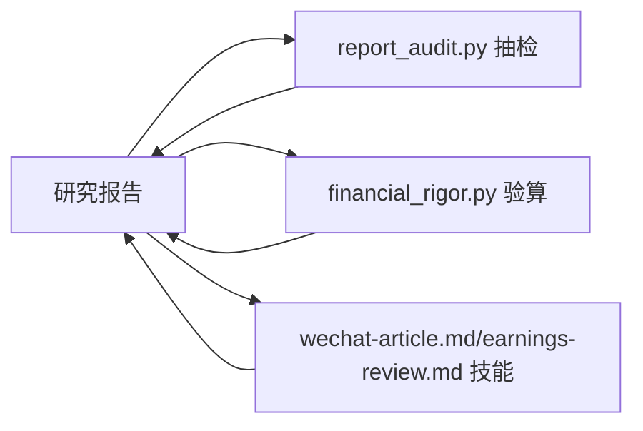

# 输出格式与样式

<cite>
**本文档引用的文件**
- [小米最终报告.md](file://reports/小米/最终报告.md)
- [拼多多最终报告-VIE股东风险专题-20260413.md](file://reports/拼多多/最终报告-VIE股东风险专题-20260413.md)
- [英伟达最终报告-安全边际-20260420.md](file://reports/英伟达/最终报告-安全边际-20260420.md)
- [腾讯研究报告-20260408.md](file://reports/腾讯/腾讯-research-20260408.md)
- [英伟达深度研究报告-20260413.md](file://reports/英伟达/英伟达-research-20260413.md)
- [拼多多财务与估值深度分析-2026Q1-20260615.md](file://reports/拼多多/拼多多-财务与估值深度分析-2026Q1-20260615.md)
- [报告审计工具 report_audit.py](file://tools/report_audit.py)
- [金融严谨性工具 financial_rigor.py](file://tools/financial_rigor.py)
- [微信公众号文章技能 wechat-article.md](file://skills/wechat-article.md)
- [财报精读技能 earnings-review.md](file://skills/earnings-review.md)
- [Morningstar 公允价值筛选工具 morningstar_fair_value.py](file://tools/morningstar_fair_value.py)
</cite>

## 目录
1. [简介](#简介)
2. [项目结构](#项目结构)
3. [核心组件](#核心组件)
4. [架构总览](#架构总览)
5. [详细组件分析](#详细组件分析)
6. [依赖关系分析](#依赖关系分析)
7. [性能考量](#性能考量)
8. [故障排查指南](#故障排查指南)
9. [结论](#结论)
10. [附录](#附录)

## 简介
本文件系统化梳理 AI Berkshire 报告输出的中文写作规范、数据标注要求、评分系统标准（★1-5）、引用格式规范、语言风格要求、数据来源标注标准、关键数据的交叉验证要求，以及报告格式模板、Markdown 语法规范与视觉呈现指南。同时提供格式检查工具与自动排版脚本的使用说明，帮助团队在统一标准下高效产出高质量研究报告。

## 项目结构
AI Berkshire 的报告体系以“公司研究”和“主题研究”两类为主，每份报告遵循统一的章节结构与格式规范，辅以工具链保障数据准确性与一致性。

图表来源
- [小米最终报告.md:1-224](file://reports/小米/最终报告.md#L1-L224)
- [腾讯研究报告-20260408.md:1-188](file://reports/腾讯/腾讯-research-20260408.md#L1-L188)
- [报告审计工具 report_audit.py:1-523](file://tools/report_audit.py#L1-L523)
- [金融严谨性工具 financial_rigor.py:1-452](file://tools/financial_rigor.py#L1-L452)
- [微信公众号文章技能 wechat-article.md:1-232](file://skills/wechat-article.md#L1-L232)
- [财报精读技能 earnings-review.md:1-219](file://skills/earnings-review.md#L1-L219)
- [Morningstar 公允价值筛选工具 morningstar_fair_value.py:1-153](file://tools/morningstar_fair_value.py#L1-L153)

章节来源
- [小米最终报告.md:1-224](file://reports/小米/最终报告.md#L1-L224)
- [腾讯研究报告-20260408.md:1-188](file://reports/腾讯/腾讯-research-20260408.md#L1-L188)
- [报告审计工具 report_audit.py:1-523](file://tools/report_audit.py#L1-L523)
- [金融严谨性工具 financial_rigor.py:1-452](file://tools/financial_rigor.py#L1-L452)
- [微信公众号文章技能 wechat-article.md:1-232](file://skills/wechat-article.md#L1-L232)
- [财报精读技能 earnings-review.md:1-219](file://skills/earnings-review.md#L1-L219)
- [Morningstar 公允价值筛选工具 morningstar_fair_value.py:1-153](file://tools/morningstar_fair_value.py#L1-L153)

## 核心组件
- 报告结构与章节规范：统一的标题层级、章节划分、摘要与结论要求。
- 数据标注与交叉验证：明确的数据来源标注、多源交叉验证、偏差容忍度。
- 评分系统：四维评分（段永平/巴菲特/芒格/李录）与综合评分。
- 引用与来源：数据来源清单、URL、报告日期、版本信息。
- 工具链：报告审计、金融严谨性验证、估值模型、筛选工具。
- 语言风格与视觉呈现：直接、犀利、不说废话；表格、图表、公式、颜色与排版规范。

章节来源
- [小米最终报告.md:10-224](file://reports/小米/最终报告.md#L10-L224)
- [拼多多最终报告-VIE股东风险专题-20260413.md:1-499](file://reports/拼多多/最终报告-VIE股东风险专题-20260413.md#L1-L499)
- [英伟达最终报告-安全边际-20260420.md:1-197](file://reports/英伟达/最终报告-安全边际-20260420.md#L1-L197)
- [腾讯研究报告-20260408.md:1-188](file://reports/腾讯/腾讯-research-20260408.md#L1-L188)
- [英伟达深度研究报告-20260413.md:1-365](file://reports/英伟达/英伟达-research-20260413.md#L1-L365)
- [拼多多财务与估值深度分析-2026Q1-20260615.md:1-473](file://reports/拼多多/拼多多-财务与估值深度分析-2026Q1-20260615.md#L1-L473)

## 架构总览
AI Berkshire 的报告产出遵循“统一结构 + 工具校验”的闭环：先按模板撰写，再通过工具链进行数据抽检与财务严谨性验证，最后形成可发布版本。

图表来源
- [报告审计工具 report_audit.py:405-523](file://tools/report_audit.py#L405-L523)
- [金融严谨性工具 financial_rigor.py:367-452](file://tools/financial_rigor.py#L367-L452)
- [财报精读技能 earnings-review.md:193-219](file://skills/earnings-review.md#L193-L219)

章节来源
- [报告审计工具 report_audit.py:1-523](file://tools/report_audit.py#L1-L523)
- [金融严谨性工具 financial_rigor.py:1-452](file://tools/financial_rigor.py#L1-L452)
- [财报精读技能 earnings-review.md:1-219](file://skills/earnings-review.md#L1-L219)

## 详细组件分析

### 中文写作规范与语言风格
- 语言风格要求：直接、犀利、不说废话。避免“正确的废话”，聚焦“非共识问题”和“未被充分定价的风险”。
- 结构要求：标题层级清晰，摘要与结论前置，章节逻辑连贯，段落不宜过长。
- 术语规范：技术术语首次出现时给出英文全称，后续用中文；公式使用 LaTeX 渲染，每个公式后附“大白话翻译”。

章节来源
- [小米最终报告.md:10-224](file://reports/小米/最终报告.md#L10-L224)
- [英伟达最终报告-安全边际-20260420.md:1-197](file://reports/英伟达/最终报告-安全边际-20260420.md#L1-L197)
- [微信公众号文章技能 wechat-article.md:70-107](file://skills/wechat-article.md#L70-L107)

### 数据标注与交叉验证
- 数据来源标注：明确列出数据来源（如年报、第三方网站、工具验算），并在报告末尾汇总。
- 多源交叉验证：对关键财务数据（如收入、利润、市值、估值指标）进行至少两个来源比对，偏差在容差范围内视为一致。
- 抽检流程：使用 report_audit.py 抽取15%数据点，人工从可靠信源取数，输出准出/打回判决。

章节来源
- [小米最终报告.md:215-224](file://reports/小米/最终报告.md#L215-L224)
- [拼多多最终报告-VIE股东风险专题-20260413.md:484-499](file://reports/拼多多/最终报告-VIE股东风险专题-20260413.md#L484-L499)
- [英伟达深度研究报告-20260413.md:329-336](file://reports/英伟达/英伟达-research-20260413.md#L329-L336)
- [报告审计工具 report_audit.py:100-199](file://tools/report_audit.py#L100-L199)
- [金融严谨性工具 financial_rigor.py:167-205](file://tools/financial_rigor.py#L167-L205)

### 评分系统标准（★1-5）
- 四维评分：商业模式与护城河（段永平）、财务与估值（巴菲特）、行业与竞争（芒格）、风险与管理层（李录）。
- 综合评分：四维评分加权汇总，形成最终综合评分（满分5分）。
- 示例：小米综合评分为3.5/5，腾讯为4.15/5，英伟达为2.5/5（当前价格下）。

章节来源
- [小米最终报告.md:16-26](file://reports/小米/最终报告.md#L16-L26)
- [腾讯研究报告-20260408.md:17-27](file://reports/腾讯/腾讯-research-20260408.md#L17-L27)
- [英伟达最终报告-安全边际-20260420.md:17-27](file://reports/英伟达/最终报告-安全边际-20260420.md#L17-L27)

### 引用格式规范
- 数据来源清单：在报告末尾列出所有数据来源，包含名称、URL、获取日期、版本信息。
- 报告日期与版本：报告生成日期、版本号、修订记录。
- 引用一致性：同一数据在不同章节引用时保持一致的标注与来源。

章节来源
- [小米最终报告.md:215-224](file://reports/小米/最终报告.md#L215-L224)
- [拼多多最终报告-VIE股东风险专题-20260413.md:484-499](file://reports/拼多多/最终报告-VIE股东风险专题-20260413.md#L484-L499)
- [英伟达深度研究报告-20260413.md:335-336](file://reports/英伟达/英伟达-research-20260413.md#L335-L336)

### 报告格式模板与 Markdown 语法规范
- 标题层级：使用 H1-H6，章节标题建议使用 H2/H3，避免滥用 H1。
- 表格规范：使用 Markdown 表格，表头清晰，单元格内数字统一格式（千分位、百分比、倍数）。
- 公式与LaTeX：公式使用行内 $...$ 或独立 $$...$$，并附“大白话翻译”。
- 图表与配图：公众号文章类报告要求从论文PDF提取高清原图并插入，非论文类可插入网络图片，需注明来源。
- 列表与要点：使用有序/无序列表，要点简洁明确，避免冗长段落。

章节来源
- [微信公众号文章技能 wechat-article.md:94-107](file://skills/wechat-article.md#L94-L107)
- [小米最终报告.md:1-224](file://reports/小米/最终报告.md#L1-L224)
- [腾讯研究报告-20260408.md:1-188](file://reports/腾讯/腾讯-research-20260408.md#L1-L188)

### 视觉呈现指南
- 颜色与强调：统一使用默认配色，避免自定义样式；使用加粗、斜体强调关键信息。
- 表格与图表：表格尽量紧凑，避免过多装饰；图表插入位置应与论述相匹配。
- 公式与代码：公式使用 LaTeX，代码片段使用反引号包裹，避免中英文混排。

章节来源
- [微信公众号文章技能 wechat-article.md:101-107](file://skills/wechat-article.md#L101-L107)
- [小米最终报告.md:1-224](file://reports/小米/最终报告.md#L1-L224)

### 关键数据交叉验证要求
- 市值验算：股价 × 总股本 ≈ 报告市值，偏差在可接受范围（如1%-5%）。
- 估值指标精确验算：PE、PB、PS、P/FCF、FCF Yield、ROE 等指标需手工复核。
- 多源一致性：收入、利润、现金流等关键指标至少两个来源比对，偏差超过容差需标注并说明。

章节来源
- [拼多多财务与估值深度分析-2026Q1-20260615.md:240-257](file://reports/拼多多/拼多多-财务与估值深度分析-2026Q1-20260615.md#L240-L257)
- [金融严谨性工具 financial_rigor.py:61-92](file://tools/financial_rigor.py#L61-L92)
- [财报精读技能 earnings-review.md:78-92](file://skills/earnings-review.md#L78-L92)

### 格式检查工具与自动排版脚本使用说明
- 报告审计工具（report_audit.py）
  - 提取数据点并随机抽样15%，输出抽检清单（可选 dry-run 预览）。
  - 人工从可靠信源取数，填入 fetched_value/fetched_source，必要时提供第二来源。
  - 输出准出/打回判决，失败项需修正后重审。
- 金融严谨性工具（financial_rigor.py）
  - 市值验算、估值指标验算、多源交叉验证、Benford定律检测、精确计算器、三情景估值。
- 公众号文章技能（wechat-article.md）
  - 作者Agent、编辑Agent、读者Agent协作，确保“深度、可读性、真的能看懂”三维度。
- 财报精读技能（earnings-review.md）
  - 一手资料优先，MD&A精读，附注与隐藏信息挖掘，与历史数据对比，输出精读报告。
- Morningstar 公允价值筛选（morningstar_fair_value.py）
  - 抓取公允价值估计，计算潜在涨幅，输出 Top 100。

章节来源
- [报告审计工具 report_audit.py:405-523](file://tools/report_audit.py#L405-L523)
- [金融严谨性工具 financial_rigor.py:367-452](file://tools/financial_rigor.py#L367-L452)
- [微信公众号文章技能 wechat-article.md:1-232](file://skills/wechat-article.md#L1-L232)
- [财报精读技能 earnings-review.md:1-219](file://skills/earnings-review.md#L1-L219)
- [Morningstar 公允价值筛选工具 morningstar_fair_value.py:1-153](file://tools/morningstar_fair_value.py#L1-L153)

## 依赖关系分析
- 报告与工具链：报告撰写依赖工具链进行数据抽检与财务严谨性验证，工具链输出结果决定报告是否准出。
- 报告与数据来源：报告末尾的数据来源清单与工具链的交叉验证互为印证，确保数据可追溯与可复核。
- 报告与评分系统：四维评分与综合评分贯穿报告始终，作为投资建议与风险评估的基础。

图表来源
- [报告审计工具 report_audit.py:1-523](file://tools/report_audit.py#L1-L523)
- [金融严谨性工具 financial_rigor.py:1-452](file://tools/financial_rigor.py#L1-L452)
- [微信公众号文章技能 wechat-article.md:1-232](file://skills/wechat-article.md#L1-L232)
- [财报精读技能 earnings-review.md:1-219](file://skills/earnings-review.md#L1-L219)

章节来源
- [报告审计工具 report_audit.py:1-523](file://tools/report_audit.py#L1-L523)
- [金融严谨性工具 financial_rigor.py:1-452](file://tools/financial_rigor.py#L1-L452)
- [微信公众号文章技能 wechat-article.md:1-232](file://skills/wechat-article.md#L1-L232)
- [财报精读技能 earnings-review.md:1-219](file://skills/earnings-review.md#L1-L219)

## 性能考量
- 工具链性能：report_audit.py 的随机抽样比例与种子可复现，便于批量抽检；financial_rigor.py 使用精确十进制避免浮点误差。
- 数据规模：Morningstar 公允价值筛选工具抓取多页数据并排序，注意网络请求频率与稳定性。
- 报告体积：Markdown 报告建议控制表格与图表数量，避免过大文件影响加载与审阅效率。

## 故障排查指南
- 报告审计打回
  - 检查抽检项的 fetched_value/fetched_source 是否填写完整。
  - 若两来源结果不一致，需标注口径差异（GAAP/Non-GAAP、汇率等）。
  - 失败项需修正后重审。
- 估值指标异常
  - 使用 financial_rigor.py 的 verify-valuation/cross-validate 进行精确验算与多源比对。
  - 若偏差较大，检查单位、汇率、股本变化等因素。
- 公众号文章配图问题
  - 确保从PDF提取的图片分辨率与大小符合要求，插入路径正确。
  - 遵循“大白话翻译 + 公式LaTeX”的规范。

章节来源
- [报告审计工具 report_audit.py:253-398](file://tools/report_audit.py#L253-L398)
- [金融严谨性工具 financial_rigor.py:98-160](file://tools/financial_rigor.py#L98-L160)
- [微信公众号文章技能 wechat-article.md:190-200](file://skills/wechat-article.md#L190-L200)

## 结论
通过统一的中文写作规范、严格的评分系统、严谨的数据标注与交叉验证、完善的引用格式与工具链支持，AI Berkshire 报告实现了“直接、犀利、不说废话”的语言风格与“可验证、可复现、可审计”的质量标准。建议在日常工作中坚持：先模板后工具、先抽检后发布、先验算后引用，确保报告质量与效率双提升。

## 附录
- 报告模板与章节建议：标题层级、摘要、四维评分、核心数据速览、维度分析摘要、投资论点、Checklist、最终建议、总结、AI研究局限性声明、数据来源汇总。
- 工具使用清单：report_audit.py、financial_rigor.py、wechat-article.md、earnings-review.md、morningstar_fair_value.py。
- 评分与引用示例：参考小米、腾讯、英伟达、拼多多等报告中的评分与来源清单。