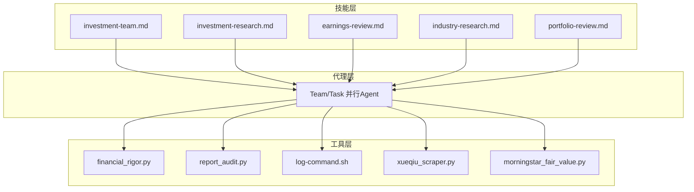
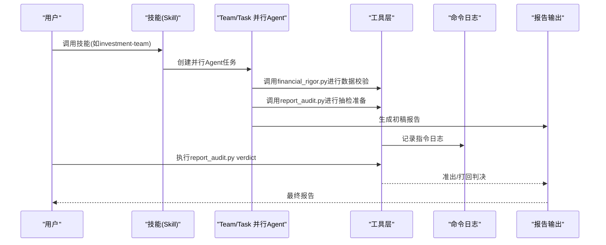
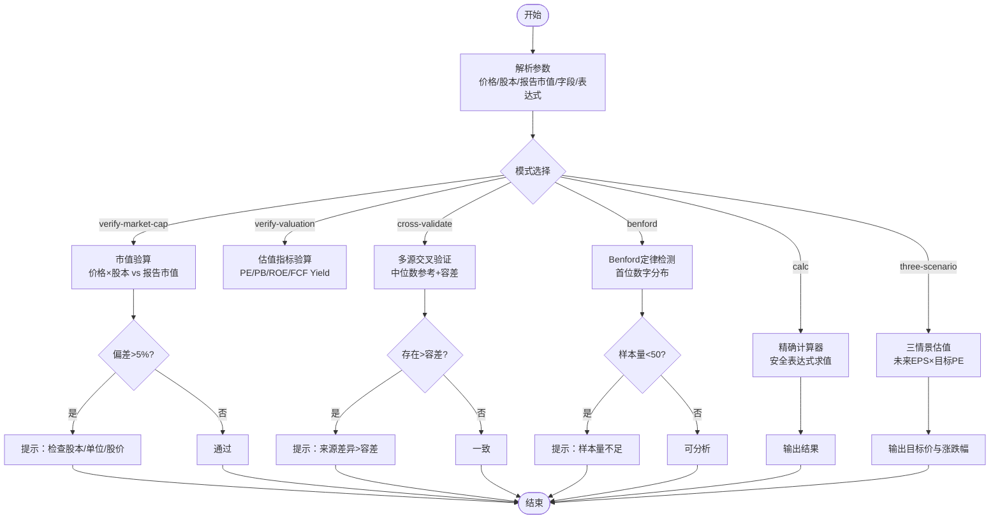
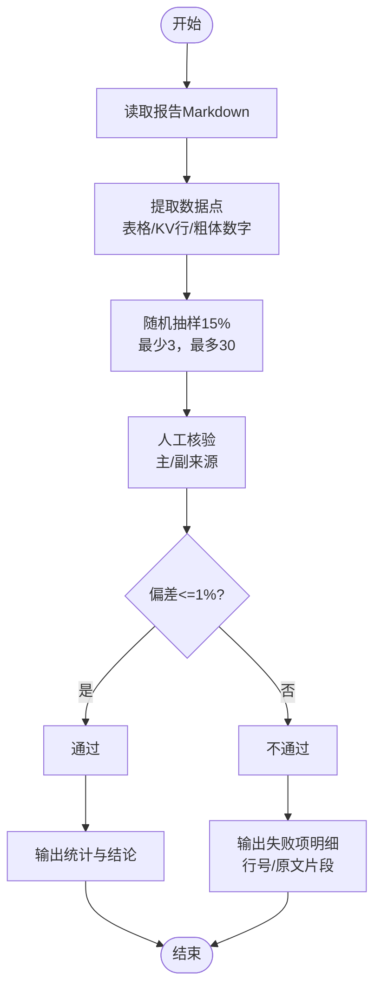
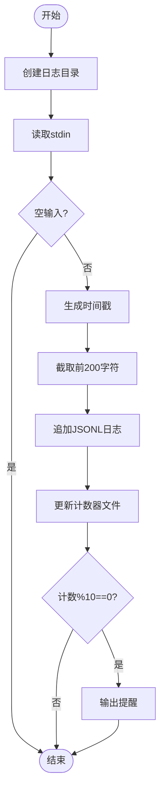
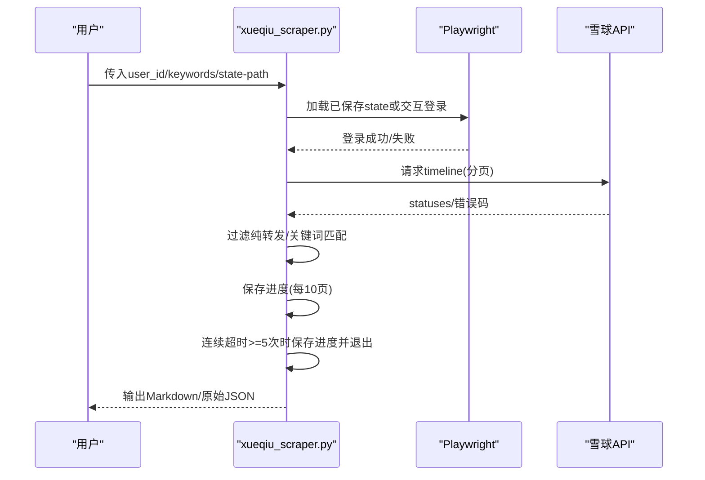
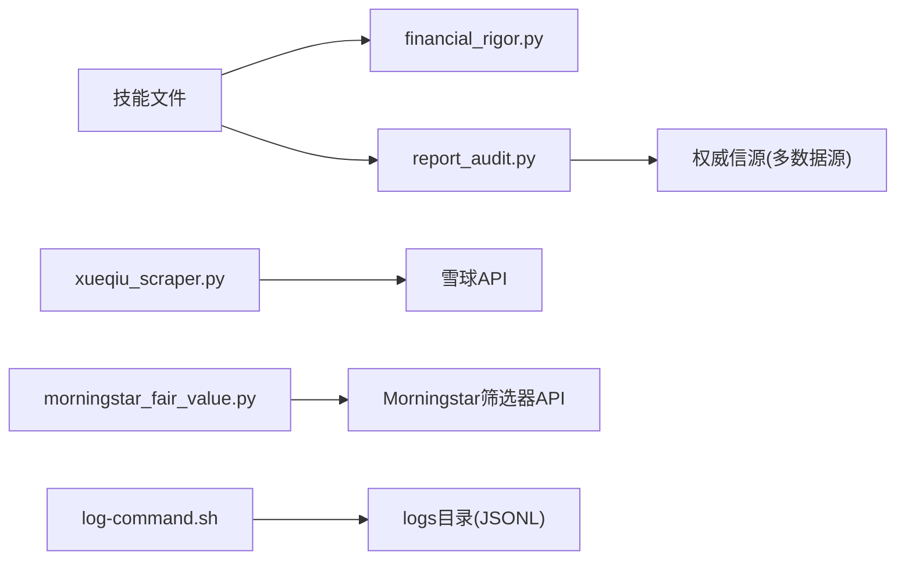

# 故障排除与维护

<cite>
**本文档引用的文件**
- [README.md](file://README.md)
- [.gitignore](file://.gitignore)
- [tools/financial_rigor.py](file://tools/financial_rigor.py)
- [tools/report_audit.py](file://tools/report_audit.py)
- [tools/log-command.sh](file://tools/log-command.sh)
- [tools/xueqiu_scraper.py](file://tools/xueqiu_scraper.py)
- [tools/morningstar_fair_value.py](file://tools/morningstar_fair_value.py)
- [skills/investment-team.md](file://skills/investment-team.md)
- [skills/investment-research.md](file://skills/investment-research.md)
- [skills/earnings-review.md](file://skills/earnings-review.md)
- [skills/industry-research.md](file://skills/industry-research.md)
- [skills/portfolio-review.md](file://skills/portfolio-review.md)
</cite>

## 目录
1. [简介](#简介)
2. [项目结构](#项目结构)
3. [核心组件](#核心组件)
4. [架构总览](#架构总览)
5. [详细组件分析](#详细组件分析)
6. [依赖关系分析](#依赖关系分析)
7. [性能考量](#性能考量)
8. [故障排除指南](#故障排除指南)
9. [结论](#结论)
10. [附录](#附录)

## 简介
本指南面向“AI Berkshire”使用者与维护者，提供系统化的故障排除与维护流程，涵盖日志分析、性能监控、数据验证异常处理、报告生成失败的解决方案，以及Git版本控制冲突、文件权限、第三方API访问异常的应对策略与系统性能优化建议。文档结合仓库内的技能与工具文件，给出可操作的排障步骤、流程图与应急响应预案。

## 项目结构
项目采用“技能层-代理层-工具层”的三层设计，围绕投资研究与报告生成展开：
- 技能层：以技能文件（skills/*.md）定义研究流程与输出规范
- 代理层：通过Team/Task工具并行执行多Agent研究
- 工具层：提供金融严谨性验证、报告抽检、命令日志、第三方数据抓取等工具

**图示来源**
- [skills/investment-team.md:1-214](file://skills/investment-team.md#L1-L214)
- [skills/investment-research.md:1-263](file://skills/investment-research.md#L1-L263)
- [skills/earnings-review.md:1-219](file://skills/earnings-review.md#L1-L219)
- [skills/industry-research.md:1-269](file://skills/industry-research.md#L1-L269)
- [skills/portfolio-review.md:1-191](file://skills/portfolio-review.md#L1-L191)
- [tools/financial_rigor.py:1-452](file://tools/financial_rigor.py#L1-L452)
- [tools/report_audit.py:1-523](file://tools/report_audit.py#L1-L523)
- [tools/log-command.sh:1-40](file://tools/log-command.sh#L1-L40)
- [tools/xueqiu_scraper.py:1-434](file://tools/xueqiu_scraper.py#L1-L434)
- [tools/morningstar_fair_value.py:1-153](file://tools/morningstar_fair_value.py#L1-L153)

**章节来源**
- [README.md:154-166](file://README.md#L154-L166)

## 核心组件
- 金融严谨性工具（financial_rigor.py）：提供市值验算、估值指标验算、多源交叉验证、Benford定律检测、精确计算器、三情景估值等，确保研究数据的可审计与可复现。
- 报告抽检工具（report_audit.py）：从研究报告中抽取15%数据点，与权威信源比对，输出准出/打回判决，保障报告质量。
- 命令日志脚本（log-command.sh）：Hook用户指令，记录到JSONL日志文件，便于回溯与审计。
- 雪球爬虫（xueqiu_scraper.py）：支持登录态复用、断点续爬、反限流策略，按关键词筛选用户原发言并输出Markdown。
- Morningstar筛选器（morningstar_fair_value.py）：抓取公允价值估计并计算潜在涨幅，输出Top 100清单与统计摘要。
- 技能文件：定义研究流程、数据验证要求、抽检流程与输出规范，指导Agent与人工协作。

**章节来源**
- [tools/financial_rigor.py:1-452](file://tools/financial_rigor.py#L1-L452)
- [tools/report_audit.py:1-523](file://tools/report_audit.py#L1-L523)
- [tools/log-command.sh:1-40](file://tools/log-command.sh#L1-L40)
- [tools/xueqiu_scraper.py:1-434](file://tools/xueqiu_scraper.py#L1-L434)
- [tools/morningstar_fair_value.py:1-153](file://tools/morningstar_fair_value.py#L1-L153)
- [skills/investment-team.md:64-92](file://skills/investment-team.md#L64-L92)
- [skills/investment-research.md:55-99](file://skills/investment-research.md#L55-L99)
- [skills/earnings-review.md:78-92](file://skills/earnings-review.md#L78-L92)
- [skills/industry-research.md:77-81](file://skills/industry-research.md#L77-L81)

## 架构总览
系统通过技能文件定义研究流程，Agent并行执行，工具层提供数据校验与抽检，日志与第三方抓取工具贯穿运行期运维。

**图示来源**
- [skills/investment-team.md:94-138](file://skills/investment-team.md#L94-L138)
- [skills/investment-research.md:186-201](file://skills/investment-research.md#L186-L201)
- [tools/financial_rigor.py:367-451](file://tools/financial_rigor.py#L367-L451)
- [tools/report_audit.py:405-522](file://tools/report_audit.py#L405-L522)
- [tools/log-command.sh:1-40](file://tools/log-command.sh#L1-L40)

## 详细组件分析

### 金融严谨性工具（financial_rigor.py）
- 功能要点
  - 市值验算：股价×总股本与报告市值对比，偏差阈值判定
  - 估值指标验算：PE/PB/ROE/FCF Yield等精确计算
  - 多源交叉验证：中位数参考与容差判定
  - Benford定律检测：首位数字分布异常筛查
  - 精确计算器：表达式安全求值
  - 三情景估值：精确十进制计算目标价与涨跌幅
- 错误处理
  - 偏差过大（>5%）提示检查股本、单位、股价
  - 容差超限（>tolerance%）提示来源差异与优先采用年报/交易所数据
  - Benford样本量不足（<50）提示分析不可靠
- 性能与复杂度
  - 精确十进制运算避免浮点漂移，计算稳定
  - Benford检测线性时间复杂度，适合大规模财务数据筛查

**图示来源**
- [tools/financial_rigor.py:61-91](file://tools/financial_rigor.py#L61-L91)
- [tools/financial_rigor.py:98-160](file://tools/financial_rigor.py#L98-L160)
- [tools/financial_rigor.py:167-204](file://tools/financial_rigor.py#L167-L204)
- [tools/financial_rigor.py:214-281](file://tools/financial_rigor.py#L214-L281)
- [tools/financial_rigor.py:288-313](file://tools/financial_rigor.py#L288-L313)
- [tools/financial_rigor.py:320-361](file://tools/financial_rigor.py#L320-L361)

**章节来源**
- [tools/financial_rigor.py:1-452](file://tools/financial_rigor.py#L1-L452)

### 报告抽检工具（report_audit.py）
- 功能要点
  - 从Markdown报告中提取财务数据点，按15%随机抽样
  - 支持主/副来源核验，容差1%
  - 输出准出/打回判决，失败项明细与原文行号
- 错误处理
  - 未提供核验值跳过统计
  - 一个来源通过、另一个不通过视为警告，提示口径差异
  - 任一来源偏差>1%即打回，需修正后重审
- 性能与复杂度
  - 正则匹配与表格解析线性复杂度
  - 随机采样固定范围（最少3，最多30）

**图示来源**
- [tools/report_audit.py:155-226](file://tools/report_audit.py#L155-L226)
- [tools/report_audit.py:229-236](file://tools/report_audit.py#L229-L236)
- [tools/report_audit.py:253-398](file://tools/report_audit.py#L253-L398)
- [tools/report_audit.py:405-522](file://tools/report_audit.py#L405-L522)

**章节来源**
- [tools/report_audit.py:1-523](file://tools/report_audit.py#L1-L523)

### 命令日志脚本（log-command.sh）
- 功能要点
  - Hook用户输入，截取前200字符，写入JSONL日志文件
  - 维护计数器，每10条输出提醒
- 故障排除
  - 日志目录不存在时自动创建
  - 空输入直接跳过
  - 计数器文件损坏时回退为0并重建

**图示来源**
- [tools/log-command.sh:5-39](file://tools/log-command.sh#L5-L39)

**章节来源**
- [tools/log-command.sh:1-40](file://tools/log-command.sh#L1-L40)

### 雪球爬虫（xueqiu_scraper.py）
- 功能要点
  - Playwright登录态复用，state持久化
  - 双通道fetch：JS fetch失败回退context.request
  - 断点续爬：每10页保存进度，连续5次超时自动退出保进度
  - 反限流：2-4s随机抖动，每50页长休30s
  - 纯转发过滤：仅收录用户本人原发言
- 故障排除
  - 首次运行无环境变量时弹出headful浏览器交互登录
  - 已保存state过期自动回退到交互登录
  - 页面加载失败重试与进度保存，避免全量重跑
  - 关键词匹配大小写不敏感，支持多关键词

**图示来源**
- [tools/xueqiu_scraper.py:111-151](file://tools/xueqiu_scraper.py#L111-L151)
- [tools/xueqiu_scraper.py:154-191](file://tools/xueqiu_scraper.py#L154-L191)
- [tools/xueqiu_scraper.py:194-321](file://tools/xueqiu_scraper.py#L194-L321)
- [tools/xueqiu_scraper.py:377-434](file://tools/xueqiu_scraper.py#L377-L434)

**章节来源**
- [tools/xueqiu_scraper.py:1-434](file://tools/xueqiu_scraper.py#L1-L434)

### Morningstar筛选器（morningstar_fair_value.py）
- 功能要点
  - 调用Morningstar筛选器API，分页抓取有公允价值估计的股票
  - 计算潜在涨幅并排序输出Top 100
  - 保存CSV并输出统计摘要
- 故障排除
  - curl超时/解析失败时跳过该页并继续
  - 价格/公平价值为空时跳过该记录
  - 输出目录不存在时自动创建

**章节来源**
- [tools/morningstar_fair_value.py:1-153](file://tools/morningstar_fair_value.py#L1-L153)

### 技能文件与流程约束
- investment-team：强制使用financial_rigor.py进行市值/估值/交叉验证/三情景估值，并执行report_audit.py抽检
- investment-research：前置AI偏见自觉，关键数据必须两源交叉验证，工具输出嵌入报告附录
- earnings-review：财报精读必须使用financial_rigor.py校验关键数据，管理层语气与承诺追踪，附注异常信号检测
- industry-research：行业研究需标注信息充分度（A/B/C），反偏见措施覆盖成熟行业偏好、龙头偏好、上市偏好等
- portfolio-review：组合层面分析包括集中度、相关性、机会成本与压力测试，预期回报使用三情景估值估算

**章节来源**
- [skills/investment-team.md:64-92](file://skills/investment-team.md#L64-L92)
- [skills/investment-research.md:55-99](file://skills/investment-research.md#L55-L99)
- [skills/earnings-review.md:78-92](file://skills/earnings-review.md#L78-L92)
- [skills/industry-research.md:64-81](file://skills/industry-research.md#L64-L81)
- [skills/portfolio-review.md:106-111](file://skills/portfolio-review.md#L106-L111)

## 依赖关系分析
- 技能文件依赖工具层：investment-team与investment-research显式调用financial_rigor.py与report_audit.py
- 报告抽检依赖权威信源：macrotrends、stockanalysis、aastocks、eastmoney等（在report_audit.py与技能文件中约定）
- 第三方API依赖：雪球API、Morningstar筛选器API
- 日志依赖：log-command.sh写入logs目录，.gitignore排除日志文件

**图示来源**
- [skills/investment-team.md:64-92](file://skills/investment-team.md#L64-L92)
- [skills/investment-research.md:55-99](file://skills/investment-research.md#L55-L99)
- [tools/report_audit.py:475-478](file://tools/report_audit.py#L475-L478)
- [tools/xueqiu_scraper.py:1-29](file://tools/xueqiu_scraper.py#L1-L29)
- [tools/morningstar_fair_value.py:14-25](file://tools/morningstar_fair_value.py#L14-L25)
- [tools/log-command.sh:5-6](file://tools/log-command.sh#L5-L6)
- [.gitignore:1-7](file://.gitignore#L1-L7)

**章节来源**
- [skills/investment-team.md:183-198](file://skills/investment-team.md#L183-L198)
- [skills/investment-research.md:238-263](file://skills/investment-research.md#L238-L263)
- [tools/report_audit.py:475-478](file://tools/report_audit.py#L475-L478)
- [.gitignore:1-7](file://.gitignore#L1-L7)

## 性能考量
- 精确十进制运算：financial_rigor.py使用decimal.Decimal，避免浮点误差累积，适合高频财务计算
- 正则与表格解析：report_audit.py对Markdown表格与KV行进行正则匹配，复杂度线性，适合中等规模报告
- 爬虫反限流：xueqiu_scraper.py采用随机抖动与长休策略，降低被封禁风险，提高稳定性
- 日志写入：log-command.sh追加写入JSONL，避免大文件重读，适合持续运行场景
- API抓取：morningstar_fair_value.py分页抓取并间隔sleep，避免API限流

[本节为通用性能讨论，无需特定文件引用]

## 故障排除指南

### 一、日志分析与审计
- 日志位置与格式
  - 日志目录：$HOME/ai-berkshire/logs
  - 文件：command-log.jsonl（每行一条JSON对象，包含time与prompt）
- 分析步骤
  - 查看累计条数：统计日志行数
  - 截取最近N条：tail -n 50 command-log.jsonl
  - 过滤关键字：grep -i “错误/失败/异常”
  - 生成摘要：每10条输出提醒，便于回溯
- 常见问题
  - 日志目录权限不足：检查目录所有权与写权限
  - 空输入导致重复空行：脚本已跳过空输入，无需处理

**章节来源**
- [tools/log-command.sh:5-39](file://tools/log-command.sh#L5-L39)
- [.gitignore:1-1](file://.gitignore#L1-L1)

### 二、数据验证异常处理
- 市值验算偏差过大（>5%）
  - 检查股本是否为最新（回购/增发）、单位是否一致（港币/人民币/美元）、股价是否最新
  - 使用financial_rigor.py verify-market-cap进行二次校验
- 多源交叉验证超容差
  - 优先采用公司年报/交易所数据
  - 标注差异原因，必要时补充第三个来源
- 估值指标异常
  - 检查EPS/PB/FCF口径差异（是否含租赁/收购）
  - 使用verify-valuation进行精确验算
- Benford检测异常
  - 样本量不足时提示不可靠
  - 异常时进行手工抽样复核与审计

**章节来源**
- [tools/financial_rigor.py:61-91](file://tools/financial_rigor.py#L61-L91)
- [tools/financial_rigor.py:167-204](file://tools/financial_rigor.py#L167-L204)
- [tools/financial_rigor.py:214-281](file://tools/financial_rigor.py#L214-L281)

### 三、报告生成失败与抽检打回
- 抽检打回（偏差>1%）
  - 修正对应数据后重新抽取抽检
  - 若主/副来源不一致，标注口径差异（GAAP/Non-GAAP、汇率）
- 抽检未提供核验值
  - 跳过该项统计，不影响最终判决
- 人工核验来源缺失
  - 按技能文件约定的权威信源补充取数

**章节来源**
- [tools/report_audit.py:253-398](file://tools/report_audit.py#L253-L398)
- [skills/investment-team.md:183-198](file://skills/investment-team.md#L183-L198)
- [skills/investment-research.md:238-263](file://skills/investment-research.md#L238-L263)

### 四、Git版本控制冲突
- 常见冲突场景
  - 多人同时修改同一技能文件
  - 报告文件与抽检模板冲突
- 解决策略
  - 使用分支开发：git checkout -b feature-x
  - 合并前先行拉取：git pull origin main
  - 冲突解决：编辑冲突标记区域，保留正确内容
  - 提交前自检：git diff --cached
  - 避免提交日志：.gitignore已屏蔽logs目录

**章节来源**
- [.gitignore:1-7](file://.gitignore#L1-L7)

### 五、文件权限问题
- 日志目录权限
  - 确保$HOME/ai-berkshire/logs存在且可写
  - 使用mkdir -p创建并设置适当权限
- 抓取缓存与state文件
  - /tmp/xueqiu_state.json需可读写
  - 避免权限不足导致登录态失效

**章节来源**
- [tools/log-command.sh:9-10](file://tools/log-command.sh#L9-L10)
- [tools/xueqiu_scraper.py:28-28](file://tools/xueqiu_scraper.py#L28-L28)

### 六、第三方API访问异常
- 雪球API
  - 登录态过期：删除已保存state，重新交互登录
  - 反爬限制：启用随机抖动与长休，必要时更换User-Agent
  - 分页错误：自动保存进度，再次运行续爬
- Morningstar筛选器API
  - 网络超时：自动跳过该页并继续
  - 数据为空：跳过该记录，继续处理其他

**章节来源**
- [tools/xueqiu_scraper.py:103-151](file://tools/xueqiu_scraper.py#L103-L151)
- [tools/xueqiu_scraper.py:272-321](file://tools/xueqiu_scraper.py#L272-L321)
- [tools/morningstar_fair_value.py:31-74](file://tools/morningstar_fair_value.py#L31-L74)

### 七、系统性能优化建议
- 金融计算
  - 使用financial_rigor.py替代LLM心算，避免浮点误差
  - 对大数格式化输出，便于审计与复现
- 爬虫性能
  - 控制并发与请求频率，避免触发限流
  - 合理设置超时与重试，提高稳定性
- 报告抽检
  - 抽样比例控制在15%，兼顾效率与覆盖率
  - 明确权威信源，减少反复核验

**章节来源**
- [tools/financial_rigor.py:288-313](file://tools/financial_rigor.py#L288-L313)
- [tools/xueqiu_scraper.py:306-310](file://tools/xueqiu_scraper.py#L306-L310)
- [tools/report_audit.py:229-236](file://tools/report_audit.py#L229-L236)

### 八、应急响应预案
- 命令日志异常
  - 检查日志目录权限与磁盘空间
  - 临时切换日志路径：export LOG_DIR=/tmp/ai-berkshire/logs
- 数据验证失败
  - 优先采用年报/交易所数据
  - 申请临时豁免：在报告中明确标注“数据验证受限”
- 报告抽检打回
  - 24小时内修正并重新抽检
  - 重大偏差需专家复核并附说明
- 第三方API不可用
  - 切换备用信源（如macrotrends↔stockanalysis互换）
  - 降级为手工核验，补齐缺失数据

**章节来源**
- [tools/log-command.sh:5-39](file://tools/log-command.sh#L5-L39)
- [tools/financial_rigor.py:167-204](file://tools/financial_rigor.py#L167-L204)
- [tools/report_audit.py:366-387](file://tools/report_audit.py#L366-L387)

## 结论
本指南基于仓库内的技能与工具文件，建立了覆盖日志审计、数据验证、报告抽检、第三方API访问与系统性能的完整故障排除与维护流程。通过严格的工具化验证与抽检机制，确保研究输出的准确性与可复现性；通过合理的应急响应预案与优化建议，保障系统在复杂外部环境下稳定运行。

## 附录
- 常用命令速查
  - 市值验算：python3 tools/financial_rigor.py verify-market-cap
  - 估值验算：python3 tools/financial_rigor.py verify-valuation
  - 多源交叉验证：python3 tools/financial_rigor.py cross-validate
  - Benford检测：python3 tools/financial_rigor.py benford
  - 精确计算：python3 tools/financial_rigor.py calc
  - 三情景估值：python3 tools/financial_rigor.py three-scenario
  - 抽检提取：python3 tools/report_audit.py extract
  - 抽检判决：python3 tools/report_audit.py verdict
  - 雪球爬取：python3 tools/xueqiu_scraper.py
  - Morningstar筛选：python3 tools/morningstar_fair_value.py

[本节为操作速查，无需特定文件引用]