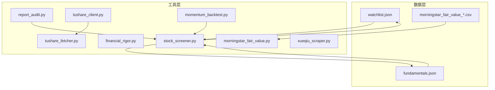
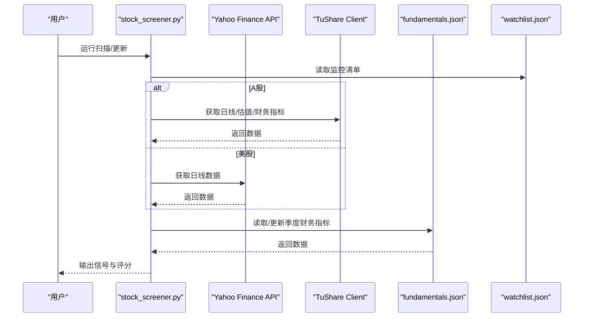
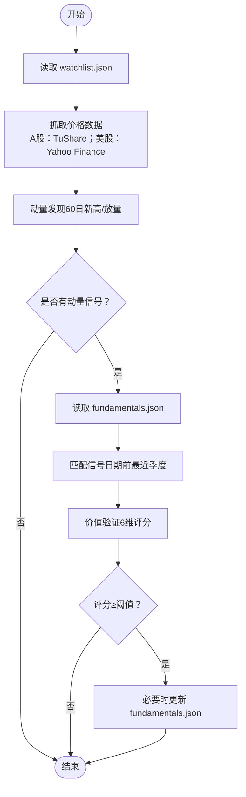
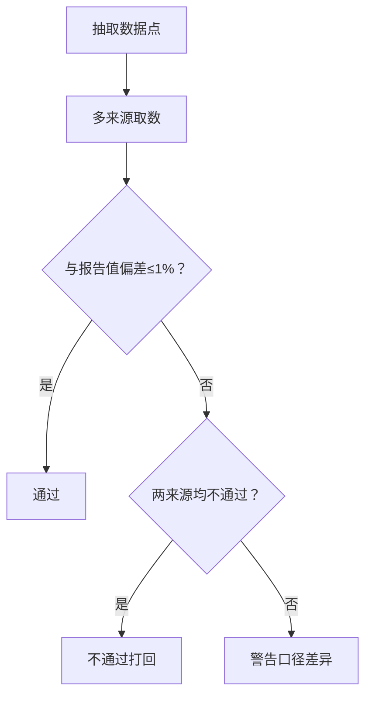
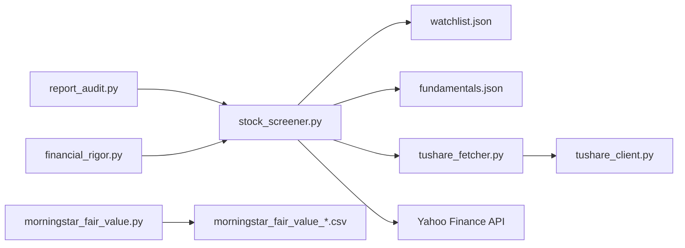

# 数据管理与存储

<cite>
**本文档引用的文件**
- [data/watchlist.json](file://data/watchlist.json)
- [data/fundamentals.json](file://data/fundamentals.json)
- [data/morningstar_fair_value_20260519.csv](file://data/morningstar_fair_value_20260519.csv)
- [tools/financial_rigor.py](file://tools/financial_rigor.py)
- [tools/morningstar_fair_value.py](file://tools/morningstar_fair_value.py)
- [tools/stock_screener.py](file://tools/stock_screener.py)
- [tools/report_audit.py](file://tools/report_audit.py)
- [tools/tushare_client.py](file://tools/tushare_client.py)
- [tools/tushare_fetcher.py](file://tools/tushare_fetcher.py)
- [tools/xueqiu_scraper.py](file://tools/xueqiu_scraper.py)
- [tools/momentum_backtest.py](file://tools/momentum_backtest.py)
</cite>

## 目录
1. [简介](#简介)
2. [项目结构](#项目结构)
3. [核心组件](#核心组件)
4. [架构概览](#架构概览)
5. [详细组件分析](#详细组件分析)
6. [依赖分析](#依赖分析)
7. [性能考虑](#性能考虑)
8. [故障排查指南](#故障排查指南)
9. [结论](#结论)
10. [附录](#附录)

## 简介
本文件面向AI Berkshire的数据管理系统，系统性阐述数据结构设计、存储策略、数据验证机制与备份恢复方案，并覆盖监控清单（watchlist.json）维护方法、财务数据（fundamentals.json）更新流程、CSV数据文件格式规范、数据导入导出流程、数据质量控制与安全策略、数据迁移指南与故障恢复方案。文档同时提供可视化图表帮助理解系统架构与数据流。

## 项目结构
项目采用“数据文件 + 工具脚本”的分层组织方式：
- data：存放核心数据文件（JSON、CSV）
- tools：存放数据采集、清洗、验证、审计等工具脚本
- reports：存放研究报告（文本与分析产物）
- logs：日志目录（预留）
- assets：架构图与资源（如 architecture.mmd）

**图表来源**
- [data/watchlist.json](file://data/watchlist.json)
- [data/fundamentals.json](file://data/fundamentals.json)
- [data/morningstar_fair_value_20260519.csv](file://data/morningstar_fair_value_20260519.csv)
- [tools/stock_screener.py](file://tools/stock_screener.py)
- [tools/financial_rigor.py](file://tools/financial_rigor.py)
- [tools/report_audit.py](file://tools/report_audit.py)
- [tools/tushare_client.py](file://tools/tushare_client.py)
- [tools/tushare_fetcher.py](file://tools/tushare_fetcher.py)
- [tools/morningstar_fair_value.py](file://tools/morningstar_fair_value.py)
- [tools/xueqiu_scraper.py](file://tools/xueqiu_scraper.py)
- [tools/momentum_backtest.py](file://tools/momentum_backtest.py)

**章节来源**
- [data/watchlist.json](file://data/watchlist.json)
- [data/fundamentals.json](file://data/fundamentals.json)
- [data/morningstar_fair_value_20260519.csv](file://data/morningstar_fair_value_20260519.csv)
- [tools/stock_screener.py](file://tools/stock_screener.py)

## 核心组件
- 监控清单（watchlist.json）：按主题分组的标的清单，支持美股AI芯片、应用、基建、加密货币、港股互联网、A股等分组。
- 财务数据（fundamentals.json）：按股票维度存储季度财务指标（营收同比、毛利率、EPS超预期等）。
- Morningstar公允价值CSV：按日期生成的筛选结果，包含潜在涨幅、星级、护城河等字段。
- 数据采集与验证工具：包括A股TuShare抓取、美股Yahoo Finance抓取、多源交叉验证、报告数据抽检、财务严谨性校验等。

**章节来源**
- [data/watchlist.json](file://data/watchlist.json)
- [data/fundamentals.json](file://data/fundamentals.json)
- [data/morningstar_fair_value_20260519.csv](file://data/morningstar_fair_value_20260519.csv)
- [tools/stock_screener.py](file://tools/stock_screener.py)
- [tools/financial_rigor.py](file://tools/financial_rigor.py)
- [tools/report_audit.py](file://tools/report_audit.py)
- [tools/tushare_client.py](file://tools/tushare_client.py)
- [tools/tushare_fetcher.py](file://tools/tushare_fetcher.py)
- [tools/morningstar_fair_value.py](file://tools/morningstar_fair_value.py)

## 架构概览
系统围绕“数据文件 + 工具脚本”构建，形成“采集-清洗-验证-审计-产出”的闭环。

**图表来源**
- [tools/stock_screener.py](file://tools/stock_screener.py)
- [tools/tushare_client.py](file://tools/tushare_client.py)
- [data/fundamentals.json](file://data/fundamentals.json)
- [data/watchlist.json](file://data/watchlist.json)

## 详细组件分析

### 监控清单（watchlist.json）维护
- 结构：顶层为分组键（如 us_ai_chip、us_ai_app、us_ai_infra、us_crypto、hk_internet、a_share），值为标的列表。
- 维护要点：
  - 新增标的：在相应分组下添加；确保命名规范（美股使用直译代码，港股使用 .HK 后缀，A股使用 .SZ/.SH 后缀）。
  - 删除标的：从分组列表移除；同步清理不再需要的研究报告与历史数据。
  - 分组扩展：新增主题分组时，保持与扫描器一致的键名，避免遗漏。
- 使用方式：扫描器默认读取该文件；也可通过命令行参数直接指定标的列表。

**章节来源**
- [data/watchlist.json](file://data/watchlist.json)
- [tools/stock_screener.py](file://tools/stock_screener.py)

### 财务数据（fundamentals.json）更新流程
- 数据来源：季度财务指标（营收同比、毛利率、EPS超预期等），由交互式更新或外部抓取工具写入。
- 更新方式：
  - 交互式更新：运行扫描器的更新模式，按提示输入财报发布日、标签、各项指标，自动写入 JSON。
  - 批量更新：A股通过 TuShare 客户端批量抓取财务指标与利润表，合并到本地缓存文件。
- 读取与评分：扫描器按信号日期匹配最近季度财务数据，进行价值验证评分。

**图表来源**
- [tools/stock_screener.py](file://tools/stock_screener.py)
- [data/fundamentals.json](file://data/fundamentals.json)
- [data/watchlist.json](file://data/watchlist.json)

**章节来源**
- [tools/stock_screener.py](file://tools/stock_screener.py)
- [tools/tushare_client.py](file://tools/tushare_client.py)
- [tools/tushare_fetcher.py](file://tools/tushare_fetcher.py)
- [data/fundamentals.json](file://data/fundamentals.json)

### CSV数据文件格式规范（Morningstar公允价值）
- 文件命名：morningstar_fair_value_YYYYMMDD.csv
- 字段顺序：rank、ticker、name、close_price、fair_value、upside_pct、star_rating、moat、uncertainty、sector、industry
- 字段说明：
  - rank：排名
  - ticker：股票代码
  - name：公司名称
  - close_price：收盘价
  - fair_value：公允价值
  - upside_pct：潜在涨幅（百分比）
  - star_rating：星级（1-5）
  - moat：护城河（Wide/Narrow/None）
  - uncertainty：不确定性评估
  - sector/industry：所属板块与行业
- 导入导出：
  - 导出：工具自动生成并保存至 data 目录
  - 导入：扫描器读取最新文件进行分析

**章节来源**
- [data/morningstar_fair_value_20260519.csv](file://data/morningstar_fair_value_20260519.csv)
- [tools/morningstar_fair_value.py](file://tools/morningstar_fair_value.py)

### 数据导入导出流程
- watchlist.json：默认初始化；扫描器读取并扩展；可由用户直接编辑。
- fundamentals.json：交互式更新或批量抓取写入；扫描器读取并评分。
- CSV：按日期生成，无需手动导入；工具自动读取最新文件。

**章节来源**
- [tools/stock_screener.py](file://tools/stock_screener.py)
- [tools/tushare_fetcher.py](file://tools/tushare_fetcher.py)
- [tools/morningstar_fair_value.py](file://tools/morningstar_fair_value.py)

### 数据验证机制
- 财务严谨性校验（financial_rigor.py）：
  - 市值验算：股价×总股本 vs 报告市值，偏差阈值（默认>5%预警）
  - 估值指标验算：PE/PB/PS/FCF Yield等，使用十进制精确计算
  - 多源交叉验证：对同一指标在多个来源间比较，设定容差（默认2%）
  - Benford定律检测：对大量财务数值进行首位数字分布检验
  - 三情景估值：基于不同增长与PE情景的目标价计算
- 报告数据抽检（report_audit.py）：
  - 从研究报告中抽取15%数据点，与可靠信源比对
  - 容差1%，两来源不一致视为警告，不一致且超出容差视为不通过
  - 输出准出/打回判决与明细

**图表来源**
- [tools/report_audit.py](file://tools/report_audit.py)
- [tools/financial_rigor.py](file://tools/financial_rigor.py)

**章节来源**
- [tools/financial_rigor.py](file://tools/financial_rigor.py)
- [tools/report_audit.py](file://tools/report_audit.py)

### 数据质量控制措施
- 数据一致性：
  - 多源交叉验证（financial_rigor.py cross-validate）
  - Benford定律检测（financial_rigor.py benford）
  - 报告抽检（report_audit.py）
- 数据完整性：
  - 扫描器对缺失基本面数据给出“观察”信号，提示补充
  - A股通过TuShare获取最新交易日与估值快照，避免使用过期数据
- 数据准确性：
  - 使用十进制精确计算，避免浮点误差
  - 对异常波动与极端偏离进行预警

**章节来源**
- [tools/financial_rigor.py](file://tools/financial_rigor.py)
- [tools/report_audit.py](file://tools/report_audit.py)
- [tools/tushare_client.py](file://tools/tushare_client.py)

### 数据安全保护策略
- 凭据管理：
  - TuShare凭据通过环境变量注入，不在代码中硬编码
- 登录态管理：
  - 雪球爬虫支持登录态持久化与复用，避免重复登录
- 网络访问：
  - 使用curl或Playwright请求，遵循反爬策略（随机延时、长休、断点续爬）
- 输出控制：
  - 工具脚本输出到本地文件，便于审计与版本管理

**章节来源**
- [tools/tushare_client.py](file://tools/tushare_client.py)
- [tools/xueqiu_scraper.py](file://tools/xueqiu_scraper.py)

### 数据迁移指南
- watchlist.json：
  - 新增/删除分组时，确保扫描器键名一致
  - 迁移后验证扫描器输出是否覆盖全部分组
- fundamentals.json：
  - 从旧版本迁移时，统一字段命名与日期格式
  - 使用交互式更新补齐缺失季度数据
- CSV：
  - 保留历史文件命名规则（YYYYMMDD），避免解析冲突
  - 迁移后验证工具读取最新文件

**章节来源**
- [data/watchlist.json](file://data/watchlist.json)
- [data/fundamentals.json](file://data/fundamentals.json)
- [tools/stock_screener.py](file://tools/stock_screener.py)

### 故障恢复方案
- 网络异常：
  - A股抓取失败：切换到上一个交易日或重试
  - 美股抓取失败：重试或使用缓存数据
- 数据缺失：
  - fundamentals.json缺失季度数据：使用交互式更新补齐
  - watchlist.json缺失标的：补充后重新扫描
- 验证失败：
  - 报告抽检不通过：修正报告值或更换信源
  - 财务严谨性偏差过大：检查输入参数与单位一致性

**章节来源**
- [tools/tushare_fetcher.py](file://tools/tushare_fetcher.py)
- [tools/stock_screener.py](file://tools/stock_screener.py)
- [tools/report_audit.py](file://tools/report_audit.py)
- [tools/financial_rigor.py](file://tools/financial_rigor.py)

## 依赖分析
- 组件耦合：
  - stock_screener.py 依赖 watchlist.json 与 fundamentals.json，并调用 TuShare/Yahoo Finance
  - tushare_client.py 为 tushare_fetcher.py 的底层客户端
  - financial_rigor.py 与 report_audit.py 为独立验证模块，可单独使用
- 外部依赖：
  - TuShare Pro API（通过 curl 调用）
  - Yahoo Finance Chart API
  - Playwright（雪球爬虫）

**图表来源**
- [tools/stock_screener.py](file://tools/stock_screener.py)
- [tools/tushare_fetcher.py](file://tools/tushare_fetcher.py)
- [tools/tushare_client.py](file://tools/tushare_client.py)
- [tools/report_audit.py](file://tools/report_audit.py)
- [tools/financial_rigor.py](file://tools/financial_rigor.py)
- [tools/morningstar_fair_value.py](file://tools/morningstar_fair_value.py)
- [data/watchlist.json](file://data/watchlist.json)
- [data/fundamentals.json](file://data/fundamentals.json)
- [data/morningstar_fair_value_20260519.csv](file://data/morningstar_fair_value_20260519.csv)

**章节来源**
- [tools/stock_screener.py](file://tools/stock_screener.py)
- [tools/tushare_client.py](file://tools/tushare_client.py)
- [tools/tushare_fetcher.py](file://tools/tushare_fetcher.py)
- [tools/report_audit.py](file://tools/report_audit.py)
- [tools/financial_rigor.py](file://tools/financial_rigor.py)
- [tools/morningstar_fair_value.py](file://tools/morningstar_fair_value.py)

## 性能考虑
- 批量抓取限流：A股抓取间隔0.3秒，避免触发风控
- 反限流策略：随机延时、长休、断点续爬，提升稳定性
- 精确计算：使用十进制避免浮点误差，提高财务计算可靠性
- 缓存与增量更新：仅对缺失或过期数据进行抓取，减少重复请求

[本节为通用指导，无需具体文件引用]

## 故障排查指南
- TuShare凭据错误：
  - 检查 .env 中 TUSHARE_TOKEN 是否正确
  - 确认 API URL 设置
- 报告抽检不通过：
  - 核对抽取的行号与原文
  - 更换主/副来源，确认口径差异
- 财务严谨性偏差过大：
  - 检查单位一致性（亿/亿元/美元等）
  - 确认输入参数（价格、股本、EPS等）
- 雪球爬虫登录失败：
  - 检查登录态文件是否过期
  - 重新登录并保存状态

**章节来源**
- [tools/tushare_client.py](file://tools/tushare_client.py)
- [tools/report_audit.py](file://tools/report_audit.py)
- [tools/financial_rigor.py](file://tools/financial_rigor.py)
- [tools/xueqiu_scraper.py](file://tools/xueqiu_scraper.py)

## 结论
本数据管理系统以轻量、稳健为核心设计原则：通过标准化的数据文件（watchlist.json、fundamentals.json、CSV）与工具脚本（采集、验证、审计）形成闭环，确保数据质量与可追溯性。监控清单与财务数据的维护流程清晰，验证与审计机制完善，具备良好的可扩展性与可维护性。

## 附录
- 常用命令参考：
  - 扫描器：python3 tools/stock_screener.py [标的列表]；更新单只：--update TICKER
  - TuShare：python3 tools/tushare_fetcher.py update-all；批量估值：batch-quote
  - 财务严谨性：python3 tools/financial_rigor.py verify-market-cap/cross-validate/benford
  - 报告抽检：python3 tools/report_audit.py extract/verdict
  - Morningstar：python3 tools/morningstar_fair_value.py
  - 回测：python3 tools/momentum_backtest.py

[本节为概念性内容，无需具体文件引用]