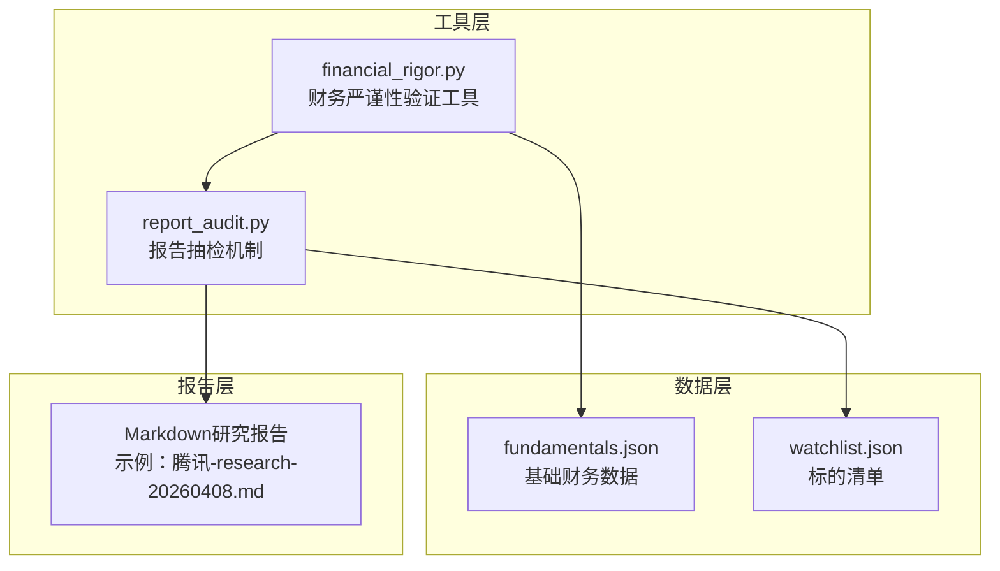
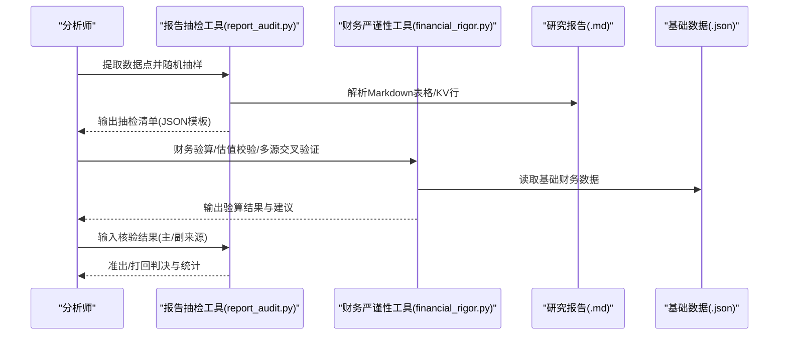
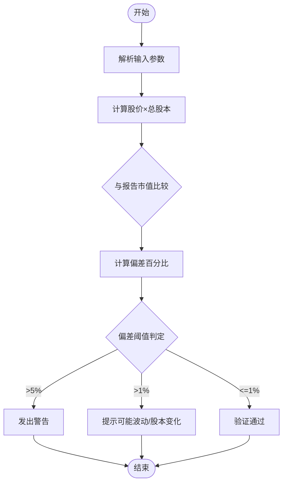
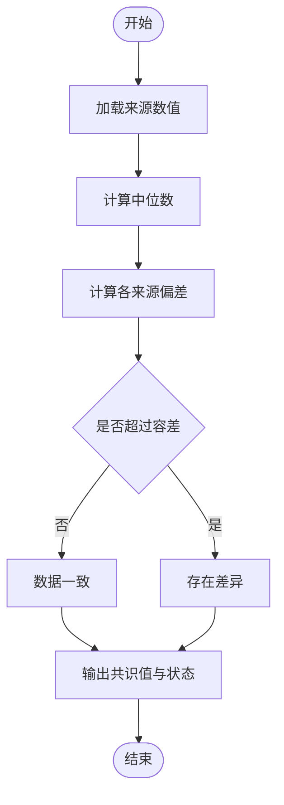
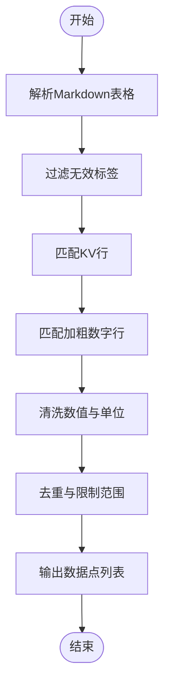
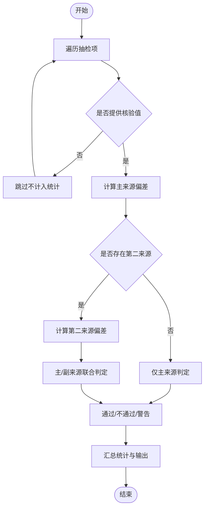
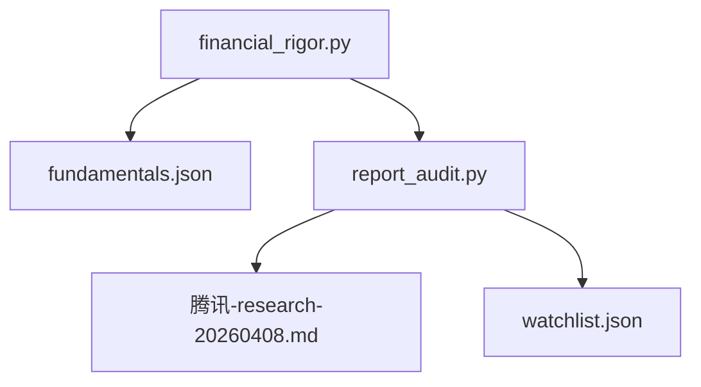

# 数据验证与质量控制

<cite>
**本文档引用的文件**
- [financial_rigor.py](file://tools/financial_rigor.py)
- [report_audit.py](file://tools/report_audit.py)
- [fundamentals.json](file://data/fundamentals.json)
- [watchlist.json](file://data/watchlist.json)
- [腾讯-research-20260408.md](file://reports/腾讯/腾讯-research-20260408.md)
</cite>

## 目录
1. [简介](#简介)
2. [项目结构](#项目结构)
3. [核心组件](#核心组件)
4. [架构概览](#架构概览)
5. [详细组件分析](#详细组件分析)
6. [依赖关系分析](#依赖关系分析)
7. [性能考虑](#性能考虑)
8. [故障排查指南](#故障排查指南)
9. [结论](#结论)

## 简介
本文件为AI Berkshire的数据验证与质量控制系统提供综合性技术文档，重点覆盖两大核心模块：
- 财务严谨性验证工具（financial_rigor.py）：提供精确的财务数据验算、估值指标校验、多源交叉验证、Benford定律检测以及三情景估值模型等功能，确保投资研究中的财务数据准确性和一致性。
- 报告抽检机制（report_audit.py）：实现从研究报告中自动抽取财务数据点，进行15%的随机抽检，并与权威信源比对，输出准出/打回判决，保障报告质量与合规性。

该系统采用纯Python标准库实现，零外部依赖，强调可审计性、可复现性和稳定性，适用于AI驱动的投资研究工作流。

## 项目结构
系统围绕工具脚本与数据文件组织，形成“工具-数据-报告”的闭环质量控制体系。

图表来源
- [financial_rigor.py:1-452](file://tools/financial_rigor.py#L1-L452)
- [report_audit.py:1-523](file://tools/report_audit.py#L1-L523)
- [fundamentals.json:1-36](file://data/fundamentals.json#L1-L36)
- [watchlist.json:1-38](file://data/watchlist.json#L1-L38)
- [腾讯-research-20260408.md:1-188](file://reports/腾讯/腾讯-research-20260408.md#L1-L188)

章节来源
- [financial_rigor.py:1-452](file://tools/financial_rigor.py#L1-L452)
- [report_audit.py:1-523](file://tools/report_audit.py#L1-L523)
- [fundamentals.json:1-36](file://data/fundamentals.json#L1-L36)
- [watchlist.json:1-38](file://data/watchlist.json#L1-L38)
- [腾讯-research-20260408.md:1-188](file://reports/腾讯/腾讯-research-20260408.md#L1-L188)

## 核心组件
- 财务严谨性验证工具（financial_rigor.py）
  - 精确十进制运算引擎：避免浮点误差，保证财务计算的可审计性。
  - 市值验算：股价×总股本与报告市值的偏差检测。
  - 估值指标验算：PE、PB、PS、P/FCF、股息率等指标的自动计算与校验。
  - 多源交叉验证：基于中位数的共识值计算与容差判定。
  - Benford定律检测：财务数据首位数字分布的统计检验，辅助识别异常。
  - 三情景估值模型：在乐观、中性、悲观三种假设下的目标价与涨跌幅测算。
  - 精确计算器：支持科学计数法的安全表达式求值。
- 报告抽检机制（report_audit.py）
  - 数据点提取：从Markdown报告中识别表格、KV行等结构化财务数据。
  - 抽样策略：按15%比例随机抽取，最少3个、最多30个，支持固定随机种子复现。
  - 准出/打回判决：基于1%容差的主来源与第二来源比对，区分通过、警告与不通过三类结果。
  - 信源指引：提供美股/macrotrends、stockanalysis、aastocks、eastmoney等权威信源的核验建议。

章节来源
- [financial_rigor.py:25-452](file://tools/financial_rigor.py#L25-L452)
- [report_audit.py:35-523](file://tools/report_audit.py#L35-L523)

## 架构概览
系统采用“工具-数据-报告”三层协作架构，通过CLI命令串联，形成自动化质量控制流水线。

图表来源
- [report_audit.py:405-523](file://tools/report_audit.py#L405-L523)
- [financial_rigor.py:367-452](file://tools/financial_rigor.py#L367-L452)
- [fundamentals.json:1-36](file://data/fundamentals.json#L1-L36)

## 详细组件分析

### 财务严谨性验证工具（financial_rigor.py）

#### 精确十进制引擎
- 使用Decimal与Context确保计算精度，避免浮点陷阱。
- 提供统一的数值转换函数，兼容float/str/Decimal输入。
- 数值格式化支持亿/万亿/B/T等单位，便于阅读。

章节来源
- [financial_rigor.py:25-55](file://tools/financial_rigor.py#L25-L55)

#### 市值验算（verify_market_cap）
- 输入：股价、总股本、报告市值、货币单位。
- 计算：股价×总股本并与报告值比较，输出偏差百分比。
- 判定：>5%警告、>1%提示、≤1%通过。
- 建议：检查股本变动、汇率与单位一致性。

图表来源
- [financial_rigor.py:61-91](file://tools/financial_rigor.py#L61-L91)

章节来源
- [financial_rigor.py:61-91](file://tools/financial_rigor.py#L61-L91)

#### 估值指标验算（verify_valuation）
- 输入：当前股价与可选EPS、BVPS、FCF/Share、股息、Revenue/Share。
- 输出：PE、PB、PS、P/FCF、股息率等指标，以及ROE（当EPS与BVPS均可用时）。
- 特点：所有计算使用精确十进制，避免浮点误差。

章节来源
- [financial_rigor.py:98-160](file://tools/financial_rigor.py#L98-L160)

#### 多源交叉验证（cross_validate）
- 输入：字段名、来源字典（来源→数值）、单位、容差百分比。
- 方法：以中位数为参考，计算各来源与中位数的偏差。
- 输出：共识值（中位数）与一致性状态，建议优先采用年报/交易所数据。

图表来源
- [financial_rigor.py:167-204](file://tools/financial_rigor.py#L167-L204)

章节来源
- [financial_rigor.py:167-204](file://tools/financial_rigor.py#L167-L204)

#### Benford定律检测（benford_check）
- 输入：财务数值列表。
- 方法：统计首位数字观测分布，计算MAD与卡方检验，给出符合度等级。
- 判定：MAD<0.015视为符合，否则提示可能存在人为调整，需进一步调查。

章节来源
- [financial_rigor.py:214-281](file://tools/financial_rigor.py#L214-L281)

#### 三情景估值模型（three_scenario_valuation）
- 输入：当前股价、EPS、总股本（亿）、三情景年增长率与目标PE、预测年限。
- 输出：乐观/中性/悲观情景下的目标EPS、目标股价与涨跌幅。
- 特点：使用精确十进制，结果可审计复现。

章节来源
- [financial_rigor.py:320-361](file://tools/financial_rigor.py#L320-L361)

#### 精确计算器（exact_calc）
- 输入：算术表达式（支持+、-、*、/、括号、科学计数法）。
- 输出：表达式结果与精确值，提供安全表达式校验。

章节来源
- [financial_rigor.py:288-314](file://tools/financial_rigor.py#L288-L314)

### 报告抽检机制（report_audit.py）

#### 数据点提取（extract_data_points）
- 支持三类结构：
  - 多列Markdown表格：(行标签 + 列标题) → 数值。
  - 带冒号的KV行：标签：数值 单位。
  - 加粗数字行：**数值** 单位。
- 过滤规则：剔除无效标签、纯年份/季度、Markdown标记、无意义标签等。

图表来源
- [report_audit.py:155-226](file://tools/report_audit.py#L155-L226)

章节来源
- [report_audit.py:155-226](file://tools/report_audit.py#L155-L226)

#### 抽样策略（sample_points）
- 比例：默认15%，最少3个、最多30个。
- 随机种子：支持固定种子以复现样本。
- 排序：按行号排序，便于人工核对。

章节来源
- [report_audit.py:229-236](file://tools/report_audit.py#L229-L236)

#### 准出/打回判决（render_verdict）
- 容差：1%。
- 判决规则：
  - 主来源与第二来源均通过：通过。
  - 主来源与第二来源均不通过：不通过。
  - 一通过一不通过：警告（口径差异/汇率等）。
- 输出：通过/警告/不通过数量统计、失败项明细与原因说明。

图表来源
- [report_audit.py:253-398](file://tools/report_audit.py#L253-L398)

章节来源
- [report_audit.py:253-398](file://tools/report_audit.py#L253-L398)

#### 信源指引与工作流程
- 主信源：macrotrends（美股）、stockanalysis（美股）、aastocks（港股）、eastmoney（A股）。
- 工作流程：提取→核验→判决，支持dry-run预览与JSON输出。

章节来源
- [report_audit.py:405-523](file://tools/report_audit.py#L405-L523)

## 依赖关系分析
- 组件耦合
  - financial_rigor.py与report_audit.py：通过CLI调用与数据交互，前者负责财务验算，后者负责报告抽检。
  - 数据文件（fundamentals.json、watchlist.json）：为财务严谨性工具提供基础财务数据支撑。
- 外部依赖
  - 两者均为纯Python标准库实现，零外部依赖，部署简单、运行稳定。
- 潜在循环依赖
  - 无循环依赖，职责清晰分离。

图表来源
- [financial_rigor.py:1-452](file://tools/financial_rigor.py#L1-L452)
- [report_audit.py:1-523](file://tools/report_audit.py#L1-L523)
- [fundamentals.json:1-36](file://data/fundamentals.json#L1-L36)
- [watchlist.json:1-38](file://data/watchlist.json#L1-L38)
- [腾讯-research-20260408.md:1-188](file://reports/腾讯/腾讯-research-20260408.md#L1-L188)

## 性能考虑
- 精确十进制计算：Decimal.Context保证高精度，适合财务场景，但计算开销略高于浮点。
- 正则匹配与字符串处理：report_audit.py的正则匹配与表格解析在大型报告中可能成为瓶颈，建议：
  - 控制抽样比例（默认15%）以减少处理量。
  - 对超大报告分段处理或提前过滤无关内容。
- Benford检测：样本量小于50时给出“样本量不足”提示，避免误判。

## 故障排查指南
- 市值验算偏差过大（>5%）
  - 检查股本是否最新（回购/增发）、单位是否一致（港币/人民币/美元）、股价是否为最新。
- 估值指标无法计算
  - EPS为0时PE不可计算；PB需要BVPS非零；P/FCF需要FCF/Share非零。
- 多源交叉验证存在差异
  - 建议优先采用公司年报/交易所数据；检查单位与货币转换。
- Benford检测不符合
  - 不符合不等于造假，需结合业务背景与数据来源进一步调查。
- 报告抽检不通过
  - 查看失败项的行号、标签、报告值与核验值，确认口径差异（GAAP/Non-GAAP、汇率等）。
- CLI参数错误
  - 确认命令子参数齐全，JSON输入格式正确，文件路径有效。

章节来源
- [financial_rigor.py:80-91](file://tools/financial_rigor.py#L80-L91)
- [financial_rigor.py:117-121](file://tools/financial_rigor.py#L117-L121)
- [financial_rigor.py:198-200](file://tools/financial_rigor.py#L198-L200)
- [report_audit.py:370-381](file://tools/report_audit.py#L370-L381)

## 结论
AI Berkshire的数据验证与质量控制系统通过“财务严谨性验证工具”和“报告抽检机制”实现了从数据到报告的全流程质量保障。前者确保财务数据的准确性与一致性，后者通过权威信源比对与统计判决，提升了报告的可信度与合规性。系统采用纯Python标准库实现，具备零依赖、可审计、可复现的优势，适合在AI驱动的投资研究环境中稳定运行。