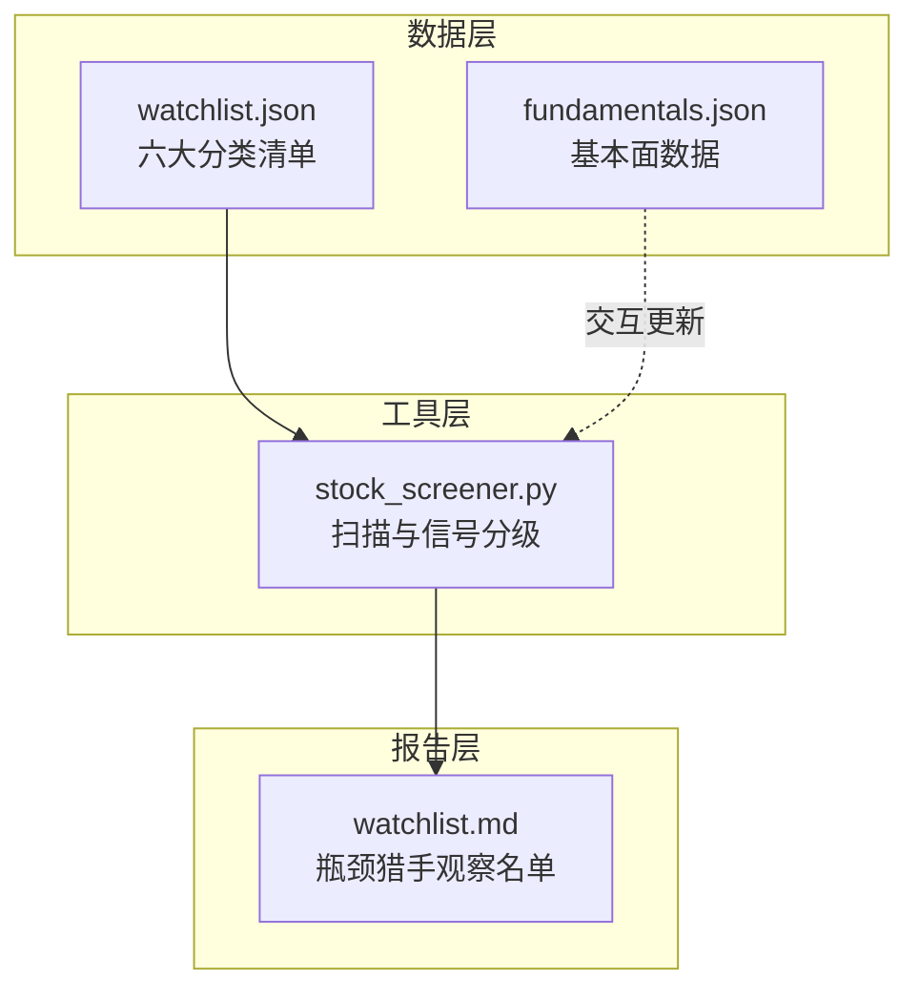
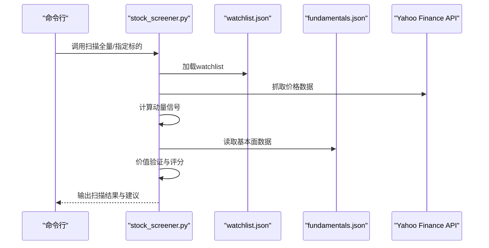
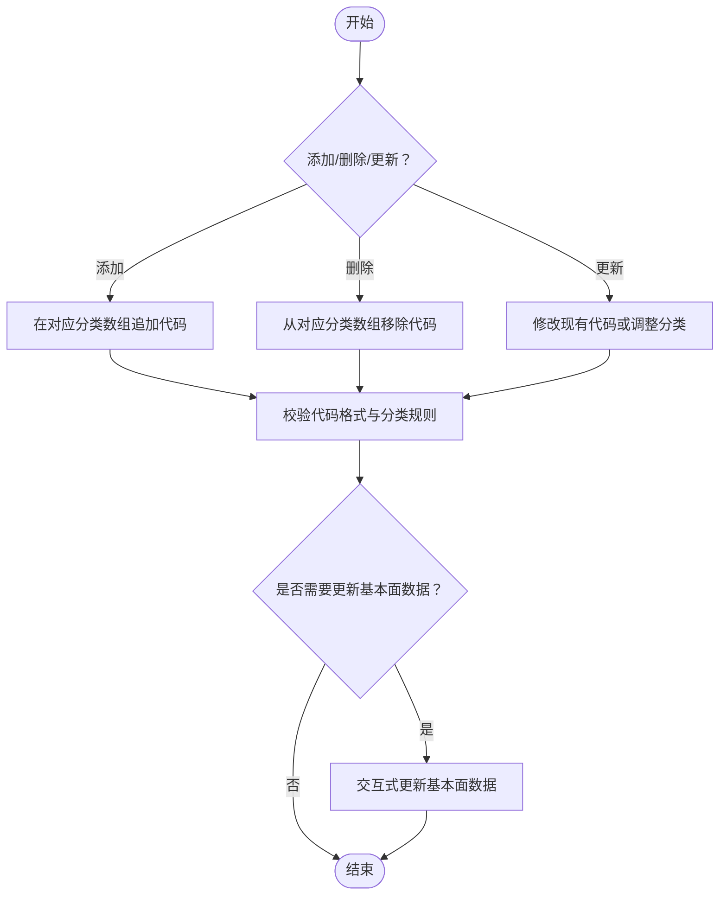
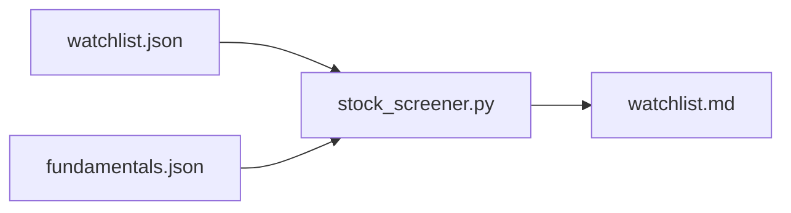

# 监控清单管理

<cite>
**本文引用的文件**
- [watchlist.json](file://data/watchlist.json)
- [stock_screener.py](file://tools/stock_screener.py)
- [watchlist.md](file://reports/bottleneck-map/watchlist.md)
- [README.md](file://README.md)
</cite>

## 目录
1. [简介](#简介)
2. [项目结构](#项目结构)
3. [核心组件](#核心组件)
4. [架构总览](#架构总览)
5. [详细组件分析](#详细组件分析)
6. [依赖分析](#依赖分析)
7. [性能考虑](#性能考虑)
8. [故障排查指南](#故障排查指南)
9. [结论](#结论)
10. [附录](#附录)

## 简介
本文件面向AI Berkshire的监控清单管理系统，围绕data/watchlist.json的结构设计与使用实践展开，重点说明六大投资领域分类（us_ai_chip、us_ai_app、us_ai_infra、us_crypto、hk_internet、a_share）的管理策略、维护流程与最佳实践，并结合工具层脚本与报告文档，提供添加、删除、更新监控标的的操作指南与更新频率建议。

## 项目结构
- 数据层：监控清单以JSON形式存放于data/watchlist.json，包含六大分类的股票/代码列表。
- 工具层：tools/stock_screener.py负责读取watchlist.json，执行动量发现与价值验证，输出扫描结果。
- 报告层：reports/bottleneck-map/watchlist.md记录“瓶颈猎手观察名单”的持续更新与扫描过程，体现监控清单在实际研究中的使用场景。

图表来源
- [watchlist.json:1-38](file://data/watchlist.json#L1-L38)
- [stock_screener.py:31-42](file://tools/stock_screener.py#L31-L42)
- [watchlist.md:1-7](file://reports/bottleneck-map/watchlist.md#L1-L7)

章节来源
- [watchlist.json:1-38](file://data/watchlist.json#L1-L38)
- [stock_screener.py:31-42](file://tools/stock_screener.py#L31-L42)
- [watchlist.md:1-7](file://reports/bottleneck-map/watchlist.md#L1-L7)

## 核心组件
- 监控清单JSON结构：包含六个键值对，分别代表不同投资领域的标的集合。
- 默认watchlist初始化：当watchlist.json不存在时，工具会根据默认字典创建。
- 基本面数据文件：fundamentals.json用于存储各标的季度财务数据，配合扫描器进行价值验证。
- 扫描器：读取watchlist，抓取价格数据，执行动量与价值验证，输出信号分级与建议仓位。

章节来源
- [watchlist.json:1-38](file://data/watchlist.json#L1-L38)
- [stock_screener.py:31-42](file://tools/stock_screener.py#L31-L42)
- [stock_screener.py:84-116](file://tools/stock_screener.py#L84-L116)
- [stock_screener.py:341-347](file://tools/stock_screener.py#L341-L347)

## 架构总览
监控清单管理的端到端流程如下：工具读取watchlist.json，按需抓取价格数据，执行动量与价值验证，输出汇总结果；同时支持交互式更新基本面数据，便于后续信号分级与建议仓位。

图表来源
- [stock_screener.py:348-375](file://tools/stock_screener.py#L348-L375)
- [stock_screener.py:48-78](file://tools/stock_screener.py#L48-L78)
- [stock_screener.py:167-249](file://tools/stock_screener.py#L167-L249)

章节来源
- [stock_screener.py:348-375](file://tools/stock_screener.py#L348-L375)
- [stock_screener.py:48-78](file://tools/stock_screener.py#L48-L78)
- [stock_screener.py:167-249](file://tools/stock_screener.py#L167-L249)

## 详细组件分析

### watchlist.json结构与字段说明
- 结构：根对象包含六个键，分别为六大投资领域。
- 字段类型：每个键对应数组，数组元素为字符串形式的股票代码或代码标识。
- 示例字段：
  - us_ai_chip：包含多家AI芯片公司代码
  - us_ai_app：包含多家AI应用公司代码
  - us_ai_infra：包含多家AI基础设施公司代码
  - us_crypto：包含多家加密货币相关公司代码
  - hk_internet：包含多家港股互联网公司代码（以.HK结尾）
  - a_share：A股监控清单（当前为空）

章节来源
- [watchlist.json:1-38](file://data/watchlist.json#L1-L38)

### 分类规则与管理策略
- 分类维度：依据投资主题与地域划分，便于统一管理与扫描。
- 管理策略：
  - 统一格式：确保同一分类内的代码格式一致（如港股使用.HK后缀）。
  - 分类独立：各分类独立维护，避免交叉污染。
  - 动态扩展：新增标的时，遵循现有格式规范，保持一致性。
  - 空分类处理：如a_share当前为空，后续可通过维护流程逐步填充。

章节来源
- [watchlist.json:1-38](file://data/watchlist.json#L1-L38)

### 添加、删除与更新监控标的
- 添加标的：
  - 在对应分类数组中追加新的代码字符串。
  - 确保代码格式与现有同类一致（如港股使用.HK后缀）。
  - 如涉及A股，需注意后续数据源适配与维护。
- 删除标的：
  - 从对应分类数组中移除目标代码。
  - 确认扫描器不再对该标的进行动量与价值验证。
- 更新标的：
  - 修改现有代码（如更换代码或调整分类归属）。
  - 交互式更新基本面数据：使用工具的更新模式，按提示输入财报日期、标签、营收同比增速、毛利率、EPS超预期等字段。

图表来源
- [stock_screener.py:98-116](file://tools/stock_screener.py#L98-L116)
- [stock_screener.py:335-339](file://tools/stock_screener.py#L335-L339)

章节来源
- [stock_screener.py:98-116](file://tools/stock_screener.py#L98-L116)
- [stock_screener.py:335-339](file://tools/stock_screener.py#L335-L339)

### 股票代码格式规范
- 美股：使用标准代码（如GOOG、NVDA）
- 港股：使用.HK后缀（如0700.HK、9888.HK）
- A股：当前watchlist中未包含，后续维护时需遵循相应格式与数据源要求

章节来源
- [watchlist.json:31-36](file://data/watchlist.json#L31-L36)

### 监控清单的使用场景
- 动量发现与价值验证：扫描器基于watchlist执行动量与价值验证，输出买入/观察/通过等信号分级与建议仓位。
- 研究辅助：结合报告层的“瓶颈猎手观察名单”，在实际研究中持续跟踪与更新监控标的。
- 组合管理：通过基本面数据与信号分级，为组合管理与再平衡提供参考。

章节来源
- [stock_screener.py:256-277](file://tools/stock_screener.py#L256-L277)
- [watchlist.md:1-7](file://reports/bottleneck-map/watchlist.md#L1-L7)

### 更新频率建议
- watchlist维护：建议按月或按季度回顾与调整，结合市场变化与研究进展。
- 基本面数据更新：建议在财报发布后及时更新，确保价值验证的时效性。
- 扫描频率：可根据个人偏好设置，如每日扫描或每周扫描，以便及时捕捉动量信号。

章节来源
- [stock_screener.py:358-375](file://tools/stock_screener.py#L358-L375)
- [stock_screener.py:98-116](file://tools/stock_screener.py#L98-L116)

### 最佳实践指南
- 一致性：保持同一分类内的代码格式一致，避免混用不同后缀或命名风格。
- 数据完整性：确保基本面数据完整且准确，特别是营收同比增速、毛利率、EPS超预期等关键指标。
- 信号分级：结合动量与价值验证结果，合理分配仓位，避免单一信号误导。
- 文档化：将watchlist的维护与更新过程文档化，便于团队协作与知识传承。

章节来源
- [stock_screener.py:256-277](file://tools/stock_screener.py#L256-L277)
- [stock_screener.py:167-249](file://tools/stock_screener.py#L167-L249)

## 依赖分析
- watchlist.json与stock_screener.py的耦合：扫描器通过常量路径读取watchlist.json，若文件缺失则按默认字典创建。
- fundamentals.json与扫描器的耦合：扫描器读取fundamentals.json进行价值验证，交互式更新功能支持补充/修改基本面数据。
- 报告层与工具层的耦合：watchlist.md记录扫描过程与观察名单，为监控清单的实际使用提供参考。

图表来源
- [stock_screener.py:31-33](file://tools/stock_screener.py#L31-L33)
- [stock_screener.py:341-347](file://tools/stock_screener.py#L341-L347)
- [watchlist.md:1-7](file://reports/bottleneck-map/watchlist.md#L1-L7)

章节来源
- [stock_screener.py:31-33](file://tools/stock_screener.py#L31-L33)
- [stock_screener.py:341-347](file://tools/stock_screener.py#L341-L347)
- [watchlist.md:1-7](file://reports/bottleneck-map/watchlist.md#L1-L7)

## 性能考虑
- 数据抓取：扫描器通过外部API抓取价格数据，需注意网络延迟与超时处理。
- 本地文件IO：watchlist.json与fundamentals.json的读写操作较为轻量，但在大规模扫描时仍需关注IO性能。
- 信号计算：动量与价值验证的计算复杂度较低，适合在本地执行。

## 故障排查指南
- watchlist.json缺失：扫描器会在启动时自动创建默认watchlist，确保工具可用。
- 基本面数据缺失：当某标的缺少基本面数据时，扫描器会提示“动量触发但无基本面数据”，建议使用交互式更新功能补充。
- 代码格式错误：若代码格式不符合规范（如港股未使用.HK后缀），可能导致扫描失败或数据异常，需按规范修正。

章节来源
- [stock_screener.py:341-347](file://tools/stock_screener.py#L341-L347)
- [stock_screener.py:335-339](file://tools/stock_screener.py#L335-L339)
- [stock_screener.py:286-289](file://tools/stock_screener.py#L286-L289)

## 结论
AI Berkshire的监控清单管理以watchlist.json为核心，结合stock_screener.py的扫描与价值验证能力，形成了从“清单维护—数据抓取—信号生成—报告输出”的完整闭环。通过统一的分类规则、严格的代码格式规范与交互式基本面数据更新，能够有效支撑研究与组合管理实践。建议定期回顾与更新watchlist，及时补充基本面数据，以提升信号质量与决策效率。

## 附录
- 相关技能与工具：README中提供了完整的技能与工具清单，可作为监控清单管理的补充参考。

章节来源
- [README.md:1-627](file://README.md#L1-L627)