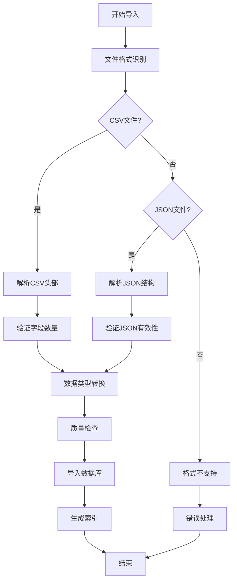
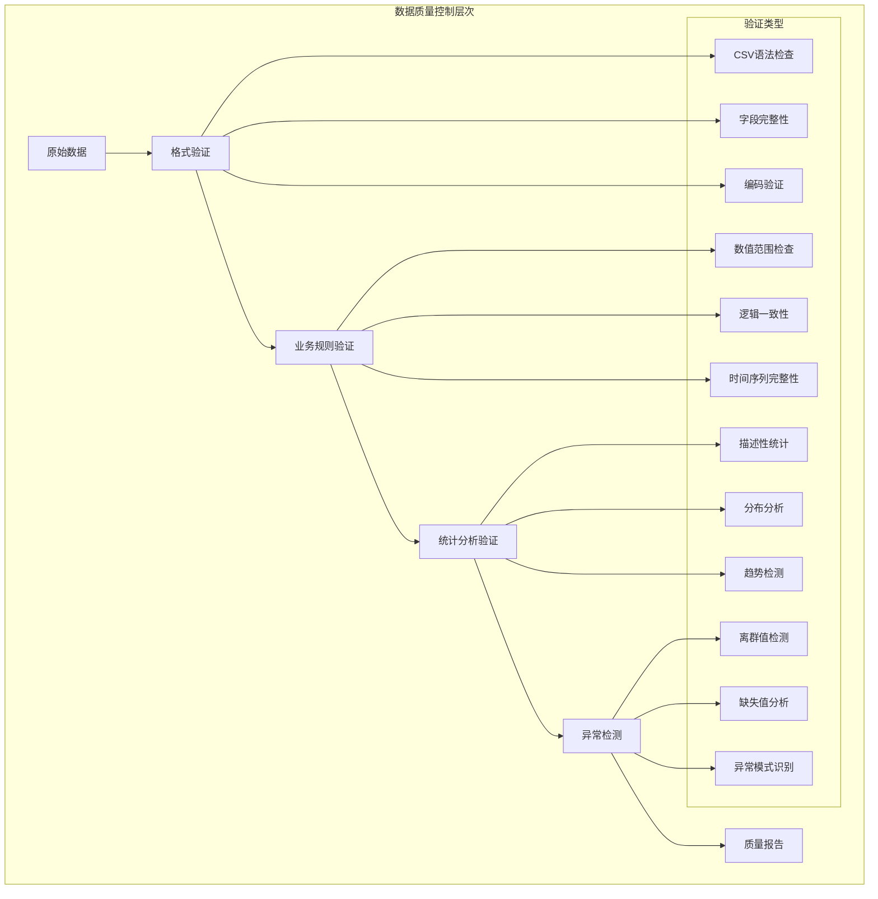
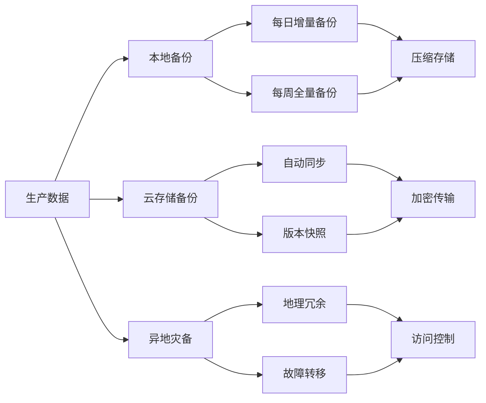
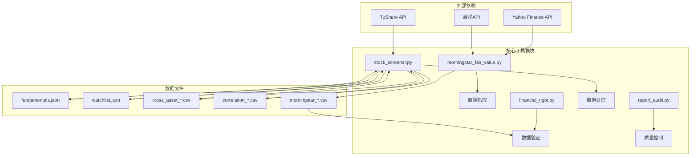

# 研究数据文件管理

<cite>
**本文档引用的文件**
- [correlation_3stocks_2021-2026.csv](file://data/correlation_3stocks_2021-2026.csv)
- [cross_asset_10y_2016-2026.csv](file://data/cross_asset_10y_2016-2026.csv)
- [morningstar_fair_value_20260519.csv](file://data/morningstar_fair_value_20260519.csv)
- [fundamentals.json](file://data/fundamentals.json)
- [watchlist.json](file://data/watchlist.json)
- [morningstar_fair_value.py](file://tools/morningstar_fair_value.py)
- [financial_rigor.py](file://tools/financial_rigor.py)
- [stock_screener.py](file://tools/stock_screener.py)
- [report_audit.py](file://tools/report_audit.py)
</cite>

## 目录
1. [项目概述](#项目概述)
2. [数据文件结构设计](#数据文件结构设计)
3. [命名规范与版本管理](#命名规范与版本管理)
4. [导入导出流程](#导入导出流程)
5. [格式验证机制](#格式验证机制)
6. [数据质量控制](#数据质量控制)
7. [版本管理策略](#版本管理策略)
8. [备份恢复方案](#备份恢复方案)
9. [迁移指南](#迁移指南)
10. [使用场景与分析方法](#使用场景与分析方法)
11. [依赖关系分析](#依赖关系分析)
12. [性能考虑](#性能考虑)
13. [故障排除指南](#故障排除指南)
14. [结论](#结论)

## 项目概述

AI Berkshire研究数据文件管理系统是一个基于Python的自动化数据处理框架，专门用于管理和分析投资研究相关的数据文件。该系统包含多种类型的数据文件，从CSV格式的相关性分析数据到JSON格式的基本面数据，以及通过爬虫工具自动生成的晨星公平价值数据。

系统的核心功能包括：
- 自动化数据采集和处理
- 多层次的数据验证机制
- 标准化的数据格式规范
- 完善的质量控制流程
- 版本管理和备份恢复

## 数据文件结构设计

### CSV格式数据文件

#### 相关性分析数据文件
相关性分析数据文件采用标准化的CSV格式，包含以下特征：

**文件结构特点：**
- 第一行为表头，包含日期和各股票代码
- 数据按周频展示，覆盖2021-2026年的完整周期
- 每行代表特定日期各股票的价格数据
- 支持多股票间的相关性分析

**数据组织方式：**
```
date,TENCENT,MEITUAN,PDD
2021-05-03,553.1139,282.8000,133.7900
2021-05-10,537.4423,244.0000,118.3300
```

#### 跨资产10年期数据文件
跨资产10年期数据文件提供了更广泛的投资组合分析能力：

**文件结构特点：**
- 时间跨度覆盖2016-2026年，总计10年数据
- 包含10个不同资产类别：腾讯、苹果、微软、谷歌、亚马逊、Meta、英伟达、特斯拉、茅台、李宁
- 支持跨资产类别的相关性和轮动分析
- 适用于构建多元化投资组合的研究

**数据覆盖范围：**
- 资产类别：科技股、传统能源、消费品、金融、新能源等
- 地区分布：美国、中国、欧洲等主要市场
- 时间频率：日频数据，确保足够的统计显著性

#### 晨星公平价值数据文件
晨星公平价值数据文件采用详细的CSV格式，包含完整的估值分析信息：

**字段定义：**
- `rank`: 排名
- `ticker`: 股票代码
- `name`: 公司名称
- `close_price`: 当前股价
- `fair_value`: 公平价值
- `upside_pct`: 潜在上涨幅度
- `star_rating`: 星级评级
- `moat`: 护城河类型
- `uncertainty`: 估值不确定性
- `sector`: 行业板块
- `industry`: 具体行业

### JSON格式数据文件

#### 基本面数据文件
基本面数据文件采用JSON格式，便于程序化处理和扩展：

**数据结构：**
```json
{
  "NVDA": {
    "quarters": {
      "2023-02-22": {"label": "FY23Q4(Jan23)", "rev_yoy": -21.0, "gm": 63.3, "eps_beat": 10.0}
    }
  }
}
```

**字段含义：**
- `label`: 财报期间标签
- `rev_yoy`: 营收同比增长率
- `gm`: 毛利率
- `eps_beat`: EPS超出预期百分比

#### Watchlist数据文件
Watchlist文件定义了投资组合的分类和管理：

**分类结构：**
- `us_ai_chip`: 美国AI芯片板块
- `us_ai_app`: 美国AI应用板块  
- `us_ai_infra`: 美国AI基础设施板块
- `us_crypto`: 美国加密货币板块
- `hk_internet`: 港股互联网板块
- `a_share`: A股板块

## 命名规范与版本管理

### 文件命名约定

**CSV文件命名规则：**
- 相关性分析：`correlation_[stocks]_[start_year]-[end_year].csv`
- 跨资产数据：`cross_asset_[timeframe]_[start_year]-[end_year].csv`
- 晨星数据：`morningstar_fair_value_[yyyymmdd].csv`

**JSON文件命名规则：**
- 基本面数据：`fundamentals.json`
- Watchlist数据：`watchlist.json`
- A股数据：`a_share_fundamentals.json`

### 版本管理策略

**时间戳版本控制：**
- 自动生成YYYYMMDD格式的时间戳
- 确保每次数据更新都有唯一标识
- 支持历史版本追溯和比较

**数据完整性检查：**
- 文件大小验证
- 字段数量一致性检查
- 数据范围合理性验证

## 导入导出流程

### 数据导入流程



**图表来源**
- [morningstar_fair_value.py](file://tools/morningstar_fair_value.py)
- [stock_screener.py](file://tools/stock_screener.py)

### 数据导出流程

**批量导出机制：**
- 支持按时间范围导出
- 支持按资产类别筛选
- 支持多格式转换（CSV/JSON）

**导出优化：**
- 分批处理大数据集
- 内存使用监控
- 错误恢复机制

## 格式验证机制

### 数据格式验证

**CSV格式验证：**
- 字段分隔符检查（逗号分隔）
- 引号包裹规则验证
- 编码格式统一（UTF-8）
- 行长度限制检查

**JSON格式验证：**
- 语法结构检查
- 数据类型一致性
- 字段完整性验证
- 嵌套结构深度限制

### 业务规则验证

**数值范围验证：**
- 股价数据范围检查（>0）
- 百分比数据范围检查（-100%到100%）
- 财务比率合理性检查

**时间序列验证：**
- 日期顺序验证
- 缺失数据检测
- 重复数据识别

### 自动化验证工具

**financial_rigor.py提供的验证功能：**
- 市值计算准确性验证
- 估值指标一致性检查
- 多源数据交叉验证
- Benford定律财务数据真实性检测

## 数据质量控制

### 多层次质量控制体系



**图表来源**
- [financial_rigor.py](file://tools/financial_rigor.py)
- [report_audit.py](file://tools/report_audit.py)

### 质量控制指标

**数据完整性指标：**
- 字段填充率
- 记录完整率
- 时间序列覆盖率

**数据准确性指标：**
- 重复记录率
- 异常值比例
- 逻辑错误率

**数据一致性指标：**
- 跨文件一致性
- 时间序列连续性
- 业务规则满足度

## 版本管理策略

### Git集成版本控制

**分支管理策略：**
- `main`: 生产环境稳定版本
- `develop`: 开发环境测试版本
- `feature/*`: 功能开发分支
- `hotfix/*`: 紧急修复分支

**提交规范：**
- 类型前缀：feat, fix, docs, style, refactor, test, chore
- 描述清晰具体，包含相关Issue编号
- 代码审查强制要求

### 数据版本管理

**数据文件版本控制：**
- 使用Git LFS管理大型CSV文件
- 保留历史版本以便回溯分析
- 自动化版本标签生成

**配置文件版本管理：**
- 环境变量分离
- 配置文件模板化
- 敏感信息加密存储

## 备份恢复方案

### 多层备份策略



**图表来源**
- [morningstar_fair_value.py](file://tools/morningstar_fair_value.py)
- [stock_screener.py](file://tools/stock_screener.py)

### 恢复流程

**快速恢复流程：**
1. 检测数据损坏或丢失
2. 选择最近可用备份
3. 验证备份完整性
4. 执行数据恢复
5. 验证恢复数据准确性
6. 更新系统状态

**灾难恢复计划：**
- RTO（恢复时间目标）：≤4小时
- RPO（恢复点目标）：≤15分钟
- 多地域部署策略
- 自动故障转移机制

## 迁移指南

### 数据迁移策略

**渐进式迁移：**
- 先迁移非关键数据
- 验证迁移准确性后再迁移关键数据
- 保持新旧系统并行运行一段时间

**迁移验证：**
- 数据完整性检查
- 业务逻辑一致性验证
- 性能影响评估

### 工具链迁移

**Python依赖管理：**
- 使用requirements.txt管理依赖
- Docker容器化部署
- 环境隔离和版本锁定

**配置迁移：**
- 环境变量配置
- 数据库连接配置
- API密钥管理

## 使用场景与分析方法

### 相关性分析应用场景

**多股票相关性分析：**
- 构建投资组合时的风险分散策略
- 股票选择的辅助指标
- 市场时机判断的参考因素

**跨资产轮动分析：**
- 不同资产类别间的相关性变化
- 经济周期下的资产配置策略
- 风险预算分配的依据

### 价值投资分析方法

**晨星公平价值分析：**
- 基于内在价值的投资决策
- 安全边际计算和验证
- 长期持有策略的支撑数据

**基本面数据分析：**
- 营收增长趋势分析
- 毛利率变化趋势
- EPS超预期情况跟踪

### 质量控制应用场景

**研究报告数据验证：**
- 报告中财务数据的准确性检查
- 多来源数据的一致性验证
- 数据录入错误的早期发现

**投资决策支持：**
- 动量信号与价值信号的结合
- 多维度数据验证提升决策质量
- 风险控制指标的实时监控

## 依赖关系分析

### 核心依赖关系



**图表来源**
- [morningstar_fair_value.py](file://tools/morningstar_fair_value.py)
- [stock_screener.py](file://tools/stock_screener.py)
- [financial_rigor.py](file://tools/financial_rigor.py)
- [report_audit.py](file://tools/report_audit.py)

### 数据流依赖

**数据采集依赖：**
- 网络API访问权限
- 数据格式解析能力
- 错误处理和重试机制

**数据处理依赖：**
- Python标准库功能
- JSON解析和生成
- CSV文件读写

**数据验证依赖：**
- 数学计算精度保证
- 统计分析算法
- 业务规则引擎

## 性能考虑

### 数据处理性能优化

**内存管理优化：**
- 分批处理大数据集
- 及时释放不需要的对象
- 使用生成器减少内存占用

**计算性能优化：**
- 向量化操作优先
- 缓存常用计算结果
- 并行处理可并行任务

**I/O性能优化：**
- 批量文件读写
- 压缩数据存储
- 索引优化查询

### 系统性能监控

**关键性能指标：**
- 数据处理吞吐量
- 内存使用峰值
- 磁盘I/O速度
- 网络请求延迟

**性能调优策略：**
- 定期性能基准测试
- 异常性能监控告警
- 自动化性能回归检测

## 故障排除指南

### 常见问题诊断

**数据获取问题：**
- API访问失败：检查网络连接和API密钥
- 数据格式错误：验证数据源的稳定性
- 超时问题：增加重试机制和超时设置

**数据处理问题：**
- 内存不足：启用分批处理和垃圾回收
- 编码错误：统一使用UTF-8编码
- 数据类型错误：添加类型转换和验证

**验证失败问题：**
- 格式验证失败：检查数据格式规范
- 业务规则失败：验证数据逻辑正确性
- 性能问题：优化算法和数据结构

### 错误恢复机制

**自动恢复策略：**
- 失败重试机制
- 数据完整性检查
- 错误日志记录和分析

**手动干预流程：**
- 问题定位和分析
- 手动数据修复
- 系统状态恢复

## 结论

AI Berkshire研究数据文件管理系统通过标准化的数据格式、完善的验证机制和严格的质量控制，为投资研究提供了可靠的数据基础。系统的模块化设计使得各个组件可以独立维护和升级，同时保持整体功能的协调一致。

**核心优势：**
- 标准化的数据格式和命名规范
- 多层次的质量控制和验证机制
- 完善的版本管理和备份恢复
- 灵活的使用场景和分析方法

**未来发展：**
- 扩展更多数据源和分析维度
- 增强机器学习和AI分析能力
- 优化用户体验和自动化程度
- 加强安全性防护和合规管理

该系统为AI Berkshire的投资研究提供了坚实的数据基础设施，支持从基础数据管理到高级分析应用的全方位需求。