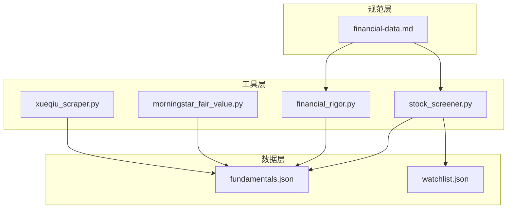
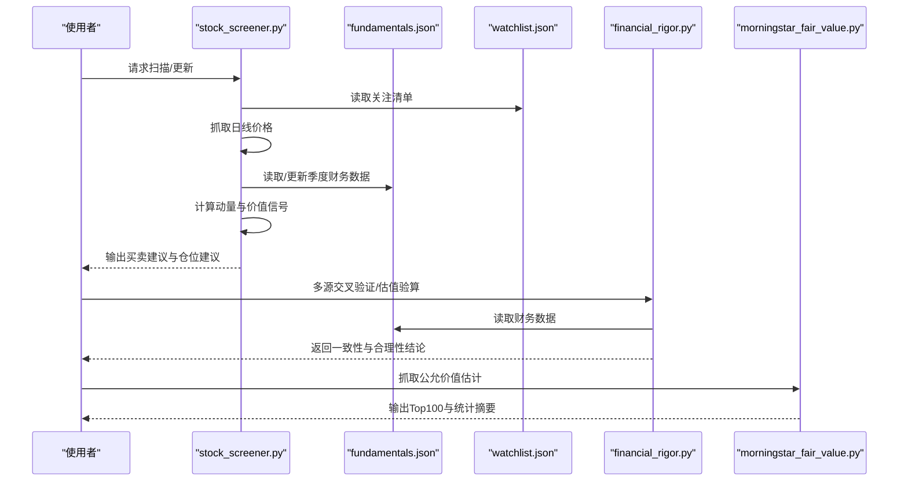
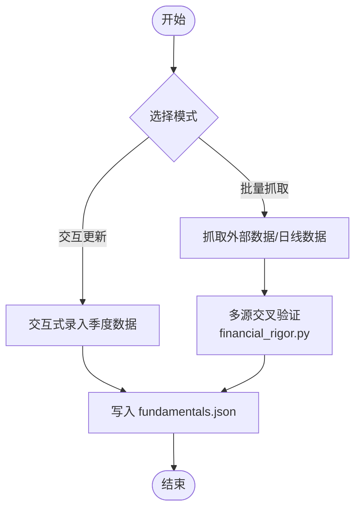
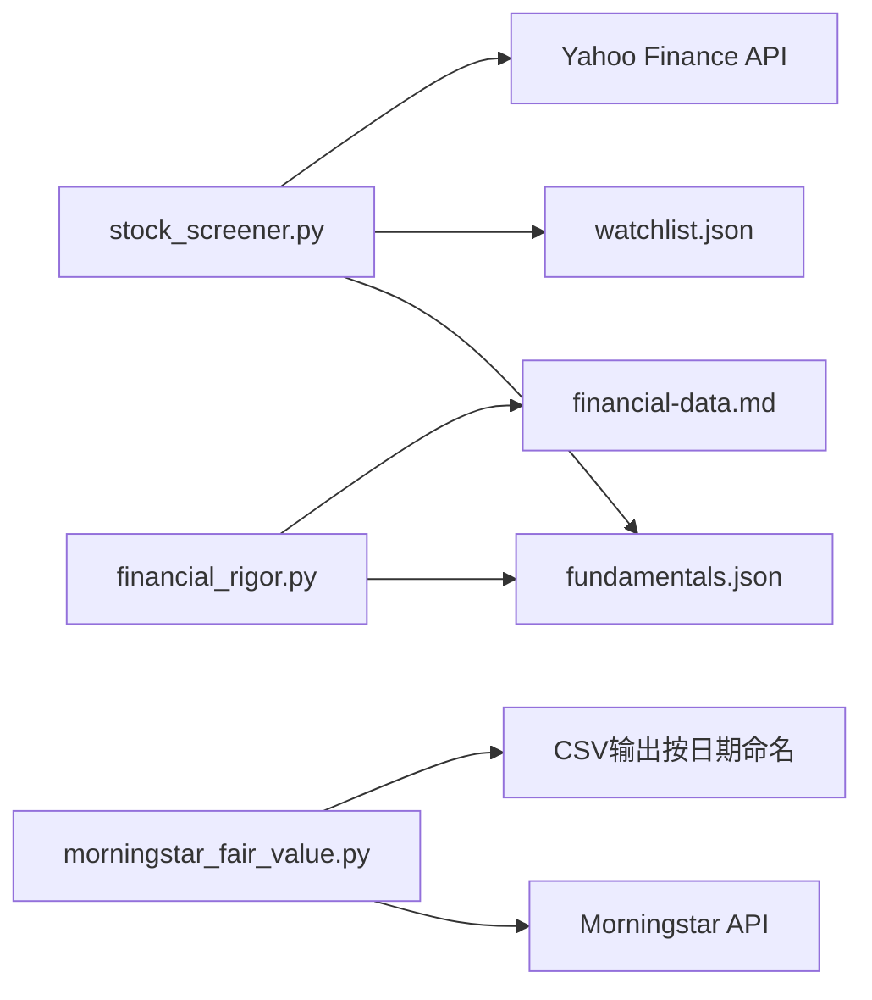

# 财务数据存储

<cite>
**本文引用的文件**
- [data/fundamentals.json](file://data/fundamentals.json)
- [data/watchlist.json](file://data/watchlist.json)
- [skills/financial-data.md](file://skills/financial-data.md)
- [tools/financial_rigor.py](file://tools/financial_rigor.py)
- [tools/stock_screener.py](file://tools/stock_screener.py)
- [tools/morningstar_fair_value.py](file://tools/morningstar_fair_value.py)
- [tools/xueqiu_scraper.py](file://tools/xueqiu_scraper.py)
</cite>

## 目录
1. [简介](#简介)
2. [项目结构](#项目结构)
3. [核心组件](#核心组件)
4. [架构总览](#架构总览)
5. [详细组件分析](#详细组件分析)
6. [依赖关系分析](#依赖关系分析)
7. [性能考量](#性能考量)
8. [故障排查指南](#故障排查指南)
9. [结论](#结论)
10. [附录](#附录)

## 简介
本文件面向AI Berkshire的财务数据存储系统，围绕fundamentals.json的结构设计、数据组织方式、采集与验证流程、存储优化、备份与恢复、数据完整性保障以及查询接口与使用示例进行系统化说明。文档旨在帮助使用者快速理解数据模型、掌握更新与校验方法，并在实际投研工作中高效、可靠地利用财务数据。

## 项目结构
财务数据存储相关的核心文件与职责如下：
- data/fundamentals.json：核心财务指标JSON文件，按股票代码组织季度财务数据。
- data/watchlist.json：自定义关注清单，按板块分组维护标的列表。
- tools/stock_screener.py：基于基本面数据的动量与价值信号扫描工具，负责读取与更新fundamentals.json。
- tools/financial_rigor.py：金融严谨性验证工具，支持多源交叉验证、估值指标验算、Benford检测等。
- tools/morningstar_fair_value.py：从Morningstar筛选器API抓取公允价值估计并输出Top100。
- skills/financial-data.md：财务数据获取与交叉验证规范，明确数据源优先级、误差计算与呈现格式。

图表来源
- [data/fundamentals.json](file://data/fundamentals.json)
- [data/watchlist.json](file://data/watchlist.json)
- [tools/stock_screener.py](file://tools/stock_screener.py)
- [tools/financial_rigor.py](file://tools/financial_rigor.py)
- [tools/morningstar_fair_value.py](file://tools/morningstar_fair_value.py)
- [tools/xueqiu_scraper.py](file://tools/xueqiu_scraper.py)
- [skills/financial-data.md](file://skills/financial-data.md)

章节来源
- [data/fundamentals.json](file://data/fundamentals.json)
- [data/watchlist.json](file://data/watchlist.json)
- [tools/stock_screener.py](file://tools/stock_screener.py)
- [tools/financial_rigor.py](file://tools/financial_rigor.py)
- [tools/morningstar_fair_value.py](file://tools/morningstar_fair_value.py)
- [tools/xueqiu_scraper.py](file://tools/xueqiu_scraper.py)
- [skills/financial-data.md](file://skills/financial-data.md)

## 核心组件
- fundamentals.json：以股票代码为键，每个键下包含quarters对象，quarters以财报发布日期为键，存储当季财务指标（如标签、营收同比、毛利率、EPS超预期等）。该结构便于按时间序列检索与比较。
- watchlist.json：按板块分组维护标的列表，作为扫描与筛选的输入集合。
- stock_screener.py：负责加载fundamentals.json、抓取日线价格、计算动量与价值信号，并输出买卖建议与仓位建议。
- financial_rigor.py：提供多源交叉验证、估值指标验算、Benford检测等能力，确保数据一致性与合理性。
- morningstar_fair_value.py：抓取Morningstar公允价值估计，计算潜在涨幅并输出Top100，辅助外部视角校验。
- financial-data.md：定义数据源优先级、误差计算规则与呈现格式，是数据采集与校验的权威规范。

章节来源
- [data/fundamentals.json](file://data/fundamentals.json)
- [data/watchlist.json](file://data/watchlist.json)
- [tools/stock_screener.py](file://tools/stock_screener.py)
- [tools/financial_rigor.py](file://tools/financial_rigor.py)
- [tools/morningstar_fair_value.py](file://tools/morningstar_fair_value.py)
- [skills/financial-data.md](file://skills/financial-data.md)

## 架构总览
财务数据存储系统由“数据文件 + 工具脚本 + 规范”构成，形成“采集—校验—存储—查询—输出”的闭环。

图表来源
- [tools/stock_screener.py](file://tools/stock_screener.py)
- [tools/financial_rigor.py](file://tools/financial_rigor.py)
- [tools/morningstar_fair_value.py](file://tools/morningstar_fair_value.py)
- [data/fundamentals.json](file://data/fundamentals.json)
- [data/watchlist.json](file://data/watchlist.json)

## 详细组件分析

### fundamentals.json 数据模型与组织
- 层级结构
  - 顶层键：股票代码（如“NVDA”、“AMD”、“MU”）
  - 每个股票对象包含：
    - quarters：以“YYYY-MM-DD”形式表示财报发布日的季度数据映射
    - 每个季度对象包含：
      - label：季度标签（如“FY25Q3(Oct24)”）
      - rev_yoy：营收同比增长率（百分比）
      - gm：毛利率（百分比）
      - eps_beat：EPS超预期幅度（百分比）

- 时间序列与查询
  - 通过quarters按键排序可实现时间序列遍历
  - 查询最近两季数据用于趋势分析与评分
  - 通过输入日期限定信号日期，实现“信号日之前”的最新季度匹配

- 存储优化
  - 使用紧凑的键值结构，避免冗余字段
  - 以日期字符串作为键，天然有序，便于排序与范围查询
  - 仅存储必要指标，降低体积与解析成本

- 版本与兼容
  - 采用纯JSON格式，无额外版本字段
  - 通过新增键（如新增指标）保持向后兼容
  - 若需引入版本控制，可在顶层添加version字段并在工具中校验

章节来源
- [data/fundamentals.json](file://data/fundamentals.json)
- [tools/stock_screener.py](file://tools/stock_screener.py)

### 数据采集与更新流程
- 交互式更新
  - 使用stock_screener.py的更新模式，交互式录入财报发布日、标签、营收同比、毛利率、EPS超预期等字段，自动保存至fundamentals.json
- 批量抓取与整合
  - financial_rigor.py提供多源交叉验证能力，结合financial-data.md规范，确保数据一致性
  - morningstar_fair_value.py抓取外部公允价值估计，辅助外部视角校验

图表来源
- [tools/stock_screener.py](file://tools/stock_screener.py)
- [tools/financial_rigor.py](file://tools/financial_rigor.py)
- [skills/financial-data.md](file://skills/financial-data.md)

章节来源
- [tools/stock_screener.py](file://tools/stock_screener.py)
- [tools/financial_rigor.py](file://tools/financial_rigor.py)
- [skills/financial-data.md](file://skills/financial-data.md)

### 数据验证规则与存储优化
- 交叉验证
  - 多源数据对比，计算与中位数的偏差，设定容差阈值（默认2%）
  - 对于重大差异（>5%），要求核查原始财报
- 估值指标验算
  - 支持PE、PB、ROE、P/FCF、股息率、PS等指标的精确计算
  - 使用十进制避免浮点误差
- Benford检测
  - 通过首数字分布检测财务数据异常，辅助识别潜在操纵
- 存储优化
  - 仅保留关键指标，减少冗余
  - 使用紧凑键名与日期字符串键，提升解析效率

章节来源
- [tools/financial_rigor.py](file://tools/financial_rigor.py)
- [skills/financial-data.md](file://skills/financial-data.md)

### 查询接口与使用示例
- 基础查询
  - 读取某股票的全部季度数据：加载fundamentals.json，定位对应股票键，遍历quarters
  - 获取最近两季数据：按日期排序取最后两项
- 信号计算
  - 使用stock_screener.py扫描：提供动量与价值信号，输出买卖等级与仓位建议
  - 示例命令：
    - 扫描全部关注清单：python3 tools/stock_screener.py
    - 扫描指定标的：python3 tools/stock_screener.py NVDA TSLA GOOG
    - 更新某标的季度数据：python3 tools/stock_screener.py --update MU
- 外部校验
  - 多源交叉验证：python3 tools/financial_rigor.py cross-validate --field revenue --values '{"年报": 7518, "Yahoo": 7500}' --unit 亿
  - 估值指标验算：python3 tools/financial_rigor.py verify-valuation --price 510 --eps 23.5 --bvps 120
  - Benford检测：python3 tools/financial_rigor.py benford --values '[1234, 2345, 3456, ...]'

章节来源
- [tools/stock_screener.py](file://tools/stock_screener.py)
- [tools/financial_rigor.py](file://tools/financial_rigor.py)

## 依赖关系分析
- stock_screener.py依赖
  - data/fundamentals.json：读取与更新季度财务数据
  - data/watchlist.json：读取关注清单
  - 外部API：Yahoo Finance日线数据抓取
- financial_rigor.py依赖
  - data/fundamentals.json：读取财务数据进行交叉验证与指标验算
  - 内置规范：基于financial-data.md的误差计算与呈现格式
- morningstar_fair_value.py依赖
  - 外部API：Morningstar筛选器API
  - 输出：CSV文件（按日期命名），便于归档与审计

图表来源
- [tools/stock_screener.py](file://tools/stock_screener.py)
- [tools/financial_rigor.py](file://tools/financial_rigor.py)
- [tools/morningstar_fair_value.py](file://tools/morningstar_fair_value.py)
- [data/fundamentals.json](file://data/fundamentals.json)
- [data/watchlist.json](file://data/watchlist.json)
- [skills/financial-data.md](file://skills/financial-data.md)

章节来源
- [tools/stock_screener.py](file://tools/stock_screener.py)
- [tools/financial_rigor.py](file://tools/financial_rigor.py)
- [tools/morningstar_fair_value.py](file://tools/morningstar_fair_value.py)
- [data/fundamentals.json](file://data/fundamentals.json)
- [data/watchlist.json](file://data/watchlist.json)
- [skills/financial-data.md](file://skills/financial-data.md)

## 性能考量
- 文件大小与解析
  - fundamentals.json体量较小，解析成本低；建议定期压缩归档，避免频繁I/O
- 网络请求
  - Yahoo Finance与Morningstar均为远程API，注意超时与重试策略；合理设置并发与延时
- 计算复杂度
  - 信号计算主要为线性扫描与简单统计，时间复杂度低；建议在批处理时合并请求
- 存储布局
  - 以日期为键的quarters结构天然有序，适合范围查询；如需高频随机访问，可考虑构建二级索引

## 故障排查指南
- fundamentals.json读取失败
  - 检查文件是否存在与权限
  - 确认JSON格式正确，无多余逗号或注释
- 数据缺失或为空
  - 确认stock_screener.py是否已执行更新模式
  - 检查watchlist.json中的标的是否正确
- 信号输出异常
  - 确认日线数据抓取成功（Yahoo Finance返回有效数据）
  - 检查quarters中是否存在最新季度数据
- 多源交叉验证差异
  - 按financial-data.md核对误差计算与呈现格式
  - 对于重大差异，优先核查原始财报（10-K/年报PDF）
- 外部API失败
  - 检查网络连通性与超时设置
  - 适当增加延时与重试次数

章节来源
- [tools/stock_screener.py](file://tools/stock_screener.py)
- [tools/financial_rigor.py](file://tools/financial_rigor.py)
- [skills/financial-data.md](file://skills/financial-data.md)

## 结论
fundamentals.json以简洁而清晰的结构承载了季度财务关键指标，配合stock_screener.py与financial_rigor.py实现了从采集、校验到查询与输出的完整链路。通过watchlist.json与外部Morningstar数据的协同，系统在保证数据一致性的同时，提供了灵活的扩展与审计能力。建议在现有基础上完善版本控制、备份与恢复策略，并持续优化查询与可视化接口，以满足更复杂的投研需求。

## 附录
- 数据备份策略
  - 建议每日定时备份fundamentals.json与watchlist.json，保留历史版本
  - 外部抓取的CSV文件按日期命名，便于归档与检索
- 恢复流程
  - 从备份目录复制历史版本覆盖当前文件
  - 验证JSON格式与关键字段完整性
- 数据完整性保证
  - 引入版本字段与校验和（如SHA256）以检测篡改
  - 对关键字段建立最小/最大值约束与类型校验
  - 定期执行Benford检测与交叉验证，及时发现异常