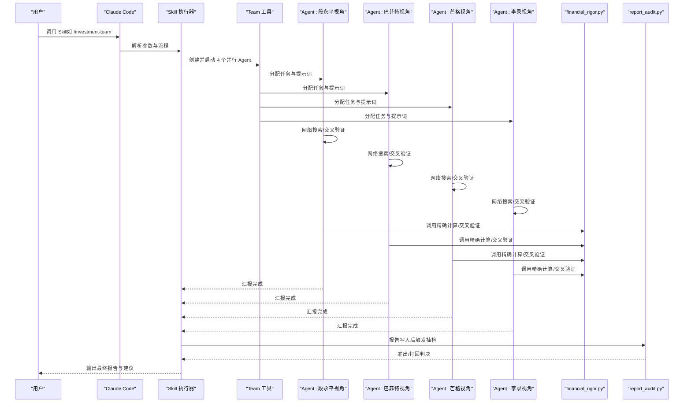
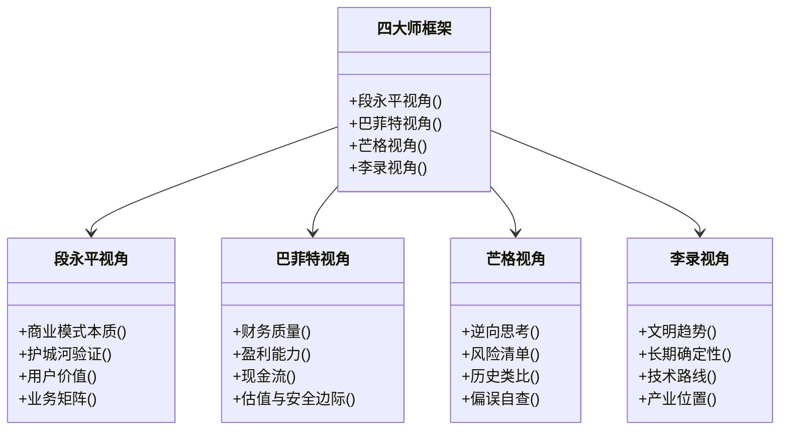
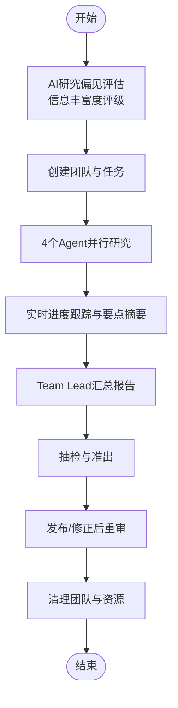
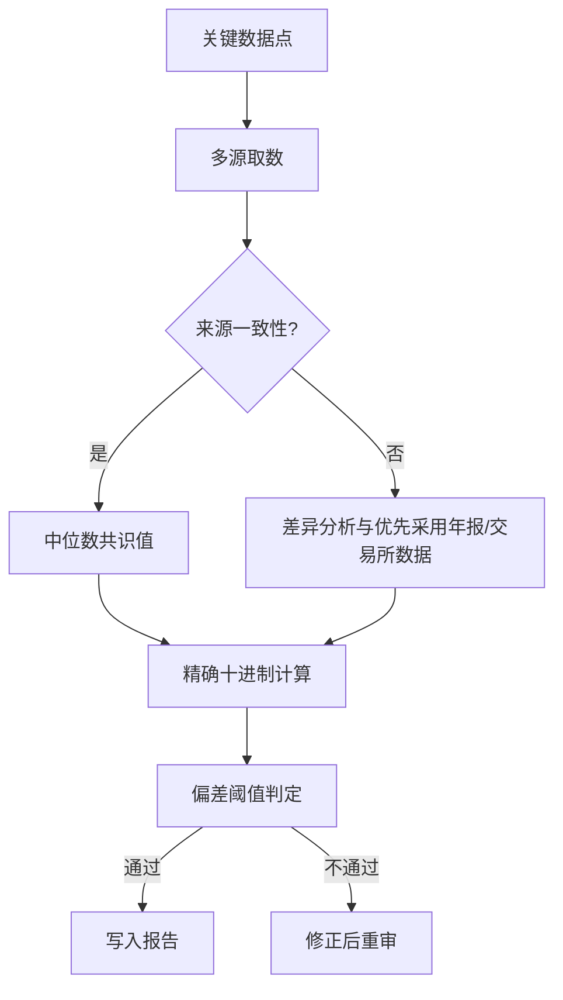
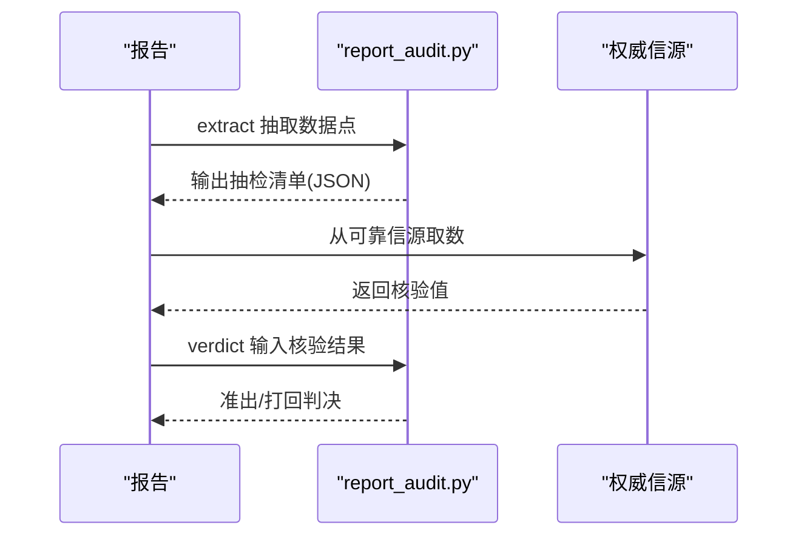
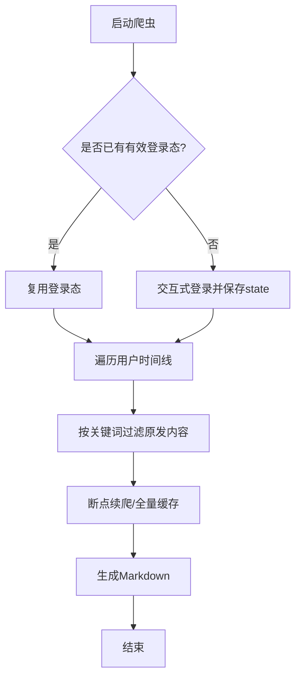
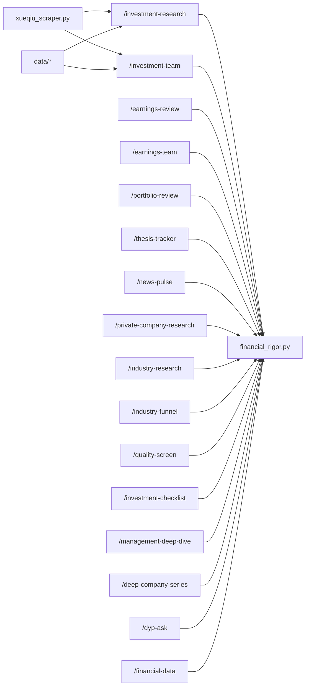

# 项目概述

<cite>
**本文档引用的文件**
- [CLAUDE.md](file://CLAUDE.md)
- [README.md](file://README.md)
- [investment-team.md](file://skills/investment-team.md)
- [investment-research.md](file://skills/investment-research.md)
- [financial_rigor.py](file://tools/financial_rigor.py)
- [report_audit.py](file://tools/report_audit.py)
- [xueqiu_scraper.py](file://tools/xueqiu_scraper.py)
- [fundamentals.json](file://data/fundamentals.json)
- [watchlist.json](file://data/watchlist.json)
- [morningstar_fair_value_20260519.csv](file://data/morningstar_fair_value_20260519.csv)
</cite>

## 目录
1. [项目简介](#项目简介)
2. [项目结构](#项目结构)
3. [核心组件](#核心组件)
4. [架构总览](#架构总览)
5. [详细组件分析](#详细组件分析)
6. [依赖关系分析](#依赖关系分析)
7. [性能考量](#性能考量)
8. [故障排查指南](#故障排查指南)
9. [结论](#结论)
10. [附录](#附录)

## 项目简介
AI Berkshire 是一套基于 Claude Code 的价值投资研究 Skill 合集，将巴菲特、芒格、段永平、李录四位价值投资大师的方法论系统化、结构化，通过 AI Agent 实现专业级投资研究。项目强调“分析质量与决策纪律”，通过四大师视角对抗、结构化反偏见机制、金融数据精确性、可复现的研究流程与多 Agent 并行，解决“能否分析”之外的“如何做出可执行的决策”。

- **核心价值**：为个人与团队提供“可复现、可交叉验证、可并行加速”的投研流水线，输出“通过/不通过/灰色地带”的明确建议与价格区间。
- **技术实现**：以 Claude Code Skill 为入口，结合内部工具链（金融严谨性、报告抽检、雪球爬虫等）保障数据质量与流程合规。
- **适用对象**：希望系统化提升投研效率与质量的投资者与研究团队。

**章节来源**
- [README.md:1-627](file://README.md#L1-L627)
- [CLAUDE.md:1-112](file://CLAUDE.md#L1-L112)

## 项目结构
项目采用“三层设计哲学”：
- **Skill 层**：16 个明确入口，覆盖深度研究、财报分析、行业筛选、持仓管理、思维工具等场景。
- **Agent 层**：每个 Skill 内部可并行 4 个 Agent，分别代表段永平（商业模式）、巴菲特（财务估值）、芒格（逆向思考）、李录（风险与文明趋势）。
- **工具层**：精确计算、实时检索、报告抽检，确保数据严谨性与可验证性。

```mermaid
graph TB
subgraph "Skill 层"
IR["/investment-research<br/>四大师综合分析"]
IT["/investment-team<br/>多Agent并行团队"]
ER["/earnings-review<br/>财报精读"]
ET["/earnings-team<br/>财报团队解读"]
IRF["/industry-research<br/>产业链全景"]
IF["/industry-funnel<br/>行业漏斗筛选"]
QS["/quality-screen<br/>去劣筛选"]
IC["/investment-checklist<br/>买入前 Checklist"]
PR["/portfolio-review<br/>组合管理"]
TT["/thesis-tracker<br/>论文追踪"]
NP["/news-pulse<br/>股价异动归因"]
DD["/management-deep-dive<br/>管理层纵深研究"]
PC["/private-company-research<br/>未上市公司研究"]
DC["/deep-company-series<br/>系列长文"]
DP["/dyp-ask<br/>段永平问答"]
FD["/financial-data<br/>财务数据规范"]
end
subgraph "Agent 层"
BA["business-analyst<br/>段永平视角"]
FA["financial-analyst<br/>巴菲特视角"]
IA["industry-researcher<br/>芒格视角"]
RA["risk-assessor<br/>李录视角"]
end
subgraph "工具层"
FR["financial_rigor.py<br/>精确计算/交叉验证"]
RAudit["report_audit.py<br/>抽检/准出"]
XS["xueqiu_scraper.py<br/>雪球爬虫"]
DATA["data/*<br/>基础数据集"]
end
IR --> FR
IT --> BA
IT --> FA
IT --> IA
IT --> RA
ER --> FR
ET --> FR
PR --> FR
TT --> FR
NP --> FR
DC --> FR
FD --> FR
RAudit --> IR
RAudit --> IT
XS --> IR
XS --> IT
DATA --> IR
DATA --> IT
```

**图示来源**
- [README.md:154-627](file://README.md#L154-L627)
- [investment-team.md:1-214](file://skills/investment-team.md#L1-L214)
- [investment-research.md:1-263](file://skills/investment-research.md#L1-L263)
- [financial_rigor.py:1-452](file://tools/financial_rigor.py#L1-L452)
- [report_audit.py:1-523](file://tools/report_audit.py#L1-L523)
- [xueqiu_scraper.py:1-434](file://tools/xueqiu_scraper.py#L1-L434)

**章节来源**
- [README.md:154-627](file://README.md#L154-L627)

## 核心组件
- 四大师方法论融合：以段永平“对的生意”、巴菲特“护城河与安全边际”、芒格“逆向思考与风险清单”、李录“文明趋势与长期确定性”为主线，形成互相挑战的分析框架。
- 多 Agent 并行：每个公司由 4 个 Agent 并行研究，独立搜索、独立判断、独立输出，最终由 Team Lead 汇总综合。
- 金融严谨性工具：使用 Python decimal 精确计算，提供市值验算、估值验算、多源交叉验证、Benford 定律检测、三情景估值与精确计算器。
- 报告抽检与准出：从报告中随机抽取 15% 数据点，与权威信源交叉验证，偏差 ≤ 1% 准出，否则打回修正。
- 雪球爬虫：支持登录态复用、断点续爬、反限流策略，按关键词筛选用户原发内容，生成结构化 Markdown。

**章节来源**
- [README.md:544-627](file://README.md#L544-L627)
- [investment-team.md:1-214](file://skills/investment-team.md#L1-L214)
- [investment-research.md:1-263](file://skills/investment-research.md#L1-L263)
- [financial_rigor.py:1-452](file://tools/financial_rigor.py#L1-L452)
- [report_audit.py:1-523](file://tools/report_audit.py#L1-L523)
- [xueqiu_scraper.py:1-434](file://tools/xueqiu_scraper.py#L1-L434)

## 架构总览
下图展示了从用户调用 Skill 到 Agent 并行研究、工具验证与报告抽检的端到端流程：

**图示来源**
- [investment-team.md:34-214](file://skills/investment-team.md#L34-L214)
- [financial_rigor.py:367-452](file://tools/financial_rigor.py#L367-L452)
- [report_audit.py:405-523](file://tools/report_audit.py#L405-L523)

**章节来源**
- [investment-team.md:34-214](file://skills/investment-team.md#L34-L214)
- [investment-research.md:55-263](file://skills/investment-research.md#L55-L263)
- [financial_rigor.py:367-452](file://tools/financial_rigor.py#L367-L452)
- [report_audit.py:405-523](file://tools/report_audit.py#L405-L523)

## 详细组件分析

### 组件 A：四大师方法论框架
- 段永平视角：聚焦“对的生意”，关注平台/产品飞轮、护城河验证、用户价值与业务矩阵。
- 巴菲特视角：关注财务质量、盈利能力、现金流、资产负债健康度与估值安全边际。
- 芒格视角：逆向思考与风险清单，列出失败路径、历史类比、偏误自查与空方论点。
- 李录视角：文明趋势与长期确定性，判断行业是否处于范式转移、公司位置与未来 10 年的可持续性。

**图示来源**
- [README.md:544-627](file://README.md#L544-L627)

**章节来源**
- [README.md:544-627](file://README.md#L544-L627)

### 组件 B：多 Agent 并行投研团队
- 团队结构：Team Lead（统筹协调）、Business Analyst（段永平）、Financial Analyst（巴菲特）、Industry Researcher（芒格）、Risk Assessor（李录）。
- 执行流程：前置 AI 研究偏见评估 → 创建团队 → 分配任务 → 并行 Agent 启动 → 实时进度跟踪 → 汇总报告 → 数据抽检 → 准出清理。

**图示来源**
- [investment-team.md:19-214](file://skills/investment-team.md#L19-L214)

**章节来源**
- [investment-team.md:19-214](file://skills/investment-team.md#L19-L214)

### 组件 C：金融严谨性工具链
- 市值验算：股价 × 总股本 vs 报告市值，检测单位与波动导致的偏差。
- 估值验算：PE/PB/ROE/FCF Yield 等指标精确计算。
- 多源交叉验证：同一数据点来自至少 2 个独立来源，中位数共识值与容差判定。
- Benford 定律检测：财务数据首位数字分布异常筛查。
- 三情景估值：乐观/中性/悲观情景目标价与涨跌幅。
- 精确计算器：支持科学计数与四则运算的无浮点漂移计算。

**图示来源**
- [financial_rigor.py:167-205](file://tools/financial_rigor.py#L167-L205)
- [financial_rigor.py:98-161](file://tools/financial_rigor.py#L98-L161)
- [financial_rigor.py:320-362](file://tools/financial_rigor.py#L320-L362)

**章节来源**
- [financial_rigor.py:167-205](file://tools/financial_rigor.py#L167-L205)
- [financial_rigor.py:98-161](file://tools/financial_rigor.py#L98-L161)
- [financial_rigor.py:320-362](file://tools/financial_rigor.py#L320-L362)

### 组件 D：报告抽检与准出流程
- 抽样策略：随机抽取 15% 数据点，最少 3 个，最多 30 个。
- 核验标准：与权威信源比对，偏差 ≤ 1% 为准出，否则打回修正。
- 输出结果：通过/警告/不通过的明细与统计，支持 JSON 输出便于自动化集成。

**图示来源**
- [report_audit.py:436-523](file://tools/report_audit.py#L436-L523)

**章节来源**
- [report_audit.py:436-523](file://tools/report_audit.py#L436-L523)

### 组件 E：雪球爬虫与内容采集
- 登录态复用：Playwright headful 首次登录后持久化 state，后续 headless 复用。
- 双通道抓取：优先页面 JS fetch，失败回退 APIRequestContext。
- 断点续爬：每 10 页保存进度，连续 5 次超时自动退出保进度。
- 纯转发过滤：仅收录用户本人原发内容，避免转发噪音。
- 输出格式：Markdown 结构化整理，包含标题、正文、来源链接与采集说明。

**图示来源**
- [xueqiu_scraper.py:111-322](file://tools/xueqiu_scraper.py#L111-L322)

**章节来源**
- [xueqiu_scraper.py:111-322](file://tools/xueqiu_scraper.py#L111-L322)

## 依赖关系分析
- Skill 与 Agent：每个 Skill 可独立运行，部分（如 /investment-team）内部并行 4 个 Agent。
- 工具与数据：金融严谨性工具与报告抽检工具贯穿所有深度研究流程；基础数据集（财务、监控名单、公平价值）为分析提供起点。
- 外部依赖：Claude Code（Skill 执行环境）、Playwright（雪球爬虫）、第三方数据源（macrotrends、stockanalysis、aastocks、eastmoney 等）。

**图示来源**
- [README.md:169-627](file://README.md#L169-L627)
- [investment-research.md:35-263](file://skills/investment-research.md#L35-L263)
- [investment-team.md:34-214](file://skills/investment-team.md#L34-L214)
- [financial_rigor.py:1-452](file://tools/financial_rigor.py#L1-L452)
- [report_audit.py:1-523](file://tools/report_audit.py#L1-L523)
- [xueqiu_scraper.py:1-434](file://tools/xueqiu_scraper.py#L1-L434)

**章节来源**
- [README.md:169-627](file://README.md#L169-L627)

## 性能考量
- 并行加速：4 个 Agent 同时搜索与交叉验证，显著缩短研究时间。
- 精确计算：使用 decimal 避免浮点误差，确保估值与市值验算的可重复性。
- 抽检效率：15% 随机抽样兼顾覆盖率与人工成本，偏差阈值降低反复返工概率。
- 爬虫稳定性：断点续爬与反限流策略提升大规模采集的可靠性。

[本节为通用指导，无需引用具体文件]

## 故障排查指南
- 市值/估值异常：使用金融严谨性工具进行验算与交叉验证，检查单位、股本变动与来源差异。
- 报告抽检不通过：根据抽检清单逐项核对权威信源，修正偏差超过 1% 的数据点。
- 雪球爬虫失败：检查登录态有效期、网络环境与反爬策略，必要时重新交互式登录并保存 state。
- Agent 输出不一致：关注信息丰富度评级与资料充裕度，避免与市场共识趋同，必要时增加反面检验与非共识视角。

**章节来源**
- [financial_rigor.py:61-92](file://tools/financial_rigor.py#L61-L92)
- [report_audit.py:253-399](file://tools/report_audit.py#L253-L399)
- [xueqiu_scraper.py:111-191](file://tools/xueqiu_scraper.py#L111-L191)
- [investment-team.md:204-214](file://skills/investment-team.md#L204-L214)

## 结论
AI Berkshire 通过将四大师方法论与 Claude Code 的 Skill 能力结合，构建了“可并行、可验证、可复现”的价值投资研究体系。其核心优势在于：明确的决策输出、严格的反偏见机制、金融数据的精确性与可审计性，以及多 Agent 并行带来的研究深度与效率倍增。对于初学者，项目提供了清晰的学习路径与可操作的流程；对于有经验的开发者与研究团队，项目具备良好的扩展性与工程化落地能力。

[本节为总结性内容，无需引用具体文件]

## 附录
- 快速开始：安装 Claude Code、复制 skills 到全局 commands 目录、调用任一 Skill 开始研究。
- 报告命名与目录：遵循统一命名规范与目录结构，便于版本管理与检索。
- GitHub 操作：推送前先拉取远端最新提交，使用中文 commit message，避免推送中间文件。

**章节来源**
- [CLAUDE.md:95-112](file://CLAUDE.md#L95-L112)
- [README.md:214-267](file://README.md#L214-L267)