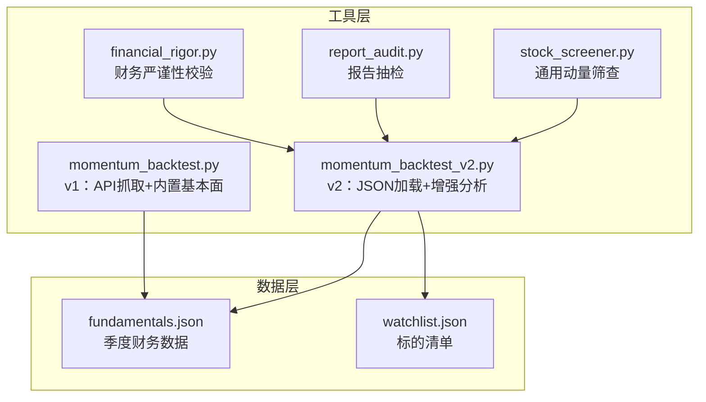
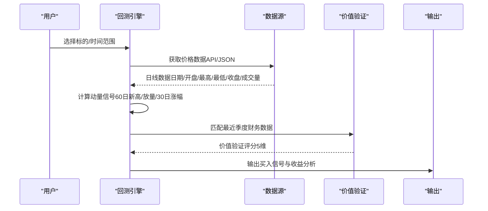
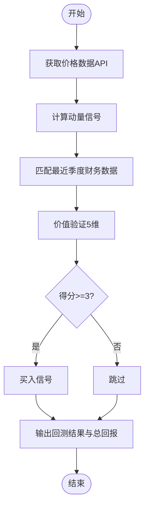
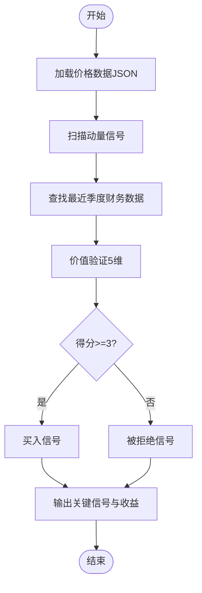
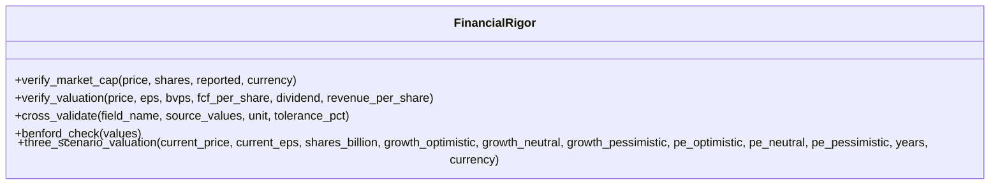
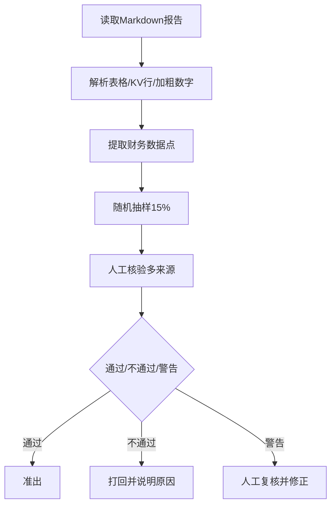
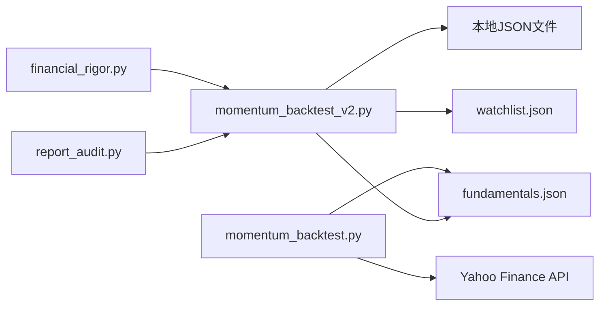

# 动量回测系统

<cite>
**本文档引用的文件**
- [momentum_backtest.py](file://tools/momentum_backtest.py)
- [momentum_backtest_v2.py](file://tools/momentum_backtest_v2.py)
- [financial_rigor.py](file://tools/financial_rigor.py)
- [report_audit.py](file://tools/report_audit.py)
- [fundamentals.json](file://data/fundamentals.json)
- [watchlist.json](file://data/watchlist.json)
- [stock_screener.py](file://tools/stock_screener.py)
</cite>

## 目录
1. [简介](#简介)
2. [项目结构](#项目结构)
3. [核心组件](#核心组件)
4. [架构总览](#架构总览)
5. [详细组件分析](#详细组件分析)
6. [依赖关系分析](#依赖关系分析)
7. [性能考量](#性能考量)
8. [故障排查指南](#故障排查指南)
9. [结论](#结论)
10. [附录](#附录)

## 简介
本项目提供一套动量回测系统，结合“动量发现 + 价值验证”的双引擎策略，用于在AI芯片浪潮（NVDA/AMD/MU）期间识别潜在入场点，并通过历史数据验证策略的有效性。系统包含v1与v2两个版本，分别展示了从API抓取到本地JSON加载、从单一标的到多标的扩展、以及从简单回测到更完善的分析流程的演进。

## 项目结构
- tools：核心回测与辅助工具
  - momentum_backtest.py：v1版本，基于Yahoo Finance API抓取价格数据，内置基本面数据
  - momentum_backtest_v2.py：v2版本，从JSON文件加载价格数据，增强价值验证与分析
  - financial_rigor.py：财务严谨性校验工具，支持市值、估值、多源交叉验证、Benford定律检测、三情景估值等
  - report_audit.py：研究报告数据抽检工具，支持从Markdown提取财务数据点并抽样核验
  - stock_screener.py：通用动量筛查工具（可复用到回测框架）
- data：基础数据文件
  - fundamentals.json：标准化的季度财务数据
  - watchlist.json：标的清单（AI芯片、AI应用、AI基建等）
- reports：研究与分析报告（用于配合回测与审计）

图表来源
- [momentum_backtest.py:1-361](file://tools/momentum_backtest.py#L1-L361)
- [momentum_backtest_v2.py:1-398](file://tools/momentum_backtest_v2.py#L1-L398)
- [financial_rigor.py:1-452](file://tools/financial_rigor.py#L1-L452)
- [report_audit.py:1-523](file://tools/report_audit.py#L1-L523)
- [fundamentals.json:1-36](file://data/fundamentals.json#L1-L36)
- [watchlist.json:1-38](file://data/watchlist.json#L1-L38)

章节来源
- [momentum_backtest.py:1-361](file://tools/momentum_backtest.py#L1-L361)
- [momentum_backtest_v2.py:1-398](file://tools/momentum_backtest_v2.py#L1-L398)
- [fundamentals.json:1-36](file://data/fundamentals.json#L1-L36)
- [watchlist.json:1-38](file://data/watchlist.json#L1-L38)

## 核心组件
- 动量发现引擎：基于60日新高、成交量放大与30日涨幅的信号生成
- 价值验证引擎：基于季度财务数据的五维验证（营收加速、毛利率方向、EPS超预期、营收高增长、毛利率健康）
- 回测主逻辑：对单个标的进行完整回测，输出买入信号与收益分析
- v2增强功能：从JSON加载价格数据、更清晰的分析流程、手动分析NVDA关键节点
- 财务严谨性工具：支持多种估值指标验算、多源交叉验证、Benford定律检测
- 报告抽检工具：自动从Markdown提取财务数据点并抽样核验

章节来源
- [momentum_backtest.py:112-145](file://tools/momentum_backtest.py#L112-L145)
- [momentum_backtest_v2.py:92-112](file://tools/momentum_backtest_v2.py#L92-L112)
- [momentum_backtest_v2.py:130-159](file://tools/momentum_backtest_v2.py#L130-L159)
- [momentum_backtest_v2.py:166-245](file://tools/momentum_backtest_v2.py#L166-L245)
- [financial_rigor.py:61-91](file://tools/financial_rigor.py#L61-L91)
- [financial_rigor.py:98-160](file://tools/financial_rigor.py#L98-L160)
- [report_audit.py:155-226](file://tools/report_audit.py#L155-L226)

## 架构总览
系统采用模块化设计，v1与v2在数据来源与分析流程上有所差异，但核心思想一致：先用动量信号捕捉突破，再用价值验证过滤噪音，最后进行收益回测与总结。

图表来源
- [momentum_backtest.py:207-324](file://tools/momentum_backtest.py#L207-L324)
- [momentum_backtest_v2.py:166-245](file://tools/momentum_backtest_v2.py#L166-L245)

## 详细组件分析

### v1版本（momentum_backtest.py）
- 数据获取：通过Yahoo Finance Chart API按日获取价格序列，构造统一格式
- 动量信号：遍历价格序列，计算60日新高、5日均量/20日均量放量阈值、30日涨幅
- 价值验证：基于内置季度财务数据，构建五维验证规则并计算得分
- 回测主流程：对单个标的执行完整回测，输出买入信号与总回报

图表来源
- [momentum_backtest.py:19-47](file://tools/momentum_backtest.py#L19-L47)
- [momentum_backtest.py:112-145](file://tools/momentum_backtest.py#L112-L145)
- [momentum_backtest.py:152-200](file://tools/momentum_backtest.py#L152-L200)
- [momentum_backtest.py:207-324](file://tools/momentum_backtest.py#L207-L324)

章节来源
- [momentum_backtest.py:19-47](file://tools/momentum_backtest.py#L19-L47)
- [momentum_backtest.py:112-145](file://tools/momentum_backtest.py#L112-L145)
- [momentum_backtest.py:152-200](file://tools/momentum_backtest.py#L152-L200)
- [momentum_backtest.py:207-324](file://tools/momentum_backtest.py#L207-L324)

### v2版本（momentum_backtest_v2.py）
- 数据获取：从JSON文件加载价格数据，兼容本地缓存与第三方数据
- 动量信号：与v1相同，但阈值略有调整（放量倍数1.5）
- 价值验证：增强规则，支持与上一季度对比，提高对“趋势改善”的敏感度
- 回测主流程：输出买入信号、被拒绝信号示例、收益计算
- NVDA手动分析：针对API受限情况，提供关键价格节点与验证过程

图表来源
- [momentum_backtest_v2.py:71-85](file://tools/momentum_backtest_v2.py#L71-L85)
- [momentum_backtest_v2.py:92-112](file://tools/momentum_backtest_v2.py#L92-L112)
- [momentum_backtest_v2.py:119-159](file://tools/momentum_backtest_v2.py#L119-L159)
- [momentum_backtest_v2.py:166-245](file://tools/momentum_backtest_v2.py#L166-L245)

章节来源
- [momentum_backtest_v2.py:71-85](file://tools/momentum_backtest_v2.py#L71-L85)
- [momentum_backtest_v2.py:92-112](file://tools/momentum_backtest_v2.py#L92-L112)
- [momentum_backtest_v2.py:119-159](file://tools/momentum_backtest_v2.py#L119-L159)
- [momentum_backtest_v2.py:166-245](file://tools/momentum_backtest_v2.py#L166-L245)

### 价值验证引擎（v1与v2对比）
- v1：直接比较当前季度与上一季度，强调“趋势改善”
- v2：规则更明确，支持“毛利率持续改善”与“EPS超预期幅度”等维度
- 共同点：均以季度财务数据为基础，构建可量化的评分体系

章节来源
- [momentum_backtest.py:164-200](file://tools/momentum_backtest.py#L164-L200)
- [momentum_backtest_v2.py:130-159](file://tools/momentum_backtest_v2.py#L130-L159)

### 财务严谨性工具（financial_rigor.py）
- 市值验算：股价×总股本 vs 报告市值，支持容差判断
- 估值指标验算：PE/PB/PS/FCF Yield等，使用十进制避免浮点误差
- 多源交叉验证：对同一指标在多个来源间进行一致性检验
- Benford定律检测：快速筛查财务数据异常
- 三情景估值：基于乐观/中性/悲观情景的目标价计算

图表来源
- [financial_rigor.py:61-91](file://tools/financial_rigor.py#L61-L91)
- [financial_rigor.py:98-160](file://tools/financial_rigor.py#L98-L160)
- [financial_rigor.py:167-204](file://tools/financial_rigor.py#L167-L204)
- [financial_rigor.py:214-281](file://tools/financial_rigor.py#L214-L281)
- [financial_rigor.py:320-361](file://tools/financial_rigor.py#L320-L361)

章节来源
- [financial_rigor.py:61-91](file://tools/financial_rigor.py#L61-L91)
- [financial_rigor.py:98-160](file://tools/financial_rigor.py#L98-L160)
- [financial_rigor.py:167-204](file://tools/financial_rigor.py#L167-L204)
- [financial_rigor.py:214-281](file://tools/financial_rigor.py#L214-L281)
- [financial_rigor.py:320-361](file://tools/financial_rigor.py#L320-L361)

### 报告抽检工具（report_audit.py）
- 从Markdown报告中提取财务数据点，支持表格、KV行、加粗数字等多种结构
- 随机抽样15%（3-30个）进行核验，支持固定随机种子复现
- 输出准出/打回判决，包含偏差分析与改进建议

图表来源
- [report_audit.py:155-226](file://tools/report_audit.py#L155-L226)
- [report_audit.py:229-236](file://tools/report_audit.py#L229-L236)
- [report_audit.py:253-398](file://tools/report_audit.py#L253-L398)

章节来源
- [report_audit.py:155-226](file://tools/report_audit.py#L155-L226)
- [report_audit.py:229-236](file://tools/report_audit.py#L229-L236)
- [report_audit.py:253-398](file://tools/report_audit.py#L253-L398)

### 通用动量筛查（stock_screener.py）
- 提供通用动量信号检查函数，便于集成到更大回测框架
- 支持60日新高、放量、30日涨幅与近期突破等条件

章节来源
- [stock_screener.py:122-165](file://tools/stock_screener.py#L122-L165)

## 依赖关系分析
- v1依赖：Python标准库（urllib、json、datetime），通过Yahoo API获取价格数据
- v2依赖：Python标准库（json、os、datetime），从本地JSON文件加载价格数据
- 数据依赖：fundamentals.json提供标准化季度财务数据；watchlist.json提供标的清单
- 工具依赖：financial_rigor.py与report_audit.py可作为回测与报告质量保障的辅助工具

图表来源
- [momentum_backtest.py:19-47](file://tools/momentum_backtest.py#L19-L47)
- [momentum_backtest_v2.py:71-85](file://tools/momentum_backtest_v2.py#L71-L85)
- [momentum_backtest_v2.py:350-364](file://tools/momentum_backtest_v2.py#L350-L364)
- [fundamentals.json:1-36](file://data/fundamentals.json#L1-L36)
- [watchlist.json:1-38](file://data/watchlist.json#L1-L38)
- [financial_rigor.py:1-452](file://tools/financial_rigor.py#L1-L452)
- [report_audit.py:1-523](file://tools/report_audit.py#L1-L523)

章节来源
- [momentum_backtest.py:19-47](file://tools/momentum_backtest.py#L19-L47)
- [momentum_backtest_v2.py:71-85](file://tools/momentum_backtest_v2.py#L71-L85)
- [momentum_backtest_v2.py:350-364](file://tools/momentum_backtest_v2.py#L350-L364)
- [fundamentals.json:1-36](file://data/fundamentals.json#L1-L36)
- [watchlist.json:1-38](file://data/watchlist.json#L1-L38)
- [financial_rigor.py:1-452](file://tools/financial_rigor.py#L1-L452)
- [report_audit.py:1-523](file://tools/report_audit.py#L1-L523)

## 性能考量
- v1通过API获取数据，网络延迟与限流可能影响稳定性；v2通过本地JSON加载，性能更稳定
- 动量信号计算复杂度为O(N×窗口)，其中N为交易日数量；可通过缓存与批处理优化
- 价值验证为O(1)级别的常数运算，对性能影响较小
- 建议：在大规模回测时，优先使用v2并结合本地数据缓存

## 故障排查指南
- Yahoo API受限：v1无法获取价格数据时，切换到v2并准备本地JSON数据
- 数据不一致：使用financial_rigor.py进行市值与估值指标验算，确保输入数据准确
- 报告数据可疑：使用report_audit.py从Markdown中提取数据点并抽样核验
- 财务数据异常：启用Benford定律检测，筛查潜在的人为调整

章节来源
- [momentum_backtest.py:45-47](file://tools/momentum_backtest.py#L45-L47)
- [financial_rigor.py:61-91](file://tools/financial_rigor.py#L61-L91)
- [report_audit.py:253-398](file://tools/report_audit.py#L253-L398)
- [financial_rigor.py:214-281](file://tools/financial_rigor.py#L214-L281)

## 结论
v1与v2版本展示了从API抓取到本地数据加载、从单一标的到多标的扩展、以及从简单回测到更完善的分析流程的演进。v2在数据来源稳定性、分析流程清晰度与可扩展性方面均有显著提升。结合financial_rigor.py与report_audit.py，可在回测之外进一步保证数据质量与报告可信度。

## 附录

### v1与v2的主要差异
- 数据来源：v1使用Yahoo API，v2使用本地JSON
- 价值验证：v2规则更明确，支持与上一季度对比
- 分析流程：v2提供更清晰的买入/拒绝信号输出与收益计算
- NVDA处理：v2提供手动分析流程，弥补API受限问题

章节来源
- [momentum_backtest.py:19-47](file://tools/momentum_backtest.py#L19-L47)
- [momentum_backtest_v2.py:71-85](file://tools/momentum_backtest_v2.py#L71-L85)
- [momentum_backtest_v2.py:119-159](file://tools/momentum_backtest_v2.py#L119-L159)
- [momentum_backtest_v2.py:166-245](file://tools/momentum_backtest_v2.py#L166-L245)

### 参数配置与扩展建议
- 动量参数：60日新高、放量倍数、30日涨幅阈值可根据市场风格调整
- 价值验证：可引入更多维度（如EBITDA、自由现金流等），并设置权重
- 风险控制：建议加入止损止盈、最大回撤限制与资金管理策略
- 结果可视化：可扩展为生成图表与报告，便于策略优化与演示