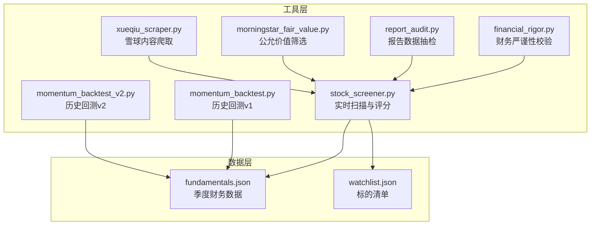
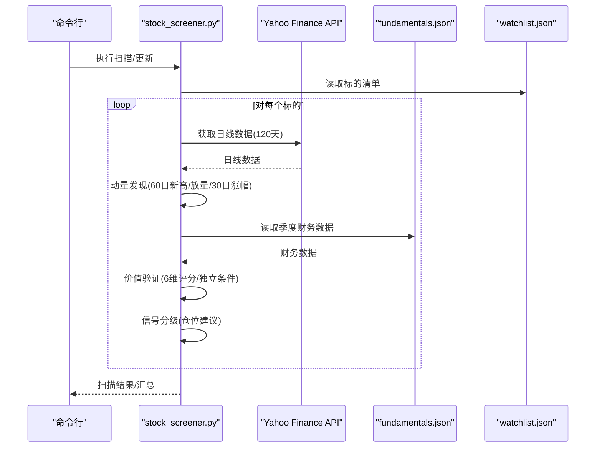
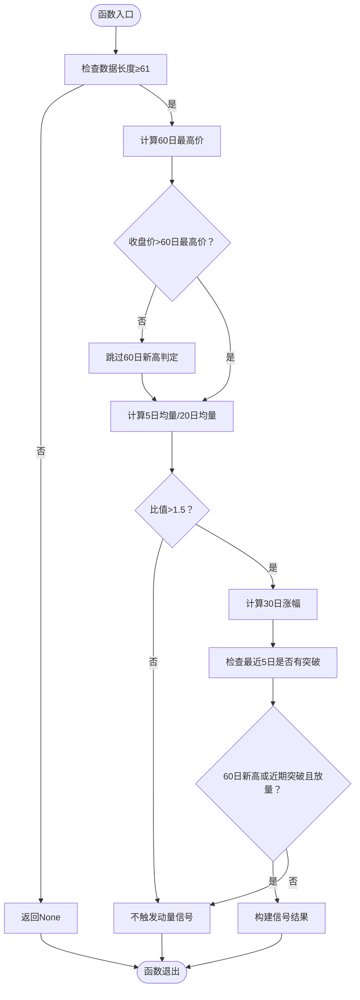
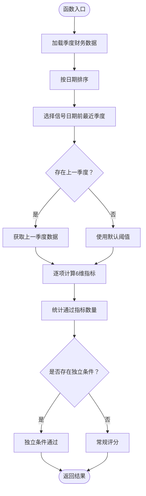
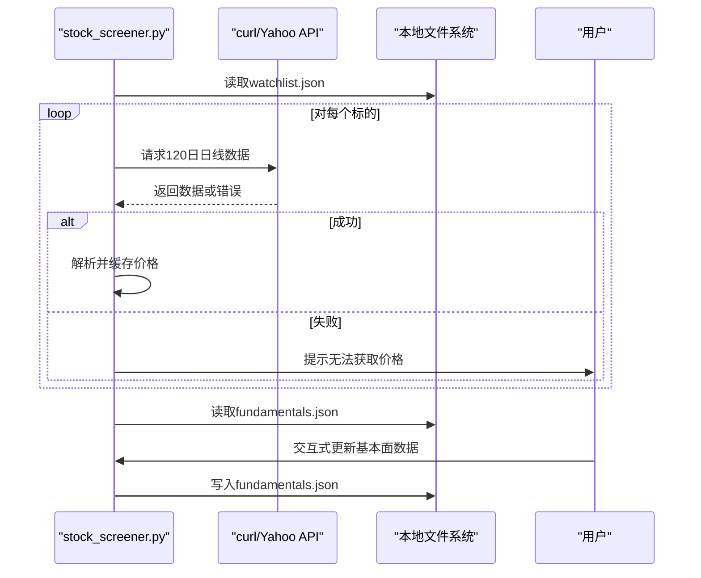
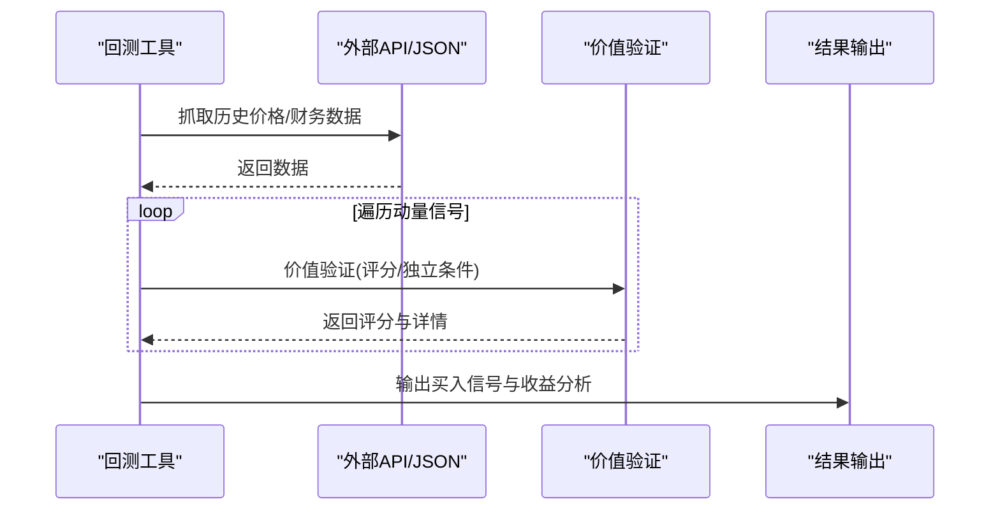
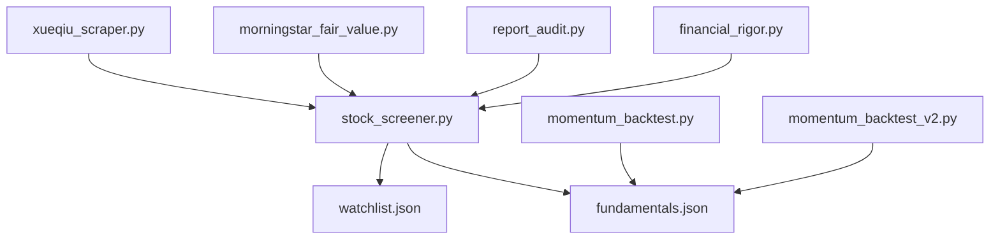

# 动量筛选器系统

<cite>
**本文档引用的文件**
- [stock_screener.py](file://tools/stock_screener.py)
- [momentum_backtest.py](file://tools/momentum_backtest.py)
- [momentum_backtest_v2.py](file://tools/momentum_backtest_v2.py)
- [financial_rigor.py](file://tools/financial_rigor.py)
- [report_audit.py](file://tools/report_audit.py)
- [morningstar_fair_value.py](file://tools/morningstar_fair_value.py)
- [xueqiu_scraper.py](file://tools/xueqiu_scraper.py)
- [fundamentals.json](file://data/fundamentals.json)
- [watchlist.json](file://data/watchlist.json)
</cite>

## 目录
1. [简介](#简介)
2. [项目结构](#项目结构)
3. [核心组件](#核心组件)
4. [架构概览](#架构概览)
5. [详细组件分析](#详细组件分析)
6. [依赖关系分析](#依赖关系分析)
7. [性能考虑](#性能考虑)
8. [故障排查指南](#故障排查指南)
9. [结论](#结论)
10. [附录](#附录)

## 简介
本项目提供一套完整的动量筛选器系统，融合“动量发现 + 价值验证”的双层筛选框架，旨在从海量标的中精准识别具备短期动能与长期价值支撑的优质股票。系统包含：
- 动量发现算法：60日新高检测、放量确认机制、30日涨幅计算
- 价值验证6维评分体系：营收加速、毛利率扩张、EPS超预期、营收高增长、毛利率健康、连续改善
- 信号分级与仓位配置策略：基于评分与独立条件的分级买入建议
- 数据获取流程：本地JSON缓存与外部API抓取
- 错误处理与性能优化：超时控制、断点续爬、容错降级
- 扩展开发指南：模块化设计、参数调优、API接口说明

## 项目结构
项目采用工具化与数据分离的组织方式，核心逻辑集中在 tools 目录，数据持久化在 data 目录，便于维护与扩展。



图表来源
- [stock_screener.py:1-402](file://tools/stock_screener.py#L1-L402)
- [momentum_backtest.py:1-361](file://tools/momentum_backtest.py#L1-L361)
- [momentum_backtest_v2.py:1-398](file://tools/momentum_backtest_v2.py#L1-L398)
- [financial_rigor.py:1-452](file://tools/financial_rigor.py#L1-L452)
- [report_audit.py:1-523](file://tools/report_audit.py#L1-L523)
- [morningstar_fair_value.py:1-153](file://tools/morningstar_fair_value.py#L1-L153)
- [xueqiu_scraper.py:1-434](file://tools/xueqiu_scraper.py#L1-L434)
- [fundamentals.json:1-36](file://data/fundamentals.json#L1-L36)
- [watchlist.json:1-38](file://data/watchlist.json#L1-L38)

章节来源
- [stock_screener.py:1-402](file://tools/stock_screener.py#L1-L402)
- [fundamentals.json:1-36](file://data/fundamentals.json#L1-L36)
- [watchlist.json:1-38](file://data/watchlist.json#L1-L38)

## 核心组件
- 动量发现引擎：基于60日新高、成交量放大与30日涨幅的三要素组合，形成初步信号池
- 价值验证引擎：6维评分体系，结合独立条件（毛利率连续改善、EPS超预期>30%）提升判准
- 信号分级与仓位策略：依据评分与独立条件给出试探仓、标准仓、确信仓的建议
- 数据管理：本地JSON缓存与外部API抓取，支持断点续爬与增量更新
- 财务严谨性与报告抽检：提供精确计算、交叉验证与抽检判决，保障数据质量

章节来源
- [stock_screener.py:118-277](file://tools/stock_screener.py#L118-L277)
- [momentum_backtest.py:108-201](file://tools/momentum_backtest.py#L108-L201)
- [momentum_backtest_v2.py:115-160](file://tools/momentum_backtest_v2.py#L115-L160)

## 架构概览
系统采用“数据获取 → 动量发现 → 价值验证 → 信号分级 → 结果输出”的流水线式架构，支持批量扫描与回测验证。



图表来源
- [stock_screener.py:283-326](file://tools/stock_screener.py#L283-L326)
- [stock_screener.py:48-78](file://tools/stock_screener.py#L48-L78)
- [stock_screener.py:84-116](file://tools/stock_screener.py#L84-L116)
- [stock_screener.py:122-161](file://tools/stock_screener.py#L122-L161)
- [stock_screener.py:167-249](file://tools/stock_screener.py#L167-L249)
- [stock_screener.py:256-277](file://tools/stock_screener.py#L256-L277)

## 详细组件分析

### 动量发现算法
- 60日新高检测：比较当日收盘价与过去60日最高价，确保突破的有效性
- 放量确认机制：近5日均量与20日均量的比值超过阈值（1.5），过滤噪音交易
- 30日涨幅计算：用于衡量短期动能，辅助信号强度评估
- 近期突破检测：在最近5日内的任意交易日出现突破，增强信号时效性



图表来源
- [stock_screener.py:122-161](file://tools/stock_screener.py#L122-L161)

章节来源
- [stock_screener.py:122-161](file://tools/stock_screener.py#L122-L161)

### 价值验证6维评分体系
- 营收加速：当存在上一季度数据时，比较当前与上季度营收同比增速；否则设定基准阈值
- 毛利率扩张：当存在上一季度数据时，比较当前与上季度毛利率；否则设定绝对阈值
- EPS超预期：阈值10%；针对周期股设置更高阈值（>30%）作为独立条件
- 营收高增长：阈值15%
- 毛利率健康：阈值40%
- 毛利率连续改善：连续两个季度递增，提升对周期性公司底部信号的敏感度



图表来源
- [stock_screener.py:167-249](file://tools/stock_screener.py#L167-L249)

章节来源
- [stock_screener.py:167-249](file://tools/stock_screener.py#L167-L249)

### 信号分级与仓位配置策略
- 评分≥5 或 (评分≥4 且独立条件通过)：确信仓（8%）
- 评分≥4 或 (评分≥3 且独立条件通过)：标准仓（5%）
- 评分≥3：试探仓（3%）
- 独立条件通过：即使评分不足，也给予试探仓建议
- 其他情况：继续观察或无信号

```mermaid
flowchart TD
Start(["函数入口"]) --> CheckTrigger{"动量是否触发？"}
CheckTrigger --> |否| Skip["SKIP"]
CheckTrigger --> |是| CheckValue{"是否存在价值评分？"}
CheckValue --> |否| Watch["WATCH"]
CheckValue --> |是| Score["获取评分与独立条件"]
Score --> Decide{"评分与独立条件组合"}
Decide --> |评分≥5 或 (评分≥4且独立)| Buy8["BUY_8%确信仓"]
Decide --> |评分≥4 或 (评分≥3且独立)| Buy5["BUY_5%标准仓"]
Decide --> |评分≥3| Buy3["BUY_3%试探仓"]
Decide --> |仅独立条件通过| Buy3Ind["BUY_3%独立条件"]
Decide --> |其他| Pass["PASS"]
Skip --> End(["返回"])
Watch --> End
Buy8 --> End
Buy5 --> End
Buy3 --> End
Buy3Ind --> End
Pass --> End
```

图表来源
- [stock_screener.py:256-277](file://tools/stock_screener.py#L256-L277)

章节来源
- [stock_screener.py:256-277](file://tools/stock_screener.py#L256-L277)

### 数据获取流程与缓存机制
- 价格数据：通过外部API获取120日日线数据，使用curl绕过SSL问题，超时控制与异常捕获
- 基本面数据：本地JSON文件缓存，支持交互式更新与断点续爬
- Watchlist：默认包含多个主题板块，支持自定义扩展
- 回测数据：历史回测支持从JSON文件加载价格数据或通过API抓取



图表来源
- [stock_screener.py:48-78](file://tools/stock_screener.py#L48-L78)
- [stock_screener.py:84-116](file://tools/stock_screener.py#L84-L116)
- [stock_screener.py:341-347](file://tools/stock_screener.py#L341-L347)

章节来源
- [stock_screener.py:48-116](file://tools/stock_screener.py#L48-L116)
- [stock_screener.py:341-347](file://tools/stock_screener.py#L341-L347)

### 回测工具与验证
- 历史回测v1：针对AI芯片三巨头（NVDA/AMD/MU），通过手动录入关键季度数据与API抓取日线数据，验证框架在AI浪潮早期的捕捉能力
- 历史回测v2：引入“毛利率连续改善”与“EPS超预期>30%”作为独立条件，显著提升对周期股底部信号的识别能力
- 公允价值筛选：从Morningstar筛选器API抓取公允价值估计，计算潜在涨幅并输出Top 100
- 报告抽检：从研究报告中随机抽取15%的数据点，与可靠信源比对，输出准出/打回判决



图表来源
- [momentum_backtest.py:207-324](file://tools/momentum_backtest.py#L207-L324)
- [momentum_backtest_v2.py:166-245](file://tools/momentum_backtest_v2.py#L166-L245)
- [morningstar_fair_value.py:47-150](file://tools/morningstar_fair_value.py#L47-L150)
- [report_audit.py:405-523](file://tools/report_audit.py#L405-L523)

章节来源
- [momentum_backtest.py:207-324](file://tools/momentum_backtest.py#L207-L324)
- [momentum_backtest_v2.py:166-245](file://tools/momentum_backtest_v2.py#L166-L245)
- [morningstar_fair_value.py:47-150](file://tools/morningstar_fair_value.py#L47-L150)
- [report_audit.py:405-523](file://tools/report_audit.py#L405-L523)

## 依赖关系分析
系统采用模块化设计，核心依赖关系如下：
- stock_screener.py 依赖 data 目录下的 fundamentals.json 与 watchlist.json
- 回测工具依赖内部硬编码的季度财务数据或外部API/JSON文件
- 财务严谨性与报告抽检工具为独立模块，可作为质量保障环节集成



图表来源
- [stock_screener.py:31-42](file://tools/stock_screener.py#L31-L42)
- [momentum_backtest.py:55-105](file://tools/momentum_backtest.py#L55-L105)
- [momentum_backtest_v2.py:21-64](file://tools/momentum_backtest_v2.py#L21-L64)
- [financial_rigor.py:1-16](file://tools/financial_rigor.py#L1-L16)
- [report_audit.py:1-22](file://tools/report_audit.py#L1-L22)
- [morningstar_fair_value.py:1-25](file://tools/morningstar_fair_value.py#L1-L25)
- [xueqiu_scraper.py:1-29](file://tools/xueqiu_scraper.py#L1-L29)

章节来源
- [stock_screener.py:31-42](file://tools/stock_screener.py#L31-L42)
- [momentum_backtest.py:55-105](file://tools/momentum_backtest.py#L55-L105)
- [momentum_backtest_v2.py:21-64](file://tools/momentum_backtest_v2.py#L21-L64)

## 性能考虑
- 数据获取优化
  - 使用curl绕过Python SSL问题，减少第三方库依赖
  - 设置超时控制与异常捕获，避免长时间阻塞
  - 对于回测场景，优先使用本地JSON缓存，降低API调用频率
- 计算复杂度
  - 动量发现：O(n)遍历日线数据，滑动窗口计算均量与最高价
  - 价值验证：O(1)常量时间评分，依赖已排序的季度数据
- 缓存与断点续爬
  - 基本面数据采用本地JSON缓存，支持交互式增量更新
  - 雪球爬虫支持断点续爬，避免重复抓取
- 内存与IO
  - 采用流式处理与分页抓取，控制内存占用
  - 输出CSV与JSON文件，便于后续分析与可视化

[本节为通用性能讨论，无需特定文件引用]

## 故障排查指南
- 价格数据获取失败
  - 检查网络连接与API可用性
  - 查看超时与异常日志，必要时更换代理或延时重试
- 基本面数据缺失
  - 使用交互式更新功能补充季度财务数据
  - 确认JSON格式正确，键值齐全
- 回测数据不完整
  - 对于NVDA等API受限标的，使用手动录入的历史价格节点
  - 对于AMD/MU，确保JSON文件存在且格式正确
- 报告抽检不通过
  - 检查抽样比例与容差设置
  - 核对主/副来源数据一致性，关注口径差异（GAAP/Non-GAAP、汇率）

章节来源
- [stock_screener.py:84-116](file://tools/stock_screener.py#L84-L116)
- [momentum_backtest_v2.py:252-334](file://tools/momentum_backtest_v2.py#L252-L334)
- [report_audit.py:246-398](file://tools/report_audit.py#L246-L398)

## 结论
本动量筛选器系统通过“动量发现 + 价值验证”的双层筛选，结合信号分级与仓位策略，在AI浪潮早期对NVDA/AMD/MU等标的实现了较高捕捉率。系统具备良好的扩展性与可维护性，支持本地缓存、断点续爬与精确计算，适合在实际投资研究中作为核心筛选工具。

[本节为总结性内容，无需特定文件引用]

## 附录

### API接口说明
- 动量发现接口
  - 输入：日线数据（至少120天）
  - 输出：动量信号（60日新高、放量、30日涨幅、近期突破）
- 价值验证接口
  - 输入：季度财务数据（营收同比、毛利率、EPS超预期）
  - 输出：6维评分与独立条件判断
- 信号分级接口
  - 输入：动量信号与价值评分
  - 输出：信号等级与仓位建议

章节来源
- [stock_screener.py:122-161](file://tools/stock_screener.py#L122-L161)
- [stock_screener.py:167-249](file://tools/stock_screener.py#L167-L249)
- [stock_screener.py:256-277](file://tools/stock_screener.py#L256-L277)

### 配置参数调优
- 动量参数
  - 60日窗口：可根据市场波动性调整
  - 放量阈值：1.5（回测版本放宽至1.8）
  - 30日涨幅：用于信号强度评估
- 价值参数
  - 营收加速阈值：20%（无上季度数据时）
  - 毛利率扩张阈值：50%（回测版本）
  - EPS超预期阈值：10%（独立条件：>30%）
  - 营收高增长阈值：15%
  - 毛利率健康阈值：40%
  - 连续改善：要求连续两个季度递增
- 信号分级
  - 评分阈值与独立条件组合决定仓位比例

章节来源
- [stock_screener.py:122-161](file://tools/stock_screener.py#L122-L161)
- [stock_screener.py:167-249](file://tools/stock_screener.py#L167-L249)
- [stock_screener.py:256-277](file://tools/stock_screener.py#L256-L277)

### 扩展开发指南
- 新增标的
  - 在 watchlist.json 中添加新的板块或标的
  - 确保价格数据可获取，基本面数据可维护
- 新增指标
  - 在价值验证模块中新增维度，并调整评分权重
  - 保持与现有独立条件的兼容性
- 集成外部数据源
  - 通过API适配器统一接入，保证数据格式一致性
  - 实现断点续爬与缓存策略
- 质量保障
  - 使用 financial_rigor.py 进行精确计算与交叉验证
  - 使用 report_audit.py 进行报告抽检，确保数据一致性

章节来源
- [stock_screener.py:31-42](file://tools/stock_screener.py#L31-L42)
- [financial_rigor.py:1-16](file://tools/financial_rigor.py#L1-L16)
- [report_audit.py:1-22](file://tools/report_audit.py#L1-L22)